# OPGAVER TIL GDevelop – INTRO

Velkommen! I denne første del gør du GDevelop klar, laver dit projekt og henter den grafik,
vi skal bruge til vores platformspil. Når du er færdig, er du klar til at bygge selve spillet.

Alle knapper i GDevelop står på engelsk. Derfor skriver vi knappernes navne **præcis som de
står på skærmen** — fx **Create new game** — mens forklaringerne er på dansk.

> 🟡 **Om billederne:** de gule kasser viser, hvor du skal klikke. Tallene i de gule cirkler
> passer til tallene i teksten, fx **(1)** og **(2)**.

---

## Før du starter — vælg din vej

Du kan bruge GDevelop på to måder. **Vælg én af dem**, og bliv ved den gennem hele kurset.
Vælg ikke begge — så ender du med to forskellige projekter, der ikke kender hinanden.

| | **A: I browseren** | **B: Programmet på din PC** |
|---|---|---|
| Skal installeres? | Nej | Ja, én gang |
| Kræver login? | **Ja** — gratis konto | Nej |
| Hvor gemmes spillet? | I skyen (GDevelop Cloud) | I en mappe på din PC |
| Virker uden internet? | Nej | Ja |
| Tegneprogrammet **Piskel** | Virker ikke | Virker |

**Billederne herunder er fra browseren.** Selve editoren ser ens ud i begge udgaver, så du
kan følge med, uanset hvad du vælger. Det eneste, der er rigtig forskelligt, er hvor spillet
bliver gemt.

> ⚠️ **Vigtigt om browseren:** du kan ikke lave et projekt uden at logge ind, og en gratis
> konto kan højst have **3 projekter i skyen** ad gangen. Skal en hel klasse i gang uden
> konti, så vælg **B**.

> 💡 **Står dine knapper på dansk?** Så passer de ikke til vejledningen. Gå til
> **Preferences** nederst i menuen til venstre, og sæt sproget til **English**.

---

## Opgave 1 – INTRO: Åbn GDevelop

### Valgte du A (browseren)?

1. Åbn din browser, og gå til **[editor.gdevelop.io](https://editor.gdevelop.io)**
2. Log ind, eller lav en gratis konto med knappen **Sign up** øverst til højre.

> 💡 Første gang spørger siden om lov til at bruge cookies og data. Du må gerne vælge
> **Do not consent** — GDevelop virker fint alligevel.

### Valgte du B (programmet på PC'en)?

1. Gå ind på **[gdevelop.io/download](https://gdevelop.io/download)**
2. Hent udgaven til **Windows**, og installér den.
3. Start **GDevelop** fra Start-menuen.

---

## Opgave 2 – INTRO: Lav dit første projekt

I menuen til venstre er der fem punkter: **Learn**, **Create**, **Play**, **Shop** og
**Teach**.

1. Vælg **Create** **(1)** i menuen til venstre.
2. Tryk på knappen **+ Create new game** **(2)** ude til højre.

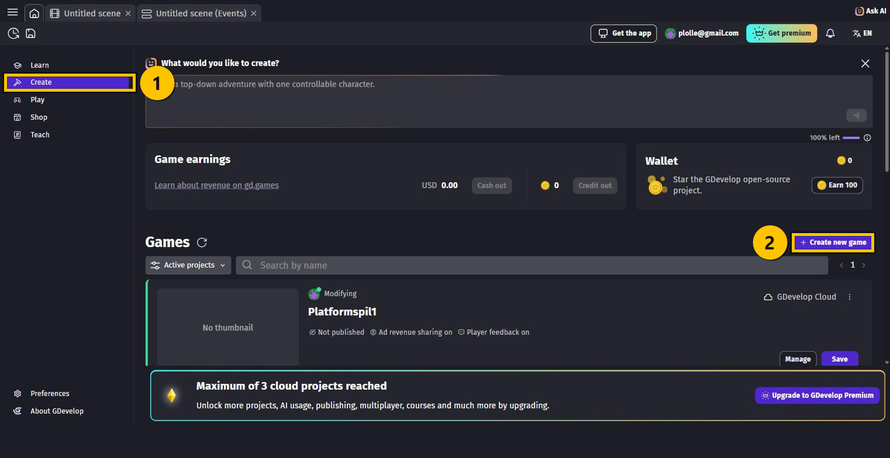

> 💡 Der er meget andet på siden — et felt der hedder **What would you like to create?**,
> hvor en robot kan lave spillet for dig, og en **Wallet** med mønter. Det skal vi ikke
> bruge. Vi bygger selv!

3. Nu åbner boksen **Create a new game**. Vælg **Empty project** — det tomme projekt.

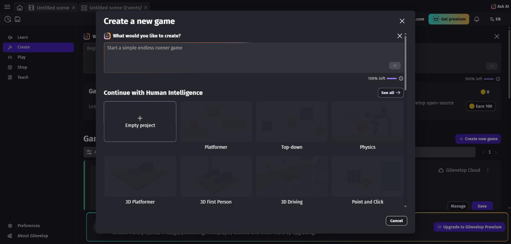

> ⚠️ Der ligger også en skabelon, der hedder **Platformer**. Den lyder rigtig — men vælg
> den **ikke**! Så er spillet nemlig lavet på forhånd, og så er der ikke noget tilbage at
> lære. Vi starter fra bunden.

4. Lad skærmstørrelsen stå på **Desktop & Mobile landscape (1280x720)**.
5. I feltet **Project name** **(1)** står der et tilfældigt navn, fx *Didactic Structure*.
   **Slet det**, og skriv i stedet: `Platformspil1`
6. **Where to store this project** **(2)**:
   - **A (browser):** lad den stå på **GDevelop Cloud**
   - **B (PC):** vælg din egen computer, og peg på en mappe, du kan finde igen
7. Tryk på **Create new game** **(3)**.

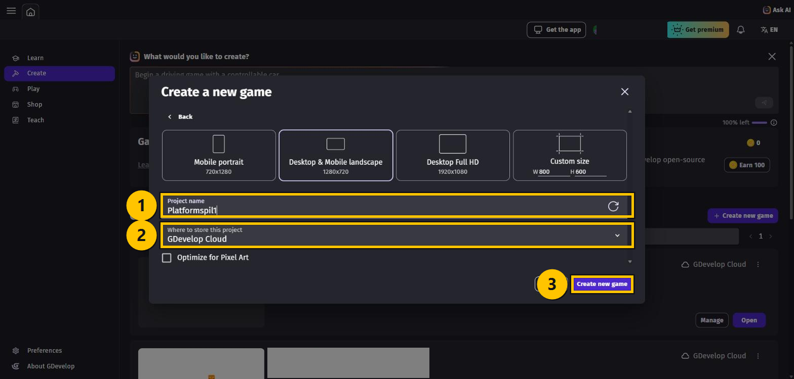

Nu åbner editoren, og du har en tom scene foran dig. Det er her, spillet skal bygges.

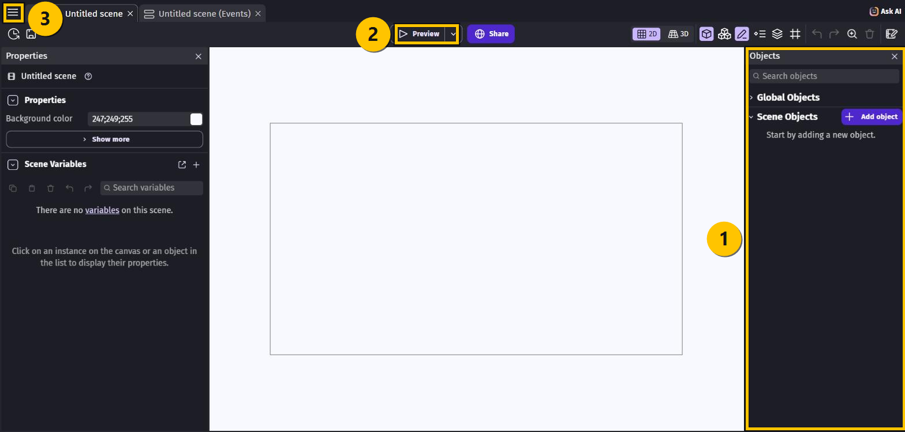

Læg mærke til de tre steder, du skal bruge hele kurset igennem:

- **(1)** **Objects**-panelet i **højre** side — her bor alle spillets figurer og klodser
- **(2)** **Preview**-knappen **øverst** — den starter spillet, så du kan prøve det
- **(3)** **☰**-knappen **helt oppe i venstre hjørne** — det er **Project manager**, hvor du
  gemmer og finder dine scener

---

## Opgave 3 – INTRO: Hent grafik til spillet

"Assets" er den grafik, spillet er bygget af: figuren, jorden, mønterne, stigen og så videre.
Dem henter vi færdige, så vi ikke selv skal tegne dem.

1. Find **Objects**-panelet i højre side.
2. Tryk på **+ Add object**.
3. Boksen **New object** åbner på fanen **Asset Store**.

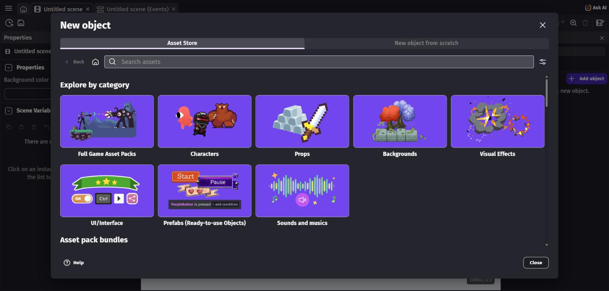

4. Skriv `GDevelop Platformer` i søgefeltet **Search assets**, og tryk **Enter**.
5. Øverst i resultatet ser du pakken **GDevelop Platformer** med **15 Assets**. Klik på den.

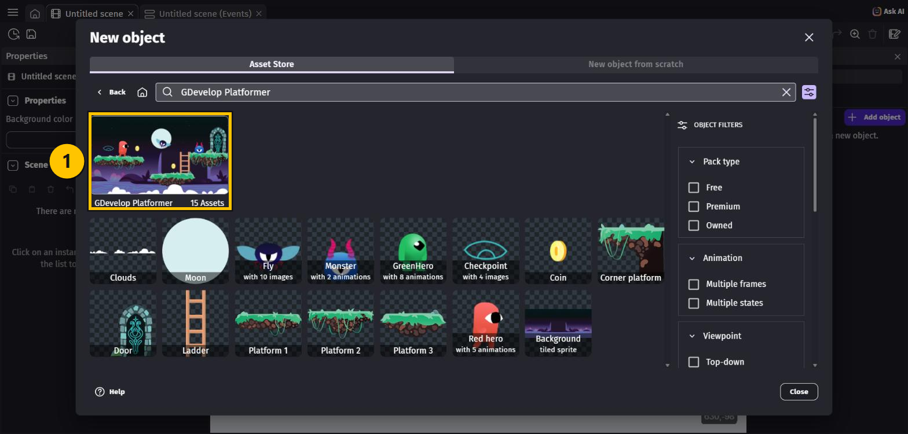

> ⚠️ Der findes flere platformer-pakker i **Asset Store**. De er også fine, men resten af
> kurset bruger grafikken fra **GDevelop Platformer**, så vælg den.

6. Nu ser du pakkens side. Den er lavet af GDevelop og er gratis (**CC0**).
7. Tryk på den blå knap nederst til højre: **Add these assets to my scene**.

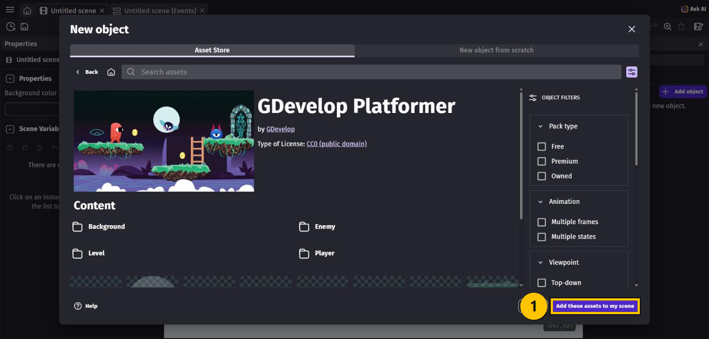

8. GDevelop spørger, om du er sikker: *"You're about to add 15 assets."*
   Tryk på **Add the assets**.

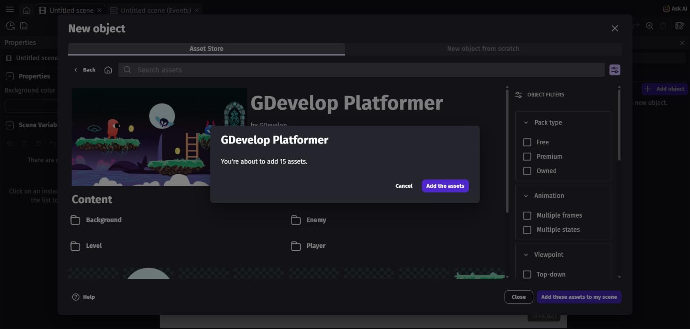

9. Tryk på **Close** for at lukke Asset Store igen.

**Sådan ved du, at det gik godt:** i **Objects**-panelet til højre står der nu 15 figurer
under **Scene Objects**:

`Monster` · `GreenHero` · `Moon` · `Clouds` · `Fly` · `Checkpoint` · `Coin` · `Door` ·
`Red_hero` · `Ladder` · `Corner_platform` · `Platform_1` · `Platform_2` · `Platform_3` ·
`Background`

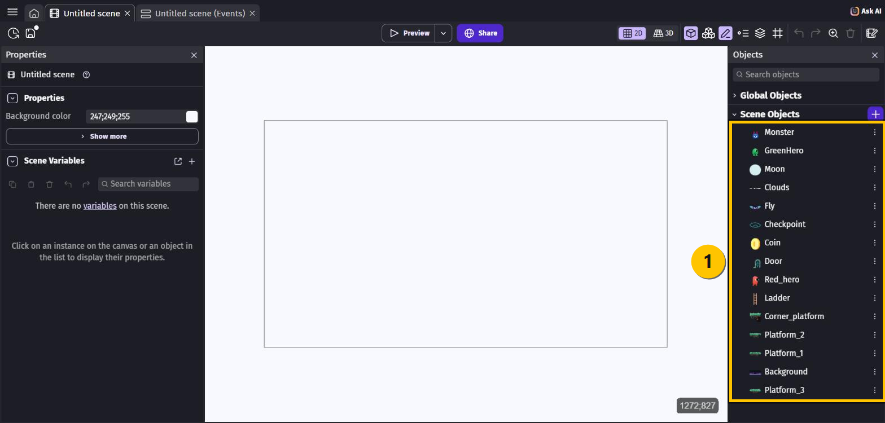

> 💡 Læg mærke til, at der er **to** helte: `Red_hero` og `GreenHero`. Vi bruger
> **`Red_hero`** i resten af kurset. Læg også mærke til understregerne i navnene —
> det hedder `Platform_1`, ikke `Platform1`.

---

## Opgave 4 – INTRO: Gem dit projekt

Den nemmeste måde: tryk **Ctrl + S**.

Du kan også gøre det gennem menuen:

1. Tryk på **☰** helt oppe i venstre hjørne. Nu åbner **Project manager**.

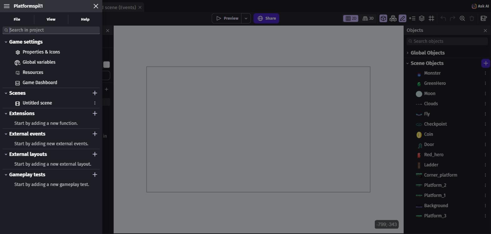

2. Vælg fanen **File** øverst.
3. Vælg **Save**.

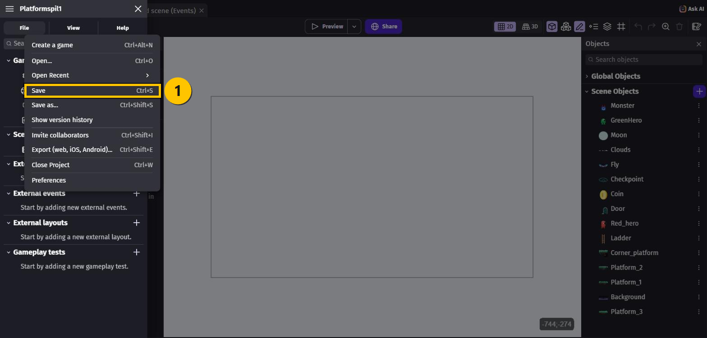

I samme menu finder du også:

- **Save as…** — gem en ekstra kopi under et nyt navn
- **Show version history** — se ældre udgaver af spillet, hvis noget går galt
- **Export (web, iOS, Android)…** — lav spillet færdigt, så andre kan spille det

> 💡 Gør det til en vane at trykke **Ctrl + S**, hver gang du har lavet noget, der virker.
> Så mister du aldrig mere end et par minutters arbejde.

**Sådan ved du, at det er gemt:** stjernen `*` efter projektets navn i fanen forsvinder.

---

## Prøv at det virker

Tryk på **Preview** øverst i værktøjslinjen. Spillet starter i et nyt vindue.

Der sker ingenting endnu — og det er helt rigtigt! Vi har kun *hentet* figurerne, ikke
*placeret* dem i scenen. Så længe vinduet åbner uden en fejlbesked, er alt som det skal være.
Luk vinduet igen.

---

## Du er færdig med INTRO ✅

Sæt et flueben ved hver ting, du har klaret:

- [ ] GDevelop er klar — i browseren eller på PC'en
- [ ] Jeg har et projekt, der hedder **Platformspil1**
- [ ] Alle 15 figurer fra **GDevelop Platformer** står i **Objects**-panelet
- [ ] Projektet er gemt
- [ ] **Preview** åbner uden fejl

**Nu skal vi i gang med at bygge vores spil!**

👉 Gå videre til **BEGYNDER**, hvor du lærer at sætte dine objekter ordentligt op med
*behaviors* og *collision masks*.

---

## Hvis noget går galt

| Problem | Løsning |
|---|---|
| Jeg kan ikke finde **+ Create new game** | Du står nok på **Learn**. Vælg **Create** i menuen til venstre først. |
| Knappen **Create new game** er grå og kan ikke trykkes | Du er ikke logget ind. I browseren skal du have en konto, før du kan lave et projekt. |
| Der står **Maximum of 3 cloud projects reached** | En gratis konto kan kun have 3 projekter i skyen. Slet et gammelt, eller brug programmet på PC'en. |
| Mine knapper er på dansk | Gå til **Preferences** nederst til venstre, og sæt sproget til **English**. |
| **Asset Store** er tom eller loader ikke | Den kræver internet — også i PC-udgaven. Tjek din forbindelse, og prøv igen. |
| Jeg valgte **Platformer**-skabelonen ved en fejl | Luk projektet, og start Opgave 2 forfra med **Empty project**. |
| Jeg kan ikke finde `RedHero` | Den hedder `Red_hero` med en understreg. |
| **Objects**-panelet er væk | Slå det til igen i **View**-menuen inde i **Project manager**. |

---

Opgaverne bygger på det oprindelige GDevelop-forløb fra
[mom2day.dk/gdevelop](https://mom2day.dk/gdevelop). 🙏
