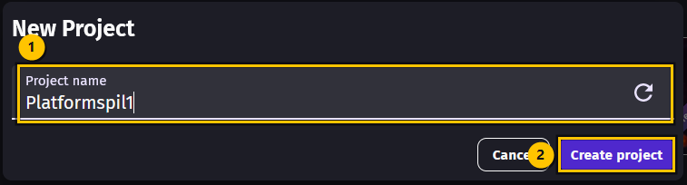
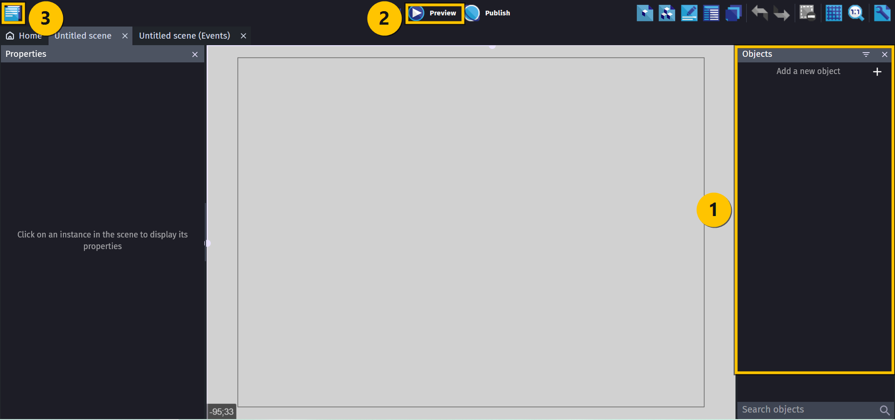
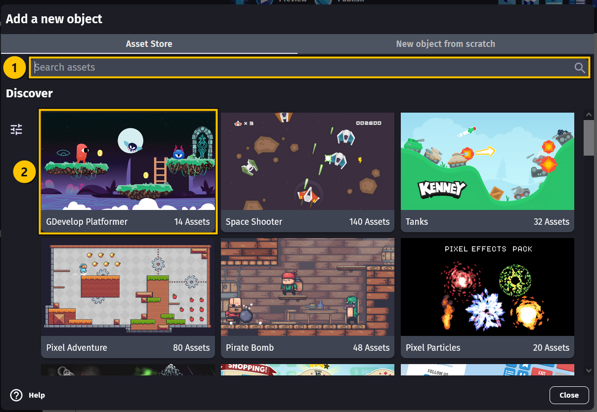
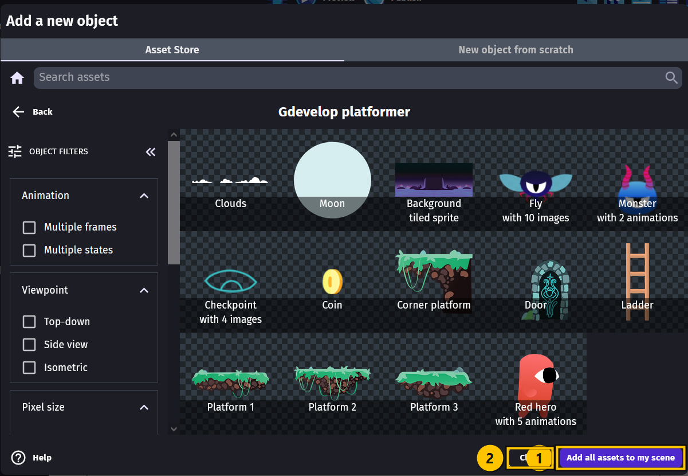
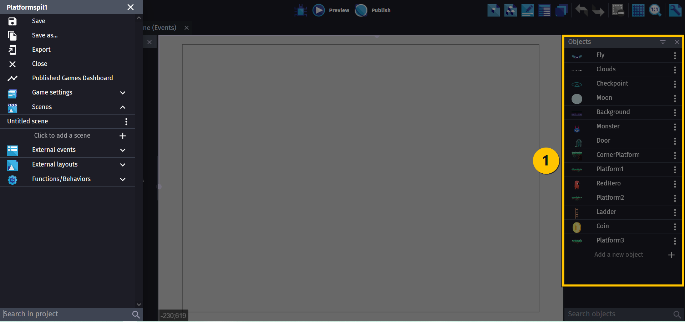
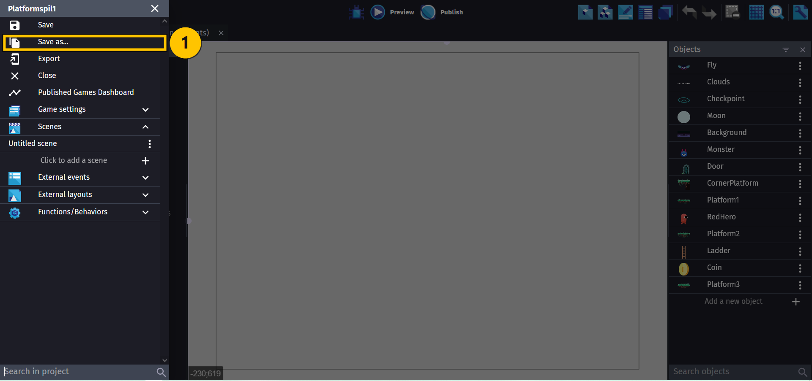
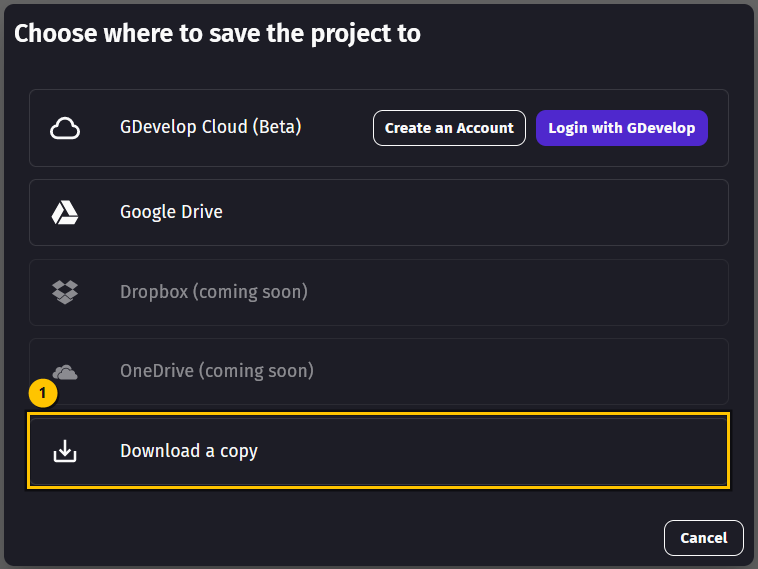
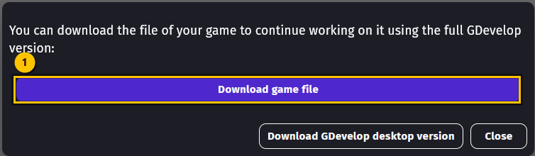

# OPGAVER TIL GDevelop – INTRO

Velkommen! I denne første del gør du GDevelop klar, laver dit projekt og henter den grafik,
vi skal bruge til vores platformspil. Når du er færdig, er du klar til at bygge selve spillet.

Alle knapper i GDevelop står på engelsk. Derfor skriver vi knappernes navne **præcis som de
står på skærmen** — fx **Create project** — mens forklaringerne er på dansk.

> 🟡 **Om billederne:** de gule kasser viser, hvor du skal klikke. Tallene i de gule cirkler
> passer til tallene i teksten, fx **(1)** og **(2)**, så du kan se præcis hvad der hører sammen.

---

## Før du starter — vælg din vej

Du kan bruge GDevelop på to måder. **Vælg én af dem**, og bliv ved den gennem hele kurset.
Vælg ikke begge — så ender du med to forskellige projekter, der ikke kender hinanden.

| | **A: Programmet på din PC** | **B: I browseren** |
|---|---|---|
| Skal installeres? | Ja, én gang | Nej |
| Kræver login? | Nej | Ja, hvis du vil gemme i skyen |
| Hvor gemmes spillet? | I en mappe på din PC | I skyen, eller som en fil du henter ned |
| Virker uden internet? | Ja | Nej |

> 💡 **Vi anbefaler A.** Så slipper du for at logge ind, og spillet ligger som en almindelig
> fil på maskinen, som du selv kan finde igen.

Selve editoren ser ens ud i begge udgaver, så billederne herunder passer, uanset hvad du vælger.

---

## Opgave 1 – INTRO: Åbn GDevelop

### Valgte du A (programmet på PC'en)?

1. Gå ind på **[gdevelop.io/download](https://gdevelop.io/download)**
2. Hent udgaven til **Windows**, og installér den.
3. Start **GDevelop** fra Start-menuen.

### Valgte du B (browseren)?

1. Åbn din browser, og gå til **[editor.gdevelop.io](https://editor.gdevelop.io)**
2. Det var hele installationen — editoren kører direkte i browseren.

Du ser nu GDevelops startskærm. I venstre side er der en menu med ikoner, bl.a.
**Get started**, **Build** (hammeren), **Shop**, **Learn** og **Play**.

---

## Opgave 2 – INTRO: Lav dit første projekt

1. Vælg **Build** (hammer-ikonet) i menuen til venstre.
2. Tryk på **Create a project**.
3. Vælg **Empty game**, så vi starter med et helt tomt spil.
   Vælg *ikke* en af de færdige skabeloner — vi skal selv bygge spillet op fra bunden.
4. Skriv navnet på dit projekt i feltet **Project name** **(1)**: `Platformspil1`
5. Vælg, hvor projektet skal gemmes:
   - **A (PC):** vælg din egen computer, og peg på en mappe, du kan finde igen,
     fx `Dokumenter\GDevelop\Platformspil1`
   - **B (browser):** vælg **GDevelop Cloud**, og log ind med en gratis GDevelop-konto
6. Tryk på **Create project** **(2)**.

Nu åbner editoren, og du har en tom scene foran dig. Det er her, spillet skal bygges.

Læg mærke til de tre steder, du skal bruge hele kurset igennem:

- **(1)** **Objects**-panelet i **højre** side — her bor alle spillets figurer og klodser
- **(2)** **Preview**-knappen **øverst** — den starter spillet, så du kan prøve det
- **(3)** Ikonet **helt oppe i venstre hjørne** (det med sider på) — det er
  **Project manager**, hvor du gemmer og finder dine scener

> 💡 Kan du ikke se din scene? Åbn **Project manager** i venstre hjørne, og dobbeltklik på
> scenen under **Scenes**.

---

## Opgave 3 – INTRO: Hent grafik til spillet

"Assets" er den grafik, spillet er bygget af: figuren, jorden, mønterne, stigen og så videre.
Dem henter vi færdige, så vi ikke selv skal tegne dem.

1. Find **Objects**-panelet i højre side.
2. Tryk på **Add a new object** (linjen med et **+**).
3. Boksen **Add a new object** åbner på fanen **Asset Store**.
4. Skriv `platformer` i søgefeltet **Search assets** **(1)**, eller find pakken på forsiden.
5. Vælg pakken **GDevelop Platformer** **(2)**. Den er gratis og lavet af GDevelop selv.

> ⚠️ Der findes flere platformer-pakker i **Asset Store** — fx *Pixel Adventure* og
> *Pixel Platformer*. De er også fine, men resten af kurset bruger grafikken fra
> **GDevelop Platformer**, så vælg den.

6. Nu ser du alle pakkens figurer: skyer, en måne, en baggrund, en flue, et monster,
   mønter, platforme, en stige, en dør og helten.
7. Tryk på den blå knap nederst i højre hjørne: **Add all assets to my scene** **(1)**.
8. Tryk på **Close** **(2)** for at lukke Asset Store igen.

**Sådan ved du, at det gik godt:** i **Objects**-panelet til højre står der nu en lang liste
med navne som `RedHero`, `Monster`, `Coin`, `Ladder`, `Door`, `Platform1`, `Platform2`,
`Platform3`, `CornerPlatform`, `Clouds`, `Moon`, `Background`, `Checkpoint` og `Fly`.

---

## Opgave 4 – INTRO: Gem dit projekt

### Valgte du A (programmet på PC'en)?

1. Tryk **Ctrl + S**, eller åbn **Project manager** i venstre hjørne og vælg **Save**.
2. Det var det! Projektet ligger i den mappe, du valgte i Opgave 2.

Så er du færdig med Opgave 4 — spring resten af siden over, og gå videre til **BEGYNDER**.

### Valgte du B (browseren)?

1. Tryk **Ctrl + S** for at gemme i skyen. Projektet følger din GDevelop-konto, så du kan
   åbne det igen på en anden computer.
2. Hent også en sikkerhedskopi ned på maskinen. Åbn **Project manager** i venstre hjørne,
   og vælg **Save as…**

3. Nu spørger GDevelop, hvor projektet skal gemmes. Vælg **Download a copy** nederst.

4. Tryk på **Download game file**, og luk derefter boksen med **Close**.

5. Filen ligger nu i mappen **Overførsler** (Downloads) på din PC. Den hedder typisk
   `Platformspil1.json` eller `game.json`.

> 💡 Gør det til en vane at trykke **Ctrl + S**, hver gang du har lavet noget, der virker.
> Så mister du aldrig mere end et par minutters arbejde.

---

## Prøv at det virker

Tryk på **Preview** øverst i værktøjslinjen. Spillet starter i et nyt vindue.

Der sker ingenting endnu — og det er helt rigtigt! Vi har kun *hentet* figurerne, ikke
*placeret* dem i scenen. Så længe vinduet åbner uden en fejlbesked, er alt som det skal være.
Luk vinduet igen.

---

## Du er færdig med INTRO ✅

Sæt et flueben ved hver ting, du har klaret:

- [ ] GDevelop er klar — på PC'en eller i browseren
- [ ] Jeg har et projekt, der hedder **Platformspil1**
- [ ] Alle figurerne fra **GDevelop Platformer** står i **Objects**-panelet
- [ ] Projektet er gemt et sted, jeg kan finde igen
- [ ] **Preview** åbner uden fejl

**Nu skal vi i gang med at bygge vores spil!**

👉 Gå videre til **BEGYNDER**, hvor du lærer at sætte dine objekter ordentligt op med
*behaviors* og *collision masks*.

---

## Hvis noget går galt

| Problem | Løsning |
|---|---|
| Jeg kan ikke finde **Create a project** | Du står nok på **Get started**. Vælg **Build** (hammeren) i menuen til venstre først. |
| **Asset Store** er tom eller loader ikke | Den kræver internet — også i PC-udgaven. Tjek din forbindelse, og prøv igen. |
| Jeg valgte en forkert skabelon | Luk projektet uden at gemme, og start Opgave 2 forfra med **Empty game**. |
| **Objects**-panelet er forsvundet | Slå det til igen i **View**-menuen. |
| Jeg kan ikke finde mit projekt igen | **A:** kig i mappen fra Opgave 2. **B:** log ind, og find det under **Build**. |
| Jeg trykkede **Add all assets to my scene** to gange | Så har du hver figur to gange. Slet dubletterne i **Objects**-panelet: højreklik på objektet, og vælg **Delete**. |
| Figurerne står ikke i scenen | Det er meningen! Vi placerer dem i næste del af kurset. |

---

Opgaverne bygger på det oprindelige GDevelop-forløb fra
[mom2day.dk/gdevelop](https://mom2day.dk/gdevelop). 🙏
