# OPGAVER TIL GDevelop – INTRO

> **VIDEN**
>
> I bokse med en hel kant står der, hvad du skal gøre. I bokse med en stiplet kant står der
> viden, som hjælper dig med at forstå det, du laver.
>
> På billederne viser gule kasser, hvor du skal klikke. Tallene i gule cirkler passer til
> tallene i trinene, fx **(1)** og **(2)**.
{: .lesson-info}

## Opgave 1 – Hent og åbn GDevelop

> **VIDEN**
>
> Vi bruger programmet på din computer. Så bliver spillet gemt på din computer. Du behøver
> ikke logge ind for at lave spillet.
{: .lesson-info}

> **GØR DETTE**
>
> 1. Gå til **[gdevelop.io/download](https://gdevelop.io/download)**.
> 2. Hent udgaven til **Windows**, og installér den.
> 3. Åbn **GDevelop** fra Start-menuen.
{: .lesson-action}

> **VIDEN**
>
> Knapperne i GDevelop står på engelsk. Vi skriver deres navne, som de står på skærmen.
> Det hjælper dig med at finde den rigtige knap.
{: .lesson-info}

> **GØR DETTE**
>
> Hvis dine knapper står på dansk:
> 1. Vælg **Preferences** nederst i menuen til venstre.
> 2. Vælg **English** som sprog.
{: .lesson-action}

> **VIDEN**
>
> Billederne i vejledningen er fra GDevelop i en browser. Programmet på din computer ser
> næsten ens ud. Du vælger kun et andet sted at gemme spillet i Opgave 2.
{: .lesson-info}

## Opgave 2 – Lav dit første spilprojekt

> **GØR DETTE**
>
> 1. Vælg **Create** **(1)** i menuen til venstre.
> 2. Vælg **+ Create new game** **(2)** til højre.
{: .lesson-action}

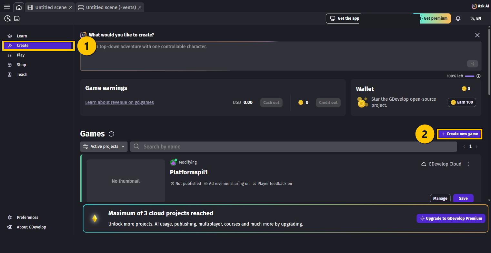

> **VIDEN**
>
> På siden er der også en robot, som kan lave et spil for dig, og en **Wallet** med mønter.
> De hører ikke til i denne lektion.
{: .lesson-info}

> **GØR DETTE**
>
> 1. Vælg **Empty project** — det tomme projekt.
> 2. Vælg ikke skabelonen **Platformer**.
{: .lesson-action}

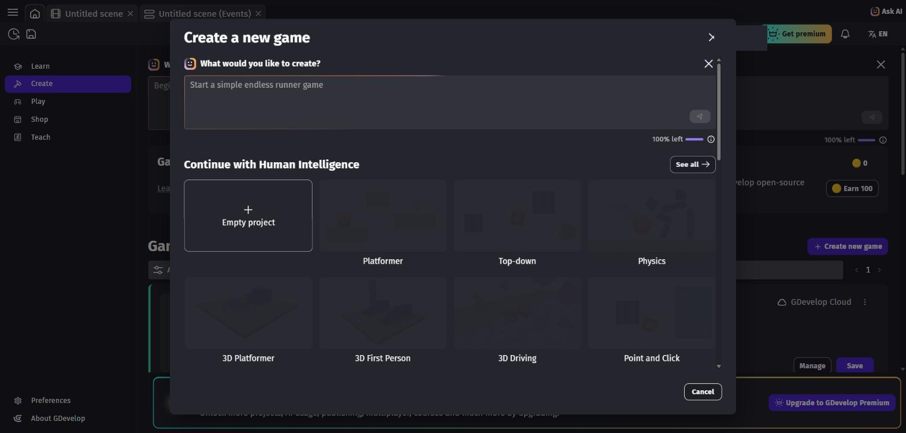

> **VIDEN**
>
> **Platformer** er et spil, der allerede er lavet. Vi starter med et tomt projekt, så du
> kan lære at bygge spillet selv.
{: .lesson-info}

> **GØR DETTE**
>
> 1. Lad skærmstørrelsen stå på **Desktop & Mobile landscape (1280x720)**.
> 2. Find feltet **Project name** **(1)**. Slet navnet, og skriv `Platformspil1`.
> 3. Find **Where to store this project** **(2)**. Vælg din egen computer.
> 4. Vælg en mappe, du kan finde igen, fx `Dokumenter\GDevelop`.
> 5. Vælg **Create new game** **(3)**.
{: .lesson-action}

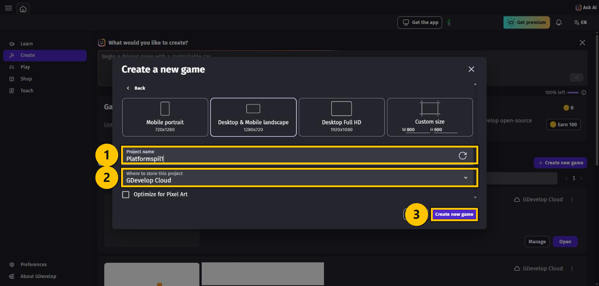

> **VIDEN**
>
> Billedet viser **GDevelop Cloud**, fordi det er taget i en browser. I programmet bliver
> spillet gemt på din egen computer.
{: .lesson-info}

> **VIDEN**
>
> Når editoren åbner, ser du en tom scene. En scene er det sted, hvor du bygger en bane.
{: .lesson-info}

> **VIDEN**
>
> Her er tre steder, du får brug for:
>
> - **(1)** **Objects** til højre — her finder du spillets figurer og klodser.
> - **(2)** **Preview** øverst — her prøver du spillet.
> - **(3)** **☰** øverst til venstre — her åbner du **Project manager**, hvor du finder dine scener.
{: .lesson-info}

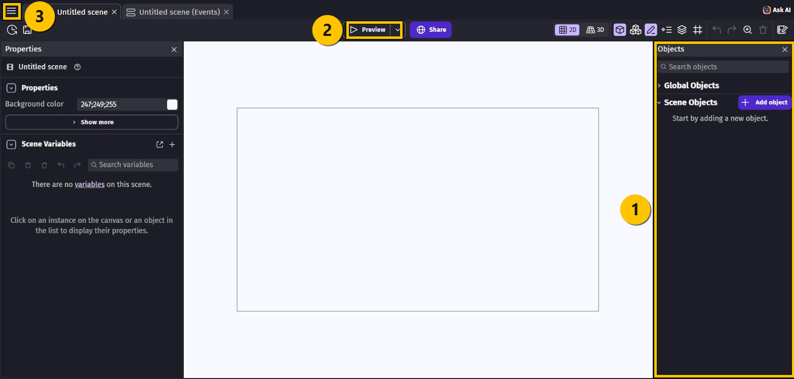

## Opgave 3 – Hent billeder til spillet

> **VIDEN**
>
> I spillet bruger vi billeder af helten, jorden, mønter og andre ting. De kaldes **assets**.
> Vi henter dem færdige, så du ikke selv skal tegne dem.
{: .lesson-info}

> **GØR DETTE**
>
> 1. Find **Objects**-feltet til højre.
> 2. Vælg **+ Add object**.
{: .lesson-action}

> **VIDEN**
>
> Boksen **New object** åbner.
{: .lesson-info}

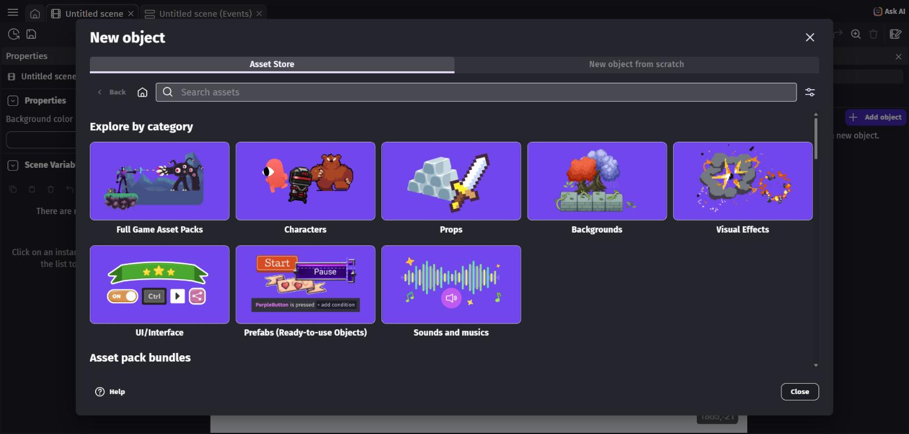

> **GØR DETTE**
>
> 1. Tjek, at fanen **Asset Store** er valgt.
> 2. Skriv `GDevelop Platformer` i feltet **Search assets**, og tryk **Enter**.
> 3. Vælg pakken **GDevelop Platformer** med **15 Assets**.
{: .lesson-action}

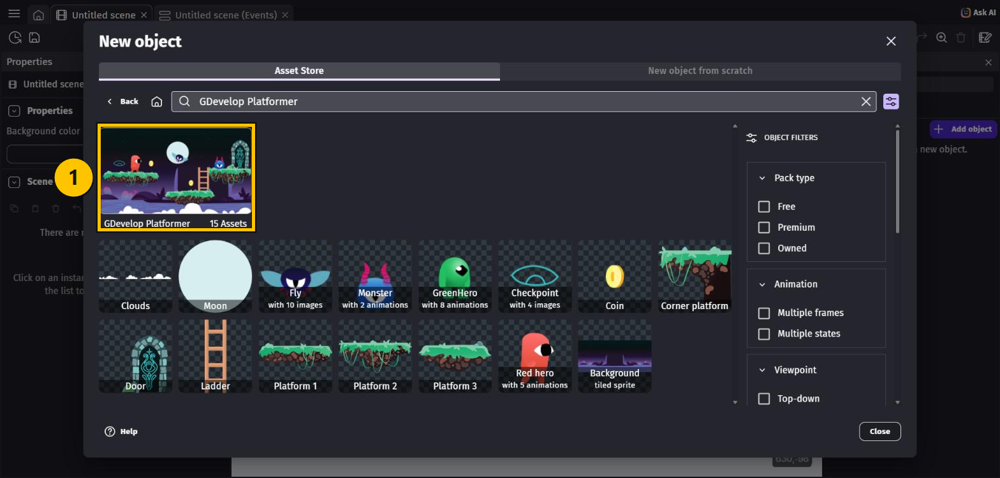

> **VIDEN**
>
> Der findes flere pakker til platformspil. **GDevelop Platformer** er den, vi bruger i
> resten af kurset.
{: .lesson-info}

> **GØR DETTE**
>
> 1. Vælg **Add these assets to my scene** nederst til højre.
> 2. Når GDevelop spørger, om du vil tilføje 15 assets, vælg **Add the assets**.
> 3. Vælg **Close** for at lukke Asset Store.
{: .lesson-action}

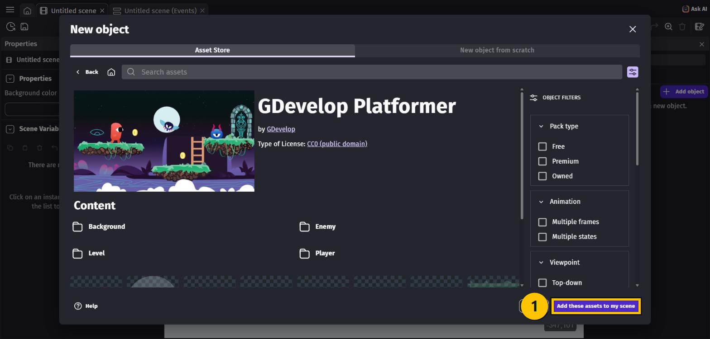

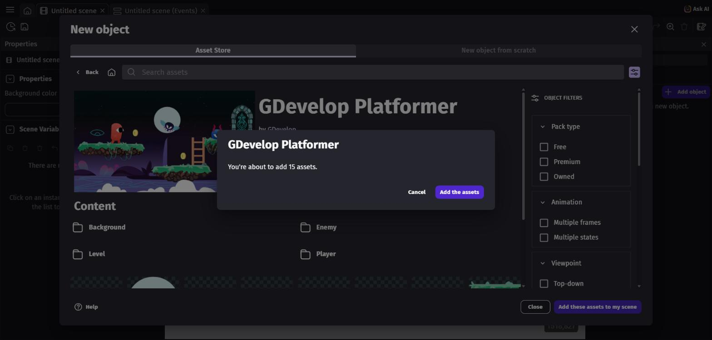

> **VIDEN**
>
> GDevelop har lavet pakken, og du må bruge den gratis (CC0). Når pakken er hentet, står der
> 15 navne under **Scene Objects** i **Objects**-feltet:
>
> `Monster` · `GreenHero` · `Moon` · `Clouds` · `Fly` · `Checkpoint` · `Coin` · `Door` ·
> `Red_hero` · `Ladder` · `Corner_platform` · `Platform_1` · `Platform_2` · `Platform_3` ·
> `Background`
{: .lesson-info}

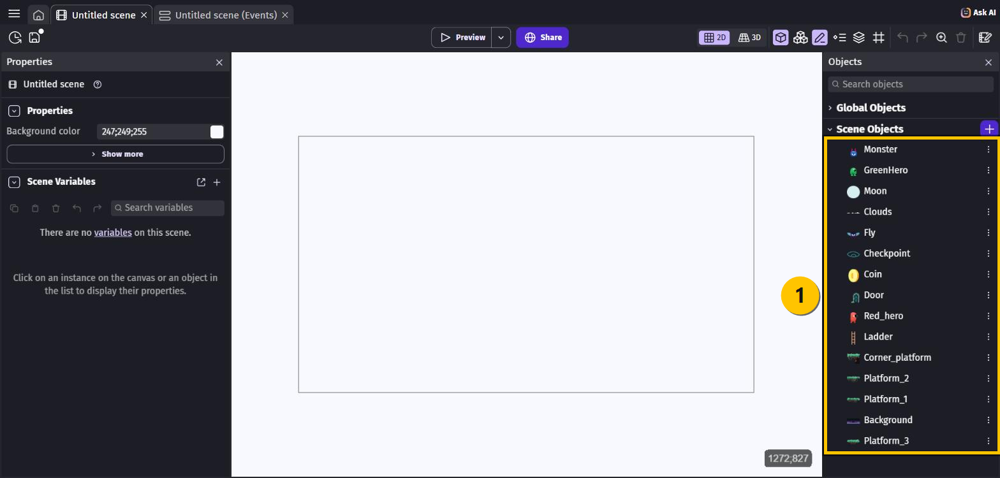

> **VIDEN**
>
> Der er to helte: `Red_hero` og `GreenHero`. Vi bruger `Red_hero` i kurset. Navnene er
> næsten ens, men `Platform_1` har en understreg, mens `Platform1` ikke har.
{: .lesson-info}

## Opgave 4 – Gem dit spil

> **GØR DETTE**
>
> Tryk på **Ctrl + S** for at gemme dit spil.
{: .lesson-action}

> **VIDEN**
>
> Du kan også gemme gennem menuen: **☰ → File → Save**.
{: .lesson-info}

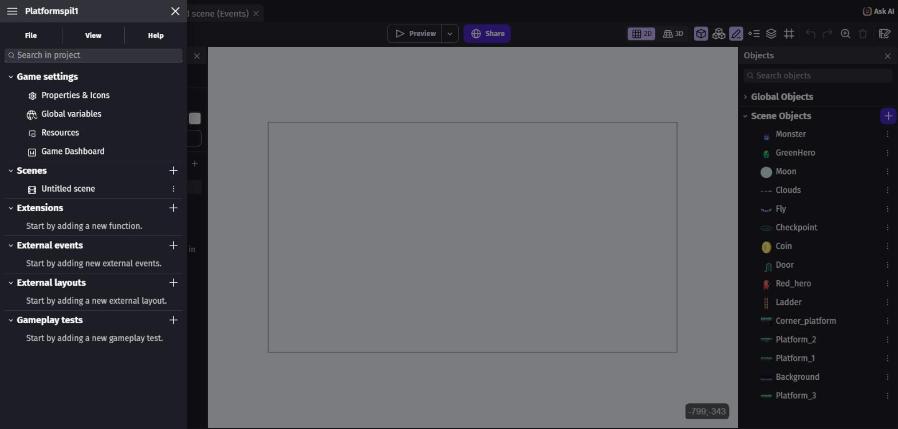

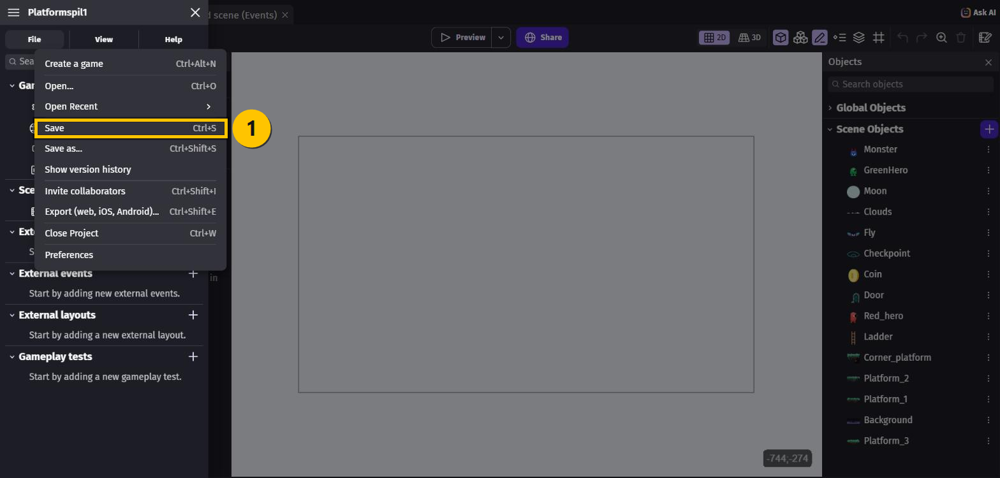

> **VIDEN**
>
> I menuen kan du også vælge:
>
> - **Save as…** — gemme en ekstra kopi med et nyt navn.
> - **Export (web, iOS, Android)…** — gøre spillet klar, så andre kan spille det.
>
> Det er en god idé at gemme, når du har lavet noget, der virker. Så mister du ikke så meget,
> hvis der sker en fejl.
>
> En stjerne `*` ved projektets navn betyder, at der er noget, du ikke har gemt endnu. Den
> forsvinder, når du gemmer. Spillet ligger i mappen, du valgte i Opgave 2. Mappen rummer
> hele spillet og billederne. Flyt hele mappen, hvis spillet skal flyttes.
{: .lesson-info}

## Prøv, om spillet virker

> **GØR DETTE**
>
> 1. Vælg **Preview** øverst.
> 2. Vent, til spillet åbner i et nyt vindue.
> 3. Luk vinduet igen.
{: .lesson-action}

> **VIDEN**
>
> Der sker ikke noget i spillet endnu. Det er helt fint. Vi har hentet figurerne, men ikke
> sat dem ind i banen. Det er nok, at spillet åbner uden en fejl.
{: .lesson-info}

## Du er færdig med INTRO

> **VIDEN**
>
> Du er klar til næste lektion, når alt dette passer:
>
> - GDevelop er på min computer.
> - Mit projekt hedder **Platformspil1**.
> - Jeg ved, hvilken mappe projektet ligger i.
> - Jeg kan se alle 15 assets i **Objects**-feltet.
> - Jeg har gemt projektet.
> - **Preview** åbner uden fejl.
{: .lesson-info}

> **VIDEN**
>
> Næste gang bygger du videre på spillet. Du lærer at give helten evner og at få ham til at
> gå og hoppe på platforme.
{: .lesson-info}

## Hvis noget går galt

| Problem | Prøv dette |
|---|---|
| Jeg kan ikke finde **+ Create new game**. | **GØR DETTE:** Vælg **Create** i menuen til venstre. |
| **Create new game** er grå. | **GØR DETTE:** Vælg din egen computer under **Where to store this project**. |
| GDevelop beder mig om at logge ind. | **GØR DETTE:** Gem på din egen computer. Du behøver ikke logge ind. |
| Knapperne står på dansk. | **GØR DETTE:** Vælg **Preferences** nederst til venstre, og vælg **English**. |
| Jeg kan ikke finde mit projekt. | **GØR DETTE:** Kig i mappen fra Opgave 2. Du kan også vælge **☰ → File → Open…**. |
| **Asset Store** er tom eller åbner ikke. | **GØR DETTE:** Tjek, at du har internet. Prøv så igen. |
| Jeg kom til at vælge **Platformer**. | **GØR DETTE:** Luk projektet. Start Opgave 2 igen, og vælg **Empty project**. |
| Jeg kan ikke finde `RedHero`. | **GØR DETTE:** Søg efter `Red_hero` med understreg. |
| **Objects**-feltet er væk. | **GØR DETTE:** Åbn **View** i **Project manager**, og slå **Objects** til. |
{: .lesson-help}

> **VIDEN**
>
> Opgaverne bygger på det oprindelige GDevelop-forløb fra
> [mom2day.dk/gdevelop](https://mom2day.dk/gdevelop).
{: .lesson-info}
