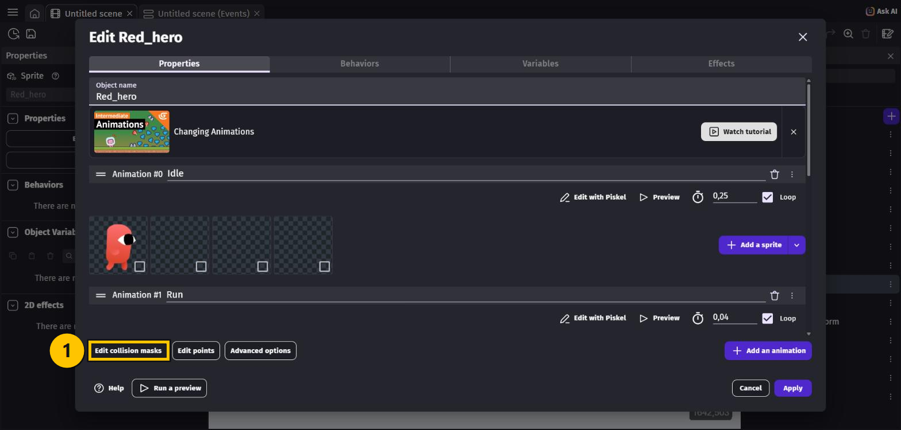
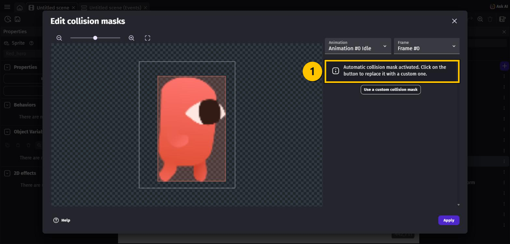
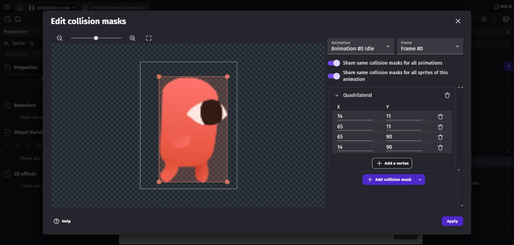
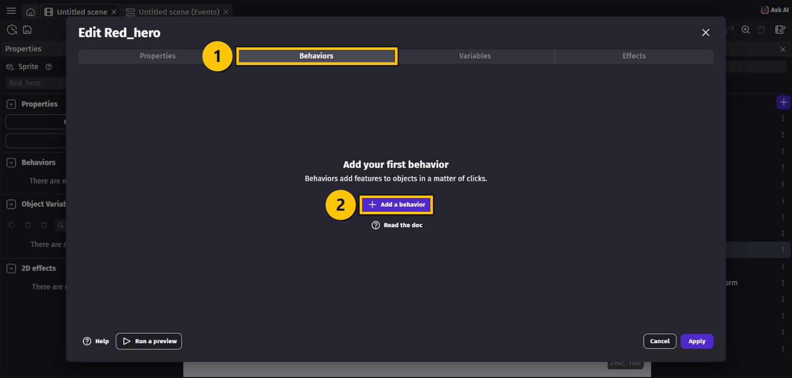
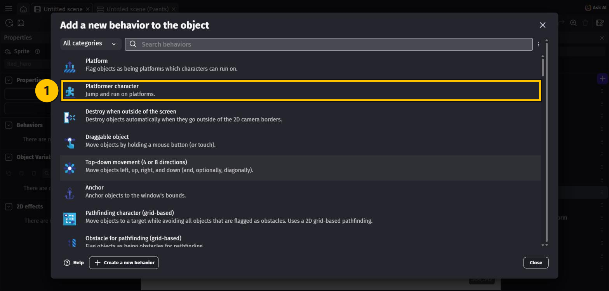
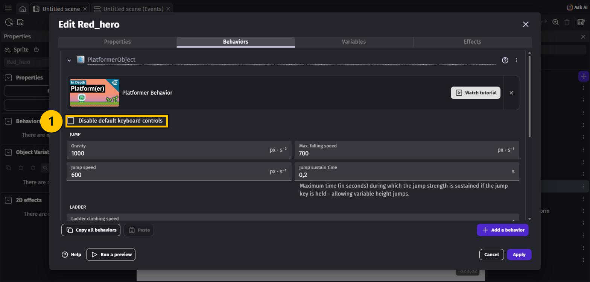
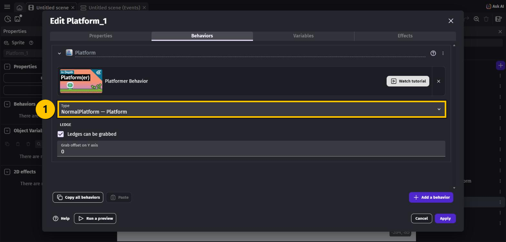
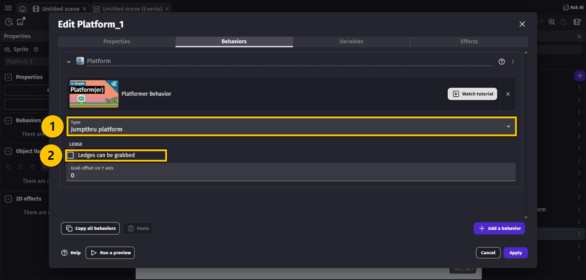

# OPGAVER TIL GDevelop – BEGYNDER

I sidste lektion hentede du alle figurerne. De ligger klar i **Objects**-panelet, men de kan
ingenting endnu — de er bare billeder.

I denne lektion giver vi dem **behaviors**, og til sidst kan din helt **løbe og hoppe på
platformene**. Uden at du skriver en eneste linje kode.

Knapperne i GDevelop står på engelsk, så vi skriver deres navne præcis som de står på
skærmen — fx **Apply** — mens forklaringerne er på dansk.

> 🟡 **Om billederne:** de gule kasser viser, hvor du skal klikke. Tallene i de gule cirkler
> passer til tallene i teksten.

---

## To ord du skal kende

**Behavior** — en færdiglavet evne, du kan hænge på et objekt. I stedet for selv at
programmere tyngdekraft, at løbe og at hoppe, giver vi helten behavioren
**Platformer character**, og så kan han det hele.

**Collision mask** — den usynlige form, spillet bruger til at mærke, om to ting rører
hinanden. Den skal helst følge figurens krop og ikke den tomme luft rundt om.
**Den gode nyhed: GDevelop laver den selv.** Du skal som regel slet ikke røre den.

---

## Opgave 1 – BEGYNDER: Åbn dit projekt igen

1. Åbn GDevelop, og vælg **Create** i menuen til venstre.
2. Find **Platformspil1** på listen under **Games**.
3. Tryk på **Open**.
4. Dobbeltklik på din scene, så du kan se den.

> 💡 Har du allerede projektet åbent i en fane foroven, kan du bare klikke på fanen.

---

## Opgave 2 – BEGYNDER: Kig på heltens collision mask

1. Find **`Red_hero`** i **Objects**-panelet til højre, og **dobbeltklik** på den.
2. Boksen **Edit Red_hero** åbner på fanen **Properties**.

Læg mærke til, at `Red_hero` allerede har flere animationer: **Idle** (står stille),
**Run** (løber) og **Jump** (hopper). Dem bruger vi senere.

3. Tryk på **Edit collision masks** nederst til venstre.
4. Der står **"Automatic collision mask activated."**

Det betyder, at GDevelop **selv** har lagt masken tæt om heltens krop. Kig på den røde
ramme om figuren — den passer allerede.

5. **Du skal ikke lave om på noget.** Luk boksen igen med krydset **✕** oppe i hjørnet.

> 💡 **Hvorfor er det vigtigt?** Hvis masken var en stor firkant om hele billedet, ville
> helten se ud til at svæve over jorden og blive ramt af fjender, der er langt væk. Før i
> tiden skulle man rette den i hånden. Det klarer GDevelop nu selv.

### Hvis du selv vil bestemme formen

Trykker du på **Use a custom collision mask**, får du en firkant med fire punkter
(**Quadrilateral**), som du kan trække i. Du kan tilføje flere punkter med **+ Add a vertex**.

> ⚠️ **Pas på skraldespanden!** Sletter du den firkant, du lige har lavet, får du **ikke**
> den automatiske maske tilbage — du får i stedet en stor firkant om hele billedet, og så
> svæver helten. Fortryder du, så tryk **Cancel** nederst i **Edit Red_hero** og svar
> **Cancel** til *"Cancel your changes?"*. Så er alt, som det var.

---

## Opgave 3 – BEGYNDER: Giv Red_hero evnen til at gå og hoppe

1. Du er stadig inde i **Edit Red_hero**. Vælg fanen **Behaviors** øverst.
2. Der står *"Add your first behavior"*. Tryk på **+ Add a behavior**.

3. Nu kommer en liste med alle de evner, du kan vælge.
4. Vælg **Platformer character** — der står *"Jump and run on platforms."* under den.

> ⚠️ **Pas på:** lige over den står der **Platform**. De to hedder næsten det samme, men er
> ikke det samme! **Platformer character** er *den der løber*. **Platform** er *det man
> løber på*. Din helt skal have **Platformer character**.

5. Nu kan du se behaviorens indstillinger: **Gravity**, **Jump speed** og et par mere.
   **Du behøver ikke at ændre noget.**
6. Læg mærke til feltet **Disable default keyboard controls**. Det skal **ikke** have et
   hak. Når det er tomt, virker piletasterne af sig selv — det er derfor, du ikke selv
   skal programmere styringen endnu.
7. Tryk **Apply** nederst til højre.

---

## Opgave 4 – BEGYNDER: Byg en lille bane

Din helt kan nu løbe og hoppe — men der er ikke noget at løbe på. Det laver vi.

1. **Træk `Red_hero` fra Objects-panelet ind på scenen.** Placér den oppe i luften.
2. **Træk `Platform_1` ind på scenen**, et stykke under helten.
3. Træk **to eller tre platforme mere** ind, i forskellig højde, så der er noget at hoppe
   op på.

> 💡 Du kan kopiere en platform hurtigt: klik på den, hold **Ctrl** nede, og træk. Så får
> du en kopi.

---

## Opgave 5 – BEGYNDER: Gør platformene til rigtige platforme

Lige nu falder helten lige gennem platformene, for spillet ved ikke, at man kan stå på dem.

1. **Dobbeltklik på `Platform_1`** i **Objects**-panelet.
2. Vælg fanen **Behaviors**, og tryk på **+ Add a behavior**.
3. Vælg denne gang **Platform** — den øverste, med teksten
   *"Flag objects as being platforms which characters can run on."*
4. I feltet **Type** står der nu **NormalPlatform — Platform**.

5. Klik på **Type**, og vælg **Jumpthru platform** i stedet.
6. **HUSK:** fjern hakket i **Ledges can be grabbed**. Ellers hænger din helt fast i
   kanterne, når han hopper forbi.
7. Tryk **Apply**.

> 💡 **Hvorfor Jumpthru platform?** Fordi man så kan hoppe *op igennem* en platform
> nedefra, men stadig lande oven på den. Det er sådan de fleste platformspil føles.

> 💡 I samme **Type**-menu findes også **Ladder**. Den skal `Ladder` have senere i kurset,
> så helten kan klatre op ad stigen.

---

## Opgave 6 – BEGYNDER: Gør det samme med de andre platforme

Nu skal `Platform_2`, `Platform_3` og `Corner_platform` have præcis samme behandling:

- Dobbeltklik på objektet
- **Behaviors** → **+ Add a behavior** → **Platform**
- **Type: Jumpthru platform**
- Fjern hakket i **Ledges can be grabbed**
- **Apply**

Du behøver kun at gøre det **én gang per objekt** — ikke for hver kopi, du har trukket ind
på scenen. Alle kopier af `Platform_1` deler samme indstillinger.

> 💡 Der er en genvej: åbn `Platform_1`, tryk **Copy all behaviors**, åbn så `Platform_2`
> og tryk **Paste**. Så slipper du for at sætte det hele op igen.

---

## Prøv spillet! 🎮

Tryk på **Preview** øverst.

Nu skulle du kunne:

- Gå til siderne med **venstre** og **højre piletast**
- Hoppe med **pil op**
- Lande oven på platformene i stedet for at falde igennem

Det er dit første spil, der virker. 🎉

Husk at gemme med **Ctrl + S**.

---

## Du er færdig med BEGYNDER ✅

- [ ] `Red_hero` har behavioren **Platformer character**
- [ ] **Disable default keyboard controls** har **ikke** et hak
- [ ] Der er en helt og nogle platforme på scenen
- [ ] Platformene har behavioren **Platform** med **Jumpthru platform**
- [ ] Hakket i **Ledges can be grabbed** er fjernet
- [ ] Helten kan løbe og hoppe i **Preview**

**Næste gang** koder vi selv med *events*, så du bestemmer alt, hvad der sker i spillet.

---

## Hvis noget går galt

| Problem | Løsning |
|---|---|
| Helten falder gennem platformene | Platformene mangler behavioren **Platform**. Eller helten har fået **Platform** i stedet for **Platformer character**. |
| Piletasterne gør ingenting | Tjek at **Disable default keyboard controls** er **tomt**. Klik også én gang inde i Preview-vinduet, så tastaturet lytter til spillet. |
| Helten svæver over jorden | Du har nok slettet den automatiske collision mask. Åbn **Edit collision masks** og se, om der står *"Automatic collision mask activated"*. Gør der ikke det, så tryk **Cancel** og prøv igen. |
| Helten hænger fast i kanten af en platform | Hakket i **Ledges can be grabbed** er ikke fjernet. |
| Helten falder ned i det uendelige | Der er ingen platform under ham. Træk en ind, eller flyt helten oven over en. |
| Jeg kan ikke finde `RedHero` | Den hedder `Red_hero` med en understreg. |
| Jeg kan ikke se mine ændringer | Du har måske glemt at trykke **Apply**, før du lukkede boksen. |

---

Opgaverne bygger på det oprindelige GDevelop-forløb fra
[mom2day.dk/gdevelop-begynder](https://mom2day.dk/gdevelop-begynder). 🙏
