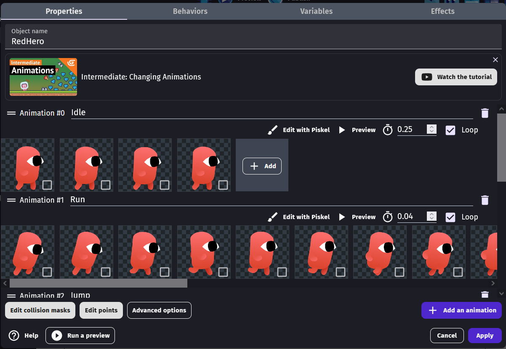
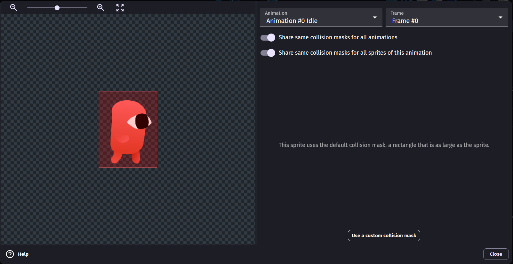
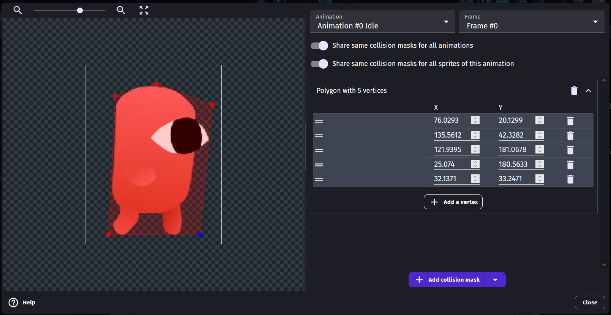
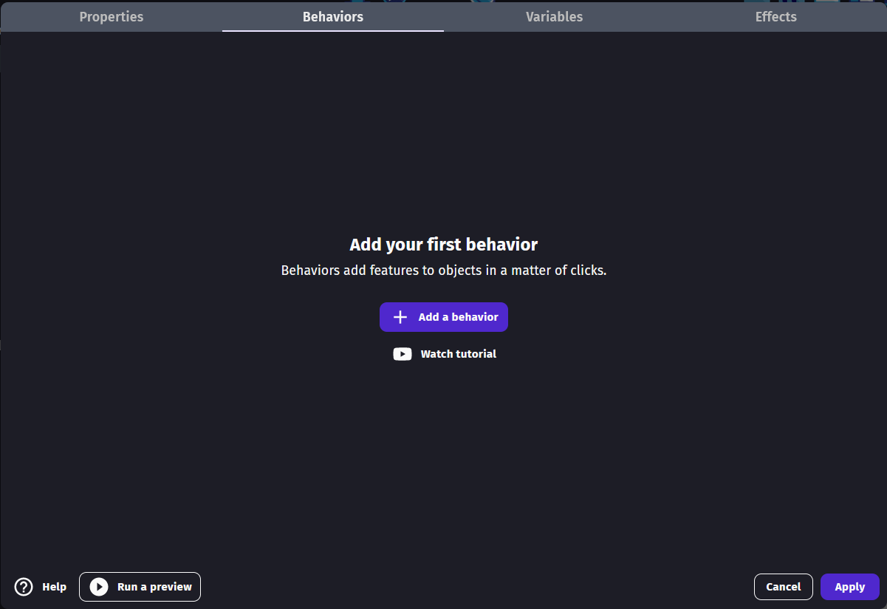
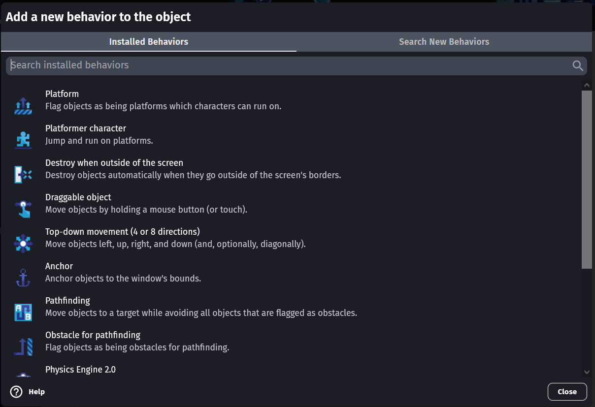
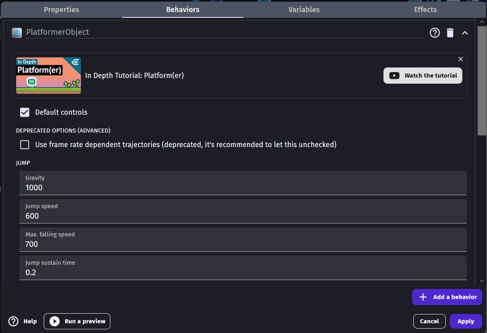
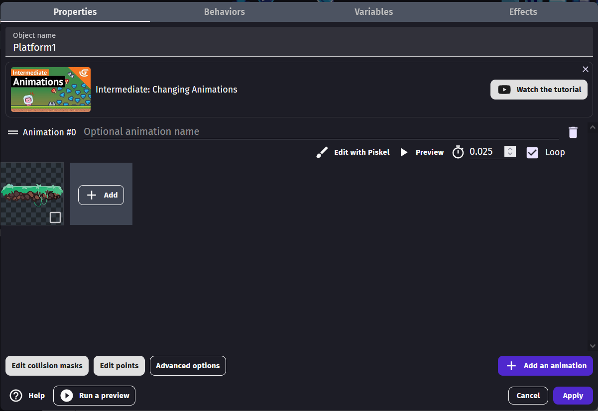
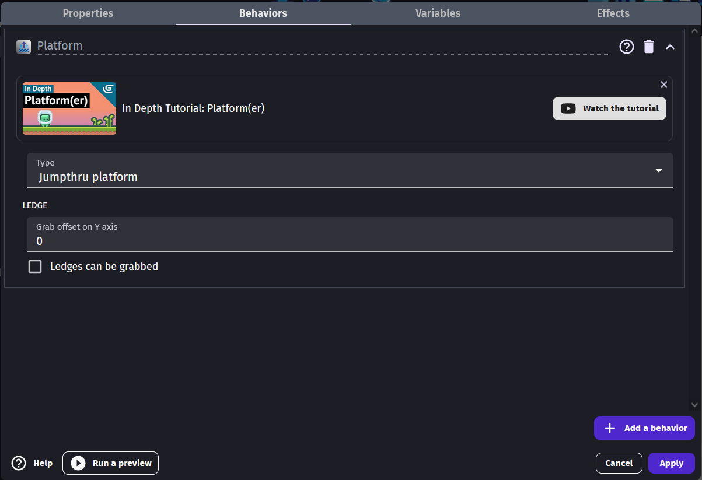

# OPGAVER TIL GDevelop – BEGYNDER

I sidste lektion hentede du alle figurerne. De ligger klar i **Objects**-panelet, men de kan
ingenting endnu — de er bare billeder.

I denne lektion gør vi to ting ved dem, og til sidst kan din helt **løbe og hoppe på
platformene**. Uden at du skriver en enkelt linje kode.

Knapperne i GDevelop står på engelsk, så vi skriver deres navne præcis som de står på
skærmen — fx **Apply** — mens forklaringerne er på dansk.

---

## To ord du skal kende

**Collision mask** — den usynlige form, spillet bruger til at mærke, om to ting rører
hinanden. Fra starten er den en firkant, der er lige så stor som hele billedet. Det er et
problem: der er gennemsigtig luft rundt om din helt, så det ser ud som om han svæver over
jorden eller bliver ramt af en fjende, der er langt væk. Vi former masken, så den passer
til kroppen.

**Behavior** — en færdiglavet evne, du kan hænge på et objekt. I stedet for selv at
programmere tyngdekraft, at løbe og at hoppe, giver vi helten behavioren
**Platformer character**, og så kan han det hele.

---

## Opgave 1 – BEGYNDER: Åbn dit projekt igen

1. Start **GDevelop**.
2. Vælg **Build** (hammer-ikonet) i menuen til venstre.
3. Find **Platformspil1** på listen over dine projekter, og åbn det.
4. Dobbeltklik på din scene, så du kan se den.

> 💡 Kan du ikke finde projektet på listen? Vælg **Open an existing project**, og find den
> mappe, du gemte i sidste lektion.

---

## Opgave 2 – BEGYNDER: Sæt en collision mask på RedHero

1. Find **RedHero** i **Objects**-panelet til højre, og **dobbeltklik** på den.
2. Boksen med objektets indstillinger åbner på fanen **Properties**.

Læg mærke til, at **RedHero** allerede har tre animationer: **Idle** (står stille),
**Run** (løber) og **Jump** (hopper). Dem bruger vi senere.

3. Tryk på **Edit collision masks** nederst til venstre.
4. Nu ser du helten med en rød firkant om. Der står
   *"This sprite uses the default collision mask, a rectangle that is as large as the sprite."*
   — altså den store firkant, vi vil af med.

5. Tryk på **Use a custom collision mask**.
6. Nu kan du trække i de røde punkter. **Træk dem ind, så de følger heltens krop** — ikke
   den tomme luft udenom.
7. Mangler du et punkt, tryk **+ Add a vertex** én gang, og træk det nye punkt på plads.
8. Når masken passer, tryk **Close**.

> 💡 De to knapper **Share same collision masks for all animations** og **Share same
> collision masks for all sprites of this animation** er slået til på forhånd. Derfor
> gælder den maske, du laver nu, for både **Idle**, **Run** og **Jump**. Smart — så
> slipper du for at gøre det tre gange.

> ⚠️ Masken skal være **konveks** — altså uden indhak. Prøv ikke at følge armene og benene
> præcist. En simpel form, der dækker kroppen, virker bedst og giver det pæneste spil.

---

## Opgave 3 – BEGYNDER: Giv RedHero evnen til at gå og hoppe

1. Du er tilbage i objektets indstillinger. Vælg fanen **Behaviors** øverst.
2. Der står *"Add your first behavior"*. Tryk på **+ Add a behavior**.

3. Nu kommer en liste med alle de evner, du kan vælge.
4. Vælg **Platformer character** — der står *"Jump and run on platforms."* under den.

> ⚠️ Pas på: lige over den står der **Platform**. De to hedder næsten det samme, men er
> ikke det samme! **Platformer character** er *den der løber*. **Platform** er *det man
> løber på*. Din helt skal have **Platformer character**.

5. Nu kan du se behaviorens indstillinger: **Gravity**, **Jump speed** og et par mere.
   **Du behøver ikke at ændre noget.**
6. Læg mærke til, at **Default controls** er sat til. Det betyder, at piletasterne virker
   med det samme — det er derfor, du ikke selv skal programmere styringen endnu.
7. Tryk **Apply** nederst til højre for at gemme det hele.

---

## Opgave 4 – BEGYNDER: Byg en lille bane

Din helt kan nu løbe og hoppe — men der er ikke noget at løbe på. Det laver vi.

1. **Træk `RedHero` fra Objects-panelet ind på scenen.** Placér den oppe i luften.
2. **Træk `Platform1` ind på scenen**, et stykke under helten.
3. Træk **to eller tre platforme mere** ind, i forskellig højde, så der er noget at hoppe
   op på.

> 💡 Du kan kopiere en platform hurtigt: klik på den, hold **Ctrl** nede, og træk. Så får
> du en kopi.

---

## Opgave 5 – BEGYNDER: Gør platformene til rigtige platforme

Lige nu falder helten lige gennem platformene, for spillet ved ikke, at man kan stå på dem.
Det retter vi nu.

1. **Dobbeltklik på `Platform1`** i **Objects**-panelet.
2. Tryk på **Edit collision masks**, og tryk på **Use a custom collision mask**.
3. Form masken, så den følger **oversiden af jorden** — den flade del, man skal stå på.
   Tag ikke det grønne græs, der stikker op, med.
4. Tryk **Close**.

5. Vælg fanen **Behaviors**, og tryk på **+ Add a behavior**.
6. Vælg denne gang **Platform** — den øverste, med teksten
   *"Flag objects as being platforms which characters can run on."*
7. I feltet **Type** vælger du **Jumpthru platform** i rullemenuen.
8. **HUSK:** fjern hakket i **Ledges can be grabbed**. Ellers hænger din helt fast i
   kanterne, når han hopper forbi.
9. Tryk **Apply**.

> 💡 **Hvorfor Jumpthru platform?** Fordi man så kan hoppe *op igennem* en platform
> nedefra, men stadig lande oven på den. Det er sådan de fleste platformspil føles.

---

## Opgave 6 – BEGYNDER: Gør det samme med de andre platforme

Nu skal `Platform2`, `Platform3` og `CornerPlatform` have præcis samme behandling:

- Dobbeltklik på objektet
- **Edit collision masks** → **Use a custom collision mask** → form masken → **Close**
- **Behaviors** → **+ Add a behavior** → **Platform** → **Type: Jumpthru platform**
- Fjern hakket i **Ledges can be grabbed**
- **Apply**

Du behøver kun at gøre det **én gang per objekt** — ikke for hver kopi, du har trukket ind
på scenen. Alle kopier af `Platform1` deler samme indstillinger.

> 💡 Tag kun de platforme, du faktisk bruger i din bane. Du kan altid gøre resten senere.

---

## Prøv spillet! 🎮

Tryk på **Preview** øverst.

Nu skulle du kunne:

- Gå til siderne med **venstre** og **højre piletast**
- Hoppe med **pil op**
- Lande oven på platformene i stedet for at falde igennem

Det er dit første spil, der virker. 🎉

Husk at gemme med **Ctrl + S**.

---

## Du er færdig med BEGYNDER ✅

- [ ] `RedHero` har en collision mask, der følger kroppen
- [ ] `RedHero` har behavioren **Platformer character**
- [ ] Der er en helt og nogle platforme på scenen
- [ ] Platformene har behavioren **Platform** med **Jumpthru platform**
- [ ] Hakket i **Ledges can be grabbed** er fjernet
- [ ] Helten kan løbe og hoppe i **Preview**

**Næste gang** koder vi selv styringen med *events*, så du bestemmer alt, hvad der sker i
spillet.

---

## Hvis noget går galt

| Problem | Løsning |
|---|---|
| Helten falder gennem platformene | Platformene mangler behavioren **Platform**. Eller helten har fået **Platform** i stedet for **Platformer character**. |
| Helten svæver over jorden | Collision masken er stadig for stor. Åbn **Edit collision masks** igen, og træk punkterne tættere på kroppen. |
| Helten rører ikke ved noget | Masken er blevet for lille eller trukket helt sammen. Prøv igen — eller slet polygonen med skraldespanden og tryk **Use a custom collision mask** forfra. |
| Helten hænger fast i kanten af en platform | Hakket i **Ledges can be grabbed** er ikke fjernet. |
| Piletasterne gør ingenting | Tjek at **Default controls** har et hak i behaviorens indstillinger. Klik også én gang inde i Preview-vinduet, så tastaturet lytter til spillet. |
| Helten falder ned i det uendelige | Der er ingen platform under ham. Træk en ind, eller flyt helten oven over en. |
| Jeg kan ikke se mine ændringer | Du har måske glemt at trykke **Apply**, før du lukkede boksen. |

---

Opgaverne bygger på det oprindelige GDevelop-forløb fra
[mom2day.dk/gdevelop-begynder](https://mom2day.dk/gdevelop-begynder). 🙏
