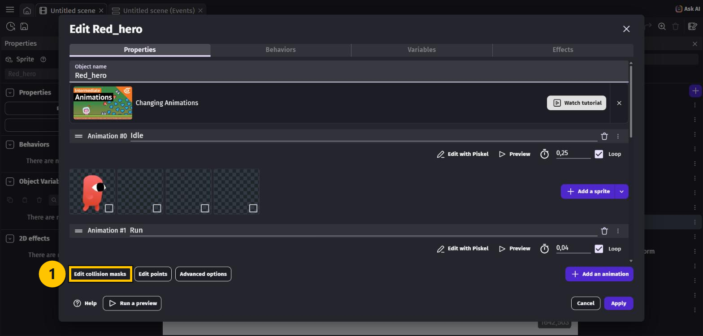
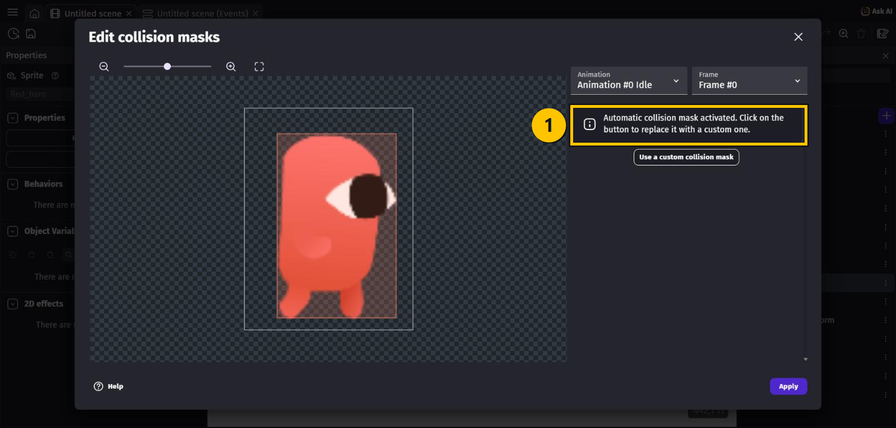
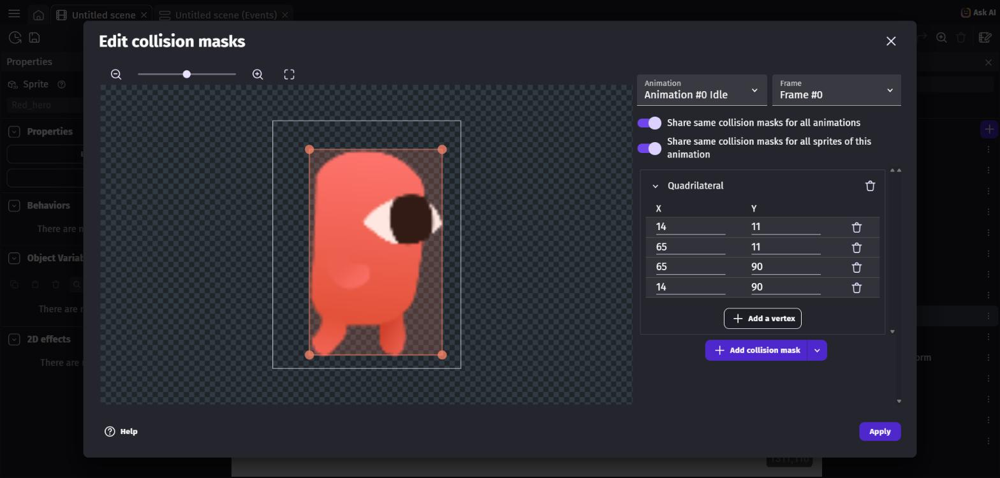
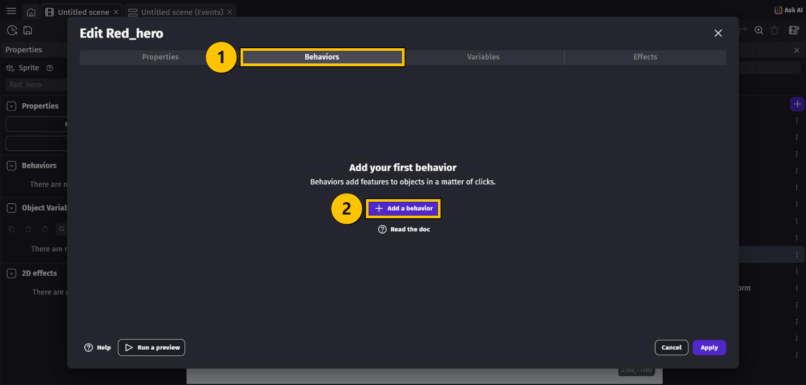
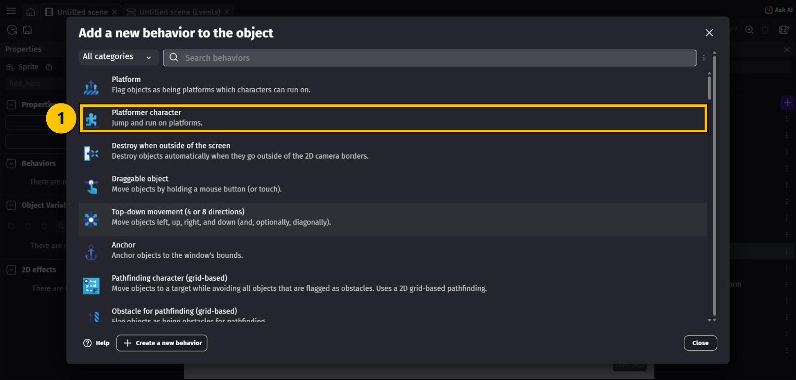
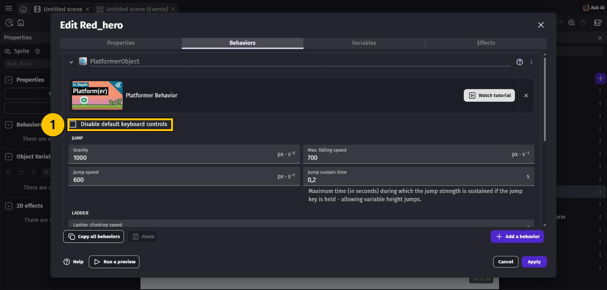
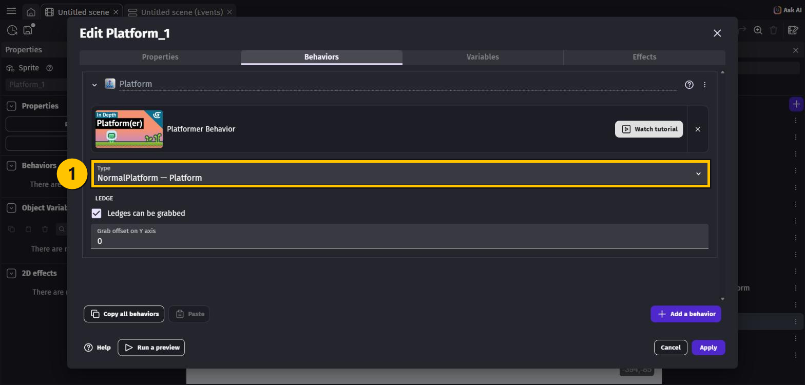
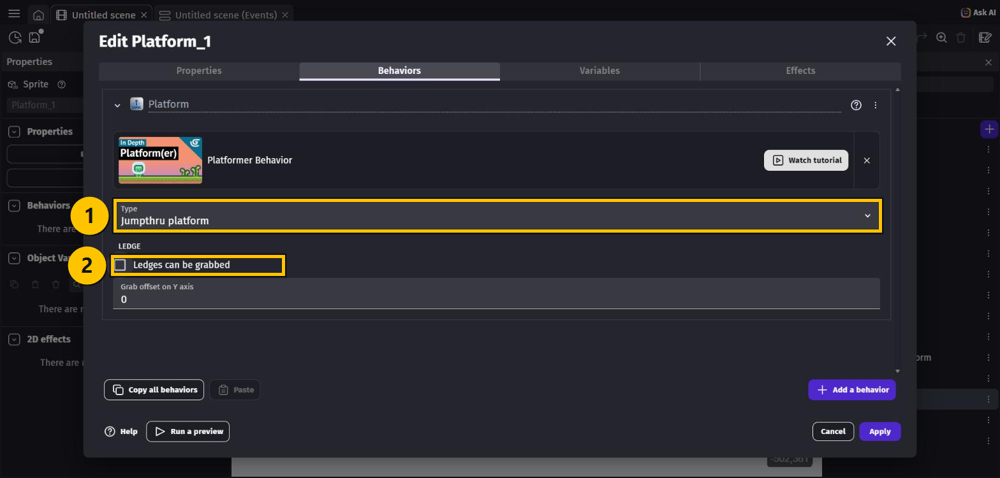

# OPGAVER TIL GDevelop – BEGYNDER

> **VIDEN**
>
> Sidst hentede du spillets figurer. Nu giver du dem evner, så helten kan løbe og hoppe på
> platformene. Du behøver ikke skrive kode.
>
> Knapperne i GDevelop står på engelsk. Vi skriver deres navne, som de står på skærmen.
> Boks med hel kant betyder **GØR DETTE**. Boks med stiplet kant betyder **VIDEN**.
> Gule felter på billeder viser, hvor du skal klikke. Tallene i gule cirkler passer til
> tallene i teksten.
{: .lesson-info}

---

## To ord du skal kende

> **VIDEN**
>
> **Behavior** er en evne, du giver en figur. Vi bruger **Platformer character**, så helten
> kan gå og hoppe.
>
> **Collision mask** er den usynlige form, spillet bruger til at mærke, om ting rører
> hinanden. GDevelop laver den som regel selv.
{: .lesson-info}

---

## Opgave 1 – BEGYNDER: Åbn dit projekt igen

> **GØR DETTE**
>
> 1. Åbn GDevelop, og vælg **Create** i menuen til venstre.
> 2. Find **Platformspil1** under **Games**.
> 3. Vælg **Open**.
> 4. Dobbeltklik på din scene.
{: .lesson-action}

> **VIDEN**
>
> Hvis projektet allerede er åbent, kan du springe de første trin over.
{: .lesson-info}

---

## Opgave 2 – BEGYNDER: Kig på heltens collision mask

> **GØR DETTE**
>
> 1. Find **`Red_hero`** i **Objects** til højre, og dobbeltklik på den.
> 2. Vælg **Edit collision masks** **(1)** nederst til venstre.
{: .lesson-action}

> **VIDEN**
>
> `Red_hero` har allerede animationerne **Idle** (står stille), **Run** (løber) og **Jump**
> (hopper). Dem bruger vi senere.
{: .lesson-info}

> **GØR DETTE**
>
> 1. Find teksten **"Automatic collision mask activated."** **(1)**.
> 2. Luk boksen med **✕** øverst. Du skal ikke ændre noget.
{: .lesson-action}

> **VIDEN**
>
> GDevelop har lagt den røde maske tæt om heltens krop. En stor firkant kan få helten til at
> se ud, som om han svæver, eller blive ramt af ting langt væk. Den automatiske maske passer
> allerede, så lad den være.
{: .lesson-info}

### Hvis du selv vil bestemme formen

> **VIDEN**
>
> Du kan selv ændre formen, men det behøver du ikke. En **Quadrilateral** er en firkant med
> fire punkter.
{: .lesson-info}

> **GØR DETTE**
>
> Hvis du vil ændre masken:
> 1. Vælg **Use a custom collision mask**.
> 2. Træk i punkterne. Vælg **+ Add a vertex**, hvis du vil have flere punkter.
{: .lesson-action}

> **VIDEN**
>
> Hvis du sletter firkanten, kommer den automatiske maske ikke tilbage. **Cancel** lukker
> **Edit Red_hero** uden at gemme ændringerne.
{: .lesson-info}

> **GØR DETTE**
>
> Hvis du vil fortryde: vælg **Cancel** i **Edit Red_hero**, og vælg **Cancel** igen, når
> GDevelop spørger, om du vil annullere ændringerne.
{: .lesson-action}

---

## Opgave 3 – BEGYNDER: Giv Red_hero evnen til at gå og hoppe

> **GØR DETTE**
>
> 1. Vælg fanen **Behaviors** **(1)** øverst.
> 2. Vælg **+ Add a behavior** **(2)**.
{: .lesson-action}

> **GØR DETTE**
>
> Vælg **Platformer character** **(1)** — der står *"Jump and run on platforms."* under
> navnet.
{: .lesson-action}

> **VIDEN**
>
> **Platformer character** er figuren, der løber. **Platform** er det, figuren løber på.
{: .lesson-info}

> **GØR DETTE**
>
> 1. Lad **Gravity** og **Jump speed** stå, som de er.
> 2. Lad **Disable default keyboard controls** **(1)** være tomt.
> 3. Vælg **Apply** nederst til højre.
{: .lesson-action}

---

## Opgave 4 – BEGYNDER: Byg en lille bane

> **VIDEN**
>
> Helten kan nu løbe og hoppe. Nu skal du lave en bane, så han har noget at lande på.
{: .lesson-info}

> **GØR DETTE**
>
> 1. Træk `Red_hero` fra **Objects** ind på scenen. Sæt helten oppe i luften.
> 2. Træk `Platform_1` ind under helten.
> 3. Træk to eller tre platforme mere ind. Sæt dem i forskellige højder.
{: .lesson-action}

> **GØR DETTE**
>
> Vil du lave en kopi af en platform? Klik på den, hold **Ctrl** nede, og træk.
{: .lesson-action}

---

## Opgave 5 – BEGYNDER: Gør platformene til rigtige platforme

> **VIDEN**
>
> Helten falder gennem platformene, indtil du fortæller spillet, at han kan stå på dem.
{: .lesson-info}

> **GØR DETTE**
>
> 1. Dobbeltklik på `Platform_1` i **Objects**.
> 2. Vælg **Behaviors** → **+ Add a behavior**.
> 3. Vælg **Platform** — den med teksten *"Flag objects as being platforms which
>    characters can run on."*
> 4. Find feltet **Type** **(1)**. Det står på **NormalPlatform — Platform**.
{: .lesson-action}

> **GØR DETTE**
>
> 1. I **Type** **(1)** skal du vælge **Jumpthru platform**.
> 2. Fjern hakket ved **Ledges can be grabbed** **(2)**.
> 3. Vælg **Apply**.
{: .lesson-action}

> **VIDEN**
>
> Med **Jumpthru platform** kan helten hoppe op gennem en platform og lande oven på den.
> **Ladder** findes også i menuen. Den skal bruges på stigen senere.
{: .lesson-info}

---

## Opgave 6 – BEGYNDER: Gør det samme med de andre platforme

> **GØR DETTE**
>
> Gør dette for `Platform_2`, `Platform_3` og `Corner_platform`:
> 1. Dobbeltklik på objektet.
> 2. Vælg **Behaviors** → **+ Add a behavior** → **Platform**.
> 3. Vælg **Jumpthru platform** i **Type**.
> 4. Fjern hakket ved **Ledges can be grabbed**.
> 5. Vælg **Apply**.
{: .lesson-action}

> **VIDEN**
>
> Alle kopier af samme objekt deler indstillinger. Derfor skal indstillingen kun ændres på
> selve objektet.
{: .lesson-info}

> **GØR DETTE**
>
> Vil du kopiere indstillinger i stedet? Åbn `Platform_1`, vælg **Copy all behaviors**.
> Åbn så `Platform_2`, og vælg **Paste**.
{: .lesson-action}

---

## Prøv spillet! 🎮

> **GØR DETTE**
>
> Vælg **Preview** øverst.
{: .lesson-action}

> **VIDEN**
>
> I spillet kan du nu:
>
> - Gå til siden med **venstre** og **højre piletast**.
> - Hoppe med **pil op**.
> - Lande på platformene i stedet for at falde igennem.
>
> Dit første spil virker! 🎉
{: .lesson-info}

> **GØR DETTE**
>
> Gem med **Ctrl + S**.
{: .lesson-action}

---

## Du er færdig med BEGYNDER ✅

> **VIDEN**
>
> Du er klar til næste lektion, når alt dette passer:
>
> - `Red_hero` har **Platformer character**.
> - **Disable default keyboard controls** er tomt.
> - Der er en helt og platforme på scenen.
> - Platformene har **Platform** med **Jumpthru platform**.
> - **Ledges can be grabbed** er slået fra.
> - Helten kan løbe og hoppe i **Preview**.
{: .lesson-info}

> **VIDEN**
>
> Næste gang bruger du *events* til at bestemme, hvad der sker i spillet.
{: .lesson-info}

---

## Hvis noget går galt

| Problem | Løsning |
|---|---|
| Helten falder gennem platformene | **GØR DETTE:** Giv platformene **Platform**. Giv helten **Platformer character**. |
| Piletasterne gør ingenting | **GØR DETTE:** Lad **Disable default keyboard controls** stå tomt. Klik også én gang i Preview-vinduet. |
| Helten svæver over jorden | **GØR DETTE:** Åbn **Edit collision masks**. Hvis den automatiske maske mangler, vælg **Cancel**. |
| Helten hænger fast i kanten af en platform | **GØR DETTE:** Fjern hakket ved **Ledges can be grabbed**. |
| Helten falder ned i det uendelige | **GØR DETTE:** Sæt en platform under helten, eller flyt helten over en platform. |
| Jeg kan ikke finde `RedHero` | **GØR DETTE:** Søg efter `Red_hero` med understreg. |
| Jeg kan ikke se mine ændringer | **GØR DETTE:** Vælg **Apply**, før du lukker boksen. |
{: .lesson-help}

---

> **VIDEN**
>
> Opgaverne bygger på det oprindelige GDevelop-forløb fra
> [mom2day.dk/gdevelop-begynder](https://mom2day.dk/gdevelop-begynder).
{: .lesson-info}
