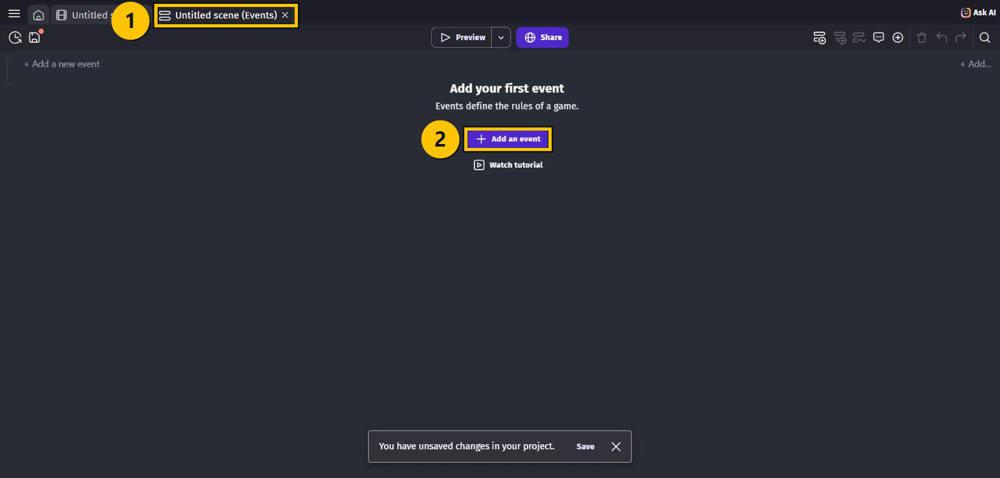
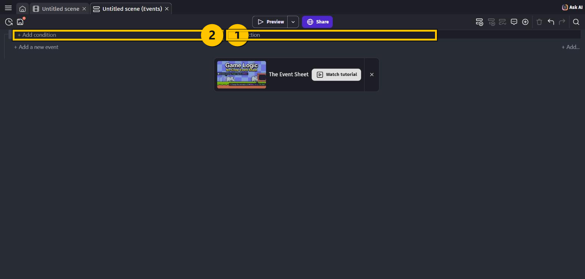
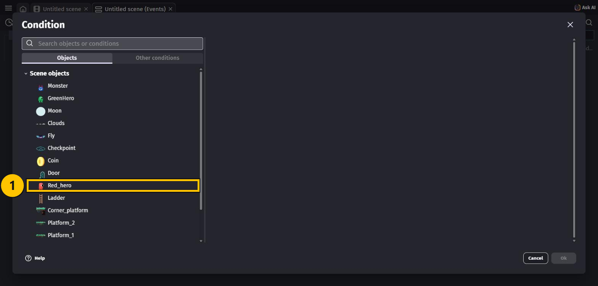
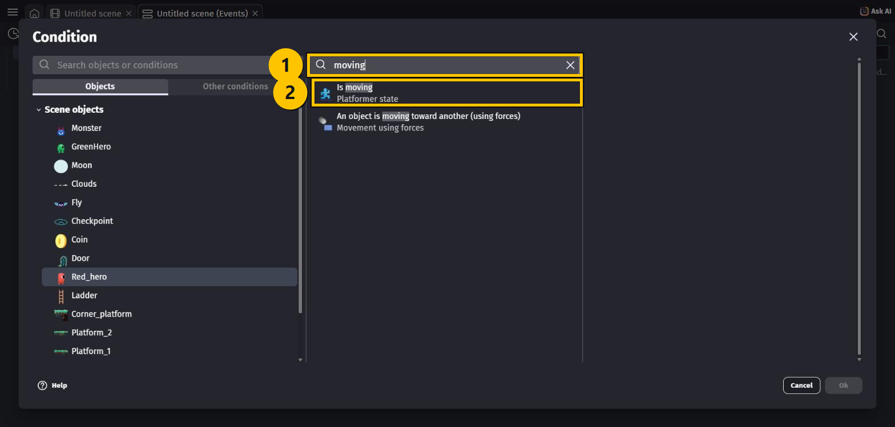
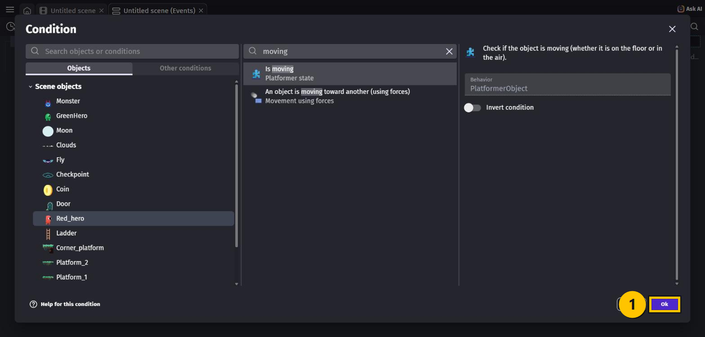
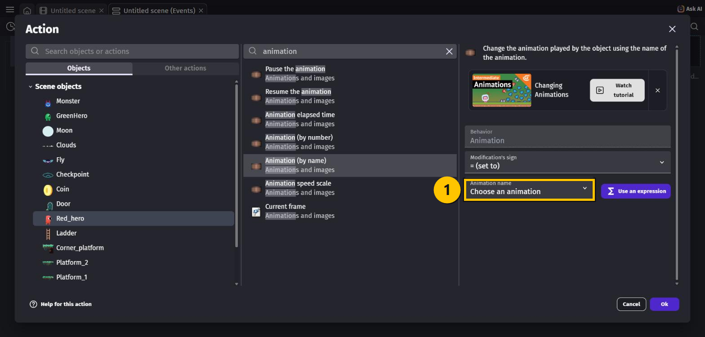
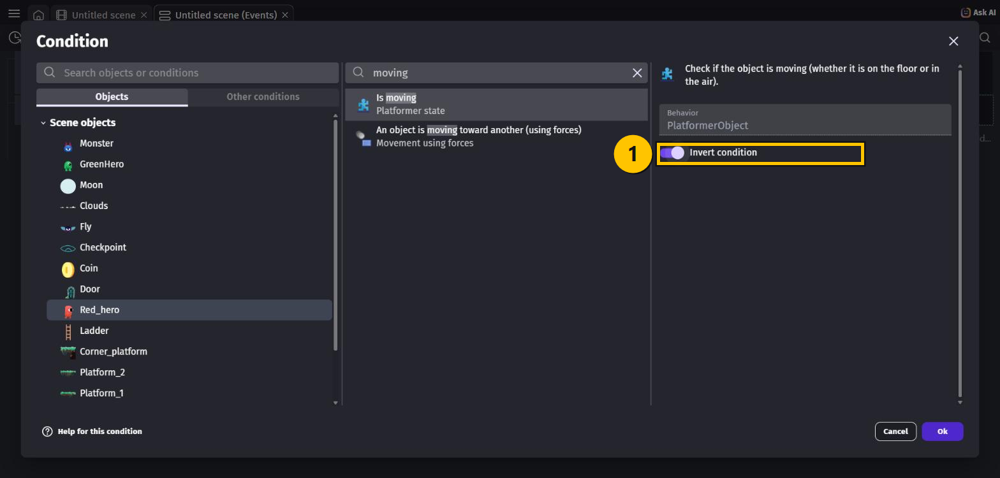
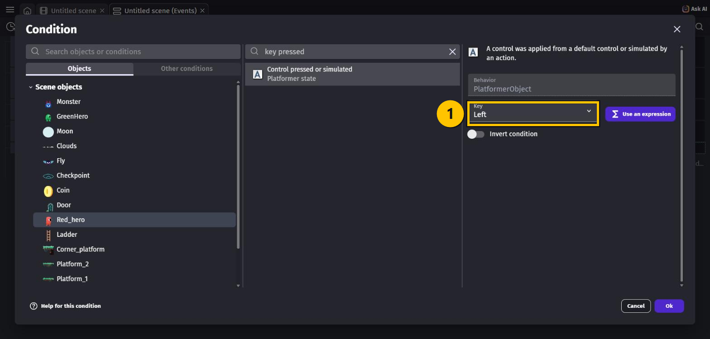
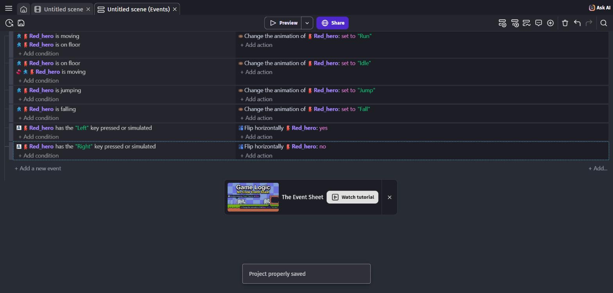

# OPGAVER TIL GDevelop – MIDDEL – EVENTS

Nu skal du **selv** til at bestemme, hvad der sker i spillet. Det gør du med **events**.

Din helt kan allerede gå og hoppe — det klarede behavioren i sidste lektion. Men han ser
forkert ud: han står stille i samme positur, uanset om han løber, hopper eller falder. Og
han vender altid den samme vej.

Det retter vi nu. Når du er færdig, **skifter helten animation**, alt efter hvad han laver,
og **vender ansigtet den vej, han går**.

Knapperne står på engelsk, så vi skriver deres navne præcis som på skærmen.

> 🟡 **Om billederne:** de gule kasser viser, hvor du skal klikke.

---

## Tre ord du skal kende

Et **event** er én regel i spillet. Det består af to halvdele:

| | |
|---|---|
| **Condition** (venstre side) | *Hvornår?* — fx "helten er på jorden" |
| **Action** (højre side) | *Hvad sker der så?* — fx "skift til Run-animationen" |

Man kan læse et event som en sætning: **HVIS** alle conditions passer, **SÅ** gør alle actions.

Har et event **flere conditions**, skal de **alle sammen** passe på én gang. Det er sådan
vi laver "helten er på jorden **og** bevæger sig".

> 💡 Et event uden conditions kører hele tiden — mange gange i sekundet.

---

## Opgave 1 – EVENTS: Åbn Events-siden

Hver scene har to faner foroven: én til **banen** og én til **koden**.

1. Kig på fanerne øverst. Den ene hedder det samme som din scene, men med **(Events)** efter
   — fx **Untitled scene (Events)**.
2. Klik på den.
3. Der står *"Add your first event"*. Tryk på **+ Add an event**.

Nu har du et tomt event med to halvdele: **+ Add condition** til venstre og
**+ Add action** til højre.

---

## Opgave 2 – EVENTS: Dit første event (helten løber)

Vi starter med reglen: **hvis helten bevæger sig og er på jorden, så vis Run-animationen.**

### Den første condition

1. Tryk på **+ Add condition**.
2. Boksen **Condition** åbner med en liste over alle objekterne i scenen.
3. Klik på **`Red_hero`**.

4. Nu kommer der et søgefelt mere: **Search Red_hero conditions**.
   Skriv `moving` i det.
5. Vælg **Is moving** — der står *Platformer state* under den.

6. Til højre kan du se, hvad conditionen betyder. Du skal ikke ændre noget.
7. Tryk **Ok**.

### Den anden condition

8. Tryk på **+ Add condition** igen — i **samme** event, lige under den første.
9. Vælg **`Red_hero`**, søg efter `floor`, og vælg **Is on floor**. Tryk **Ok**.

Nu står der to linjer i venstre side. Begge skal passe, før actionen kører.

### Actionen

10. Tryk på **+ Add action** ude til højre.
11. Vælg **`Red_hero`**, søg efter `animation`, og vælg **Animation (by name)**.
12. Lad **Modification's sign** stå på **= (set to)**.
13. Klik på **Animation name**, og vælg **Run** i rullemenuen.
14. Tryk **Ok**.

Dit første event er færdigt! Der står nu:

> **HVIS** `Red_hero` is moving **OG** `Red_hero` is on floor
> **SÅ** Change the animation of `Red_hero`: set to "Run"

---

## Opgave 3 – EVENTS: Helten står stille (og vi vender en condition om)

Nu den modsatte regel: **hvis helten er på jorden og IKKE bevæger sig, så vis Idle.**

Der findes ingen condition, der hedder "is not moving". I stedet tager vi **Is moving** og
**vender den om**.

1. Tryk på **+ Add a new event** nederst.
2. Tilføj conditionen **Is on floor** på `Red_hero` som før.
3. Tilføj conditionen **Is moving** på `Red_hero` — men **stop, før du trykker Ok**.
4. Slå **Invert condition** til. Knappen bliver lilla.
5. Tryk **Ok**.

6. Tilføj actionen **Animation (by name)** → **Idle**.

> 💡 I event-listen kan du se, at en omvendt condition har et **lille rødt ikon** foran sig.
> Det er sådan du kan se forskel på "er i gang med" og "er *ikke* i gang med".

---

## Opgave 4 – EVENTS: Hop og fald

To events mere, og de er nemme — de har kun **én** condition hver.

| Event | Condition | Action |
|---|---|---|
| 3 | `Red_hero` → **Is jumping** | **Animation (by name)** → **Jump** |
| 4 | `Red_hero` → **Is falling** | **Animation (by name)** → **Fall** |

Fremgangsmåden er præcis den samme: **+ Add a new event** → **+ Add condition** →
`Red_hero` → søg → vælg → **Ok** → **+ Add action** → `Red_hero` → `animation` →
**Animation (by name)** → vælg animationen → **Ok**.

---

## Opgave 5 – EVENTS: Helten skal vende ansigtet rigtigt

Går helten til venstre, skal figuren spejlvendes. Går han til højre, skal den vende normalt.

1. Lav et nyt event.
2. Tilføj conditionen: `Red_hero` → søg efter `key pressed` → **Control pressed or simulated**.
3. I feltet **Key** står der allerede **Left**. Lad det stå. Tryk **Ok**.

4. Tilføj actionen: `Red_hero` → søg efter `flip` → **Flip the object horizontally**.
5. Sæt **Activate flipping** til **Yes**. Tryk **Ok**.

Og så det samme igen for højre:

| Event | Condition | Action |
|---|---|---|
| 6 | **Control pressed or simulated**, **Key: Right** | **Flip the object horizontally**, **Activate flipping: No** |

---

## Hele koden samlet

Sådan ser din Events-side ud, når du er færdig. Brug den til at tjekke dit eget arbejde:

| # | Conditions (HVIS) | Actions (SÅ) |
|---|---|---|
| 1 | `Red_hero` **is moving** `Red_hero` **is on floor** | Change the animation of `Red_hero`: set to **"Run"** |
| 2 | `Red_hero` **is on floor** `Red_hero` **is moving** *(omvendt)* | Change the animation of `Red_hero`: set to **"Idle"** |
| 3 | `Red_hero` **is jumping** | Change the animation of `Red_hero`: set to **"Jump"** |
| 4 | `Red_hero` **is falling** | Change the animation of `Red_hero`: set to **"Fall"** |
| 5 | `Red_hero` has the **"Left"** key pressed or simulated | Flip horizontally `Red_hero`: **yes** |
| 6 | `Red_hero` has the **"Right"** key pressed or simulated | Flip horizontally `Red_hero`: **no** |

> 💡 **Rækkefølgen betyder noget.** GDevelop læser dine events oppefra og ned, mange gange
> i sekundet. Står to events og skændes om den samme animation, vinder det **nederste**,
> fordi det kører sidst.

---

## Prøv spillet! 🎮

Tryk på **Preview**, og prøv:

- Gå til siden → helten **løber** (Run) og vender ansigtet den rigtige vej
- Stå stille → helten **står roligt** (Idle)
- Hop → helten skifter til **Jump** på vej op og **Fall** på vej ned

Husk **Ctrl + S**.

---

## Gode tricks til Events-siden

| Genvej | Hvad den gør |
|---|---|
| **Shift + A** | Nyt tomt event |
| **Shift + D** | Under-event til det valgte event |
| **Shift + C** | **Kommentar** — en gul stribe, hvor du kan skrive, hvad koden gør |
| **Ctrl + F** | Søg i alle dine events |
| **Ctrl + Z** | Fortryd |

> 💡 **Skriv kommentarer!** Når du har 30 events, kan du ikke huske, hvad de gør. En gul
> kommentarlinje over hver gruppe — fx *"Heltens animationer"* — hjælper dig selv senere.
> Du finder den også ved at højreklikke på et event.

---

## Du er færdig med EVENTS ✅

- [ ] Der er **seks** events på Events-siden
- [ ] Event 2 har en **omvendt** condition (lille rødt ikon)
- [ ] Helten skifter mellem **Run**, **Idle**, **Jump** og **Fall**
- [ ] Helten vender ansigtet den vej, han går
- [ ] Projektet er gemt

**Næste gang** samler vi mønter og laver en rigtig score med **variabler**.

---

## Hvis noget går galt

| Problem | Løsning |
|---|---|
| Helten skifter slet ikke animation | Tjek at animationerne hedder præcis `Idle`, `Run`, `Jump` og `Fall`. Store og små bogstaver betyder noget. |
| Helten sidder fast i Run-animationen | Event 2 mangler nok **Invert condition** på **Is moving**. Uden den siger event 2 det samme som event 1. |
| Helten blinker mellem to animationer | To events sætter animationen på samme tid. Tjek at event 1 har **begge** conditions. |
| Jeg kan ikke finde **Is moving** | Du har nok ikke valgt `Red_hero` først. Klik på objektet i venstre liste, og søg så. |
| Der er ingen **Is jumping** at vælge | `Red_hero` mangler behavioren **Platformer character** — gå tilbage til BEGYNDER. |
| Helten vender forkert vej | Byt om på **Yes** og **No** i de to **Flip**-actions. |
| Jeg kom til at lave conditionen i det forkerte event | Træk linjen op eller ned med musen, eller slet den med højreklik → **Delete**. |

---

Opgaverne bygger på det oprindelige GDevelop-forløb fra
[mom2day.dk/gdevelop-middel-events](https://mom2day.dk/gdevelop-middel-events). 🙏
