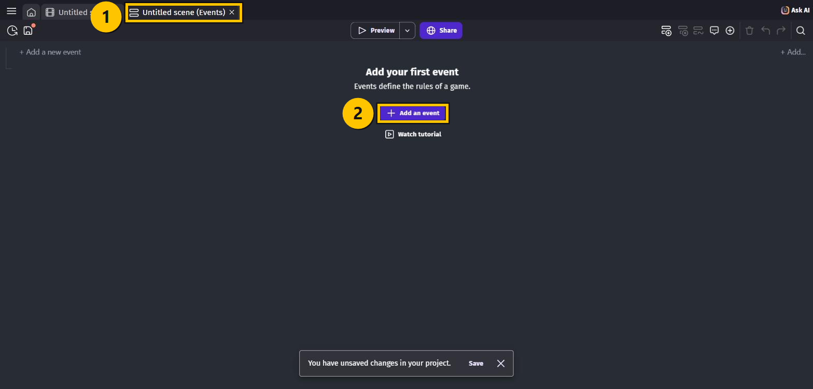
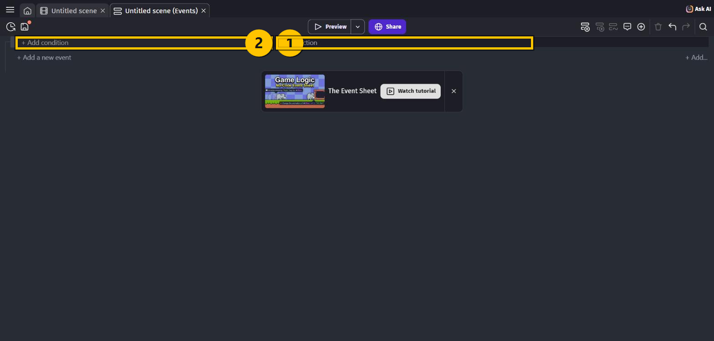
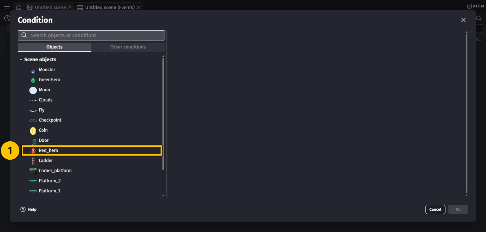
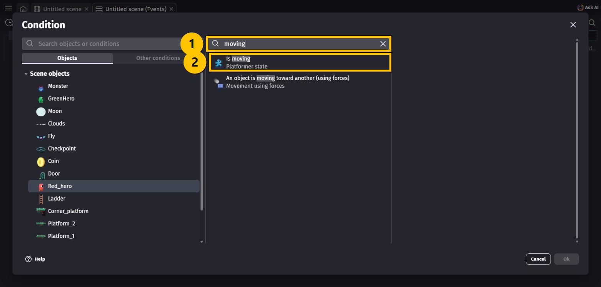
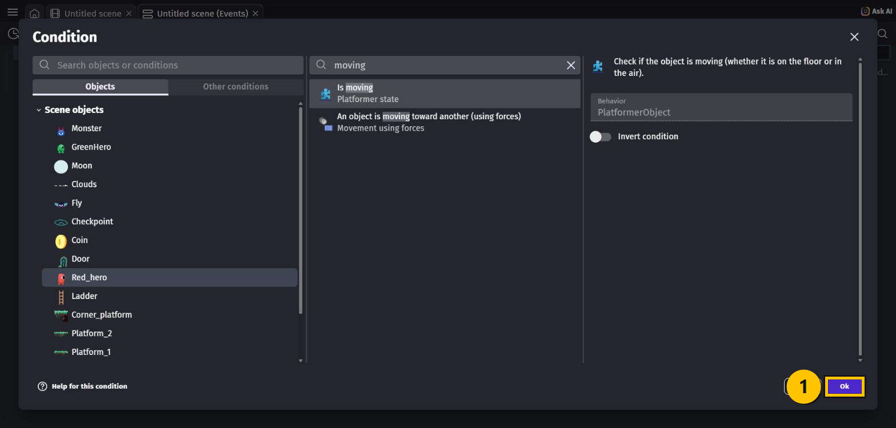
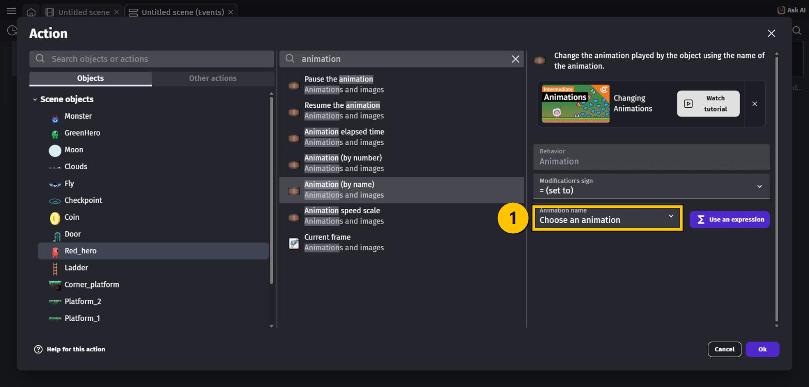
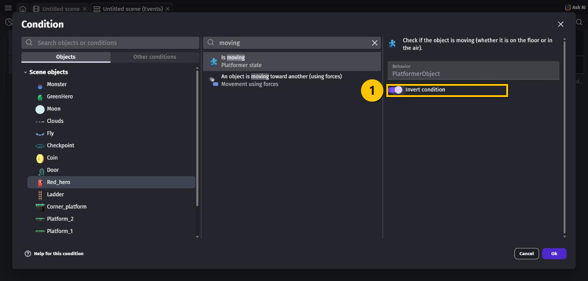
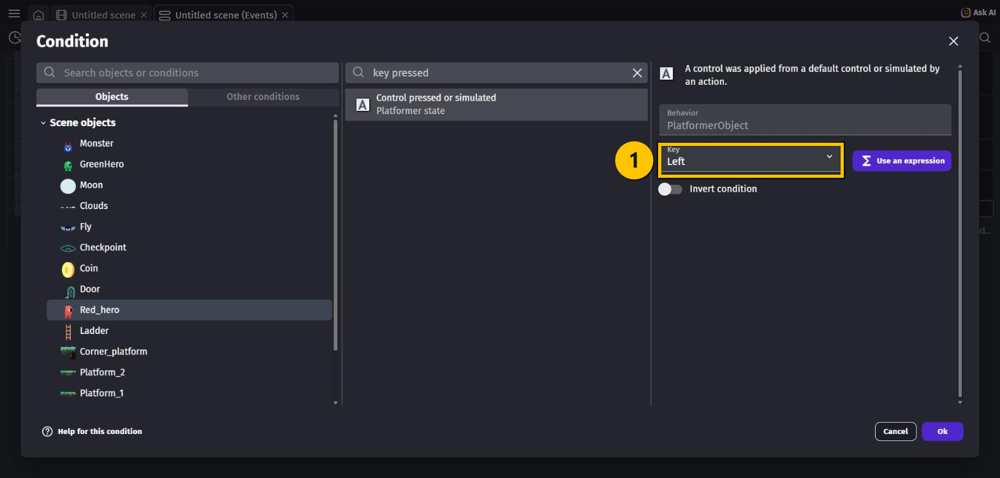
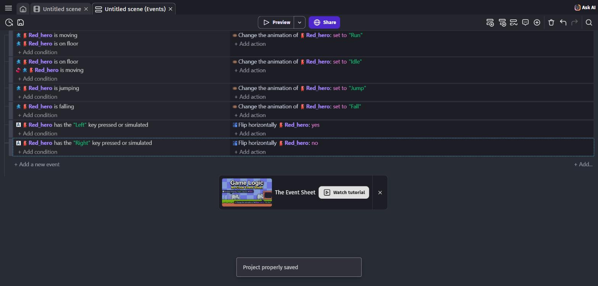

# OPGAVER TIL GDevelop – MIDDEL – EVENTS

> **VIDEN**
>
> Helten kan allerede gå og hoppe. Men han viser ikke den rigtige animation og vender ikke
> altid den vej, han går. I denne lektion retter du det med **events**.
>
> Knapperne står på engelsk. Vi skriver deres navne, som de står på skærmen. Bokse med hel
> kant er **GØR DETTE**. Bokse med stiplet kant er **VIDEN**. Gule felter viser, hvor du
> skal klikke. Tallene ved felterne passer til tallene i teksten.
{: .lesson-info}

---

## Tre ord du skal kende

> **VIDEN**
>
> Et **event** er én regel i spillet:
>
> | Del | Spørgsmål | Eksempel |
> |---|---|---|
> | **Condition** (venstre side) | Hvornår? | Helten er på jorden |
> | **Action** (højre side) | Hvad skal ske? | Vis Run-animationen |
>
> Hvis et event har flere conditions, skal de alle passe. Et event uden conditions kører
> hele tiden.
{: .lesson-info}

---

## Opgave 1 – EVENTS: Åbn Events-siden

> **VIDEN**
>
> Hver scene har en fane til banen og en fane til events (koden).
{: .lesson-info}

> **GØR DETTE**
>
> 1. Find fanen med scenens navn og **(Events)** **(1)**.
> 2. Vælg fanen.
> 3. Vælg **+ Add an event** **(2)**.
{: .lesson-action}

> **VIDEN**
>
> Det tomme event har to sider: **+ Add condition** **(1)** til venstre og **+ Add action**
> **(2)** til højre.
{: .lesson-info}

---

## Opgave 2 – EVENTS: Dit første event (helten løber)

> **VIDEN**
>
> Først laver du en regel: Hvis helten bevæger sig på jorden, skal han vise Run-animationen.
{: .lesson-info}

### Den første condition

> **GØR DETTE**
>
> 1. Vælg **+ Add condition**.
> 2. Vælg **`Red_hero`** **(1)** i listen.
{: .lesson-action}

> **GØR DETTE**
>
> 1. Skriv `moving` i feltet **Search Red_hero conditions** **(1)**.
> 2. Vælg **Is moving** **(2)**. Der står *Platformer state* under navnet.
{: .lesson-action}

> **GØR DETTE**
>
> Kig på forklaringen til højre. Du skal ikke ændre noget. Vælg **Ok** **(1)**.
{: .lesson-action}

### Den anden condition

> **GØR DETTE**
>
> 1. I samme event skal du vælge **+ Add condition** igen.
> 2. Vælg **`Red_hero`**, søg efter `floor`, og vælg **Is on floor**.
> 3. Vælg **Ok**.
{: .lesson-action}

> **VIDEN**
>
> Nu er der to conditions. Begge skal passe, før actionen kører.
{: .lesson-info}

### Actionen

> **GØR DETTE**
>
> 1. Vælg **+ Add action** til højre.
> 2. Vælg **`Red_hero`**, søg efter `animation`, og vælg **Animation (by name)**.
> 3. Lad **Modification's sign** stå på **= (set to)**.
> 4. Under **Animation name** vælger du **Run** **(1)**.
> 5. Vælg **Ok**.
{: .lesson-action}

> **VIDEN**
>
> Dit første event siger: Hvis `Red_hero` bevæger sig **og** er på jorden, så skift til
> animationen **Run**.
{: .lesson-info}

---

## Opgave 3 – EVENTS: Helten står stille (og vi vender en condition om)

> **VIDEN**
>
> Nu laver du en regel for, når helten står stille. Der er ikke en knap, der hedder "is not
> moving". I stedet vender du **Is moving** om.
{: .lesson-info}

> **GØR DETTE**
>
> 1. Vælg **+ Add a new event** nederst.
> 2. Tilføj **Is on floor** for `Red_hero`.
> 3. Tilføj **Is moving** for `Red_hero`, men vent med at vælge **Ok**.
> 4. Slå **Invert condition** **(1)** til.
> 5. Vælg **Ok**.
{: .lesson-action}

> **GØR DETTE**
>
> Tilføj actionen **Animation (by name)**, og vælg **Idle**.
{: .lesson-action}

> **VIDEN**
>
> Et omvendt vilkår har et lille rødt ikon i event-listen. Så kan du se, at helten **ikke**
> bevæger sig.
{: .lesson-info}

---

## Opgave 4 – EVENTS: Hop og fald

> **VIDEN**
>
> Der skal være ét event, når helten hopper, og ét, når han falder. Hvert event har én
> condition.
{: .lesson-info}

> **GØR DETTE**
>
> Lav begge events:
>
> | Når dette sker | Gør dette |
> |---|---|
> | `Red_hero` → **Is jumping** | **Animation (by name)** → **Jump** |
> | `Red_hero` → **Is falling** | **Animation (by name)** → **Fall** |
>
> For hvert event: vælg **+ Add a new event**, tilføj conditionen og vælg **Ok**. Tilføj så
> actionen **Animation (by name)**, vælg animationen, og vælg **Ok**.
{: .lesson-action}

---

## Opgave 5 – EVENTS: Helten skal vende ansigtet rigtigt

> **VIDEN**
>
> Når helten går til venstre, skal figuren spejlvendes. Når han går til højre, skal den vende
> normalt.
{: .lesson-info}

> **GØR DETTE**
>
> 1. Lav et nyt event.
> 2. Tilføj conditionen `Red_hero` → søg efter `key pressed` → **Control pressed or simulated**.
> 3. Lad **Key** stå på **Left** **(1)**, og vælg **Ok**.
{: .lesson-action}

> **GØR DETTE**
>
> 1. Tilføj actionen `Red_hero` → søg efter `flip` → **Flip the object horizontally**.
> 2. Sæt **Activate flipping** til **Yes**, og vælg **Ok**.
> 3. Lav et nyt event for **Right**. Brug samme condition og action, men sæt
>    **Activate flipping** til **No**.
{: .lesson-action}

---

## Hele koden samlet

> **VIDEN**
>
> Sådan ser din Events-side ud, når du er færdig:
>
> | # | Conditions (HVIS) | Actions (SÅ) |
> |---|---|---|
> | 1 | `Red_hero` **is moving** `Red_hero` **is on floor** | Change animation to **Run** |
> | 2 | `Red_hero` **is on floor** `Red_hero` **is moving** *(omvendt)* | Change animation to **Idle** |
> | 3 | `Red_hero` **is jumping** | Change animation to **Jump** |
> | 4 | `Red_hero` **is falling** | Change animation to **Fall** |
> | 5 | `Red_hero` has the **Left** key pressed | Flip `Red_hero`: **yes** |
> | 6 | `Red_hero` has the **Right** key pressed | Flip `Red_hero`: **no** |
{: .lesson-info}

> **VIDEN**
>
> Rækkefølgen betyder noget. GDevelop læser events oppefra og ned mange gange i sekundet.
> Hvis to events ændrer samme ting, gælder det nederste.
{: .lesson-info}

---

## Prøv spillet! 🎮

> **GØR DETTE**
>
> Vælg **Preview**, og prøv at gå, stå stille og hoppe.
{: .lesson-action}

> **VIDEN**
>
> Helten skal løbe og vende sig, når du går. Han skal stå i **Idle**, når du står stille, og
> skifte mellem **Jump** og **Fall**, når du hopper.
{: .lesson-info}

> **GØR DETTE**
>
> Gem med **Ctrl + S**.
{: .lesson-action}

---

## Gode tricks til Events-siden

> **VIDEN**
>
> | Genvej | Hvad den gør |
> |---|---|
> | **Shift + A** | Nyt tomt event |
> | **Shift + D** | Under-event til det valgte event |
> | **Shift + C** | **Comment** — en gul stribe med en note om koden |
> | **Ctrl + F** | Søg i alle dine events |
> | **Ctrl + Z** | Fortryd |
{: .lesson-info}

> **VIDEN**
>
> En comment gør ingenting i spillet. Den hjælper dig med at huske, hvad dine events gør.
{: .lesson-info}

> **GØR DETTE**
>
> Vil du sætte en comment ind? Vælg et event, og tryk **Shift + C**. Skriv fx
> *"Heltens animationer"* i den gule bjælke. Du kan også højreklikke på et event.
{: .lesson-action}

---

## Du er færdig med EVENTS ✅

> **VIDEN**
>
> Du er klar til næste lektion, når:
>
> - Der er seks events på **Events**-siden.
> - Event 2 har en omvendt condition med et lille rødt ikon.
> - Helten bruger **Run**, **Idle**, **Jump** og **Fall**.
> - Helten vender den vej, han går.
> - Projektet er gemt.
{: .lesson-info}

> **VIDEN**
>
> Næste gang samler du mønter og laver en score med **variabler**.
{: .lesson-info}

---

## Hvis noget går galt

| Problem | Løsning |
|---|---|
| Helten skifter slet ikke animation | **GØR DETTE:** Tjek at animationerne hedder `Idle`, `Run`, `Jump` og `Fall`. Store og små bogstaver tæller. |
| Helten sidder fast i Run-animationen | **GØR DETTE:** Slå **Invert condition** til på **Is moving** i event 2. |
| Helten blinker mellem to animationer | **GØR DETTE:** Tjek at event 1 har begge conditions. |
| Jeg kan ikke finde **Is moving** | **GØR DETTE:** Vælg `Red_hero` først. Søg så efter conditionen. |
| Der er ingen **Is jumping** at vælge | **GØR DETTE:** Gå tilbage til BEGYNDER, og giv `Red_hero` **Platformer character**. |
| Helten vender forkert vej | **GØR DETTE:** Byt om på **Yes** og **No** i de to **Flip**-actions. |
| Jeg kom til at lave conditionen i det forkerte event | **GØR DETTE:** Træk linjen op eller ned, eller højreklik på den og vælg **Delete**. |
{: .lesson-help}

---

> **VIDEN**
>
> Opgaverne bygger på det oprindelige GDevelop-forløb fra
> [mom2day.dk/gdevelop-middel-events](https://mom2day.dk/gdevelop-middel-events).
{: .lesson-info}
