# OPGAVER TIL GDevelop – MIDDEL – VARIABLER

Et spil skal kunne **huske** ting. Hvor mange mønter har du samlet? Hvor mange liv har du
tilbage? Den slags gemmer man i en **variabel**.

I denne lektion laver du en rigtig **score**: mønterne forsvinder, når helten rører dem,
tallet tæller op, og det står på skærmen hele tiden.

Knapperne står på engelsk, så vi skriver deres navne præcis som på skærmen.

> 🟡 **Om billederne:** de gule kasser viser, hvor du skal klikke.

---

## To ord du skal kende

**Variabel** — en kasse, spillet kan gemme et tal eller noget tekst i. Kassen har et navn,
fx `Score`, og en værdi, fx `7`. Værdien kan laves om, mens spillet kører.

**Global variabel** — en variabel, som **hele spillet** kan bruge, også hvis du senere laver
flere baner. Det er præcis, hvad en score skal være: skifter du bane, skal pointene følge med.

> 💡 Der findes også **scene**-variabler, der kun gælder i én bane, og **objekt**-variabler,
> der hører til ét objekt. Dem bruger vi senere.

---

## Opgave 1 – VARIABLER: Lav et tekstfelt til scoren

Først skal vi have noget at vise tallet i.

1. Tryk på **+ Add object** i **Objects**-panelet.
2. Vælg fanen **New object from scratch** øverst.

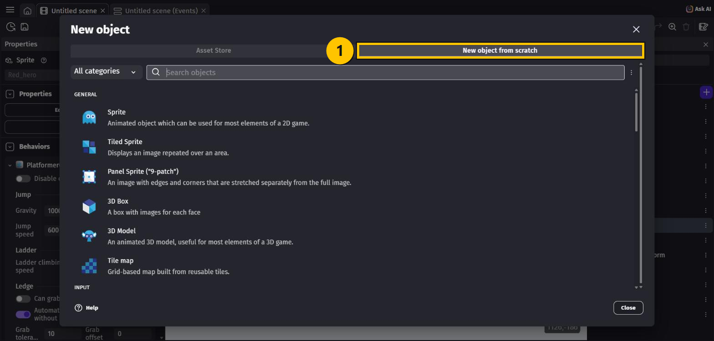

3. Skriv `text` i søgefeltet, og vælg **Text** — *"Displays a text on the screen."*

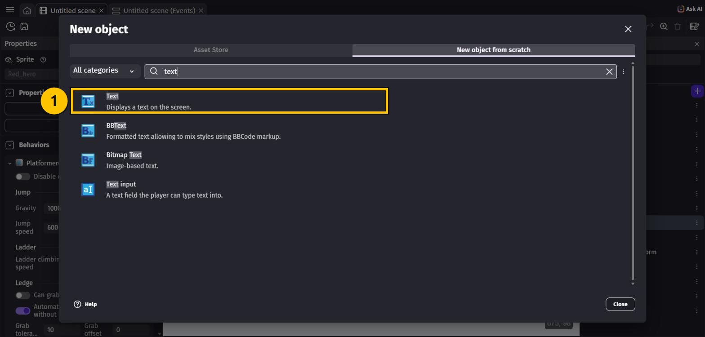

4. Nu åbner objektets indstillinger. Sæt dem sådan her:
   - **Object name**: `ScoreText`
   - **Size**: `32` (så det er til at læse)
   - **Initial text to display**: `Score: 0`
5. Tryk **Apply**.

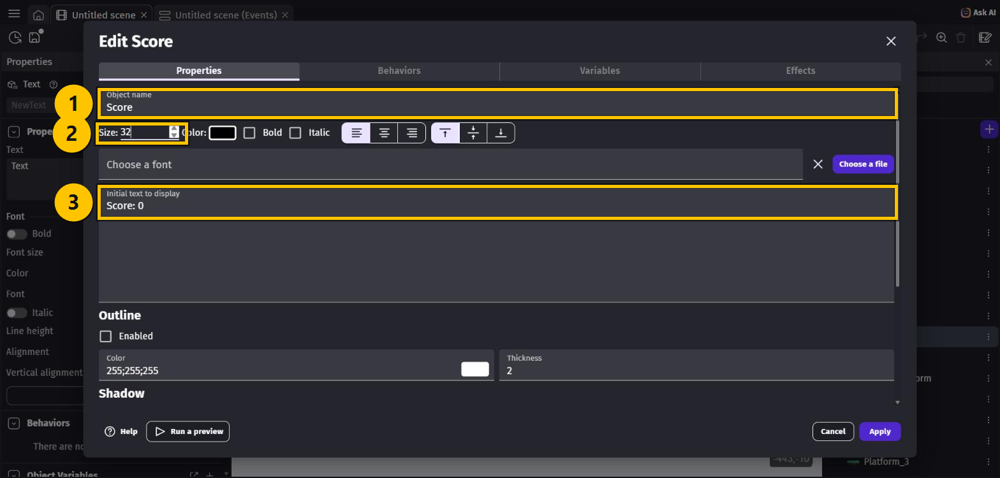

6. **Træk `ScoreText` ind på scenen**, og placér det oppe i **venstre hjørne**.

> ⚠️ **Kald det `ScoreText` — ikke `Score`.** Om lidt laver vi nemlig en *variabel*, der
> hedder `Score`, og GDevelop bliver forvirret, hvis et objekt og en variabel hedder det
> samme. Du får denne advarsel, hvis du gør det alligevel:
>
> 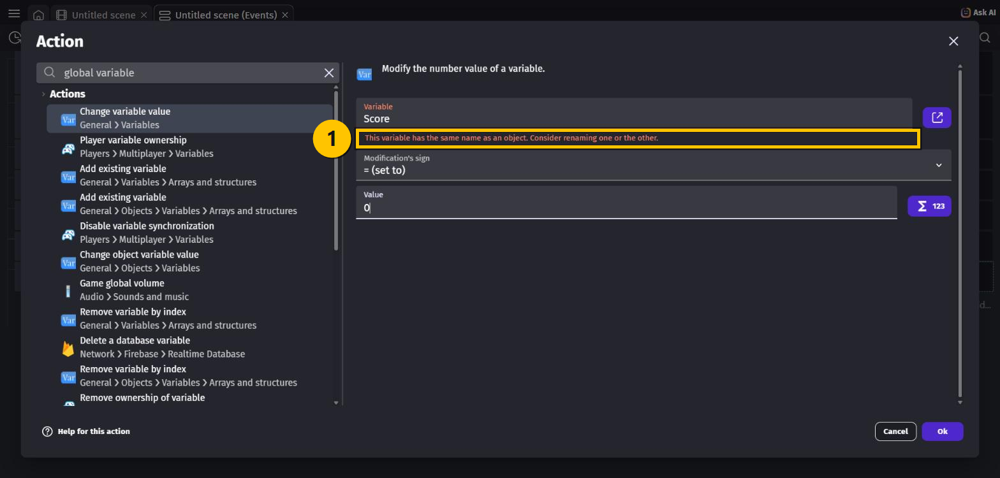

---

## Opgave 2 – VARIABLER: Lav den globale variabel

1. Tryk på **☰** helt oppe i venstre hjørne for at åbne **Project manager**.
2. Under **Game settings**, vælg **Global variables**.
3. Der står *"Add your first global variable"*. Tryk på **+ Add a variable**.

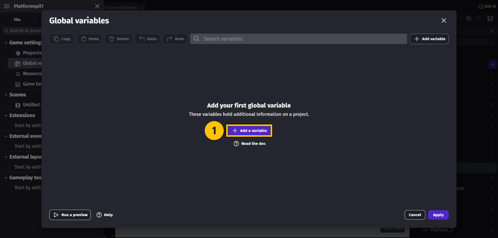

4. Nu kommer der en linje med tre felter. Udfyld dem sådan:
   - **Navn**: `Score`
   - **Type**: **Number** (den er valgt i forvejen)
   - **Værdi**: `0` (den står der også allerede)
5. Tryk **Apply**.

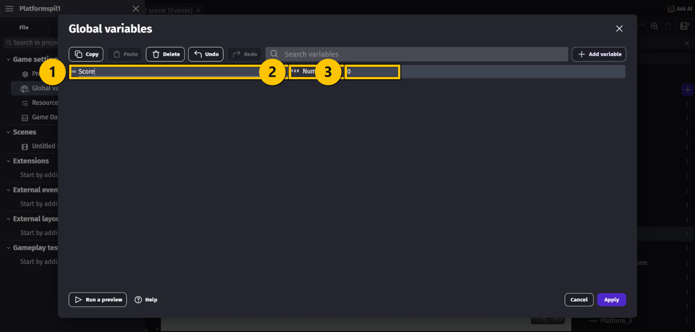

---

## Opgave 3 – VARIABLER: Nulstil scoren, når banen starter

Nu til koden. Åbn fanen **(Events)**.

1. Tryk **+ Add a new event**.
2. **+ Add condition** → skriv `beginning of the scene` i det **øverste** søgefelt →
   vælg **At the beginning of the scene** → **Ok**.

> 💡 Det øverste søgefelt søger i **alt**. Det nederste søger kun i det objekt, du har valgt.
> Conditions, der ikke handler om et bestemt objekt, finder du kun i det øverste.

3. **+ Add action** → søg efter `change variable value` → vælg **Change variable value**.
4. Klik i feltet **Variable**. GDevelop foreslår `Score` — vælg den.
5. Lad **Modification's sign** stå på **= (set to)**, og skriv `0` i **Value**. Tryk **Ok**.

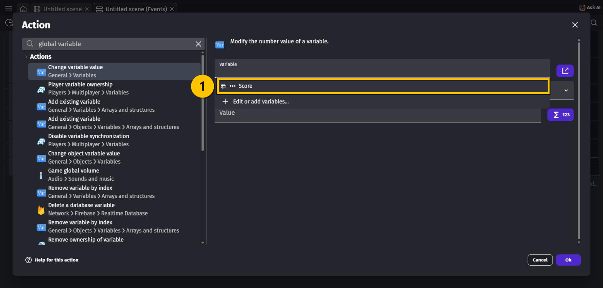

Nu starter spillet altid med 0 point — også når du prøver igen.

---

## Opgave 4 – VARIABLER: Saml mønterne

Først: **træk en håndfuld `Coin` ind på scenen**, så der er noget at samle. Placér dem, hvor
helten kan nå dem.

1. Lav et nyt event.
2. **+ Add condition** → vælg objektet **`Red_hero`** → søg efter `collision` →
   vælg **Collision**.
3. I feltet **Object** vælger du **`Coin`**. Tryk **Ok**.

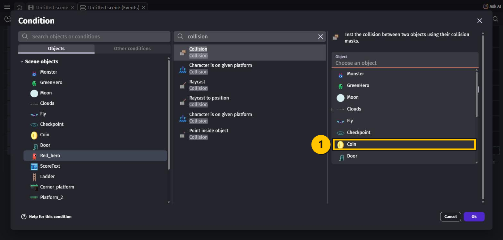

4. **+ Add action** → vælg objektet **`Coin`** → søg efter `delete` →
   vælg **Delete the object** → **Ok**.
5. **+ Add action** igen → søg efter `change variable value` → vælg **Change variable value**.
6. Sæt felterne sådan:
   - **Variable**: `Score`
   - **Modification's sign**: **+ (add)** ← *husk at skifte den!*
   - **Value**: `1`
7. Tryk **Ok**.

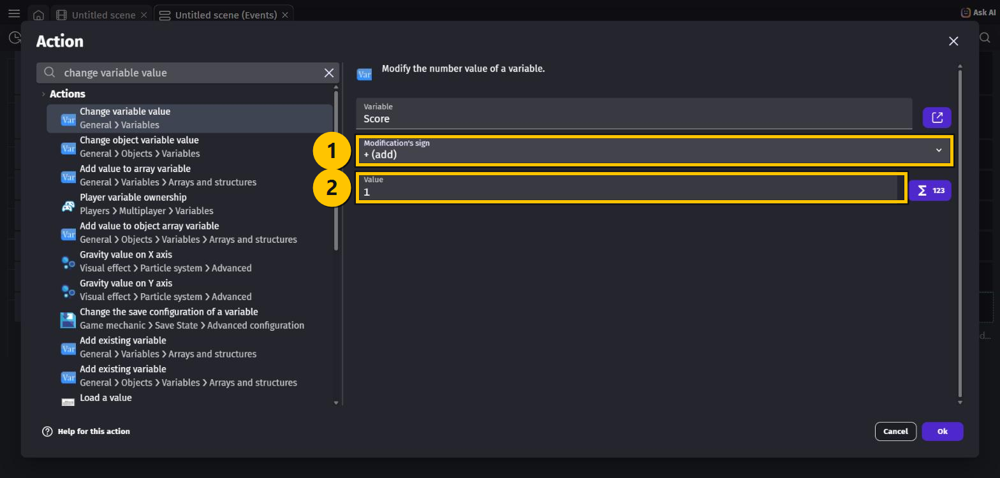

> ⚠️ Glemmer du at skifte til **+ (add)**, sætter du scoren **til** 1 hver gang i stedet for
> at lægge 1 **til**. Så står der 1 for evigt, uanset hvor mange mønter du samler.

---

## Opgave 5 – VARIABLER: Vis scoren på skærmen

Variablen tæller nu, men spilleren kan ikke se den. Det retter vi.

1. Lav et nyt event. **Denne gang skal du ikke lave nogen condition** — feltet til venstre
   skal stå tomt. Så kører actionen hele tiden, mange gange i sekundet.
2. **+ Add action** → vælg objektet **`ScoreText`** → søg efter `text` → vælg **Text**.
3. I feltet **Text** skriver du præcis dette:

```
"Score: " + Score
```

4. Tryk **Ok**.

### Hvad betyder den linje?

| Del | Betydning |
|---|---|
| `"Score: "` | Almindelig tekst. Alt mellem **anførselstegn** vises præcis som det står. |
| `+` | Sætter de to stykker sammen |
| `Score` | Henter **tallet** fra din variabel |

> 💡 Du skriver bare variablens navn — `Score`. GDevelop kan selv se, at det er et tal, og
> laver det om til tekst, fordi det står sammen med noget tekst.

> ⚠️ **Derfor hedder tekstobjektet `ScoreText`.** Havde du kaldt det `Score` ligesom
> variablen, ville GDevelop ikke kunne se, om `Score` betød objektet eller variablen.

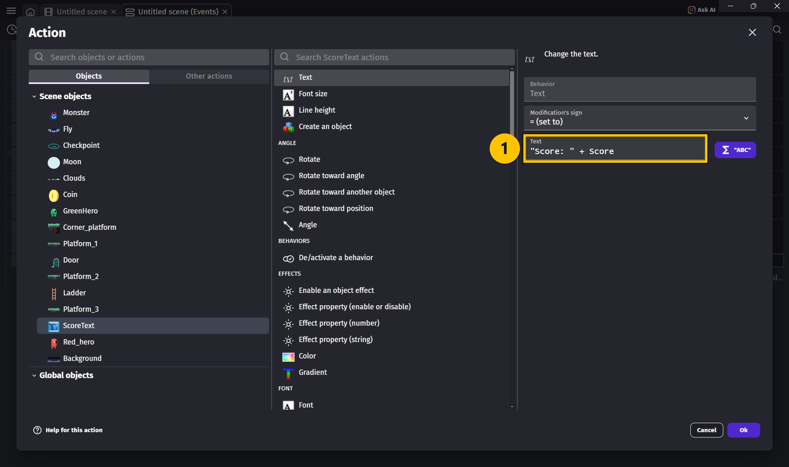

---

## Hele koden samlet

De tre nye events, du har lavet i denne lektion:

| # | Conditions (HVIS) | Actions (SÅ) |
|---|---|---|
| 1 | **At the beginning of the scene** | Change the variable `Score`: **set to** `0` |
| 2 | `Red_hero` **is in collision with** `Coin` | Delete `Coin`<br>Change the variable `Score`: **add** `1` |
| 3 | *(ingen — kører hele tiden)* | Change the text of `ScoreText`: set to `"Score: " + Score` |

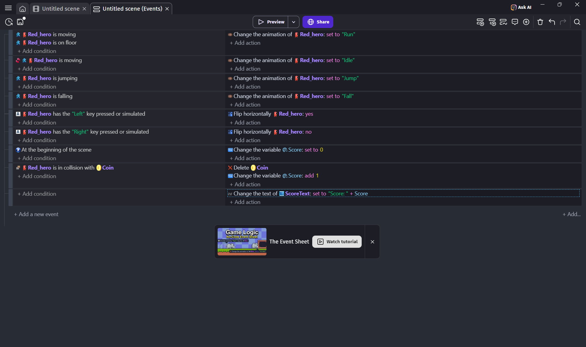

---

## Prøv spillet! 🎮

Tryk på **Preview**:

- Der står **Score: 0** i hjørnet
- Løb hen i en mønt → den **forsvinder**, og tallet bliver **1**
- Saml flere → tallet tæller op

Husk **Ctrl + S**.

---

## Ekstra: når counteren ikke kan følge med

Ligger to mønter helt tæt, opdager du måske, at **begge forsvinder, men scoren kun tæller
én op**.

Det er ikke en fejl i dit arbejde — det er sådan events virker. Actionen
*Change the variable* kører **én gang per event**, også selvom conditionen fandt tre mønter.

Sådan retter du det:

1. Klik på dit collision-event, så det er markeret.
2. Tryk **Shift + W** (**Choose and add an event**), og vælg **For each object**.
3. Vælg objektet **`Coin`**.
4. Flyt de to actions (**Delete** og **Change the variable**) ind i det nye for-each-event.

Nu kører actionerne **én gang for hver mønt**, den rørte ved — og så passer tallet.

> 💡 Kan du ikke få det til at passe, så lad det være. Med mønter, der ligger spredt ud,
> opdager man det aldrig. Det er mest et godt eksempel på, at man skal **teste** sit spil.

---

## Du er færdig med VARIABLER ✅

- [ ] Der er et **`ScoreText`**-objekt på scenen
- [ ] Der er en **global variabel** `Score` af typen **Number**
- [ ] Scoren nulstilles, når banen starter
- [ ] Mønter forsvinder, når helten rører dem
- [ ] Tallet på skærmen tæller op

**Næste gang** laver vi **fjender**, der går på patrulje.

---

## Hvis noget går galt

| Problem | Løsning |
|---|---|
| Der står stadig **Score: 0**, selvom mønterne forsvinder | Event 3 mangler, eller udtrykket er skrevet forkert. Tjek anførselstegn og parenteser. |
| Tallet står altid på **1** | **Modification's sign** står på **= (set to)**. Den skal være **+ (add)**. |
| Mønterne forsvinder ikke | Conditionen peger måske på det forkerte objekt. Den skal være `Red_hero` **i collision med** `Coin`. |
| GDevelop siger, udtrykket er forkert | Tjek anførselstegnene: der skal være ét **før** `Score:` og ét **efter** mellemrummet. Og husk `+` mellem de to dele. |
| Der står `Score: 0` hele tiden, selvom tallet tæller | Du har måske skrevet `"Score: Score"` — så står ordet der bare. Variablen skal stå **uden for** anførselstegnene. |
| Der står *"This variable has the same name as an object"* | Dit tekstobjekt hedder `Score` ligesom variablen. Omdøb objektet til `ScoreText`. |
| Jeg kan ikke se teksten i spillet | Du har måske ikke trukket `ScoreText` ind på scenen. Eller den står uden for skærmen. |
| Teksten er sort på sort baggrund | Skift **Color** i objektets indstillinger, eller flyt teksten hen over noget lyst. |

---

Opgaverne bygger på det oprindelige GDevelop-forløb fra
[mom2day.dk/gdevelop-middel-variabler](https://mom2day.dk/gdevelop-middel-variabler). 🙏
