# OPGAVER TIL GDevelop – MIDDEL – VARIABLER

> **VIDEN**
>
> En variabel hjælper spillet med at huske ting, fx hvor mange mønter du har samlet. I denne
> lektion laver du en score, der tæller op, når helten samler en mønt.
>
> Knapperne står på engelsk, så vi skriver deres navne, som de står på skærmen. Bokse med
> hel kant er **GØR DETTE**. Bokse med stiplet kant er **VIDEN**. Gule felter viser, hvor du
> skal klikke. Tallene ved felterne passer til tallene i teksten.
{: .lesson-info}

---

## To ord du skal kende

> **VIDEN**
>
> En **variabel** er en lille kasse, der gemmer et tal eller tekst. Den har et navn, fx
> `Score`, og en værdi, fx `7`.
>
> En **global variabel** virker i hele spillet. Derfor kan scoren blive med dig, når du går
> til en ny bane. En **scene-variabel** gælder kun i én scene. En **objekt-variabel** hører
> til ét objekt. Dem bruger vi senere.
{: .lesson-info}

---

## Opgave 1 – VARIABLER: Lav et tekstfelt til scoren

> **VIDEN**
>
> Først laver du et tekstfelt, der kan vise tallet.
{: .lesson-info}

> **GØR DETTE**
>
> 1. Vælg **+ Add object** i **Objects**.
> 2. Vælg **New object from scratch** **(1)**.
{: .lesson-action}

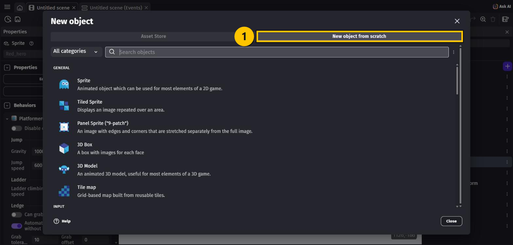

> **GØR DETTE**
>
> Skriv `text` i søgefeltet, og vælg **Text** **(1)** — den viser tekst på skærmen.
{: .lesson-action}

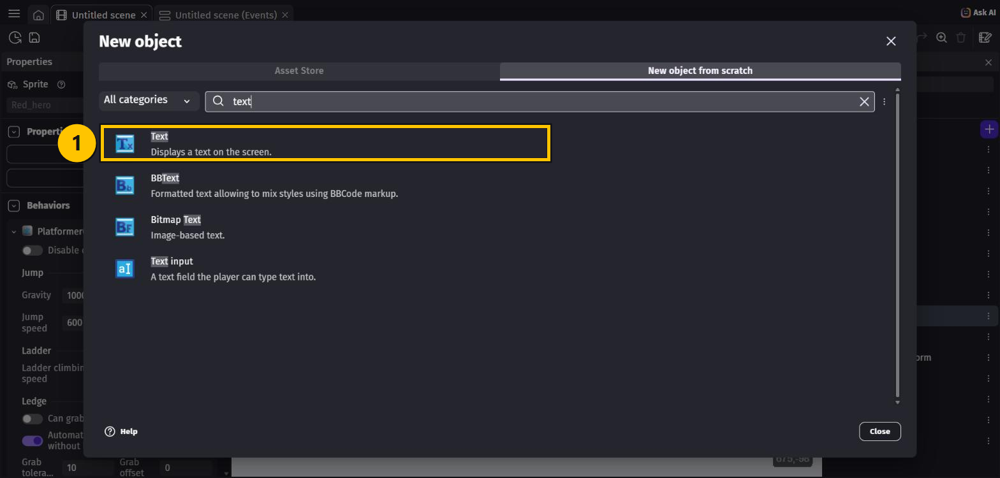

> **GØR DETTE**
>
> Sæt indstillingerne sådan:
> - **Object name** **(1)**: `ScoreText`
> - **Size** **(2)**: `32`
> - **Initial text to display** **(3)**: `Score: 0`
>
> Vælg **Apply**.
{: .lesson-action}

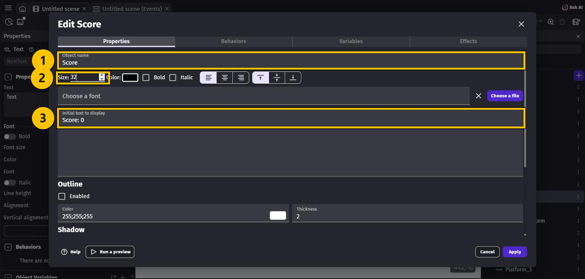

> **GØR DETTE**
>
> Træk `ScoreText` ind på scenen. Sæt det oppe i venstre hjørne.
{: .lesson-action}

> **VIDEN**
>
> Tekstobjektet hedder `ScoreText`, og variablen hedder `Score`. De må ikke have samme navn.
> Ellers får du denne advarsel **(1)**:
>
> 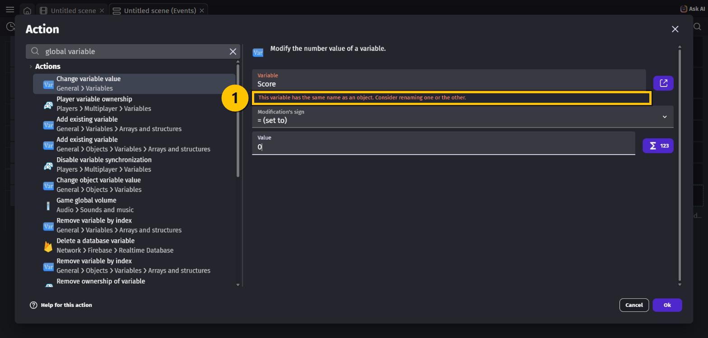
{: .lesson-info}

---

## Opgave 2 – VARIABLER: Lav den globale variabel

> **GØR DETTE**
>
> 1. Vælg **☰** øverst til venstre for at åbne **Project manager**.
> 2. Under **Game settings** vælger du **Global variables**.
> 3. Vælg **+ Add a variable** **(1)**.
{: .lesson-action}

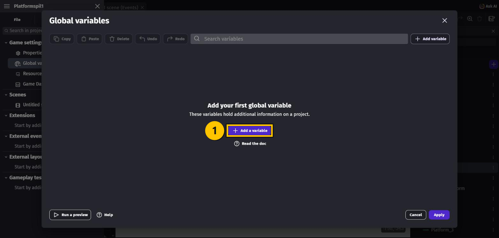

> **GØR DETTE**
>
> Udfyld felterne sådan:
> - **Name** **(1)**: `Score`
> - **Type** **(2)**: **Number**
> - **Value** **(3)**: `0`
>
> Vælg **Apply**.
{: .lesson-action}

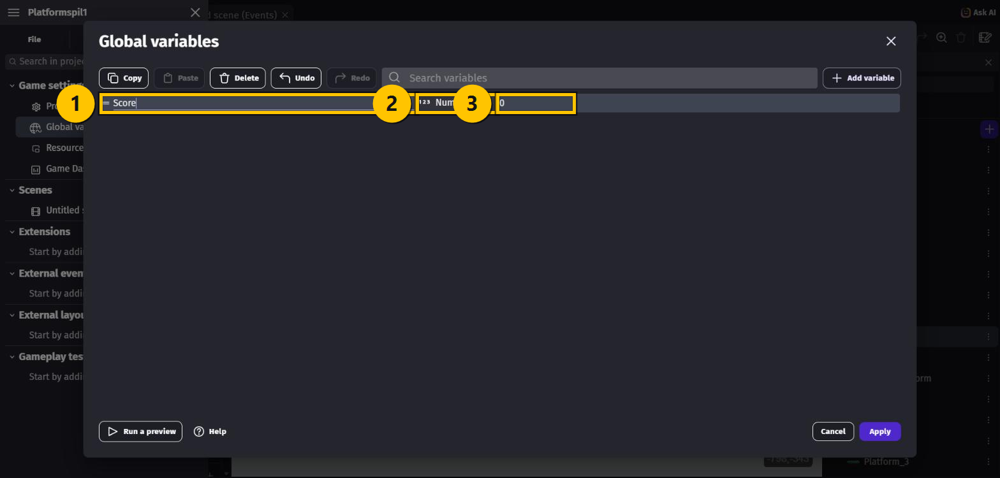

---

## Opgave 3 – VARIABLER: Nulstil scoren, når banen starter

> **VIDEN**
>
> En ny scene skal starte med 0 point. Det gør en regel, der kører, når scenen starter.
{: .lesson-info}

> **GØR DETTE**
>
> 1. Åbn fanen **(Events)**.
> 2. Vælg **+ Add a new event**.
> 3. Vælg **+ Add condition**. Skriv `beginning of the scene` i det øverste søgefelt.
> 4. Vælg **At the beginning of the scene**, og vælg **Ok**.
{: .lesson-action}

> **VIDEN**
>
> Det øverste søgefelt søger i alt. Det nederste søger kun i det objekt, du har valgt.
{: .lesson-info}

> **GØR DETTE**
>
> 1. Vælg **+ Add action**. Søg efter `change variable value`, og vælg **Change variable
>    value**.
> 2. I feltet **Variable** vælger du **Score** **(1)**.
> 3. Lad **Modification's sign** stå på **= (set to)**. Skriv `0` i **Value**, og vælg
>    **Ok**.
{: .lesson-action}

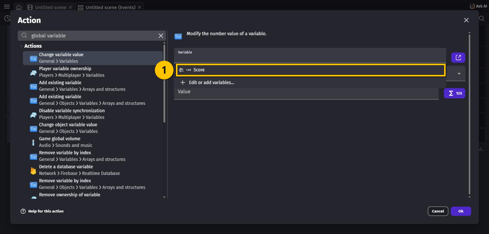

> **VIDEN**
>
> Nu starter spillet med 0 point, også når du prøver igen.
{: .lesson-info}

---

## Opgave 4 – VARIABLER: Saml mønterne

> **GØR DETTE**
>
> Træk nogle `Coin` ind på scenen. Sæt dem et sted, hvor helten kan nå dem.
{: .lesson-action}

> **GØR DETTE**
>
> 1. Lav et nyt event.
> 2. Vælg **+ Add condition**. Vælg `Red_hero`, søg efter `collision`, og vælg **Collision**.
> 3. I feltet **Object** vælger du `Coin` **(1)**. Vælg **Ok**.
{: .lesson-action}

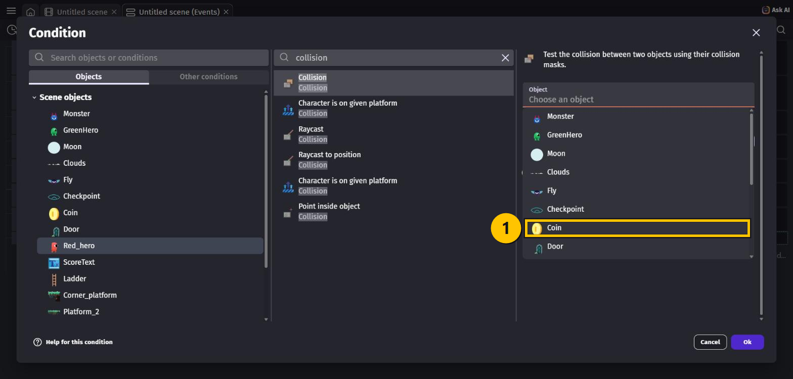

> **GØR DETTE**
>
> 1. Vælg **+ Add action**. Vælg `Coin`, søg efter `delete`, vælg **Delete the object**,
>    og vælg **Ok**.
> 2. Vælg **+ Add action** igen. Søg efter `change variable value`, og vælg den.
> 3. Sæt **Variable** til `Score`.
> 4. Sæt **Modification's sign** til **+ (add)** **(1)**. Skriv `1` i **Value** **(2)**.
> 5. Vælg **Ok**.
{: .lesson-action}

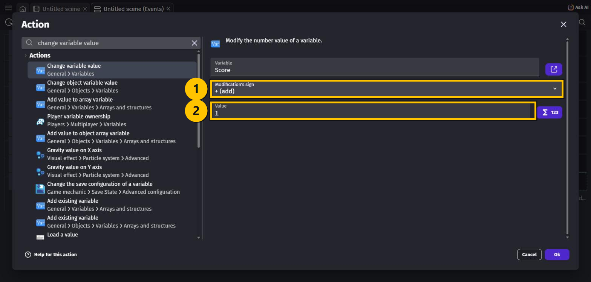

> **VIDEN**
>
> Hvis tegnet står på **= (set to)**, bliver scoren sat til 1 hver gang. Vælg **+ (add)**,
> så lægger spillet 1 til scoren.
{: .lesson-info}

---

## Opgave 5 – VARIABLER: Vis scoren på skærmen

> **VIDEN**
>
> Scoren tæller nu, men du kan ikke se den endnu.
{: .lesson-info}

> **GØR DETTE**
>
> 1. Lav et nyt event. Lad venstre side stå tom. Uden en condition kører actionen hele tiden.
> 2. Vælg **+ Add action**. Vælg `ScoreText`, søg efter `text`, og vælg **Text**.
> 3. I feltet **Text** skriver du **(1)** præcis:
>
>    ```text
>    "Score: " + Score
>    ```
>
> 4. Vælg **Ok**.
{: .lesson-action}

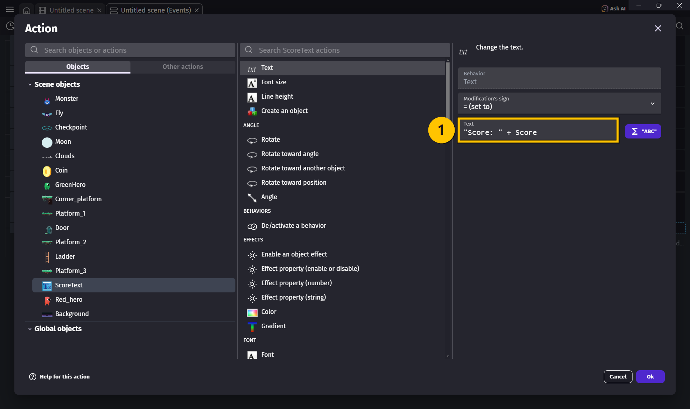

### Hvad betyder den linje?

> **VIDEN**
>
> | Del | Betydning |
> |---|---|
> | `"Score: "` | Teksten, der står på skærmen |
> | `+` | Sætter tekst og tal sammen |
> | `Score` | Henter tallet fra variablen |
>
> Variablens navn `Score` står uden for anførselstegnene. Tekstobjektet hedder `ScoreText`,
> så GDevelop kan kende forskel på de to.
{: .lesson-info}

---

## Hele koden samlet

> **VIDEN**
>
> De tre events i denne lektion:
>
> | # | Conditions (HVIS) | Actions (SÅ) |
> |---|---|---|
> | 1 | **At the beginning of the scene** | Set `Score` to `0` |
> | 2 | `Red_hero` touches `Coin` | Delete `Coin`; add `1` to `Score` |
> | 3 | *(ingen — kører hele tiden)* | Show `"Score: " + Score` in `ScoreText` |
{: .lesson-info}

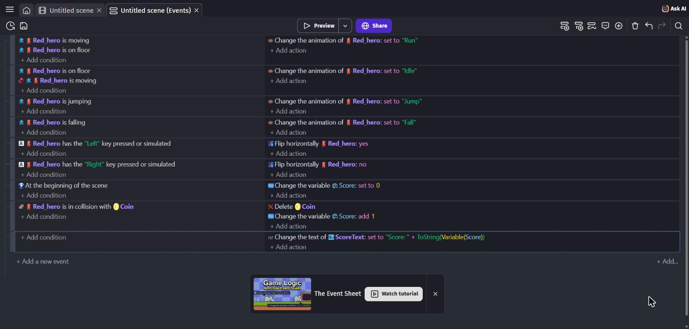

---

## Prøv spillet! 🎮

> **GØR DETTE**
>
> Vælg **Preview**, og løb hen til en mønt.
{: .lesson-action}

> **VIDEN**
>
> Scoren skal starte på **Score: 0**. Når du samler en mønt, forsvinder den, og scoren bliver
> 1. Saml flere mønter for at få flere point.
{: .lesson-info}

> **GØR DETTE**
>
> Gem med **Ctrl + S**.
{: .lesson-action}

---

## Ekstra: når counteren ikke kan følge med

> **VIDEN**
>
> Hvis to mønter ligger tæt, kan begge forsvinde, selvom scoren kun stiger med 1. Det sker,
> fordi eventet ændrer scoren én gang, selvom det finder flere mønter.
{: .lesson-info}

> **GØR DETTE**
>
> Sådan kan du rette det:
> 1. Vælg collision-eventet.
> 2. Tryk **Shift + W**, og vælg **For each object**.
> 3. Vælg `Coin`.
> 4. Flyt actions **Delete** og **Change the variable** ind i det nye event.
{: .lesson-action}

> **VIDEN**
>
> Nu kører actions én gang for hver mønt. Hvis mønterne ligger langt fra hinanden, behøver du
> ikke lave denne ekstra rettelse.
{: .lesson-info}

---

## Du er færdig med VARIABLER ✅

> **VIDEN**
>
> Du er klar til næste lektion, når:
>
> - Der er et `ScoreText`-objekt på scenen.
> - Der er en global variabel `Score` af typen **Number**.
> - Scoren starter på 0.
> - Mønter forsvinder, når helten rører dem.
> - Tallet på skærmen tæller op.
{: .lesson-info}

> **VIDEN**
>
> Næste gang laver du fjender, der går på patrulje.
{: .lesson-info}

---

## Hvis noget går galt

| Problem | Løsning |
|---|---|
| Der står stadig **Score: 0**, selvom mønterne forsvinder | **GØR DETTE:** Tjek at event 3 findes, og at udtrykket er skrevet rigtigt. |
| Tallet står altid på **1** | **GØR DETTE:** Sæt **Modification's sign** til **+ (add)**. |
| Mønterne forsvinder ikke | **GØR DETTE:** Tjek at `Red_hero` rører `Coin` i conditionen. |
| GDevelop siger, udtrykket er forkert | **GØR DETTE:** Tjek anførselstegnene og `+` i udtrykket. |
| Der står `Score: 0` hele tiden, selvom tallet tæller | **GØR DETTE:** Skriv `"Score: "` og `Score` uden for anførselstegnene. |
| Der står *"This variable has the same name as an object"* | **GØR DETTE:** Omdøb tekstobjektet til `ScoreText`. |
| Jeg kan ikke se teksten i spillet | **GØR DETTE:** Træk `ScoreText` ind på scenen, og flyt det ind på skærmen. |
| Teksten er sort på sort baggrund | **GØR DETTE:** Skift **Color**, eller flyt teksten hen over en lys baggrund. |
{: .lesson-help}

---

> **VIDEN**
>
> Opgaverne bygger på det oprindelige GDevelop-forløb fra
> [mom2day.dk/gdevelop-middel-variabler](https://mom2day.dk/gdevelop-middel-variabler).
{: .lesson-info}
