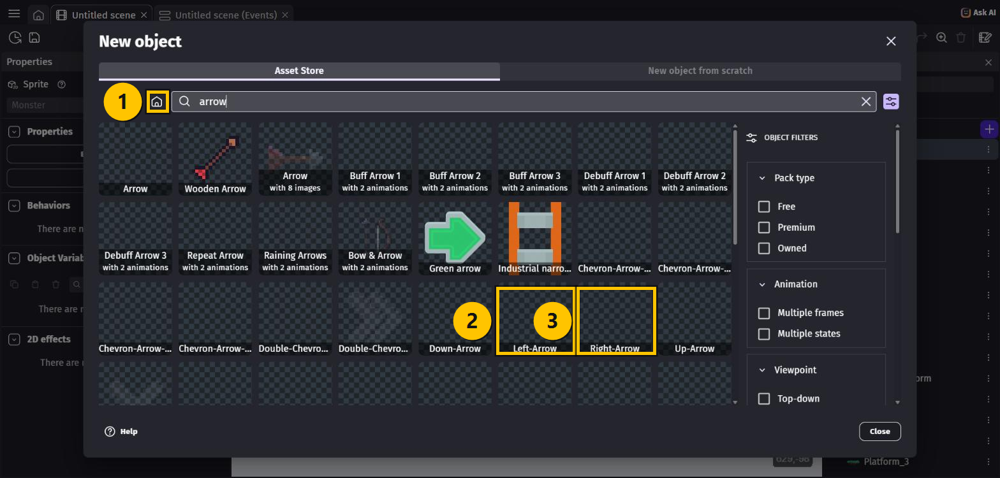
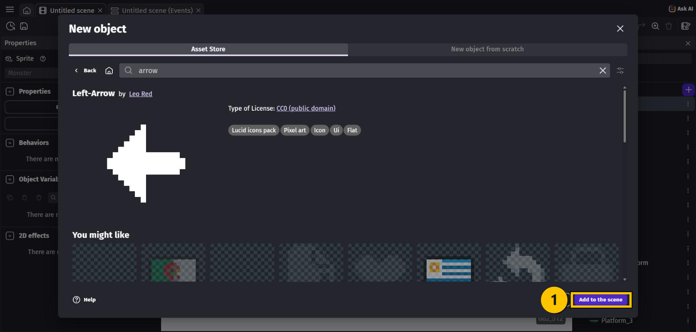
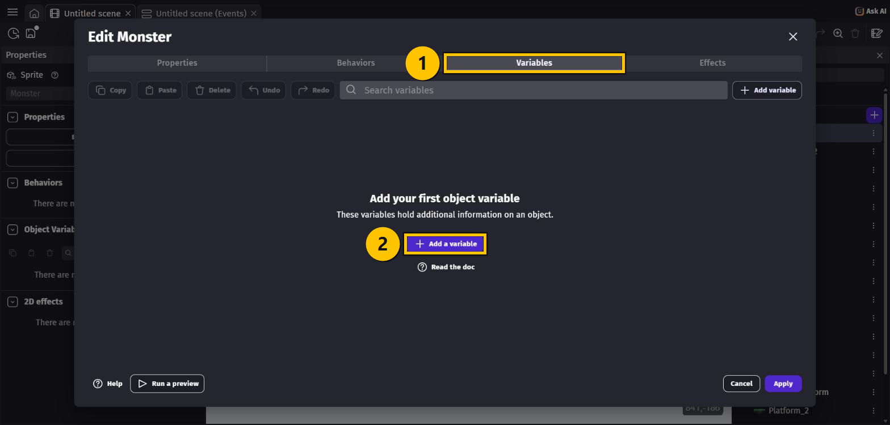
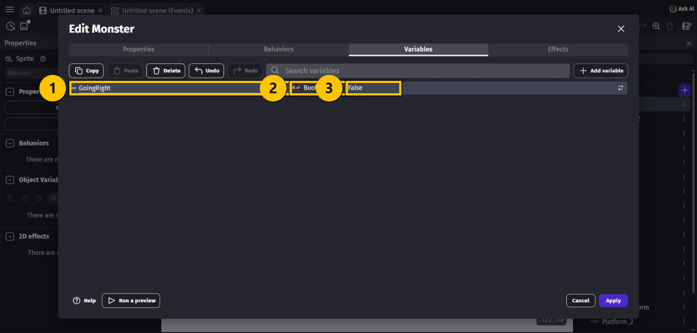
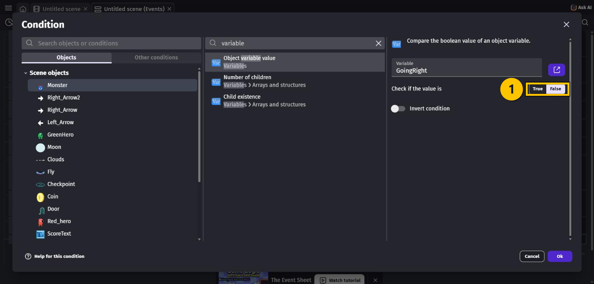
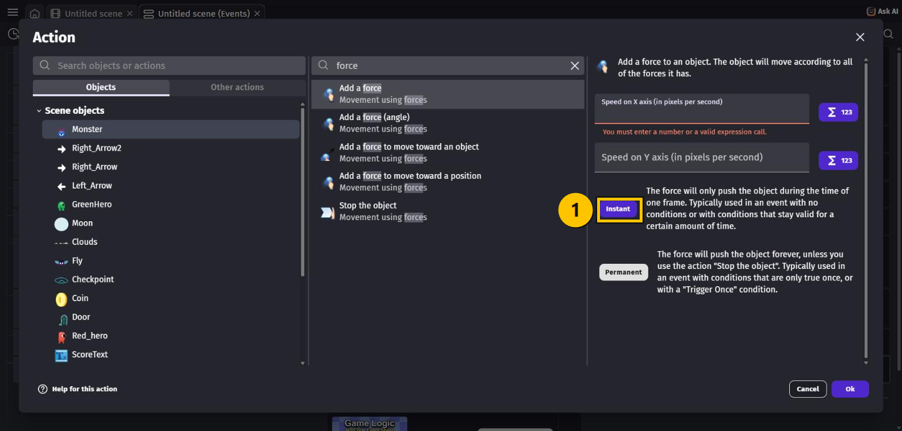
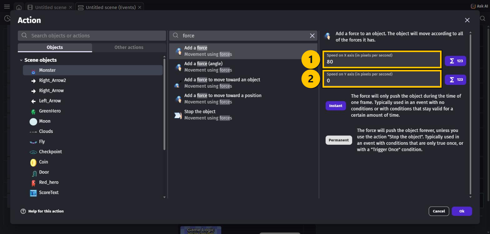
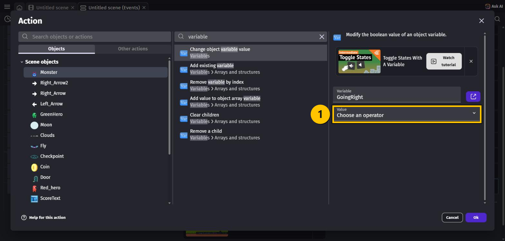
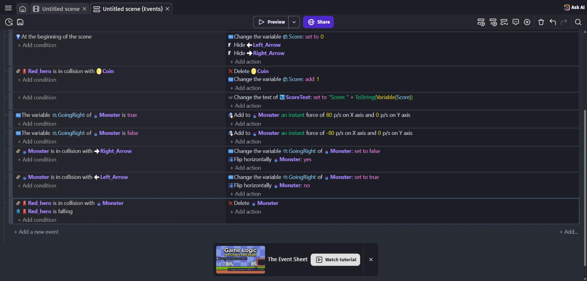

# OPGAVER TIL GDevelop – MIDDEL – FJENDER

Nu bliver spillet farligt. Du skal lave et **monster, der går frem og tilbage** på en
platform — og som du kan besejre ved at hoppe oven på det.

Undervejs lærer du to nye ting: **objekt-variabler** og **kræfter (forces)**.

> 🟡 **Om billederne:** de gule kasser viser, hvor du skal klikke.

---

## Tre ord du skal kende

**Objekt-variabel** — en variabel, der hører til **ét bestemt objekt**. `Score` fra sidste
lektion var *global* — hele spillet deler den. Men hvert monster skal huske sin **egen**
retning, så den variabel skal bo på monsteret.

**Boolean** — en variabel, der kun kan være **true** (sand) eller **false** (falsk). Perfekt
til ja/nej-spørgsmål som *"går monsteret til højre?"*.

**Force** — et skub. I stedet for at flytte monsteret et bestemt antal pixels, skubber vi
det med en fart, fx **80 pixels i sekundet**.

---

## Sådan virker et monster på patrulje

Trickset er enkelt, når man først har set det:

1. Vi lægger to **usynlige vendepunkter** i hver ende af platformen.
2. Monsteret skubbes hele tiden mod den ene side.
3. Rører det et vendepunkt, **vender det om**.

Vendepunkterne er bare to almindelige objekter, vi **skjuler**, når spillet starter. Fordi
de er usynlige, betyder det ikke noget, hvordan de ser ud — men pile er nemme at forstå,
mens man bygger.

---

## Opgave 1 – FJENDER: Hent to pile

1. Tryk **+ Add object** → fanen **Asset Store**.
2. Tryk på **hus-ikonet** ved siden af søgefeltet, så du kommer ud af den pakke, du
   sidst kiggede i.
3. Søg efter `arrow`.

4. Find **Left-Arrow**, klik på den, og tryk **Add to the scene**.

5. Tryk **Back**, find **Right-Arrow**, og gør det samme.
6. Luk med **Close**.

Objekterne hedder nu **`Left_Arrow`** og **`Right_Arrow`** i **Objects**-panelet.

> ✏️ **Vil du hellere tegne dine egne pile?**
> Det kan du — men **kun i programmet på din PC**, ikke i browseren. Vælg
> **+ Add object** → **New object from scratch** → **Sprite** → **Edit with Piskel**,
> tegn din pil, og gem den. Kald objekterne `Left_Arrow` og `Right_Arrow`, så passer
> resten af opgaven. Pilene bliver alligevel skjult, når spillet kører, så det er mest
> for sjov.

---

## Opgave 2 – FJENDER: Byg patruljen op

1. Træk **`Monster`** ind på scenen, oven på en platform.
2. Træk **`Left_Arrow`** ind, så den står ved platformens **venstre** ende.
3. Træk **`Right_Arrow`** ind, så den står ved platformens **højre** ende.

Sørg for, at pilene står **oven på platformen**, i samme højde som monsteret — ellers rører
monsteret dem aldrig.

> 💡 **Smart trick:** Når patruljen virker, kan du markere monsteret og begge pile (hold
> **Shift** nede, og klik på dem én ad gangen), holde **Ctrl** nede og trække. Så får du en
> hel ny patrulje på en anden platform.

---

## Opgave 3 – FJENDER: Giv monsteret en hukommelse

Monsteret skal huske, hvilken vej det går. Det gør vi med en objekt-variabel.

1. **Dobbeltklik på `Monster`** i **Objects**-panelet.
2. Vælg fanen **Variables** øverst.
3. Tryk **+ Add a variable**.

4. Udfyld linjen:
   - **Navn**: `GoingRight`
   - **Type**: **Boolean** (skift fra Number)
   - **Værdi**: **False**
5. Tryk **Apply**.

---

## Opgave 4 – FJENDER: Få monsteret til at gå

Åbn fanen **(Events)**.

### Skjul pilene

Find dit event **At the beginning of the scene** fra sidste lektion. Tilføj **to actions**
til det:

- `Left_Arrow` → søg efter `hide` → **Hide**
- `Right_Arrow` → søg efter `hide` → **Hide**

Nu er vendepunkterne usynlige, når spillet kører — men de virker stadig.

### Monsteret går til højre

1. Lav et nyt event.
2. **+ Add condition** → `Monster` → søg efter `variable` → **Object variable value**.
3. Skriv `GoingRight` i feltet **Variable**, og vælg den i listen.
4. Boksen skifter til **Check if the value is** med **True** og **False**. Vælg **True**.
   Tryk **Ok**.

> 💡 Læg mærke til, at boksen selv fandt ud af, at `GoingRight` er en **boolean**. Havde det
> været et tal, havde den bedt om et tal at sammenligne med.

5. **+ Add action** → `Monster` → søg efter `force` → **Add a force**.
6. Sæt **Speed on X axis** til `80` og **Speed on Y axis** til `0`.
7. Vælg **Instant** (ikke Permanent). Tryk **Ok**.

> 💡 **Instant** skubber kun i ét billede — så skal der skubbes igen. Det er præcis, hvad vi
> vil have, når conditionen er sand hele tiden. **Permanent** skubber for evigt, indtil man
> siger stop, og det ville få monsteret til at accelerere ud i det uendelige.

### Monsteret går til venstre

Lav præcis det samme event én gang til, men med to ændringer:

| | Højre | Venstre |
|---|---|---|
| Condition: `GoingRight` er | **True** | **False** |
| **Speed on X axis** | `80` | `-80` |

Et **minus** foran farten betyder "den anden vej".

---

## Opgave 5 – FJENDER: Få monsteret til at vende om

To events mere — ét for hver pil.

1. Lav et nyt event.
2. **+ Add condition** → `Monster` → søg efter `collision` → **Collision**.
   I feltet **Object** skriver du `Right_Arrow` og vælger den. Tryk **Ok**.
3. **+ Add action** → `Monster` → søg efter `variable` →
   **Change object variable value**.
4. Skriv `GoingRight` i **Variable**, og vælg den. I **Value** vælger du **set to false**.
   Tryk **Ok**.

5. **+ Add action** → `Monster` → søg efter `flip` → **Flip the object horizontally** →
   **Activate flipping: Yes**. Tryk **Ok**.

Og så det spejlvendte event:

| Event | Condition | Actions |
|---|---|---|
| Rører **Right_Arrow** | `Monster` in collision with `Right_Arrow` | `GoingRight` → **set to false** Flip horizontally: **Yes** |
| Rører **Left_Arrow** | `Monster` in collision with `Left_Arrow` | `GoingRight` → **set to true** Flip horizontally: **No** |

> 💡 Vender monsteret den forkerte vej, så byt om på **Yes** og **No** i de to Flip-actions.
> Det afhænger af, hvilken vej figuren kigger i forvejen.

---

## Opgave 6 – FJENDER: Hop på monsteret

Nu skal helten kunne besejre monsteret ved at lande oven på det.

1. Lav et nyt event.
2. **+ Add condition** → `Red_hero` → `collision` → **Collision** → **Object**: `Monster`.
3. **+ Add condition** igen → `Red_hero` → søg efter `falling` → **Is falling**.
4. **+ Add action** → `Monster` → søg efter `delete` → **Delete the object**.

De **to** conditions sammen er hele tricket: helten skal både **røre** monsteret **og**
være på vej **nedad**. Løber han ind i det fra siden, sker der ingenting.

---

## Hele koden samlet

| # | Conditions (HVIS) | Actions (SÅ) |
|---|---|---|
| 1 | **At the beginning of the scene** | Hide `Left_Arrow` Hide `Right_Arrow` |
| 2 | `GoingRight` of `Monster` is **true** | Add to `Monster` an **instant** force of **80** on X, **0** on Y |
| 3 | `GoingRight` of `Monster` is **false** | Add to `Monster` an **instant** force of **-80** on X, **0** on Y |
| 4 | `Monster` in collision with `Right_Arrow` | `GoingRight` → **set to false** Flip horizontally `Monster`: **yes** |
| 5 | `Monster` in collision with `Left_Arrow` | `GoingRight` → **set to true** Flip horizontally `Monster`: **no** |
| 6 | `Red_hero` in collision with `Monster` `Red_hero` **is falling** | Delete `Monster` |

---

## Prøv spillet! 🎮

Tryk **Preview**:

- Monsteret **går frem og tilbage** mellem de to usynlige pile
- Det **vender ansigtet** den rigtige vej
- Hopper du **oven på** det, **forsvinder** det
- Løber du ind i det fra siden, sker der (endnu) ingenting

Husk **Ctrl + S**.

> 💡 **Hvorfor sker der ikke noget, når man løber ind i monsteret?** Fordi helten skal kunne
> **dø** — og så skal spillet vise en **You Lose**-skærm. Den scene har vi ikke lavet endnu.
> Det kommer i ADVANCED. Indtil da er monsteret harmløst fra siden.

---

## Du er færdig med FJENDER ✅

- [ ] `Left_Arrow` og `Right_Arrow` står i hver sin ende af platformen
- [ ] Begge bliver **skjult**, når spillet starter
- [ ] `Monster` har objekt-variablen `GoingRight` af typen **Boolean**
- [ ] Monsteret går frem og tilbage helt af sig selv
- [ ] Monsteret forsvinder, når du hopper oven på det

**Næste gang** laver vi **flere scener**: en startmenu og en **You Win**-skærm.

---

## Hvis noget går galt

| Problem | Løsning |
|---|---|
| Monsteret står helt stille | Tjek at `GoingRight` er en **Boolean**, og at de to force-events bruger **True** og **False**. |
| Monsteret farer ud af skærmen | Du har valgt **Permanent** i stedet for **Instant**. |
| Monsteret vender aldrig om | Pilene står nok ikke i samme højde som monsteret, så de rører aldrig hinanden. Flyt dem ned på platformen. |
| Monsteret ryster på stedet | Pilene står for tæt på hinanden, eller oven i monsteret. Flyt dem længere ud mod enderne. |
| Monsteret går baglæns | Byt om på **Yes** og **No** i de to Flip-actions. |
| Jeg kan ikke se pilene i editoren | De er kun skjult, **når spillet kører**. I editoren kan du altid se dem. |
| Monsteret dør, når jeg bare rører det | Du mangler conditionen **Is falling** på helten. |
| `Right-Arrow` kom med to gange | Højreklik på det ekstra objekt i **Objects**-panelet, og vælg **Delete**. |

---

Opgaverne bygger på det oprindelige GDevelop-forløb fra
[mom2day.dk/gdevelop-middel-fjender](https://mom2day.dk/gdevelop-middel-fjender). 🙏
