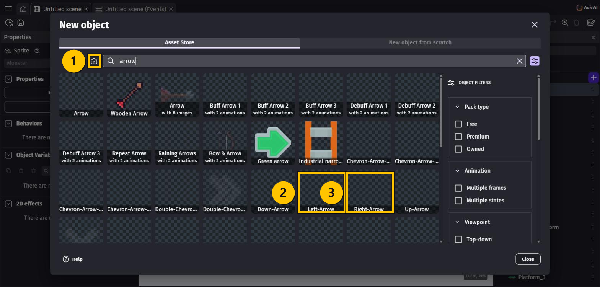
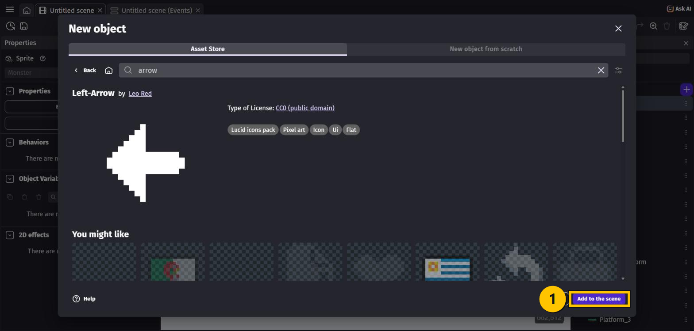
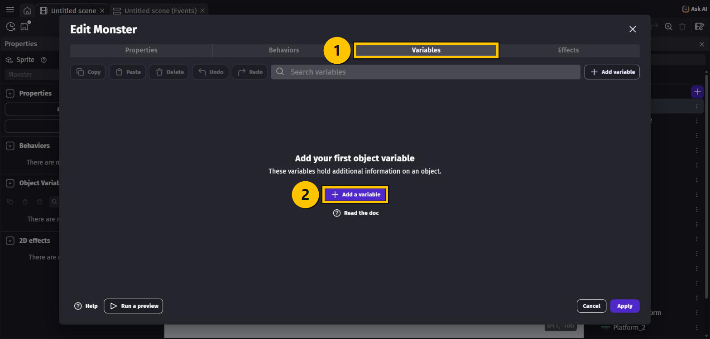
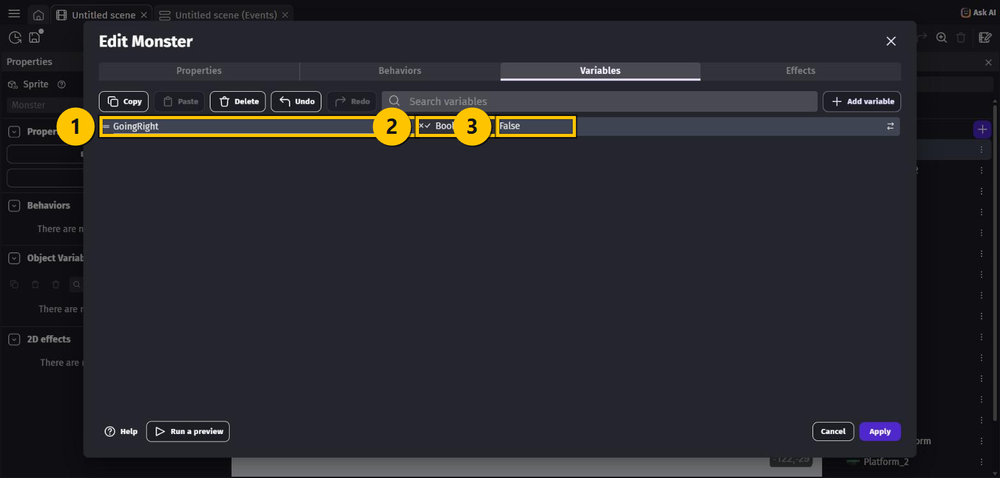
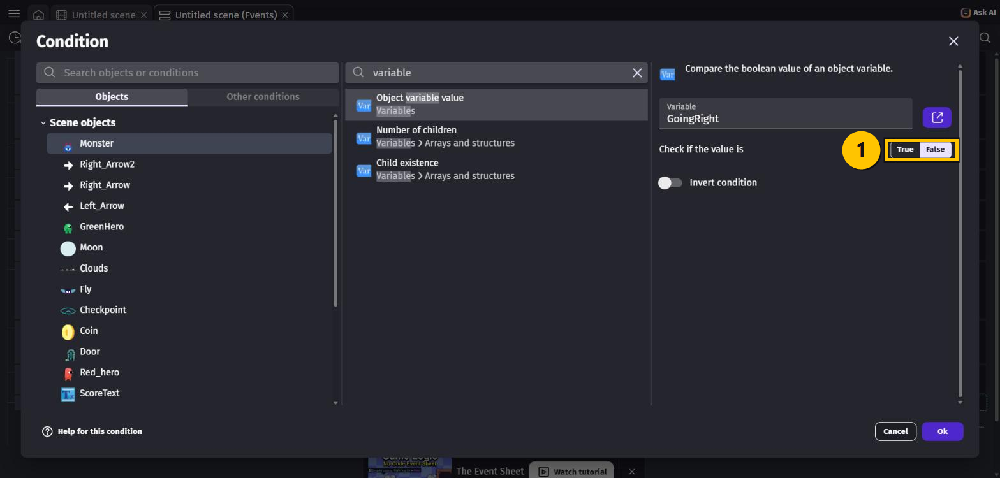
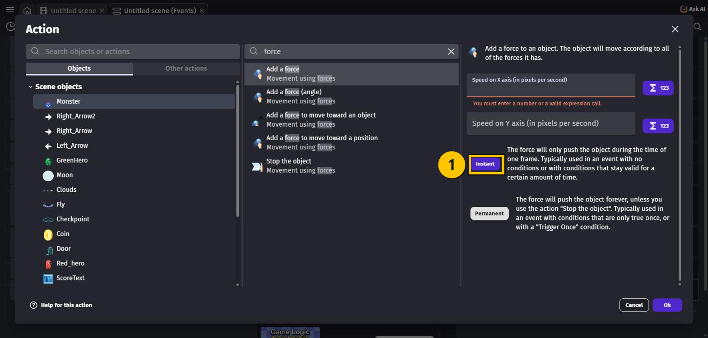
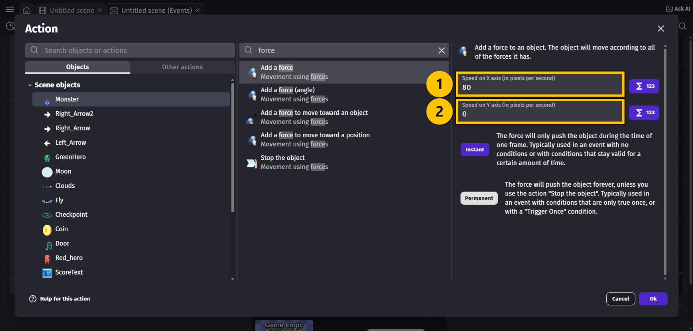
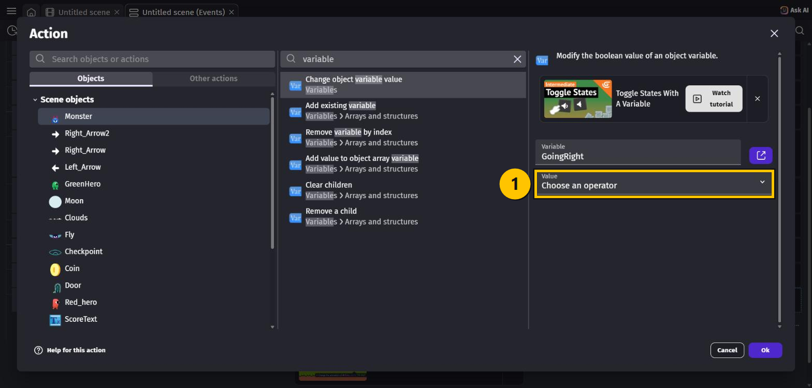
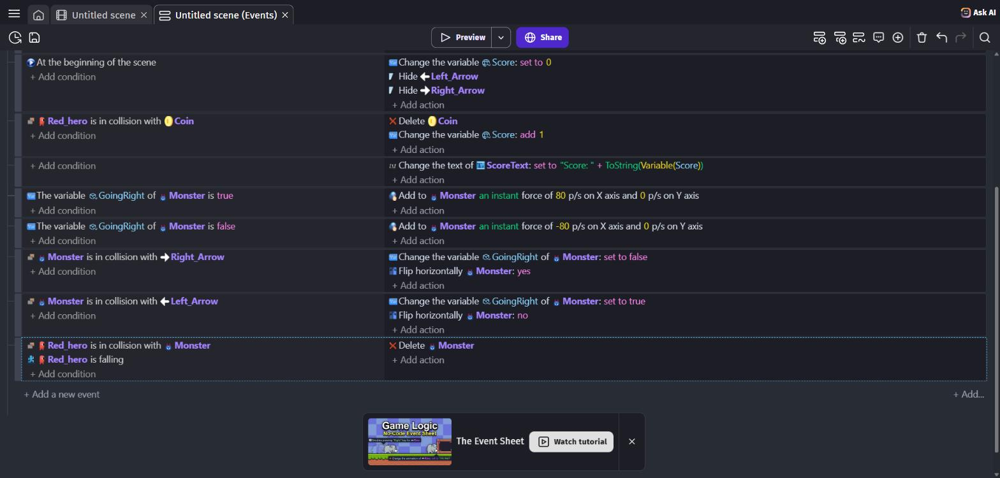

# OPGAVER TIL GDevelop – MIDDEL – FJENDER

> **VIDEN**
>
> I denne lektion laver du et monster, der går frem og tilbage på en platform. Du kan besejre
> det ved at hoppe oven på det.
>
> Knapperne står på engelsk. Vi skriver deres navne, som de står på skærmen. Bokse med hel
> kant er **GØR DETTE**. Bokse med stiplet kant er **VIDEN**. Gule felter viser, hvor du
> skal klikke. Tallene ved felterne passer til tallene i teksten.
{: .lesson-info}

---

## Tre ord du skal kende

> **VIDEN**
>
> En **objekt-variabel** hører til ét objekt. Hvert monster skal huske sin egen retning.
>
> En **Boolean** kan være **True** (ja) eller **False** (nej).
>
> En **force** er et skub, der får en figur til at bevæge sig.
{: .lesson-info}

---

## Sådan virker et monster på patrulje

> **VIDEN**
>
> Vi sætter to pile ved enderne af platformen og skjuler dem, når spillet starter. Monsteret
> går mod den ene pil. Når det rører pilen, vender det om.
{: .lesson-info}

---

## Opgave 1 – FJENDER: Hent to pile

> **GØR DETTE**
>
> 1. Vælg **+ Add object** → **Asset Store**.
> 2. Vælg hus-ikonet **(1)** ved søgefeltet.
> 3. Søg efter `arrow`.
> 4. Find **Left-Arrow** **(2)**, og vælg den.
> 5. Du skal også bruge **Right-Arrow** **(3)**. Du vælger den efter Left-Arrow.
{: .lesson-action}

> **GØR DETTE**
>
> På siden for **Left-Arrow** vælger du **Add to the scene** **(1)**.
{: .lesson-action}

> **GØR DETTE**
>
> 1. Vælg **Back**, og vælg **Right-Arrow** i søgeresultatet.
> 2. Vælg **Add to the scene**.
> 3. Vælg **Close**.
{: .lesson-action}

> **VIDEN**
>
> I **Objects** hedder pilene nu `Left_Arrow` og `Right_Arrow`.
{: .lesson-info}

> **GØR DETTE**
>
> Vil du tegne dine egne pile? Vælg **+ Add object** → **New object from scratch** →
> **Sprite** → **Edit with Piskel**. Tegn pilen, gem den, og kald objekterne `Left_Arrow`
> og `Right_Arrow`.
{: .lesson-action}

> **VIDEN**
>
> Pilene bliver skjult, når spillet kører. Du kan prøve Piskel for sjov.
{: .lesson-info}

---

## Opgave 2 – FJENDER: Byg patruljen op

> **GØR DETTE**
>
> 1. Træk `Monster` ind på en platform.
> 2. Sæt `Left_Arrow` ved platformens venstre ende.
> 3. Sæt `Right_Arrow` ved højre ende.
> 4. Sæt pilene oven på platformen, i samme højde som monsteret.
{: .lesson-action}

> **VIDEN**
>
> Så kan monsteret røre pilene og vende om.
{: .lesson-info}

> **GØR DETTE**
>
> Vil du lave en kopi af hele patruljen? Hold **Shift** nede, og vælg monsteret og begge
> pile. Hold så **Ctrl** nede, og træk dem til en anden platform.
{: .lesson-action}

---

## Opgave 3 – FJENDER: Giv monsteret en hukommelse

> **VIDEN**
>
> Monsteret skal huske, hvilken vej det går. Det gør en objekt-variabel.
{: .lesson-info}

> **GØR DETTE**
>
> 1. Dobbeltklik på `Monster` i **Objects**.
> 2. Vælg fanen **Variables** **(1)**.
> 3. Vælg **+ Add a variable** **(2)**.
{: .lesson-action}

> **GØR DETTE**
>
> Udfyld felterne:
> - **Name** **(1)**: `GoingRight`
> - **Type** **(2)**: **Boolean**
> - **Value** **(3)**: **False**
>
> Vælg **Apply**.
{: .lesson-action}

---

## Opgave 4 – FJENDER: Få monsteret til at gå

> **GØR DETTE**
>
> Åbn fanen **(Events)**.
{: .lesson-action}

### Skjul pilene

> **GØR DETTE**
>
> Find eventet **At the beginning of the scene**. Tilføj to actions:
> - `Left_Arrow` → søg efter `hide` → **Hide**
> - `Right_Arrow` → søg efter `hide` → **Hide**
{: .lesson-action}

> **VIDEN**
>
> Pilene er nu skjult, når spillet kører. De virker stadig som vendepunkter.
{: .lesson-info}

### Monsteret går til højre

> **GØR DETTE**
>
> 1. Lav et nyt event.
> 2. Vælg **+ Add condition**. Vælg `Monster`, søg efter `variable`, og vælg **Object
>    variable value**.
> 3. I feltet **Variable** vælger du `GoingRight`.
> 4. Vælg **True** **(1)** under **Check if the value is**, og vælg **Ok**.
{: .lesson-action}

> **VIDEN**
>
> GDevelop viser **True** og **False**, fordi `GoingRight` er en Boolean. En talvariabel
> ville vise tal.
{: .lesson-info}

> **GØR DETTE**
>
> 1. Vælg **+ Add action**. Vælg `Monster`, søg efter `force`, og vælg **Add a force**.
> 2. Vælg **Instant** **(1)**, ikke **Permanent**.
> 3. Vælg **Ok**.
{: .lesson-action}

> **VIDEN**
>
> **Instant** giver et lille skub hver gang eventet kører. **Permanent** bliver ved med at
> skubbe og gør monsteret hurtigere og hurtigere.
{: .lesson-info}

> **GØR DETTE**
>
> Sæt **Speed on X axis** til `80` **(1)** og **Speed on Y axis** til `0` **(2)**.
{: .lesson-action}

### Monsteret går til venstre

> **GØR DETTE**
>
> Lav samme event igen. Denne gang vælger du:
>
> | Felt | Vælg |
> |---|---|
> | `GoingRight` | **False** |
> | **Speed on X axis** | `-80` |
> | **Speed on Y axis** | `0` |
{: .lesson-action}

> **VIDEN**
>
> Minustegnet foran `80` får monsteret til at gå den anden vej.
{: .lesson-info}

---

## Opgave 5 – FJENDER: Få monsteret til at vende om

> **VIDEN**
>
> Monsteret skal have ét event for hver pil, så det kan vende om begge veje.
{: .lesson-info}

> **GØR DETTE**
>
> 1. Lav et nyt event.
> 2. Tilføj en **Collision** condition for `Monster` og `Right_Arrow`.
> 3. Tilføj **Change object variable value** for `Monster`.
> 4. Vælg `GoingRight`. Sæt **Value** til **set to false** **(1)**, og vælg **Ok**.
{: .lesson-action}

> **GØR DETTE**
>
> Tilføj **Flip the object horizontally**. Sæt **Activate flipping** til **Yes**, og vælg
> **Ok**.
{: .lesson-action}

> **GØR DETTE**
>
> Lav et event for `Left_Arrow`:
> 1. Condition: `Monster` rører `Left_Arrow`.
> 2. Sæt `GoingRight` til **true**.
> 3. Vend monsteret med **Flip the object horizontally**. Sæt **Activate flipping** til
>    **No**.
{: .lesson-action}

> **VIDEN**
>
> Hvis monsteret vender forkert, så byt om på **Yes** og **No**. Det afhænger af, hvilken vej
> figuren kiggede fra start.
{: .lesson-info}

---

## Opgave 6 – FJENDER: Hop på monsteret

> **VIDEN**
>
> Helten skal kunne besejre monsteret ved at lande oven på det.
{: .lesson-info}

> **GØR DETTE**
>
> 1. Lav et nyt event.
> 2. Tilføj en **Collision** condition for `Red_hero` og `Monster`.
> 3. Tilføj conditionen **Is falling** for `Red_hero`.
> 4. Tilføj actionen **Delete the object** for `Monster`.
{: .lesson-action}

> **VIDEN**
>
> Begge conditions skal passe: Helten skal røre monsteret og være på vej ned. Hvis han løber
> ind fra siden, sker der ikke noget.
{: .lesson-info}

---

## Hele koden samlet

> **VIDEN**
>
> Her er events fra denne lektion:
>
> | # | Conditions (HVIS) | Actions (SÅ) |
> |---|---|---|
> | 1 | **At the beginning of the scene** | Hide `Left_Arrow` og `Right_Arrow` |
> | 2 | `GoingRight` på `Monster` er **true** | Skub `Monster` mod højre |
> | 3 | `GoingRight` på `Monster` er **false** | Skub `Monster` mod venstre |
> | 4 | `Monster` rører `Right_Arrow` | Sæt `GoingRight` til false; vend figuren |
> | 5 | `Monster` rører `Left_Arrow` | Sæt `GoingRight` til true; vend figuren |
> | 6 | `Red_hero` rører `Monster` og **is falling** | Slet `Monster` |
{: .lesson-info}

---

## Prøv spillet! 🎮

> **GØR DETTE**
>
> Vælg **Preview**, og prøv at følge monsteret.
{: .lesson-action}

> **VIDEN**
>
> Monsteret skal gå mellem pilene og vende om. Hop oven på det for at fjerne det. Løb du ind
> fra siden, sker der ikke noget endnu.
{: .lesson-info}

> **GØR DETTE**
>
> Gem med **Ctrl + S**.
{: .lesson-action}

> **VIDEN**
>
> Senere laver du en **You Lose**-skærm. Så bliver monsteret farligt, hvis helten rammer det
> fra siden.
{: .lesson-info}

---

## Du er færdig med FJENDER ✅

> **VIDEN**
>
> Du er klar til næste lektion, når:
>
> - `Left_Arrow` og `Right_Arrow` står i hver sin ende af platformen.
> - Pilene skjules, når spillet starter.
> - `Monster` har objekt-variablen `GoingRight` af typen **Boolean**.
> - Monsteret går frem og tilbage.
> - Monsteret forsvinder, når du hopper oven på det.
{: .lesson-info}

> **VIDEN**
>
> Næste gang laver du flere scener: en startmenu og en **You Win**-skærm.
{: .lesson-info}

---

## Hvis noget går galt

| Problem | Løsning |
|---|---|
| Monsteret står helt stille | **GØR DETTE:** Tjek at `GoingRight` er en **Boolean**, og at force-events bruger **True** og **False**. |
| Monsteret farer ud af skærmen | **GØR DETTE:** Vælg **Instant** i stedet for **Permanent**. |
| Monsteret vender aldrig om | **GØR DETTE:** Sæt pilene ned på platformen, i samme højde som monsteret. |
| Monsteret ryster på stedet | **GØR DETTE:** Flyt pilene længere fra monsteret og tættere på platformens ender. |
| Monsteret går baglæns | **GØR DETTE:** Byt om på **Yes** og **No** i Flip-actions. |
| Jeg kan ikke se pilene i editoren | **VIDEN:** Pilene er kun skjult, når spillet kører. |
| Monsteret dør, når jeg bare rører det | **GØR DETTE:** Tilføj conditionen **Is falling** for helten. |
| `Right_Arrow` kom med to gange | **GØR DETTE:** Højreklik på det ekstra objekt i **Objects**, og vælg **Delete**. |
{: .lesson-help}

---

> **VIDEN**
>
> Opgaverne bygger på det oprindelige GDevelop-forløb fra
> [mom2day.dk/gdevelop-middel-fjender](https://mom2day.dk/gdevelop-middel-fjender).
{: .lesson-info}
