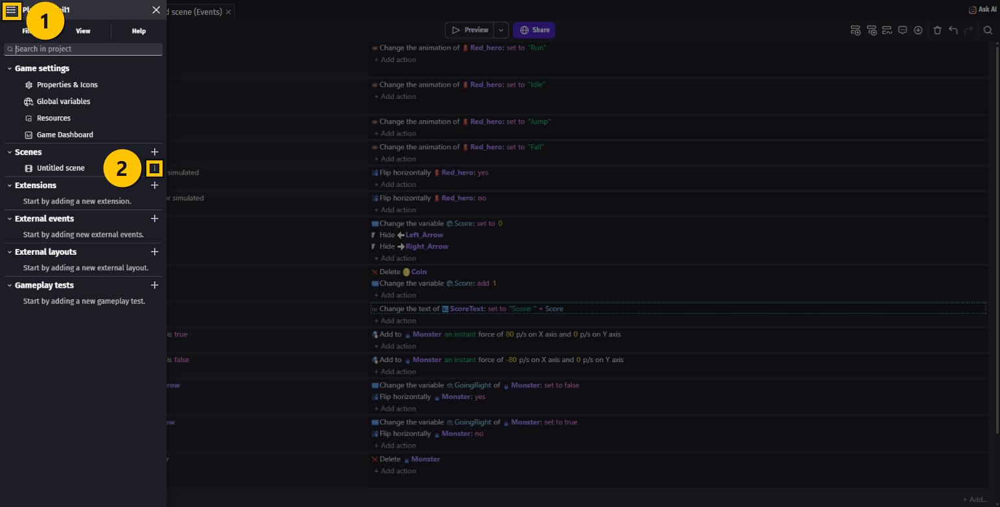
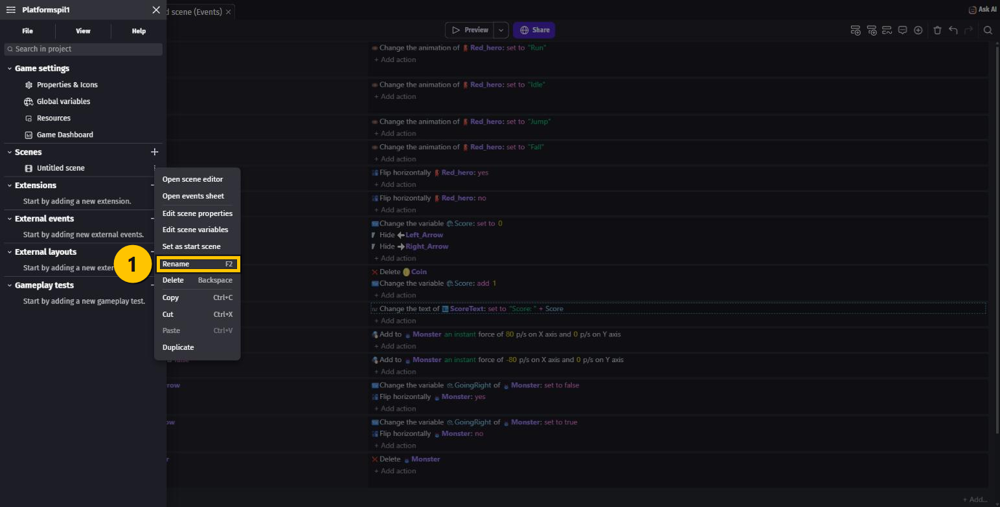
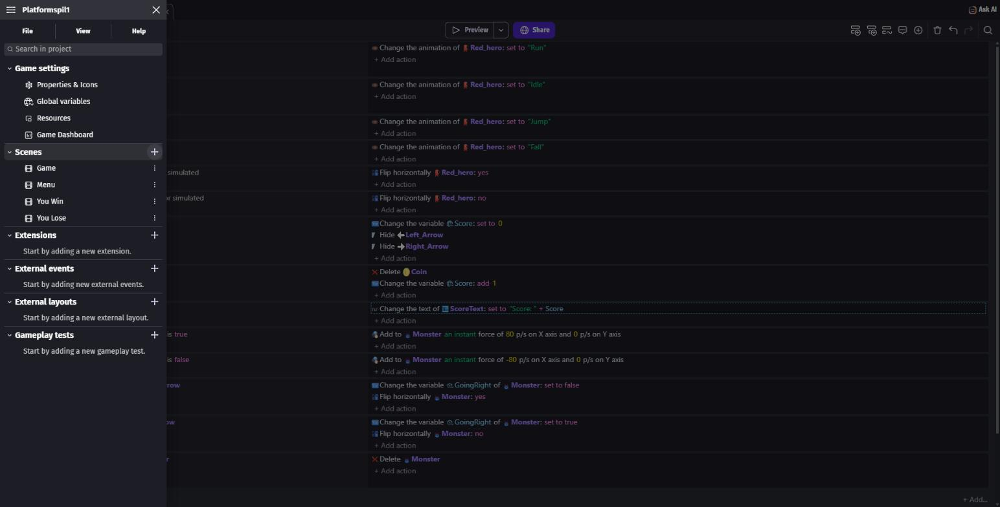
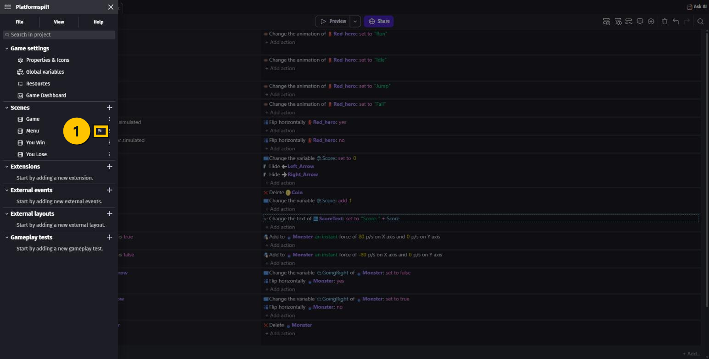
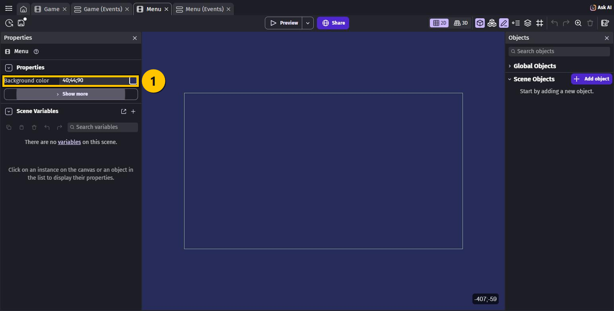
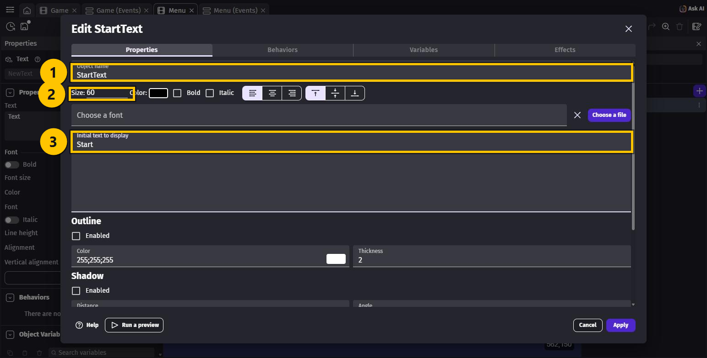
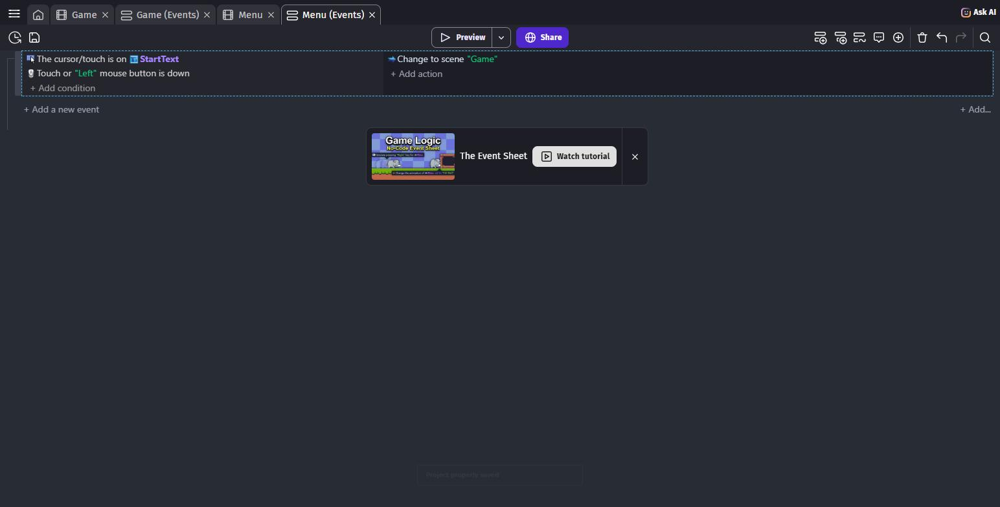

# OPGAVER TIL GDevelop – ADVANCED – SCENER

Indtil nu har hele dit spil boet i **én** skærm. Men et rigtigt spil har flere: en
**startmenu**, selve **banen**, en **du vandt**-skærm og en **du tabte**-skærm.

I GDevelop hedder en skærm en **scene**. I denne lektion laver du fire af dem og får menuen
til at starte spillet.

> 🟡 **Om billederne:** de gule kasser viser, hvor du skal klikke.

---

## Hvad er en scene?

En **scene** er én skærm i spillet — med sine egne objekter, sin egen baggrund og sin egen
Events-side.

> ⚠️ **Vigtigt:** hver scene har sine **egne** objekter. De 15 figurer fra platformer-pakken
> bor kun i din spil-scene. Laver du en ny scene, er den helt tom — også Objects-panelet.

**Startscenen** er den scene, spillet åbner med. Den bestemmer du selv.

---

## Opgave 1 – SCENER: Giv din scene et rigtigt navn

Din scene hedder stadig `Untitled scene`. Det bliver forvirrende, når der bliver flere.

1. Tryk på **☰** helt oppe i venstre hjørne for at åbne **Project manager**.
2. Find afsnittet **Scenes**.

3. Klik på de **tre prikker ⋮** ude til højre på scenens linje.
4. Vælg **Rename**, skriv `Game`, og tryk **Enter**.

Læg mærke til, hvad der ellers står i menuen — vi skal bruge **Set as start scene** om lidt.

---

## Opgave 2 – SCENER: Lav tre scener mere

1. Tryk på **+** ude til højre for ordet **Scenes**.
2. Der kommer en ny scene, og navnet kan skrives med det samme. Skriv `Menu`, og tryk
   **Enter**.
3. Gør det to gange mere, så du har scenerne `You Win` og `You Lose`.

Du har nu fire scener:

| Scene | Hvad den er til |
|---|---|
| `Menu` | Det første man ser. Her trykker man for at starte |
| `Game` | Selve banen med helten, mønterne og monsteret |
| `You Win` | Vises, når man er nået igennem |
| `You Lose` | Vises, når man dør — den bruger vi i næste lektion |

---

## Opgave 3 – SCENER: Bestem hvilken scene spillet starter med

Lige nu starter spillet i `Game`. Men man skal jo se menuen først.

1. Klik på de **tre prikker ⋮** ved `Menu`.
2. Vælg **Set as start scene**.

Nu kommer der et lille **flag** ved `Menu` i listen. Flaget betyder: *"spillet starter her"*.

> 💡 Rækkefølgen i listen betyder **ingenting**. Det er kun flaget, der bestemmer, hvor
> spillet starter — så du behøver ikke flytte noget rundt.

---

## Opgave 4 – SCENER: Giv menuen en baggrundsfarve

1. Klik på **`Menu`** i listen for at åbne scenen.
2. Luk **Project manager** med krydset.
3. Kig i **Properties**-panelet i venstre side. Der står **Background color**.
4. Skriv en farve i feltet — tre tal for rød, grøn og blå. Prøv `40;44;90`, som er en
   mørkeblå nattehimmel.

> 💡 Du kan også klikke på den lille firkant ved siden af feltet og vælge en farve med
> musen. Prøv dig frem — det er din menu.

---

## Opgave 5 – SCENER: Lav en Start-knap

Vi bruger et **Text**-objekt som knap — præcis som `ScoreText` i lektion 4.

1. Tryk på **+ Add object** i **Objects**-panelet.
2. Vælg fanen **New object from scratch**, søg efter `text`, og vælg **Text**.
3. Udfyld:
   - **Object name**: `StartText`
   - **Size**: `60`
   - **Initial text to display**: `Start`
4. Tryk **Apply**.

5. Teksten er sort, og baggrunden er mørkeblå — så kan man ikke se den. Klik på
   `StartText` i **Objects**-panelet, find **Color** i **Properties** til venstre, og skriv
   `255;255;255`. Nu er teksten hvid.
6. **Træk `StartText` ind på scenen**, og placér den midt på skærmen.

> ✏️ **Ekstra:** vil du have en ramme om ordet, kan du lave et **Sprite**-objekt og tegne en
> kasse med **Piskel** — ligesom du gjorde med pilene i FJENDER. Træk kassen ind bag
> teksten.

---

## Opgave 6 – SCENER: Få knappen til at starte spillet

Åbn fanen **Menu (Events)** foroven. Den er tom — hver scene har sin egen kode.

1. Tryk **+ Add an event**.
2. **+ Add condition** → vælg objektet **`StartText`** → søg efter `cursor` →
   vælg **The cursor/touch is on an object**. Tryk **Ok**.
3. **+ Add condition** igen → fanen **Other conditions** → søg efter `mouse button` →
   vælg **Mouse button pressed or touch held**.
4. I feltet **Button to check** vælger du **Left (primary)**. Tryk **Ok**.
5. **+ Add action** → søg efter `change to scene` → vælg **Change the scene**.
6. I **Name of the new scene** vælger du **Game**. Tryk **Ok**.

Eventet betyder: **HVIS** musen er over `StartText` **OG** man trykker venstre museknap,
**SÅ** skift til scenen `Game`.

> 💡 De **to** conditions i samme event betyder **og** — begge skal passe på én gang. Du
> behøver ikke noget særligt til det; det er sådan events virker.

> 💡 Der findes også en action, der heder **Stop and go back to previous scene**. Den er
> perfekt til en "tilbage til menuen"-knap senere.

---

## Opgave 7 – SCENER: Lav You Win-skærmen

Nu kan du det hele selv. Åbn scenen **`You Win`** og gør præcis som i Opgave 4 og 5:

1. Giv scenen en **baggrundsfarve** — måske en glad grøn, fx `30;90;60`.
2. Lav et **Text**-objekt:
   - **Object name**: `WinText`
   - **Size**: `70`
   - **Initial text to display**: `You Win!!`
   - **Color**: `255;255;255`
3. Træk det ind midt på scenen.

`You Lose` lader vi stå tom — den laver vi færdig i næste lektion.

---

## Prøv spillet! 🎮

Tryk på **Preview**.

Nu starter spillet i **menuen** med din mørkeblå baggrund og ordet **Start**.
Klik på **Start** — og du er inde i banen med helten, mønterne og monsteret.

Husk **Ctrl + S**.

> 💡 Preview starter altid i **startscenen** — den med flaget. Vil du hurtigt teste banen
> uden at klikke gennem menuen, kan du åbne `Game`-scenen og trykke **Preview** derfra.

---

## Du er færdig med SCENER ✅

- [ ] Min gamle scene heder nu **`Game`**
- [ ] Der er fire scener: `Menu`, `Game`, `You Win`, `You Lose`
- [ ] `Menu` har **flaget** — spillet starter der
- [ ] Menuen har en baggrundsfarve og et hvidt **`Start`**
- [ ] Et klik på **Start** skifter til `Game`
- [ ] `You Win` har en baggrundsfarve og teksten **You Win!!**

**Næste gang** laver vi **You Lose**-skærmen færdig — og så kan helten endelig dø, når
monsteret rammer ham.

---

## Hvis noget går galt

| Problem | Løsning |
|---|---|
| Spillet starter i banen i stedet for menuen | `Menu` mangler flaget. Tryk **⋮** ved `Menu` → **Set as start scene**. |
| Objects-panelet er tomt i den nye scene | Det skal det være! Hver scene har sine egne objekter. Menuen skal kun have `StartText`. |
| Jeg kan ikke se min Start-tekst | Den er sort på mørk baggrund. Sæt **Color** til `255;255;255`. Eller du har glemt at trække den ind på scenen. |
| Der sker ingenting, når jeg klikker på Start | Tjek at **Button to check** står på **Left (primary)** — står der rød tekst i eventet, mangler den. |
| Jeg skifter til den forkerte scene | Åbn actionen igen og tjek **Name of the new scene**. Der skal stå `Game`. |
| Jeg kan ikke finde conditionen med cursoren | Søg kun på `cursor`. Den heder **The cursor/touch is on an object** og ligger under **General › Objects › Mouse and touch**. |
| Jeg gav en scene et forkert navn | **⋮** → **Rename**. Husk at rette scenenavnet i dine **Change the scene**-actions bagefter. |

---

Opgaverne bygger på det oprindelige GDevelop-forløb fra
[mom2day.dk/gdevelop-advanced-scener](https://mom2day.dk/gdevelop-advanced-scener). 🙏
