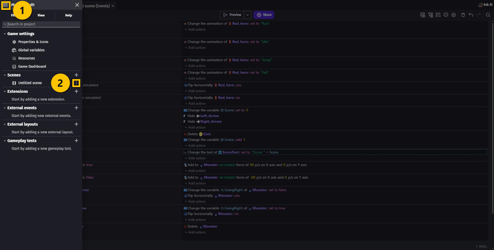
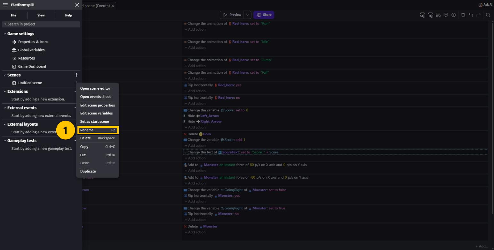
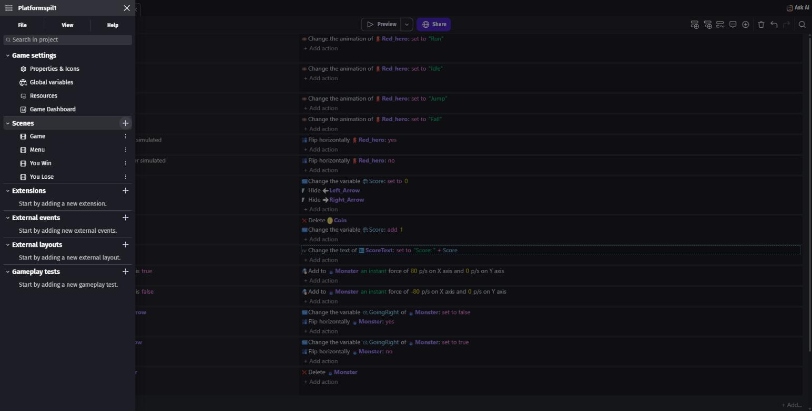
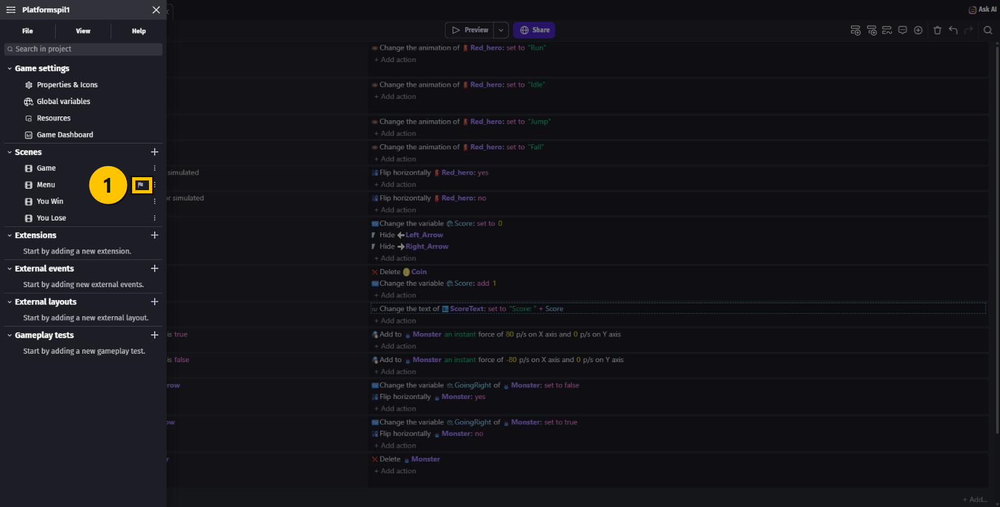
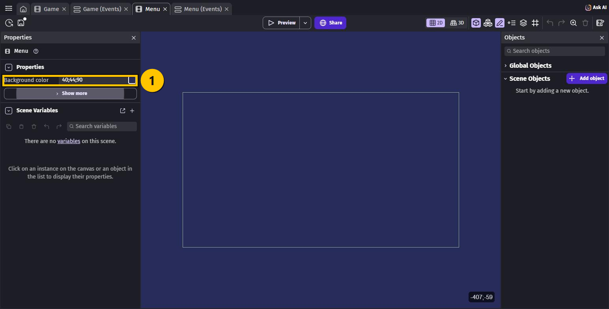
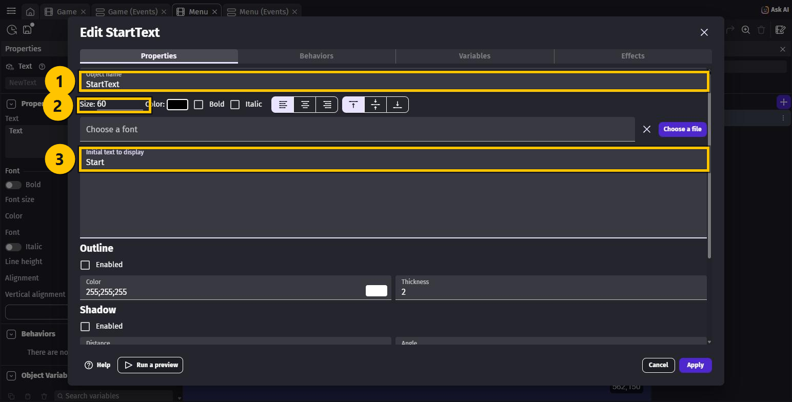
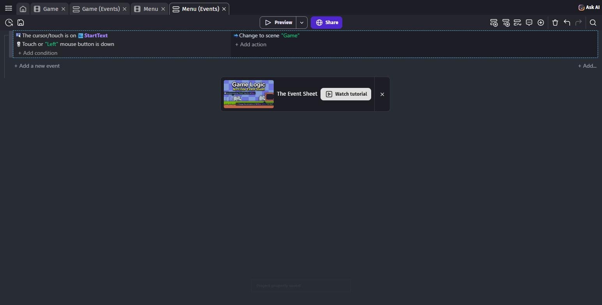

# OPGAVER TIL GDevelop – ADVANCED – SCENER

> **VIDEN**
>
> Et spil kan have flere skærme: en menu, en bane, en sejrsskærm og en tabsskærm. I GDevelop
> kaldes hver skærm en **scene**. I denne lektion laver du fire scener og får menuen til at
> starte spillet.
>
> Knapperne står på engelsk. Vi skriver deres navne, som de står på skærmen. Bokse med hel
> kant er **GØR DETTE**. Bokse med stiplet kant er **VIDEN**. Gule felter viser, hvor du
> skal klikke. Tallene ved felterne passer til tallene i teksten.
{: .lesson-info}

---

## Hvad er en scene?

> **VIDEN**
>
> En **scene** er én skærm i spillet. Hver scene har sin egen baggrund, sine objekter og sin
> egen Events-side. En ny scene er tom. Figurerne fra spillet følger ikke med.
>
> **Startscenen** er den scene, der åbner først.
{: .lesson-info}

---

## Opgave 1 – SCENER: Giv din scene et rigtigt navn

> **VIDEN**
>
> Scenen hedder stadig `Untitled scene`. Det kan blive forvirrende, når der kommer flere.
{: .lesson-info}

> **GØR DETTE**
>
> 1. Vælg **☰** **(1)** øverst til venstre for at åbne **Project manager**.
> 2. Find afsnittet **Scenes**.
{: .lesson-action}

> **GØR DETTE**
>
> 1. Vælg de tre prikker **⋮** **(2)** ved scenen.
> 2. Vælg **Rename** **(1)**, skriv `Game`, og tryk **Enter**.
{: .lesson-action}

> **VIDEN**
>
> I menuen findes også **Set as start scene**. Den bruger du om lidt.
{: .lesson-info}

---

## Opgave 2 – SCENER: Lav tre scener mere

> **GØR DETTE**
>
> 1. Vælg **+** ved siden af **Scenes**.
> 2. Skriv `Menu`, og tryk **Enter**.
> 3. Lav to scener mere: `You Win` og `You Lose`.
{: .lesson-action}

> **VIDEN**
>
> Du har nu fire scener:
{: .lesson-info}

> **VIDEN**
>
> | Scene | Hvad den viser |
> |---|---|
> | `Menu` | Startknappen |
> | `Game` | Banen, helten, mønterne og monsteret |
> | `You Win` | Når du vinder |
> | `You Lose` | Når du taber |
{: .lesson-info}

---

## Opgave 3 – SCENER: Bestem hvilken scene spillet starter med

> **VIDEN**
>
> Spillet starter lige nu i `Game`. Det skal starte i menuen i stedet.
{: .lesson-info}

> **GØR DETTE**
>
> 1. Vælg de tre prikker **⋮** ved `Menu`.
> 2. Vælg **Set as start scene** **(1)**.
{: .lesson-action}

> **VIDEN**
>
> Flaget viser, at spillet starter i `Menu`. Rækkefølgen på listen betyder ikke noget.
{: .lesson-info}

---

## Opgave 4 – SCENER: Giv menuen en baggrundsfarve

> **GØR DETTE**
>
> 1. Vælg `Menu` i listen.
> 2. Luk **Project manager** med krydset.
> 3. I **Properties** til venstre skal du finde **Background color** **(1)**.
> 4. Skriv `40;44;90` for at få en mørkeblå baggrund.
{: .lesson-action}

> **GØR DETTE**
>
> Vil du selv vælge farven? Vælg den lille firkant ved siden af feltet, og klik på en farve.
{: .lesson-action}

---

## Opgave 5 – SCENER: Lav en Start-knap

> **VIDEN**
>
> Du laver startknappen med et **Text**-objekt. Det er ligesom `ScoreText` fra lektion 4.
{: .lesson-info}

> **GØR DETTE**
>
> 1. Vælg **+ Add object** i **Objects**.
> 2. Vælg **New object from scratch**, søg efter `text`, og vælg **Text**.
> 3. Udfyld felterne:
>    - **Object name** **(1)**: `StartText`
>    - **Size** **(2)**: `60`
>    - **Initial text to display** **(3)**: `Start`
> 4. Vælg **Apply**.
{: .lesson-action}

> **GØR DETTE**
>
> 1. Vælg `StartText` i **Objects**.
> 2. I **Properties** til venstre skal du finde **Color**. Skriv `255;255;255` for at gøre
>    teksten hvid.
> 3. Træk `StartText` ind på scenen. Sæt den midt på skærmen.
{: .lesson-action}

> **GØR DETTE**
>
> Vil du tegne en ramme om ordet? Lav et **Sprite**-objekt, tegn en kasse med **Piskel**, og
> træk den ind bag teksten.
{: .lesson-action}

---

## Opgave 6 – SCENER: Få knappen til at starte spillet

> **VIDEN**
>
> Hver scene har sin egen Events-side. Åbn **Menu (Events)**.
{: .lesson-info}

> **GØR DETTE**
>
> 1. Åbn fanen **Menu (Events)**.
> 2. Vælg **+ Add an event**.
> 3. Vælg **+ Add condition**. Vælg `StartText`, søg efter `cursor`, og vælg
>    **The cursor/touch is on an object**. Vælg **Ok**.
> 4. Vælg **+ Add condition** igen. Under **Other conditions**, søg efter `mouse button`, og
>    vælg **Mouse button pressed or touch held**.
> 5. Sæt **Button to check** til **Left (primary)**. Vælg **Ok**.
> 6. Vælg **+ Add action**. Søg efter `change to scene`, og vælg **Change the scene**.
> 7. Sæt **Name of the new scene** til **Game**, og vælg **Ok**.
{: .lesson-action}

> **VIDEN**
>
> Eventet betyder: Når musen er over `StartText`, og du trykker venstre museknap, går spillet
> til `Game`.
{: .lesson-info}

> **VIDEN**
>
> De to conditions betyder **og**. Begge skal passe.
{: .lesson-info}

> **VIDEN**
>
> **Stop and go back to previous scene** kan bruges til en tilbageknap senere.
{: .lesson-info}

---

## Opgave 7 – SCENER: Lav You Win-skærmen

> **VIDEN**
>
> Du kan bruge de samme trin som for `Menu` til at lave en baggrund og en tekst.
{: .lesson-info}

> **GØR DETTE**
>
> 1. Åbn scenen `You Win`.
> 2. Giv den en baggrundsfarve, fx `30;90;60`.
> 3. Lav et **Text**-objekt med disse indstillinger:
>    - **Object name**: `WinText`
>    - **Size**: `70`
>    - **Initial text to display**: `You Win!!`
>    - **Color**: `255;255;255`
> 4. Træk teksten ind midt på scenen.
{: .lesson-action}

> **VIDEN**
>
> `You Lose` står tom indtil næste lektion. Der gør du den færdig.
{: .lesson-info}

---

## Prøv spillet! 🎮

> **GØR DETTE**
>
> Vælg **Preview**. Klik på **Start** i menuen.
{: .lesson-action}

> **VIDEN**
>
> Spillet starter i menuen. Når du klikker **Start**, går du til banen.
{: .lesson-info}

> **GØR DETTE**
>
> Gem med **Ctrl + S**.
{: .lesson-action}

> **VIDEN**
>
> **Preview** starter i startscenen — den med flaget. Vil du prøve banen direkte, åbn `Game`,
> og vælg **Preview** der.
{: .lesson-info}

---

## Du er færdig med SCENER ✅

> **VIDEN**
>
> Du er klar til næste lektion, når:
>
> - Din gamle scene hedder `Game`.
> - Der er fire scener: `Menu`, `Game`, `You Win` og `You Lose`.
> - `Menu` har flaget og starter spillet.
> - Menuen har en farve og en hvid `Start`-tekst.
> - **Start** åbner `Game`.
> - `You Win` har en farve og teksten **You Win!!**.
{: .lesson-info}

> **VIDEN**
>
> Næste gang gør du **You Lose**-skærmen færdig og får helten til at tabe, når monsteret rammer.
{: .lesson-info}

---

## Hvis noget går galt

| Problem | Løsning |
|---|---|
| Spillet starter i banen i stedet for menuen | **GØR DETTE:** Vælg **⋮** ved `Menu` → **Set as start scene**. |
| Objects-panelet er tomt i den nye scene | **VIDEN:** Det er normalt. Hver scene har sine egne objekter. Menuen skal kun have `StartText`. |
| Jeg kan ikke se min Start-tekst | **GØR DETTE:** Sæt **Color** til `255;255;255`, og træk teksten ind på scenen. |
| Der sker ingenting, når jeg klikker på Start | **GØR DETTE:** Tjek at **Button to check** er **Left (primary)**. |
| Jeg skifter til den forkerte scene | **GØR DETTE:** Åbn actionen, og sæt **Name of the new scene** til `Game`. |
| Jeg kan ikke finde conditionen med cursoren | **GØR DETTE:** Søg efter `cursor`. Vælg **The cursor/touch is on an object**. |
| Jeg gav en scene et forkert navn | **GØR DETTE:** Vælg **⋮** → **Rename**. Ret også scenenavnet i dine **Change the scene**-actions. |
{: .lesson-help}

---

> **VIDEN**
>
> Opgaverne bygger på det oprindelige GDevelop-forløb fra
> [mom2day.dk/gdevelop-advanced-scener](https://mom2day.dk/gdevelop-advanced-scener).
{: .lesson-info}
