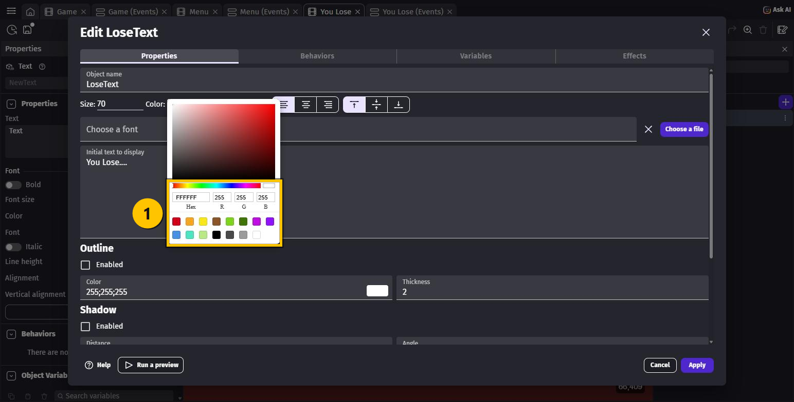
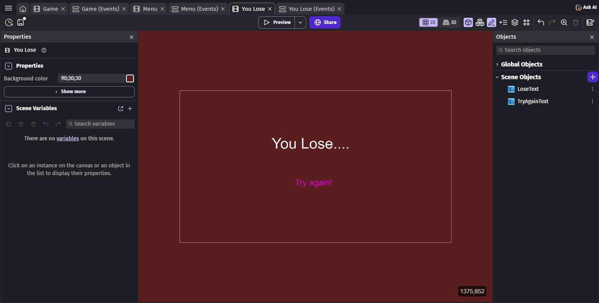
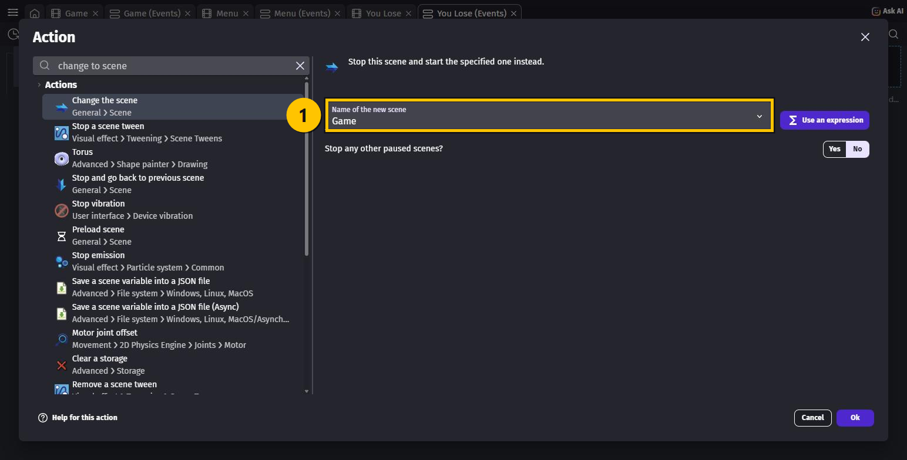
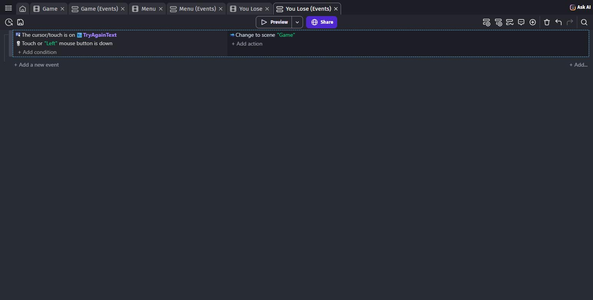
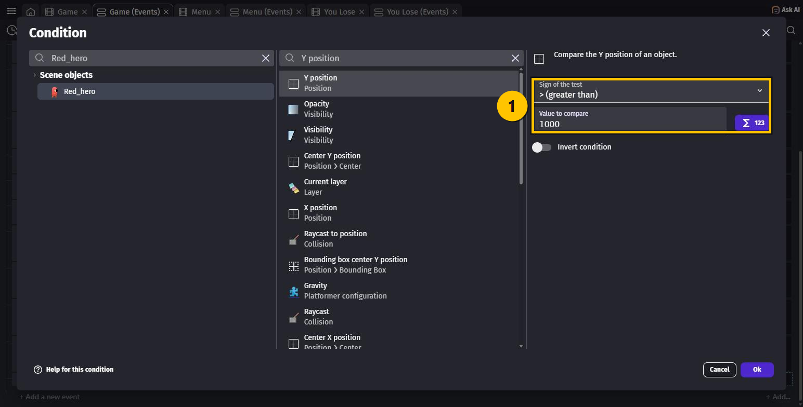
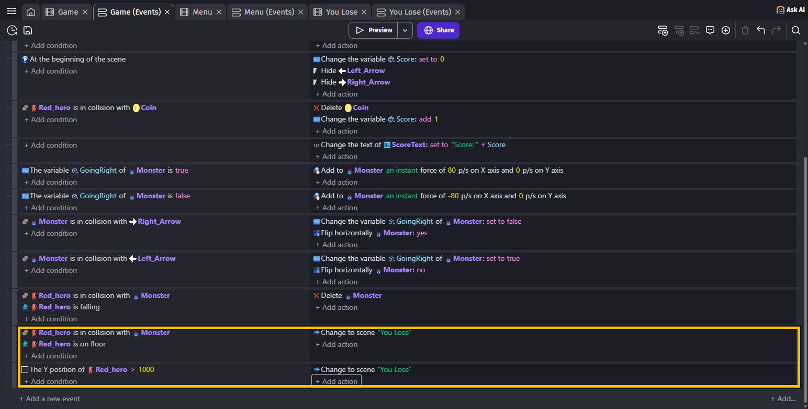

# OPGAVER TIL GDevelop – ADVANCED – YOU LOSE

Sidst lavede du fire scener. `You Lose` står stadig helt tom.

Nu gør vi den færdig — og så kan helten **endelig dø**. Indtil nu har monsteret været
harmløst, hvis man løb ind i det fra siden, og man kunne falde ned i det uendelige uden at
der skete noget. Det retter vi i denne lektion.

> 🟡 **Om billederne:** de gule kasser viser, hvor du skal klikke — eller hvad der er nyt.

---

## To måder at dø på

Et platformspil har næsten altid de her to farer, og vi laver dem begge:

| Fare | Hvad skal ske |
|---|---|
| Monsteret rammer helten, mens han står på jorden | Helten dør |
| Helten falder ud over kanten og ned i ingenting | Helten dør |

Begge fører til den samme skærm: scenen `You Lose`. Og derfra skal man kunne prøve igen.

---

## Opgave 1 – YOU LOSE: Giv scenen en baggrundsfarve

1. Tryk på **☰** for at åbne **Project manager**.
2. Under **Scenes**, klik på **`You Lose`**.
3. Luk **Project manager** med krydset.
4. I **Properties**-panelet til venstre skriver du en farve i **Background color**.
   Prøv `90;30;30` — en mørk, uhyggelig rød.

Det er præcis det samme, du gjorde med `Menu` i SCENER.

---

## Opgave 2 – YOU LOSE: Lav de to tekster

Scenen skal have to **Text**-objekter: en stor overskrift og en knap, man kan trykke på.

### Overskriften

1. Tryk **+ Add object** i **Objects**-panelet.
2. Vælg fanen **New object from scratch**, søg efter `text`, og vælg **Text**.
3. Udfyld:
   - **Object name**: `LoseText`
   - **Size**: `70`
   - **Initial text to display**: `You Lose....`
4. Teksten er sort som standard, og baggrunden er mørk. Klik på den sorte firkant ved
   **Color:** — så åbner en farvevælger.
5. Klik på den **hvide** firkant nederst til højre i paletten. Nu står der `FFFFFF` i
   **Hex**-feltet.

6. Tryk **Apply**, og **træk `LoseText` ind på scenen**. Placér den lidt over midten.

### Knappen

Gør det hele én gang til, men med disse værdier:

- **Object name**: `TryAgainText`
- **Size**: `40`
- **Initial text to display**: `Try again!`
- **Color**: skriv `FF00FF` i **Hex**-feltet ① og tryk **Enter** — så bliver teksten
  lyserød/magenta

Træk den ind **under** `LoseText`.

> 💡 **Hex** er en farvekode: to tegn for rød, to for grøn og to for blå. `FF` er "helt
> åben" og `00` er "helt lukket". Så `FF00FF` = fuld rød + ingen grøn + fuld blå. Prøv at
> skrive `00FF00` og se hvad der sker.

> 💡 Du kan også sætte farven bagefter i **Properties**-panelet under **Color** — det var
> den vej, du gik i SCENER. Det er to veje til det samme.

---

## Opgave 3 – YOU LOSE: Få "Try again!" til at starte forfra

Åbn fanen **You Lose (Events)** foroven. Den er tom.

1. Tryk **+ Add an event**.
2. **+ Add condition** → vælg objektet **`TryAgainText`** → søg efter `cursor` →
   vælg **The cursor/touch is on an object**. Tryk **Ok**.
3. **+ Add condition** igen → søg efter `mouse button` i det **øverste** søgefelt →
   vælg **Mouse button pressed or touch held**.
4. I **Button to check** vælger du **Left (primary)**. Tryk **Ok**.
5. **+ Add action** → søg efter `change to scene` → vælg **Change the scene**.
6. I **Name of the new scene** ① vælger du **Game**. Tryk **Ok**.

> ⚠️ Der står også **Stop and go back to previous scene** i listen. Den skal du **ikke**
> bruge her — den ville sende dig tilbage til `You Lose` igen bagefter.

Læg mærke til, at det er **præcis** det samme event som Start-knappen i menuen. Kun
scenenavnet er anderledes. Sådan laver man alle knapper i GDevelop.

> 💡 **Change the scene** starter `Game` helt forfra. Derfor bliver scoren også nulstillet
> — det sørger dit **At the beginning of the scene**-event fra VARIABLER for.

---

## Opgave 4 – YOU LOSE: Gør monsteret farligt

Nu til selve banen. Åbn fanen **Game (Events)**, og rul helt ned i bunden.

1. Tryk **+ Add a new event**.
2. **+ Add condition** → vælg objektet **`Red_hero`** → søg efter `collision` →
   vælg **Collision**. I feltet **Object** vælger du **`Monster`**. Tryk **Ok**.
3. **+ Add condition** igen → **`Red_hero`** → søg efter `floor` → vælg **Is on floor**.
   Tryk **Ok**.
4. **+ Add action** → søg efter `change to scene` → vælg **Change the scene** →
   **Name of the new scene**: **You Lose**. Tryk **Ok**.

### Hvorfor "Is on floor"?

Fordi du allerede har et event fra FJENDER, der **sletter** monsteret, når helten er
`is falling`. De to events må ikke slås om det samme sammenstød — så skal de handle om
**hver sin** situation:

| Hvor er helten, når han rører monsteret? | Hvad sker der |
|---|---|
| I luften og på vej **nedad** (`is falling`) | **Monsteret** dør — eventet fra FJENDER |
| Med fødderne på jorden (`is on floor`) | **Helten** dør — det nye event |
| I luften og på vej **opad** | Ingenting — han er hverken faldende eller på jorden |

Den sidste linje er ikke en fejl: hopper du *op i* et monster fra siden, slipper du. Sådan
er det i mange platformspil, og det gør spillet lidt mildere.

> 💡 **Til dig, der vil vide mere:** nederst i condition-boksen er der en knap, der heder
> **Invert condition**. Med den kunne du i stedet skrive "helten rører monsteret **og er
> IKKE** `is falling`". Det giver næsten det samme, men `is on floor` er nemmere at læse.

---

## Opgave 5 – YOU LOSE: Lad helten falde i døden

Falder helten ud over kanten, bliver han bare ved med at falde. Det skal koste livet.

1. Tryk **+ Add a new event**.
2. **+ Add condition** → vælg objektet **`Red_hero`** → søg efter `Y position` →
   vælg **Y position** (den øverste, under **Position**).
3. Udfyld ①:
   - **Sign of the test**: **> (greater than)**
   - **Value to compare**: `1000`
4. Tryk **Ok**.

5. **+ Add action** → **Change the scene** → **You Lose**. Tryk **Ok**.

### Hvad betyder Y og 1000?

Y er **højden** i spillet, og den tælles **nedad**: helt oppe i venstre hjørne er Y lig `0`,
og tallet bliver **større**, jo længere ned man kommer.

Din skærm er `720` høj. Så når helten er nået til Y over `1000`, er han langt under
skærmen — og der er ingen vej tilbage. Det er dét, tallet betyder.

> 💡 Du behøver ikke en condition om, at han falder. Kommer han først under `1000`, er han
> faldet. Ét tjek er nok.

---

## Hele koden samlet

De tre nye events i denne lektion:

| Scene | Conditions (HVIS) | Actions (SÅ) |
|---|---|---|
| `Game` | `Red_hero` **is in collision with** `Monster` `Red_hero` **is on floor** | Change to scene `"You Lose"` |
| `Game` | **The Y position of** `Red_hero` **>** `1000` | Change to scene `"You Lose"` |
| `You Lose` | **The cursor/touch is on** `TryAgainText` **Touch or "Left" mouse button is down** | Change to scene `"Game"` |

---

## Prøv spillet! 🎮

Tryk på **Preview** — husk, at spillet starter i **menuen**.

1. Klik **Start** → du er i banen
2. Saml et par mønter, så der står point på skærmen
3. **Løb ind i monsteret fra siden** → **You Lose....** 💀
4. Klik på **Try again!** → du er tilbage i banen, og scoren er `0` igen
5. **Hop ud over kanten** → **You Lose....** igen

Husk **Ctrl + S**.

> 💡 Vil du hurtigt teste uden at klikke gennem menuen, kan du åbne `Game`-scenen og trykke
> **Preview** derfra.

---

## Ekstra: tegn en Play-knap i Piskel

Vil du have en rigtig knap i stedet for bare et ord, kan du tegne en:

1. **+ Add object** → **New object from scratch** → **Sprite**
2. Kald den `PlayButton`, og tryk **Edit with Piskel**
3. Tegn en trekant, der peger mod højre — som ▶ på en fjernbetjening
4. Gem, tryk **Apply**, og træk den ind under `Try again!`

Byt så `TryAgainText` ud med `PlayButton` i din condition **The cursor/touch is on an
object**, så virker knappen i stedet for teksten.

> 💡 **Piskel** er tegneprogrammet inde i GDevelop. Det virker kun i den **installerede**
> udgave — ikke i browseren.

---

## Du er færdig med YOU LOSE ✅

- [ ] `You Lose` har en baggrundsfarve
- [ ] Der står **You Lose....** i hvid og **Try again!** i magenta
- [ ] Et klik på **Try again!** starter `Game` forfra
- [ ] Helten dør, når monsteret rammer ham, mens han står på jorden
- [ ] Helten dør, hvis han falder ud over kanten
- [ ] Man kan stadig besejre monsteret ved at hoppe oven på det

**Næste gang** får vi **kameraet** til at følge helten, så banen kan blive større end
skærmen.

---

## Hvis noget går galt

| Problem | Løsning |
|---|---|
| Helten dør med det samme, når spillet starter | Værdien i **Value to compare** er for lille. Prøv `1200`. Eller tegnet står på **<** i stedet for **>**. |
| Helten dør slet ikke, når han falder | Tjek at der står **> (greater than)** i **Sign of the test**. Står der `=`, rammer han aldrig præcis det tal. |
| Monsteret dør, når jeg løber ind i det | Du har glemt conditionen **Is on floor** på det nye event. |
| Helten dør, når jeg hopper oven på monsteret | Du har byttet om: det nye event skal have **Is on floor**, og det gamle fra FJENDER skal have **Is falling**. |
| Der sker ingenting, når jeg klikker på **Try again!** | Tjek at **Button to check** står på **Left (primary)**, og at conditionen peger på `TryAgainText`. |
| Jeg kan ikke se mine tekster | De er sorte på mørk baggrund — sæt **Color**. Eller du har glemt at trække dem ind på scenen. |
| Jeg havner i `You Lose` igen og igen | Din action heder **Stop and go back to previous scene** i stedet for **Change the scene**. |
| **Objects**-panelet er tomt i `You Lose` | Det skal det være! Hver scene har sine egne objekter. |
| Jeg skifter til den forkerte scene | Åbn actionen igen og tjek **Name of the new scene**. |

---

Opgaverne bygger på det oprindelige GDevelop-forløb fra
[mom2day.dk/gdevelop-advanced-you-lose](https://mom2day.dk/gdevelop-advanced-you-lose). 🙏
