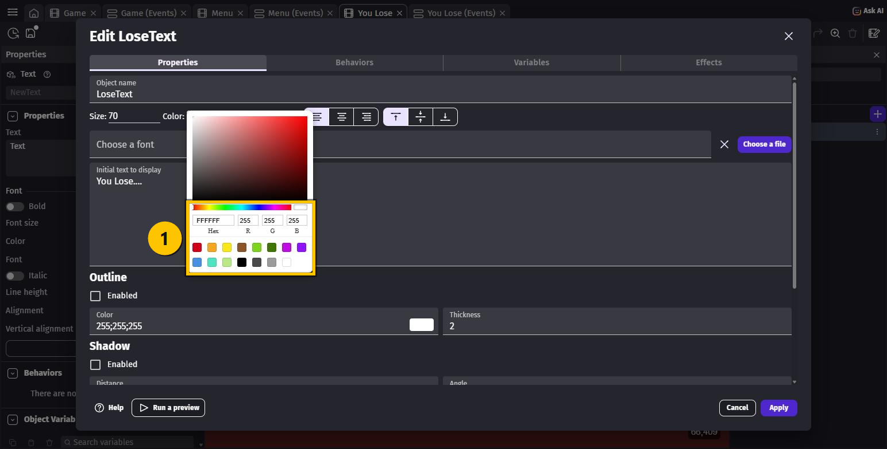
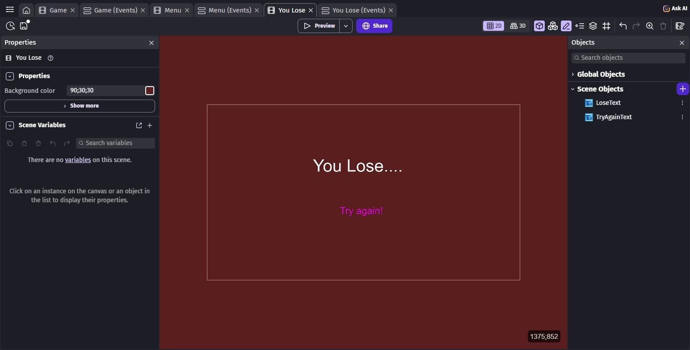
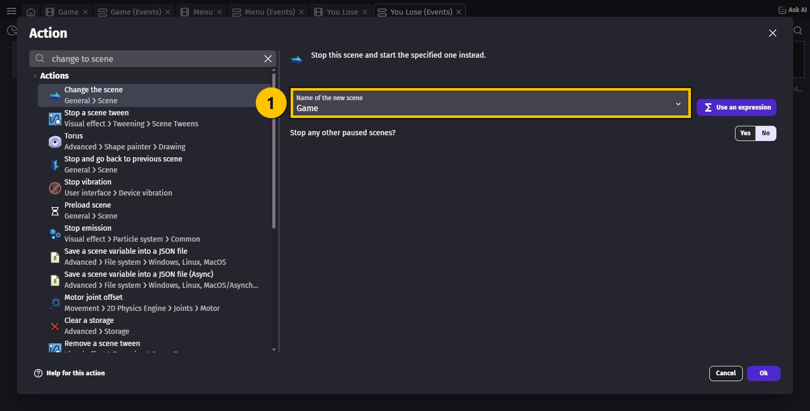
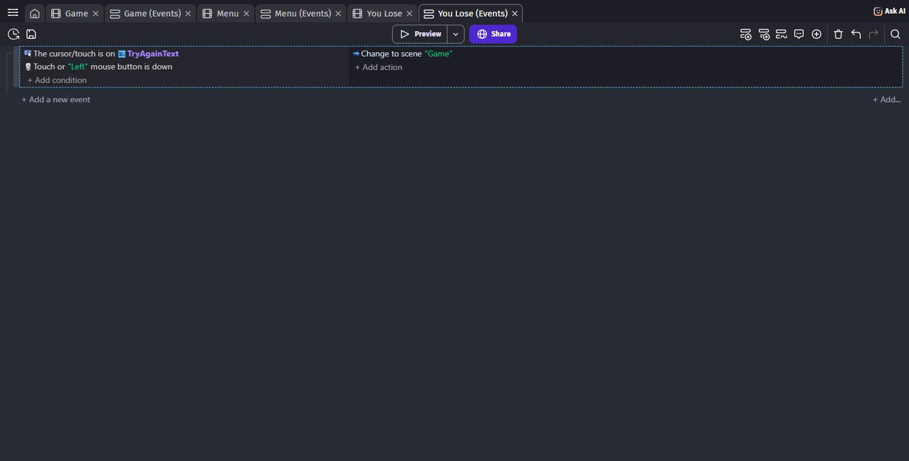
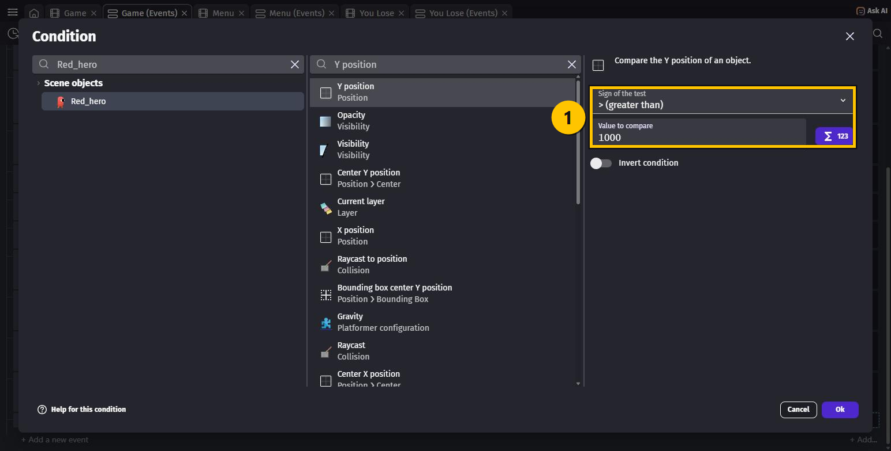
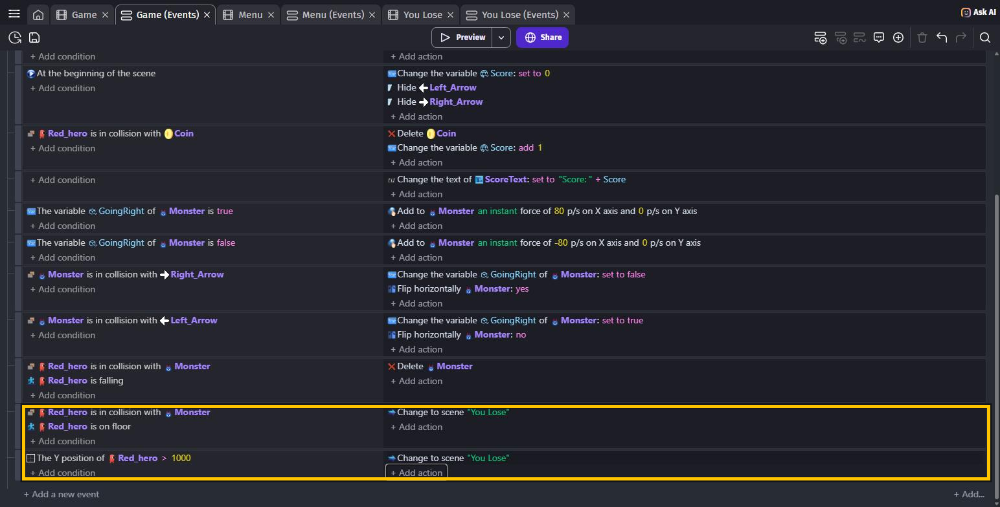

# OPGAVER TIL GDevelop – ADVANCED – YOU LOSE

> **VIDEN**
>
> Sidst lavede du fire scener. Nu gør du `You Lose` færdig og laver to måder, helten kan tabe
> på.
>
> Knapperne står på engelsk. Vi skriver deres navne, som de står på skærmen. Bokse med hel
> kant er **GØR DETTE**. Bokse med stiplet kant er **VIDEN**. Gule felter viser, hvor du
> skal klikke, eller hvad der er nyt. Tallene ved felterne passer til tallene i teksten.
{: .lesson-info}

---

## To måder at dø på

> **VIDEN**
>
> Et platformspil har ofte de her to farer. I denne lektion laver du dem begge.
{: .lesson-info}

> **VIDEN**
>
> | Fare | Hvad sker der? |
> |---|---|
> | Monsteret rammer helten, mens han står på jorden | Helten taber |
> | Helten falder ud over kanten | Helten taber |
>
> Begge dele åbner scenen `You Lose`. Derfra kan du prøve igen.
{: .lesson-info}

---

## Opgave 1 – YOU LOSE: Giv scenen en baggrundsfarve

> **GØR DETTE**
>
> 1. Vælg **☰** for at åbne **Project manager**.
> 2. Under **Scenes** vælger du `You Lose`.
> 3. Luk **Project manager** med krydset.
> 4. I **Properties** til venstre skal du skrive `90;30;30` i **Background color**.
{: .lesson-action}

> **VIDEN**
>
> Det er det samme, du gjorde med `Menu` i SCENER. Farven `90;30;30` er mørkerød.
{: .lesson-info}

---

## Opgave 2 – YOU LOSE: Lav de to tekster

> **VIDEN**
>
> Scenen skal have to **Text**-objekter: en stor overskrift og en knap, du kan vælge.
{: .lesson-info}

### Overskriften

> **GØR DETTE**
>
> 1. Vælg **+ Add object** i **Objects**.
> 2. Vælg **New object from scratch**, søg efter `text`, og vælg **Text**.
> 3. Udfyld:
>    - **Object name**: `LoseText`
>    - **Size**: `70`
>    - **Initial text to display**: `You Lose....`
> 4. Vælg den sorte firkant ved **Color** for at åbne farvevælgeren.
> 5. Vælg den hvide firkant **(1)** nederst til højre. Tjek, at der står `FFFFFF` i **Hex**.
{: .lesson-action}

> **GØR DETTE**
>
> Vælg **Apply**. Træk `LoseText` ind på scenen, lidt over midten.
{: .lesson-action}

### Knappen

> **GØR DETTE**
>
> Lav endnu et **Text**-objekt med disse indstillinger:
> - **Object name**: `TryAgainText`
> - **Size**: `40`
> - **Initial text to display**: `Try again!`
> - **Color**: skriv `FF00FF` i **Hex**, og tryk **Enter**.
>
> Træk teksten ind under `LoseText`.
{: .lesson-action}

> **VIDEN**
>
> **Hex** er en farvekode. De første to tegn er rød, de næste to grøn og de sidste to blå.
> `FF` betyder meget af farven, og `00` betyder ingen af farven.
{: .lesson-info}

> **GØR DETTE**
>
> Vil du prøve en anden farve? Skriv `00FF00` i **Hex**, og se, hvad der sker.
{: .lesson-action}

> **VIDEN**
>
> Du kan også ændre farven senere i **Properties** under **Color**.
{: .lesson-info}

---

## Opgave 3 – YOU LOSE: Få "Try again!" til at starte forfra

> **GØR DETTE**
>
> 1. Åbn fanen **You Lose (Events)**.
> 2. Vælg **+ Add an event**.
> 3. Vælg **+ Add condition**. Vælg `TryAgainText`, søg efter `cursor`, og vælg
>    **The cursor/touch is on an object**. Vælg **Ok**.
> 4. Tilføj en condition mere. Søg efter `mouse button` i det øverste søgefelt, og vælg
>    **Mouse button pressed or touch held**.
> 5. Sæt **Button to check** til **Left (primary)**, og vælg **Ok**.
> 6. Vælg **+ Add action**. Søg efter `change to scene`, og vælg **Change the scene**.
> 7. Sæt **Name of the new scene** til **Game** **(1)**, og vælg **Ok**.
{: .lesson-action}

> **VIDEN**
>
> **Stop and go back to previous scene** ville sende dig tilbage til `You Lose`.
{: .lesson-info}

> **VIDEN**
>
> Det er samme slags event som Start-knappen i menuen. Her går spillet til `Game`. Spillet
> starter banen forfra, og eventet fra VARIABLER sætter scoren til nul.
{: .lesson-info}

---

## Opgave 4 – YOU LOSE: Gør monsteret farligt

> **GØR DETTE**
>
> Åbn fanen **Game (Events)**, og rul ned til bunden.
{: .lesson-action}

> **GØR DETTE**
>
> 1. Vælg **+ Add a new event**.
> 2. Tilføj en **Collision** condition for `Red_hero` og `Monster`.
> 3. Tilføj en condition mere: `Red_hero` → **Is on floor**.
> 4. Tilføj **Change the scene**, og sæt **Name of the new scene** til **You Lose**.
> 5. Vælg **Ok**.
{: .lesson-action}

> **VIDEN**
>
> Monsteret dør, når helten rammer det, mens han falder. Helten taber, når han rammer
> monsteret med fødderne på jorden. Hvis helten rammer monsteret, mens han hopper op, sker
> der ikke noget.
{: .lesson-info}

> **VIDEN**
>
> Du kan også vende en condition om med **Invert condition**. Her er **Is on floor** nemmere
> at læse.
{: .lesson-info}

---

## Opgave 5 – YOU LOSE: Lad helten falde i døden

> **VIDEN**
>
> Hvis helten falder ud over kanten, skal han tabe.
{: .lesson-info}

> **GØR DETTE**
>
> 1. Vælg **+ Add a new event**.
> 2. Vælg **+ Add condition**. Vælg `Red_hero`, søg efter `Y position`, og vælg **Y
>    position** under **Position**.
> 3. Sæt **Sign of the test** til **> (greater than)** og **Value to compare** til `1000`
>    **(1)**.
> 4. Vælg **Ok**.
{: .lesson-action}

> **GØR DETTE**
>
> Tilføj actionen **Change the scene**, sæt scenen til **You Lose**, og vælg **Ok**.
{: .lesson-action}

> **VIDEN**
>
> Y er højden i spillet. Tallet bliver større, jo længere ned helten kommer. Skærmen er
> `720` høj, så `1000` er langt under skærmen. Du behøver ikke også tjekke, om helten falder.
{: .lesson-info}

---

## Hele koden samlet

> **VIDEN**
>
> De tre nye events:
>
> | Scene | Conditions (HVIS) | Actions (SÅ) |
> |---|---|---|
> | `Game` | `Red_hero` **is in collision with** `Monster` `Red_hero` **is on floor** | Change to scene `"You Lose"` |
> | `Game` | **The Y position of** `Red_hero` **>** `1000` | Change to scene `"You Lose"` |
> | `You Lose` | **The cursor/touch is on** `TryAgainText` **Touch or "Left" mouse button is down** | Change to scene `"Game"` |
{: .lesson-info}

---

## Prøv spillet! 🎮

> **GØR DETTE**
>
> 1. Vælg **Preview**, og vælg **Start** i menuen.
> 2. Saml et par mønter.
> 3. Løb ind i monsteret fra siden.
> 4. Vælg **Try again!**, og hop så ud over kanten.
> 5. Gem med **Ctrl + S**.
{: .lesson-action}

> **VIDEN**
>
> Når monsteret rammer helten fra siden, eller helten falder ud over kanten, åbner **You
> Lose....**. Når du prøver igen, starter banen med `0` point.
{: .lesson-info}

> **VIDEN**
>
> Vil du teste banen uden menuen? Åbn `Game`, og vælg **Preview**.
{: .lesson-info}

---

## Ekstra: tegn en Play-knap i Piskel

> **GØR DETTE**
>
> Vil du tegne en knap i stedet for at bruge teksten?
> 1. Vælg **+ Add object** → **New object from scratch** → **Sprite**.
> 2. Kald den `PlayButton`, og vælg **Edit with Piskel**.
> 3. Tegn en trekant, der peger til højre.
> 4. Gem, vælg **Apply**, og træk knappen under `Try again!`.
> 5. I conditionen **The cursor/touch is on an object** skal du vælge `PlayButton` i stedet
>    for `TryAgainText`.
{: .lesson-action}

> **VIDEN**
>
> **Piskel** er tegneprogrammet i GDevelop. Det virker kun i den installerede udgave, ikke i
> browseren.
{: .lesson-info}

---

## Du er færdig med YOU LOSE ✅

> **VIDEN**
>
> Du er klar til næste lektion, når:
>
> - `You Lose` har en baggrundsfarve.
> - `You Lose....` er hvid, og `Try again!` er magenta.
> - **Try again!** starter `Game` forfra.
> - Helten taber, hvis monsteret rammer ham på jorden.
> - Helten taber, hvis han falder ud over kanten.
> - Du stadig kan besejre monsteret ved at hoppe oven på det.
>
> Næste gang får du kameraet til at følge helten.
{: .lesson-info}

---

## Hvis noget går galt

| Problem | Løsning |
|---|---|
| Helten taber, når spillet starter | **GØR DETTE:** Sæt **Value to compare** til `1200`, eller ret tegnet til **>**. |
| Helten taber ikke, når han falder | **GØR DETTE:** Sæt **Sign of the test** til **> (greater than)**. |
| Monsteret dør, når jeg løber ind i det | **GØR DETTE:** Tilføj conditionen **Is on floor** til det nye event. |
| Helten taber, når jeg hopper på monsteret | **GØR DETTE:** Sæt **Is on floor** på det nye event og **Is falling** på eventet fra FJENDER. |
| Der sker ingenting, når jeg klikker på **Try again!** | **GØR DETTE:** Sæt **Button to check** til **Left (primary)**, og vælg `TryAgainText`. |
| Jeg kan ikke se mine tekster | **GØR DETTE:** Sæt **Color**, og træk teksterne ind på scenen. |
| Jeg havner i `You Lose` igen og igen | **GØR DETTE:** Brug **Change the scene**, ikke **Stop and go back to previous scene**. |
| **Objects** er tomt i `You Lose` | **VIDEN:** Det er normalt. Hver scene har sine egne objekter. |
| Jeg skifter til den forkerte scene | **GØR DETTE:** Åbn actionen, og tjek **Name of the new scene**. |
{: .lesson-help}

---

> **VIDEN**
>
> Opgaverne bygger på det oprindelige GDevelop-forløb fra
> [mom2day.dk/gdevelop-advanced-you-lose](https://mom2day.dk/gdevelop-advanced-you-lose).
{: .lesson-info}
