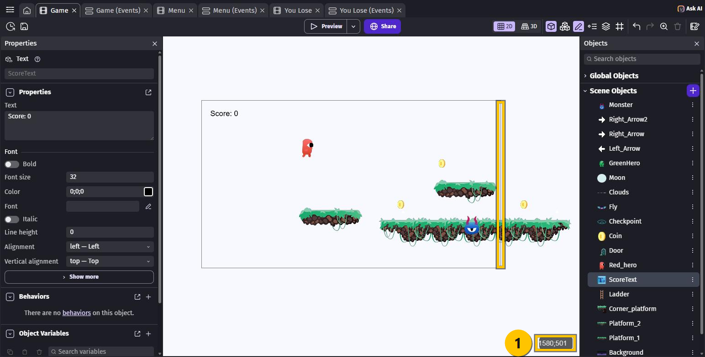
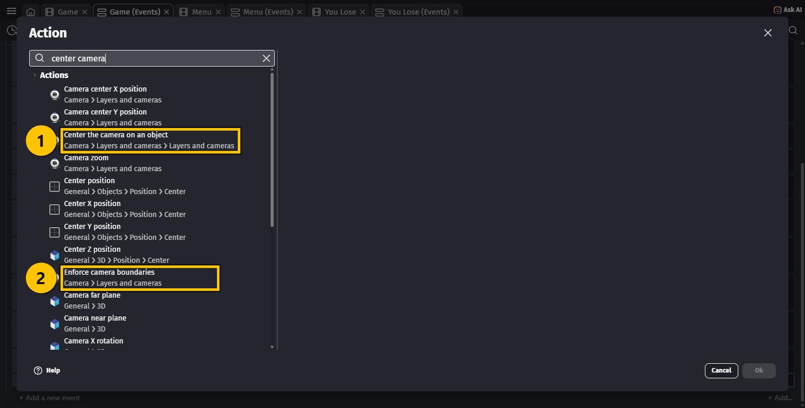
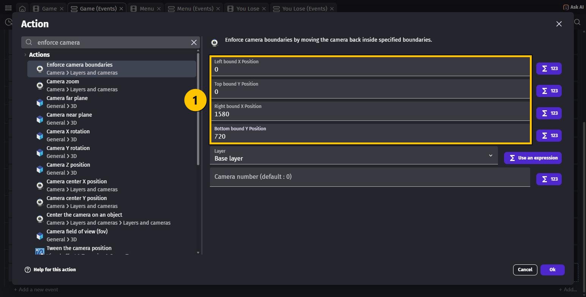
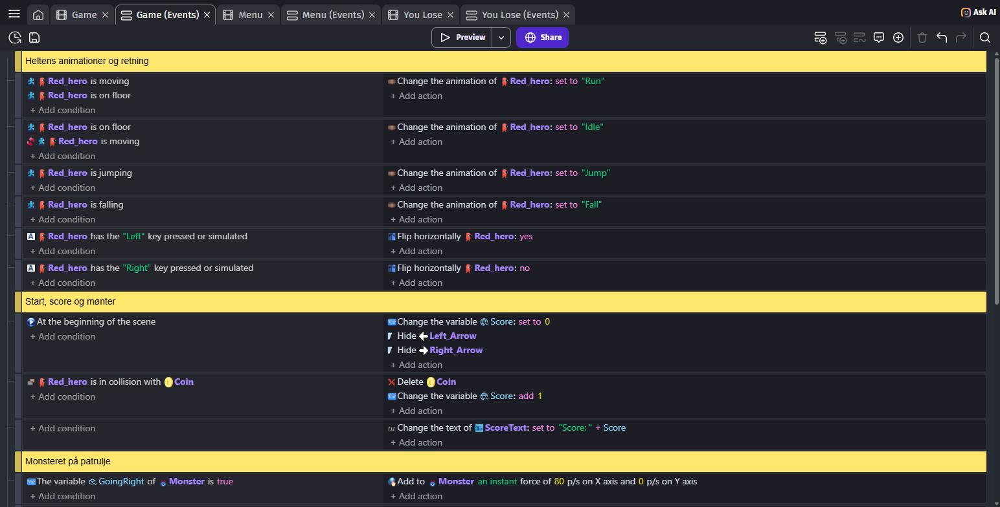
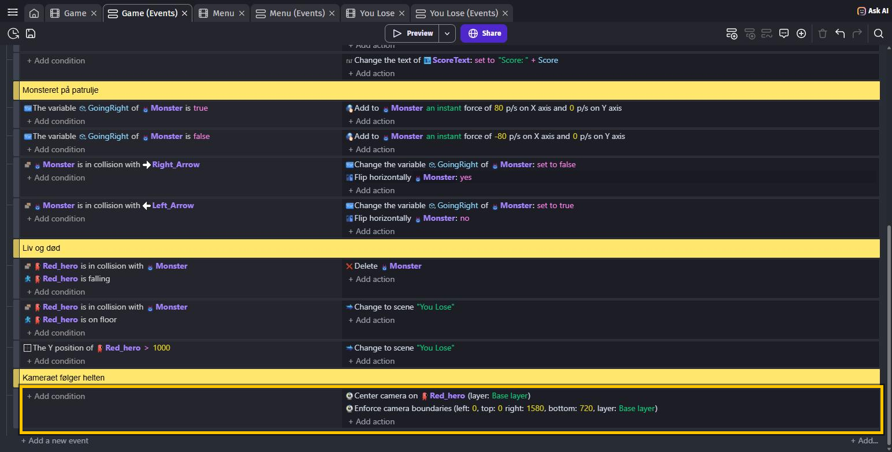

# OPGAVER TIL GDevelop – ADVANCED – CAMERA

Indtil nu har hele din bane skullet passe på **én** skærm. Det er ikke meget plads til et
platformspil.

I denne lektion gør du banen **større end skærmen** og får **kameraet** til at følge helten.
Til sidst rydder du op i din kode, som efterhånden er blevet ret lang.

> 🟡 **Om billederne:** de gule kasser viser, hvor du skal klikke — eller hvad der er nyt.

---

## Hvad er et kamera?

Din bane er en stor verden. **Kameraet** er det vindue, spilleren kigger ind gennem.

Indtil nu har kameraet stået stille i hjørnet — derfor kunne banen kun være så stor som
skærmen. Flytter vi kameraet, kan banen blive lige så stor, vi vil.

Det hvide rektangel i editoren er **præcis én skærm**: `1280` pixels bred og `720` høj.

---

## Opgave 1 – CAMERA: Byg banen større end skærmen

1. Åbn scenen **`Game`**.
2. **Rul med musehjulet** på scenen for at zoome **ud**, så du kan se plads uden for det
   hvide rektangel.
3. Træk flere **platforme** ind, så banen fortsætter **ud til højre — forbi den hvide kant**.
   Læg også et par `Coin`, et `Monster` og dine to pile derude, hvis du vil.

Den gule streg på billedet er den hvide kant — altså **der hvor skærmen slutter**. Banen
fortsætter langt til højre for den.

4. Hold musen ude ved banens **højre kant**, og kig i **nederste højre hjørne** ①. Der står
   to tal: hvor musen er henne i banen. Det første tal er **X** — hvor langt mod højre.

**Skriv dit X-tal ned.** Du skal bruge det i Opgave 3. På billedet står der `1580`.

> 💡 I editoren ser det underligt ud, at man kan se hele banen på én gang. I selve spillet
> ser man kun én skærm ad gangen — det er hele pointen med kameraet.

---

## Opgave 2 – CAMERA: Få kameraet til at følge helten

Åbn fanen **Game (Events)**, og rul helt ned i bunden.

1. Tryk **+ Add a new event**.
2. **Denne gang skal du ikke lave nogen condition** — feltet til venstre skal stå tomt. Så
   kører kameraet hele tiden, mange gange i sekundet.
3. **+ Add action** → søg efter `center camera` → vælg ① **Center the camera on an object**.
4. I feltet **Object** vælger du **`Red_hero`**. Tryk **Ok**.

> 💡 I selve koden bliver actionen skrevet kortere: **Center camera on `Red_hero`**. Det er
> den samme.

**Tryk Preview og prøv det!** Løb til højre — banen ruller forbi, og helten bliver i midten.

> ⚠️ Løb helt ud til kanten. Nu kan du se **uden for** banen: bare tomhed. Det retter vi nu.

---

## Opgave 3 – CAMERA: Stop kameraet ved kanten

Det samme event skal have én action mere.

1. **+ Add action** i det event, du lige lavede → søg efter `enforce camera` →
   vælg ② **Enforce camera boundaries**.
2. Udfyld de fire felter ①:

| Felt | Tal | Hvad det er |
|---|---|---|
| **Left bound X Position** | `0` | Banens venstre kant |
| **Top bound Y Position** | `0` | Banens øverste kant |
| **Right bound X Position** | dit tal fra Opgave 1 | Banens højre kant |
| **Bottom bound Y Position** | `720` | Banens nederste kant |

3. Tryk **Ok**.

De fire tal er altså bare **banens fire kanter**. Kameraet må ikke vise noget uden for dem.

> 💡 **Rækkefølgen af de to actions betyder noget.** Først flytter vi kameraet hen på
> helten, og **derefter** skubber vi det tilbage inden for kanterne. Bytter du om, virker
> det ikke.

> 💡 `720` i bunden er præcis skærmens højde. Derfor kan kameraet slet ikke bevæge sig
> **op og ned** — kun til siderne. Er din bane højere end én skærm, skal du skrive et
> større tal.

Nu sker der også noget godt med døden fra sidste lektion: falder helten ud over kanten,
**stopper kameraet**. Man ser ham forsvinde nedad i stedet for at følge ham ud i det tomme
— og så slår `Y position > 1000` til.

---

## Opgave 4 – CAMERA: Ryd op i din kode

Kig på din Events-side. Der er efterhånden **14 events**, og de handler om vidt forskellige
ting. Det er svært at finde noget.

Løsningen heder en **comment** — en gul bjælke med din egen tekst.

1. Klik på det event, der skal være **først** i et afsnit.
2. Tryk **Shift + C**. (Du kan også bruge taleboble-knappen **Add a comment** oppe til
   højre.)
3. Der kommer en **gul bjælke** lige **over** eventet. Klik på den, og skriv din tekst.

Prøv at lave disse fem:

| Skriv | Over eventet |
|---|---|
| `Heltens animationer og retning` | det allerførste event |
| `Start, score og mønter` | **At the beginning of the scene** |
| `Monsteret på patrulje` | det første `GoingRight`-event |
| `Liv og død` | `Red_hero` **is in collision with** `Monster` |
| `Kameraet følger helten` | dit nye camera-event |

> 💡 En comment **gør ingenting** i spillet. Den er kun til dig — og til den, der skal
> hjælpe dig, når noget ikke virker. Det er derfor rigtige programmører skriver dem.

---

## Hele koden samlet

Det ene nye event i denne lektion:

| Conditions (HVIS) | Actions (SÅ) |
|---|---|
| *(ingen — kører hele tiden)* | Center camera on `Red_hero` Enforce camera boundaries (left: `0`, top: `0`, right: `1580`, bottom: `720`) |

---

## Prøv spillet! 🎮

Tryk **Preview**, klik **Start** i menuen:

- Løb til højre → **banen ruller**, og helten bliver midt på skærmen
- Løb helt ud til venstre og højre kant → kameraet **stopper**, du ser aldrig uden for banen
- Hop ud over kanten → kameraet står stille, helten forsvinder nedad, og du taber

Husk **Ctrl + S**.

---

## Ekstra: Zoom

Figurerne er små. Prøv at zoome ind på dem:

1. **+ Add action** i dit camera-event → søg efter `camera zoom` → vælg **Camera zoom**.
2. Skriv et tal i **Value**. `1` er normal. `2` gør alt dobbelt så stort — men så ser du
   kun det halve af banen.

Prøv dig frem med `1.5` og `2`, og se hvad du bedst kan lide.

> ⚠️ Når du zoomer ind, viser skærmen et mindre stykke af banen. Så kan kameraet pludselig
> bevæge sig **op og ned** også, og det kan se forkert ud. Sæt i så fald
> **Bottom bound Y Position** ned, eller lad zoom være.

---

## Du er færdig med CAMERA ✅

- [ ] Min bane fortsætter uden for det hvide rektangel
- [ ] Kameraet **følger** helten, når han løber
- [ ] Kameraet **stopper** ved banens kanter
- [ ] Min Events-side er delt op med gule **comments**

**Næste gang** laver vi en **dør**, der kun kan åbnes, hvis du har samlet nok mønter — og en
besked på skærmen, når du ikke har.

---

## Hvis noget går galt

| Problem | Løsning |
|---|---|
| Kameraet følger ikke helten | Har eventet ved en fejl fået en condition? Feltet til venstre skal være **tomt**. |
| Kameraet står stille midt i banen | **Right bound X Position** er for lille. Sæt den til banens rigtige X. |
| Jeg kan se uden for banen | Du mangler **Enforce camera boundaries** — eller tallene er større end banen. |
| Kameraet ryster eller hopper | De to actions står i **omvendt** rækkefølge. **Center camera** skal være **først**. |
| Kameraet vipper op og ned | **Bottom bound Y Position** er større end `720`. Prøv præcis `720`. |
| Jeg kan ikke zoome ud i editoren | Rul med musehjulet **på selve scenen** — ikke i panelerne ved siden af. |
| Jeg kan ikke finde koordinaterne | De står kun i **nederste højre hjørne**, og kun når musen er inde på scenen. |
| Min comment kom det forkerte sted | Klik på den, og tryk **Delete**. Marker så det rigtige event, og tryk **Shift + C** igen. |
| Jeg fik skrevet et bogstav for meget i min comment | Klik i teksten, og ret den som i et almindeligt tekstfelt. |

---

Opgaverne bygger på det oprindelige GDevelop-forløb fra
[mom2day.dk/gdevelop-advanced-camera](https://mom2day.dk/gdevelop-advanced-camera). 🙏
