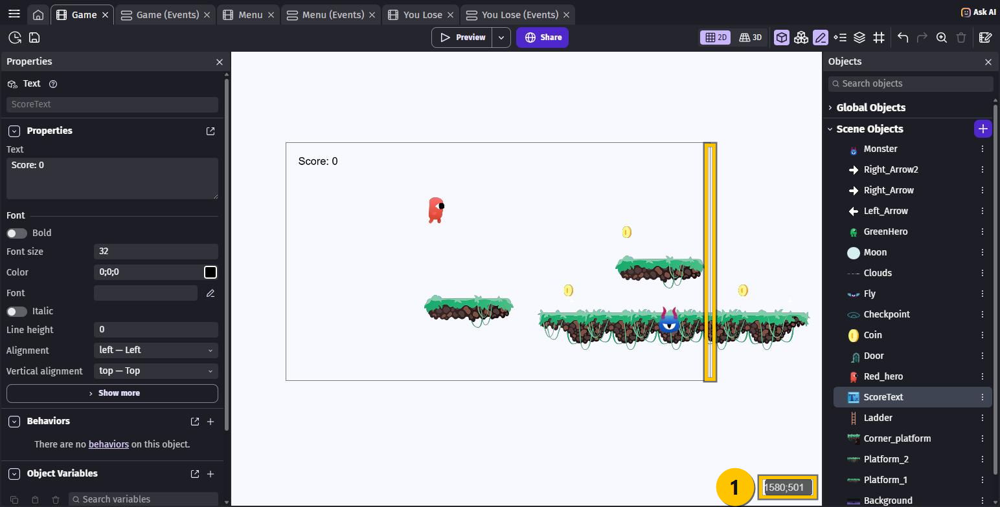
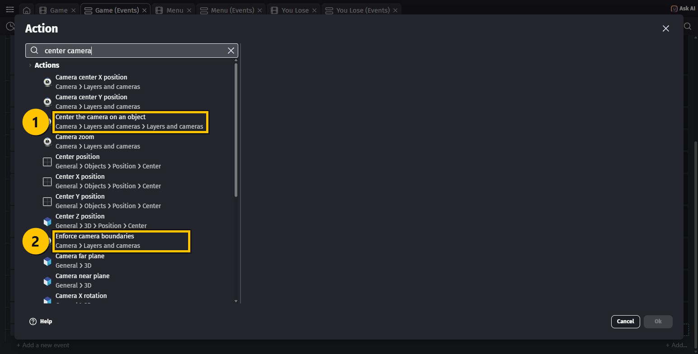
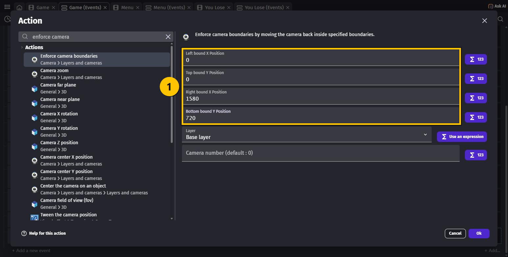
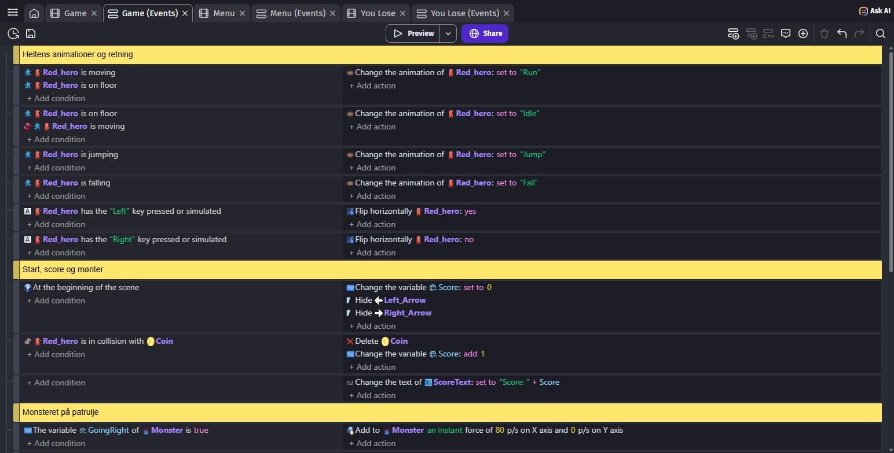
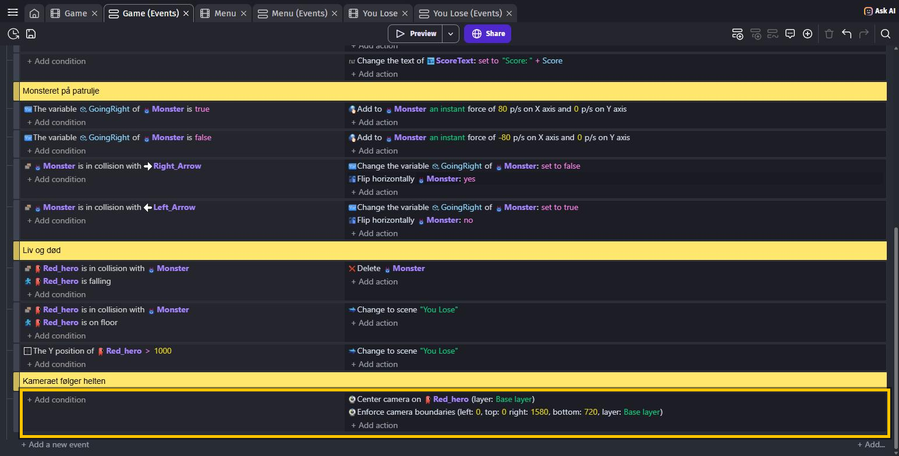

# OPGAVER TIL GDevelop – ADVANCED – CAMERA

> **VIDEN**
>
> Nu gør du banen større end skærmen. Du får kameraet til at følge helten og deler koden op
> med små noter.
>
> Knapperne står på engelsk. Vi skriver deres navne, som de står på skærmen. Bokse med hel
> kant er **GØR DETTE**. Bokse med stiplet kant er **VIDEN**. Gule felter viser, hvor du
> skal klikke, eller hvad der er nyt. Tallene ved felterne passer til tallene i teksten.
{: .lesson-info}

---

## Hvad er et kamera?

> **VIDEN**
>
> **Kameraet** er vinduet, spilleren ser banen igennem. Det hvide rektangel i editoren viser
> skærmen: `1280` pixels bred og `720` høj. Kameraet kan flytte sig, så banen kan være
> større end skærmen.
{: .lesson-info}

---

## Opgave 1 – CAMERA: Byg banen større end skærmen

> **GØR DETTE**
>
> 1. Åbn scenen `Game`.
> 2. Rul musehjulet på scenen for at zoome ud. Så kan du se uden for det hvide rektangel.
> 3. Træk flere platforme ind til højre for den hvide kant.
> 4. Hvis du vil, kan du også sætte et par `Coin`, et `Monster` og dine to pile derude.
{: .lesson-action}

> **GØR DETTE**
>
> 1. Hold musen ved banens højre kant.
> 2. Læs X-tallet **(1)** nederst til højre.
> 3. Skriv tallet ned. Du skal bruge det i Opgave 3. Billedet viser `1580`.
{: .lesson-action}

> **VIDEN**
>
> Den gule streg viser, hvor skærmen slutter. I spillet ser du kun den del af banen, som
> kameraet viser.
{: .lesson-info}

---

## Opgave 2 – CAMERA: Få kameraet til at følge helten

> **GØR DETTE**
>
> 1. Åbn fanen **Game (Events)**, og rul ned til bunden.
> 2. Vælg **+ Add a new event**. Lad venstre side stå tom. Så kører eventet hele tiden.
> 3. Vælg **+ Add action**, søg efter `center camera`, og vælg **Center the camera on an
>    object** **(1)**.
> 4. Sæt **Object** til `Red_hero`, og vælg **Ok**.
{: .lesson-action}

> **GØR DETTE**
>
> Vælg **Preview**, og løb til højre.
{: .lesson-action}

> **VIDEN**
>
> Banen ruller forbi, mens helten bliver midt på skærmen. Actionen står også som **Center
> camera on `Red_hero`** i eventet. Hvis du løber helt ud til kanten, kan du se uden for
> banen. Det retter du nu.
{: .lesson-info}

---

## Opgave 3 – CAMERA: Stop kameraet ved kanten

> **GØR DETTE**
>
> 1. I det samme event, vælg **+ Add action**. Søg efter `enforce camera`, og vælg
>    **Enforce camera boundaries** **(2)**.
> 2. Udfyld felterne **(1)**:
>
>    | Felt | Tal |
>    |---|---|
>    | **Left bound X Position** | `0` |
>    | **Top bound Y Position** | `0` |
>    | **Right bound X Position** | Dit X-tal fra Opgave 1 |
>    | **Bottom bound Y Position** | `720` |
>
> 3. Vælg **Ok**.
{: .lesson-action}

> **VIDEN**
>
> Tallene er banens fire kanter. Kameraet skal blive inden for dem. Sæt **Center camera**
> før **Enforce camera boundaries**. Ellers virker det ikke.
{: .lesson-info}

> **VIDEN**
>
> `720` er skærmens højde. Derfor kan kameraet kun flytte sig til siderne. Hvis din bane er
> højere end skærmen, skal tallet være større. Når helten falder ud over banen, følger
> kameraet ham ikke længere, og tab-eventet fra sidste lektion virker.
{: .lesson-info}

---

## Opgave 4 – CAMERA: Ryd op i din kode

> **VIDEN**
>
> En **comment** er en gul bjælke med en note. Den hjælper dig med at finde rundt i koden.
{: .lesson-info}

> **GØR DETTE**
>
> 1. Vælg det event, der skal være først i et afsnit.
> 2. Tryk **Shift + C**. Du kan også vælge **Add a comment** øverst til højre.
> 3. Vælg den gule bjælke over eventet, og skriv din note.
>
> Lav fem noter:
>
> | Skriv | Over eventet |
> |---|---|
> | `Heltens animationer og retning` | Det første event |
> | `Start, score og mønter` | **At the beginning of the scene** |
> | `Monsteret på patrulje` | Det første `GoingRight`-event |
> | `Liv og død` | Collision-eventet mellem `Red_hero` og `Monster` |
> | `Kameraet følger helten` | Dit nye camera-event |
{: .lesson-action}

> **VIDEN**
>
> En comment ændrer ikke spillet. Den er kun en note til dig og andre, der læser koden.
{: .lesson-info}

---

## Hele koden samlet

> **VIDEN**
>
> Det nye event har ingen conditions. Det kører hele tiden:
>
> | Conditions (HVIS) | Actions (SÅ) |
> |---|---|
> | *(ingen)* | Center camera on `Red_hero` Enforce camera boundaries (left: `0`, top: `0`, right: dit X-tal, bottom: `720`) |
{: .lesson-info}

---

## Prøv spillet! 🎮

> **GØR DETTE**
>
> 1. Vælg **Preview**, og vælg **Start**.
> 2. Løb til højre. Løb også helt til begge kanter.
> 3. Hop ud over kanten.
> 4. Gem med **Ctrl + S**.
{: .lesson-action}

> **VIDEN**
>
> Banen skal rulle, og kameraet skal stoppe ved kanterne. Hvis du falder ud, skal kameraet
> stå stille, mens helten falder og taber.
{: .lesson-info}

> **VIDEN**
>
> Scoren glider ud af skærmen, når kameraet flytter sig. Den hører til banen. I næste
> lektion flytter du den til et **lag**, der bliver på skærmen.
{: .lesson-info}

---

## Ekstra: Zoom

> **GØR DETTE**
>
> Vil du zoome ind? Tilføj **Camera zoom** i camera-eventet. Sæt **Value** til `1.5` eller
> `2`. `1` er normal størrelse.
{: .lesson-action}

> **VIDEN**
>
> Når du zoomer ind, ser du mindre af banen. Kameraet kan så også flytte sig op og ned.
{: .lesson-info}

> **GØR DETTE**
>
> Hvis kameraet ser forkert ud, sæt **Bottom bound Y Position** lavere.
{: .lesson-action}

---

## Du er færdig med CAMERA ✅

> **VIDEN**
>
> Du er klar til næste lektion, når:
>
> - Banen fortsætter uden for det hvide rektangel.
> - Kameraet følger helten og stopper ved banens kanter.
> - Events-siden er delt op med gule comments.
>
> Næste gang flytter du scoren til et lag, der bliver på skærmen, og laver en dør, som kræver
> mønter.
{: .lesson-info}

---

## Hvis noget går galt

| Problem | Løsning |
|---|---|
| Kameraet følger ikke helten | **GØR DETTE:** Fjern conditionen. Venstre side af eventet skal være tom. |
| Kameraet står stille midt i banen | **GØR DETTE:** Sæt **Right bound X Position** til banens rigtige X-tal. |
| Jeg kan se uden for banen | **GØR DETTE:** Tilføj **Enforce camera boundaries**, og ret tallene. |
| Kameraet ryster eller hopper | **GØR DETTE:** Sæt **Center camera** før **Enforce camera boundaries**. |
| Kameraet vipper op og ned | **GØR DETTE:** Sæt **Bottom bound Y Position** til `720`. |
| Jeg kan ikke zoome ud i editoren | **GØR DETTE:** Rul musehjulet på scenen, ikke i panelerne. |
| Jeg kan ikke finde koordinaterne | **VIDEN:** De står nederst til højre, når musen er på scenen. |
| Min comment kom det forkerte sted | **GØR DETTE:** Slet den. Vælg det rigtige event, og tryk **Shift + C** igen. |
| Jeg skrev forkert i min comment | **GØR DETTE:** Vælg teksten, og ret den. |
{: .lesson-help}

---

> **VIDEN**
>
> Opgaverne bygger på det oprindelige GDevelop-forløb fra
> [mom2day.dk/gdevelop-advanced-camera](https://mom2day.dk/gdevelop-advanced-camera).
{: .lesson-info}
