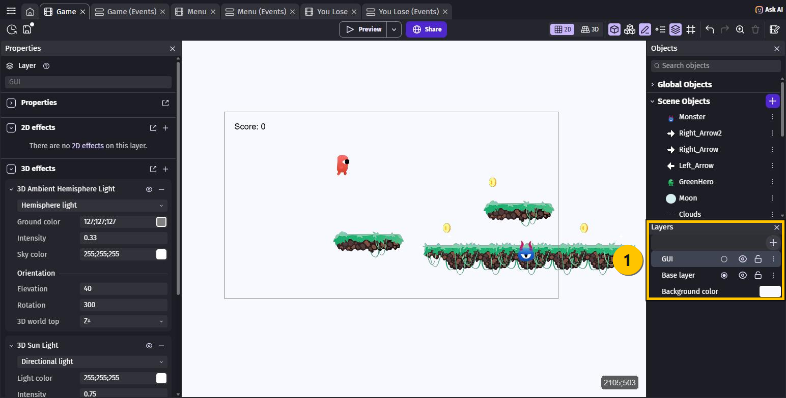
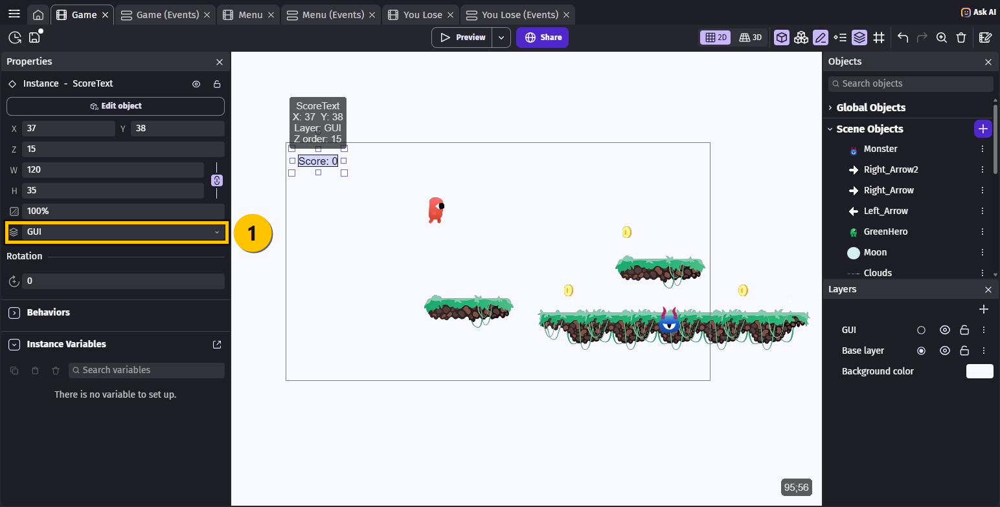
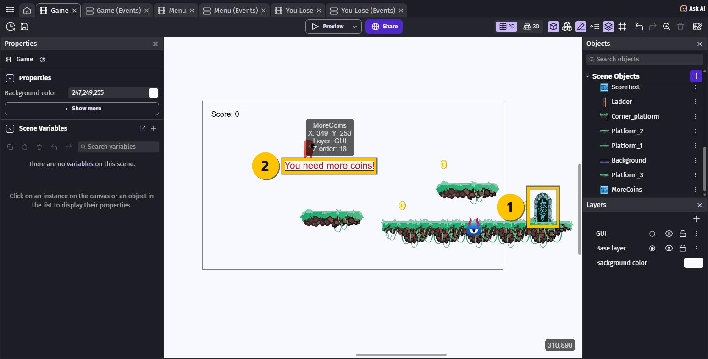
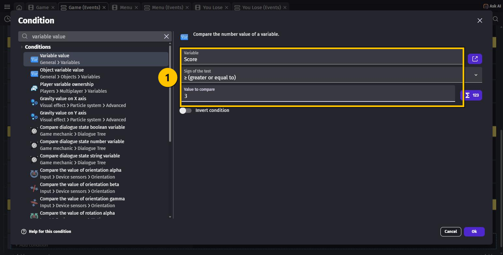
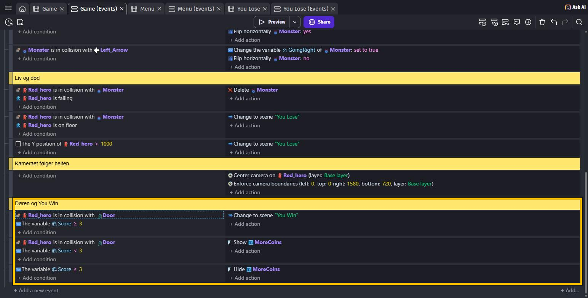

# OPGAVER TIL GDevelop – ADVANCED – DOOR

To ting i denne lektion.

Først retter vi den fejl, du fik i CAMERA: **scoren glider ud af skærmen**, når helten
løber. Løsningen heder et **lag**.

Så bygger vi en **dør** for enden af banen. Den åbner kun, hvis du har samlet nok mønter —
og hvis du ikke har, får du det at vide.

> 🟡 **Om billederne:** de gule kasser viser, hvor du skal klikke — eller hvad der er nyt.

---

## Hvad er et lag?

Forestil dig, at dit spil er tegnet på flere **gennemsigtige plastikark**, der ligger oven
på hinanden. Hvert ark er et **lag** (**layer**).

Indtil nu har alt ligget på det samme ark: **Base layer**. Og da du bad kameraet følge
helten, flyttede du hele arket — også scoren.

Tricket er, at **hvert lag har sit eget kamera**. Laver du et nyt lag og lægger scoren
derover, står den helt stille, uanset hvor kameraet på **Base layer** flytter sig.

Sådan laver alle spil deres point, liv og beskeder.

---

## Opgave 1 – DOOR: Lav et GUI-lag, så scoren står stille

1. Åbn scenen **`Game`**.
2. Tryk på **lag-ikonet** (de tre stakkede ark) oppe til højre. Så åbner **Layers**-panelet
   nede i højre hjørne ①.
3. Tryk på **+** øverst i panelet.
4. Der kommer et nyt lag **over** **Base layer**, og navnet kan skrives med det samme.
   Skriv `GUI`, og tryk **Enter**.

5. Klik på **Score: 0**-teksten ude på scenen.
6. I **Properties** til venstre er der en lille lag-vælger ① — der står **Base layer**.
   Klik på den, og vælg **GUI**.

**Tryk Preview og prøv det!** Løb til højre. Nu bliver **Score** stående i hjørnet. 🎉

> 💡 **GUI** betyder *Graphical User Interface* — altså alt det, der hører til **skærmen** i
> stedet for til **banen**. Point, liv, beskeder og knapper hører til der.

> 💡 Rækkefølgen i **Layers**-panelet er, hvad der ligger **øverst**. `GUI` står over
> `Base layer`, så scoren bliver tegnet oven på spillet — ikke bag ved.

---

## Opgave 2 – DOOR: Sæt døren op

1. Skriv `Door` i **Search objects** i **Objects**-panelet, så du kan finde den.
2. **Træk `Door` ind på scenen** — helt ude til højre for enden af din bane, så den står
   på jorden ①.
3. Døren er kæmpestor. Klik på den, og skriv i **Properties**:
   - **W**: `140`
   - **H**: `160`

   Du kan også bare trække i de små firkanter i hjørnerne.

> 💡 Du behøver **ikke** rode med collision masks. GDevelop laver dem selv — ligesom da du
> lærte om dem i BEGYNDER.

---

## Opgave 3 – DOOR: Lav beskeden

Nu skal spilleren kunne få at vide, at der mangler mønter.

1. Tryk **+ Add object** → **New object from scratch** → **Text**.
2. Udfyld:
   - **Object name**: `MoreCoins`
   - **Size**: `40`
   - **Initial text to display**: `You need more coins!`
3. Tryk **Apply**.
4. Klik på `MoreCoins` i **Objects**-panelet, og sæt **Color** i **Properties** til
   `204;0;0` — en kraftig rød, så man kan se den på den lyse baggrund.
5. Træk den ind på scenen, midt på skærmen ②.
6. **Vigtigt:** sæt den på laget **GUI** — helt som du gjorde med scoren.

> ⚠️ Glemmer du **GUI**, glider beskeden ud af skærmen sammen med banen. Så står den et
> tilfældigt sted, når spilleren når hen til døren.

---

## Opgave 4 – DOOR: Kod døren

**Tæl først dine mønter!** Hvor mange `Coin` har du trukket ind på scenen? Det tal skal du
bruge fire steder. På billederne er der `3`.

Åbn fanen **Game (Events)**.

### a) Skjul beskeden, når banen starter

Find dit **At the beginning of the scene**-event, og tilføj **én action** til det:

- `MoreCoins` → søg efter `hide` → **Hide**

### b) Døren åbner, hvis du har nok mønter

1. Tryk **+ Add a new event** nederst.
2. **+ Add condition** → `Red_hero` → `collision` → **Collision** → **Object**: `Door`.
3. **+ Add condition** → søg efter `variable value` i det **øverste** søgefelt →
   vælg **Variable value**.
4. Udfyld ①:
   - **Variable**: `Score` — GDevelop foreslår den selv, så du bare kan klikke
   - **Sign of the test**: **≥ (greater or equal to)**
   - **Value to compare**: dit møntantal
5. Tryk **Ok**.

6. **+ Add action** → søg efter `change to scene` → **Change the scene** →
   **Name of the new scene**: **You Win**.

> 💡 Du skriver bare `Score`. GDevelop finder selv ud af, at det er din **globale**
> variabel — du behøver ikke fortælle den det.

### c) Beskeden, hvis du ikke har nok

Lav et nyt event med de samme to conditions, men to ændringer:

| | Døren åbner | Beskeden vises |
|---|---|---|
| **Sign of the test** | **≥** | **<** |
| Action | Change the scene: **You Win** | `MoreCoins` → **Show** |

### d) Og væk med beskeden igen

Et sidste event — denne gang **kun én** condition:

- **Variable value**: `Score` **≥** dit møntantal
- Action: `MoreCoins` → **Hide**

Uden det ville beskeden blive stående, selv efter du har samlet de sidste mønter.

### e) Ryd op

Marker dit første dør-event, og tryk **Shift + C**. Skriv `Døren og You Win` i den gule
bjælke — ligesom i CAMERA.

---

## Hele koden samlet

| # | Conditions (HVIS) | Actions (SÅ) |
|---|---|---|
| 1 | **At the beginning of the scene** *(det gamle event)* | … + **Hide** `MoreCoins` |
| 2 | `Red_hero` **is in collision with** `Door` `Score` **≥** `3` | Change to scene `"You Win"` |
| 3 | `Red_hero` **is in collision with** `Door` `Score` **<** `3` | **Show** `MoreCoins` |
| 4 | `Score` **≥** `3` | **Hide** `MoreCoins` |

---

## Prøv spillet! 🎮

Tryk **Preview**, klik **Start**:

1. **Løb direkte hen til døren** uden at samle noget → **You need more coins!** står midt
   på skærmen 🔴
2. Løb tilbage og saml **alle** mønterne → beskeden **forsvinder** af sig selv
3. Gå hen til døren igen → **You Win!!** 🏆

Og læg mærke til, at **Score** nu bliver stående i hjørnet hele vejen.

Husk **Ctrl + S**.

> 💡 Beskeden bliver stående, indtil du har nok mønter — også hvis du går væk fra døren.
> Det er faktisk meget praktisk: så kan man huske, hvad man mangler.

---

## Du er færdig med DOOR ✅

- [ ] Der er et lag, der heder **`GUI`**, over **Base layer**
- [ ] `ScoreText` er på **GUI** og står stille, når kameraet flytter sig
- [ ] Der står en **`Door`** for enden af banen
- [ ] `MoreCoins` er på **GUI** og er skjult, når banen starter
- [ ] Døren skifter til **You Win**, hvis du har nok mønter
- [ ] Beskeden kommer, hvis du ikke har — og forsvinder, når du har

**Næste gang** laver vi **liv**: tre hjerter i hjørnet, så du kan tåle at blive ramt et par
gange, før det er slut.

---

## Hvis noget går galt

| Problem | Løsning |
|---|---|
| Scoren glider stadig ud af skærmen | Du har sat **objektet** på GUI, men glemt **instansen** på scenen. Klik på teksten *ude på scenen*, og skift laget der. |
| Jeg kan ikke finde lag-vælgeren | Du skal klikke på selve teksten **ude på scenen** — ikke på navnet i **Objects**-panelet. |
| Jeg kan ikke se Layers-panelet | Tryk på lag-ikonet oppe til højre i værktøjslinjen. |
| Beskeden er der hele tiden | Du mangler **Hide** `MoreCoins` i **At the beginning of the scene**. |
| Beskeden kommer aldrig | Tjek at tegnet i event 3 er **<** og ikke **≥**. |
| Døren åbner altid | Tjek **Value to compare** i event 2. Står der `0`, er den altid opfyldt. |
| Døren åbner aldrig | Du kræver flere mønter, end der er i banen. Tæl dine `Coin` igen. |
| Jeg kan gå igennem døren | Døren er ikke en platform — den er kun til at røre ved. Det er meningen. |
| Beskeden står et sært sted i spillet | Den er ikke på **GUI**. Sæt laget på instansen. |
| Jeg kan ikke finde conditionen | Søg på `variable value` i det **øverste** søgefelt. Den heder **Variable value** — ikke noget med "global". |

---

Opgaverne bygger på det oprindelige GDevelop-forløb fra
[mom2day.dk/gdevelop-advanced-door](https://mom2day.dk/gdevelop-advanced-door). 🙏
