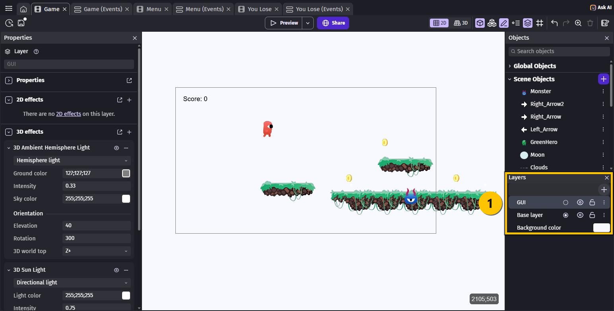
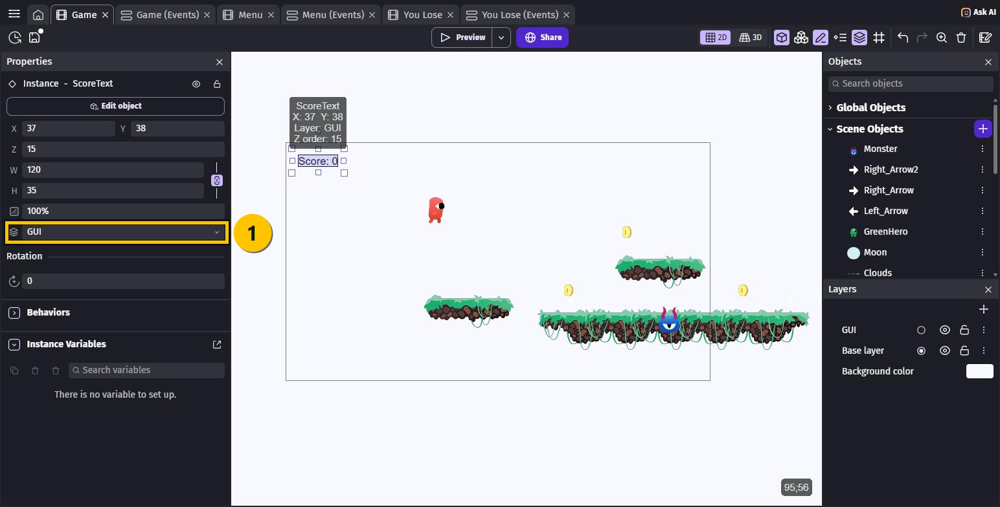
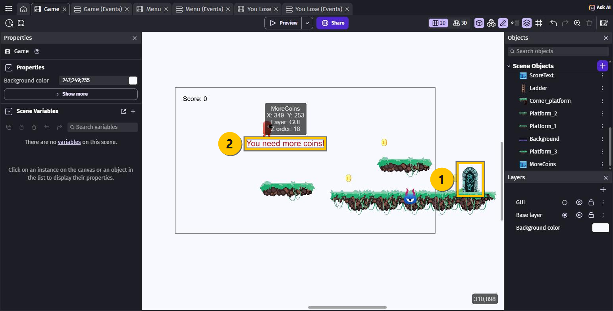
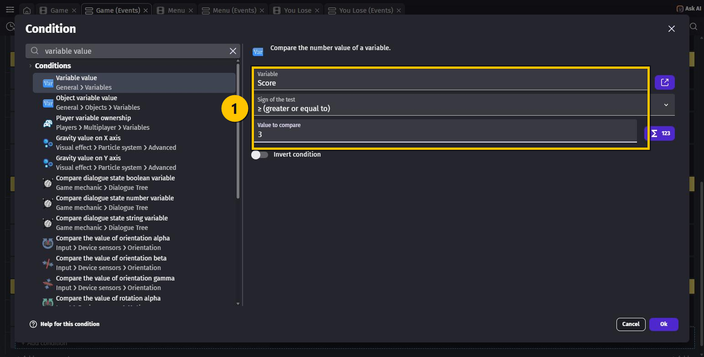
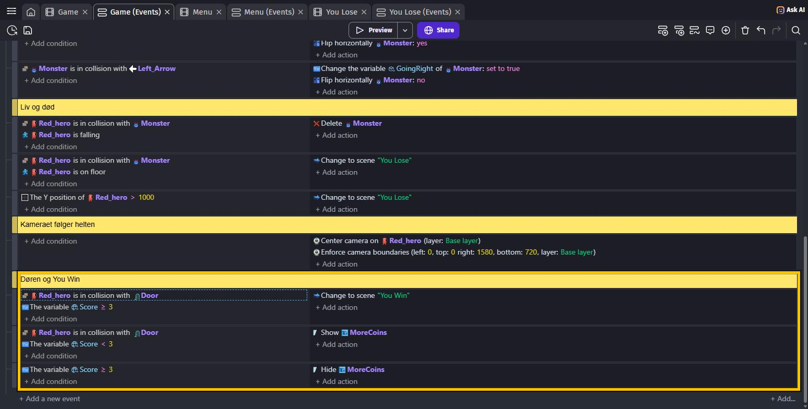

# OPGAVER TIL GDevelop – ADVANCED – DOOR

> **VIDEN**
>
> Først flytter du scoren, så den bliver på skærmen, når kameraet flytter sig. Så laver du en
> dør, der kun åbner, hvis du har nok mønter.
>
> Knapperne står på engelsk. Vi skriver deres navne, som de står på skærmen. Bokse med hel
> kant er **GØR DETTE**. Bokse med stiplet kant er **VIDEN**. Gule felter viser, hvor du
> skal klikke, eller hvad der er nyt. Tallene ved felterne passer til tallene i teksten.
{: .lesson-info}

---

## Hvad er et lag?

> **VIDEN**
>
> Et **lag** (**layer**) er som et gennemsigtigt ark oven på spillet. `Base layer` holder
> banen og figurerne. Når kameraet flytter sig, flytter alt på det lag sig også.
>
> Scoren og beskederne skal være på et andet lag, som bliver på skærmen.
{: .lesson-info}

---

## Opgave 1 – DOOR: Lav et GUI-lag, så scoren står stille

> **GØR DETTE**
>
> 1. Åbn scenen `Game`.
> 2. Vælg lag-ikonet **(1)** øverst til højre. Panelet **Layers** åbner nederst til højre.
> 3. Vælg **+** øverst i panelet.
> 4. Skriv `GUI`, og tryk **Enter**.
{: .lesson-action}

> **GØR DETTE**
>
> 1. Vælg teksten **Score: 0** på scenen.
> 2. Find lag-vælgeren **(1)** i **Properties** til venstre. Vælg **GUI**.
{: .lesson-action}

> **GØR DETTE**
>
> Vælg **Preview**, og løb til højre.
{: .lesson-action}

> **VIDEN**
>
> `GUI` betyder det, der hører til skærmen. Point, liv, beskeder og knapper kan ligge der.
> Laget øverst bliver vist oven på lagene under det.
{: .lesson-info}

---

## Opgave 2 – DOOR: Sæt døren op

> **GØR DETTE**
>
> 1. Skriv `Door` i **Search objects** under **Objects**.
> 2. Træk `Door` ud på scenen for enden af banen, på jorden **(1)**.
> 3. Vælg døren. Sæt **W** til `140` og **H** til `160` i **Properties**.
{: .lesson-action}

> **VIDEN**
>
> Du behøver ikke ændre collision mask. GDevelop laver den selv.
{: .lesson-info}

---

## Opgave 3 – DOOR: Lav beskeden

> **VIDEN**
>
> Beskeden fortæller spilleren, at der mangler mønter.
{: .lesson-info}

> **GØR DETTE**
>
> 1. Vælg **+ Add object** → **New object from scratch** → **Text**.
> 2. Udfyld felterne:
>    - **Object name**: `MoreCoins`
>    - **Size**: `40`
>    - **Initial text to display**: `You need more coins!`
> 3. Vælg **Apply**.
> 4. Vælg `MoreCoins` i **Objects**. Sæt **Color** til `204;0;0`.
> 5. Træk teksten ind midt på skærmen **(2)**.
> 6. Sæt tekstens lag til **GUI**, som du gjorde med scoren.
{: .lesson-action}

> **VIDEN**
>
> Hvis beskeden ikke er på **GUI**, flytter kameraet den sammen med banen.
{: .lesson-info}

---

## Opgave 4 – DOOR: Kod døren

> **GØR DETTE**
>
> Tæl dine `Coin` på scenen. Skriv tallet ned. Du skal bruge det i tre events. Billederne
> viser `3`. Åbn derefter fanen **Game (Events)**.
{: .lesson-action}

### a) Skjul beskeden, når banen starter

> **GØR DETTE**
>
> Find eventet **At the beginning of the scene**. Tilføj actionen:
>
> - `MoreCoins` → søg efter `hide` → **Hide**
{: .lesson-action}

### b) Døren åbner, hvis du har nok mønter

> **GØR DETTE**
>
> 1. Vælg **+ Add a new event** nederst.
> 2. Vælg **+ Add condition**. Vælg `Red_hero`, søg efter `collision`, og vælg **Collision**.
>    Sæt **Object** til `Door`.
> 3. Tilføj en condition mere. Søg efter `variable value` i det øverste søgefelt, og vælg
>    **Variable value**.
> 4. Udfyld felterne **(1)**:
>    - **Variable**: `Score`
>    - **Sign of the test**: **≥ (greater or equal to)**
>    - **Value to compare**: Dit møntantal
> 5. Vælg **Ok**.
{: .lesson-action}

> **GØR DETTE**
>
> Tilføj en action: Søg efter `change to scene`, vælg **Change the scene**, og sæt **Name of
> the new scene** til `You Win`.
{: .lesson-action}

> **VIDEN**
>
> GDevelop finder den globale variabel `Score` ud fra navnet.
{: .lesson-info}

### c) Beskeden, hvis du ikke har nok

> **GØR DETTE**
>
> Lav et nyt event med de samme to conditions. Sæt **Sign of the test** til **<**. Tilføj
> actionen `MoreCoins` → **Show**.
{: .lesson-action}

> **VIDEN**
>
> Døren åbner i det første event, når du har nok mønter. Dette event viser beskeden, når du
> har for få.
{: .lesson-info}

### d) Og væk med beskeden igen

> **GØR DETTE**
>
> Lav et sidste event med én condition: **Variable value**, `Score` **≥** dit møntantal.
> Tilføj actionen `MoreCoins` → **Hide**.
{: .lesson-action}

> **VIDEN**
>
> Så forsvinder beskeden, når du har samlet nok mønter.
{: .lesson-info}

### e) Ryd op

> **GØR DETTE**
>
> Vælg det første dør-event, og tryk **Shift + C**. Skriv `Døren og You Win` i den gule
> bjælke.
{: .lesson-action}

---

## Hele koden samlet

> **VIDEN**
>
> | # | Conditions (HVIS) | Actions (SÅ) |
> |---|---|---|
> | 1 | **At the beginning of the scene** *(det gamle event)* | … + **Hide** `MoreCoins` |
> | 2 | `Red_hero` **is in collision with** `Door` `Score` **≥** `3` | Change to scene `"You Win"` |
> | 3 | `Red_hero` **is in collision with** `Door` `Score` **<** `3` | **Show** `MoreCoins` |
> | 4 | `Score` **≥** `3` | **Hide** `MoreCoins` |
{: .lesson-info}

---

## Prøv spillet! 🎮

> **GØR DETTE**
>
> 1. Vælg **Preview**, og vælg **Start**.
> 2. Gå direkte til døren uden at samle mønter.
> 3. Gå tilbage, saml alle mønterne, og gå hen til døren igen.
> 4. Gem med **Ctrl + S**.
{: .lesson-action}

> **VIDEN**
>
> Uden nok mønter ser du **You need more coins!**. Når du har samlet nok, forsvinder
> beskeden. Når du går til døren igen, vinder du. Scoren bliver på skærmen.
{: .lesson-info}

> **VIDEN**
>
> Beskeden bliver stående, også hvis du går væk fra døren. Den forsvinder, når du har nok
> mønter.
{: .lesson-info}

---

## Du er færdig med DOOR ✅

> **VIDEN**
>
> Du er klar til næste lektion, når:
>
> - `GUI` ligger over `Base layer`.
> - `ScoreText` er på `GUI` og bliver på skærmen.
> - `Door` står for enden af banen.
> - `MoreCoins` er på `GUI` og skjult, når banen starter.
> - Døren åbner, når du har nok mønter.
> - Beskeden vises, når du mangler mønter, og forsvinder, når du har nok.
>
> Næste gang laver du tre liv med hjerter.
{: .lesson-info}

---

## Hvis noget går galt

| Problem | Løsning |
|---|---|
| Scoren glider stadig ud af skærmen | **GØR DETTE:** Vælg teksten på scenen. Sæt dens lag til `GUI`. |
| Jeg kan ikke finde lag-vælgeren | **GØR DETTE:** Vælg teksten på scenen, ikke navnet i **Objects**. |
| Jeg kan ikke se Layers-panelet | **GØR DETTE:** Vælg lag-ikonet øverst til højre. |
| Beskeden er der hele tiden | **GØR DETTE:** Tilføj **Hide** `MoreCoins` til **At the beginning of the scene**. |
| Beskeden kommer aldrig | **GØR DETTE:** Sæt tegnet i event 3 til **<**. |
| Døren åbner altid | **GØR DETTE:** Tjek **Value to compare** i event 2. Brug dit møntantal, ikke `0`. |
| Døren åbner aldrig | **GØR DETTE:** Tæl dine `Coin`, og brug det rigtige tal i conditionen. |
| Jeg kan gå gennem døren | **VIDEN:** Det er meningen. Døren åbner ved berøring; den er ikke en platform. |
| Beskeden står et sært sted | **GØR DETTE:** Sæt beskedens lag til `GUI`. |
| Jeg kan ikke finde conditionen | **GØR DETTE:** Søg efter `variable value` i det øverste søgefelt. |
{: .lesson-help}

---

> **VIDEN**
>
> Opgaverne bygger på det oprindelige GDevelop-forløb fra
> [mom2day.dk/gdevelop-advanced-door](https://mom2day.dk/gdevelop-advanced-door).
{: .lesson-info}
