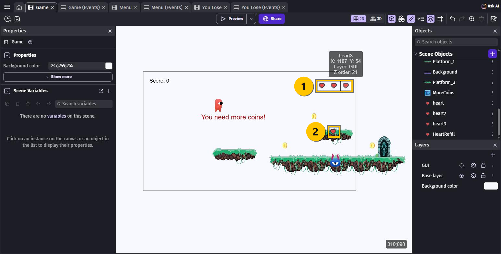
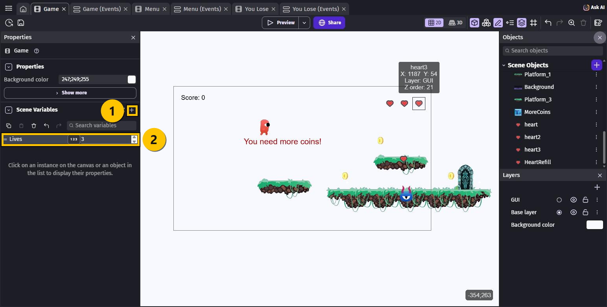
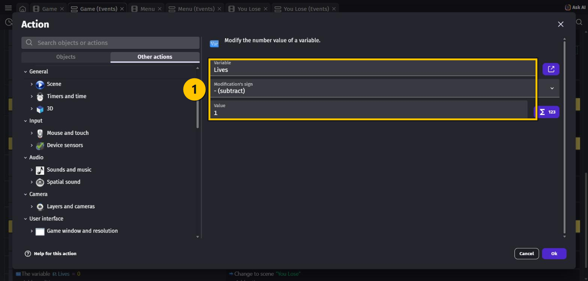
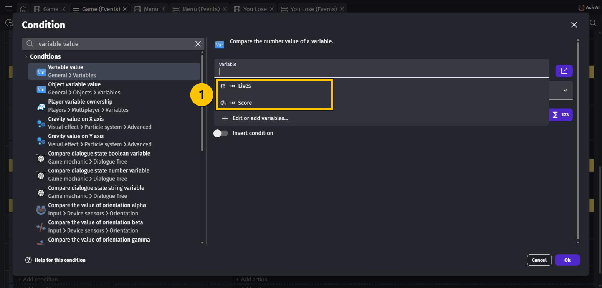
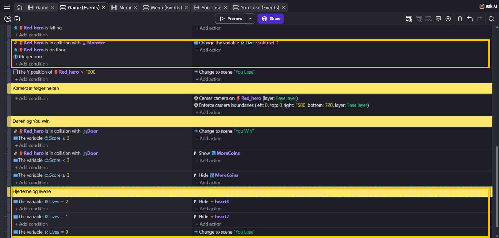

# OPGAVER TIL GDevelop – ADVANCED – LIV

Lige nu er dit spil hårdt: **ét** møde med monsteret, og så er det slut.

Rigtige spil giver dig et par chancer. I denne lektion får helten **tre liv**, og de vises
som tre hjerter oppe i hjørnet. Bliver du ramt, forsvinder et hjerte. Er de væk alle tre,
har du tabt.

> 🟡 **Om billederne:** de gule kasser viser, hvor du skal klikke — eller hvad der er nyt.

---

## En slags variabel, du ikke har brugt før

Du har brugt to slags variabler indtil nu:

| Slags | Eksempel | Hvem deler den? |
|---|---|---|
| **Global** | `Score` | Hele spillet — alle scener |
| **Objekt** | `GoingRight` | Ét objekt, fx `Monster` |

Nu kommer den sidste: en **scene-variabel**. Den hører til **én scene**.

Og der er en ting, der gør den perfekt til liv: **en scene-variabel bliver nulstillet helt
af sig selv**, hver gang scenen starter. Derfor skal du ikke lave et
**At the beginning of the scene**-event til den — sådan som du måtte for `Score`, der er
global og bliver husket på tværs af scener.

---

## Opgave 1 – LIV: Hent fire hjerter

1. Tryk **+ Add object** → fanen **Asset Store**.
2. Søg efter `heart`.
3. Vælg det simple røde **heart** af **Kenney**. Der står **CC0 (public domain)**, så det er
   frit at bruge — og det er fra **Kenney new platformer pack 1.0**, altså samme pakke som
   resten af dit spil. Så passer stregen.
4. Tryk **Add to the scene**.
5. Knappen skifter nu til **Add again**. Tryk på den **tre gange**.

Du har nu fire objekter: `heart`, `heart2`, `heart3` og `heart4`.

6. Omdøb det sidste: tryk på de **tre prikker ⋮** ved `heart4` → **Rename** → skriv
   `HeartRefill` → **Enter**.

> 💡 GDevelop sætter selv tal bag navnet, når man tilføjer det samme igen. Det er også
> derfor, du måske har et `Right_Arrow2` liggende fra FJENDER — et ekstra klik på
> **Add again**.

---

## Opgave 2 – LIV: Sæt hjerterne på plads

1. Træk `heart`, `heart2` og `heart3` ind **oppe i højre hjørne** af skærmen ① — scoren
   sidder til venstre, så hjerterne får højre side.
2. **Sæt alle tre på laget `GUI`**. Klik på hvert hjerte **ude på scenen**, og skift
   lag-vælgeren i **Properties** — helt som du gjorde med scoren i DOOR.
3. Træk `HeartRefill` ind et sted **ude i banen** ② — fx oppe på en platform, så det er
   noget man kan hoppe op og samle.

> ⚠️ Glemmer du **GUI**, glider hjerterne ud af skærmen, så snart helten løber til højre.
> `HeartRefill` skal derimod **ikke** på GUI — det skal ligge ude i banen.

---

## Opgave 3 – LIV: Lav scene-variablen

1. Klik et sted på scenen, hvor der **ikke** er noget, så **Properties** viser scenen selv.
2. Find afsnittet **Scene Variables**, og tryk på **+** ①.
3. Der kommer en linje. Udfyld ②:
   - **Navn**: `Lives`
   - **Type**: **Number** (den er valgt i forvejen)
   - **Værdi**: `3`

Og så er den færdig. Ingen events. 🎉

---

## Opgave 4 – LIV: Monsteret tager ét liv — ikke livet

Åbn fanen **Game (Events)**, og find dit event fra YOU LOSE:

> `Red_hero` **is in collision with** `Monster` + `Red_hero` **is on floor**
> → Change to scene `"You Lose"`

Det skal laves om.

1. **Højreklik** på actionen **Change to scene "You Lose"**, og vælg **Delete**.
2. **+ Add action** → søg efter `change variable value` → vælg **Change variable value**.
3. Udfyld ①:
   - **Variable**: `Lives`
   - **Modification's sign**: **- (subtract)**
   - **Value**: `1`

4. **+ Add condition** i det **samme** event → søg efter `trigger once` →
   vælg **Trigger once while true**.

### Hvorfor Trigger once?

Fordi et sammenstød ikke varer **ét** øjeblik — det varer, så længe helten rører monsteret.
Spillet tjekker dine events **60 gange i sekundet**, så på et halvt sekund ville du miste
alle tre liv på én gang.

**Trigger once while true** betyder: kør kun **den allerførste gang**, conditions bliver
sande. Slipper du monsteret og rører det igen, tæller den én gang mere.

I selve koden står den kort og godt som **Trigger once**.

> 💡 **Læg mærke til ikonerne**, når du vælger variabel ①. `Lives` har et lille
> **scene**-ikon, og `Score` har en **globus**. Sådan kan du altid se, hvilken slags
> variabel du har fat i.
>
> 

---

## Opgave 5 – LIV: Vis hjerterne, og tab spillet

Tre nye events. De har kun **én** condition hver — ingen collision, ingenting med helten.

For hvert af dem: **+ Add a new event** → **+ Add condition** → søg efter `variable value` →
**Variable value** → **Variable**: `Lives`, **Sign of the test**: **= (equal to)**,
**Value to compare**: tallet.

| # | Conditions (HVIS) | Actions (SÅ) |
|---|---|---|
| 1 | `Lives` **=** `2` | `heart3` → **Hide** |
| 2 | `Lives` **=** `1` | `heart2` → **Hide** |
| 3 | `Lives` **=** `0` | **Change the scene** → `You Lose` |

Marker til sidst det første af dem, tryk **Shift + C**, og skriv `Hjerterne og livene` i den
gule bjælke — så er koden stadig til at finde rundt i.

> 💡 **Hvorfor virker `=` her?** Fordi `Lives` kun ændrer sig **ét** ad gangen: 3 → 2 → 1 →
> 0. Den kommer altså forbi hvert enkelt tal, og hvert hjerte bliver skjult på vejen ned.

> 💡 Du ser aldrig det **sidste** hjerte forsvinde: i samme øjeblik `Lives` bliver `0`,
> skifter spillet til `You Lose`.

---

## Hele koden samlet

| Conditions (HVIS) | Actions (SÅ) |
|---|---|
| `Red_hero` **is in collision with** `Monster` `Red_hero` **is on floor** **Trigger once** | Change the variable `Lives`: **subtract** `1` |
| `Lives` **=** `2` | Hide `heart3` |
| `Lives` **=** `1` | Hide `heart2` |
| `Lives` **=** `0` | Change to scene `"You Lose"` |

---

## Prøv spillet! 🎮

Tryk **Preview**, klik **Start**:

1. Der står **tre hjerter** oppe i højre hjørne ❤️❤️❤️
2. Løb ind i monsteret fra siden → **ét hjerte forsvinder**, og du spiller videre ❤️❤️
3. Gør det igen → ❤️
4. Og igen → **You Lose....** 💀
5. Klik **Try again!** → du har **tre hjerter** igen, helt af sig selv

Og prøv så at **hoppe oven på** monsteret: det dør, og du mister ingenting. Det event har vi
ikke rørt.

Husk **Ctrl + S**.

---

## Ekstra: Saml et liv op

`HeartRefill` ligger og venter ude i banen. Sådan gør du den brugbar — prøv selv, du kan det
hele nu:

Lav et nyt event med **to** conditions:

- `Red_hero` **is in collision with** `HeartRefill`
- **Variable value**: `Lives` **<** `3`   ← så man ikke kan komme over tre

Og **fem** actions:

| Action | Hvorfor |
|---|---|
| Change the variable `Lives`: **add** `1` | Du får et liv |
| `HeartRefill` → **Delete the object** | Hjertet forsvinder, når du har taget det |
| `heart` → **Show** | |
| `heart2` → **Show** | |
| `heart3` → **Show** | |

> 💡 **Hvorfor vise alle tre?** Fordi dine tre Hide-events fra Opgave 5 kører **hele
> tiden**. Så snart du tænder alle hjerterne, slukker de igen for præcis dem, der skal være
> slukkede. Du behøver altså ikke regne ud, hvilket hjerte der skal tændes — det ordner
> koden selv.

> ✏️ Vil du have flere liv at samle, kan du markere `HeartRefill` og trække med **Ctrl**
> nede, ligesom du gjorde med patruljen i FJENDER.

---

## Ekstra: Tegn dine egne hjerter i Piskel

Hjerterne fra Asset Store er fine, men dine egne er sjovere:

1. **+ Add object** → **New object from scratch** → **Sprite**
2. Kald den `MyHeart`, og tryk **Edit with Piskel**
3. Tegn dit hjerte, gem, og tryk **Apply**
4. Brug **⋮** → **Duplicate** to gange, så du har tre

> 💡 **Piskel** virker kun i den **installerede** udgave af GDevelop — ikke i browseren.
> Det er en af grundene til, at vi bruger programmet i stedet for browseren.

---

## Du er færdig med LIV ✅

- [ ] Der er tre hjerter på **GUI**-laget oppe i hjørnet
- [ ] Der er en **scene-variabel** `Lives` med værdien `3`
- [ ] Monsteret tager **ét** liv — og kun ét, takket være **Trigger once**
- [ ] Hjerterne forsvinder ét ad gangen
- [ ] Ved `0` liv kommer **You Lose**
- [ ] Efter **Try again!** har du tre liv igen

---

## Du er færdig med HELE kurset 🏴‍☠️

Se lige, hvad du har bygget:

- En helt, der løber, hopper og skifter animation
- Mønter, der kan samles, og en score på skærmen
- Et monster på patrulje, som du kan besejre ved at hoppe på det
- En menu, en **You Win**- og en **You Lose**-skærm, du kan klikke dig imellem
- Et kamera, der følger helten gennem en bane, der er større end skærmen
- En dør, der kun åbner, hvis du har samlet nok
- Tre liv med hjerter i hjørnet

Det er et **rigtigt** platformspil. 🎉

### Hvad nu?

- **Byg banen større.** Du kan alt det, der skal til. Flere platforme, flere monstre,
  flere mønter.
- **Lav bane 2.** Lav en ny scene, kopier dine events over, og lad døren i bane 1 skifte
  til bane 2 i stedet for til `You Win`.
- **Tegn din egen helt** i Piskel.
- **Vis det frem.** Tryk **Share** og lad de andre prøve.

---

## Hvis noget går galt

| Problem | Løsning |
|---|---|
| Jeg mister alle tre liv på én gang | Du mangler conditionen **Trigger once while true**. |
| Hjerterne glider ud af skærmen | De er ikke på **GUI**-laget. Klik på hvert hjerte på scenen og skift laget. |
| Hjerterne forsvinder ikke | Tjek at tallene i de tre events er `2`, `1` og `0` — og at tegnet er **=**. |
| Der forsvinder to hjerter ad gangen | To af dine events peger på det samme hjerte. Tjek `heart2` og `heart3`. |
| Jeg dør stadig med det samme | Du har glemt at slette actionen **Change to scene "You Lose"** fra monster-eventet. |
| `Lives` starter ikke på 3 | Tjek værdien i **Scene Variables**. Der skal stå `3` i værdifeltet. |
| Jeg kan ikke finde Scene Variables | Klik på et **tomt** sted på scenen først — ellers viser panelet et objekt. |
| Jeg kan ikke finde variablen i eventet | Søg på `variable value` i det **øverste** søgefelt, og vælg **Variable value**. |
| Jeg har lavet en `heart4` for meget | **⋮** → **Delete** på objektet. |
| Hjertet jeg samler op forsvinder ikke | Du mangler actionen **Delete the object** på `HeartRefill`. |

---

Opgaverne bygger på det oprindelige GDevelop-forløb fra
[mom2day.dk/gdevelop-advanced-liv](https://mom2day.dk/gdevelop-advanced-liv). 🙏
