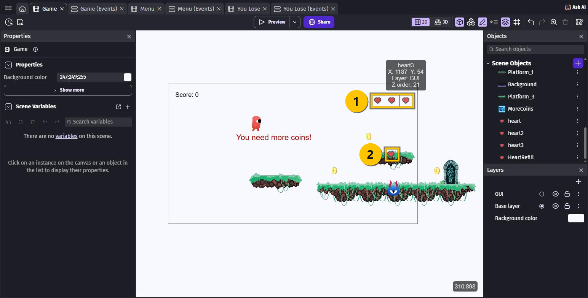
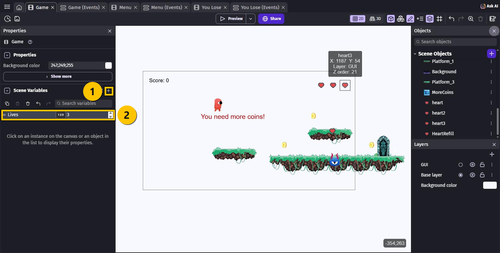
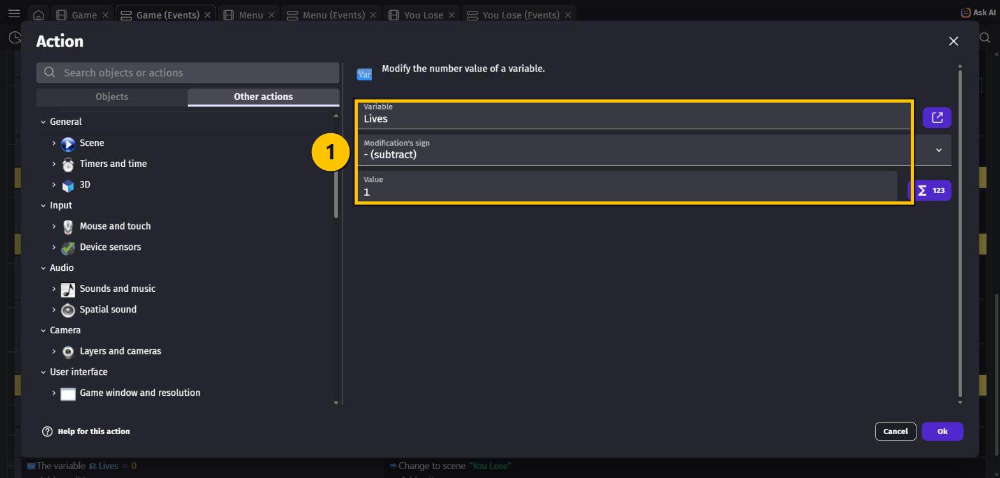
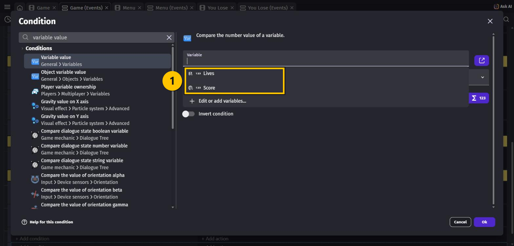
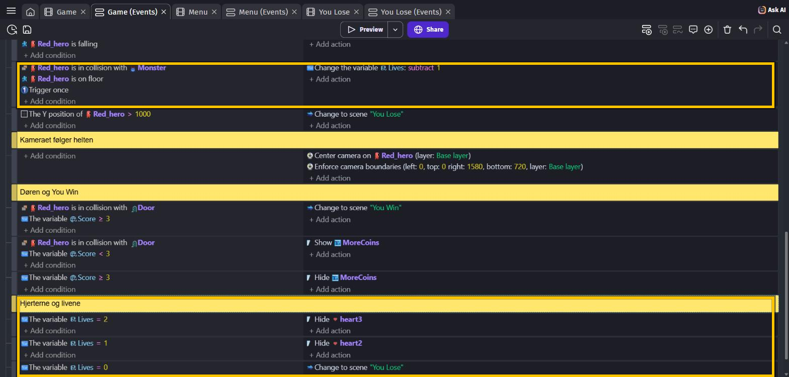

# OPGAVER TIL GDevelop – ADVANCED – LIV

> **VIDEN**
>
> Nu får helten tre liv. Hvert liv vises som et hjerte. Når alle tre er væk, taber du.
>
> Knapperne står på engelsk. Vi skriver deres navne, som de står på skærmen. Bokse med hel
> kant er **GØR DETTE**. Bokse med stiplet kant er **VIDEN**. Gule felter viser, hvor du
> skal klikke, eller hvad der er nyt. Tallene ved felterne passer til tallene i teksten.
{: .lesson-info}

---

## En slags variabel, du ikke har brugt før

> **VIDEN**
>
> Du har brugt globale variabler til hele spillet og objekt-variabler til ét objekt. Nu bruger
> du en **scene-variabel**, som hører til én scene.
>
> En scene-variabel starter på sin faste værdi, hver gang scenen åbner. Derfor behøver du ikke
> lave et **At the beginning of the scene**-event til `Lives`.
{: .lesson-info}

---

## Opgave 1 – LIV: Hent fire hjerter

> **GØR DETTE**
>
> 1. Vælg **+ Add object**, og åbn fanen **Asset Store**.
> 2. Søg efter `heart`.
> 3. Vælg det røde **heart** fra **Kenney**.
> 4. Vælg **Add to the scene**. Når knappen hedder **Add again**, vælg den tre gange.
> 5. Omdøb `heart4`: vælg **⋮** → **Rename**. Skriv `HeartRefill`, og tryk **Enter**.
{: .lesson-action}

> **VIDEN**
>
> Du har nu `heart`, `heart2`, `heart3` og `HeartRefill`. GDevelop føjer selv tal til navne,
> når du tilføjer det samme objekt flere gange. Hjerterne kommer fra **Kenney new platformer
> pack 1.0** og har licensen **CC0 (public domain)**.
{: .lesson-info}

---

## Opgave 2 – LIV: Sæt hjerterne på plads

> **GØR DETTE**
>
> 1. Træk `heart`, `heart2` og `heart3` op i skærmens højre hjørne **(1)**.
> 2. Vælg hvert hjerte på scenen. Sæt dets lag til `GUI` i **Properties**.
> 3. Træk `HeartRefill` ud på banen, fx op på en platform **(2)**.
{: .lesson-action}

> **VIDEN**
>
> De tre liv-hjerter er på `GUI`, så de bliver på skærmen. `HeartRefill` er ude i banen, så
> helten kan samle det.
{: .lesson-info}

---

## Opgave 3 – LIV: Lav scene-variablen

> **GØR DETTE**
>
> 1. Vælg et tomt sted på scenen. Så viser **Properties** indstillinger for scenen.
> 2. Find **Scene Variables**, og vælg **+** **(1)**.
> 3. Sæt **Name** til `Lives`, **Type** til **Number** og **Value** til `3` **(2)**.
{: .lesson-action}

> **VIDEN**
>
> Det er nok. Du behøver ikke lave et event for at sætte `Lives` til `3`.
{: .lesson-info}

---

## Opgave 4 – LIV: Monsteret tager ét liv — ikke livet

> **VIDEN**
>
> Eventet fra YOU LOSE siger, at helten rammer monsteret, mens han står på gulvet. Så går
> spillet til `You Lose`.
{: .lesson-info}

> **GØR DETTE**
>
> Åbn fanen **Game (Events)**, og find eventet fra YOU LOSE.
>
> 1. Højreklik på actionen **Change to scene "You Lose"**, og vælg **Delete**.
> 2. Vælg **+ Add action**. Søg efter `change variable value`, og vælg **Change variable
>    value**.
> 3. Udfyld felterne **(1)**:
>    - **Variable**: `Lives`
>    - **Modification's sign**: **- (subtract)**
>    - **Value**: `1`
{: .lesson-action}

> **GØR DETTE**
>
> I det samme event: Vælg **+ Add condition**, søg efter `trigger once`, og vælg
> **Trigger once while true**.
{: .lesson-action}

> **VIDEN**
>
> Helten kan røre monsteret i lang tid. **Trigger once while true** trækker kun ét liv væk,
> indtil helten slipper monsteret og rører det igen.
{: .lesson-info}

> **VIDEN**
>
> Når du vælger variablen **(1)**, har `Lives` et scene-ikon, og `Score` har et globus-ikon.
> Ikonet viser, hvilken slags variabel det er.
{: .lesson-info}

---

## Opgave 5 – LIV: Vis hjerterne, og tab spillet

> **VIDEN**
>
> Der skal være tre events. Hvert event har én condition. De behøver ikke tjekke, hvor helten
> er.
{: .lesson-info}

> **GØR DETTE**
>
> For hvert event:
> 1. Vælg **+ Add a new event**, og tilføj en condition.
> 2. Søg efter `variable value`, og vælg **Variable value**.
> 3. Sæt **Variable** til `Lives`, **Sign of the test** til **= (equal to)** og
>    **Value to compare** til tallet.
>
> Lav disse tre events:
>
> | Condition | Action |
> |---|---|
> | `Lives` = `2` | `heart3` → **Hide** |
> | `Lives` = `1` | `heart2` → **Hide** |
> | `Lives` = `0` | **Change the scene** → `You Lose` |
>
> Til sidst vælger du det første event, trykker **Shift + C** og skriver `Hjerterne og
> livene` i den gule bjælke.
{: .lesson-action}

> **VIDEN**
>
> `Lives` ændrer sig ét ad gangen: 3 → 2 → 1 → 0. Så passerer den hvert tal, og hjerterne
> skjules ét ad gangen. Når `Lives` bliver `0`, skifter spillet til `You Lose`.
{: .lesson-info}

---

## Hele koden samlet

> **VIDEN**
>
> Sådan ser de fire events ud:
>
> | Conditions (HVIS) | Actions (SÅ) |
> |---|---|
> | `Red_hero` **is in collision with** `Monster` `Red_hero` **is on floor** **Trigger once** | Change the variable `Lives`: **subtract** `1` |
> | `Lives` **=** `2` | Hide `heart3` |
> | `Lives` **=** `1` | Hide `heart2` |
> | `Lives` **=** `0` | Change to scene `"You Lose"` |
{: .lesson-info}

---

## Prøv spillet! 🎮

> **GØR DETTE**
>
> 1. Vælg **Preview**, og vælg **Start**.
> 2. Løb ind i monsteret fra siden tre gange.
> 3. Vælg **Try again!**.
> 4. Hop oven på monsteret.
> 5. Gem med **Ctrl + S**.
{: .lesson-action}

> **VIDEN**
>
> Du skal se tre hjerter i hjørnet. Hvert møde med monsteret fjerner ét hjerte. Når alle er
> væk, kommer **You Lose....**. Når du vælger **Try again!**, får du tre liv igen. Når du
> hopper oven på monsteret, dør monsteret, og du beholder dine liv.
{: .lesson-info}

---

## Ekstra: Saml et liv op

> **VIDEN**
>
> `HeartRefill` ligger ude i banen. Når du samler det, kan du få et liv.
{: .lesson-info}

> **GØR DETTE**
>
> Lav et event med disse to conditions:
> - `Red_hero` **is in collision with** `HeartRefill`
> - **Variable value**: `Lives` **<** `3`
>
> Tilføj disse fem actions:
> - Change the variable `Lives`: **add** `1`
> - `HeartRefill` → **Delete the object**
> - `heart` → **Show**
> - `heart2` → **Show**
> - `heart3` → **Show**
{: .lesson-action}

> **VIDEN**
>
> De tre Hide-events fra Opgave 5 holder de rigtige hjerter skjult. Derfor kan du vise alle
> hjerter, når du får et liv.
{: .lesson-info}

> **GØR DETTE**
>
> Vil du have flere hjerter at samle? Hold **Ctrl** nede, og træk `HeartRefill` for at lave
> en kopi.
{: .lesson-action}

---

## Ekstra: Tegn dine egne hjerter i Piskel

> **GØR DETTE**
>
> Vil du tegne dine egne hjerter?
> 1. Vælg **+ Add object** → **New object from scratch** → **Sprite**.
> 2. Kald objektet `MyHeart`, og vælg **Edit with Piskel**.
> 3. Tegn hjertet, gem det, og vælg **Apply**.
> 4. Vælg **⋮** → **Duplicate** to gange.
{: .lesson-action}

> **VIDEN**
>
> **Piskel** virker kun i den installerede udgave af GDevelop, ikke i browseren.
{: .lesson-info}

---

## Du er færdig med LIV ✅

> **VIDEN**
>
> Du er færdig med lektionen, når:
>
> - Tre hjerter er på `GUI` i skærmens hjørne.
> - Scene-variablen `Lives` har værdien `3`.
> - Monsteret tager ét liv ad gangen.
> - Hjerterne forsvinder ét ad gangen.
> - **You Lose** kommer, når `Lives` er `0`.
> - **Try again!** giver dig tre liv igen.
{: .lesson-info}

---

## Du er færdig med HELE kurset 🏴‍☠️

> **VIDEN**
>
> Du har bygget et platformspil med en helt, mønter, score, et monster, en menu, sejr og tab,
> et kamera, en dør og tre liv. Godt gået!
{: .lesson-info}

### Hvad nu?

> **GØR DETTE**
>
> Vil du fortsætte? Vælg en idé:
> - Gør banen større med flere platforme, monstre og mønter.
> - Lav en bane 2. Lav en ny scene, kopiér dine events, og lad døren gå til bane 2.
> - Tegn din egen helt i Piskel.
> - Vælg **Share**, og lad andre prøve spillet.
{: .lesson-action}

---

## Hvis noget går galt

| Problem | Løsning |
|---|---|
| Jeg mister alle tre liv på én gang | **GØR DETTE:** Tilføj conditionen **Trigger once while true**. |
| Hjerterne glider ud af skærmen | **GØR DETTE:** Vælg hvert hjerte på scenen, og sæt laget til **GUI**. |
| Hjerterne forsvinder ikke | **GØR DETTE:** Tjek, at de tre events bruger `2`, `1` og `0` med tegnet **=**. |
| Der forsvinder to hjerter ad gangen | **GØR DETTE:** Tjek, at eventene skjuler `heart2` og `heart3` hver for sig. |
| Jeg dør med det samme | **GØR DETTE:** Slet **Change to scene "You Lose"** fra monster-eventet. |
| `Lives` starter ikke på 3 | **GØR DETTE:** Sæt værdien i **Scene Variables** til `3`. |
| Jeg kan ikke finde Scene Variables | **GØR DETTE:** Vælg et tomt sted på scenen. |
| Jeg kan ikke finde variablen i eventet | **GØR DETTE:** Søg efter `variable value` i det øverste søgefelt. |
| Jeg har lavet en `heart4` for meget | **GØR DETTE:** Vælg **⋮** ved objektet, og vælg **Delete**. |
| Hjertet jeg samler op forsvinder ikke | **GØR DETTE:** Tilføj **Delete the object** for `HeartRefill`. |
{: .lesson-help}

---

> **VIDEN**
>
> Opgaverne bygger på det oprindelige GDevelop-forløb fra
> [mom2day.dk/gdevelop-advanced-liv](https://mom2day.dk/gdevelop-advanced-liv).
{: .lesson-info}
