# OPGAVER TIL GDevelop – FLYVESPIL – INTRO

> **VIDEN**
>
> I bokse med en hel kant står der, hvad du skal gøre. I bokse med en stiplet kant står der
> viden, som hjælper dig med at forstå det, du laver.
>
> På billederne viser gule kasser, hvor du skal klikke. Tallene i gule cirkler passer til
> tallene i trinene, fx **(1)** og **(2)**.
{: .lesson-info}

I denne lektion laver du et nyt spil. Du henter en lille blå fugl og en baggrund, og til
sidst flyver fuglen gennem luften, mens baggrunden glider forbi.

## To ord du skal kende

> **VIDEN**
>
> - **Pixel art** — grafik, der er tegnet med små firkanter (pixels), ligesom i gamle
>   computerspil. Vores fugl er kun 32 pixels stor, så vi gør den større.
> - **Tiled Sprite** — et billede, der bliver gentaget igen og igen, som fliser på et gulv.
>   Det er godt til baggrunde, fordi det kan være lige så stort, du vil.
{: .lesson-info}

## Opgave 1 – INTRO: Lav et nyt projekt

> **VIDEN**
>
> Har du ikke GDevelop på din computer endnu, så følg først
> [Opgave 1 i platformspillet](../../platformspil/01-intro/). Der står, hvordan du henter
> og installerer programmet.
{: .lesson-info}

> **GØR DETTE**
>
> 1. Åbn **GDevelop**.
> 2. Vælg **Create** i menuen til venstre.
> 3. Vælg **+ Create new game**.
> 4. Vælg **Empty project** **(1)** — det tomme projekt.
{: .lesson-action}

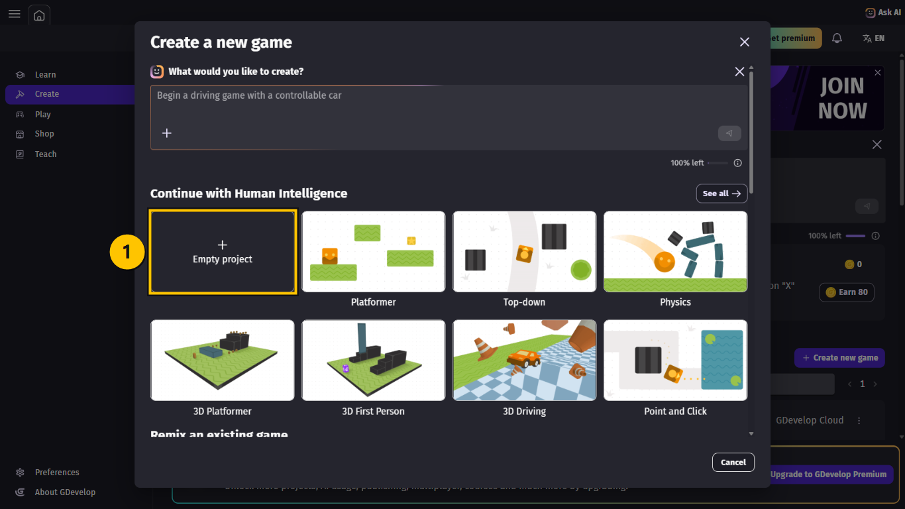

> **GØR DETTE**
>
> 1. Lad skærmstørrelsen stå på **Desktop & Mobile landscape (1280x720)** **(1)**.
> 2. Find feltet **Project name** **(2)**. Slet navnet, og skriv `Flyvespil1`.
> 3. Find **Where to store this project**. Vælg din egen computer, og vælg en mappe, du kan
>    finde igen, fx `Dokumenter\GDevelop`.
> 4. Sæt flueben ved **Optimize for Pixel Art** **(3)**.
> 5. Vælg **Create new game** **(4)**.
{: .lesson-action}

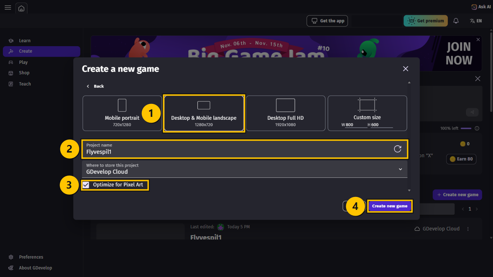

> **VIDEN**
>
> - Billedet viser **GDevelop Cloud**, fordi det er taget i en browser. I programmet bliver
>   spillet gemt på din egen computer.
> - **Optimize for Pixel Art** sørger for, at grafikken bliver skarp, når vi gør den
>   større. Uden fluebenet bliver fuglen sløret og grødet i kanterne.
{: .lesson-info}

## Opgave 2 – INTRO: Hent fuglen og baggrunden

> **GØR DETTE**
>
> Vælg **+ Add object** **(1)** i **Objects**-feltet til højre.
{: .lesson-action}

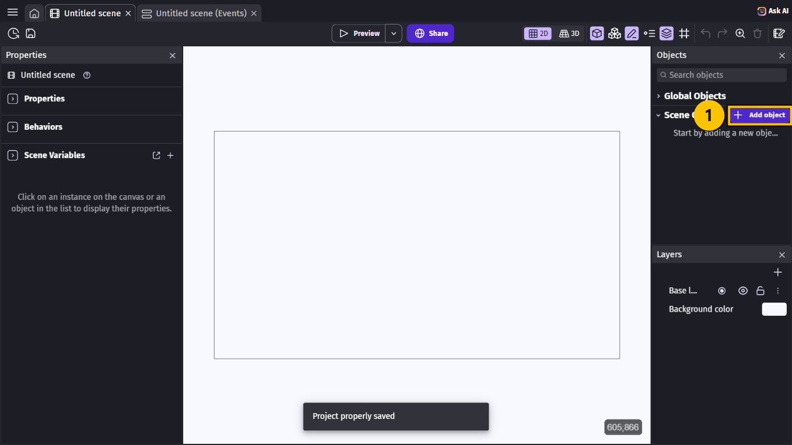

> **GØR DETTE**
>
> 1. Tjek, at fanen **Asset Store** er valgt.
> 2. Skriv `pixel adventure` i feltet **Search assets** **(1)**.
{: .lesson-action}

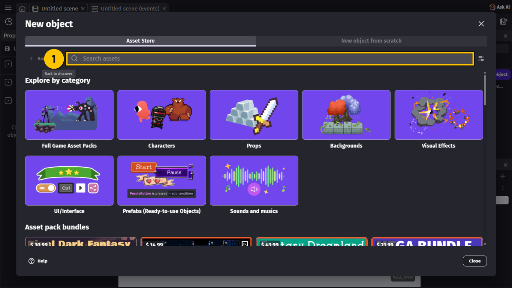

> **GØR DETTE**
>
> Vælg pakken **Pixel Adventure** **(1)** med **89 Assets**.
{: .lesson-action}

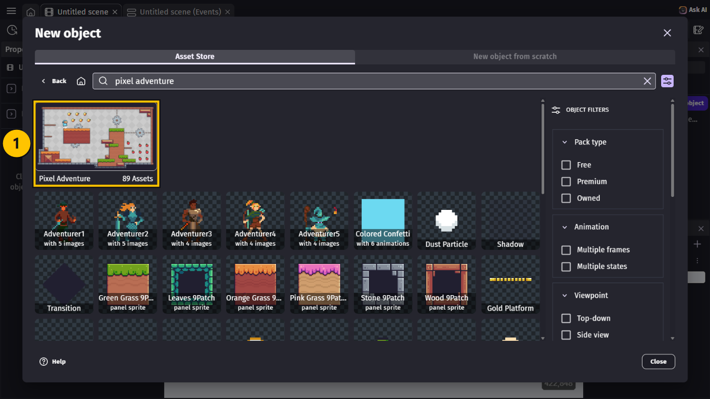

> **VIDEN**
>
> Pakken er lavet af **Pixel Frog**, og du må bruge den gratis (CC0). Den har mapper med
> figurer, fjender, frugter, fælder, baggrunde og jord, som vi kan bygge søjler af.
>
> Vi henter **ikke** alle 89 på én gang. Så bliver listen med objekter alt for lang. I hver
> lektion henter vi kun det, vi skal bruge.
{: .lesson-info}

> **GØR DETTE**
>
> Rul lidt ned, og vælg mappen **Enemies** **(1)**.
{: .lesson-action}

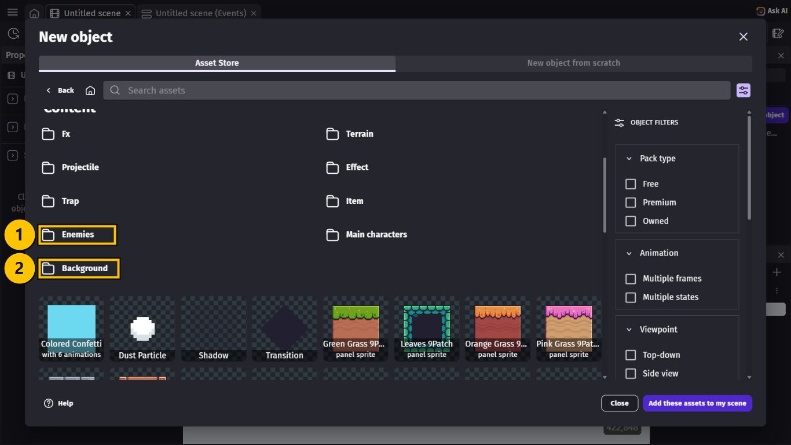

> **GØR DETTE**
>
> Vælg **BlueBird** **(1)**.
{: .lesson-action}

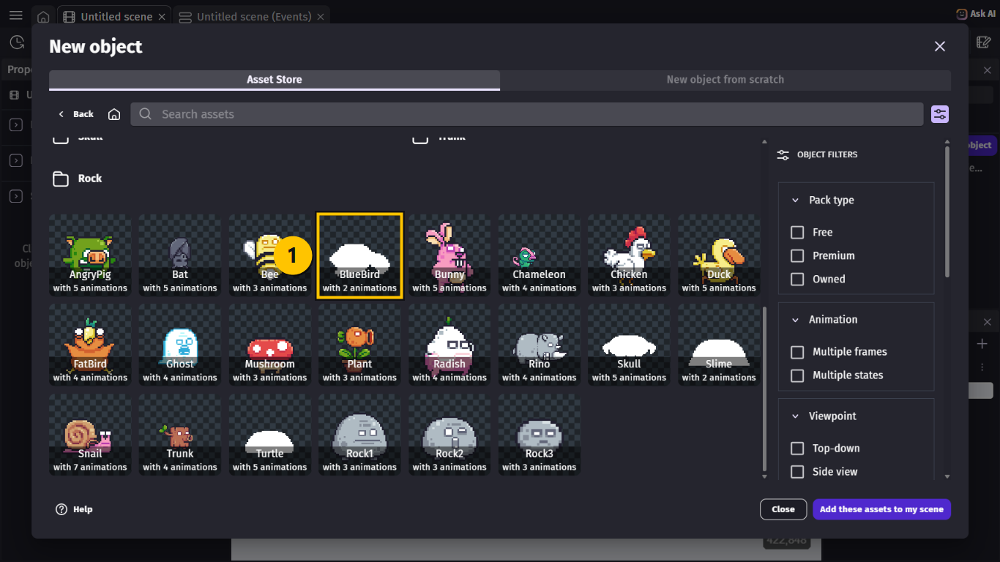

> **VIDEN**
>
> På det lille billede ser **BlueBird** helt hvid ud. Det er, fordi billedet viser
> animationen **Hit** — når fuglen bliver ramt, blinker den hvidt. Den rigtige fugl er blå.
{: .lesson-info}

> **GØR DETTE**
>
> 1. Klik på pilen ved animationen **(1)**, indtil der står **Flying**. Nu kan du se fuglen
>    flyve.
> 2. Vælg **Add to the scene** **(2)** nederst til højre.
{: .lesson-action}

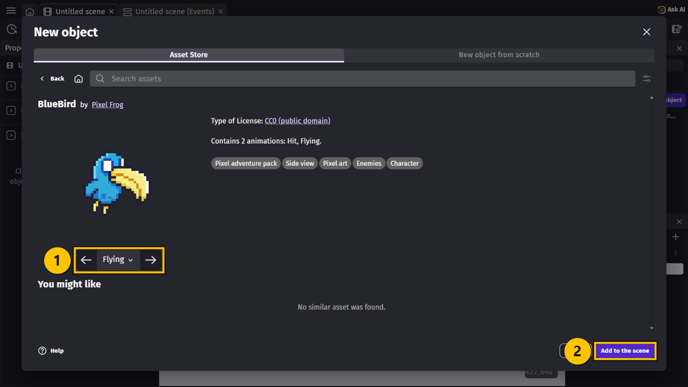

> **GØR DETTE**
>
> 1. Vælg **Back** øverst til venstre. Rul op, og vælg **Pixel adventure pack** for at
>    komme tilbage til pakken.
> 2. Vælg mappen **Background** (**(2)** på billedet med mapperne ovenfor).
> 3. Vælg **Blue Background** **(1)**.
{: .lesson-action}

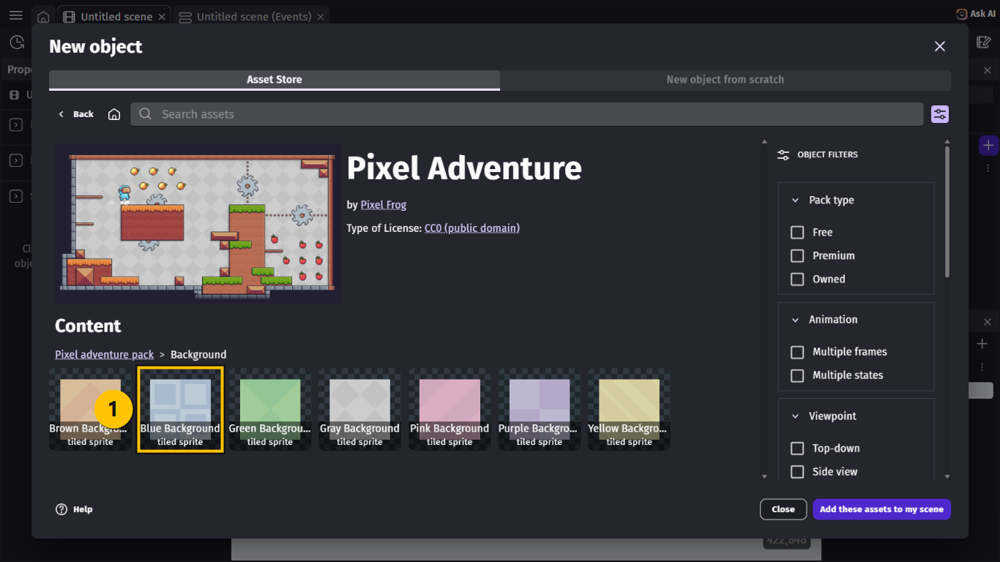

> **GØR DETTE**
>
> 1. Vælg **Add to the scene** **(1)**.
> 2. Vælg **Close** for at lukke Asset Store.
{: .lesson-action}

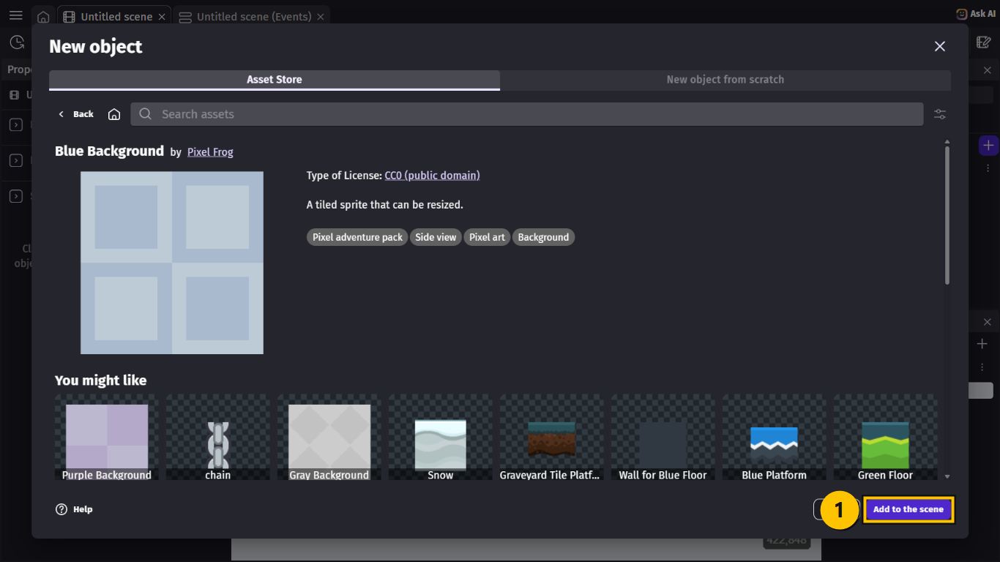

> **VIDEN**
>
> Du må gerne vælge en anden farve til baggrunden. Resten af lektionen virker på samme måde.
{: .lesson-info}

## Opgave 3 – INTRO: Giv objekterne danske navne

> **VIDEN**
>
> Nu står der to objekter under **Scene Objects** **(1)**: `BlueBird` og
> `Blue_Background`. Vi giver dem korte navne, så de er nemme at finde i dine events.
{: .lesson-info}

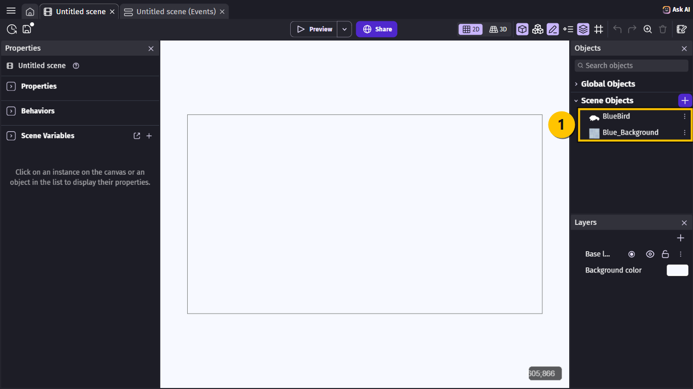

> **GØR DETTE**
>
> 1. Højreklik på `BlueBird`.
> 2. Vælg **Rename** **(1)**.
> 3. Skriv `Fugl`, og tryk **Enter**.
> 4. Gør det samme med `Blue_Background`. Kald den `Baggrund`.
{: .lesson-action}

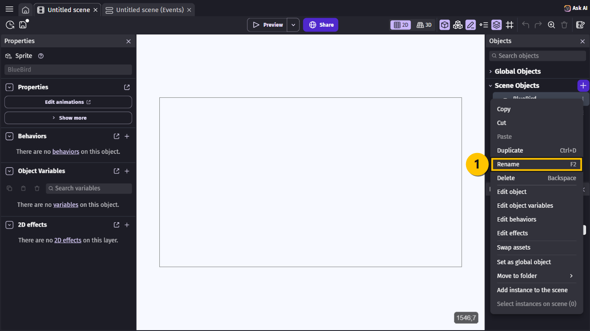

> **VIDEN**
>
> Du kan også markere et objekt og trykke **F2** for at give det et nyt navn.
{: .lesson-info}

## Opgave 4 – INTRO: Sæt baggrunden ind på scenen

> **VIDEN**
>
> Objekterne ligger i listen, men de er ikke på scenen endnu. Feltet med den tynde ramme er
> skærmen i dit spil. Alt, hvad der er inden for rammen, kan spilleren se.
{: .lesson-info}

> **GØR DETTE**
>
> 1. Træk `Baggrund` fra listen ind på scenen **(1)**.
> 2. Klik på den lille firkant, så den er markeret.
{: .lesson-action}

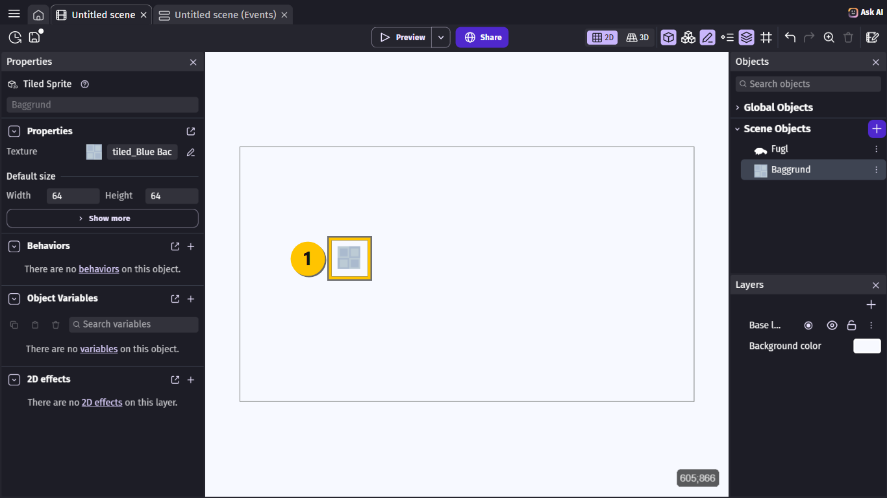

> **GØR DETTE**
>
> Til venstre kan du nu se baggrundens egenskaber.
>
> 1. Skriv `0` i både **X** og **Y** **(1)**.
> 2. Klik på den lille kæde ved **W** og **H** **(2)**, så de ikke hænger sammen.
> 3. Skriv `1280` i **W** og `720` i **H** **(2)**.
> 4. Klik på hængelåsen **(3)**, så baggrunden bliver låst.
{: .lesson-action}

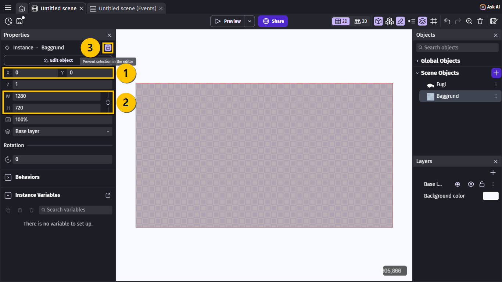

> **VIDEN**
>
> - **X** og **Y** er, hvor objektet står. `0` og `0` er øverste venstre hjørne.
> - **W** er bredden, og **H** er højden. Skærmen er 1280 bred og 720 høj.
> - Kæden sørger for, at bredde og højde passer sammen. Den skal være slået fra her, ellers
>   bliver baggrunden 1280 høj.
> - Når baggrunden er låst, kan du ikke komme til at flytte den, når du trækker andre ting
>   ind.
{: .lesson-info}

## Opgave 5 – INTRO: Sæt fuglen ind, og gør den større

> **GØR DETTE**
>
> 1. Træk `Fugl` ind i venstre side af scenen, cirka midt på højden **(1)**.
> 2. Klik på fuglen, så den er markeret.
{: .lesson-action}

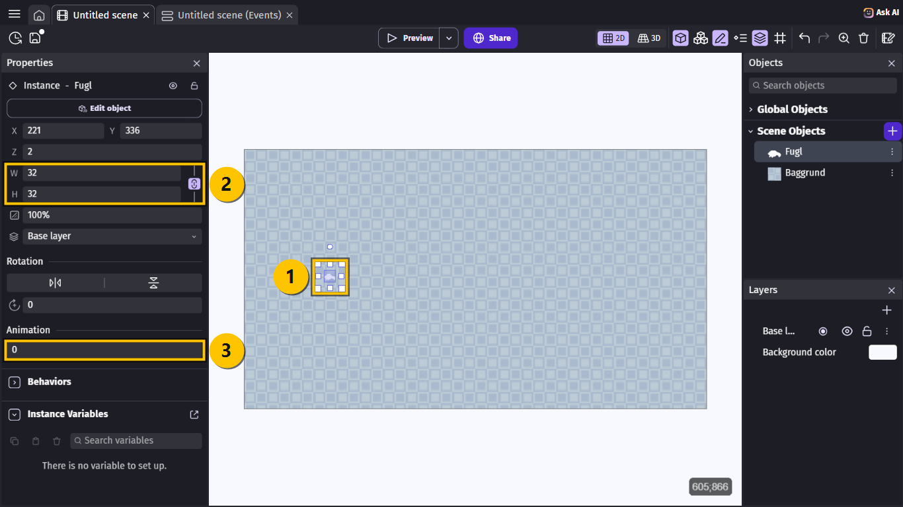

> **VIDEN**
>
> Fuglen er meget lille, og den er hvid. Til venstre kan du se hvorfor:
>
> - **W** og **H** er `32` **(2)**. Fuglen er kun 32 pixels stor.
> - **Animation** er `0` **(3)**. Animation nummer 0 er **Hit**, den hvide.
{: .lesson-info}

> **GØR DETTE**
>
> 1. Skriv `96` i **W** **(1)**, og tryk **Enter**. Kæden er slået til, så **H** bliver også
>    `96`.
> 2. Skriv `1` i **Animation** **(2)**, og tryk **Enter**.
{: .lesson-action}

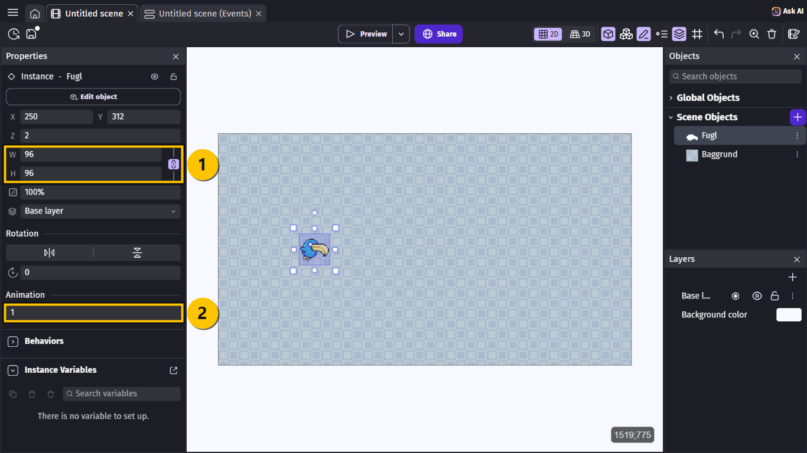

> **VIDEN**
>
> - `96` er tre gange `32`. Pixel art ser pænest ud, når man gør den 2, 3 eller 4 gange
>   større — ikke fx 2,5 gange.
> - Fuglen har to animationer: **Hit** og **Flying**. Computere tæller fra **0**, så **Hit**
>   er nummer `0`, og **Flying** er nummer `1`.
{: .lesson-info}

## Opgave 6 – INTRO: Få baggrunden til at glide forbi

> **VIDEN**
>
> Fuglen flyver ikke rigtigt fremad — den bliver i venstre side af skærmen. I stedet får vi
> baggrunden til at glide mod venstre. Så ser det ud, som om fuglen flyver mod højre.
{: .lesson-info}

> **GØR DETTE**
>
> 1. Vælg fanen **Untitled scene (Events)** **(1)** øverst.
> 2. Vælg **Add an event** **(2)**.
{: .lesson-action}

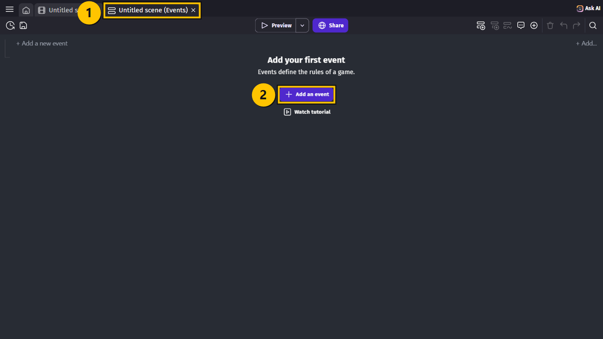

> **GØR DETTE**
>
> Vælg **+ Add action** **(1)**.
{: .lesson-action}

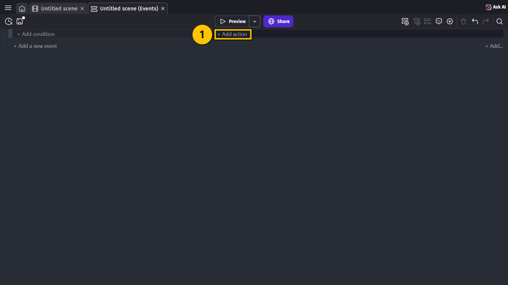

> **VIDEN**
>
> Vi tilføjer **ingen** condition. Et event uden condition sker hele tiden — ca. 60 gange
> i sekundet, så længe spillet kører.
{: .lesson-info}

> **GØR DETTE**
>
> Vælg `Baggrund` **(1)**.
{: .lesson-action}

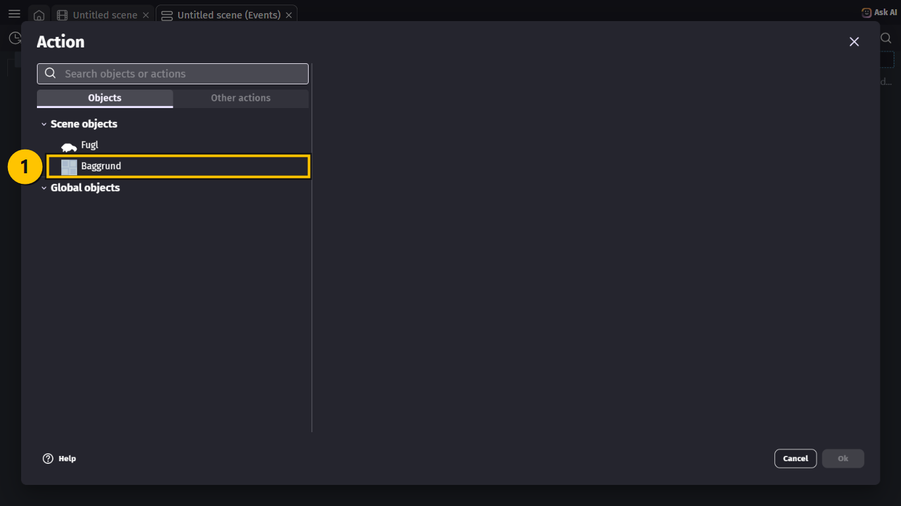

> **GØR DETTE**
>
> 1. Skriv `offset` i søgefeltet **(1)**.
> 2. Vælg **Image X Offset** **(2)**.
{: .lesson-action}

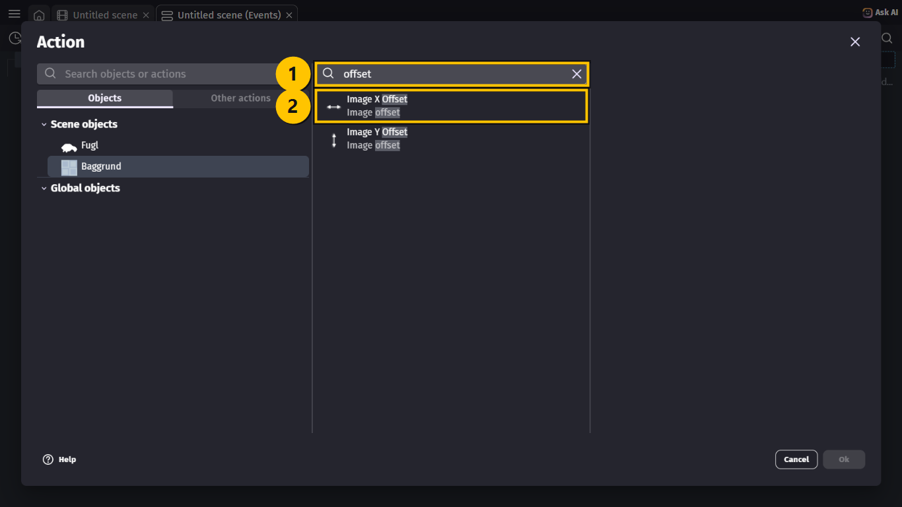

> **GØR DETTE**
>
> 1. Vælg **+ (add)** i **Modification's sign** **(1)**.
> 2. Skriv `2` i **Value** **(2)**.
> 3. Vælg **Ok** **(3)**.
{: .lesson-action}

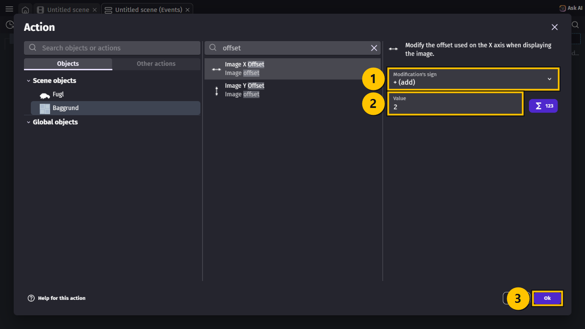

> **VIDEN**
>
> **Offset** betyder, hvor billedet starter. Når vi lægger 2 til hele tiden, glider
> baggrunden 2 pixels mod venstre hver gang. Det er en **Tiled Sprite**, så der kommer
> hele tiden nye fliser ind fra højre.
{: .lesson-info}

## Hele koden samlet

> **VIDEN**
>
> Sådan ser din Events-side ud, når du er færdig **(1)**:
>
> | # | Conditions (HVIS) | Actions (SÅ) |
> |---|---|---|
> | 1 | *(ingen — sker hele tiden)* | Change the X offset of `Baggrund`: **add 2** |
{: .lesson-info}

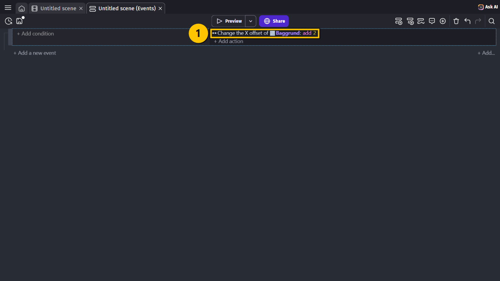

## Prøv spillet! 🎮

> **GØR DETTE**
>
> 1. Tryk **Ctrl + S** for at gemme.
> 2. Vælg **Preview** øverst.
{: .lesson-action}

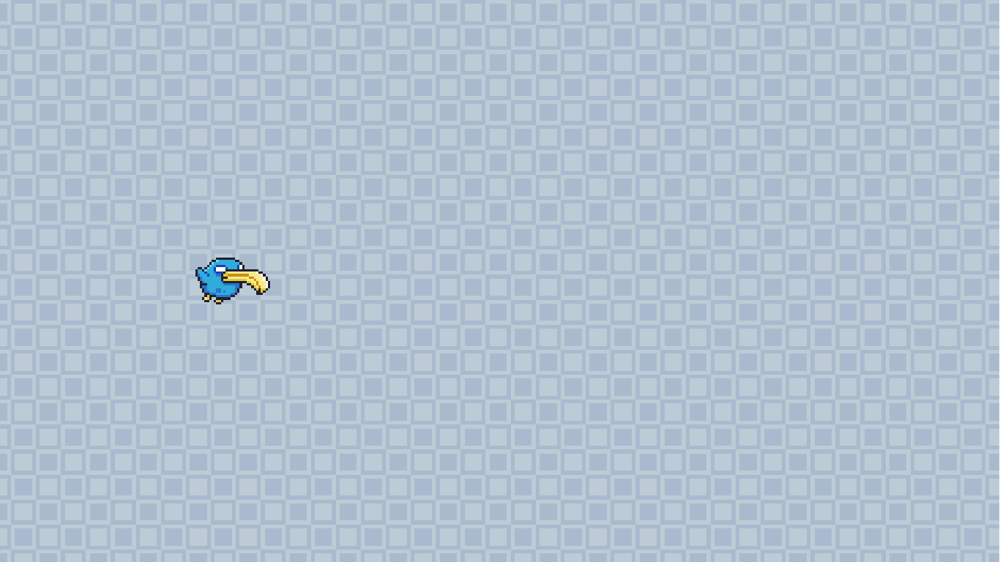

> **VIDEN**
>
> Sådan skal det virke:
>
> - Fuglen er blå, og den basker med vingerne.
> - Fuglen kigger mod højre.
> - Fuglen er skarp i kanterne — ikke sløret.
> - Baggrunden glider hele tiden mod venstre.
>
> Fuglen kan ikke styres endnu. Det lærer du i næste lektion.
{: .lesson-info}

## Ekstra: Hurtigere eller langsommere

> **GØR DETTE**
>
> Prøv at skifte `2` ud med `1` eller `6` i dit event. Hvad sker der med baggrunden?
{: .lesson-action}

> **VIDEN**
>
> Et større tal får det til at se ud, som om fuglen flyver hurtigere. Vælg den fart, du
> synes er sjovest. Senere i kurset lærer du at gøre spillet hurtigere og hurtigere, mens
> man spiller.
{: .lesson-info}

## Du er færdig med INTRO ✅

> **VIDEN**
>
> Du er klar til næste lektion, når alt dette passer:
>
> - Mit projekt hedder **Flyvespil1**, og **Optimize for Pixel Art** er slået til.
> - Jeg har objekterne `Fugl` og `Baggrund`.
> - Baggrunden fylder hele skærmen og er låst.
> - Fuglen er 96 stor, blå og basker med vingerne.
> - Baggrunden glider mod venstre.
> - Jeg har gemt projektet.
{: .lesson-info}

> **VIDEN**
>
> Næste gang får fuglen tyngdekraft, og du lærer at holde den i luften med vingeslag.
{: .lesson-info}

## Hvis noget går galt

| Problem | Prøv dette |
|---|---|
| Jeg kan ikke finde **Pixel Adventure**. | **GØR DETTE:** Tjek, at du har internet. Søg efter `pixel adventure` igen. |
| Jeg glemte fluebenet ved **Optimize for Pixel Art**. | **GØR DETTE:** Åbn menuen øverst til venstre, og vælg **Properties & Icons**. Sæt **Scale mode** til **Nearest**, og sæt flueben ved **Round pixels when rendering**. Vælg **Apply**. |
| Objekterne står i listen, men ikke på scenen. | **GØR DETTE:** Træk dem fra listen ind på scenen. |
| Baggrunden blev 1280 høj. | **GØR DETTE:** Klik på kæden ved **W** og **H**, og skriv `720` i **H** igen. |
| Jeg kommer til at flytte baggrunden. | **GØR DETTE:** Tryk **Ctrl + Z**. Markér baggrunden, og klik på hængelåsen. |
| Fuglen er gemt bag baggrunden. | **GØR DETTE:** Markér fuglen, og skriv et større tal i **Z**, fx `2`. |
| Fuglen er hvid. | **GØR DETTE:** Markér fuglen, og skriv `1` i **Animation**. |
| Fuglen er sløret og grødet. | **GØR DETTE:** Se rækken om **Optimize for Pixel Art** øverst i tabellen. |
| Fuglen kigger mod venstre. | **GØR DETTE:** Markér fuglen. Under **Rotation** er knappen med pilene til venstre (**Flip horizontally**) slået til. Klik på den, så den slås fra. |
| Baggrunden står stille. | **GØR DETTE:** Tjek dit event. Der skal stå **add 2**, ikke **set to 2**. |
| Baggrunden glider den forkerte vej. | **GØR DETTE:** Tjek, at der står **+ (add)** og ikke **- (subtract)**. |
{: .lesson-help}
