# OPGAVER TIL GDevelop – FLYVESPIL – FLYV!

> **VIDEN**
>
> I bokse med en hel kant står der, hvad du skal gøre. I bokse med en stiplet kant står der
> viden, som hjælper dig med at forstå det, du laver.
>
> På billederne viser gule kasser, hvor du skal klikke. Tallene i gule cirkler passer til
> tallene i trinene, fx **(1)** og **(2)**.
{: .lesson-info}

I denne lektion får fuglen tyngdekraft, så den falder. Hver gang du trykker på
mellemrumstasten eller klikker med musen, basker den med vingerne og flyver lidt op. Og så
vipper den med næbbet op, når den flyver op, og ned, når den falder.

## To ord du skal kende

> **VIDEN**
>
> - **Tyngdekraft** — det, der trækker ting nedad. I spillet er det et tal: jo større tal,
>   jo hurtigere falder fuglen.
> - **Trigger once** — en condition, der sørger for, at et event kun sker **én gang**, mens
>   noget er sandt — fx én gang pr. klik, selv om du holder knappen nede.
{: .lesson-info}

## Opgave 1 – FLYV: Giv fuglen tyngdekraft

> **VIDEN**
>
> Fra platformspillet kender du måske **Platformer character**. Den behavior giver en figur
> tyngdekraft og evnen til at hoppe. Vi bruger den til fuglen — bare uden noget gulv. Så
> falder fuglen hele tiden, og hvert "hop" bliver et vingeslag.
{: .lesson-info}

> **GØR DETTE**
>
> 1. Gå til fanen **Untitled scene** øverst.
> 2. Vælg `Fugl` **(1)** i listen til højre.
> 3. Find **Behaviors** til venstre. Vælg **+** **(2)**.
{: .lesson-action}

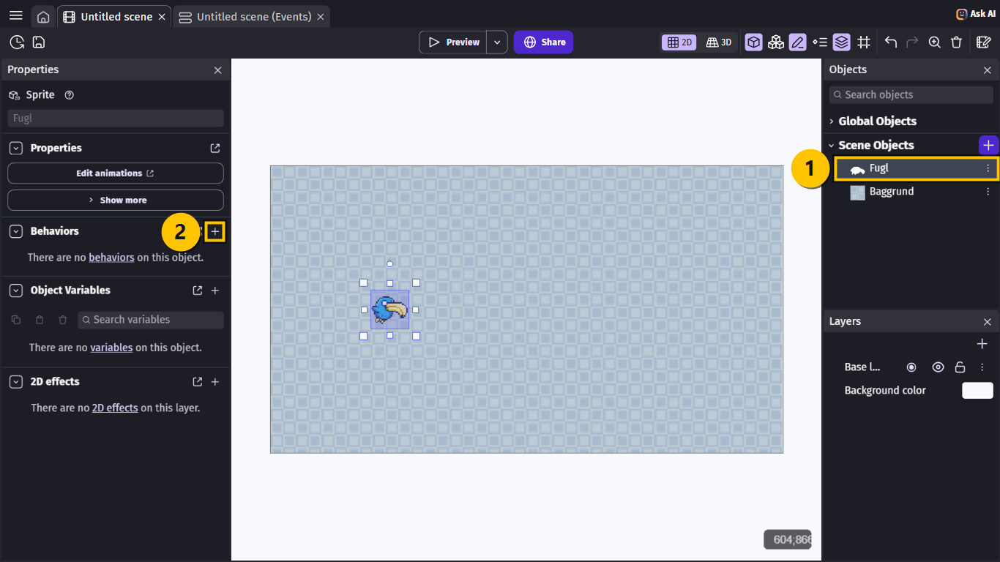

> **GØR DETTE**
>
> Vælg **Platformer character** **(1)**.
{: .lesson-action}

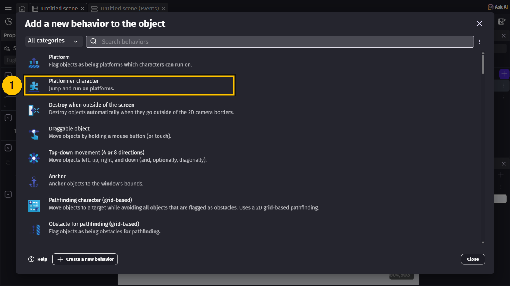

> **GØR DETTE**
>
> Nu står **PlatformerObject** under **Behaviors**. Ret disse ting:
>
> 1. Slå **Disable default keyboard controls** til **(1)**.
> 2. Skriv `1500` i **Gravity** og `800` i **Max. falling speed** **(2)**.
> 3. Skriv `700` i **Jump speed** og `0` i **Jump sustain time** **(3)**.
{: .lesson-action}

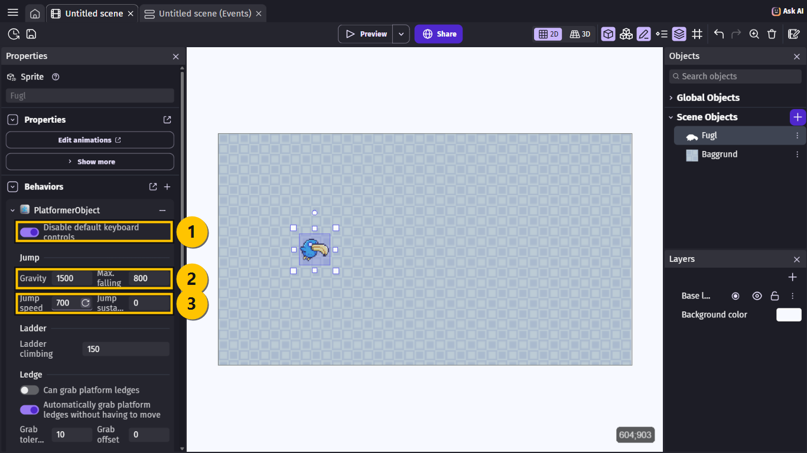

> **VIDEN**
>
> - **Disable default keyboard controls** slår piletasterne fra. Ellers kunne fuglen gå til
>   højre og venstre i luften.
> - **Gravity** er tyngdekraften. **Max. falling speed** er, hvor hurtigt fuglen højst kan
>   falde.
> - **Jump speed** er, hvor kraftigt fuglen flyver op ved hvert vingeslag.
> - **Jump sustain time** er, hvor længe et hop bliver ved, hvis man holder tasten nede. Vi
>   sætter den til `0`, så hvert tryk er ét vingeslag.
{: .lesson-info}

> **GØR DETTE**
>
> Tryk **Preview**. Fuglen falder ud af skærmen. Det skal den — vi har ikke lært den at
> flyve endnu. Luk preview-vinduet igen.
{: .lesson-action}

## Opgave 2 – FLYV: Basker med mellemrumstasten

> **GØR DETTE**
>
> 1. Gå til fanen **Untitled scene (Events)**.
> 2. Vælg **+ Add a new event** under dit første event.
> 3. Vælg **+ Add condition** **(1)** i det nye event.
{: .lesson-action}

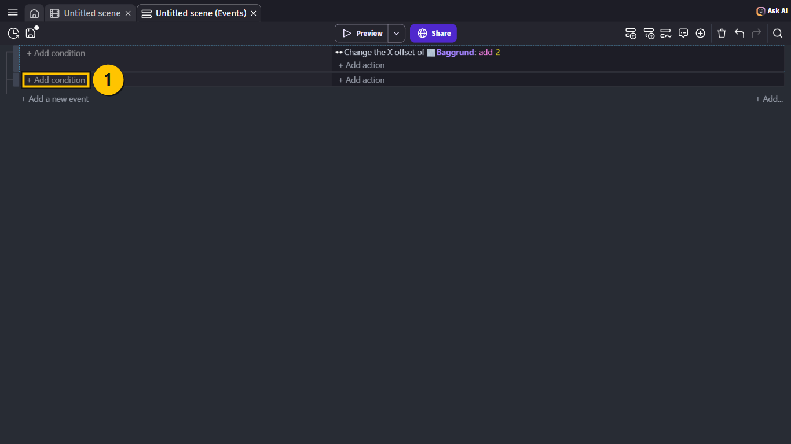

> **GØR DETTE**
>
> 1. Skriv `key just pressed` i søgefeltet **(1)**.
> 2. Vælg **Key just pressed** **(2)**.
{: .lesson-action}

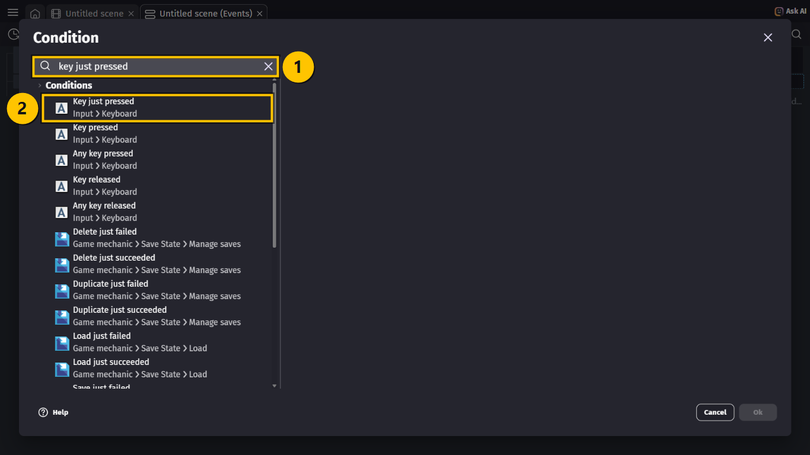

> **GØR DETTE**
>
> 1. Skriv `Space` i feltet **Key to check** **(1)**, og vælg **Space** på listen.
> 2. Vælg **Ok** **(2)**.
{: .lesson-action}

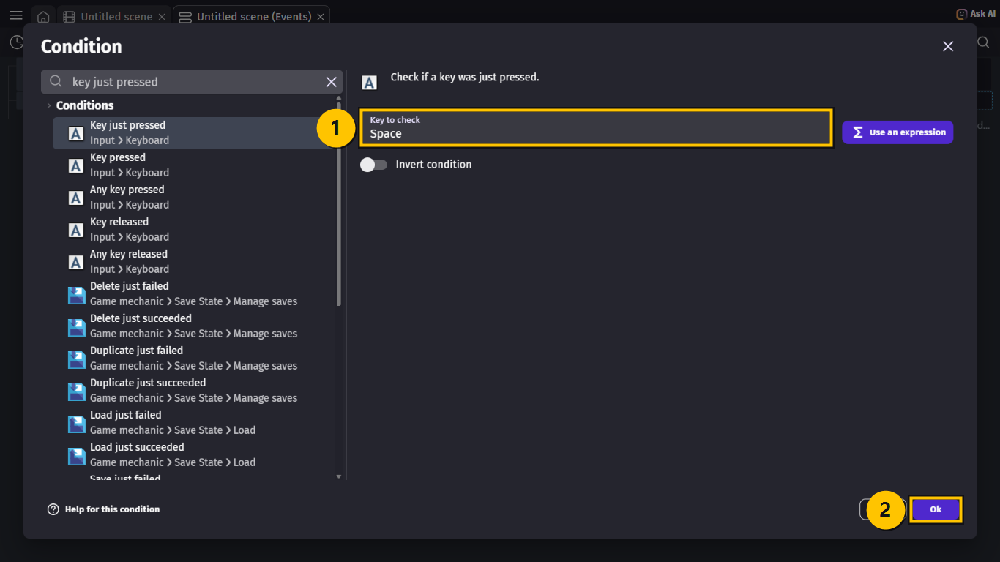

> **VIDEN**
>
> **Key just pressed** er kun sand i det øjeblik, du trykker tasten ned. Holder du tasten
> nede, sker der ikke mere. Så skal du trykke igen for at baske igen — præcis som det skal
> være.
{: .lesson-info}

> **GØR DETTE**
>
> 1. Vælg **+ Add action** i det nye event.
> 2. Vælg `Fugl` **(1)**.
> 3. Skriv `jump` i søgefeltet **(2)**.
> 4. Vælg **Allow jumping again** **(3)**, og vælg **Ok**.
{: .lesson-action}

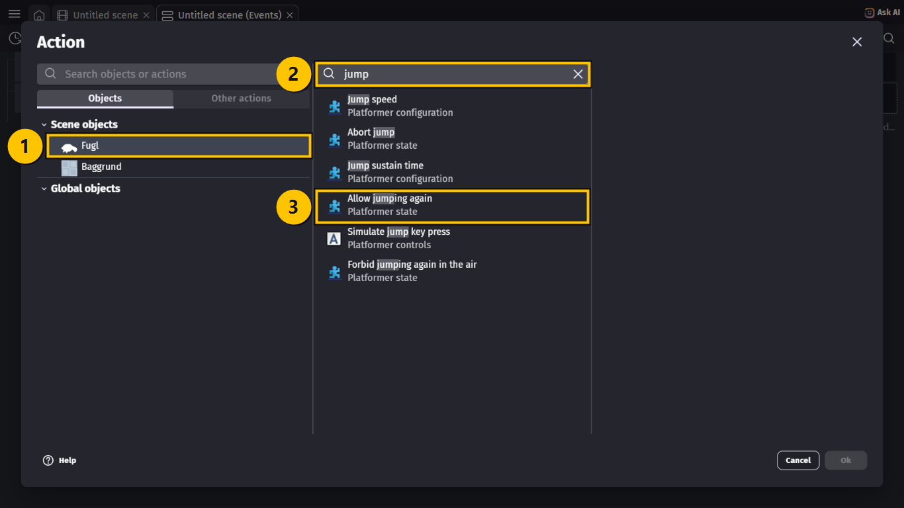

> **GØR DETTE**
>
> 1. Vælg **+ Add action** igen, og vælg `Fugl`.
> 2. Skriv `jump`, og vælg **Simulate jump key press** **(1)**.
> 3. Vælg **Ok** **(2)**.
{: .lesson-action}

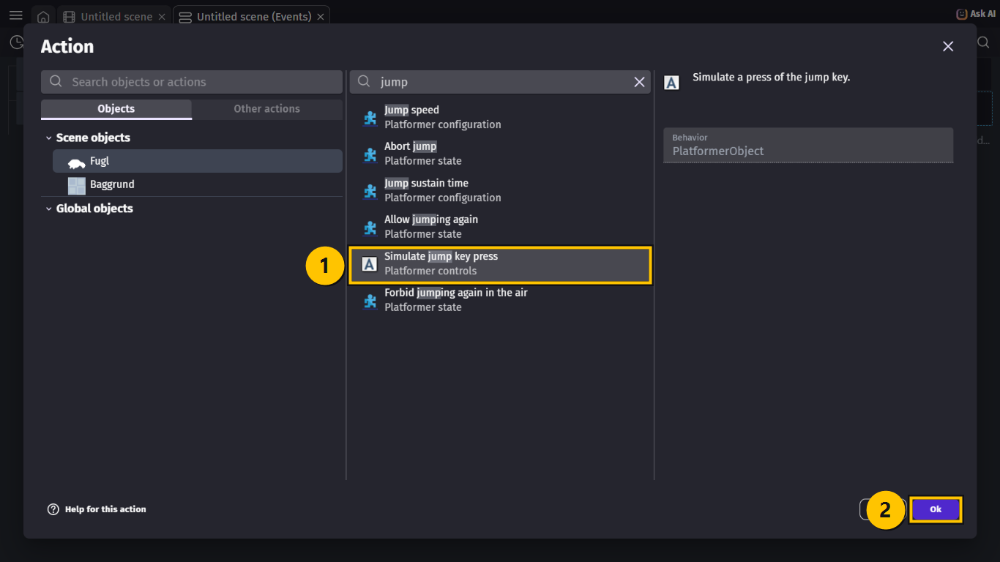

> **VIDEN**
>
> Nu har dit event to actions **(1)**:
>
> - **Allow jumping again** — normalt kan en platformfigur kun hoppe, når den står på
>   jorden. Den her action giver fuglen lov til at hoppe igen, selv om den er i luften.
> - **Simulate jump key press** — lader som om, der bliver trykket på hop-tasten. Så hopper
>   fuglen.
{: .lesson-info}

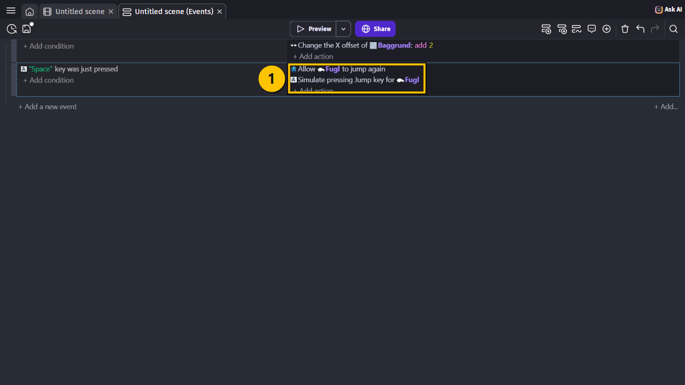

## Opgave 3 – FLYV: Basker med musen og på mobilen

> **VIDEN**
>
> Til sidst i kurset lægger du spillet på nettet, så man kan spille det på en mobil. Der er
> ingen mellemrumstast — så fuglen skal også kunne baske, når man klikker med musen eller
> trykker på skærmen.
{: .lesson-info}

> **GØR DETTE**
>
> 1. Vælg **+ Add a new event**, og vælg **+ Add condition**.
> 2. Skriv `mouse button` i søgefeltet.
> 3. Vælg **Mouse button pressed or touch held** **(1)**.
> 4. Vælg **Left (primary)** i **Button to check** **(2)**.
> 5. Vælg **Ok**.
{: .lesson-action}

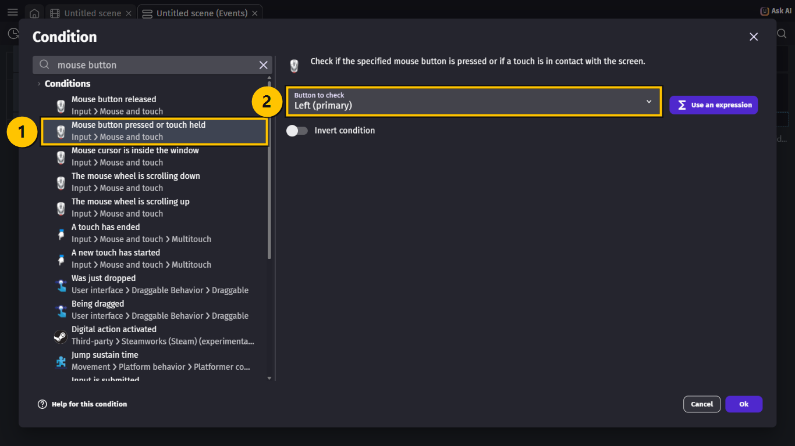

> **GØR DETTE**
>
> 1. Vælg **+ Add condition** i samme event igen.
> 2. Skriv `trigger once` i søgefeltet.
> 3. Vælg **Trigger once while true** **(1)**, og vælg **Ok**.
{: .lesson-action}

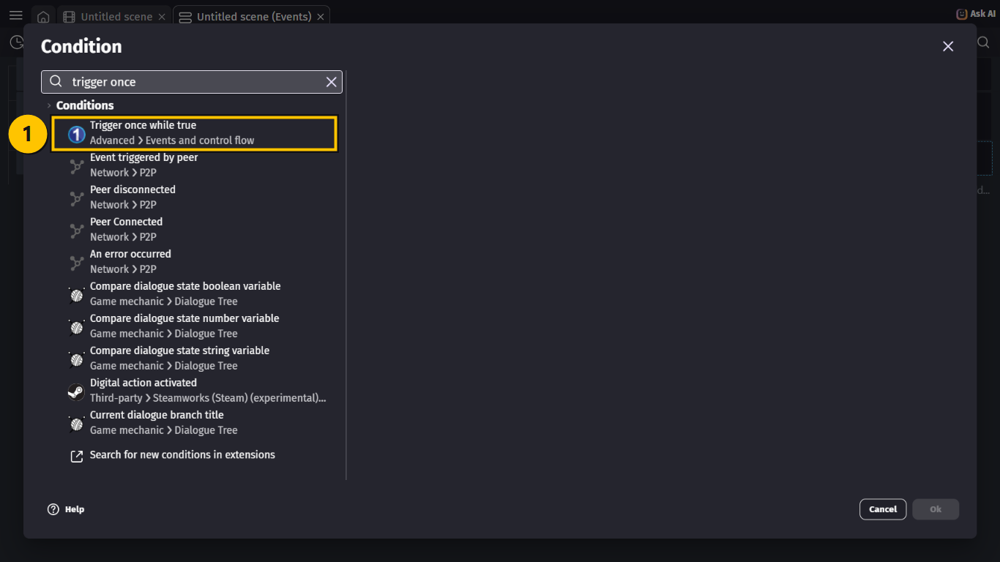

> **VIDEN**
>
> **Mouse button pressed or touch held** er sand, så længe du holder knappen nede — det
> kan være mange gange i sekundet. **Trigger once** sørger for, at eventet kun sker én gang
> pr. klik.
{: .lesson-info}

> **GØR DETTE**
>
> Giv eventet de samme to actions som i opgave 2 **(1)**:
>
> 1. `Fugl` → **Allow jumping again**
> 2. `Fugl` → **Simulate jump key press**
{: .lesson-action}

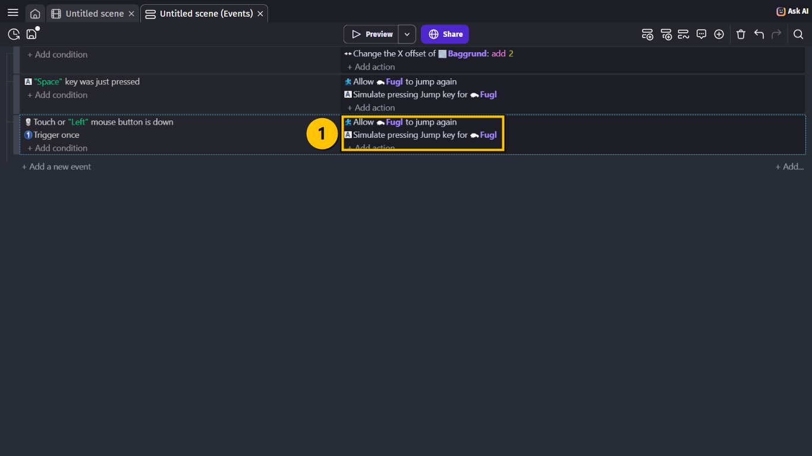

## Opgave 4 – FLYV: Få fuglen til at vippe

> **VIDEN**
>
> En rigtig fugl kigger op, når den flyver op, og dykker, når den falder. Det klarer vi med
> to events: et for når fuglen hopper, og et for når den falder.
{: .lesson-info}

> **GØR DETTE**
>
> 1. Vælg **+ Add a new event**, og vælg **+ Add condition**.
> 2. Vælg `Fugl`, og skriv `jumping` i søgefeltet.
> 3. Vælg **Is jumping** **(1)**, og vælg **Ok**.
{: .lesson-action}

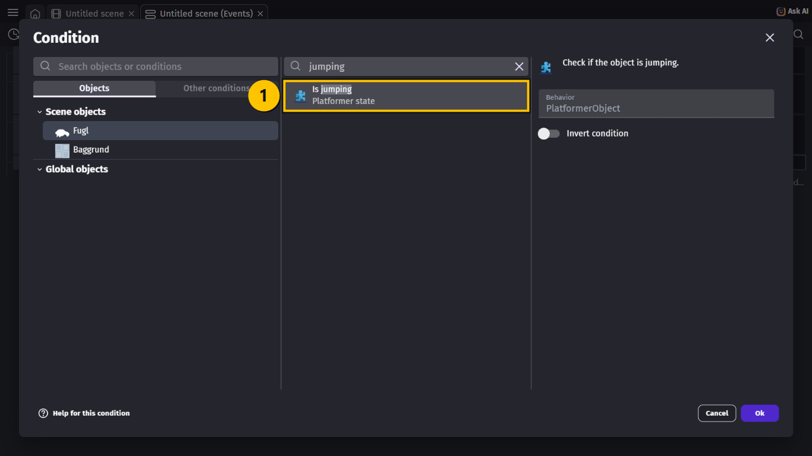

> **GØR DETTE**
>
> 1. Vælg **+ Add action**, og vælg `Fugl`.
> 2. Skriv `angle`, og vælg **Angle** **(1)**.
> 3. Lad **Modification's sign** stå på **= (set to)**, og skriv `-20` i **Angle** **(2)**.
> 4. Vælg **Ok**.
{: .lesson-action}

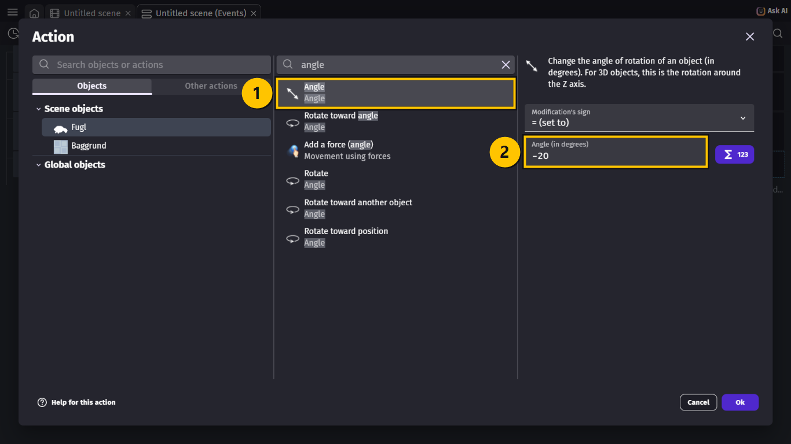

> **GØR DETTE**
>
> 1. Lav et nyt event med condition `Fugl` → **Is falling**.
> 2. Vælg **+ Add action**, vælg `Fugl`, og skriv `angle`.
> 3. Vælg **Rotate toward angle** **(1)**.
> 4. Skriv `50` i **Angle to rotate towards** **(2)** og `200` i **Angular speed** **(3)**.
> 5. Vælg **Ok**.
{: .lesson-action}

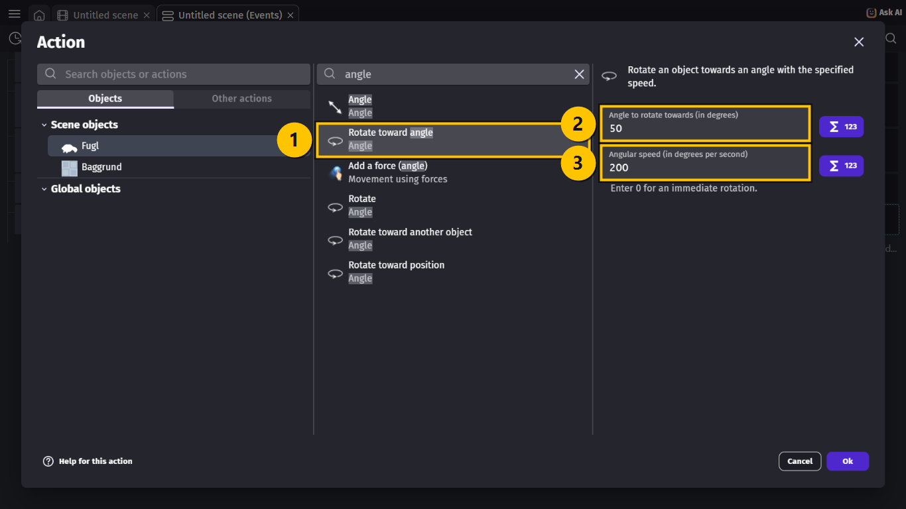

> **VIDEN**
>
> - **Angle** er, hvor meget fuglen er drejet. `0` er lige, et minus-tal er næbbet op, og et
>   plus-tal er næbbet ned.
> - Når fuglen hopper, drejer den med det samme op til `-20`.
> - Når den falder, drejer den langsomt ned mod `50` — med `200` grader i sekundet. Så ser
>   det ud, som om den dykker.
{: .lesson-info}

## Opgave 5 – FLYV: Hold fuglen på skærmen

> **VIDEN**
>
> Hvis du basker mange gange, flyver fuglen op over skærmen. Og hvis du ikke basker,
> falder den ud forneden. Det klarer vi med to events, som tjekker fuglens **Y**.
{: .lesson-info}

> **GØR DETTE**
>
> 1. Vælg **+ Add a new event**, og vælg **+ Add condition**.
> 2. Vælg `Fugl`, og skriv `Y position`.
> 3. Vælg **Y position** **(1)**.
> 4. Vælg **< (less than)** i **Sign of the test** **(2)**, og skriv `0` i **Value to
>    compare** **(3)**.
> 5. Vælg **Ok**.
{: .lesson-action}

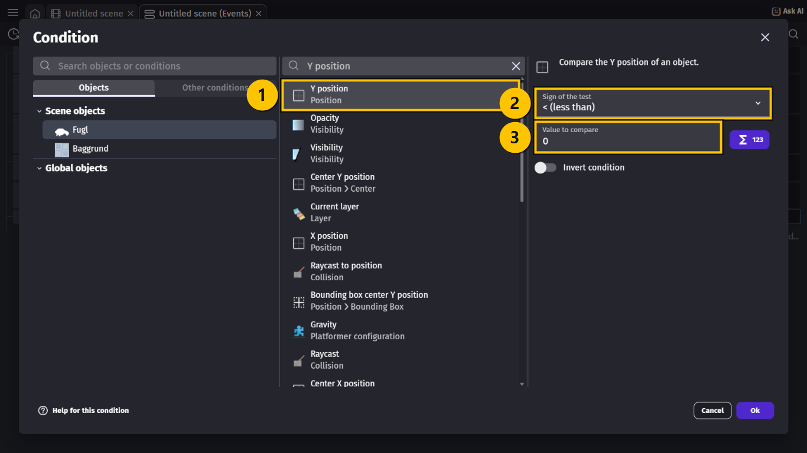

> **GØR DETTE**
>
> 1. Vælg **+ Add action**, vælg `Fugl`, og skriv `Y position`.
> 2. Vælg **Y position** **(1)**.
> 3. Lad **Modification's sign** stå på **= (set to)**, og skriv `0` i **Value** **(2)**.
> 4. Vælg **Ok**.
{: .lesson-action}

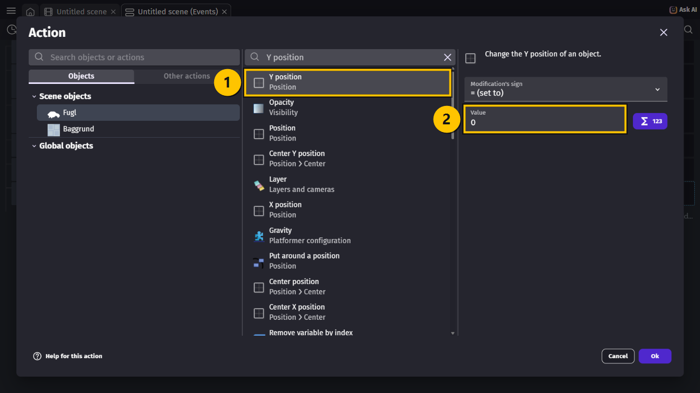

> **GØR DETTE**
>
> Lav et event mere på samme måde:
>
> - Condition: `Fugl` → **Y position** **> (greater than)** `720`
> - Action: `Fugl` → **Y position** **= (set to)** `300`
{: .lesson-action}

> **VIDEN**
>
> - `Y` er `0` øverst på skærmen og `720` nederst.
> - Er fuglen over toppen, sætter vi den tilbage til `0`. Så kan den ikke flyve væk.
> - Falder fuglen ud forneden, starter den forfra på midten. Det er kun for nu — i lektion
>   4 bliver det **Game Over**.
{: .lesson-info}

## Hele koden samlet

> **VIDEN**
>
> Sådan ser din Events-side ud, når du er færdig:
>
> | # | Conditions (HVIS) | Actions (SÅ) |
> |---|---|---|
> | 1 | *(ingen — sker hele tiden)* | Change the X offset of `Baggrund`: **add 2** |
> | 2 | `"Space"` key was just pressed | Allow `Fugl` to jump again Simulate pressing Jump key for `Fugl` |
> | 3 | Touch or `"Left"` mouse button is down Trigger once | Allow `Fugl` to jump again Simulate pressing Jump key for `Fugl` |
> | 4 | `Fugl` is jumping | Change the angle of `Fugl`: **set to** `-20` |
> | 5 | `Fugl` is falling | Rotate `Fugl` towards `50` at speed `200` deg/second |
> | 6 | The Y position of `Fugl` **<** `0` | Change the Y position of `Fugl`: **set to** `0` |
> | 7 | The Y position of `Fugl` **>** `720` | Change the Y position of `Fugl`: **set to** `300` |
{: .lesson-info}

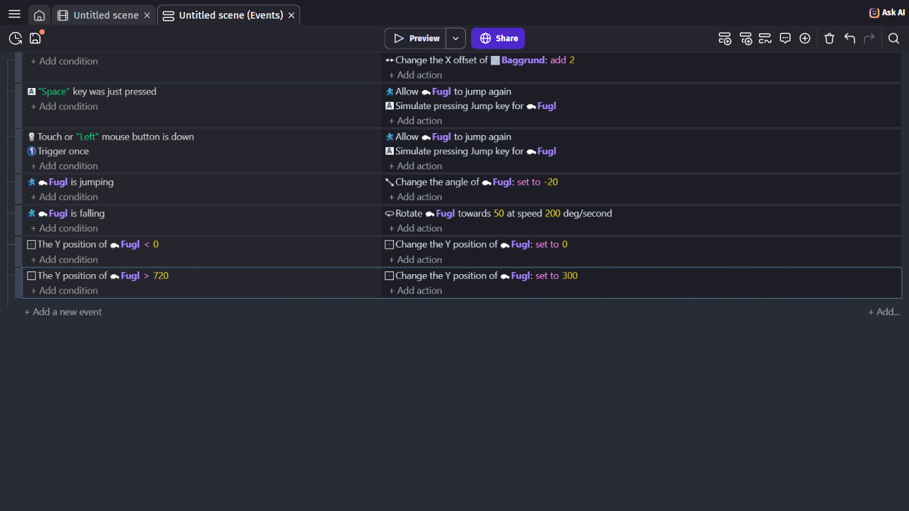

## Prøv spillet! 🎮

> **GØR DETTE**
>
> 1. Tryk **Ctrl + S** for at gemme.
> 2. Vælg **Preview**.
> 3. Hold fuglen i luften med **mellemrumstasten**.
> 4. Prøv også at klikke med **musen**.
{: .lesson-action}

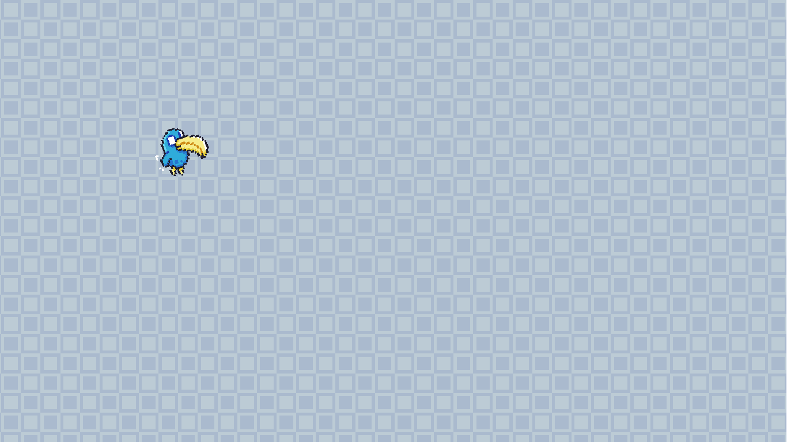

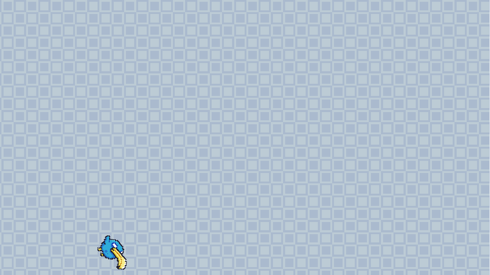

> **VIDEN**
>
> Sådan skal det virke:
>
> - Fuglen falder, hvis du ikke gør noget.
> - Hvert tryk giver ét vingeslag op — også hvis du holder tasten eller knappen nede.
> - Fuglen kigger op, når den flyver op, og dykker, når den falder.
> - Fuglen kan ikke flyve op over skærmen.
> - Falder fuglen ud forneden, kommer den tilbage på midten.
>
> Det kræver lidt øvelse at holde fuglen i luften. Prøv at trykke i en rolig rytme — cirka
> to gange i sekundet.
{: .lesson-info}

## Ekstra: Din egen fugl

> **GØR DETTE**
>
> Prøv at skifte tallene under **PlatformerObject** ud:
>
> - Sæt **Gravity** til `800`. Hvordan føles det?
> - Sæt **Jump speed** til `1000`. Hvad sker der?
{: .lesson-action}

> **VIDEN**
>
> Lav tyngdekraft gør spillet nemmere og roligere, ligesom på månen. Høj tyngdekraft gør
> det hurtigt og svært. Find de tal, du synes er sjovest — men husk dem, for i næste
> lektion skal fuglen igennem hullerne mellem søjlerne.
{: .lesson-info}

## Du er færdig med FLYV! ✅

> **VIDEN**
>
> Du er klar til næste lektion, når alt dette passer:
>
> - `Fugl` har behavioren **PlatformerObject**, og tastaturet er slået fra.
> - Fuglen falder, og den basker op med mellemrumstasten og musen.
> - Fuglen vipper op og ned.
> - Fuglen bliver på skærmen.
> - Jeg har gemt projektet.
{: .lesson-info}

> **VIDEN**
>
> Næste gang kommer der søjler, som fuglen skal flyve igennem.
{: .lesson-info}

## Hvis noget går galt

| Problem | Prøv dette |
|---|---|
| Fuglen går til siden med piletasterne. | **GØR DETTE:** Slå **Disable default keyboard controls** til under **PlatformerObject**. |
| Fuglen hopper ikke, når jeg trykker. | **GØR DETTE:** Tjek, at begge actions er der: **Allow jumping again** og **Simulate jump key press**. |
| Fuglen hopper kun én gang. | **GØR DETTE:** Du mangler **Allow jumping again**. Uden den kan fuglen kun hoppe fra jorden — og der er ingen jord. |
| Fuglen bliver ved med at flyve op, når jeg holder tasten nede. | **GØR DETTE:** Sæt **Jump sustain time** til `0`. |
| Musen virker ikke. | **GØR DETTE:** Tjek, at der står **Left** i eventet med musen. |
| Fuglen flyver helt op, når jeg holder musen nede. | **GØR DETTE:** Du mangler **Trigger once** i eventet med musen. |
| Fuglen drejer den forkerte vej. | **GØR DETTE:** Tjek fortegnene: `-20`, når den hopper, og `50`, når den falder. |
| Fuglen drejer rundt og rundt. | **GØR DETTE:** Brug **Rotate toward angle**, ikke **Rotate**, i eventet med **Is falling**. |
| Fuglen er svær at holde i luften. | **GØR DETTE:** Prøv en lavere **Gravity**, fx `1200`. |
{: .lesson-help}
