# OPGAVER TIL GDevelop – FLYVESPIL – STOLPER

> **VIDEN**
>
> I bokse med en hel kant står der, hvad du skal gøre. I bokse med en stiplet kant står der
> viden, som hjælper dig med at forstå det, du laver.
>
> På billederne viser gule kasser, hvor du skal klikke. Tallene i gule cirkler passer til
> tallene i trinene, fx **(1)** og **(2)**.
{: .lesson-info}

I denne lektion kommer der stolper ind fra højre — en oppe og en nede, med et hul imellem.
Hullet er et nyt sted hver gang, så du aldrig ved, hvor det kommer.

## Tre ord du skal kende

> **VIDEN**
>
> - **Panel Sprite** — et billede med kanter, der kan strækkes til alle størrelser, uden at
>   kanterne bliver mærkelige. Vores stolpe har græs på toppen, uanset hvor høj den er.
> - **Timer** — et stopur i spillet. Vi bruger det til at lave nye stolper med faste
>   mellemrum.
> - **Tilfældigt tal** — et tal, computeren finder på. `RandomInRange(330, 600)` giver et
>   tal mellem 330 og 600, og det er et nyt tal hver gang.
{: .lesson-info}

## Opgave 1 – STOLPER: Hent stolpen

> **GØR DETTE**
>
> 1. Gå til fanen **Untitled scene**.
> 2. Vælg **+ Add object**, og find pakken **Pixel Adventure** igen — søg efter
>    `pixel adventure`, ligesom i lektion 1.
> 3. Vælg mappen **Terrain** **(1)**.
{: .lesson-action}

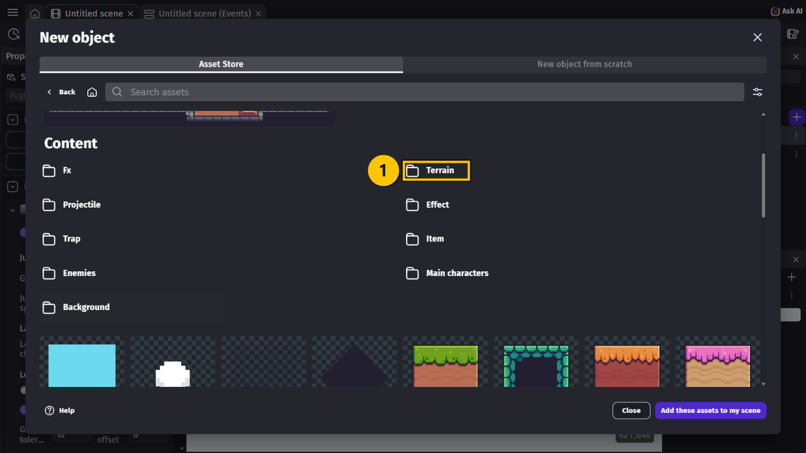

> **GØR DETTE**
>
> Vælg **Green Grass 9Patch** **(1)**.
{: .lesson-action}

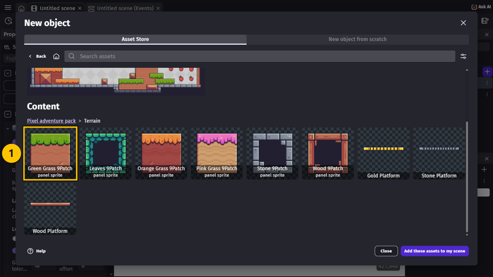

> **GØR DETTE**
>
> 1. Vælg **Add to the scene** **(1)**.
> 2. Vælg **Close**.
{: .lesson-action}

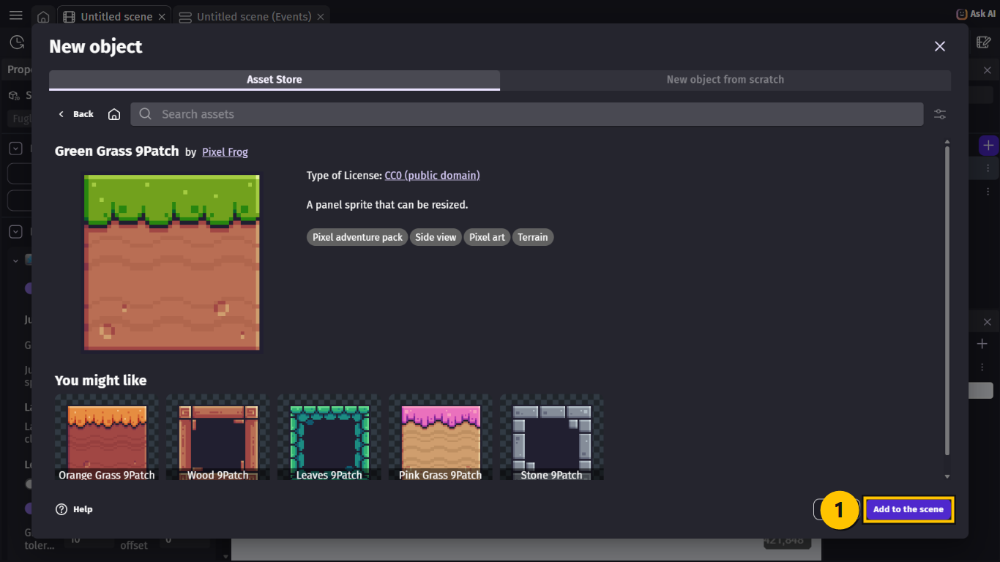

> **GØR DETTE**
>
> Nu står `Green_Grass_9Patch` i listen **(1)**. Giv den navnet `Stolpe`.
{: .lesson-action}

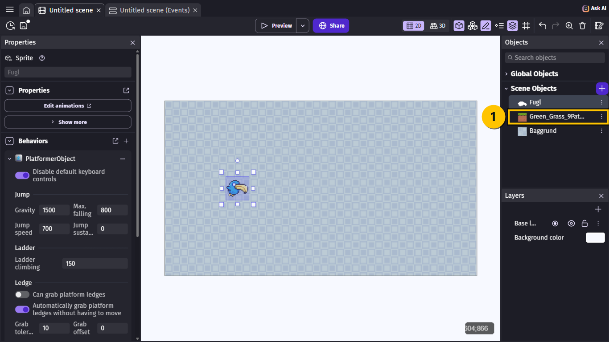

> **VIDEN**
>
> Navnet er `Stolpe` og ikke `Søjle`. Brug ikke **æ**, **ø** og **å** i navne på objekter —
> så kan GDevelop drille.
{: .lesson-info}

> **GØR DETTE**
>
> 1. Vælg `Stolpe` **(1)** i listen.
> 2. Find **Default size** til venstre. Skriv `96` i **Width** og `720` i **Height**
>    **(2)**.
{: .lesson-action}

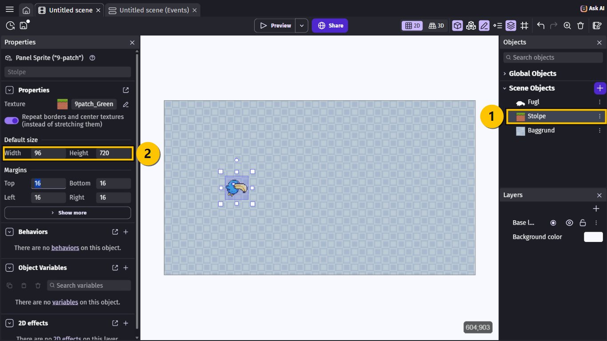

> **VIDEN**
>
> **Default size** er den størrelse, en stolpe får, når den bliver lavet. 720 er lige så
> høj som skærmen, så stolpen når altid helt ud til kanten.
>
> Vi trækker **ikke** en stolpe ind på scenen. Alle stolper bliver lavet af events, mens
> spillet kører.
{: .lesson-info}

## Opgave 2 – STOLPER: Start et stopur

> **GØR DETTE**
>
> 1. Gå til fanen **Untitled scene (Events)**.
> 2. Vælg **+ Add a new event** nederst, og vælg **+ Add condition**.
> 3. Skriv `beginning`, og vælg **At the beginning of the scene** **(1)**.
> 4. Vælg **Ok**.
{: .lesson-action}

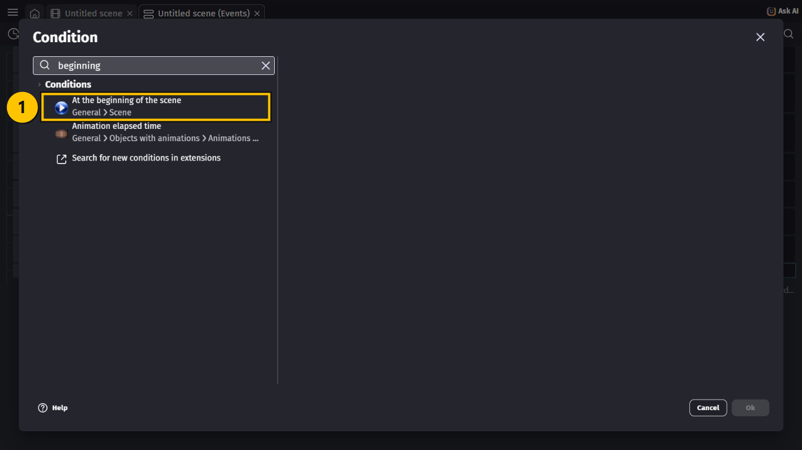

> **GØR DETTE**
>
> 1. Vælg **+ Add action** i det nye event.
> 2. Skriv `timer`, og vælg **Start (or reset) a scene timer** **(1)**.
> 3. Skriv `"stolpe"` i **Timer's name** **(2)** — med anførselstegn.
> 4. Vælg **Ok**.
{: .lesson-action}

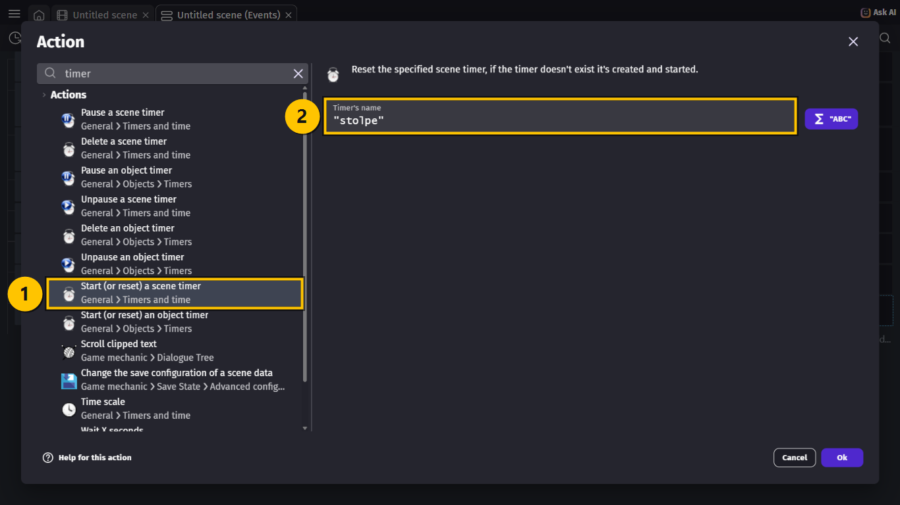

> **VIDEN**
>
> **At the beginning of the scene** sker kun én gang: lige når spillet starter. Så starter
> stopuret `"stolpe"`. Navnet skal stå i anførselstegn, fordi det er tekst.
{: .lesson-info}

## Opgave 3 – STOLPER: Lav to stolper med et hul imellem

> **GØR DETTE**
>
> 1. Vælg **+ Add a new event**, og vælg **+ Add condition**.
> 2. Skriv `timer`, og vælg **Value of a scene timer** **(1)**.
> 3. Vælg `"stolpe"` i **Timer's name** **(2)**.
> 4. Vælg **> (greater than)** **(3)**, og skriv `1.6` i **Time in seconds** **(4)**.
> 5. Vælg **Ok**.
{: .lesson-action}

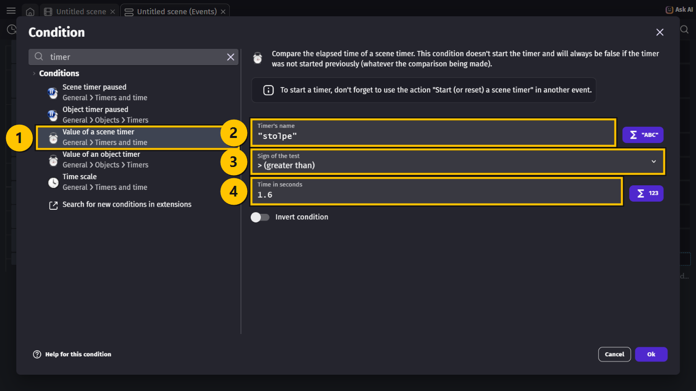

> **GØR DETTE**
>
> 1. Vælg **+ Add action**, skriv `create an object`, og vælg **Create an object**.
> 2. Vælg `Stolpe` i **Object to create** **(1)**.
> 3. Skriv `1300` i **X position** **(2)**.
> 4. Skriv `RandomInRange(330, 600)` i **Y position** **(3)**.
> 5. Vælg **Ok**.
{: .lesson-action}

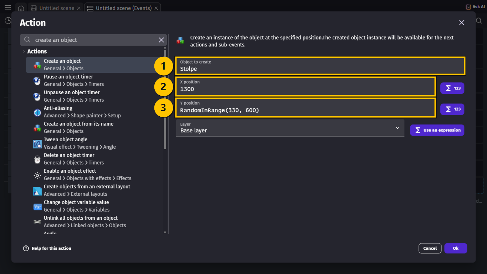

> **VIDEN**
>
> Det er den **nederste** stolpe. Den starter lige uden for skærmen til højre (`1300`), og
> dens top er et tilfældigt sted mellem `330` og `600`.
{: .lesson-info}

> **GØR DETTE**
>
> Lav en action mere, præcis som før:
>
> 1. **Create an object** med `Stolpe` og **X position** `1300`.
> 2. Skriv `Stolpe.Y() - 960` i **Y position** **(1)**.
> 3. Vælg **Ok**.
{: .lesson-action}

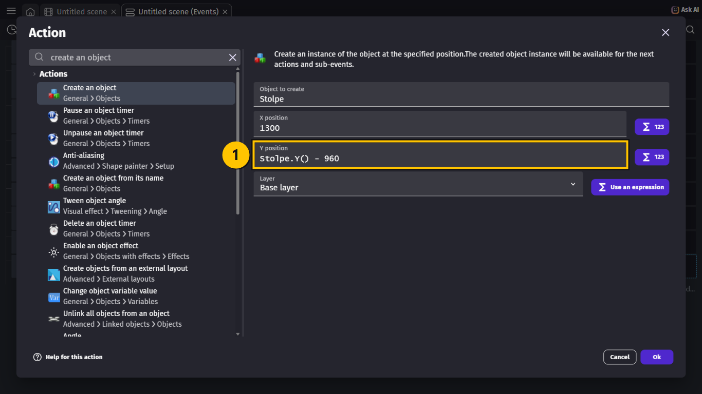

> **VIDEN**
>
> Det er den **øverste** stolpe. `Stolpe.Y()` er Y for den stolpe, vi lige har lavet — den
> nederste. Vi trækker `960` fra:
>
> - `720` er højden på en stolpe.
> - `240` er hullet imellem dem.
>
> Så kommer der altid et hul på 240 pixels, lige meget hvor den nederste stolpe er.
{: .lesson-info}

> **GØR DETTE**
>
> Giv eventet en sidste action: **Start (or reset) a scene timer** med `"stolpe"`.
{: .lesson-action}

> **VIDEN**
>
> Når stopuret har kørt i 1,6 sekunder, laver eventet to stolper og starter stopuret
> forfra. Så kommer der et nyt par stolper hvert 1,6 sekund.
{: .lesson-info}

## Opgave 4 – STOLPER: Få stolperne til at flyve forbi

> **GØR DETTE**
>
> 1. Vælg **+ Add a new event**. Lad det være **uden** condition.
> 2. Vælg **+ Add action**, og vælg `Stolpe` **(1)**.
> 3. Skriv `force`, og vælg **Add a force** **(2)**.
> 4. Skriv `-200` i **Speed on X axis** og `0` i **Speed on Y axis** **(3)**.
> 5. Lad **Instant** **(4)** være valgt, og vælg **Ok**.
{: .lesson-action}

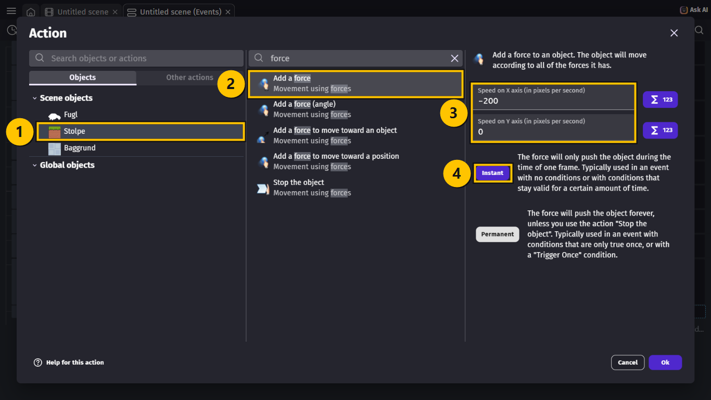

> **VIDEN**
>
> - En **force** (kraft) skubber et objekt. `-200` på X skubber mod venstre med 200 pixels
>   i sekundet.
> - **Instant** betyder, at kraften kun skubber i ét billede. Men eventet har ingen
>   condition, så det sker i **hvert** billede — og så bliver stolperne ved med at flyve.
> - Kraften virker på **alle** stolper på én gang, også dem, der kommer senere.
{: .lesson-info}

## Opgave 5 – STOLPER: Slet de gamle stolper

> **VIDEN**
>
> Stolperne flyver ud til venstre og bliver ved — også når man ikke kan se dem. Efter lang
> tid er der tusindvis af dem, og så bliver spillet langsomt. Derfor sletter vi dem, når de
> er ude af skærmen.
{: .lesson-info}

> **GØR DETTE**
>
> 1. Vælg **+ Add a new event**, og vælg **+ Add condition**.
> 2. Vælg `Stolpe`, skriv `X position`, og vælg **X position** **(1)**.
> 3. Vælg **< (less than)** **(2)**, og skriv `-150` **(3)**.
> 4. Vælg **Ok**.
{: .lesson-action}

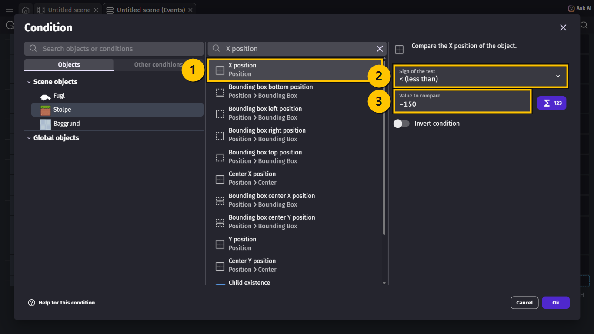

> **GØR DETTE**
>
> 1. Vælg **+ Add action**, og vælg `Stolpe`.
> 2. Skriv `delete`, og vælg **Delete the object** **(1)**.
> 3. Vælg **Ok**.
{: .lesson-action}

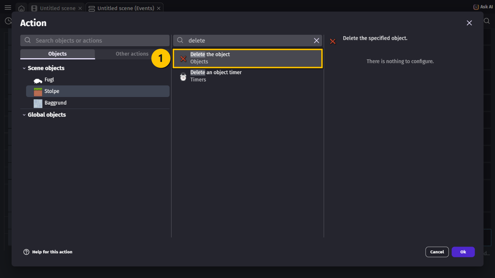

## Hele koden samlet

> **VIDEN**
>
> Event 1–7 er de samme som i sidste lektion. Disse er nye:
>
> | # | Conditions (HVIS) | Actions (SÅ) |
> |---|---|---|
> | 8 | **At the beginning of the scene** | Start (or reset) the timer `"stolpe"` |
> | 9 | The timer `"stolpe"` **>** `1.6` seconds | Create object `Stolpe` at position `1300`; `RandomInRange(330, 600)` Create object `Stolpe` at position `1300`; `Stolpe.Y() - 960` Start (or reset) the timer `"stolpe"` |
> | 10 | *(ingen — sker hele tiden)* | Add to `Stolpe` an **instant** force of `-200` p/s on X axis and `0` p/s on Y axis |
> | 11 | The X position of `Stolpe` **<** `-150` | Delete `Stolpe` |
{: .lesson-info}

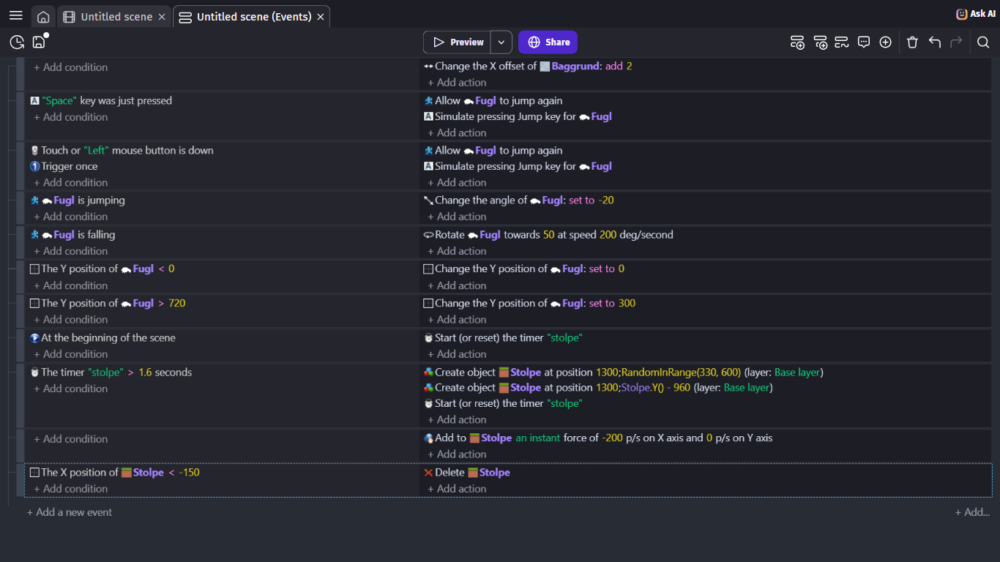

## Prøv spillet! 🎮

> **GØR DETTE**
>
> 1. Tryk **Ctrl + S** for at gemme.
> 2. Vælg **Preview**.
> 3. Prøv at flyve gennem hullerne.
{: .lesson-action}

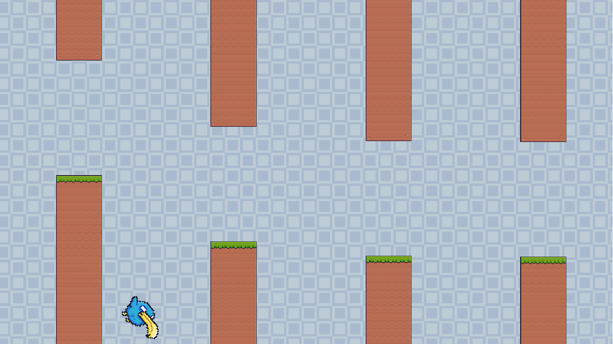

> **VIDEN**
>
> Sådan skal det virke:
>
> - Hvert 1,6 sekund kommer der to stolper ind fra højre — en oppe og en nede.
> - Hullet imellem dem er et nyt sted hver gang.
> - Stolperne flyver mod venstre og forsvinder ud af skærmen.
>
> Lige nu flyver fuglen **igennem** stolperne, hvis den rammer dem. Det laver vi om i næste
> lektion.
{: .lesson-info}

## Ekstra: Sværere eller nemmere

> **GØR DETTE**
>
> Prøv at lave hullet mindre: skift `960` ud med `920`. Så er hullet kun 200 pixels.
>
> Prøv også at skifte `1.6` ud med `1.2`. Hvad sker der?
{: .lesson-action}

> **VIDEN**
>
> - Hullet er `960 - 720`. Et mindre tal end `960` giver et mindre hul.
> - En kortere tid giver flere stolper, tættere på hinanden.
{: .lesson-info}

## Du er færdig med STOLPER ✅

> **VIDEN**
>
> Du er klar til næste lektion, når alt dette passer:
>
> - Jeg har objektet `Stolpe` med **Default size** 96 × 720.
> - Der kommer to stolper med et hul imellem hvert 1,6 sekund.
> - Hullet er et nyt sted hver gang.
> - Stolperne flyver mod venstre og bliver slettet.
> - Jeg har gemt projektet.
{: .lesson-info}

> **VIDEN**
>
> Næste gang får du point for hver stolpe, du kommer forbi — og spillet slutter, hvis du
> rammer en.
{: .lesson-info}

## Hvis noget går galt

| Problem | Prøv dette |
|---|---|
| Der kommer ingen stolper. | **GØR DETTE:** Tjek, at event 8 starter timeren `"stolpe"`, og at den er stavet ens i event 8 og 9. |
| Der kommer kun ét par stolper. | **GØR DETTE:** Du mangler **Start (or reset) the timer** `"stolpe"` sidst i event 9. |
| Stolperne er små firkanter. | **GØR DETTE:** Sæt **Default size** på `Stolpe` til `96` og `720`. |
| Begge stolper er nede. | **GØR DETTE:** Tjek, at der står `Stolpe.Y() - 960` i den anden **Create an object**. |
| Der er intet hul, eller hullet er kæmpestort. | **GØR DETTE:** Tjek tallet `960`. Det skal være højden (720) plus hullet (240). |
| Stolperne står stille. | **GØR DETTE:** Tjek event 10. Der skal stå `-200` på X, og eventet må ikke have nogen condition. |
| Stolperne flyver den forkerte vej. | **GØR DETTE:** Der skal stå **minus** `-200` på X. |
| Stolperne flyver hurtigere og hurtigere. | **GØR DETTE:** Vælg **Instant** og ikke **Permanent** i event 10. |
{: .lesson-help}
