# OPGAVER TIL GDevelop – FLYVESPIL – POINT OG GAME OVER

> **VIDEN**
>
> I bokse med en hel kant står der, hvad du skal gøre. I bokse med en stiplet kant står der
> viden, som hjælper dig med at forstå det, du laver.
>
> På billederne viser gule kasser, hvor du skal klikke. Tallene i gule cirkler passer til
> tallene i trinene, fx **(1)** og **(2)**.
{: .lesson-info}

I denne lektion bliver det et rigtigt spil. Du får et point for hver stolpe, du kommer
forbi. Rammer fuglen en stolpe eller falder ned, er det **Game Over** — og så kan du trykke
for at prøve igen.

Lektionen er lidt længere end de andre. Tag den i to omgange, hvis du har brug for det.

## Tre ord du skal kende

> **VIDEN**
>
> - **Variabel** — en lille kasse i spillet, der kan huske noget. `Point` husker, hvor
>   mange point du har.
> - **Boolean** — en variabel, der kun kan være **true** (sand) eller **false** (falsk),
>   ligesom en kontakt, der er tændt eller slukket.
> - **Objektvariabel** — en variabel, som **hver** stolpe har sin egen af. Så kan hver
>   stolpe huske, om den allerede har givet et point.
{: .lesson-info}

## Opgave 1 – POINT: Lav variablerne

> **GØR DETTE**
>
> 1. Gå til fanen **Untitled scene**.
> 2. Klik på et tomt sted uden for scenen, så der står **Untitled scene** øverst til venstre.
> 3. Vælg **+** ved **Scene Variables** **(1)**.
{: .lesson-action}

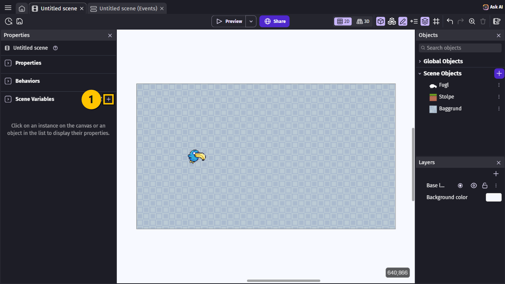

> **GØR DETTE**
>
> Lav to variabler **(1)**:
>
> 1. Den første hedder `Point`. Lad typen stå på **Number** og værdien på `0`.
> 2. Vælg **+** igen. Kald den nye `GameOver`, og vælg typen **Boolean**. Lad den stå på
>    **False**.
{: .lesson-action}

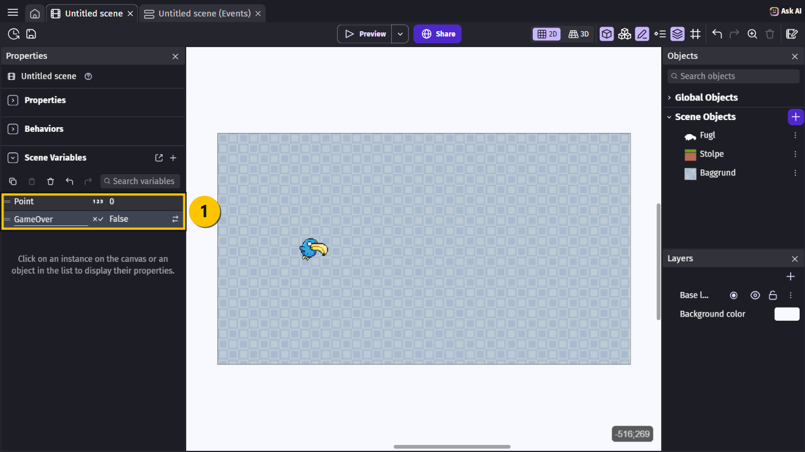

> **VIDEN**
>
> Du skifter typen ved at klikke på det lille ikon mellem navnet og værdien. **123** betyder
> tal, og **×✓** betyder boolean.
{: .lesson-info}

> **GØR DETTE**
>
> 1. Vælg `Stolpe` **(1)** i listen til højre.
> 2. Vælg **+** ved **Object Variables** **(2)**.
> 3. Kald variablen `Talt`, og vælg typen **Boolean** **(3)**. Lad den stå på **False**.
{: .lesson-action}

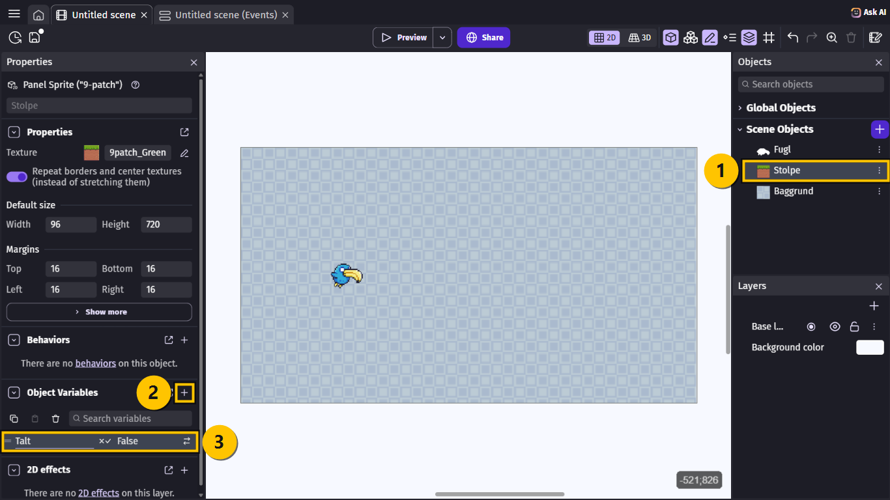

> **VIDEN**
>
> - `GameOver` bliver **true**, når fuglen rammer noget. Så ved alle events, at spillet er
>   slut.
> - `Talt` sidder på **hver eneste** stolpe. Den bliver **true**, når stolpen har givet et
>   point, så den ikke giver point igen og igen.
{: .lesson-info}

## Opgave 2 – POINT: Lav to tekster

> **GØR DETTE**
>
> 1. Vælg **+ Add object**.
> 2. Vælg fanen **New object from scratch** **(1)**.
{: .lesson-action}

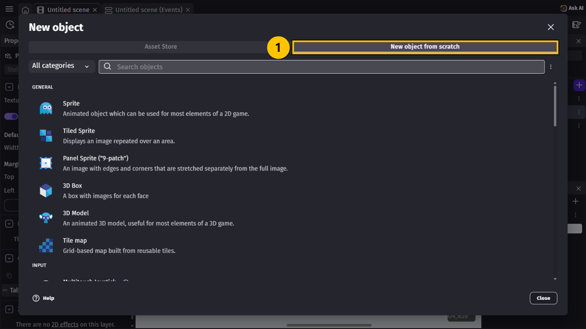

> **GØR DETTE**
>
> 1. Skriv `text` i søgefeltet **(1)**.
> 2. Vælg **Text** **(2)**.
{: .lesson-action}

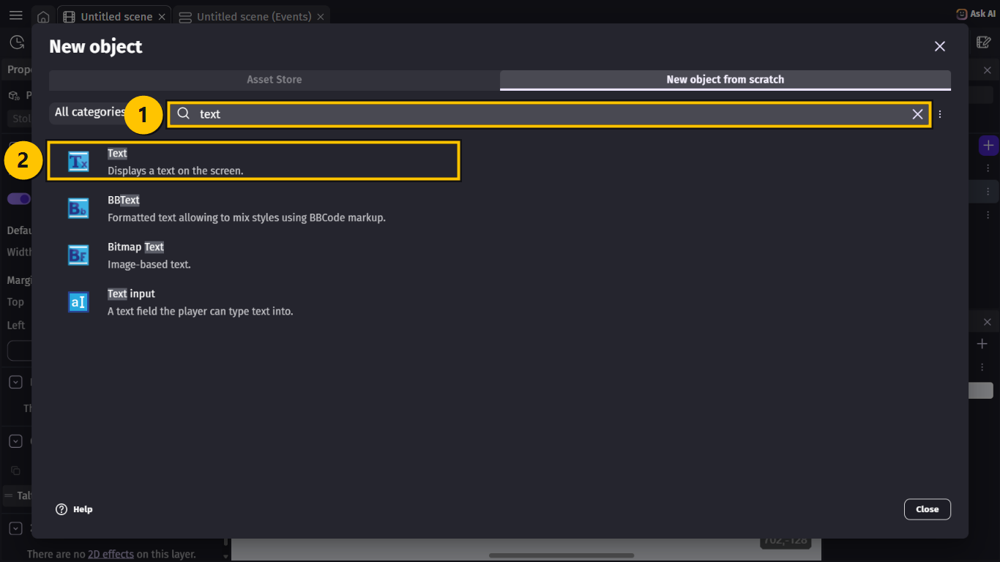

> **GØR DETTE**
>
> 1. Skriv `PointTekst` i **Object name** **(1)**.
> 2. Skriv `40` i **Size**, og sæt flueben ved **Bold** **(2)**.
> 3. Skriv `Point: 0` i **Initial text to display** **(3)**.
> 4. Sæt flueben ved **Enabled** under **Outline** **(4)**.
> 5. Vælg **Apply**.
{: .lesson-action}

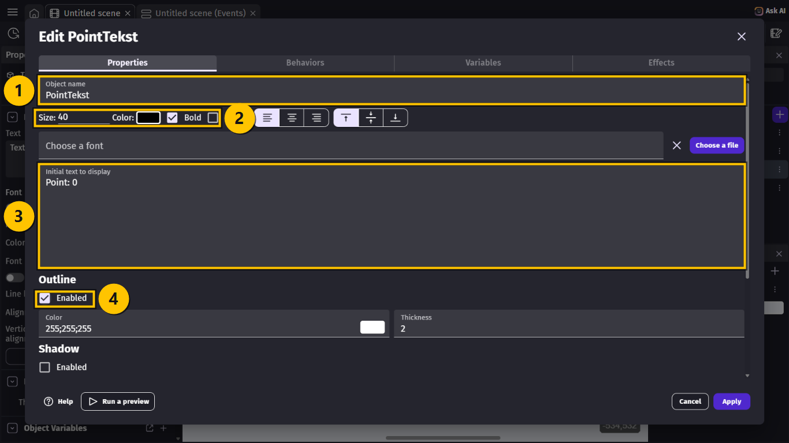

> **VIDEN**
>
> **Outline** giver teksten en hvid kant. Så kan du læse den, både når den er over himlen
> og over en stolpe.
{: .lesson-info}

> **GØR DETTE**
>
> Lav en tekst mere på samme måde:
>
> 1. Kald den `GameOverTekst` **(1)**.
> 2. Skriv `56` i **Size**, sæt flueben ved **Bold**, og vælg den midterste knap for
>    **centreret** tekst **(2)**.
> 3. Skriv to linjer i **Initial text to display** **(3)**: `GAME OVER` og
>    `Tryk for at prøve igen`.
> 4. Sæt flueben ved **Enabled** under **Outline**, og vælg **Apply**.
{: .lesson-action}

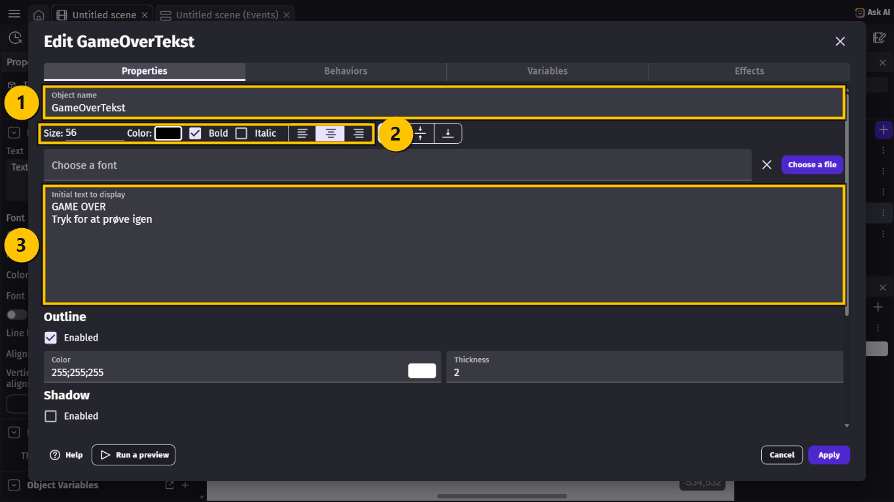

> **VIDEN**
>
> `GameOverTekst` skal **ikke** ind på scenen. Den bliver lavet af et event, når spillet er
> slut.
{: .lesson-info}

## Opgave 3 – POINT: Et lag til teksterne

> **VIDEN**
>
> Stolperne bliver lavet, mens spillet kører, og så kan de komme til at ligge **oven på**
> teksterne. Det klarer vi med et nyt **lag** (layer). Alt på et lag, der ligger øverst i
> listen, bliver tegnet oven på resten.
{: .lesson-info}

> **GØR DETTE**
>
> 1. Find **Layers** nederst til højre. Vælg **+** **(1)**.
> 2. Kald det nye lag `GUI` **(2)**, og tryk **Enter**.
{: .lesson-action}

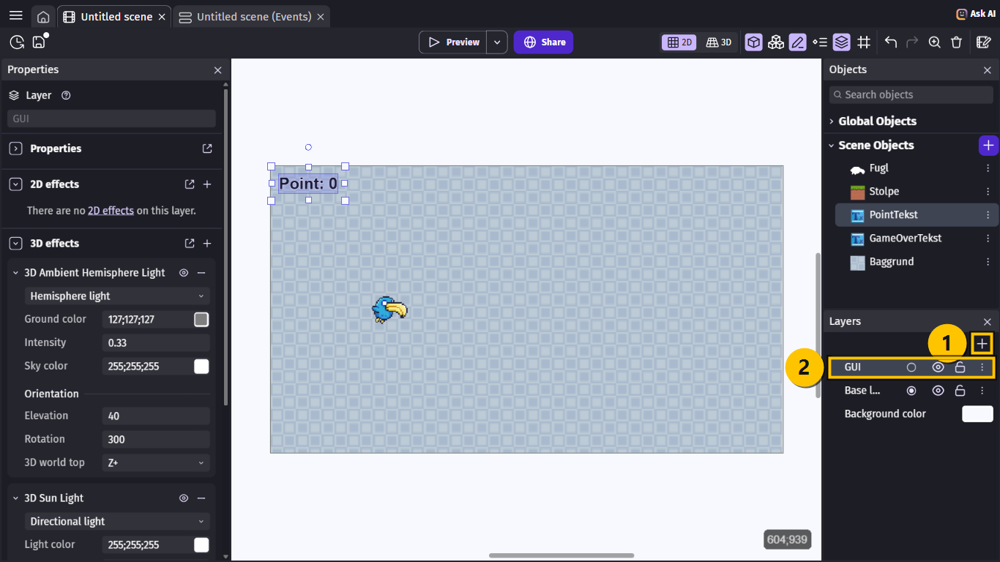

> **VIDEN**
>
> **GUI** står for *graphical user interface* — det er den del af skærmen, der viser point,
> knapper og tekster.
{: .lesson-info}

> **GØR DETTE**
>
> 1. Træk `PointTekst` ind i øverste venstre hjørne af scenen, og klik på den **(1)**.
> 2. Skriv `20` i både **X** og **Y** **(2)**.
> 3. Vælg `GUI` i feltet med lag **(3)**.
{: .lesson-action}

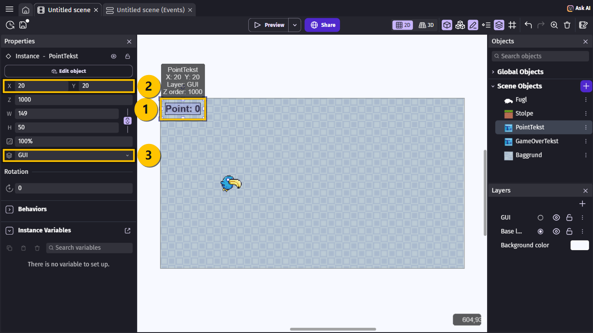

## Opgave 4 – GAME OVER: Stop baggrunden, og fang fuglen forneden

> **GØR DETTE**
>
> 1. Gå til fanen **Untitled scene (Events)**.
> 2. Vælg **+ Add condition** i **event 1** — det, der flytter baggrunden.
> 3. Skriv `variable value`, og vælg **Variable value**.
> 4. Vælg `GameOver` i **Variable** **(1)**, og vælg **False** **(2)**.
> 5. Vælg **Ok**.
{: .lesson-action}

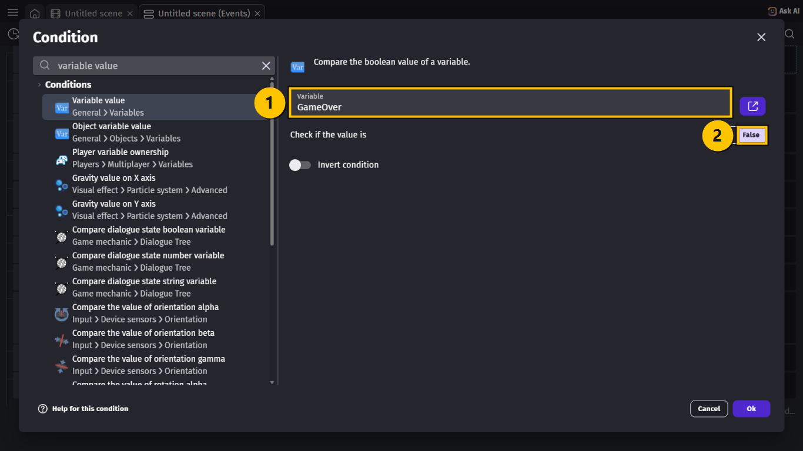

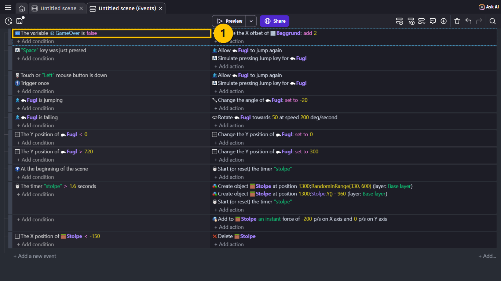

> **VIDEN**
>
> Nu glider baggrunden kun, så længe spillet ikke er slut **(1)**.
{: .lesson-info}

> **GØR DETTE**
>
> Find **event 7** — det med `Fugl` **Y position > 720**.
>
> 1. Klik på actionen **Change the Y position of Fugl: set to 300**, og tryk **Delete**.
> 2. Vælg **+ Add action**. Skriv `change variable value`, og vælg **Change variable
>    value**.
> 3. Vælg `GameOver` i **Variable** **(1)**.
> 4. Vælg **set to true** i **Value** **(2)**, og vælg **Ok**.
{: .lesson-action}

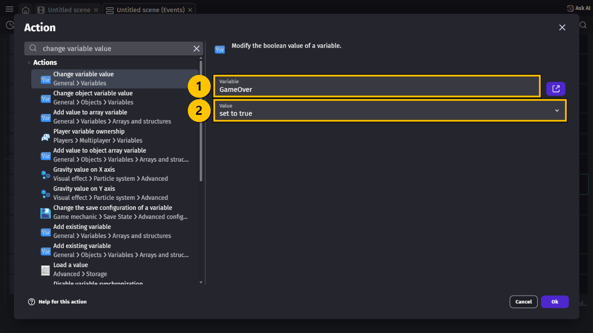

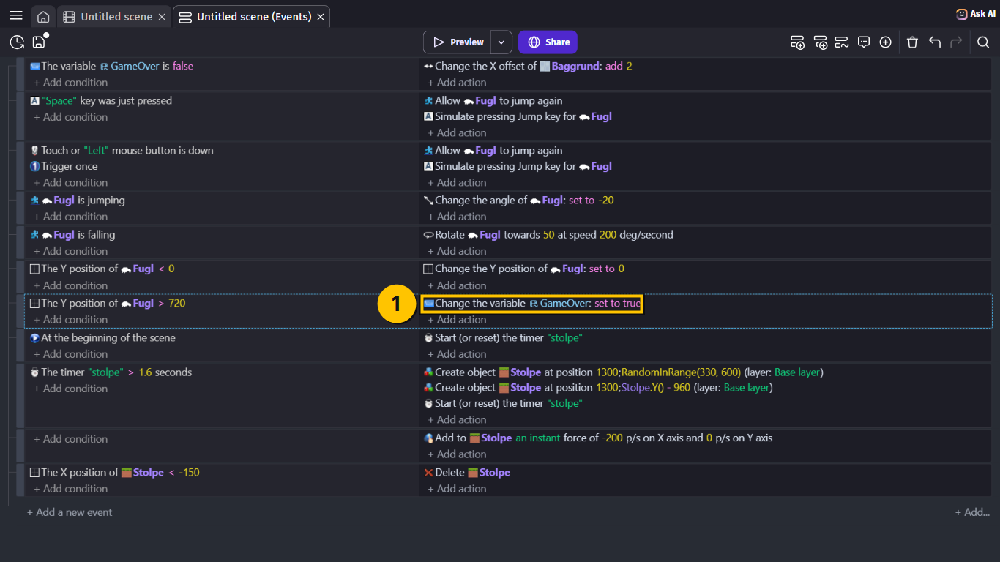

> **VIDEN**
>
> Før startede fuglen forfra, når den faldt ned. Nu er det **Game Over** **(1)**.
{: .lesson-info}

## Opgave 5 – GAME OVER: Fuglen rammer en stolpe

> **GØR DETTE**
>
> 1. Vælg **+ Add a new event** nederst, og vælg **+ Add condition**.
> 2. Vælg `Fugl` **(1)**, skriv `collision`, og vælg **Collision** **(2)**.
> 3. Vælg `Stolpe` i **Object** **(3)**, og vælg **Ok**.
> 4. Vælg **+ Add action**, og lav **Change variable value**: `GameOver` **set to true** —
>    ligesom i opgave 4.
{: .lesson-action}

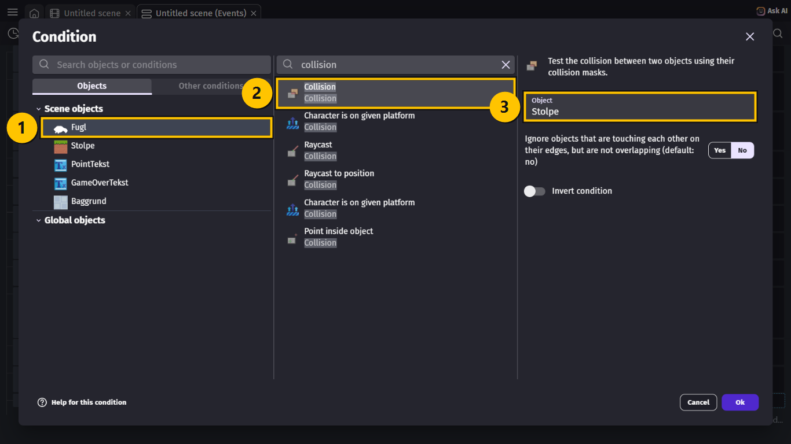

## Opgave 6 – GAME OVER: Når spillet er slut

> **GØR DETTE**
>
> 1. Vælg **+ Add a new event**, og vælg **+ Add condition**.
> 2. Vælg **Variable value**, vælg `GameOver` **(1)**, og vælg **True** **(2)**.
> 3. Vælg **Ok**.
> 4. Tilføj en condition mere: **Trigger once while true**.
{: .lesson-action}

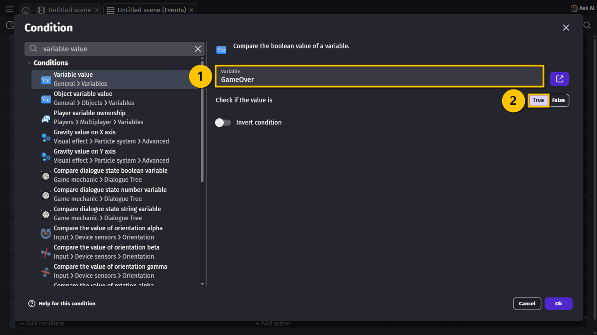

> **VIDEN**
>
> **Trigger once** sørger for, at eventet kun sker én gang — i det øjeblik spillet slutter.
> Ellers ville det ske 60 gange i sekundet.
{: .lesson-info}

> **GØR DETTE**
>
> Giv eventet tre actions:
>
> 1. `Fugl` → skriv `animation`, og vælg **Animation (by name)** **(1)**. Vælg **Hit** i
>    **Animation name** **(2)**.
{: .lesson-action}

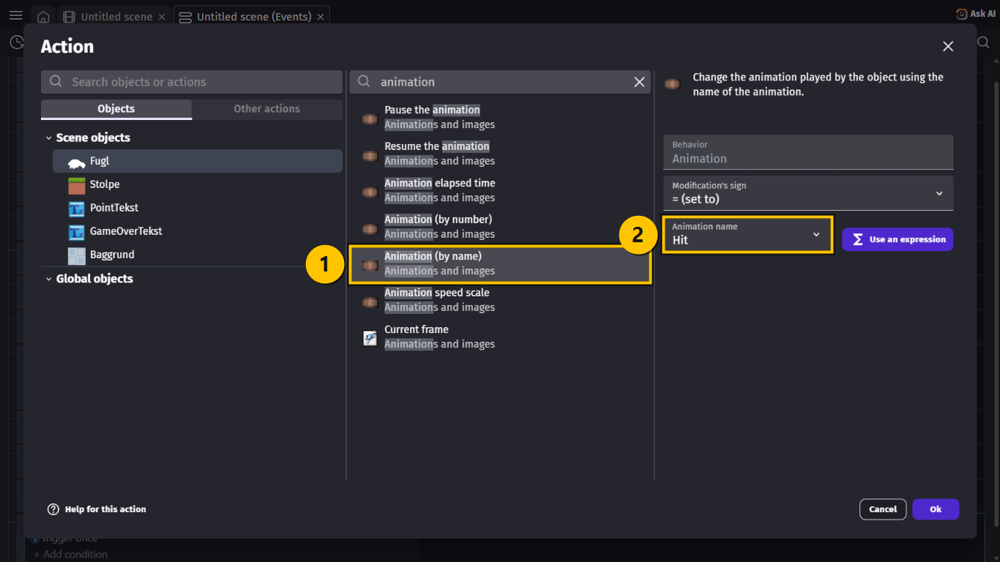

> **GØR DETTE**
>
> 2. Skriv `time scale`, og vælg **Time scale** **(1)**. Skriv `0` **(2)**.
{: .lesson-action}

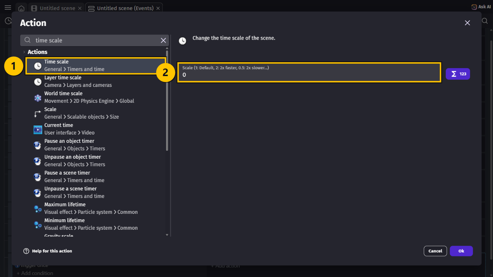

> **GØR DETTE**
>
> 3. **Create an object**: vælg `GameOverTekst` **(1)**, skriv `330` i **X position** og
>    `260` i **Y position** **(2)**, og vælg `GUI` i **Layer** **(3)**.
{: .lesson-action}

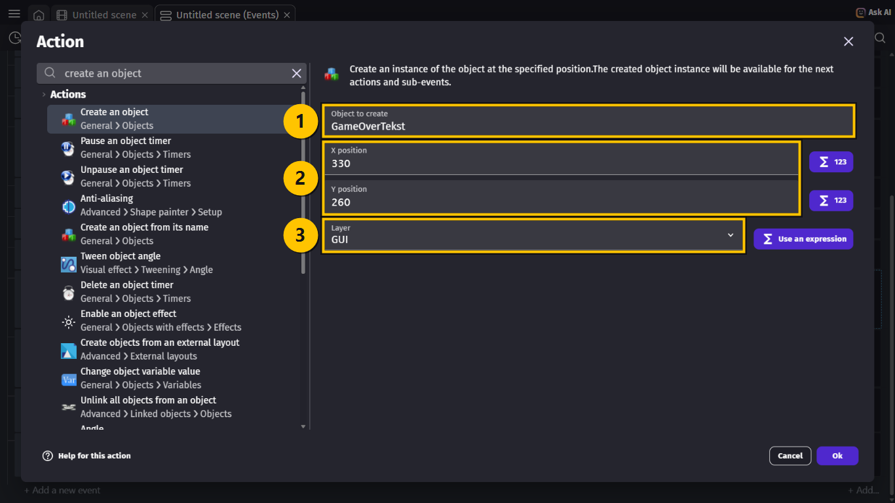

> **VIDEN**
>
> - **Hit** er animationen, hvor fuglen blinker hvidt. Den kender du fra lektion 1.
> - **Time scale** er, hvor hurtigt tiden går i spillet. `1` er normal fart, og `0` betyder,
>   at tiden står stille. Så stopper stolperne, fuglen og stopuret på én gang.
{: .lesson-info}

## Opgave 7 – POINT: Et point for hver stolpe

> **VIDEN**
>
> En stolpe giver et point, når den er fløjet forbi fuglen. Men der er **to** stolper i hvert
> par, og vi vil kun have ét point. Derfor tæller vi kun den **nederste** — den har en Y,
> der er større end `0`.
{: .lesson-info}

> **GØR DETTE**
>
> 1. Vælg **+ Add a new event**, og vælg **+ Add condition**.
> 2. Vælg `Stolpe`, og vælg **X position** **(1)**. Vælg **< (less than)** **(2)**, og skriv
>    `150` **(3)**. Vælg **Ok**.
{: .lesson-action}

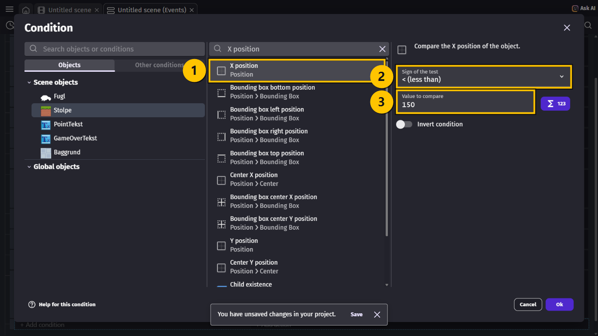

> **GØR DETTE**
>
> 3. Tilføj en condition mere: `Stolpe` **Y position** **(1)** **> (greater than)** **(2)**
>    `0` **(3)**.
{: .lesson-action}

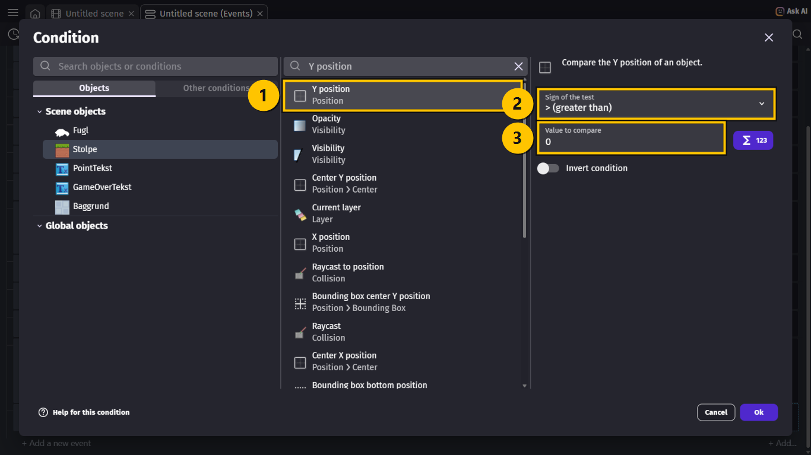

> **GØR DETTE**
>
> 4. Tilføj en condition mere: `Stolpe` → skriv `variable`, og vælg **Object variable
>    value** **(1)**. Vælg `Talt` **(2)**, og vælg **False** **(3)**.
{: .lesson-action}

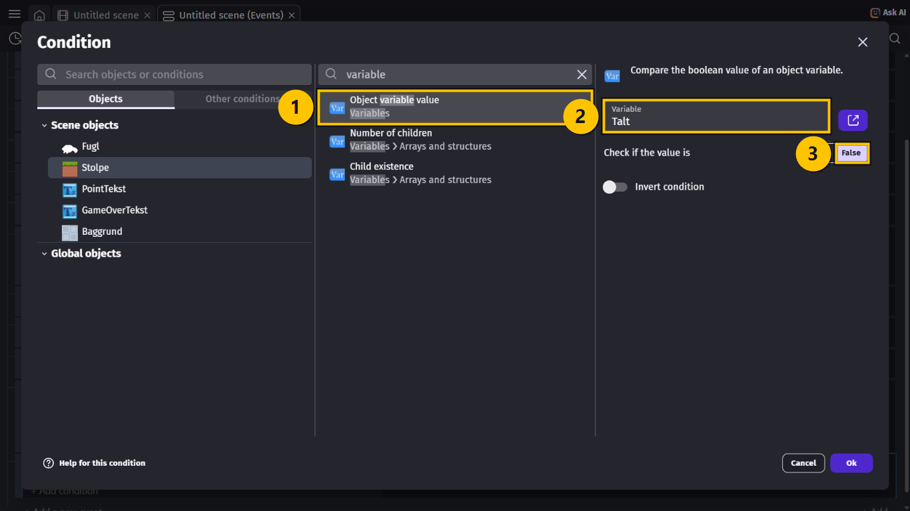

> **GØR DETTE**
>
> Giv eventet tre actions:
>
> 1. `Stolpe` → **Change object variable value** **(1)**. Vælg `Talt` **(2)** og
>    **set to true** **(3)**.
{: .lesson-action}

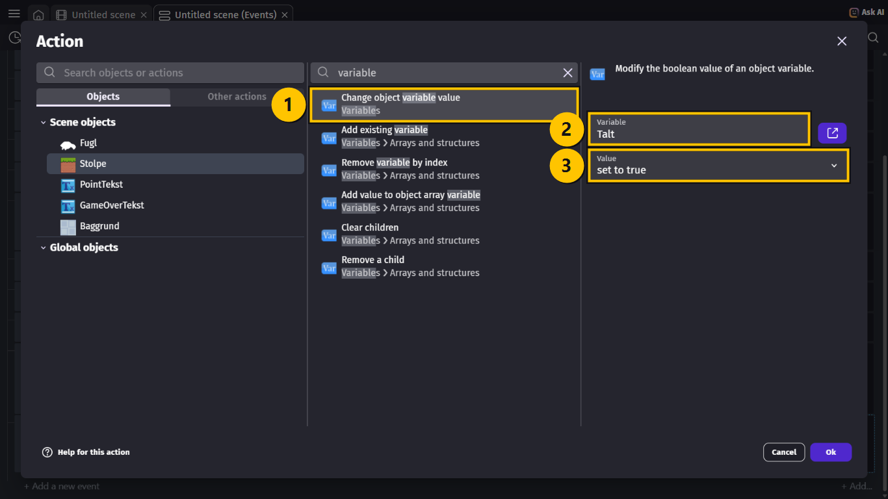

> **GØR DETTE**
>
> 2. **Change variable value**: `Point` **(1)**, **+ (add)** **(2)** og `1` **(3)**.
{: .lesson-action}

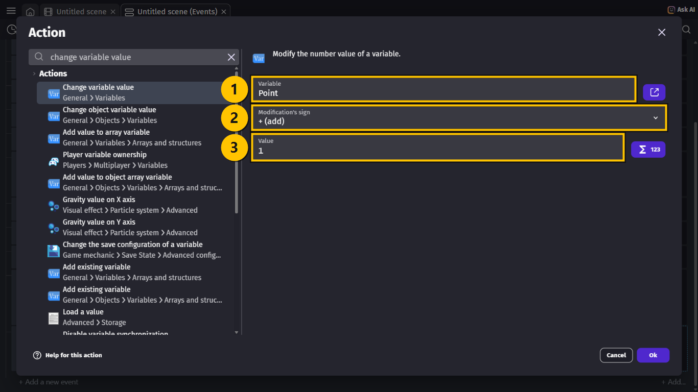

> **GØR DETTE**
>
> 3. `PointTekst` **(1)** → skriv `text`, og vælg **Text** **(2)**. Skriv
>    `"Point: " + Point` **(3)**.
{: .lesson-action}

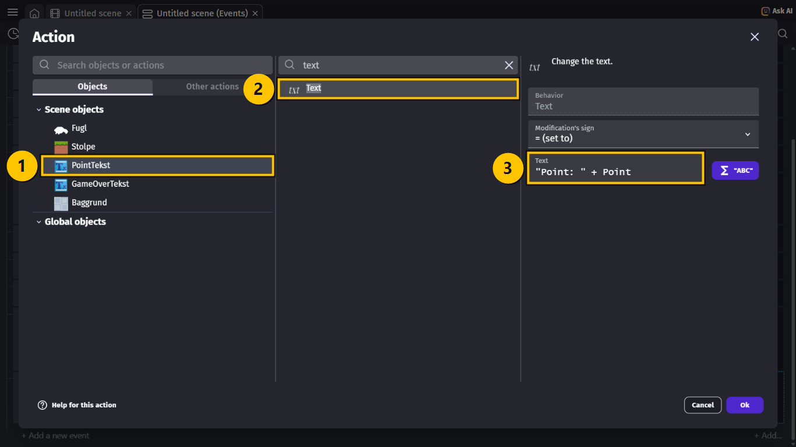

> **VIDEN**
>
> - Stolpen er forbi fuglen, når dens X er mindre end `150`.
> - Conditions om `Stolpe` vælger kun de stolper, der passer. Så sætter actionen kun
>   `Talt` på **den** stolpe — ikke på alle de andre.
> - `"Point: "` står i anførselstegn, fordi det er tekst. `Point` er variablen, så den står
>   uden. `+` sætter dem sammen til fx `Point: 3`.
{: .lesson-info}

## Opgave 8 – GAME OVER: Prøv igen

> **GØR DETTE**
>
> 1. Vælg **+ Add a new event**.
> 2. Tilføj to conditions: **Variable value** `GameOver` **True** og **Key just pressed**
>    `Space`.
> 3. Vælg **+ Add action**, skriv `change the scene`, og vælg **Change the scene** **(1)**.
> 4. Vælg `Untitled scene` **(2)**, og vælg **Ok**.
{: .lesson-action}

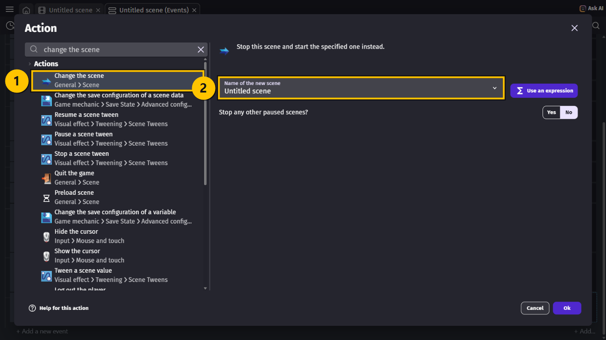

> **GØR DETTE**
>
> Lav et event mere til musen og mobilen:
>
> 1. Conditions: **Variable value** `GameOver` **True** og **Mouse button released**
>    **(1)** med **Left (primary)** **(2)**.
> 2. Action: **Change the scene** → `Untitled scene`.
{: .lesson-action}

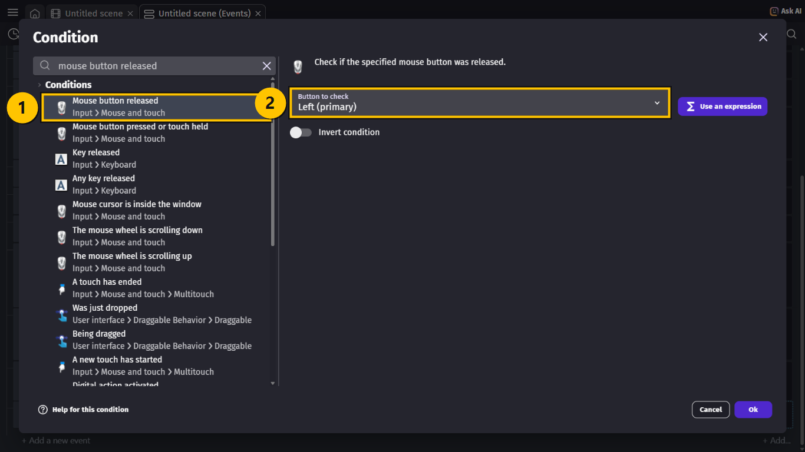

> **VIDEN**
>
> **Change the scene** starter scenen forfra — også selv om det er den scene, man allerede
> er i. Alle variabler starter forfra, så `Point` er `0`, `GameOver` er **false**, og tiden
> går normalt igen.
{: .lesson-info}

## Hele koden samlet

> **VIDEN**
>
> Event 2–6 og 8–11 er de samme som før. Det her er nyt eller ændret:
>
> | # | Conditions (HVIS) | Actions (SÅ) |
> |---|---|---|
> | 1 | The variable `GameOver` is **false** | Change the X offset of `Baggrund`: **add 2** |
> | 7 | The Y position of `Fugl` **>** `720` | Change the variable `GameOver`: **set to true** |
> | 12 | `Fugl` is in collision with `Stolpe` | Change the variable `GameOver`: **set to true** |
> | 13 | The variable `GameOver` is **true** Trigger once | Change the animation of `Fugl`: **set to** `"Hit"` Set the time scale of the scene to `0` Create object `GameOverTekst` at position `330`; `260` (layer: `"GUI"`) |
> | 14 | The X position of `Stolpe` **<** `150` The Y position of `Stolpe` **>** `0` The variable `Talt` of `Stolpe` is **false** | Change the variable `Talt` of `Stolpe`: **set to true** Change the variable `Point`: **add 1** Change the text of `PointTekst`: **set to** `"Point: " + Point` |
> | 15 | The variable `GameOver` is **true** `"Space"` key was just pressed | Change to scene `"Untitled scene"` |
> | 16 | The variable `GameOver` is **true** Touch or `"Left"` mouse button is released | Change to scene `"Untitled scene"` |
{: .lesson-info}

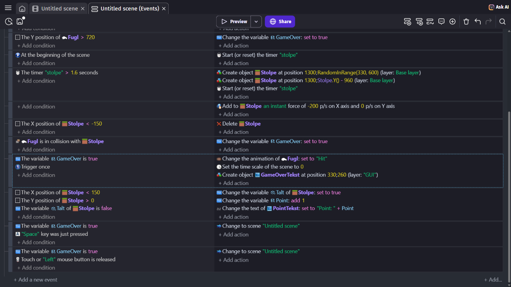

## Prøv spillet! 🎮

> **GØR DETTE**
>
> 1. Tryk **Ctrl + S** for at gemme.
> 2. Vælg **Preview**.
> 3. Flyv gennem så mange huller, du kan.
> 4. Flyv ind i en stolpe med vilje. Tryk så på mellemrumstasten, eller klik.
{: .lesson-action}

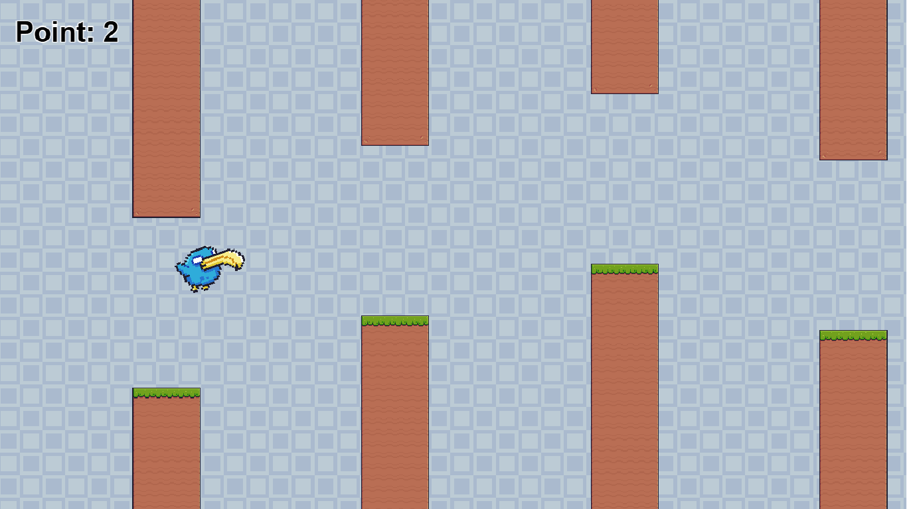

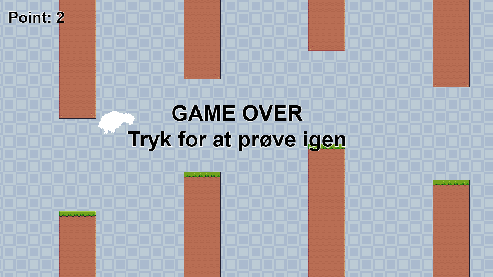

> **VIDEN**
>
> Sådan skal det virke:
>
> - Du får et point for hver stolpe, du kommer forbi.
> - Rammer fuglen en stolpe eller falder ud forneden, bliver den hvid, og alt står stille.
> - Der står **GAME OVER** midt på skærmen, oven på stolperne.
> - Tryk på mellemrumstasten eller klik, så starter spillet forfra med `Point: 0`.
>
> Spillet starter med det samme, så du skal baske, så snart det går i gang.
{: .lesson-info}

## Ekstra: Hvad er din rekord?

> **GØR DETTE**
>
> Spil fem gange, og skriv dine point ned. Hvad er dit bedste? Kan din nabo slå det?
{: .lesson-action}

> **VIDEN**
>
> Lige nu glemmer spillet dine point, når du prøver igen. I lektion 6 laver du en
> **highscore**, som spillet husker — også når du lukker det.
{: .lesson-info}

## Du er færdig med POINT OG GAME OVER ✅

> **VIDEN**
>
> Du er klar til næste lektion, når alt dette passer:
>
> - Jeg har variablerne `Point` og `GameOver`, og `Stolpe` har `Talt`.
> - Jeg får et point for hver stolpe, jeg kommer forbi.
> - Spillet stopper, når fuglen rammer en stolpe eller falder ned.
> - Der står **GAME OVER** oven på stolperne.
> - Jeg kan prøve igen med mellemrumstasten og musen.
> - Jeg har gemt projektet.
{: .lesson-info}

> **VIDEN**
>
> Næste gang bliver spillet hurtigere og hurtigere, jo længere du kommer — og det får lyd.
{: .lesson-info}

## Hvis noget går galt

| Problem | Prøv dette |
|---|---|
| Jeg kan ikke finde **Scene Variables**. | **GØR DETTE:** Klik på et tomt sted uden for scenen, så der står **Untitled scene** øverst i panelet til venstre. |
| Jeg kan ikke vælge **True** eller **False**. | **GØR DETTE:** Tjek, at variablen har typen **Boolean** og ikke **Number**. |
| Jeg får 2 point for hver stolpe. | **GØR DETTE:** Du mangler conditionen `Stolpe` **Y position > 0** i event 14. |
| Pointene bliver ved med at stige. | **GØR DETTE:** Tjek, at event 14 både tjekker, at `Talt` er **false**, og sætter den til **true**. |
| Der står altid `Point: 0`. | **GØR DETTE:** Tjek, at event 14 ændrer teksten på `PointTekst`. |
| Der står bare `Point` uden tal. | **GØR DETTE:** Kun `"Point: "` skal have anførselstegn. `Point` til sidst skal stå uden. |
| Stolperne er oven på teksten. | **GØR DETTE:** Tjek, at `PointTekst` er på laget `GUI`, og at `GameOverTekst` bliver lavet på laget `GUI`. |
| Der kommer **GAME OVER** mange gange oven i hinanden. | **GØR DETTE:** Du mangler **Trigger once** i event 13. |
| Alt stopper ikke ved Game Over. | **GØR DETTE:** Tjek, at **Time scale** er `0` i event 13. |
| Spillet starter ikke forfra. | **GØR DETTE:** Tjek, at event 15 og 16 skifter til `Untitled scene`. |
| Det er Game Over, med det samme spillet starter. | **GØR DETTE:** Tjek, at `GameOver` starter på **False** under **Scene Variables**. |
{: .lesson-help}
