# OPGAVER TIL GDevelop – FLYVESPIL – FART OG LYD

> **VIDEN**
>
> I bokse med en hel kant står der, hvad du skal gøre. I bokse med en stiplet kant står der
> viden, som hjælper dig med at forstå det, du laver.
>
> På billederne viser gule kasser, hvor du skal klikke. Tallene i gule cirkler passer til
> tallene i trinene, fx **(1)** og **(2)**.
{: .lesson-info}

I denne lektion bliver spillet sværere, jo længere du kommer: stolperne flyver hurtigere og
hurtigere. Og så får spillet lyd — et vingeslag, når fuglen basker, en mønt, når du får et
point, og et bump, når det er Game Over.

## To ord du skal kende

> **VIDEN**
>
> - **Udtryk** (expression) — et regnestykke i et felt, fx `Fart / 100`. GDevelop regner
>   det ud, mens spillet kører.
> - **Lydeffekt** — en kort lyd, der spiller én gang, fx et vingeslag eller et bump.
{: .lesson-info}

## Opgave 1 – FART: En variabel til farten

> **VIDEN**
>
> Lige nu står farten `200` i event 10, og baggrunden flytter sig `2` i event 1. Hvis vi vil
> ændre farten, skal vi rette to steder. I stedet laver vi én variabel, `Fart`, som begge
> events bruger.
{: .lesson-info}

> **GØR DETTE**
>
> 1. Gå til fanen **Untitled scene**, og klik på et tomt sted uden for scenen.
> 2. Vælg **+** ved **Scene Variables**.
> 3. Kald den nye variabel `Fart`, og skriv `200` som værdi **(1)**.
{: .lesson-action}

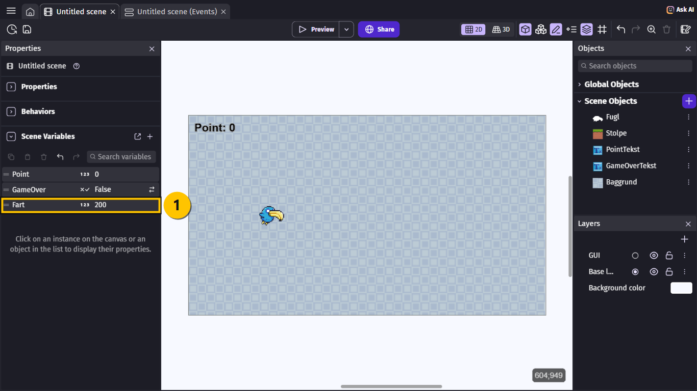

> **GØR DETTE**
>
> 1. Gå til fanen **Untitled scene (Events)**.
> 2. Dobbeltklik på actionen **Add to Stolpe an instant force** i event 10.
> 3. Skift `-200` ud med `-Fart` **(1)**, og vælg **Ok**.
{: .lesson-action}

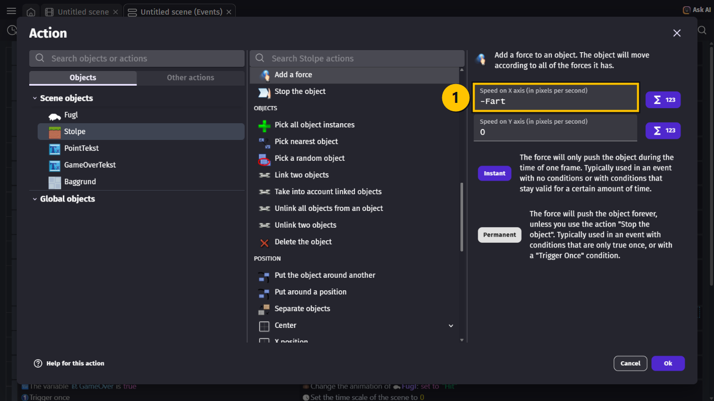

> **GØR DETTE**
>
> 1. Dobbeltklik på actionen **Change the X offset of Baggrund** i event 1.
> 2. Skift `2` ud med `Fart / 100` **(1)**, og vælg **Ok**.
{: .lesson-action}

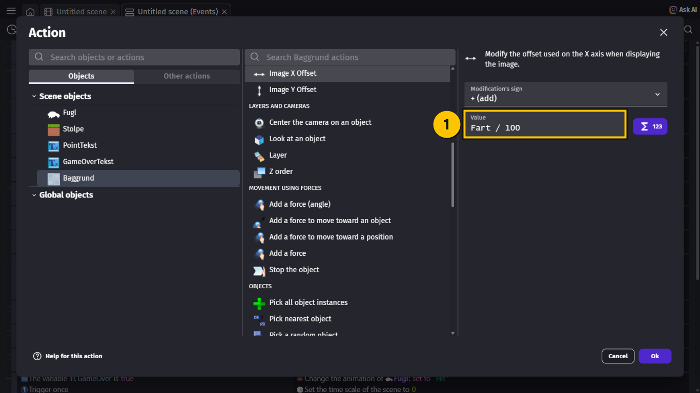

> **VIDEN**
>
> - `-Fart` betyder "minus `Fart`". Stolperne skal mod venstre, så farten skal være
>   negativ.
> - `Fart / 100` er `Fart` delt med 100. Når `Fart` er `200`, glider baggrunden `2` — ligesom
>   før. Når stolperne kører hurtigere, gør baggrunden det også.
> - Baggrunden glider meget langsommere end stolperne. Det får den til at se ud, som om den
>   er langt væk. Det kaldes **parallax**.
{: .lesson-info}

## Opgave 2 – FART: Hurtigere og hurtigere

> **GØR DETTE**
>
> 1. Find event 8 (**At the beginning of the scene**).
> 2. Vælg **+ Add action**, og tilføj **Start (or reset) a scene timer** med `"fart"`
>    **(1)**.
{: .lesson-action}

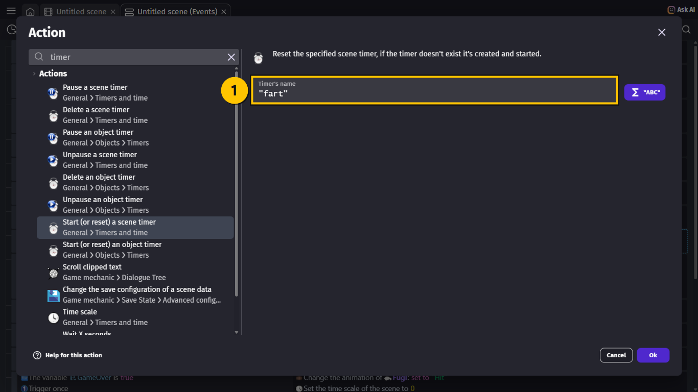

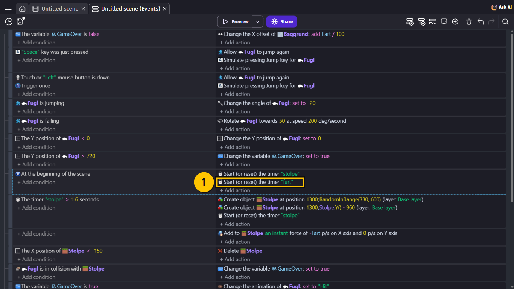

> **GØR DETTE**
>
> 1. Vælg **+ Add a new event** nederst, og vælg **+ Add condition**.
> 2. Vælg **Value of a scene timer**: `"fart"` **(1)**, **> (greater than)** **(2)** og `5`
>    **(3)**. Vælg **Ok**.
{: .lesson-action}

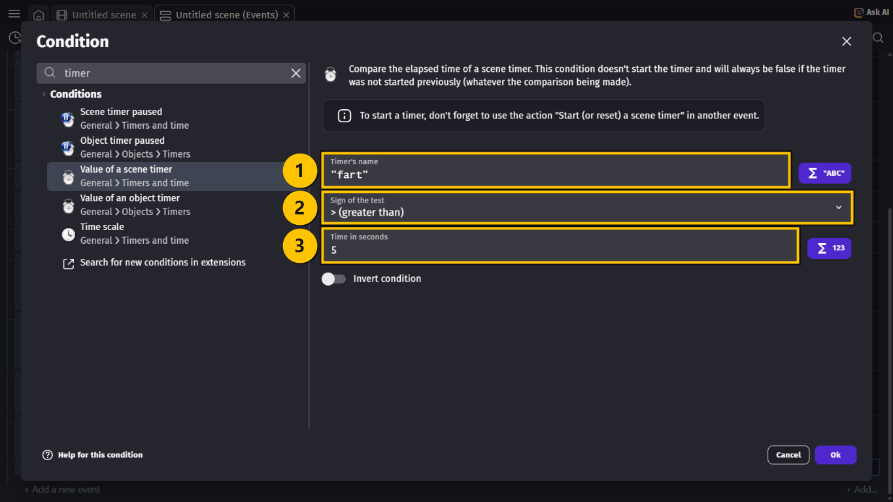

> **GØR DETTE**
>
> 3. Tilføj en condition mere: **Variable value** `Fart` **(1)** **< (less than)** **(2)**
>    `400` **(3)**.
{: .lesson-action}

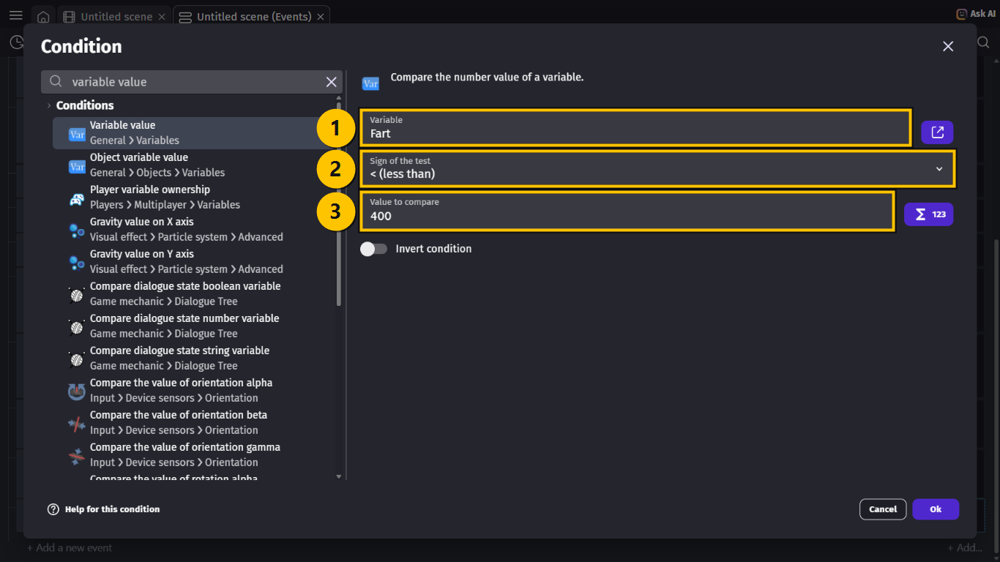

> **GØR DETTE**
>
> Giv eventet to actions:
>
> 1. **Change variable value**: `Fart` **(1)**, **+ (add)** **(2)** og `20` **(3)**.
> 2. **Start (or reset) a scene timer** med `"fart"`.
{: .lesson-action}

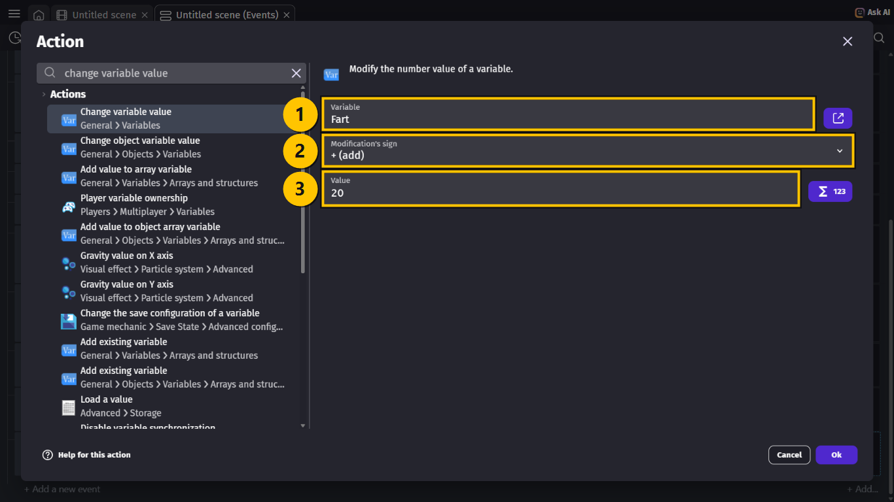

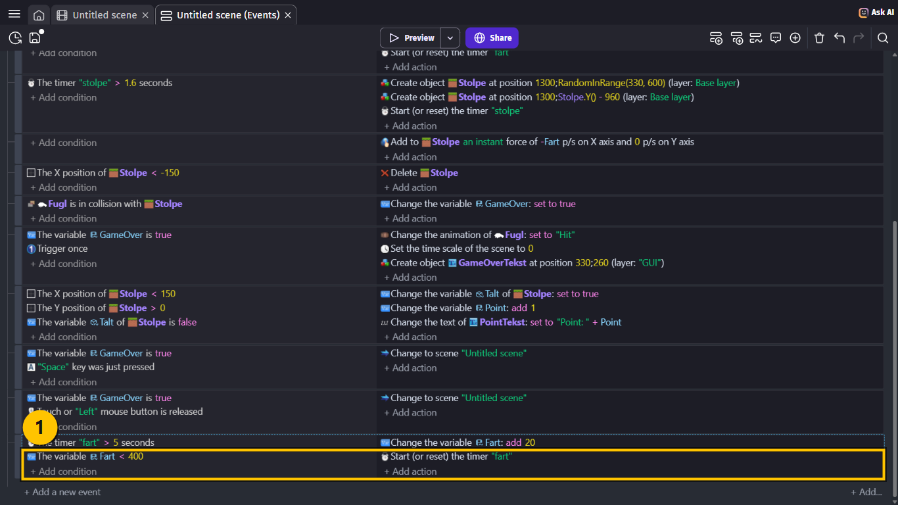

> **VIDEN**
>
> - Hvert 5. sekund bliver `Fart` 20 større **(1)**. Efter 50 sekunder er farten
>   fordoblet.
> - `Fart < 400` sørger for, at det stopper ved `400`. Ellers bliver spillet umuligt.
> - Der kommer stadig nye stolper hvert 1,6 sekund. Når de kører hurtigere, kommer der
>   længere mellem dem.
{: .lesson-info}

## Opgave 3 – LYD: Et vingeslag

> **GØR DETTE**
>
> 1. Find event 2 (**"Space" key was just pressed**), og vælg **+ Add action**.
> 2. Skriv `play a sound`, og vælg **Play a sound** **(1)**.
> 3. Klik i feltet **Choose the audio file to use**, og vælg **Choose from asset store**
>    **(2)**.
{: .lesson-action}

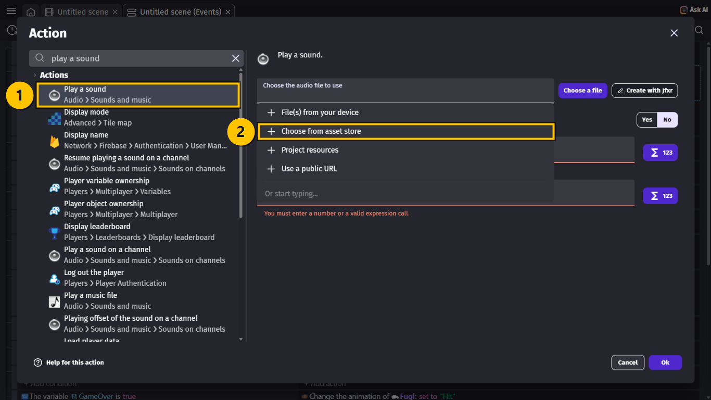

> **GØR DETTE**
>
> 1. Skriv `jump` i søgefeltet **(1)**.
> 2. Vælg **Jump 1.aac** **(2)**. Tryk på ▷ for at høre den først.
> 3. Vælg **Add to project** **(3)**.
{: .lesson-action}

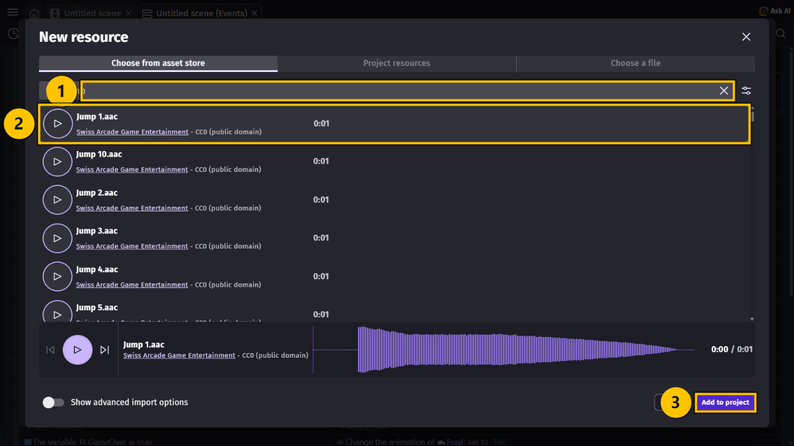

> **GØR DETTE**
>
> 1. Tjek, at der står `Jump 1.aac` **(1)**.
> 2. Skriv `40` i **Volume** **(2)** og `1` i **Pitch (speed)** **(3)**.
> 3. Vælg **Ok**.
{: .lesson-action}

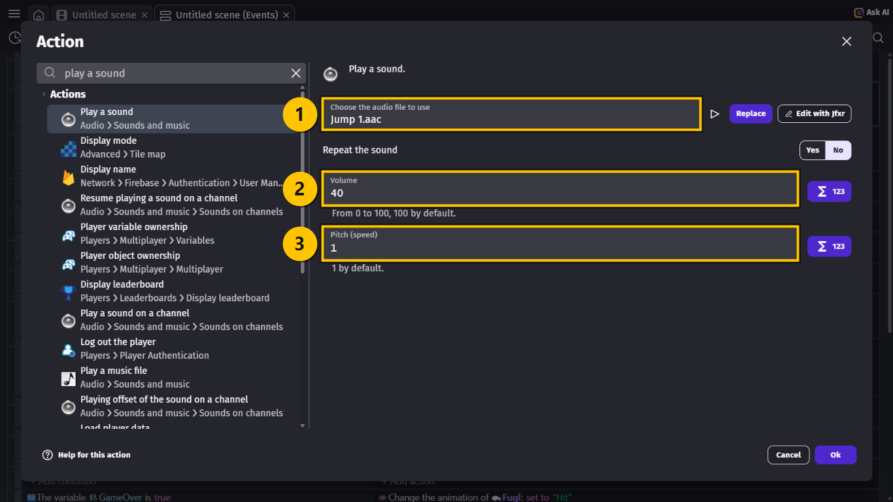

> **GØR DETTE**
>
> Giv også event 3 (musen) en **Play a sound** med `Jump 1.aac`, `40` og `1`.
{: .lesson-action}

> **VIDEN**
>
> Næste gang du vælger `Jump 1.aac`, ligger den allerede i dit projekt. Klik i feltet, og
> begynd at skrive `Jump` — så kan du vælge den direkte.
{: .lesson-info}

## Opgave 4 – LYD: Bump og mønt

> **GØR DETTE**
>
> 1. Find event 13 (**The variable GameOver is true** og **Trigger once**).
> 2. Tilføj **Play a sound** med lyden **Hit 1.aac** **(1)** fra asset store — søg efter
>    `hit`. Skriv `80` i **Volume** **(2)** og `1` i **Pitch**.
{: .lesson-action}

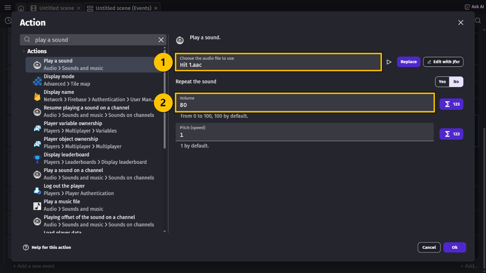

> **GØR DETTE**
>
> 1. Find event 14 — det, der giver point.
> 2. Tilføj **Play a sound** med lyden **Coins 1.aac** **(1)** fra asset store — søg efter
>    `coin`. Skriv `50` i **Volume** **(2)** og `1` i **Pitch**.
{: .lesson-action}

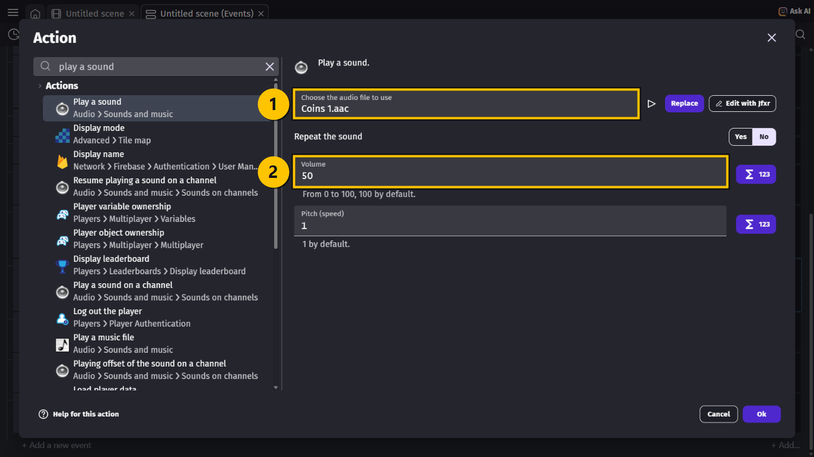

> **VIDEN**
>
> Bumpet ligger i event 13 og **ikke** i event 12 med kollisionen. Når fuglen rammer en
> stolpe, står alt stille — og så rører de hinanden hele tiden. Lå lyden i event 12, ville
> den spille 60 gange i sekundet. Event 13 har **Trigger once**, så lyden spiller kun én
> gang.
{: .lesson-info}

## Hele koden samlet

> **VIDEN**
>
> Det her er nyt eller ændret:
>
> | # | Conditions (HVIS) | Actions (SÅ) |
> |---|---|---|
> | 1 | The variable `GameOver` is **false** | Change the X offset of `Baggrund`: **add** `Fart / 100` |
> | 2 | `"Space"` key was just pressed | Allow `Fugl` to jump again Simulate pressing Jump key for `Fugl` Play the sound `Jump 1.aac`, vol. `40` |
> | 3 | Touch or `"Left"` mouse button is down Trigger once | Allow `Fugl` to jump again Simulate pressing Jump key for `Fugl` Play the sound `Jump 1.aac`, vol. `40` |
> | 8 | **At the beginning of the scene** | Start (or reset) the timer `"stolpe"` Start (or reset) the timer `"fart"` |
> | 10 | *(ingen — sker hele tiden)* | Add to `Stolpe` an **instant** force of `-Fart` p/s on X axis and `0` p/s on Y axis |
> | 13 | The variable `GameOver` is **true** Trigger once | Change the animation of `Fugl`: **set to** `"Hit"` Set the time scale of the scene to `0` Create object `GameOverTekst` at position `330`; `260` (layer: `"GUI"`) Play the sound `Hit 1.aac`, vol. `80` |
> | 14 | The X position of `Stolpe` **<** `150` The Y position of `Stolpe` **>** `0` The variable `Talt` of `Stolpe` is **false** | Change the variable `Talt` of `Stolpe`: **set to true** Change the variable `Point`: **add 1** Change the text of `PointTekst`: **set to** `"Point: " + Point` Play the sound `Coins 1.aac`, vol. `50` |
> | 17 | The timer `"fart"` **>** `5` seconds The variable `Fart` **<** `400` | Change the variable `Fart`: **add 20** Start (or reset) the timer `"fart"` |
{: .lesson-info}

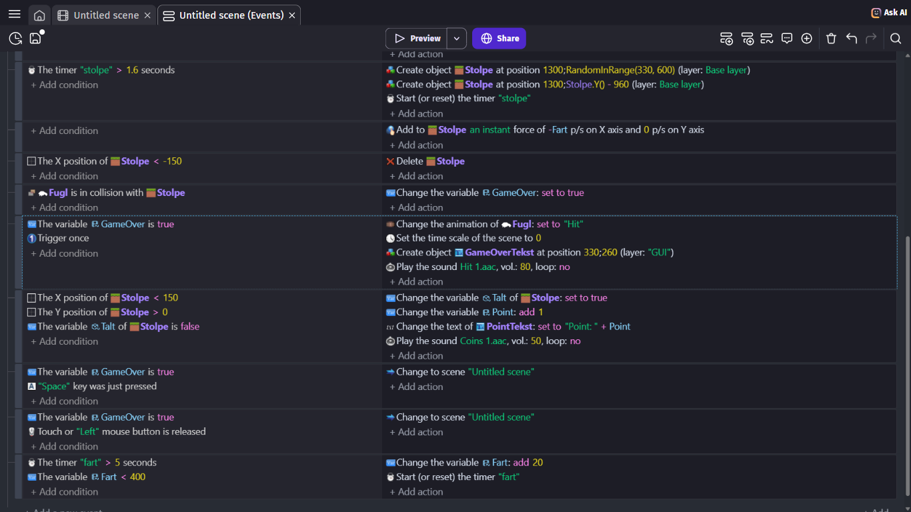

## Prøv spillet! 🎮

> **GØR DETTE**
>
> 1. Tryk **Ctrl + S** for at gemme.
> 2. Vælg **Preview**, og tænd for lyden på computeren.
> 3. Spil så længe, du kan.
{: .lesson-action}

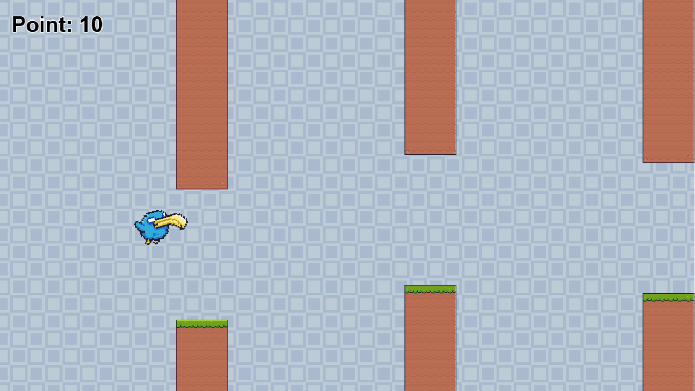

> **VIDEN**
>
> Sådan skal det virke:
>
> - Der lyder et vingeslag, hver gang fuglen basker.
> - Der lyder en mønt, når du får et point.
> - Der lyder et bump én gang, når det er Game Over.
> - Efter et stykke tid flyver stolperne og baggrunden hurtigere.
{: .lesson-info}

## Ekstra: Din egen sværhedsgrad

> **GØR DETTE**
>
> Prøv at ændre tallene:
>
> - Start `Fart` på `150` for en nemmere begyndelse.
> - Skift `20` ud med `40` i event 17. Hvor hurtigt bliver det svært?
> - Prøv en anden lyd end `Jump 1.aac` — der er ti forskellige.
{: .lesson-action}

> **VIDEN**
>
> Et godt spil er nemt i starten og bliver sværere langsomt. Prøv dig frem, og lad din nabo
> teste det. Synes de, det er for svært, så sæt tallene ned.
{: .lesson-info}

## Du er færdig med FART OG LYD ✅

> **VIDEN**
>
> Du er klar til næste lektion, når alt dette passer:
>
> - Jeg har variablen `Fart`, og både stolperne og baggrunden bruger den.
> - Spillet bliver hurtigere hvert 5. sekund.
> - Der er lyd på vingeslag, point og Game Over.
> - Jeg har gemt projektet.
{: .lesson-info}

> **VIDEN**
>
> Næste gang laver du en startmenu og en highscore, der bliver gemt — og så lægger du dit
> spil på nettet.
{: .lesson-info}

## Hvis noget går galt

| Problem | Prøv dette |
|---|---|
| Stolperne står stille. | **GØR DETTE:** Tjek, at `Fart` er `200` under **Scene Variables**, og at der står `-Fart` i event 10. |
| Stolperne flyver den forkerte vej. | **GØR DETTE:** Der skal stå **minus**: `-Fart`. |
| Farten stiger ikke. | **GØR DETTE:** Tjek, at event 8 starter timeren `"fart"`, og at event 17 starter den forfra. |
| Spillet bliver vildt hurtigt. | **GØR DETTE:** Tjek, at event 17 har conditionen `Fart` **< 400**. |
| Jeg kan ikke høre noget. | **GØR DETTE:** Tjek, at lyden er tændt på computeren, og at **Volume** ikke er `0`. |
| Bumpet lyder igen og igen. | **GØR DETTE:** Flyt lyden fra event 12 til event 13, som har **Trigger once**. |
| Der er ingen lyd, når jeg klikker med musen. | **GØR DETTE:** Lyden skal også i event 3, ikke kun i event 2. |
{: .lesson-help}
