# OPGAVER TIL GDevelop – FLYVESPIL – MENU, HIGHSCORE OG DEL

> **VIDEN**
>
> I bokse med en hel kant står der, hvad du skal gøre. I bokse med en stiplet kant står der
> viden, som hjælper dig med at forstå det, du laver.
>
> På billederne viser gule kasser, hvor du skal klikke. Tallene i gule cirkler passer til
> tallene i trinene, fx **(1)** og **(2)**.
{: .lesson-info}

Nu gør du spillet færdigt! Det får en **menu**, hvor du trykker for at starte, og en
**highscore**, som bliver gemt, så den er der endnu, næste gang du spiller. Til sidst lægger
du spillet på **gd.games**, så du kan sende et link til dine venner — og de kan spille det
på deres computer eller mobil.

## Tre ord du skal kende

> **VIDEN**
>
> - **Scene** — en skærm i spillet. Nu får spillet to: en `Menu` og selve `Spil`.
> - **Global variabel** — en variabel, som **alle** scener kan se. En scenevariabel hører
>   kun til én scene og starter forfra, hver gang scenen starter.
> - **Storage** — et sted på computeren eller mobilen, hvor spillet kan gemme tal. Det
>   bliver der, selv om spillet lukkes.
{: .lesson-info}

## Opgave 1 – MENU: To scener

> **GØR DETTE**
>
> 1. Vælg **☰** øverst til venstre for at åbne projektet.
> 2. Vælg **⋮** **(1)** ved **Untitled scene**, og vælg **Rename** **(2)**. Kald den `Spil`.
{: .lesson-action}

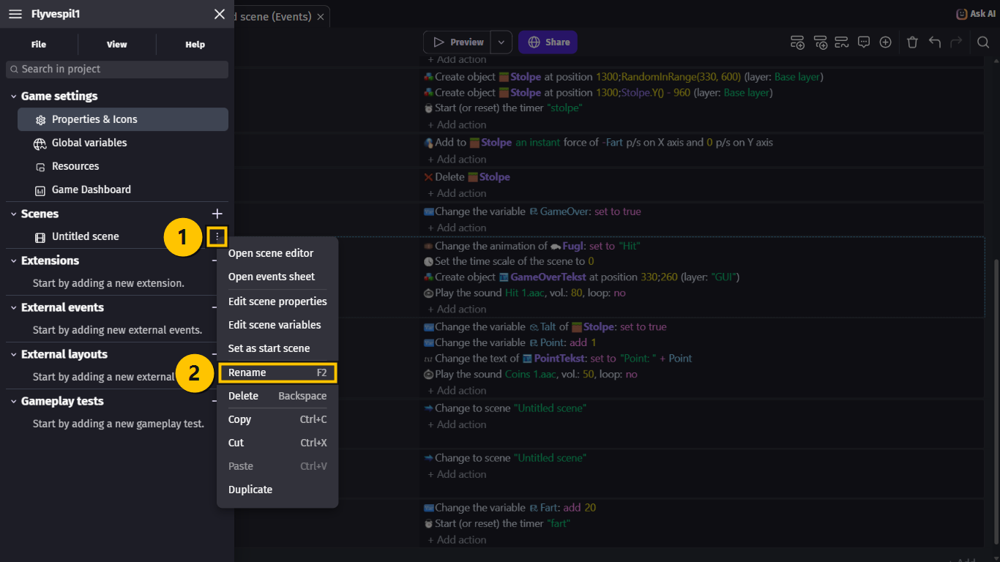

> **VIDEN**
>
> GDevelop retter selv navnet i dine events. Event 15 og 16 skifter nu til scenen `Spil`.
{: .lesson-info}

> **GØR DETTE**
>
> 1. Vælg **+** ved **Scenes** **(1)**. Kald den nye scene `Menu`.
> 2. Vælg **⋮** ved `Menu`, og vælg **Set as start scene**. Nu står der et lille flag ved
>    `Menu` **(2)**.
{: .lesson-action}

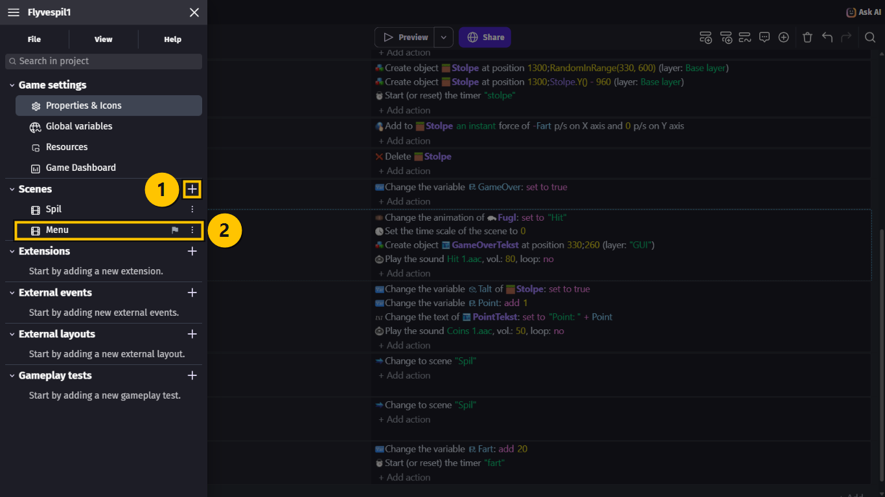

> **VIDEN**
>
> **Start scene** er den scene, spillet begynder med. Flaget viser, hvilken scene det er.
{: .lesson-info}

## Opgave 2 – HIGHSCORE: En variabel, som alle scener kan se

> **GØR DETTE**
>
> 1. Vælg **Global variables** i projektets menu.
> 2. Vælg **Add a variable**. Kald den `Highscore`, og lad den være et tal, der er `0`
>    **(1)**.
> 3. Vælg **Apply**.
{: .lesson-action}

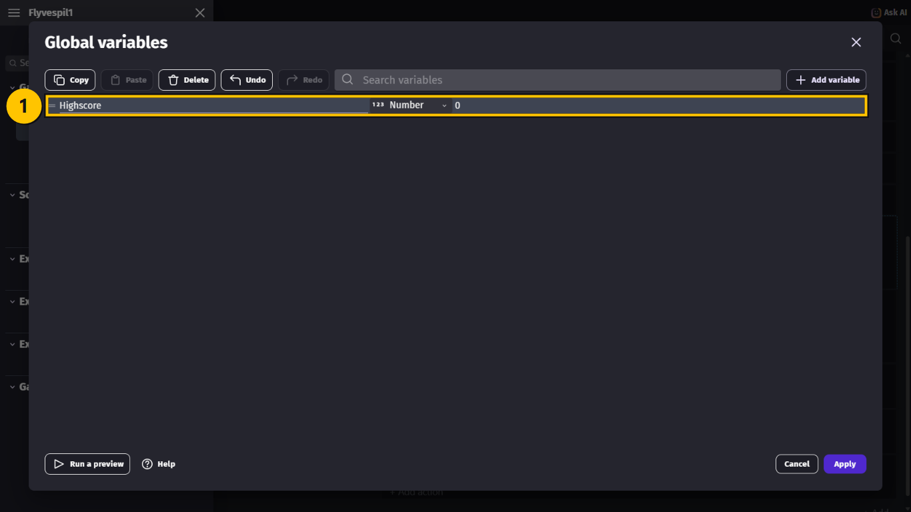

> **VIDEN**
>
> `Point` er en scenevariabel. Den starter forfra, hver gang `Spil` starter — det er godt,
> for et nyt spil skal starte med 0 point. Men `Highscore` skal huskes, også når du skifter
> scene. Derfor er den **global**.
{: .lesson-info}

## Opgave 3 – MENU: Byg menuen

> **GØR DETTE**
>
> 1. Vælg `Menu` i projektets menu, så scenen åbner.
> 2. Find **Layers** til højre, og klik på firkanten ved **Background color**.
> 3. Skriv `87CEEB` i **Hex** **(1)**, og tryk **Enter**. Nu er baggrunden himmelblå.
{: .lesson-action}

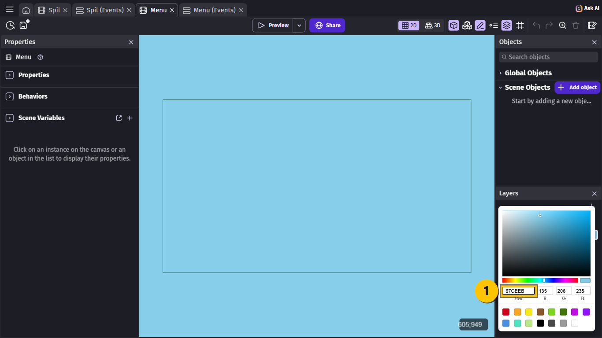

> **GØR DETTE**
>
> Lav tre **Text**-objekter i `Menu`, ligesom `PointTekst`. Sæt flueben ved **Bold** og ved
> **Enabled** under **Outline** ved dem alle:
>
> | Object name | Size | Tekst |
> |---|---|---|
> | `TitelTekst` | `100` | `FLYVESPIL` |
> | `StartTekst` | `40` | `Tryk for at starte` |
> | `HighscoreTekst` | `40` | `Highscore: 0` |
>
> Billedet viser `TitelTekst` **(1)** **(2)** **(3)**.
{: .lesson-action}

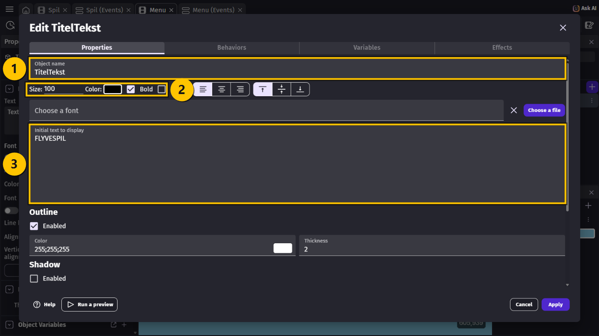

> **GØR DETTE**
>
> Træk de tre tekster ind på scenen, og placér dem:
>
> | Objekt | X | Y |
> |---|---|---|
> | `TitelTekst` **(1)** | `371` | `140` |
> | `StartTekst` **(2)** | `482` | `420` |
> | `HighscoreTekst` **(3)** | `518` | `510` |
{: .lesson-action}

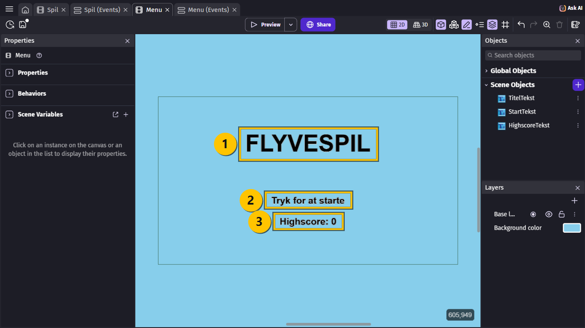

> **VIDEN**
>
> Tallene for **X** sætter teksterne midt på skærmen. Har du valgt en anden størrelse, kan
> du bare trække dem på plads med musen.
{: .lesson-info}

## Opgave 4 – MENU: Menuens events

> **VIDEN**
>
> Menuen skal gøre tre ting:
>
> 1. Hente den gemte highscore, når den starter.
> 2. Vise highscoren.
> 3. Starte spillet, når man trykker.
{: .lesson-info}

> **GØR DETTE**
>
> 1. Gå til fanen **Menu (Events)**, og vælg **Add an event**.
> 2. Tilføj conditionen **At the beginning of the scene**.
> 3. Tilføj en condition mere: skriv `storage`, og vælg **Existence of a group** **(1)**.
> 4. Skriv `"flyvespil"` i **Storage name** **(2)** og `"highscore"` i **Group** **(3)**.
{: .lesson-action}

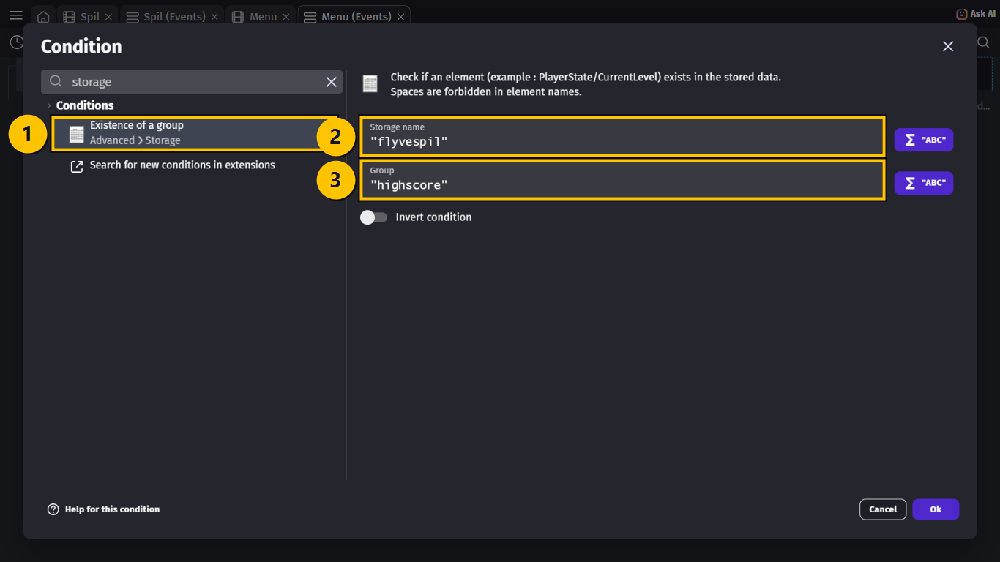

> **GØR DETTE**
>
> 1. Tilføj en action: skriv `load a value`, og vælg **Load a value** **(1)**.
> 2. Skriv `"flyvespil"` **(2)** og `"highscore"` **(3)** igen.
> 3. Skriv `Highscore` i **Variable** **(4)**, og vælg den på listen.
{: .lesson-action}

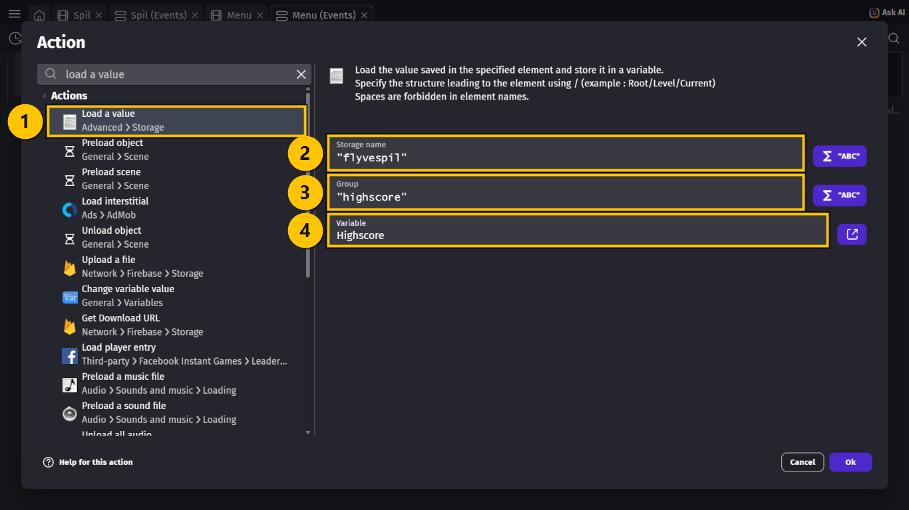

> **VIDEN**
>
> - **Storage name** er navnet på dit spils gemme-sted. **Group** er navnet på det tal, du
>   gemmer. Du bestemmer selv navnene — men de skal være **helt ens** alle steder.
> - Første gang du spiller, er der intet gemt endnu. Derfor tjekker vi først, om det
>   findes. Ellers bliver `Highscore` bare ved med at være `0`.
{: .lesson-info}

> **GØR DETTE**
>
> 1. Vælg **Add a new event**. Lad det være uden condition.
> 2. Tilføj en action: `HighscoreTekst` → **Text** → `"Highscore: " + Highscore`.
{: .lesson-action}

> **GØR DETTE**
>
> 1. Vælg **Add a new event**, og tilføj conditionen **Key just pressed** med `Space`.
> 2. Tilføj en action: skriv `change the scene`, og vælg **Change the scene**.
> 3. Vælg `Spil` i **Name of the new scene** **(1)**.
{: .lesson-action}

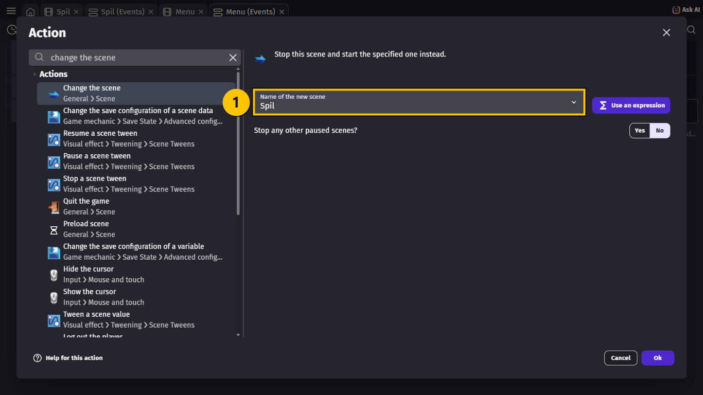

> **GØR DETTE**
>
> Lav et event mere til musen og mobilen: **Mouse button released** med **Left (primary)**
> → **Change the scene** → `Spil`.
{: .lesson-action}

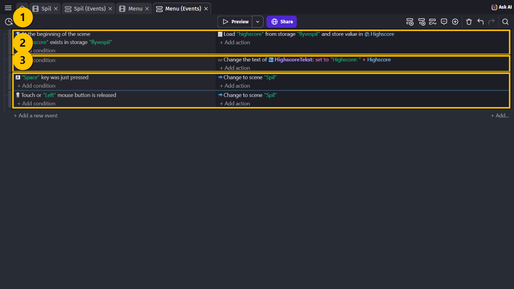

## Opgave 5 – HIGHSCORE: Gem en ny rekord

> **GØR DETTE**
>
> 1. Gå til scenen `Spil`, og lav et **Text**-objekt: `RekordTekst` **(1)**, størrelse `56`,
>    **Bold** og **Outline** **(2)**, med teksten `NY REKORD!` **(3)**.
> 2. Klik på den sorte firkant ved **Color**, og skriv `D0021B` i **Hex**. Så bliver teksten
>    rød.
> 3. Træk den **ikke** ind på scenen.
{: .lesson-action}

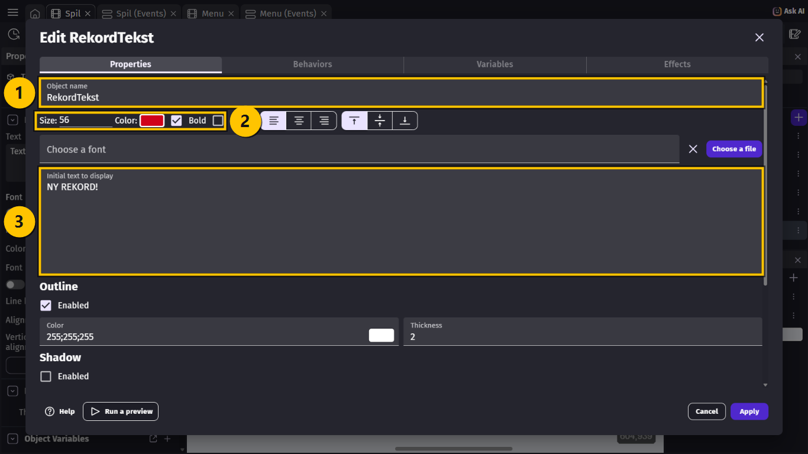

> **GØR DETTE**
>
> 1. Gå til **Spil (Events)**, og find event 15 og 16 (prøv igen).
> 2. Dobbeltklik på **Change to scene "Spil"** i begge, og vælg `Menu` i stedet **(1)**.
{: .lesson-action}

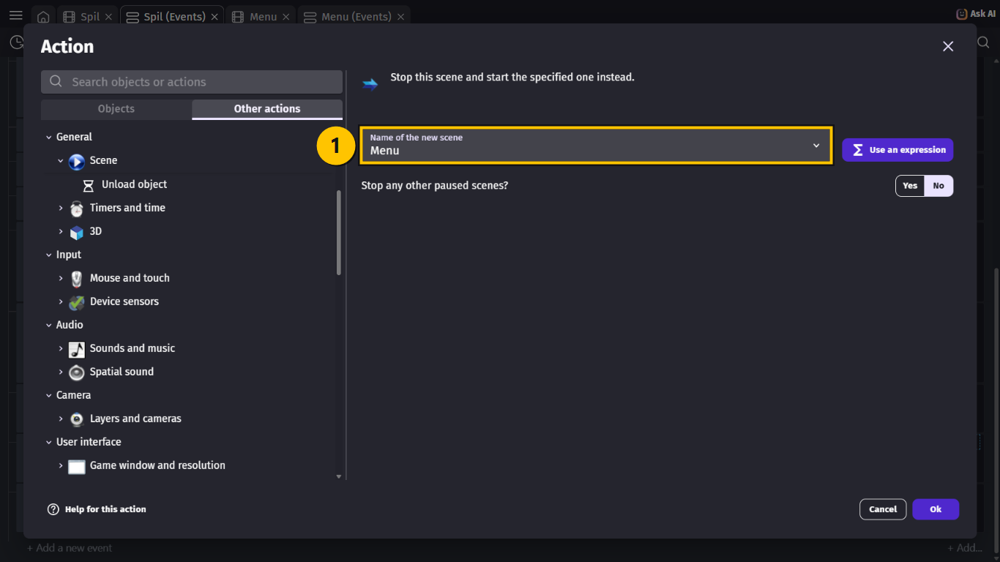

> **VIDEN**
>
> Når det er Game Over, kommer du nu tilbage til menuen. Der kan du se din highscore.
{: .lesson-info}

> **GØR DETTE**
>
> 1. Vælg **Add a new event** nederst.
> 2. Tilføj conditionen **Variable value** `GameOver` **True**.
> 3. Tilføj conditionen **Variable value**: `Point` **(1)** **> (greater than)** **(2)**
>    `Highscore` **(3)**.
> 4. Tilføj conditionen **Trigger once while true**.
{: .lesson-action}

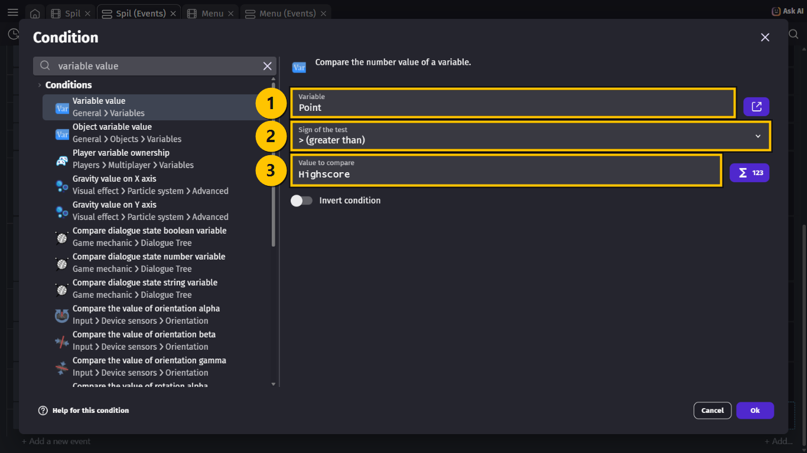

> **VIDEN**
>
> Eventet sker kun, når spillet er slut, **og** du har fået flere point end din gamle
> highscore. **Trigger once** gør, at det kun sker én gang.
{: .lesson-info}

> **GØR DETTE**
>
> Tilføj disse actions:
>
> 1. **Change variable value**: `Highscore` **(1)** **= (set to)** `Point` **(2)**.
{: .lesson-action}

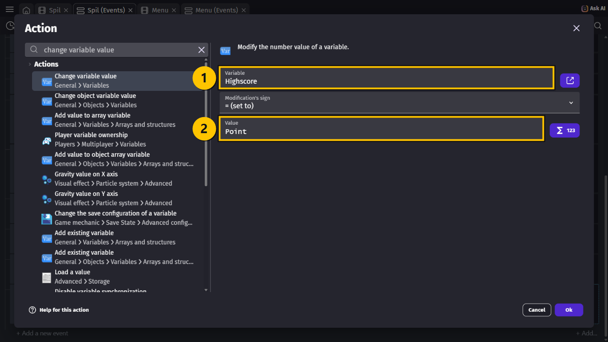

> **GØR DETTE**
>
> 2. Skriv `save a value`, og vælg **Save a value** **(1)**.
> 3. Skriv `"flyvespil"` og `"highscore"` **(2)** — præcis som i menuen.
> 4. Skriv `Highscore` i **Expression** **(3)**.
{: .lesson-action}

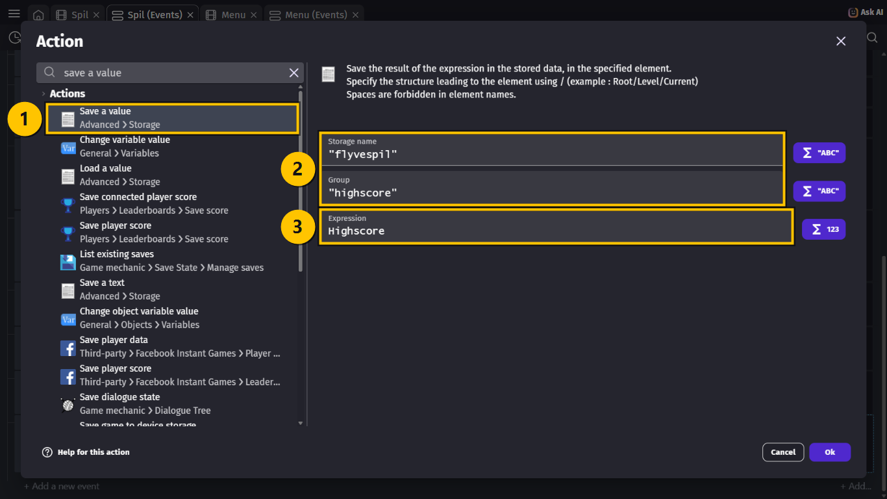

> **GØR DETTE**
>
> 5. `RekordTekst` **(1)** → **Create an object** ved X `480` og Y `150` **(2)** på laget
>    `GUI` **(3)**.
{: .lesson-action}

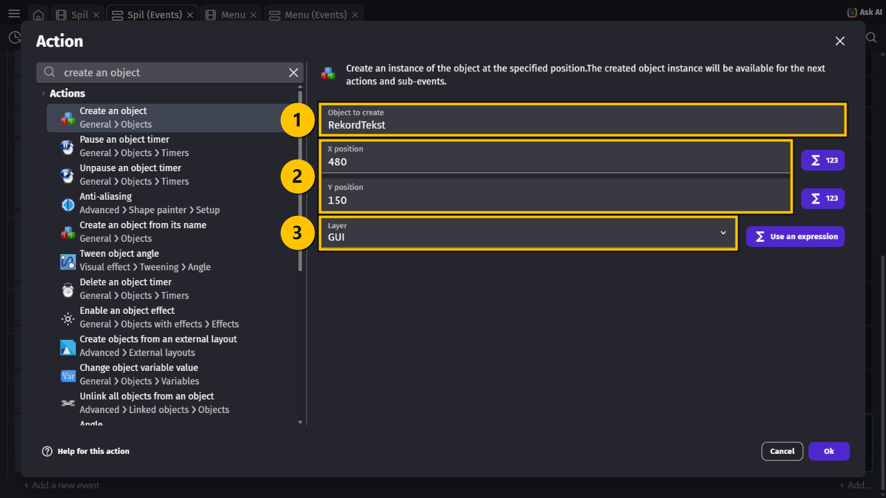

> **VIDEN**
>
> **Save a value** skriver tallet ned på computeren. Næste gang spillet starter, finder
> **Load a value** i menuen det igen.
{: .lesson-info}

## Hele koden samlet

> **VIDEN**
>
> **Menu (Events):**
>
> | # | Conditions (HVIS) | Actions (SÅ) |
> |---|---|---|
> | 1 | **At the beginning of the scene** `"highscore"` exists in storage `"flyvespil"` | Load `"highscore"` from storage `"flyvespil"` and store value in `Highscore` |
> | 2 | *(ingen — sker hele tiden)* | Change the text of `HighscoreTekst`: **set to** `"Highscore: " + Highscore` |
> | 3 | `"Space"` key was just pressed | Change to scene `"Spil"` |
> | 4 | Touch or `"Left"` mouse button is released | Change to scene `"Spil"` |
>
> **Spil (Events)** — det nye:
>
> | # | Conditions (HVIS) | Actions (SÅ) |
> |---|---|---|
> | 15 | The variable `GameOver` is **true** `"Space"` key was just pressed | Change to scene `"Menu"` |
> | 16 | The variable `GameOver` is **true** Touch or `"Left"` mouse button is released | Change to scene `"Menu"` |
> | 18 | The variable `GameOver` is **true** The variable `Point` **>** `Highscore` **Trigger once** | Change the variable `Highscore`: **set to** `Point` Save value `Highscore` in `"highscore"` of storage `"flyvespil"` Create object `RekordTekst` at position `480`; `150` (layer: `"GUI"`) |
{: .lesson-info}

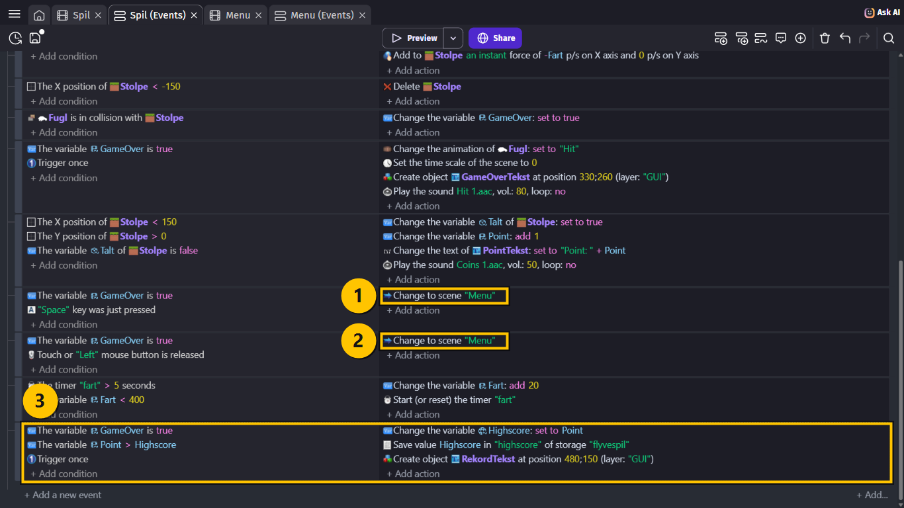

## Prøv spillet! 🎮

> **GØR DETTE**
>
> 1. Tryk **Ctrl + S** for at gemme.
> 2. Gå til fanen **Menu**, og vælg **Preview**. Preview starter altid i den scene, du har
>    åben.
> 3. Tryk for at starte, og spil, til det er GAME OVER.
> 4. Tryk igen for at komme tilbage til menuen.
> 5. Luk vinduet, og vælg **Preview** igen. Står din highscore der stadig?
{: .lesson-action}

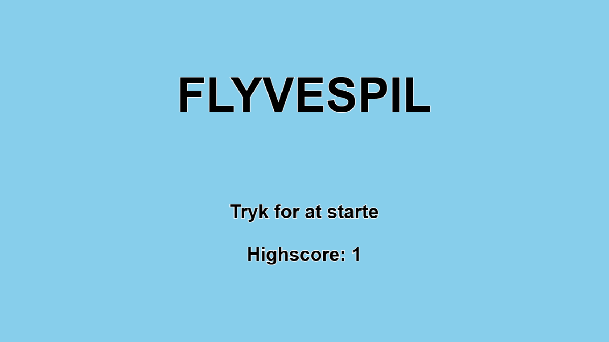

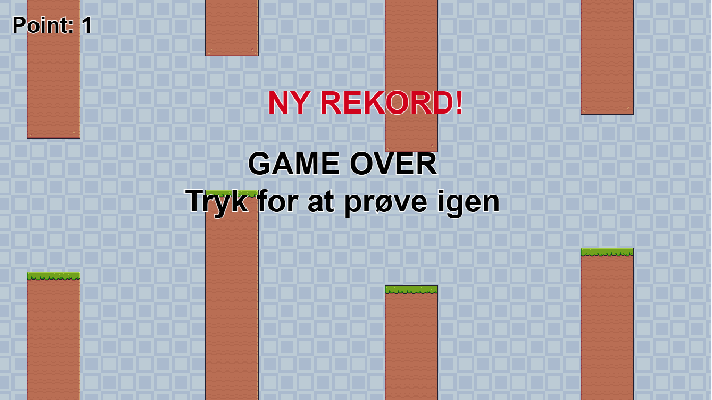

> **VIDEN**
>
> Sådan skal det virke:
>
> - Spillet starter i menuen.
> - Når det er GAME OVER, kommer du tilbage til menuen, når du trykker.
> - Slår du din highscore, står der **NY REKORD!**
> - Highscoren står i menuen — også når du har lukket spillet og startet det igen.
{: .lesson-info}

## Opgave 6 – DEL: Gør spillet klar til alle skærme

> **VIDEN**
>
> Dit spil er 1280 bredt og 720 højt. Men skærme har forskellige former — en mobil er smal,
> og et browservindue kan være bredt. Som standard gør GDevelop spillet bredere, så det
> fylder hele skærmen. Så kan man se et hvidt felt ude til højre, hvor baggrunden slutter, og
> se stolperne dukke op.
>
> Det klarer vi ved at sige, at spillet altid skal have samme form. Så kommer der sorte kanter
> i stedet.
{: .lesson-info}

> **GØR DETTE**
>
> 1. Vælg **☰**, og vælg **Properties & Icons**.
> 2. Rul ned til **Resolution and rendering**.
> 3. Vælg **No changes to the game size** i **Game resolution resize mode** **(1)**.
> 4. Vælg **Apply**, og tryk **Ctrl + S**.
{: .lesson-action}

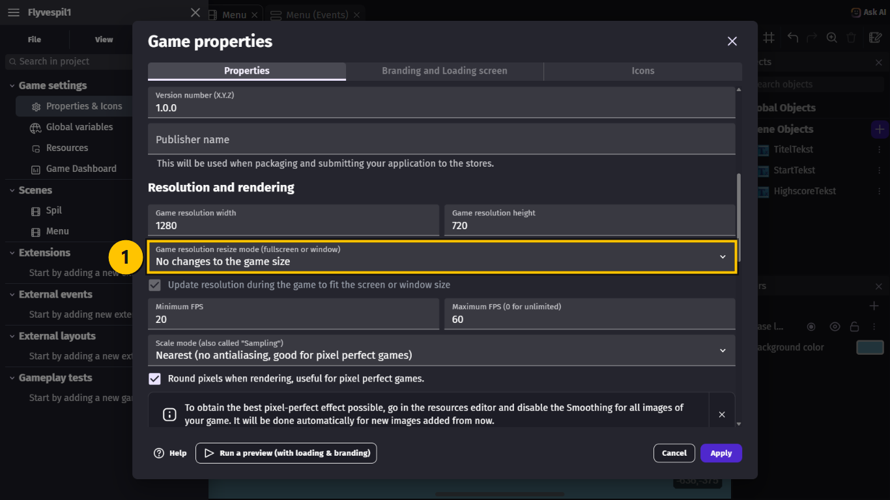

## Opgave 7 – DEL: Læg spillet på gd.games

> **VIDEN**
>
> **gd.games** er GDevelops egen spilside. Når du lægger dit spil der, får du et link, som
> du kan sende til hvem som helst. Spillet kan spilles i en browser på computer, tablet og
> mobil — ingen skal installere noget.
>
> Du skal være logget ind i GDevelop for at kunne lægge et spil på gd.games. Spørg en voksen,
> før du deler dit spil.
{: .lesson-info}

> **GØR DETTE**
>
> 1. Vælg **Share** øverst.
> 2. Vælg **gd.games** **(1)**.
{: .lesson-action}

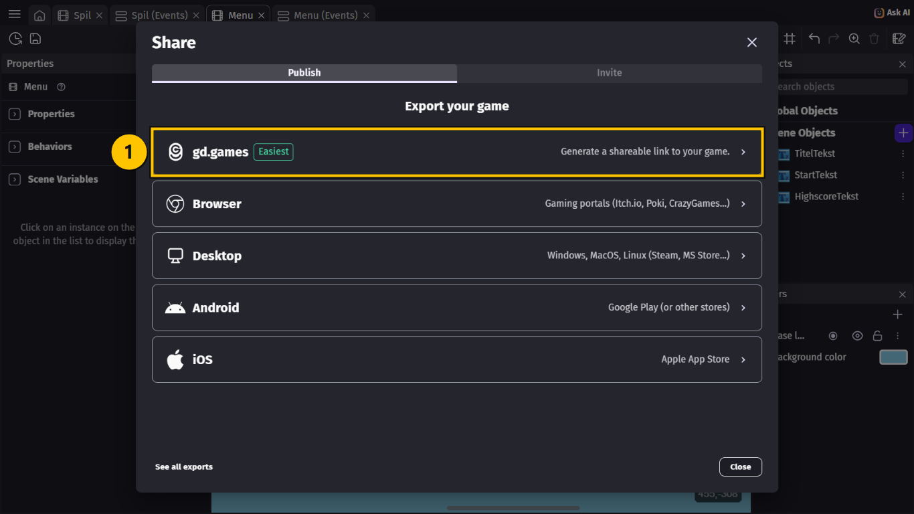

> **GØR DETTE**
>
> Vælg **Publish game** **(1)**. Det tager lidt tid, mens GDevelop bygger spillet og sender
> det af sted.
{: .lesson-action}

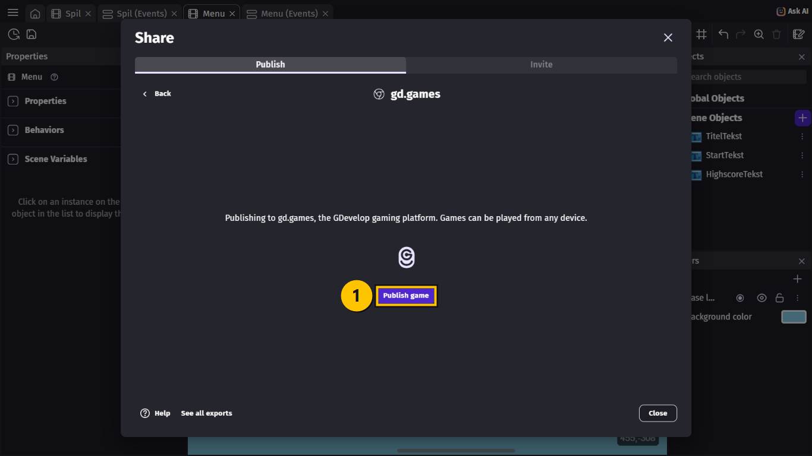

> **GØR DETTE**
>
> Nu er dit spil på nettet!
>
> 1. Her er linket til dit spil **(1)**. Klik på den lille firkant for at kopiere det.
> 2. QR-koden **(2)** kan du scanne med en mobil — så åbner spillet direkte.
> 3. Vælg **Open** **(3)** for at se dit spil på gd.games.
{: .lesson-action}

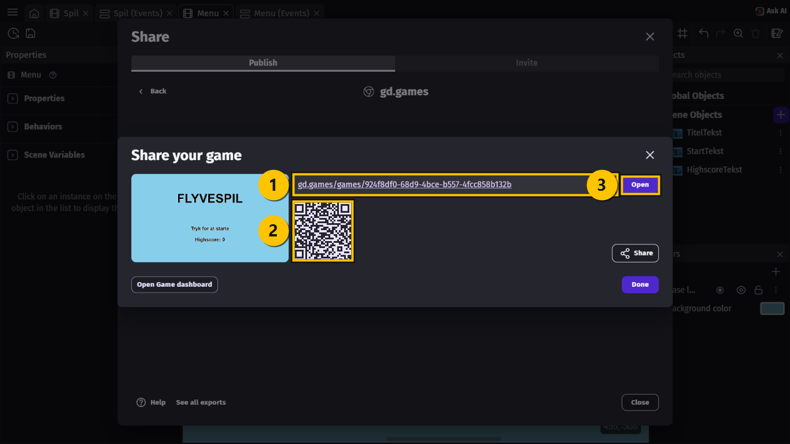

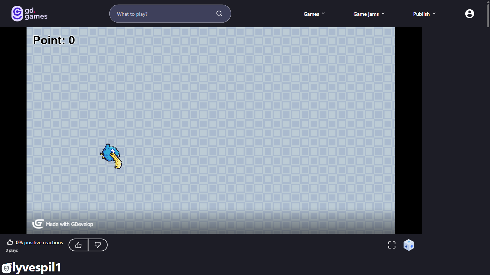

> **VIDEN**
>
> - Første gang du åbner gd.games, spørger siden om lov til at bruge cookies. Vælg **Do not
>   consent**, så virker spillet stadig.
> - Laver du om i spillet senere, så vælg **Share** → **gd.games** igen. Nu står der
>   **Publish new version**. Linket er det samme, så dine venner får automatisk den nye
>   udgave.
> - Highscoren bliver gemt på hver enkelt computer eller mobil. Din vens highscore er
>   altså din vens egen.
{: .lesson-info}

## Ekstra: Nulstil highscoren

> **GØR DETTE**
>
> 1. I **Menu (Events)**: Lav et nyt event med **Key just pressed** `Delete`.
> 2. Tilføj actions: skriv `delete an element`, og vælg **Delete an element** med `"flyvespil"` og
>    `"highscore"`. Tilføj også **Change variable value** `Highscore` **=** `0`.
{: .lesson-action}

> **VIDEN**
>
> Så kan du trykke **Delete** i menuen for at starte forfra med highscoren — fx hvis dine
> venner skal have en chance på din computer!
{: .lesson-info}

## Du er færdig med MENU, HIGHSCORE OG DEL ✅

> **VIDEN**
>
> Du er færdig med flyvespillet, når alt dette passer:
>
> - Spillet starter i scenen `Menu`, og et tryk starter spillet.
> - Efter GAME OVER kommer jeg tilbage til menuen.
> - Der står **NY REKORD!**, når jeg slår min highscore.
> - Highscoren er gemt, også når jeg lukker spillet og åbner det igen.
> - Mit spil ligger på gd.games, og jeg har et link, jeg kan dele.
{: .lesson-info}

> **VIDEN**
>
> Tillykke — du har lavet et helt spil og lagt det på nettet! 🎉 Har du lyst til mere, så
> tag den ekstra lektion med frugter, du kan samle, og medaljer.
{: .lesson-info}

## Hvis noget går galt

| Problem | Prøv dette |
|---|---|
| Spillet starter stadig i `Spil`. | **GØR DETTE:** Vælg **⋮** ved `Menu`, og vælg **Set as start scene**. Gå til fanen **Menu**, før du vælger **Preview**. |
| Der sker ingenting, når jeg trykker i menuen. | **GØR DETTE:** Tjek, at scenenavnet i **Change the scene** er `Spil`, og at du bruger **Key just pressed** med `Space`. |
| Highscoren er altid 0. | **GØR DETTE:** Tjek, at `"flyvespil"` og `"highscore"` er stavet ens i **Save a value** og **Load a value**. |
| Highscoren forsvinder, når jeg skifter scene. | **GØR DETTE:** `Highscore` skal være en **global** variabel, ikke en scenevariabel. |
| Der står NY REKORD!, selv om jeg ikke slog den. | **GØR DETTE:** Tjek, at conditionen er `Point` **>** `Highscore` — ikke **<**. |
| NY REKORD! er bag stolperne. | **GØR DETTE:** Vælg `GUI` i **Layer**, når `RekordTekst` bliver lavet. |
| Jeg kan ikke vælge **Publish game**. | **GØR DETTE:** Du skal være logget ind i GDevelop. Vælg profil-ikonet øverst til højre. |
| Der er et hvidt felt i siden af spillet på gd.games. | **GØR DETTE:** Lav opgave 6, og vælg **Publish new version**. |
{: .lesson-help}
