# OPGAVER TIL GDevelop – FLYVESPIL – EKSTRA: FRUGT OG MEDALJER

> **VIDEN**
>
> I bokse med en hel kant står der, hvad du skal gøre. I bokse med en stiplet kant står der
> viden, som hjælper dig med at forstå det, du laver.
>
> På billederne viser gule kasser, hvor du skal klikke. Tallene i gule cirkler passer til
> tallene i trinene, fx **(1)** og **(2)**.
{: .lesson-info}

Det her er en ekstra lektion. Spillet får æbler, som svæver i hullerne mellem stolperne.
Fanger du et æble, får du 3 point ekstra. Og når det er Game Over, vinder du en medalje —
bronze, sølv eller guld — alt efter hvor mange point du fik.

## To ord du skal kende

> **VIDEN**
>
> - **Scale** — hvor stor et objekt er i forhold til sin normale størrelse. `1` er normal,
>   `2` er dobbelt så stor.
> - **Kopiere et event** — når to events næsten er ens, kan du lave det ene og kopiere det.
>   Så skal du kun rette tallene.
{: .lesson-info}

## Opgave 1 – FRUGT: Hent et æble

> **GØR DETTE**
>
> 1. Gå til scenen `Spil`, og vælg **+ Add object**.
> 2. Find pakken **Pixel Adventure** igen, og vælg mappen **Item** **(1)**.
{: .lesson-action}

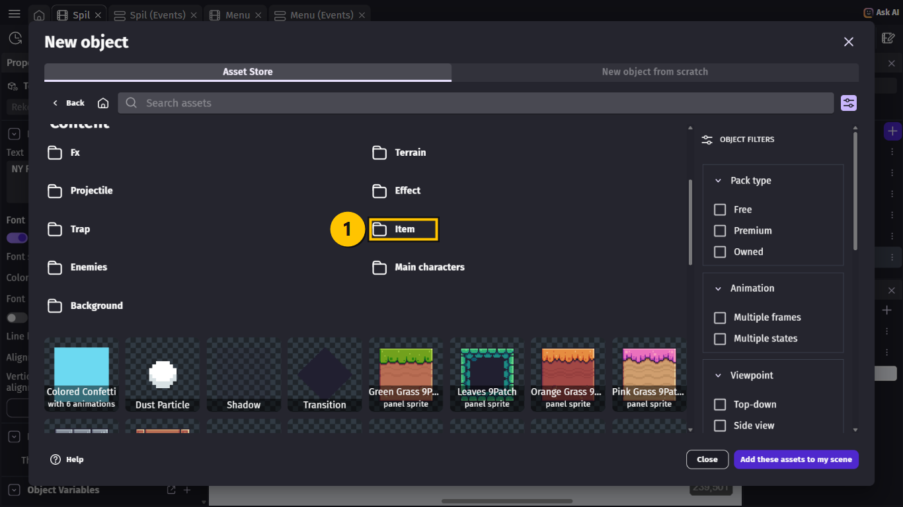

> **GØR DETTE**
>
> Vælg **Apple** **(1)**.
{: .lesson-action}

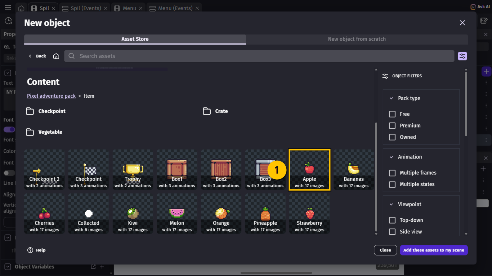

> **GØR DETTE**
>
> 1. Vælg **Add to the scene** **(1)**.
> 2. Vælg **Close**.
{: .lesson-action}

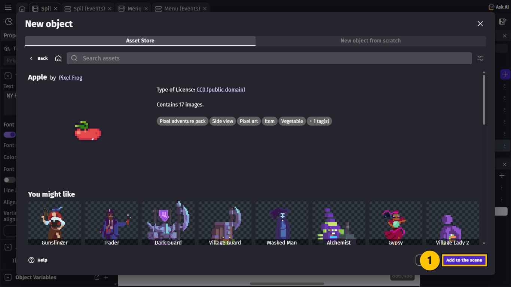

> **GØR DETTE**
>
> Giv `Apple` navnet `Frugt` **(1)**.
{: .lesson-action}

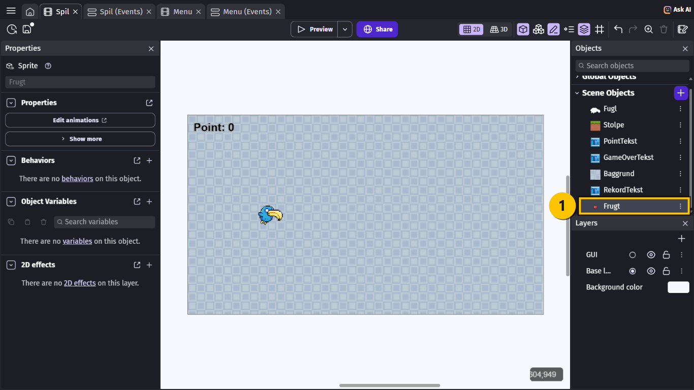

> **VIDEN**
>
> Hvis der ligger et æble på scenen efter **Add to the scene**, så markér det, og tryk
> **Delete**. Alle æbler skal laves af events — ligesom stolperne.
{: .lesson-info}

## Opgave 2 – FRUGT: Et æble i hvert hul

> **GØR DETTE**
>
> 1. Gå til **Spil (Events)**, og find event 9 — det, der laver stolperne.
> 2. Vælg **+ Add action** nederst i eventet, og vælg **Create an object**.
> 3. Vælg `Frugt` **(1)**.
> 4. Skriv `1316` i **X position** **(2)**.
> 5. Skriv `Stolpe.Y() - 240 + RandomInRange(20, 156)` i **Y position** **(3)**.
{: .lesson-action}

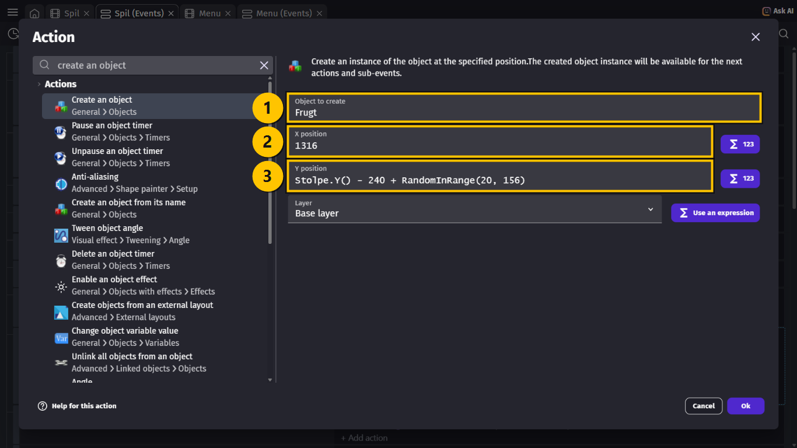

> **VIDEN**
>
> - `Stolpe.Y()` er Y for den **første** stolpe, eventet lavede — den nederste. Dens top er
>   bunden af hullet.
> - `- 240` går op til toppen af hullet.
> - `RandomInRange(20, 156)` flytter æblet et tilfældigt stykke ned i hullet. Så skal du
>   nogle gange op og nogle gange ned for at fange det.
> - `1316` er midt i stolpen, så æblet svæver lige i hullet.
{: .lesson-info}

> **GØR DETTE**
>
> Tilføj en action mere: `Frugt` **(1)** → **Scale** **(2)** → `2` **(3)**.
{: .lesson-action}

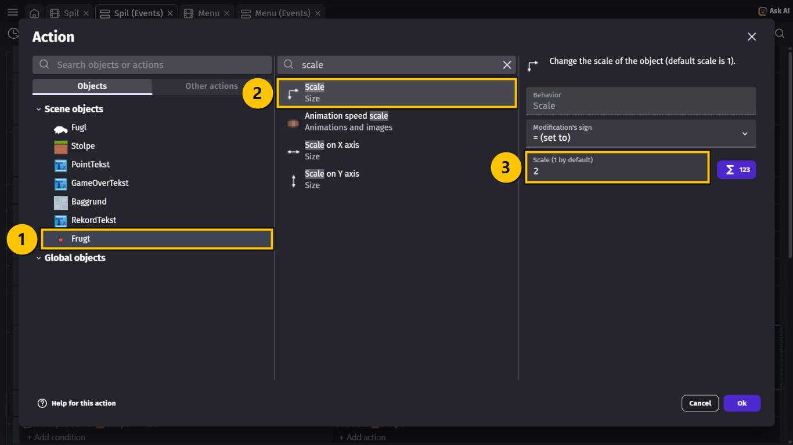

> **GØR DETTE**
>
> Find event 10 (det, der flytter stolperne), og tilføj **Add a force** for `Frugt` **(1)**
> med `-Fart` og `0` **(2)** — præcis som for `Stolpe`.
{: .lesson-action}

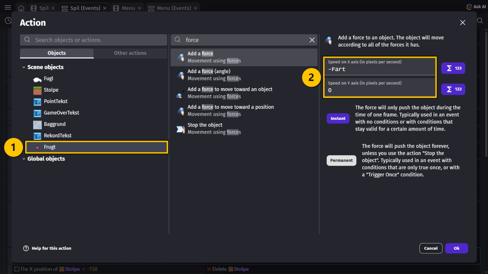

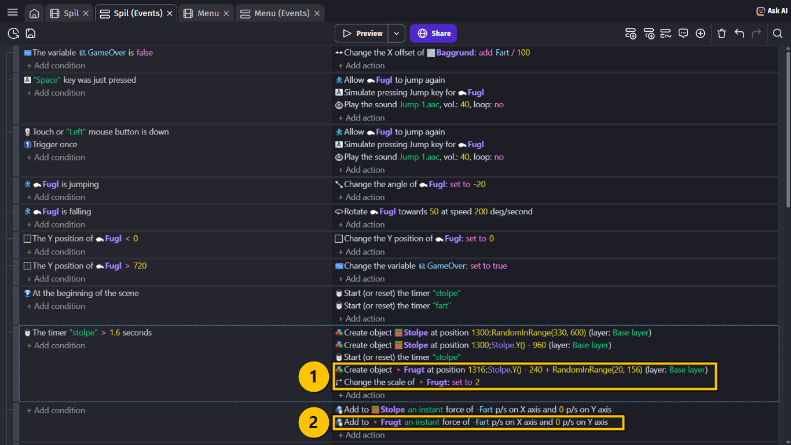

> **GØR DETTE**
>
> Lav et nyt event nederst, der sletter æblerne, når de er ude af skærmen:
> `Frugt` **X position < -150** → **Delete the object** `Frugt`.
{: .lesson-action}

## Opgave 3 – FRUGT: Fang æblet

> **GØR DETTE**
>
> 1. Vælg **+ Add a new event**, og vælg **+ Add condition**.
> 2. Vælg `Fugl` **(1)** → **Collision** **(2)**, og vælg `Frugt` **(3)**.
{: .lesson-action}

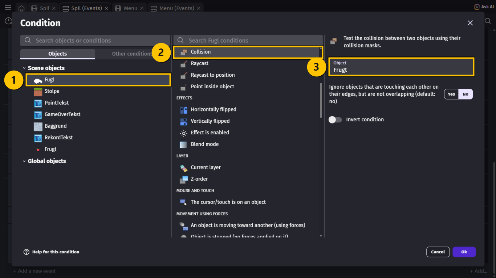

> **GØR DETTE**
>
> Giv eventet fire actions:
>
> 1. `Frugt` → **Delete the object**.
> 2. **Change variable value**: `Point` **(1)**, **+ (add)** **(2)** og `3` **(3)**.
{: .lesson-action}

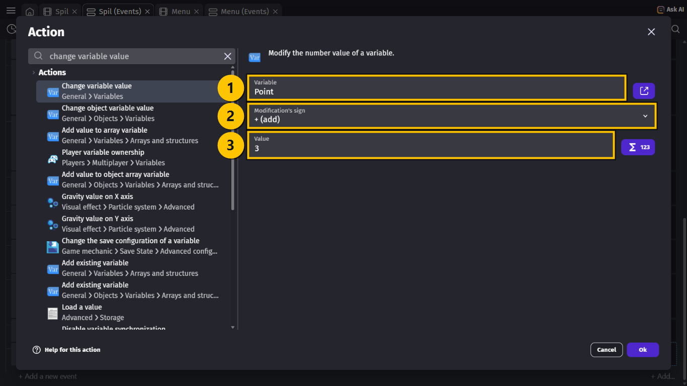

> **GØR DETTE**
>
> 3. `PointTekst` → **Text** → `"Point: " + Point`.
> 4. **Play a sound** med `Coins 1.aac` **(1)**, **Volume** `60` og **Pitch** `1.5` **(2)**.
{: .lesson-action}

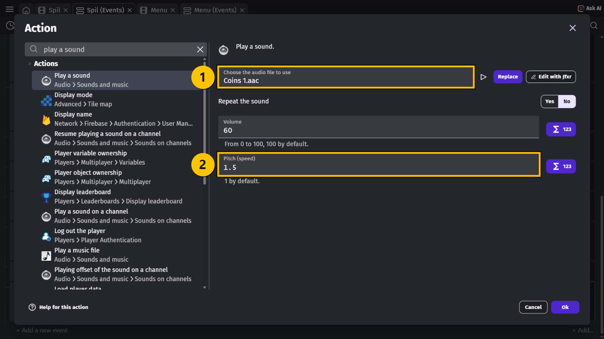

> **VIDEN**
>
> **Pitch** `1.5` får møntlyden til at lyde lysere end den normale. Så kan du høre forskel
> på et æble og en stolpe.
{: .lesson-info}

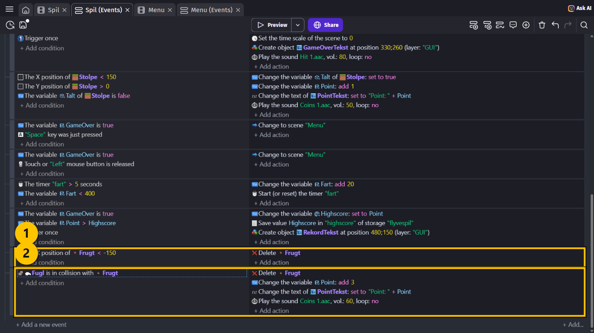

## Opgave 4 – MEDALJER: Bronze, sølv og guld

> **GØR DETTE**
>
> Lav et **Text**-objekt, der hedder `MedaljeTekst` **(1)**:
>
> 1. **Size** `48`, og sæt flueben ved **Bold** **(2)**.
> 2. Sæt flueben ved **Enabled** under **Outline**, og skriv `0;0;0` i **Color** **(3)**, så
>    kanten bliver sort.
> 3. Træk den **ikke** ind på scenen.
{: .lesson-action}

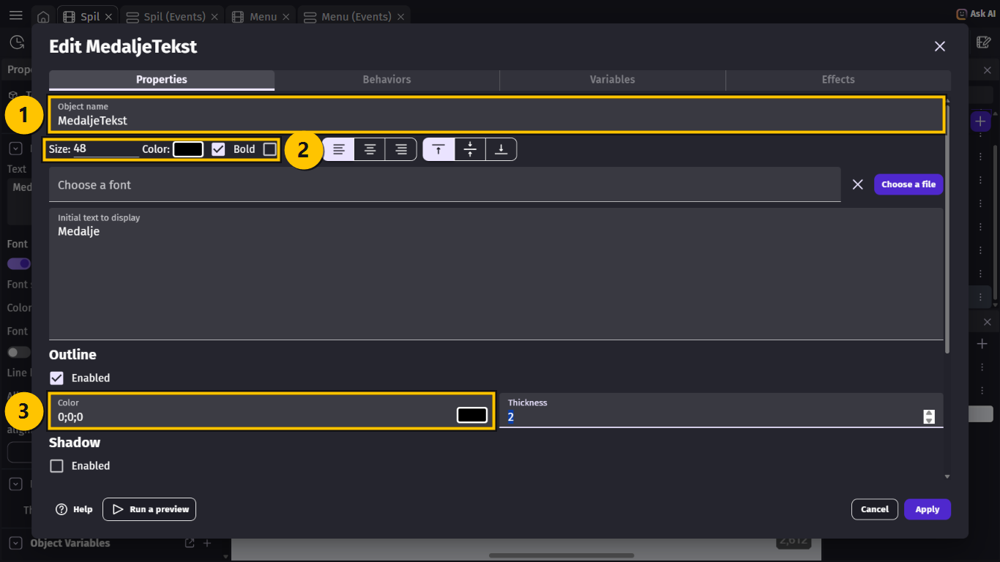

> **GØR DETTE**
>
> Lav et nyt event med fire conditions:
>
> 1. **Variable value** `GameOver` **True**.
> 2. **Variable value** `Point` **(1)** **≥ (greater or equal to)** **(2)** `5` **(3)**.
> 3. **Variable value** `Point` **< (less than)** `15`.
> 4. **Trigger once while true**.
{: .lesson-action}

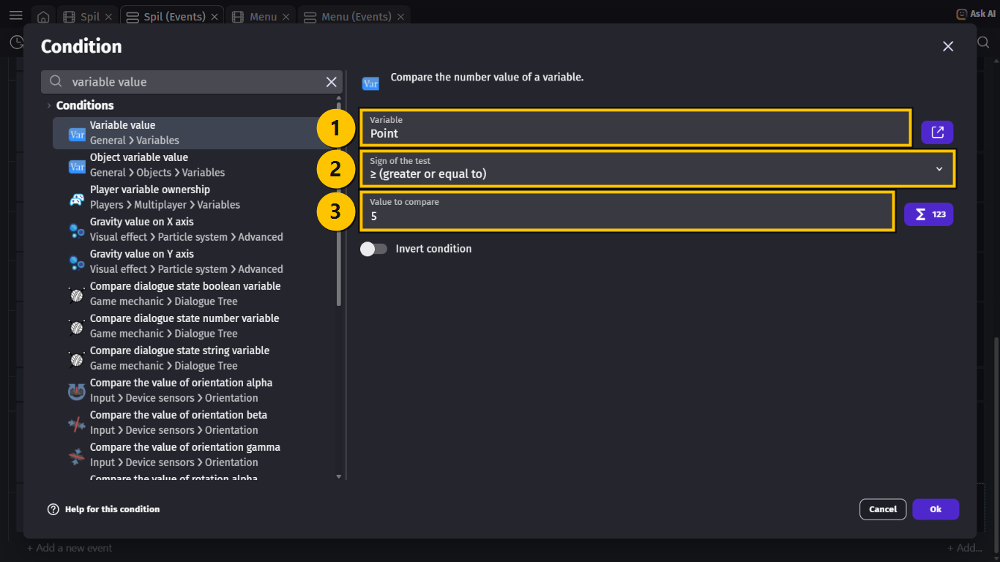

> **GØR DETTE**
>
> Giv eventet tre actions:
>
> 1. **Create an object** `MedaljeTekst` ved X `440` og Y `440` på laget `GUI`.
> 2. `MedaljeTekst` **(1)** → **Text** → `"BRONZE-MEDALJE"` **(2)**.
{: .lesson-action}

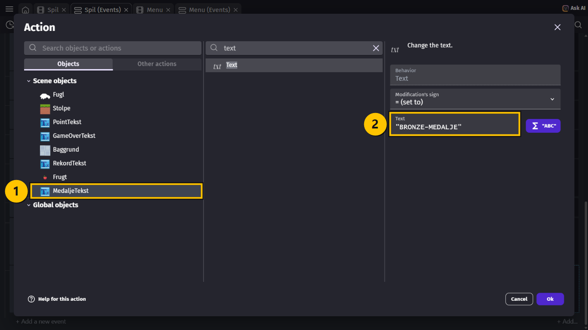

> **GØR DETTE**
>
> 3. `MedaljeTekst` → skriv `color`, og vælg **Color** **(1)**. Skriv `"205;127;50"` **(2)**.
{: .lesson-action}

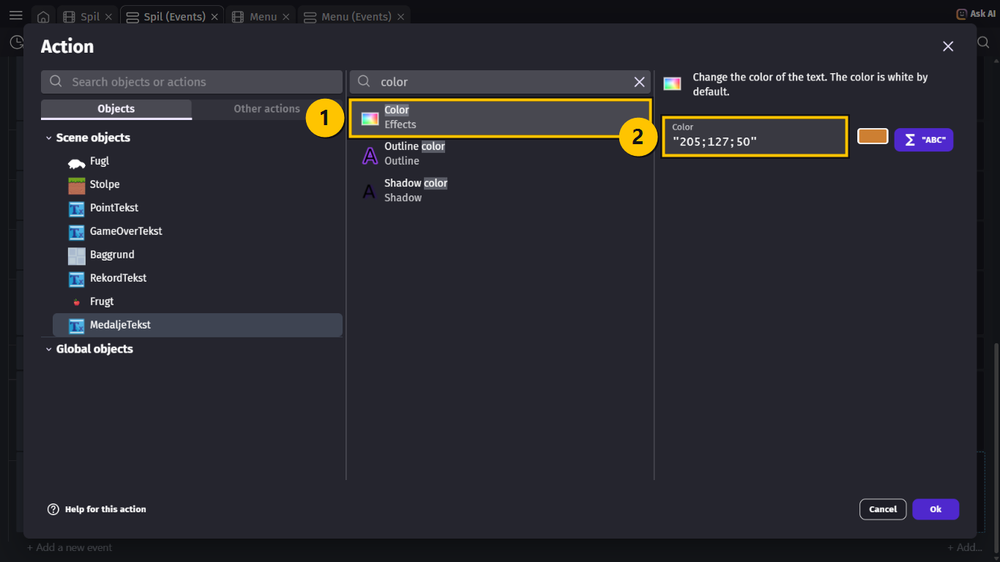

> **VIDEN**
>
> En farve skrives som tre tal: **rød;grøn;blå**, hvert fra `0` til `255`. `205;127;50` er
> bronzebrun. Du kan også klikke på den lille farvefirkant og vælge en farve.
{: .lesson-info}

> **GØR DETTE**
>
> Nu skal du lave sølv og guld. Det er næsten det samme event, så kopiér det:
>
> 1. Klik på et tomt sted i bronze-eventet, så det bliver markeret.
> 2. Tryk **Ctrl + C** og derefter **Ctrl + V** to gange. Nu har du tre ens events.
> 3. Ret det andet event til **sølv**: `Point ≥ 15`, `Point < 30`, teksten
>    `"SØLV-MEDALJE"` og farven `"192;192;192"`.
> 4. Ret det tredje event til **guld**: `Point ≥ 30`, teksten `"GULD-MEDALJE"` og farven
>    `"255;215;0"`. Slet conditionen `Point < ...` — guld har ingen grænse opad.
>
> Dobbeltklik på en condition eller action for at rette den.
{: .lesson-action}

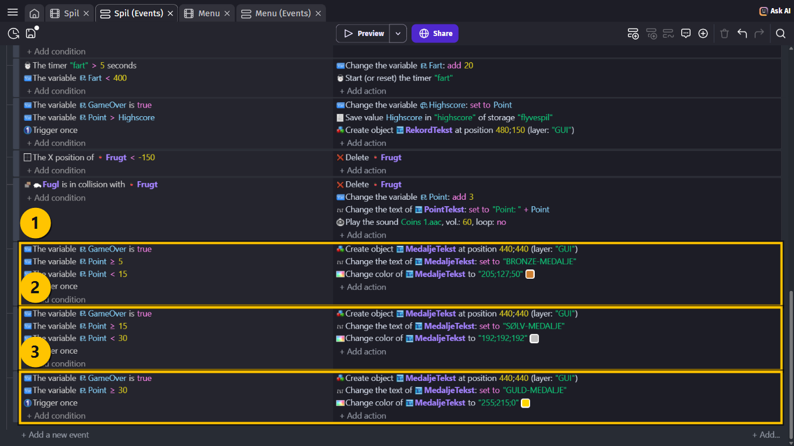

> **VIDEN**
>
> Hvert event passer til et bestemt antal point:
>
> | Medalje | Point |
> |---|---|
> | Bronze | 5–14 |
> | Sølv | 15–29 |
> | Guld | 30 eller mere |
>
> Får du under 5 point, er der ingen medalje.
{: .lesson-info}

## Hele koden samlet

> **VIDEN**
>
> Det her er nyt eller ændret:
>
> | # | Conditions (HVIS) | Actions (SÅ) |
> |---|---|---|
> | 9 | The timer `"stolpe"` **>** `1.6` seconds | … som før … Create object `Frugt` at position `1316`; `Stolpe.Y() - 240 + RandomInRange(20, 156)` Change the scale of `Frugt`: **set to** `2` |
> | 10 | *(ingen — sker hele tiden)* | Add to `Stolpe` an **instant** force of `-Fart` p/s on X axis and `0` p/s on Y axis Add to `Frugt` an **instant** force of `-Fart` p/s on X axis and `0` p/s on Y axis |
> | 19 | The X position of `Frugt` **<** `-150` | Delete `Frugt` |
> | 20 | `Fugl` is in collision with `Frugt` | Delete `Frugt` Change the variable `Point`: **add 3** Change the text of `PointTekst`: **set to** `"Point: " + Point` Play the sound `Coins 1.aac`, vol. `60`, pitch `1.5` |
> | 21 | The variable `GameOver` is **true** The variable `Point` **≥** `5` The variable `Point` **<** `15` Trigger once | Create object `MedaljeTekst` at position `440`; `440` (layer: `"GUI"`) Change the text of `MedaljeTekst`: **set to** `"BRONZE-MEDALJE"` Change color of `MedaljeTekst` to `"205;127;50"` |
> | 22 | The variable `GameOver` is **true** The variable `Point` **≥** `15` The variable `Point` **<** `30` Trigger once | … som 21, men `"SØLV-MEDALJE"` og `"192;192;192"` |
> | 23 | The variable `GameOver` is **true** The variable `Point` **≥** `30` Trigger once | … som 21, men `"GULD-MEDALJE"` og `"255;215;0"` |
{: .lesson-info}

## Prøv spillet! 🎮

> **GØR DETTE**
>
> 1. Tryk **Ctrl + S** for at gemme.
> 2. Gå til fanen **Menu**, og vælg **Preview**.
> 3. Prøv at fange æblerne, og se, hvilken medalje du kan vinde.
{: .lesson-action}

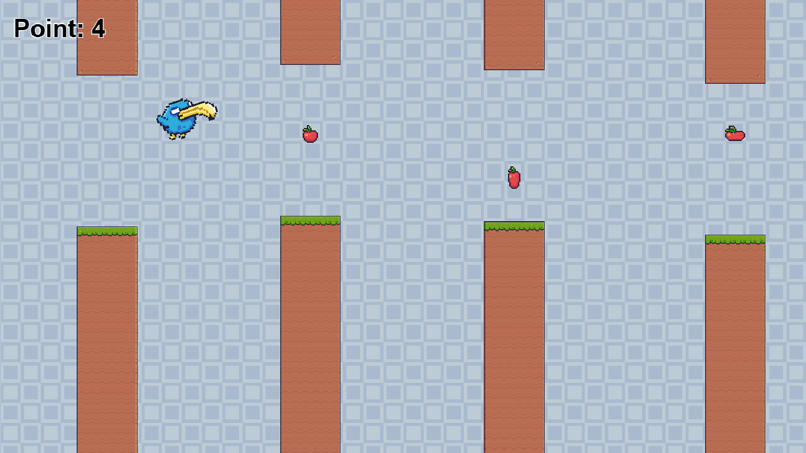

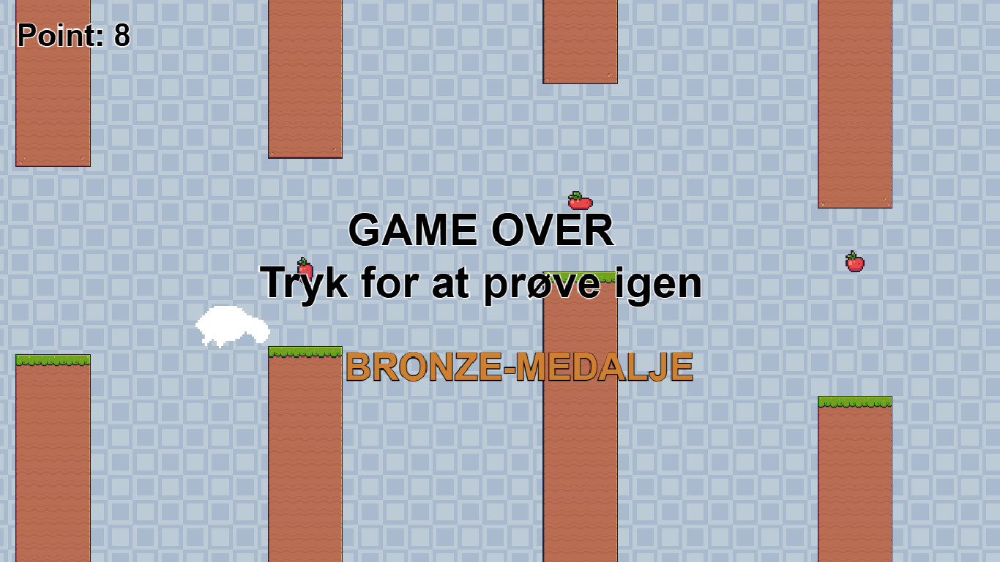

> **VIDEN**
>
> Sådan skal det virke:
>
> - Der svæver et æble i hvert hul — nogle gange højt, nogle gange lavt.
> - Fanger du et æble, forsvinder det, og du får 3 point og en lys møntlyd.
> - Når det er Game Over, får du en medalje, hvis du har mindst 5 point.
{: .lesson-info}

## Ekstra: Flere slags frugt

> **GØR DETTE**
>
> Prøv at hente **Bananas** eller **Cherries** fra mappen **Item**. Lav dem på samme måde
> som æblerne, og giv dem flere point — fx 5 for et kirsebær.
{: .lesson-action}

> **VIDEN**
>
> Hvis kirsebærrene skal være sjældne, kan du lave dem med en egen timer, fx hvert 7.
> sekund i stedet for hvert 1,6 sekund.
{: .lesson-info}

## Du er færdig med flyvespillet ✅

> **VIDEN**
>
> Du har lavet det hele:
>
> - En fugl med tyngdekraft, der basker med mellemrumstasten, musen og på mobilen.
> - Stolper med huller, point og Game Over.
> - Fart, der stiger, og lyd.
> - En menu og en highscore, der bliver gemt.
> - Æbler, du kan fange, og medaljer.
> - Og dit spil ligger på nettet.
>
> Husk at vælge **Share** → **gd.games** → **Publish new version**, så dine venner også kan
> fange æbler og vinde medaljer. Tillykke! 🎉
{: .lesson-info}

## Hvis noget går galt

| Problem | Prøv dette |
|---|---|
| Der er et æble, der står stille på skærmen. | **GØR DETTE:** Markér æblet på scenen `Spil`, og tryk **Delete**. Æblerne skal kun laves af events. |
| Æblerne er ikke i hullerne. | **GØR DETTE:** Tjek **Y position** i event 9. Der skal stå `Stolpe.Y() - 240 + RandomInRange(20, 156)`, og actionen skal ligge **efter** de to stolper. |
| Æblerne står stille. | **GØR DETTE:** Tilføj **Add a force** for `Frugt` i event 10. |
| Æblerne er meget små. | **GØR DETTE:** Tjek, at **Scale** for `Frugt` er `2` i event 9. |
| Jeg får ingen point for æblerne. | **GØR DETTE:** Tjek, at event 20 tjekker **Collision** mellem `Fugl` og `Frugt` — ikke `Stolpe`. |
| Der kommer flere medaljer oven i hinanden. | **GØR DETTE:** Tjek grænserne: bronze `< 15`, sølv `≥ 15` og `< 30`, guld `≥ 30`. |
| Jeg kan aldrig få guld. | **GØR DETTE:** Slet conditionen `Point < ...` i guld-eventet. |
| Medaljen er svær at læse. | **GØR DETTE:** Sæt **Outline** på `MedaljeTekst`, og gør kanten sort: `0;0;0`. |
{: .lesson-help}
