# OPGAVER TIL GDevelop – RUMSPIL – INTRO

> **VIDEN**
>
> I bokse med en hel kant står der, hvad du skal gøre. I bokse med en stiplet kant står der
> viden, som hjælper dig med at forstå det, du laver.
>
> På billederne viser gule kasser, hvor du skal klikke. Tallene i gule cirkler passer til
> tallene i trinene, fx **(1)** og **(2)**.
{: .lesson-info}

I denne lektion laver du et nyt spil. Du henter et rumskib og en baggrund med stjerner,
og til sidst kan du flyve rundt i rummet med piletasterne.

## To ord du skal kende

> **VIDEN**
>
> - **Behavior** — en evne, du giver et objekt. Med en behavior kan et objekt fx flyve
>   rundt, uden at du selv skal bygge det.
> - **Tiled Sprite** — et billede, der bliver gentaget igen og igen, som fliser på et gulv.
>   Det er godt til baggrunde, fordi det kan være lige så stort, du vil.
{: .lesson-info}

## Opgave 1 – INTRO: Lav et nyt projekt

> **VIDEN**
>
> Har du ikke GDevelop på din computer endnu, så følg først
> [Opgave 1 i platformspillet](../../platformspil/01-intro/). Der står, hvordan du henter
> og installerer programmet.
{: .lesson-info}

> **GØR DETTE**
>
> 1. Åbn **GDevelop**.
> 2. Vælg **Create** i menuen til venstre.
> 3. Vælg **+ Create new game**.
> 4. Vælg **Empty project** **(1)** — det tomme projekt.
{: .lesson-action}

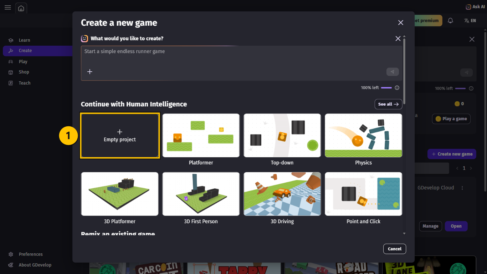

> **GØR DETTE**
>
> 1. Lad skærmstørrelsen stå på **Desktop & Mobile landscape (1280x720)** **(1)**.
> 2. Find feltet **Project name** **(2)**. Slet navnet, og skriv `Rumspil1`.
> 3. Find **Where to store this project**. Vælg din egen computer, og vælg en mappe, du kan
>    finde igen, fx `Dokumenter\GDevelop`.
> 4. Vælg **Create new game** **(3)**.
{: .lesson-action}

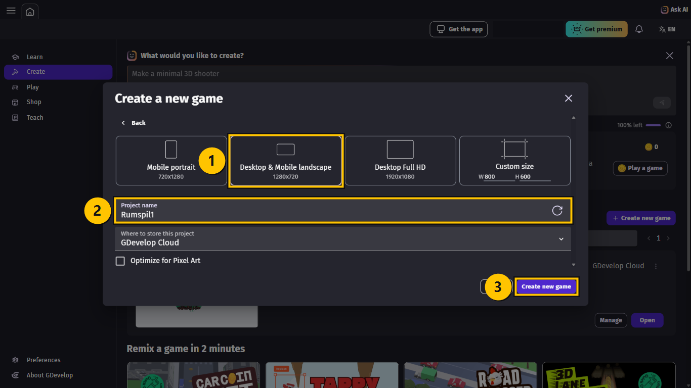

> **VIDEN**
>
> Billedet viser **GDevelop Cloud**, fordi det er taget i en browser. I programmet bliver
> spillet gemt på din egen computer.
{: .lesson-info}

> **VIDEN**
>
> Skærmen er bred, så vores rumskib flyver fra venstre mod højre. Asteroider og fjender
> kommer senere ind fra højre side.
{: .lesson-info}

## Opgave 2 – INTRO: Hent rumskibet og baggrunden

> **GØR DETTE**
>
> Vælg **+ Add object** **(1)** i **Objects**-feltet til højre.
{: .lesson-action}

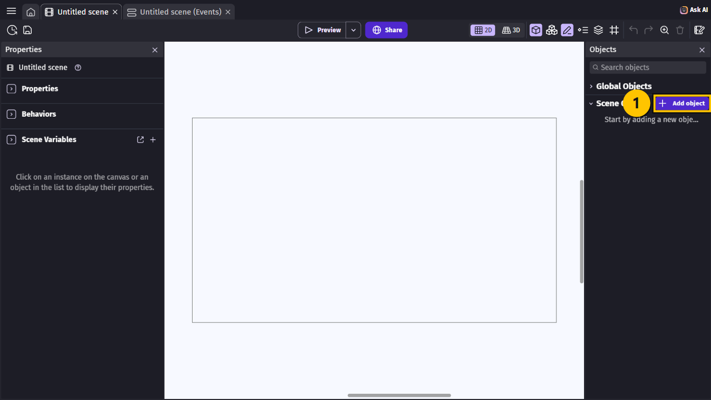

> **GØR DETTE**
>
> 1. Tjek, at fanen **Asset Store** er valgt.
> 2. Skriv `space shooter` i feltet **Search assets** **(1)**.
{: .lesson-action}

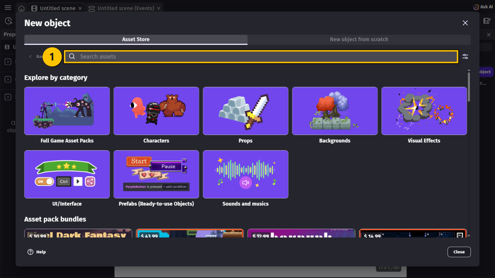

> **GØR DETTE**
>
> Vælg pakken **Space Shooter Redux** **(1)** med **140 Assets**.
{: .lesson-action}

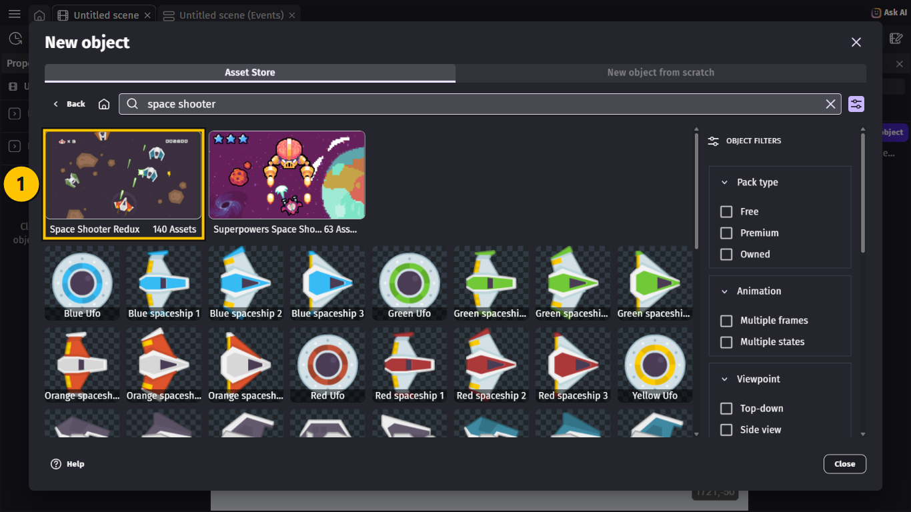

> **VIDEN**
>
> Pakken er lavet af **Kenney**, og du må bruge den gratis (CC0). Den har mapper med skibe,
> fjender, meteorer, laserskud, power-ups og baggrunde.
>
> Vi henter **ikke** alle 140 på én gang. Så bliver listen med objekter alt for lang. I hver
> lektion henter vi kun det, vi skal bruge.
{: .lesson-info}

> **GØR DETTE**
>
> Vælg mappen **Ship** **(1)**.
{: .lesson-action}

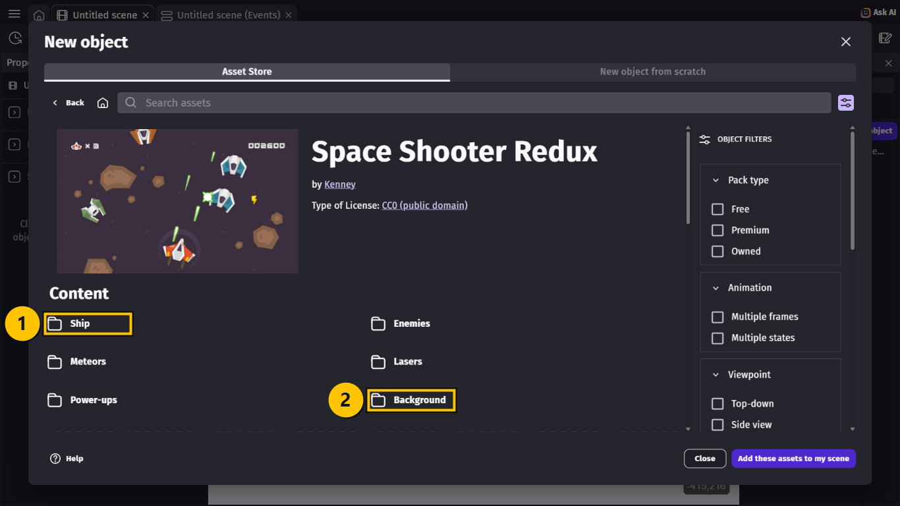

> **GØR DETTE**
>
> 1. Vælg **Blue spaceship 1** **(1)**.
> 2. Vælg **Add to the scene** **(1)** nederst til højre.
{: .lesson-action}

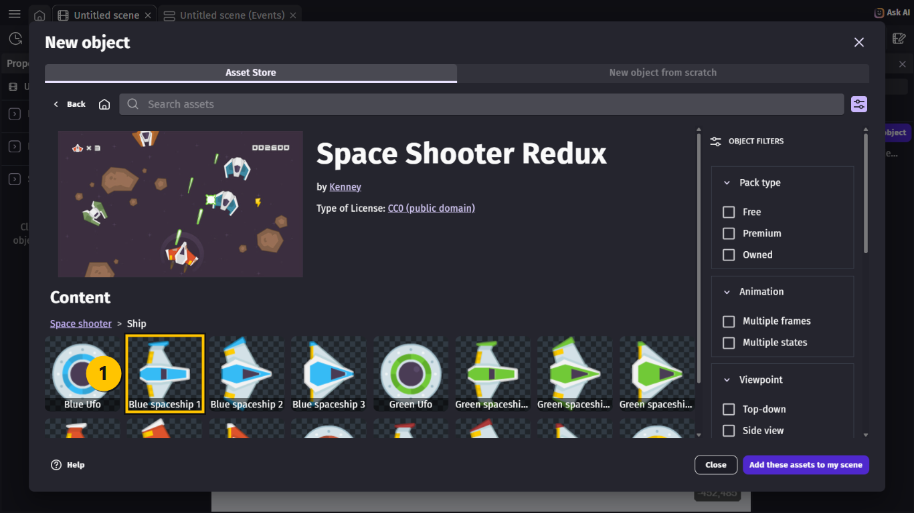

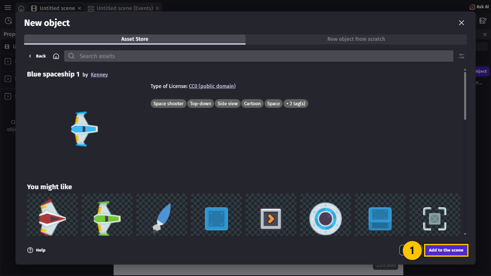

> **VIDEN**
>
> Du må gerne vælge et skib med en anden farve. Resten af lektionen virker på samme måde.
{: .lesson-info}

> **GØR DETTE**
>
> 1. Vælg **Back** øverst til venstre, og vælg **Space shooter** for at komme tilbage til
>    pakken.
> 2. Vælg mappen **Background** (**(2)** på billedet med mapperne ovenfor).
> 3. Vælg **dark purple space** **(1)**.
> 4. Vælg **Add to the scene**.
> 5. Vælg **Close** for at lukke Asset Store.
{: .lesson-action}

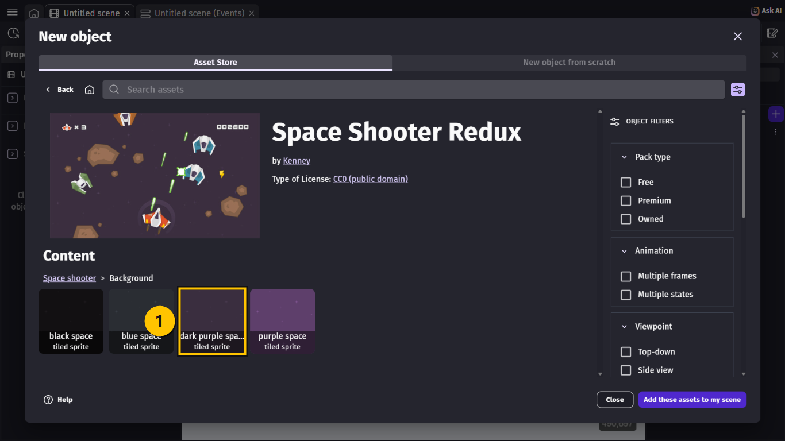

## Opgave 3 – INTRO: Giv objekterne danske navne

> **VIDEN**
>
> Nu står der to objekter under **Scene Objects** **(1)**: `Blue_spaceship_1` og
> `dark_purple_space`. Vi giver dem korte navne, så de er nemme at finde i dine events.
{: .lesson-info}

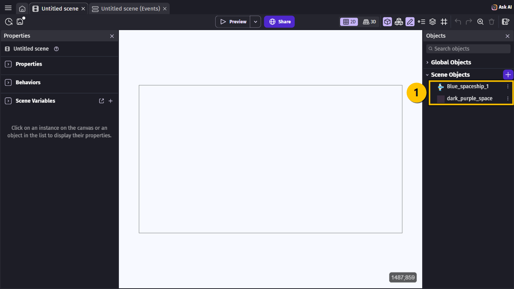

> **GØR DETTE**
>
> 1. Højreklik på `Blue_spaceship_1`.
> 2. Vælg **Rename** **(1)**.
> 3. Skriv `Skib`, og tryk **Enter**.
> 4. Gør det samme med `dark_purple_space`. Kald den `Baggrund`.
{: .lesson-action}

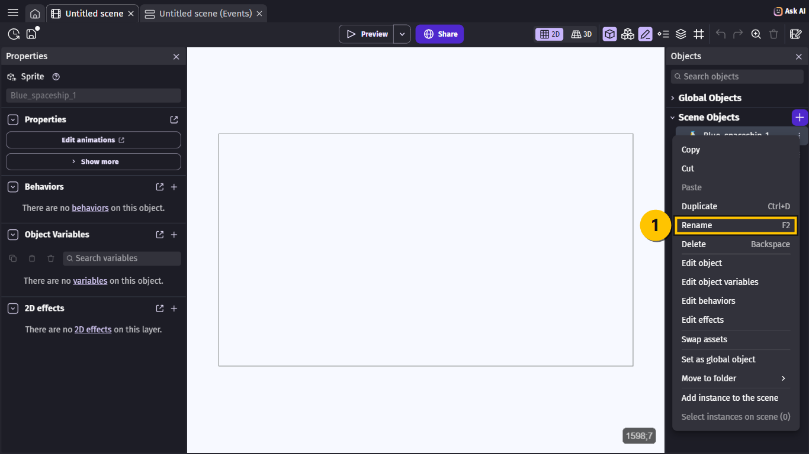

> **VIDEN**
>
> Du kan også markere et objekt og trykke **F2** for at give det et nyt navn.
{: .lesson-info}

## Opgave 4 – INTRO: Sæt baggrunden og skibet ind på scenen

> **VIDEN**
>
> Objekterne ligger i listen, men de er ikke på scenen endnu. Det hvide felt med den tynde
> ramme er skærmen i dit spil. Alt, hvad der er inden for rammen, kan spilleren se.
{: .lesson-info}

> **GØR DETTE**
>
> 1. Træk `Baggrund` fra listen ind på scenen **(1)**.
> 2. Klik på den lille firkant, så den er markeret.
{: .lesson-action}

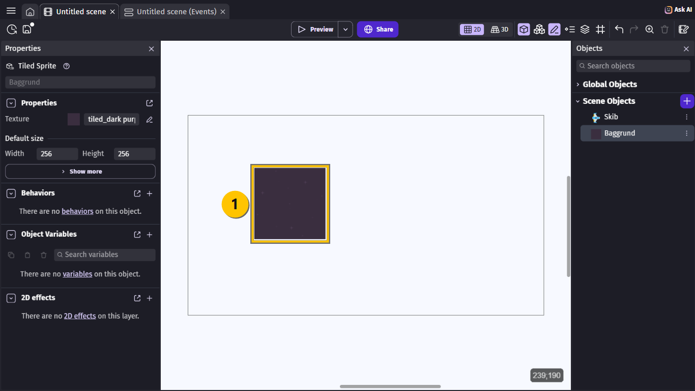

> **GØR DETTE**
>
> Til venstre kan du nu se baggrundens egenskaber.
>
> 1. Skriv `0` i både **X** og **Y** **(1)**.
> 2. Klik på den lille kæde ved **W** og **H** **(2)**, så de ikke hænger sammen.
> 3. Skriv `1280` i **W** og `720` i **H** **(2)**.
> 4. Klik på hængelåsen **(3)**, så baggrunden bliver låst.
{: .lesson-action}

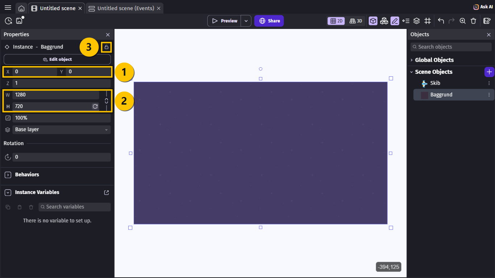

> **VIDEN**
>
> - **X** og **Y** er, hvor objektet står. `0` og `0` er øverste venstre hjørne.
> - **W** er bredden, og **H** er højden. Skærmen er 1280 bred og 720 høj.
> - Kæden sørger for, at bredde og højde passer sammen. Den skal være slået fra her, ellers
>   bliver baggrunden 1280 høj.
> - Når baggrunden er låst, kan du ikke komme til at flytte den, når du trækker andre ting
>   ind.
{: .lesson-info}

> **GØR DETTE**
>
> Træk `Skib` ind i venstre side af scenen **(1)**.
{: .lesson-action}

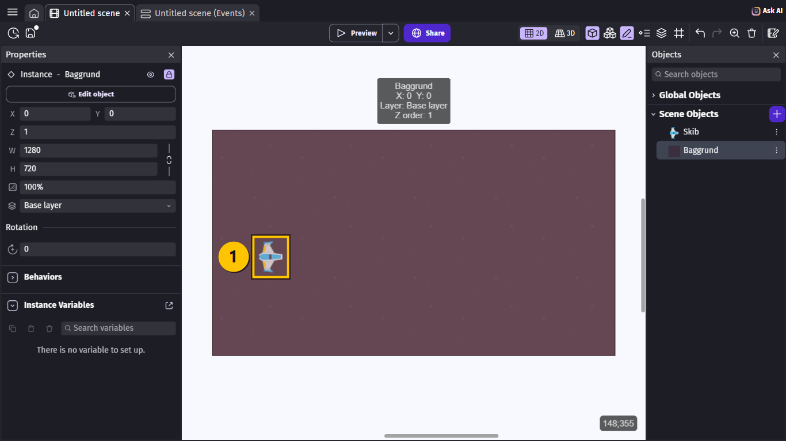

## Opgave 5 – INTRO: Giv skibet evnen til at flyve

> **GØR DETTE**
>
> 1. Vælg `Skib` **(1)** i listen til højre.
> 2. Find **Behaviors** til venstre. Vælg **+** **(2)**.
{: .lesson-action}

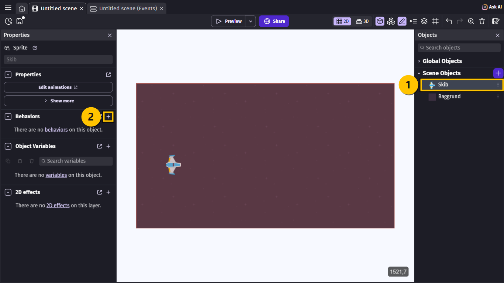

> **GØR DETTE**
>
> Vælg **Top-down movement (4 or 8 directions)** **(1)**.
{: .lesson-action}

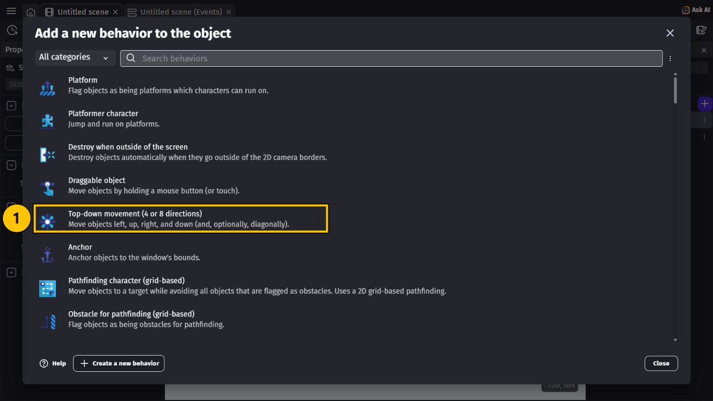

> **VIDEN**
>
> **Top-down movement** betyder, at objektet kan flytte sig op, ned, til venstre og til
> højre — som hvis man kigger ned på det ovenfra. Behavioren styres med piletasterne helt
> af sig selv.
{: .lesson-info}

> **GØR DETTE**
>
> Nu står **TopDownMovement** under **Behaviors**. Ret disse tal:
>
> 1. Skriv `1200` i både **Acceleration** og **Deceleration** **(1)**.
> 2. Skriv `400` i **Max. speed** **(2)**.
> 3. Slå **Rotate object** fra **(3)**.
{: .lesson-action}

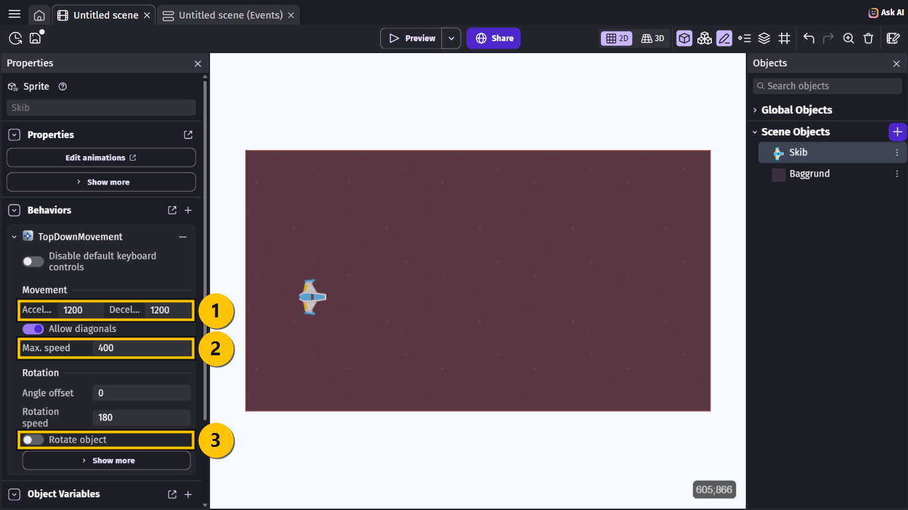

> **VIDEN**
>
> - **Acceleration** er, hvor hurtigt skibet kommer op i fart.
> - **Deceleration** er, hvor hurtigt det bremser, når du slipper tasten.
> - **Max. speed** er skibets topfart.
> - **Rotate object** ville dreje skibet i den retning, det flyver. Vi vil have, at det altid
>   peger fremad, så det kan skyde den rigtige vej.
{: .lesson-info}

## Opgave 6 – INTRO: Hold skibet inde på skærmen

> **VIDEN**
>
> Lige nu kan skibet flyve ud over kanten og forsvinde. Det klarer vi med endnu en behavior.
{: .lesson-info}

> **GØR DETTE**
>
> 1. Tjek, at `Skib` stadig er valgt.
> 2. Vælg **+** ved **Behaviors** igen.
> 3. Skriv `screen` i søgefeltet **(1)**.
> 4. Vælg **Stay on Screen** **(2)**.
{: .lesson-action}

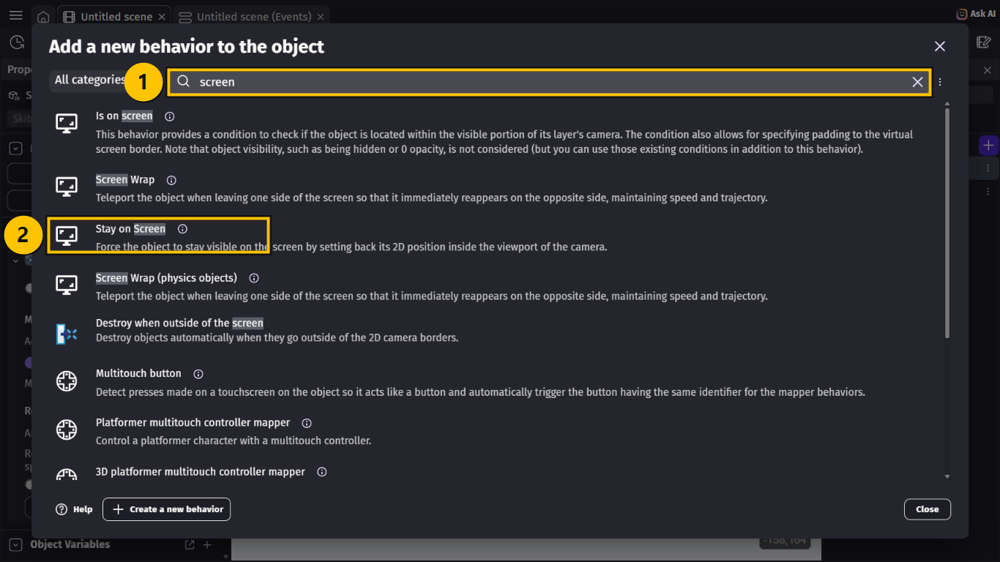

> **VIDEN**
>
> **Stay on Screen** er en udvidelse, som GDevelop henter første gang, du bruger den. Det
> tager et øjeblik. Bagefter står **StayOnScreen** under **Behaviors** **(1)**.
>
> Tallene **margin** er, hvor langt fra kanten skibet skal stoppe. Lad dem stå på `0`.
{: .lesson-info}

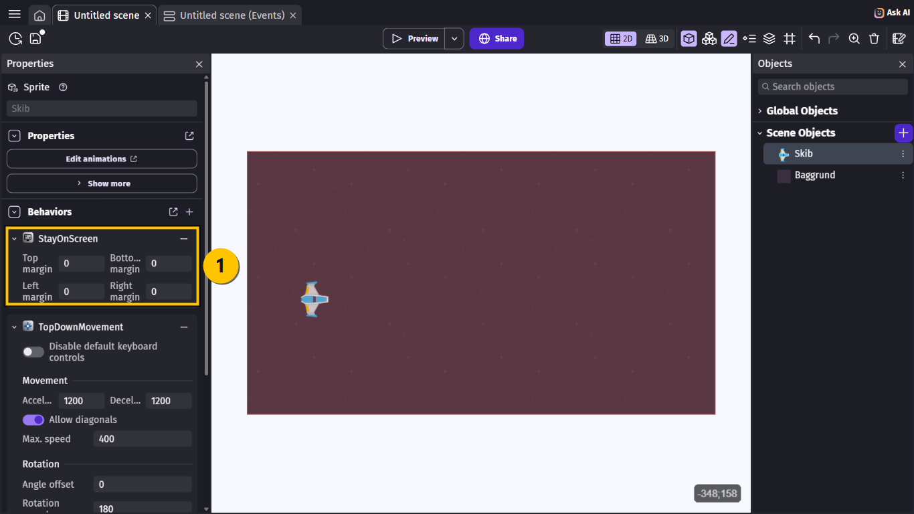

## Opgave 7 – INTRO: Få stjernerne til at flyve forbi

> **VIDEN**
>
> Skibet flyver ikke rigtigt fremad — det bliver på skærmen. I stedet får vi baggrunden til
> at glide mod venstre. Så ser det ud, som om skibet flyver mod højre gennem rummet.
{: .lesson-info}

> **GØR DETTE**
>
> 1. Vælg fanen **Untitled scene (Events)** **(1)** øverst.
> 2. Vælg **Add an event** **(2)**.
{: .lesson-action}

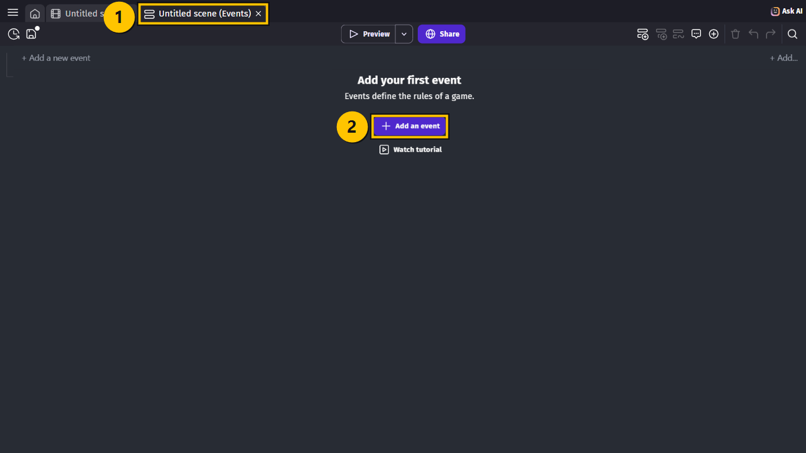

> **GØR DETTE**
>
> 1. Luk boksen med videoen, hvis den kommer frem **(2)**.
> 2. Vælg **+ Add action** **(1)**.
{: .lesson-action}

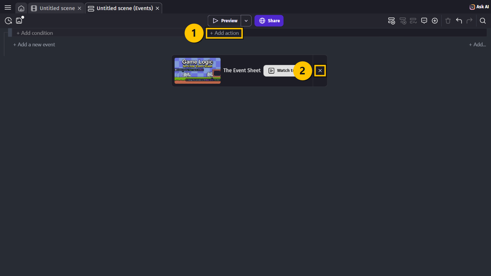

> **VIDEN**
>
> Vi tilføjer **ingen** condition. Et event uden condition sker hele tiden — ca. 60 gange
> i sekundet, så længe spillet kører.
{: .lesson-info}

> **GØR DETTE**
>
> Vælg `Baggrund` **(1)**.
{: .lesson-action}

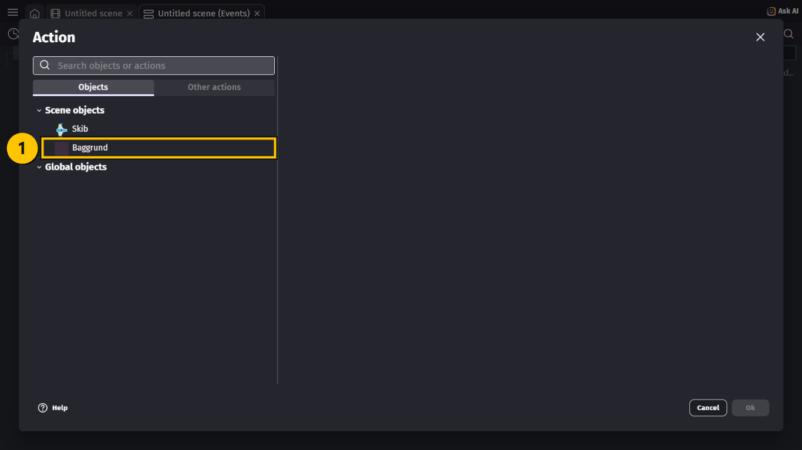

> **GØR DETTE**
>
> 1. Skriv `offset` i søgefeltet **(1)**.
> 2. Vælg **Image X Offset** **(2)**.
{: .lesson-action}

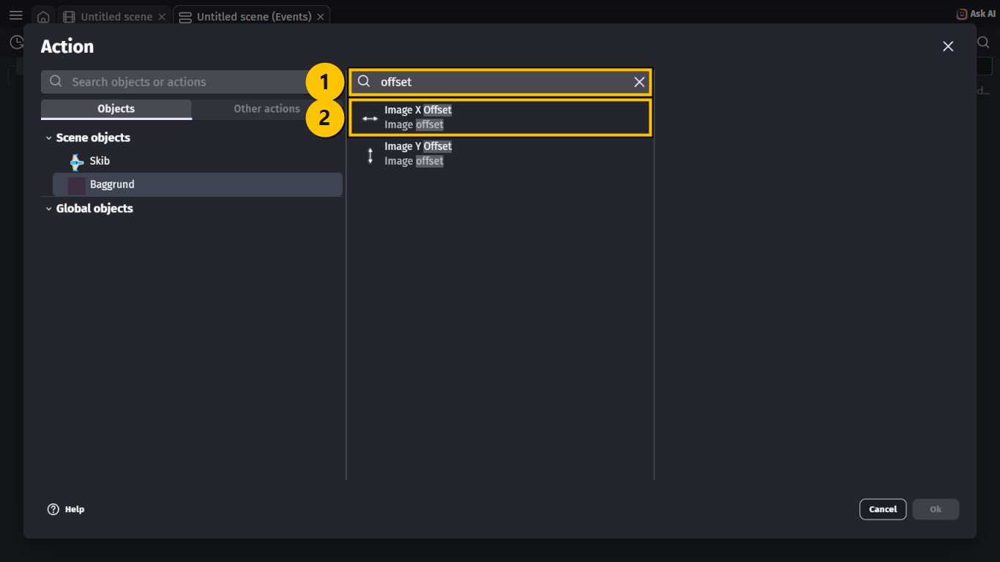

> **GØR DETTE**
>
> 1. Vælg **+ (add)** i **Modification's sign** **(1)**.
> 2. Skriv `2` i **Value** **(2)**.
> 3. Vælg **Ok** **(3)**.
{: .lesson-action}

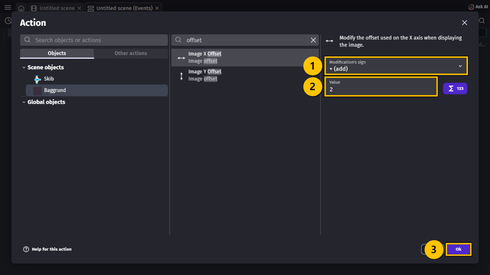

> **VIDEN**
>
> **Offset** betyder, hvor billedet starter. Når vi lægger 2 til hele tiden, glider
> stjernerne 2 pixels mod venstre hver gang. Det er en **Tiled Sprite**, så der kommer
> hele tiden nye stjerner ind fra højre.
{: .lesson-info}

## Hele koden samlet

> **VIDEN**
>
> Sådan ser din Events-side ud, når du er færdig **(1)**:
>
> | # | Conditions (HVIS) | Actions (SÅ) |
> |---|---|---|
> | 1 | *(ingen — sker hele tiden)* | Change the X offset of `Baggrund`: **add 2** |
{: .lesson-info}

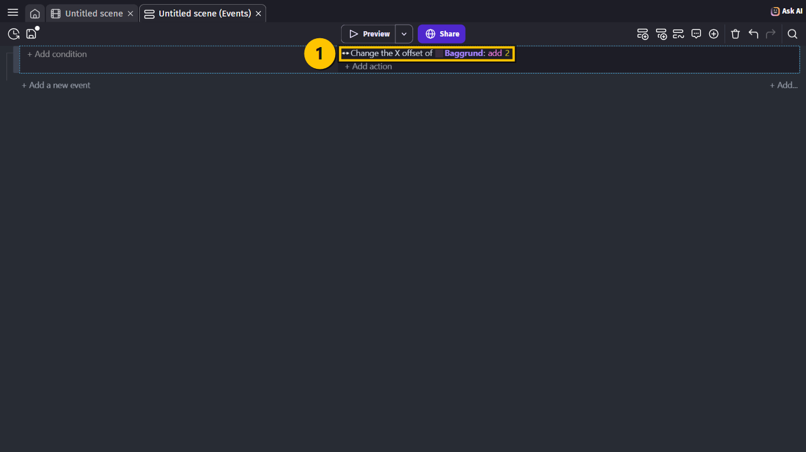

## Prøv spillet! 🎮

> **GØR DETTE**
>
> 1. Tryk **Ctrl + S** for at gemme.
> 2. Vælg **Preview** øverst.
> 3. Flyv rundt med piletasterne.
> 4. Prøv at flyve ud over kanten.
{: .lesson-action}

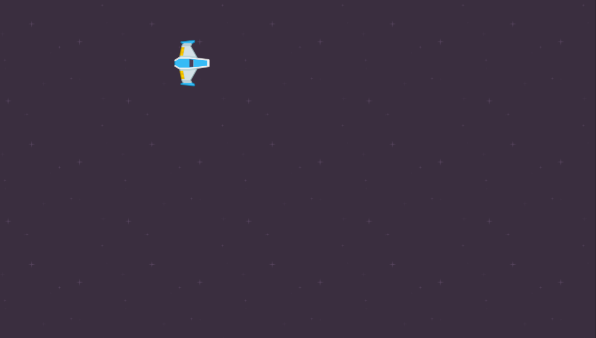

> **VIDEN**
>
> Sådan skal det virke:
>
> - Stjernerne glider hele tiden mod venstre.
> - Skibet flyver i alle retninger — også på skrå — og bremser, når du slipper tasten.
> - Skibet peger altid mod højre.
> - Skibet stopper ved kanten af skærmen.
{: .lesson-info}

## Ekstra: Hurtigere eller langsommere rum

> **GØR DETTE**
>
> Prøv at skifte `2` ud med `1` eller `6` i dit event. Hvad sker der med stjernerne?
{: .lesson-action}

> **VIDEN**
>
> Et større tal får det til at se ud, som om skibet flyver hurtigere. Vælg den fart, du
> synes er sjovest.
{: .lesson-info}

## Du er færdig med INTRO ✅

> **VIDEN**
>
> Du er klar til næste lektion, når alt dette passer:
>
> - Mit projekt hedder **Rumspil1**.
> - Jeg har objekterne `Skib` og `Baggrund`.
> - Baggrunden fylder hele skærmen og er låst.
> - Skibet kan flyve med piletasterne og bliver inde på skærmen.
> - Stjernerne glider mod venstre.
> - Jeg har gemt projektet.
{: .lesson-info}

> **VIDEN**
>
> Næste gang lærer du at skyde med laser.
{: .lesson-info}

## Hvis noget går galt

| Problem | Prøv dette |
|---|---|
| Jeg kan ikke finde **Space Shooter Redux**. | **GØR DETTE:** Tjek, at du har internet. Søg efter `space shooter` igen. |
| Objekterne står i listen, men ikke på scenen. | **GØR DETTE:** Træk dem fra listen ind på scenen. |
| Baggrunden blev 1280 høj. | **GØR DETTE:** Klik på kæden ved **W** og **H**, og skriv `720` i **H** igen. |
| Jeg kommer til at flytte baggrunden. | **GØR DETTE:** Tryk **Ctrl + Z**. Markér baggrunden, og klik på hængelåsen. |
| Skibet er gemt bag baggrunden. | **GØR DETTE:** Markér skibet, og skriv et større tal i **Z**, fx `2`. |
| Skibet drejer rundt, når det flyver. | **GØR DETTE:** Slå **Rotate object** fra under **TopDownMovement**. |
| Skibet kan flyve ud af skærmen. | **GØR DETTE:** Tjek, at `Skib` har behavioren **StayOnScreen**. |
| Stjernerne står stille. | **GØR DETTE:** Tjek dit event. Der skal stå **add 2**, ikke **set to 2**. |
| Stjernerne flyver den forkerte vej. | **GØR DETTE:** Tjek, at der står **+ (add)** og ikke **- (subtract)**. |
{: .lesson-help}
