# OPGAVER TIL GDevelop – RUMSPIL – SKYD!

> **VIDEN**
>
> I bokse med en hel kant står der, hvad du skal gøre. I bokse med en stiplet kant står der
> viden, som hjælper dig med at forstå det, du laver.
>
> På billederne viser gule kasser, hvor du skal klikke. Tallene i gule cirkler passer til
> tallene i trinene, fx **(1)** og **(2)**.
{: .lesson-info}

I denne lektion får dit rumskib en laser. Når du holder **mellemrumstasten** nede, skyder
skibet laserskud mod højre — men ikke alt for hurtigt.

## Tre ord du skal kende

> **VIDEN**
>
> - **Create object** — en handling, der laver et nyt objekt, mens spillet kører. Hvert
>   skud er et nyt objekt.
> - **Force** — en kraft, der skubber et objekt. En kraft på `900` mod højre flytter
>   objektet 900 pixels hvert sekund.
> - **Timer** — et stopur i spillet. Vi bruger det til at tælle, hvor lang tid der er gået
>   siden sidste skud.
{: .lesson-info}

## Opgave 1 – SKYD!: Hent en laser

> **GØR DETTE**
>
> 1. Åbn projektet **Rumspil1**.
> 2. Vælg **+ Add object** i **Objects**-feltet.
> 3. Søg efter `space shooter`, og vælg pakken **Space Shooter Redux**.
> 4. Vælg mappen **Lasers**.
> 5. Vælg **Blue laser 01** **(1)**.
{: .lesson-action}

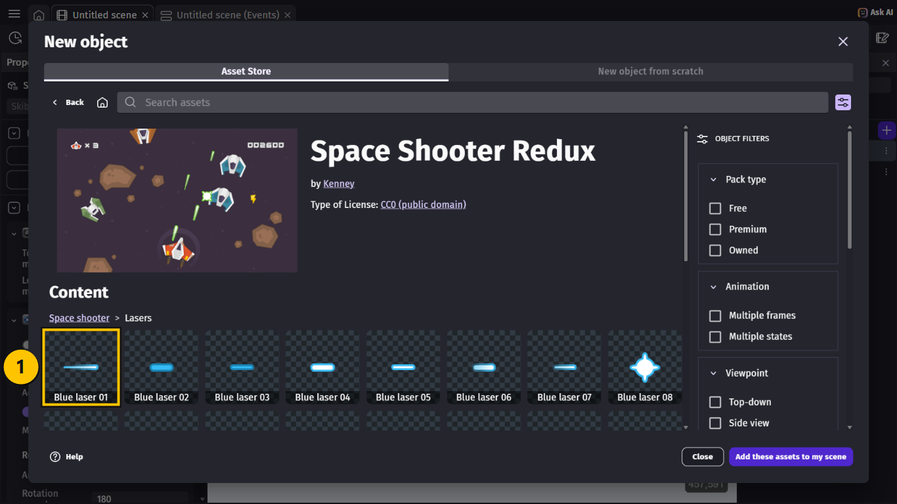

> **GØR DETTE**
>
> 1. Vælg **Add to the scene** **(1)**.
> 2. Vælg **Close**.
{: .lesson-action}

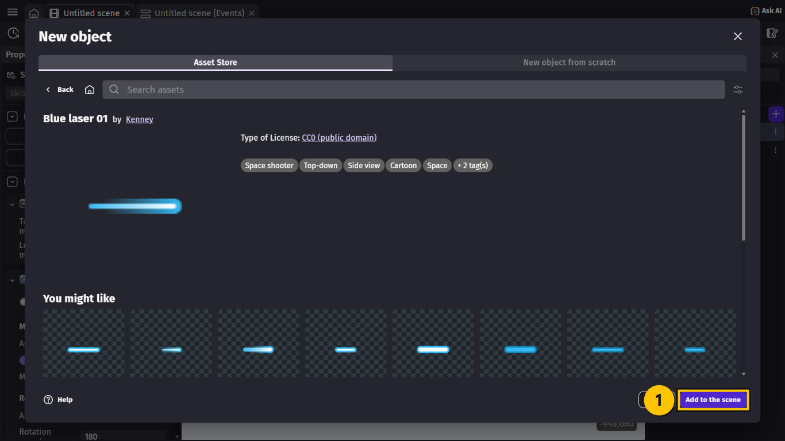

> **GØR DETTE**
>
> Giv `Blue_laser_01` det nye navn `Laser` **(1)**. Markér den, tryk **F2**, skriv `Laser`,
> og tryk **Enter**.
{: .lesson-action}

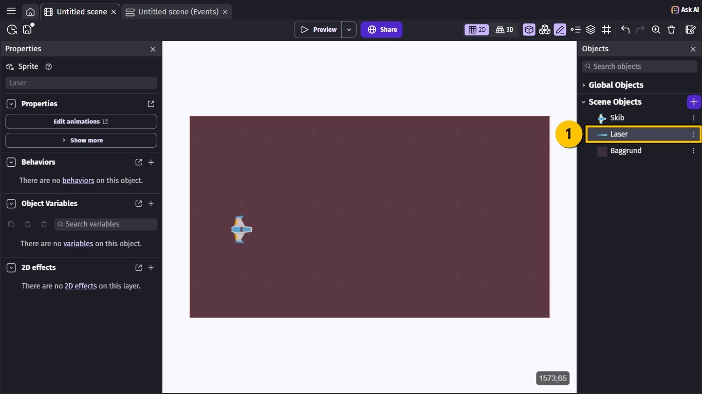

> **VIDEN**
>
> Du skal **ikke** trække laseren ind på scenen. Skuddene bliver lavet af et event, når du
> trykker på mellemrumstasten.
{: .lesson-info}

## Opgave 2 – SKYD!: Slet skud, der flyver ud af skærmen

> **VIDEN**
>
> Hvert skud, du skyder, er et nyt objekt. Hvis de aldrig blev slettet, ville der til sidst
> være tusindvis af skud langt ude i rummet, og spillet ville blive langsomt.
{: .lesson-info}

> **GØR DETTE**
>
> 1. Tjek, at `Laser` er valgt.
> 2. Vælg **+** ved **Behaviors** til venstre.
> 3. Vælg **Destroy when outside of the screen** **(1)**.
{: .lesson-action}

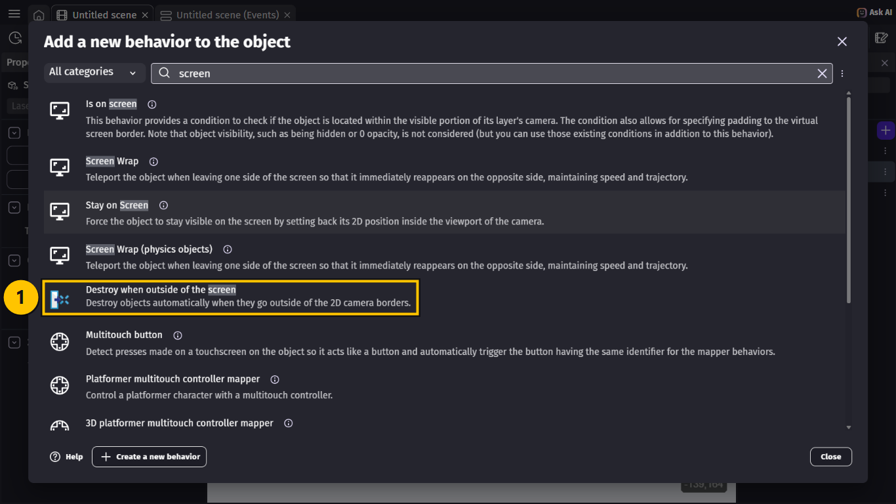

> **VIDEN**
>
> Nu står **DestroyOutside** under **Behaviors** **(1)**. Laseren bliver slettet, når den
> er kommet 200 pixels uden for skærmen. Lad tallene stå.
{: .lesson-info}

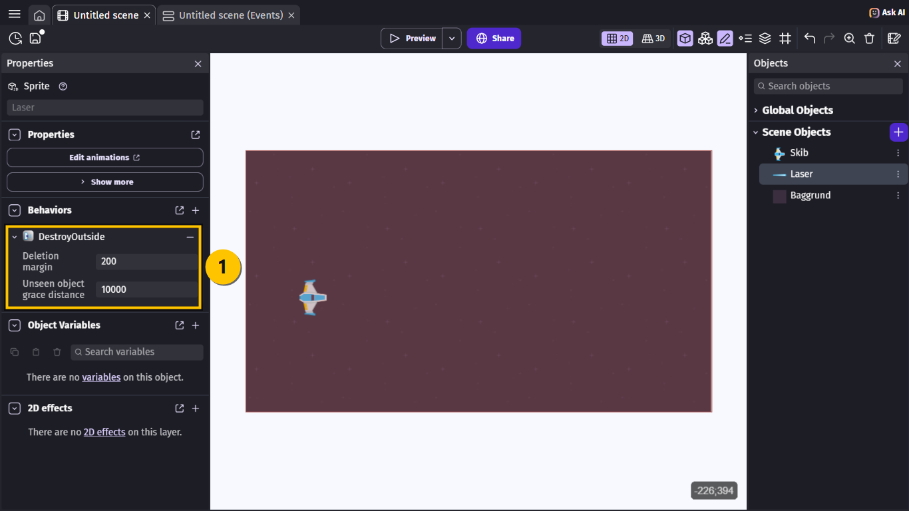

## Opgave 3 – SKYD!: Start et stopur

> **VIDEN**
>
> Vi vil ikke have, at skibet skyder 60 skud i sekundet. Derfor bruger vi en timer, der
> hedder `skud`. Den skal startes, når spillet begynder.
{: .lesson-info}

> **GØR DETTE**
>
> 1. Gå til fanen **Untitled scene (Events)**.
> 2. Vælg **+ Add a new event**. Et nyt, tomt event kommer frem **(1)**.
{: .lesson-action}

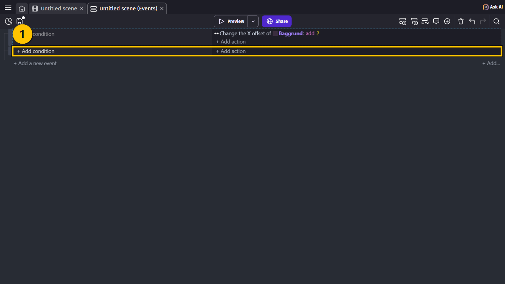

> **GØR DETTE**
>
> 1. Vælg **+ Add condition** i det nye event.
> 2. Skriv `beginning` i søgefeltet.
> 3. Vælg **At the beginning of the scene** **(1)**.
> 4. Vælg **Ok** **(2)**.
{: .lesson-action}

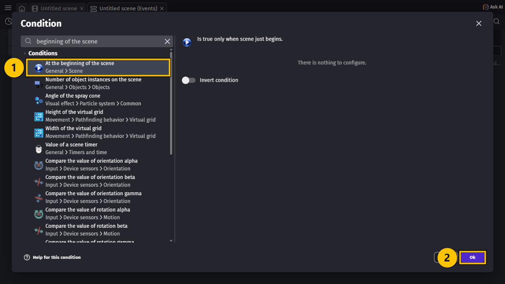

> **GØR DETTE**
>
> 1. Vælg **+ Add action** i samme event.
> 2. Skriv `scene timer` i søgefeltet.
> 3. Vælg **Start (or reset) a scene timer** **(1)**.
> 4. Skriv `"skud"` i **Timer's name** **(2)** — med gåseøjne.
> 5. Vælg **Ok**.
{: .lesson-action}

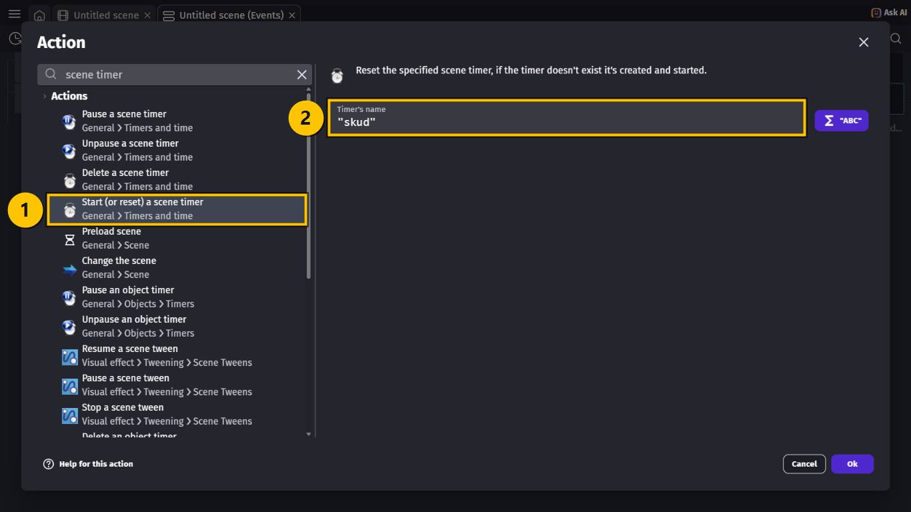

> **VIDEN**
>
> Navne på timere er **tekst**. Tekst skal altid stå i gåseøjne `" "` i GDevelop. Tal skal
> ikke.
{: .lesson-info}

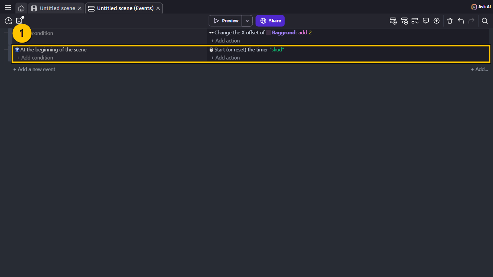

## Opgave 4 – SKYD!: Hvornår må skibet skyde?

> **VIDEN**
>
> Skibet må skyde, når **begge** dele passer:
>
> - mellemrumstasten er trykket ned, **og**
> - der er gået mere end 0,25 sekund siden sidste skud.
>
> Når et event har to conditions, skal de begge være sande.
{: .lesson-info}

> **GØR DETTE**
>
> 1. Vælg **+ Add a new event** igen.
> 2. Vælg **+ Add condition**.
> 3. Skriv `key pressed`, og vælg **Key pressed** **(1)**.
> 4. Skriv `Space` i **Key to check** **(2)**, og vælg **Space** på listen.
> 5. Vælg **Ok**.
{: .lesson-action}

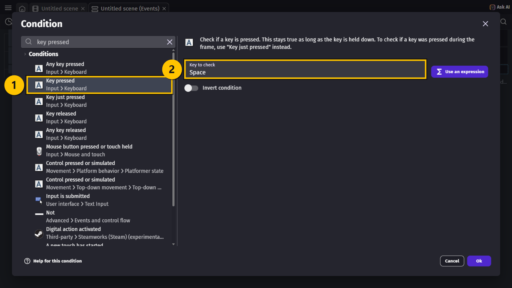

> **GØR DETTE**
>
> 1. Vælg **+ Add condition** i samme event.
> 2. Skriv `scene timer`, og vælg **Value of a scene timer** **(1)**.
> 3. Skriv `"skud"` i **Timer's name** **(2)**.
> 4. Vælg **> (greater than)** i **Sign of the test** **(3)**.
> 5. Skriv `0.25` i **Time in seconds** **(4)**.
> 6. Vælg **Ok**.
{: .lesson-action}

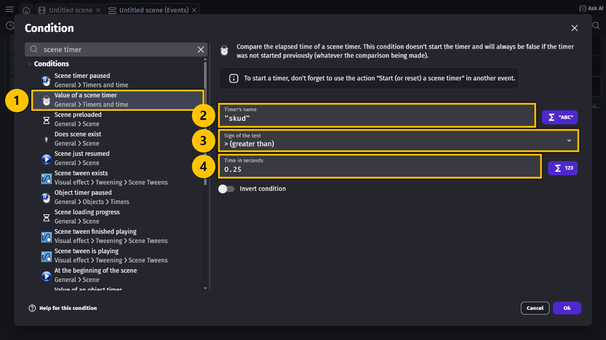

> **VIDEN**
>
> I GDevelop skriver man komma-tal med **punktum**: `0.25`, ikke `0,25`.
{: .lesson-info}

## Opgave 5 – SKYD!: Lav skuddet, og send det af sted

> **GØR DETTE**
>
> 1. Vælg **+ Add action** i samme event.
> 2. Vælg `Laser` **(1)**.
> 3. Vælg **Create an object** **(2)** øverst på listen.
> 4. Skriv `Skib.CenterX()` i **X position** og `Skib.CenterY()` i **Y position** **(3)**.
> 5. Vælg **Ok**.
{: .lesson-action}

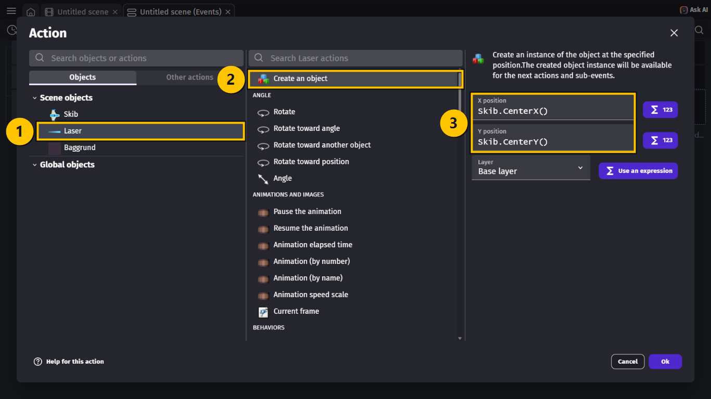

> **VIDEN**
>
> `Skib.CenterX()` betyder "X-positionen af midten af `Skib`". Så kommer skuddet ud fra
> midten af skibet, lige meget hvor skibet er.
{: .lesson-info}

> **GØR DETTE**
>
> 1. Vælg **+ Add action** i samme event.
> 2. Vælg `Laser`, skriv `force`, og vælg **Add a force** **(1)**.
> 3. Skriv `900` i **Speed on X axis** og `0` i **Speed on Y axis** **(2)**.
> 4. Vælg **Permanent** **(3)**.
> 5. Vælg **Ok**.
{: .lesson-action}

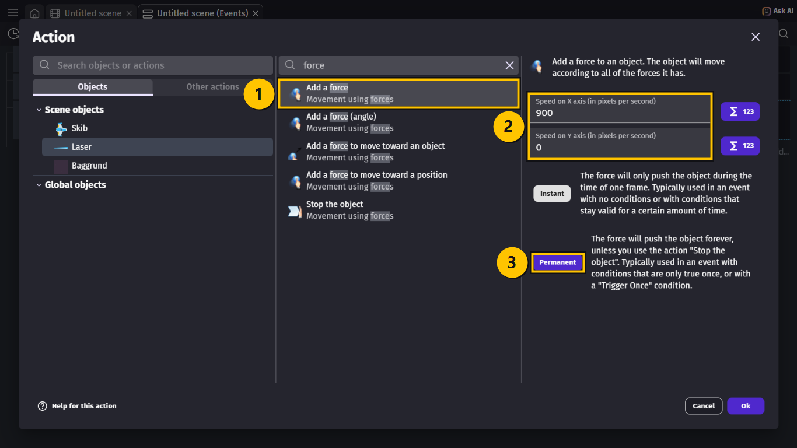

> **VIDEN**
>
> - **X axis** er vandret. Et positivt tal skubber mod højre.
> - **Y axis** er lodret. `0` betyder, at skuddet ikke går op eller ned.
> - **Permanent** betyder, at kraften bliver ved. Så flyver skuddet, til det bliver slettet.
>
> Kraften gælder kun det skud, der lige er blevet lavet. De gamle skud har allerede deres
> egen kraft.
{: .lesson-info}

> **GØR DETTE**
>
> 1. Vælg **+ Add action** i samme event igen.
> 2. Vælg **Start (or reset) a scene timer**, og skriv `"skud"`.
> 3. Vælg **Ok**.
{: .lesson-action}

> **VIDEN**
>
> Når timeren nulstilles, starter den forfra fra 0. Så skal der gå 0,25 sekund igen, før
> det næste skud kan komme.
{: .lesson-info}

## Hele koden samlet

> **VIDEN**
>
> Sådan ser din Events-side ud, når du er færdig. Event 3 er det nye skud-event **(1)**:
>
> | # | Conditions (HVIS) | Actions (SÅ) |
> |---|---|---|
> | 1 | *(ingen — sker hele tiden)* | Change the X offset of `Baggrund`: **add 2** |
> | 2 | **At the beginning of the scene** | Start (or reset) the timer `"skud"` |
> | 3 | `"Space"` key is pressed The timer `"skud"` **>** `0.25` seconds | Create object `Laser` at `Skib.CenterX()`; `Skib.CenterY()` Add to `Laser` a **permanent** force of `900` on X and `0` on Y Start (or reset) the timer `"skud"` |
{: .lesson-info}

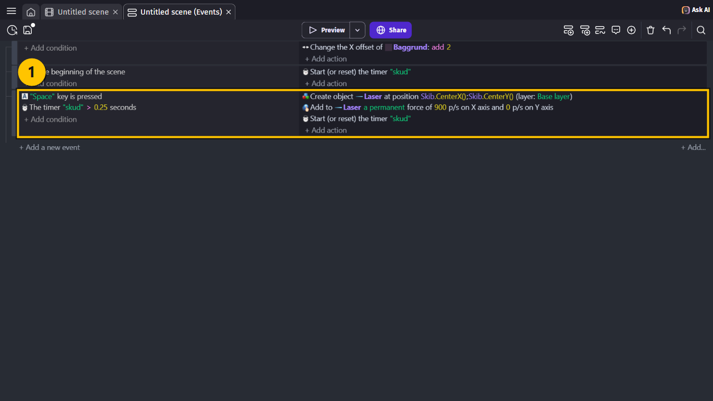

## Prøv spillet! 🎮

> **GØR DETTE**
>
> 1. Tryk **Ctrl + S** for at gemme.
> 2. Vælg **Preview**.
> 3. Hold **mellemrumstasten** nede, og flyv rundt.
{: .lesson-action}

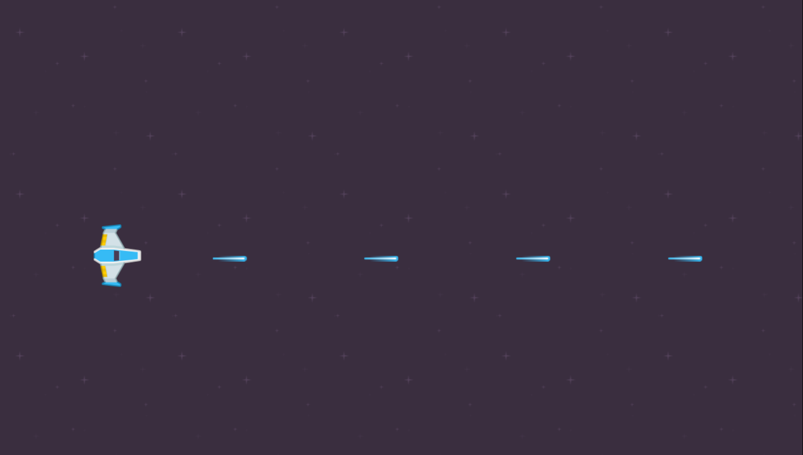

> **VIDEN**
>
> Sådan skal det virke:
>
> - Skuddene kommer ud fra skibet og flyver mod højre.
> - Der kommer fire skud i sekundet, med lige stor afstand.
> - Du kan flyve og skyde på samme tid.
{: .lesson-info}

## Ekstra: Maskingevær eller kanon?

> **GØR DETTE**
>
> 1. Skift `0.25` ud med `0.1`. Hvordan føles det?
> 2. Prøv `0.6`, og skift `900` ud med `1500`.
{: .lesson-action}

> **VIDEN**
>
> Et lille tal i timeren giver mange skud. Et stort tal i kraften giver hurtige skud. Senere
> kommer der fjender, så vælg noget, der ikke er for nemt!
{: .lesson-info}

## Du er færdig med SKYD! ✅

> **VIDEN**
>
> Du er klar til næste lektion, når alt dette passer:
>
> - Jeg har et objekt, der hedder `Laser`, med behavioren **DestroyOutside**.
> - Timeren `"skud"` bliver startet, når scenen begynder.
> - Skibet skyder, når jeg holder mellemrumstasten nede.
> - Der kommer højst fire skud i sekundet.
> - Jeg har gemt projektet.
{: .lesson-info}

> **VIDEN**
>
> Næste gang kommer der asteroider, som du kan skyde i stykker.
{: .lesson-info}

## Hvis noget går galt

| Problem | Prøv dette |
|---|---|
| Der kommer ingen skud. | **GØR DETTE:** Tjek, at event 2 starter timeren `"skud"`. Uden den er timer-conditionen aldrig sand. |
| Der kommer ingen skud, selv om event 2 er der. | **GØR DETTE:** Tjek stavningen. Timeren skal hedde `"skud"` alle tre steder. |
| Der kommer en lang, tyk stribe af skud. | **GØR DETTE:** Tjek, at event 3 har **Start (or reset) the timer "skud"** til sidst. |
| Skuddene står stille. | **GØR DETTE:** Tjek, at kraften er `900` på X, og at **Permanent** er valgt. |
| Skuddene flyver mod venstre. | **GØR DETTE:** Kraften skal være `900`, ikke `-900`. |
| Skuddene kommer ud et helt andet sted. | **GØR DETTE:** Tjek, at der står `Skib.CenterX()` og `Skib.CenterY()` — med stort **S**. |
| GDevelop siger, at der er en fejl i `0,25`. | **GØR DETTE:** Skriv `0.25` med punktum. |
| Der står en laser på scenen, når spillet starter. | **GØR DETTE:** Slet den laser, du har trukket ind på scenen. Laseren skal kun ligge i listen. |
{: .lesson-help}
