# OPGAVER TIL GDevelop – RUMSPIL – ASTEROIDER

> **VIDEN**
>
> I bokse med en hel kant står der, hvad du skal gøre. I bokse med en stiplet kant står der
> viden, som hjælper dig med at forstå det, du laver.
>
> På billederne viser gule kasser, hvor du skal klikke. Tallene i gule cirkler passer til
> tallene i trinene, fx **(1)** og **(2)**.
{: .lesson-info}

Nu får du noget at skyde på! Asteroider kommer flyvende ind fra højre — hver gang et nyt
sted og med en ny fart. Rammer du en, sprænger den, og du får point.

## To ord du skal kende

> **VIDEN**
>
> - **Tilfældigt tal** — et tal, computeren finder på. `RandomInRange(0, 620)` giver et
>   tal mellem 0 og 620, hver gang det bliver brugt. Så bliver spillet aldrig helt ens.
> - **Collision** — når to objekter rører hinanden. GDevelop kan tjekke, om et skud
>   rammer en asteroide.
{: .lesson-info}

## Opgave 1 – ASTEROIDER: Hent en asteroide

> **GØR DETTE**
>
> 1. Vælg **+ Add object**, søg efter `space shooter`, og vælg **Space Shooter Redux**.
> 2. Vælg mappen **Meteors**.
> 3. Vælg **Big Brown Meteor 1** **(1)**.
{: .lesson-action}

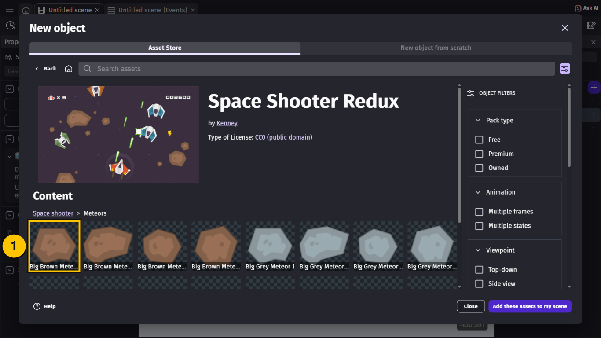

> **GØR DETTE**
>
> 1. Vælg **Add to the scene** **(1)**, og vælg **Close**.
> 2. Giv `Big_Brown_Meteor_1` det nye navn `Asteroide` **(1)** (**F2**).
{: .lesson-action}

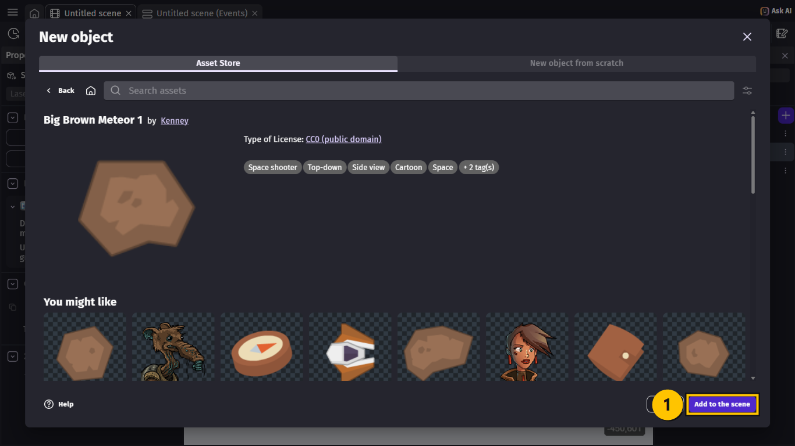

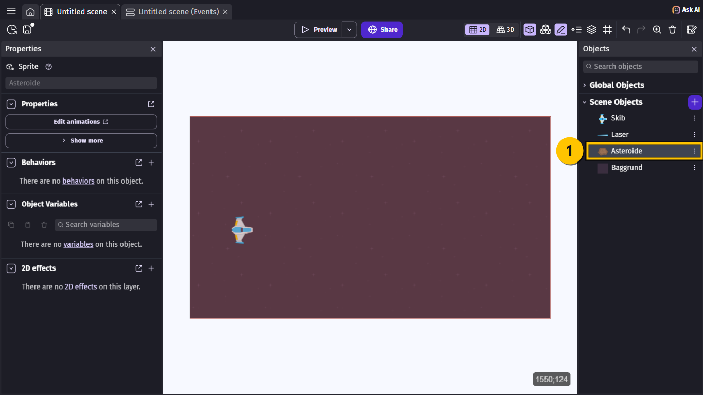

> **GØR DETTE**
>
> Giv `Asteroide` behavioren **Destroy when outside of the screen**, ligesom du gjorde med
> `Laser` i sidste lektion **(1)**.
{: .lesson-action}

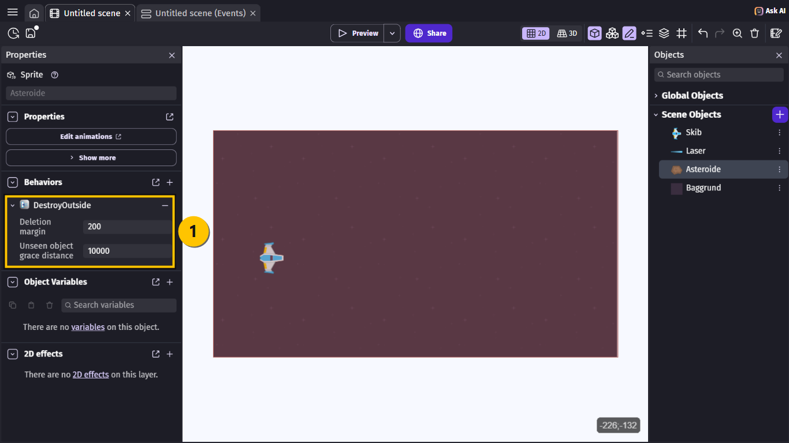

> **VIDEN**
>
> Asteroiden skal heller ikke trækkes ind på scenen. Et event laver nye asteroider, mens
> spillet kører.
{: .lesson-info}

## Opgave 2 – ASTEROIDER: En tekst til dine point

> **GØR DETTE**
>
> 1. Vælg **+ Add object**.
> 2. Vælg fanen **New object from scratch** **(1)**.
{: .lesson-action}

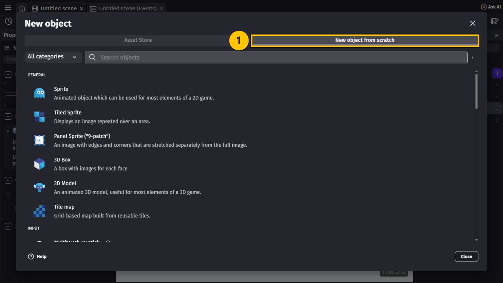

> **GØR DETTE**
>
> 1. Skriv `text` i søgefeltet **(1)**.
> 2. Vælg **Text** **(2)**.
{: .lesson-action}

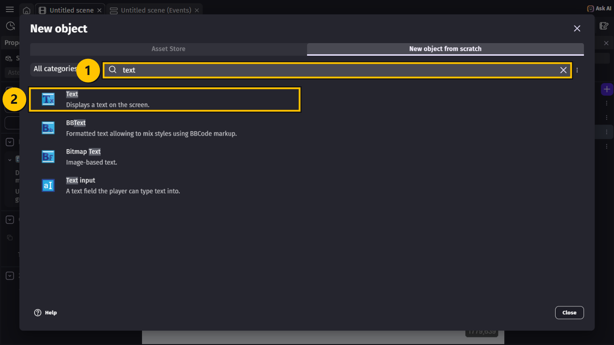

> **GØR DETTE**
>
> 1. Skriv `PointTekst` i **Object name** **(1)**.
> 2. Skriv `36` i **Size**, og sæt flueben i **Bold** **(2)**.
> 3. Skriv `Point: 0` i **Initial text to display** **(3)**.
{: .lesson-action}

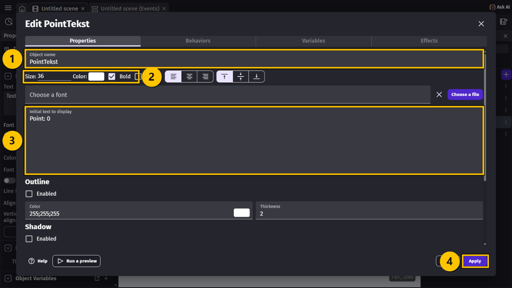

> **GØR DETTE**
>
> 1. Klik på den sorte firkant ved **Color**.
> 2. Vælg den hvide farve **(1)** nederst.
> 3. Klik et andet sted i boksen for at lukke farvevælgeren.
> 4. Vælg **Apply** (**(4)** på billedet ovenfor).
{: .lesson-action}

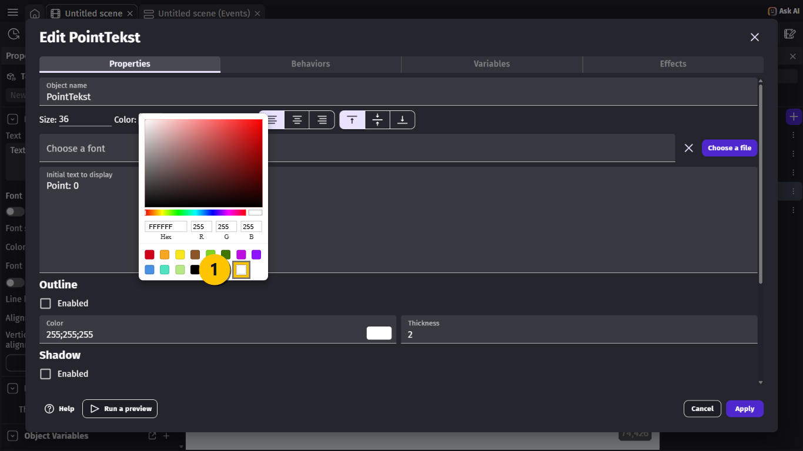

> **GØR DETTE**
>
> 1. Træk `PointTekst` ind i øverste venstre hjørne af scenen **(1)**.
> 2. Skriv `20` i både **X** og **Y** **(2)**.
{: .lesson-action}

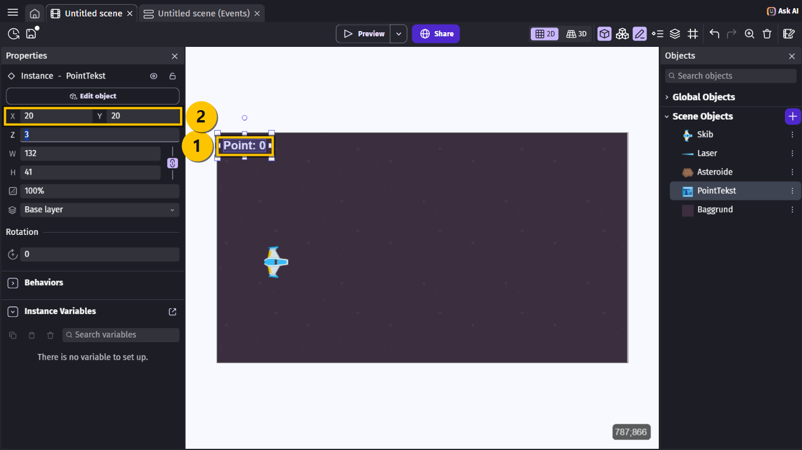

## Opgave 3 – ASTEROIDER: En variabel til dine point

> **VIDEN**
>
> Teksten viser kun pointene. Selve tallet gemmer vi i en **variabel**, der hedder `Point`.
> Den kender du fra platformspillet. Her er den en **scenevariabel** — den hører til
> scenen.
{: .lesson-info}

> **GØR DETTE**
>
> 1. Klik på et tomt sted ved siden af scenen, så der står **Untitled scene** øverst til
>    venstre.
> 2. Vælg **+** ved **Scene Variables** **(1)**.
> 3. Den nye variabel hedder `Variable`. Klik på navnet, skriv `Point`, og tryk **Enter**
>    **(2)**.
> 4. Lad værdien stå på `0`.
{: .lesson-action}

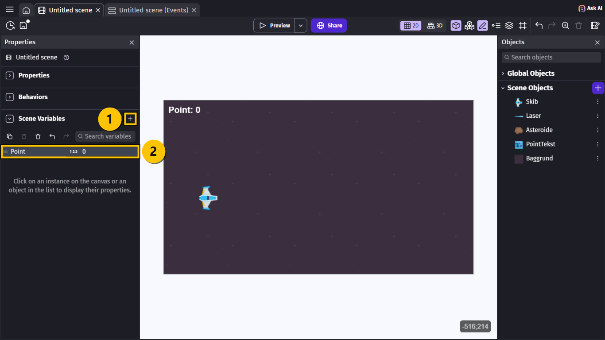

## Opgave 4 – ASTEROIDER: Lav en asteroide hvert sekund

> **GØR DETTE**
>
> 1. Gå til fanen **Untitled scene (Events)**.
> 2. I event 2 (**At the beginning of the scene**): Vælg **+ Add action**, vælg
>    **Start (or reset) a scene timer**, og skriv `"asteroide"` **(1)**.
{: .lesson-action}

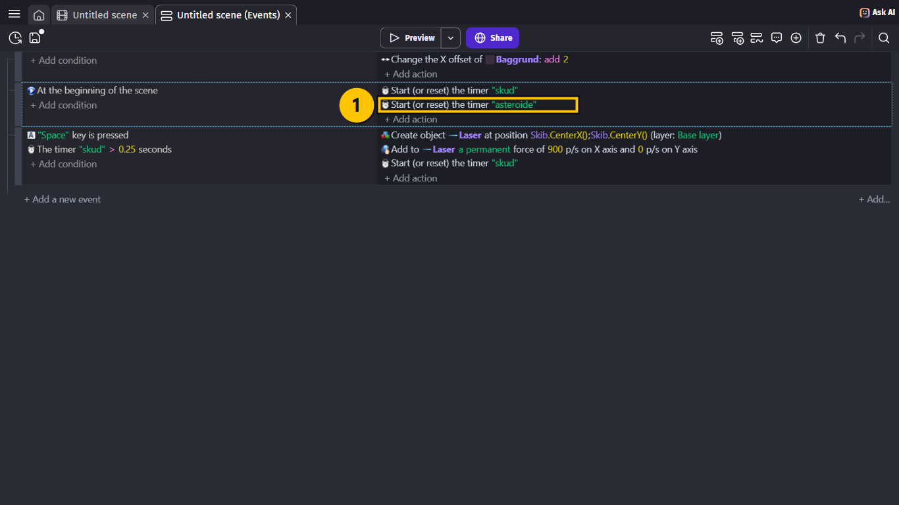

> **GØR DETTE**
>
> 1. Vælg **+ Add a new event**.
> 2. Tilføj conditionen **Value of a scene timer**: `"asteroide"` **> (greater than)** `1`.
> 3. Vælg **+ Add action**, vælg `Asteroide` **(1)** og **Create an object** **(2)**.
> 4. Skriv `1300` i **X position** og `RandomInRange(0, 620)` i **Y position** **(3)**.
> 5. Vælg **Ok**.
{: .lesson-action}

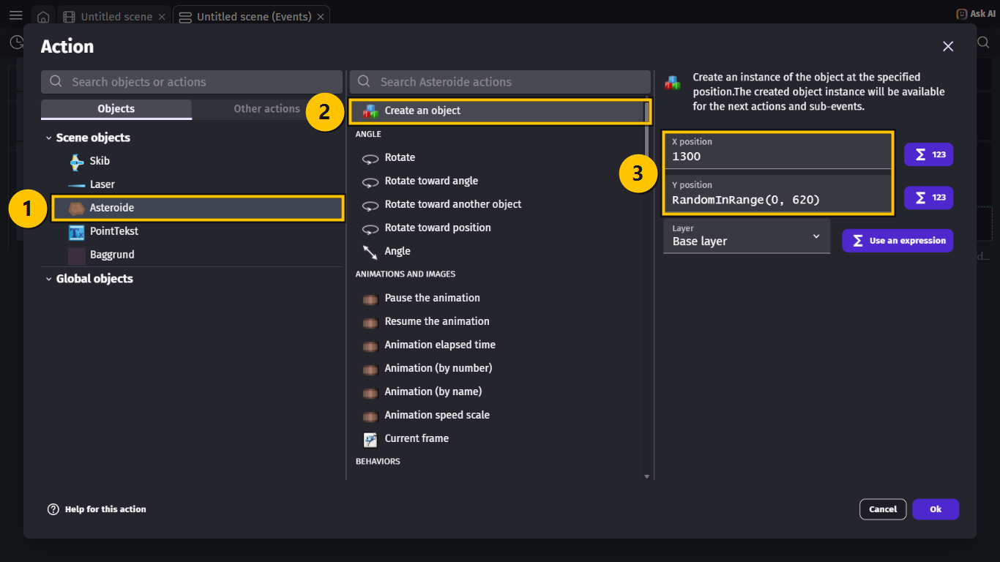

> **VIDEN**
>
> - `1300` er lidt uden for skærmen til højre. Så flyver asteroiden ind fra kanten i
>   stedet for at dukke op midt på skærmen.
> - `RandomInRange(0, 620)` er et tilfældigt tal mellem 0 og 620. Skærmen er 720 høj, så
>   asteroiden kan komme alle steder fra toppen og ned.
{: .lesson-info}

> **GØR DETTE**
>
> 1. Vælg **+ Add action**, vælg `Asteroide` og **Add a force**.
> 2. Skriv `RandomInRange(-350, -150)` i **Speed on X axis** og `0` i **Speed on Y axis**
>    **(1)**.
> 3. Vælg **Permanent** **(2)**, og vælg **Ok**.
> 4. Vælg **+ Add action** en sidste gang: **Start (or reset) a scene timer** med
>    `"asteroide"`.
{: .lesson-action}

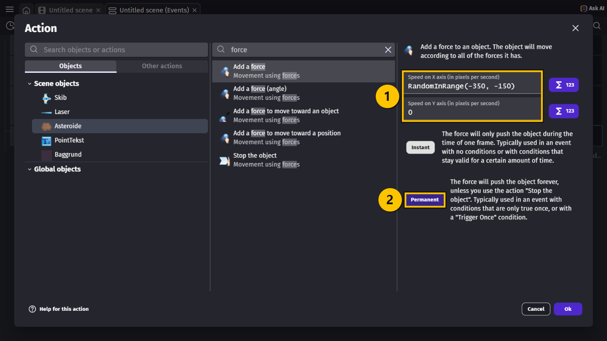

> **VIDEN**
>
> Tallet er **negativt**, fordi asteroiden skal flyve mod **venstre**. Nogle asteroider
> flyver 150 pixels i sekundet, andre helt op til 350.
{: .lesson-info}

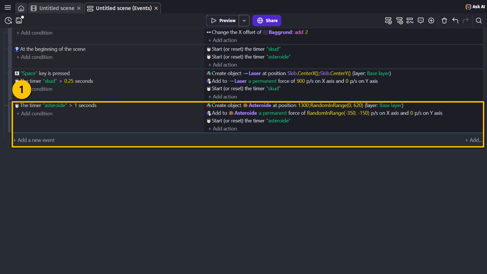

## Opgave 5 – ASTEROIDER: Skud rammer asteroide

> **GØR DETTE**
>
> 1. Vælg **+ Add a new event**, og vælg **+ Add condition**.
> 2. Vælg `Laser` **(1)**, skriv `collision`, og vælg **Collision** **(2)**.
> 3. Vælg `Asteroide` i **Object** **(3)**, og vælg **Ok**.
{: .lesson-action}

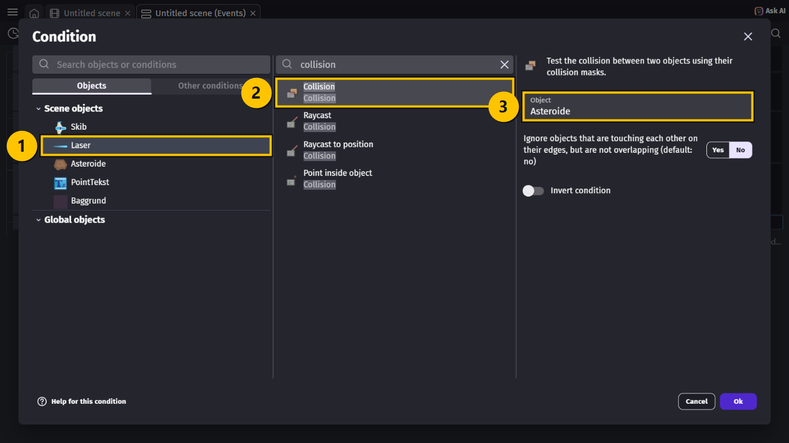

> **GØR DETTE**
>
> 1. Vælg **+ Add action**, vælg `Laser`, skriv `delete`, og vælg **Delete the object**
>    **(1)**. Vælg **Ok**.
> 2. Gør det samme med `Asteroide`.
{: .lesson-action}

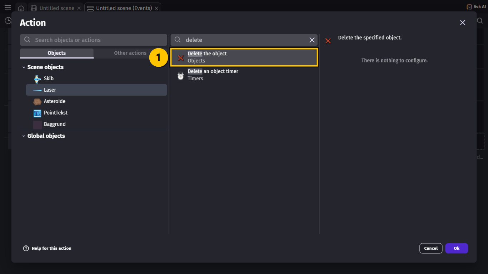

> **VIDEN**
>
> GDevelop sletter kun **det** skud og **den** asteroide, der rammer hinanden. De andre
> bliver, hvor de er.
{: .lesson-info}

> **GØR DETTE**
>
> 1. Vælg **+ Add action**, skriv `variable value`, og vælg **Change variable value**.
> 2. Vælg `Point` i **Variable** **(1)**.
> 3. Vælg **+ (add)** i **Modification's sign** **(2)**.
> 4. Skriv `10` i **Value** **(3)**, og vælg **Ok**.
{: .lesson-action}

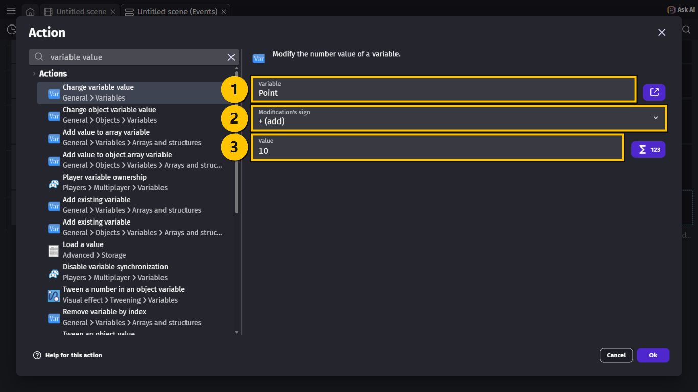

## Opgave 6 – ASTEROIDER: Drej asteroiderne, og vis pointene

> **VIDEN**
>
> De sidste to handlinger lægger vi i **event 1**, som sker hele tiden.
{: .lesson-info}

> **GØR DETTE**
>
> 1. I event 1: Vælg **+ Add action**, vælg `Asteroide` og **Rotate** **(1)**.
> 2. Skriv `90` i **Angular speed** **(2)**, og vælg **Ok**.
{: .lesson-action}

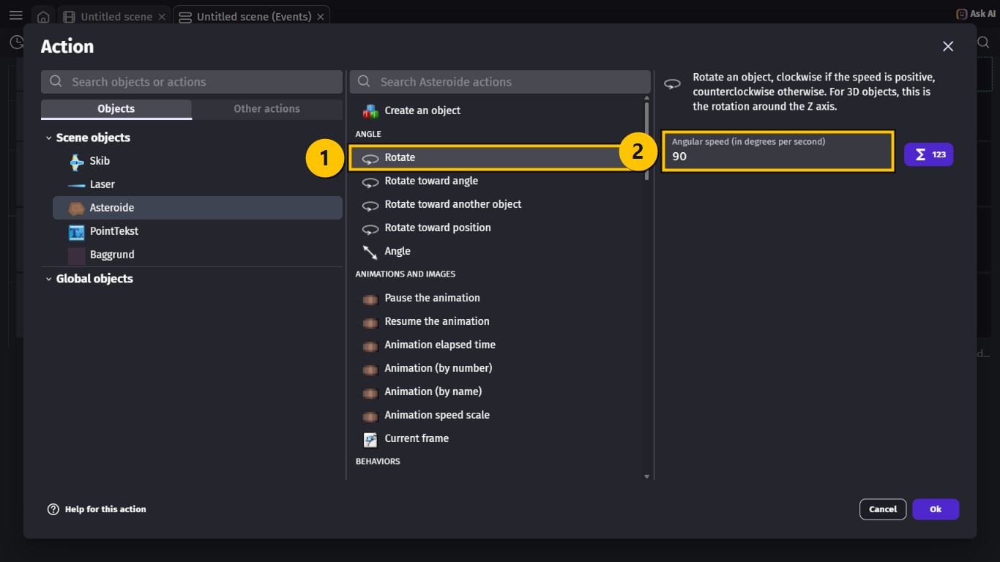

> **GØR DETTE**
>
> 1. I event 1 igen: Vælg **+ Add action**, vælg `PointTekst`, skriv `text`, og vælg
>    **Text** **(1)**.
> 2. Lad **Modification's sign** stå på **= (set to)**.
> 3. Skriv `"Point: " + Point` i **Text** **(2)**, og vælg **Ok**.
{: .lesson-action}

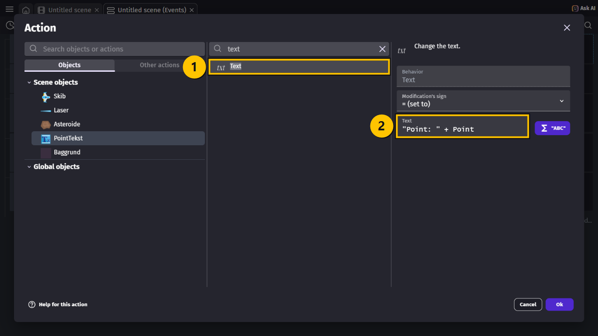

> **VIDEN**
>
> `"Point: "` er tekst, så den står i gåseøjne. `Point` er din variabel, så den står uden.
> Plusset sætter dem sammen, så der fx står **Point: 30** på skærmen.
{: .lesson-info}

## Hele koden samlet

> **VIDEN**
>
> Sådan ser din Events-side ud nu. De to nye handlinger i event 1 er markeret **(1)**:
>
> | # | Conditions (HVIS) | Actions (SÅ) |
> |---|---|---|
> | 1 | *(ingen — sker hele tiden)* | Change the X offset of `Baggrund`: **add 2** Rotate `Asteroide` at speed `90` Change the text of `PointTekst`: **set to** `"Point: " + Point` |
> | 2 | **At the beginning of the scene** | Start (or reset) the timer `"skud"` Start (or reset) the timer `"asteroide"` |
> | 3 | `"Space"` key is pressed The timer `"skud"` **>** `0.25` seconds | Create object `Laser` at `Skib.CenterX()`; `Skib.CenterY()` Add to `Laser` a **permanent** force of `900` on X and `0` on Y Start (or reset) the timer `"skud"` |
> | 4 | The timer `"asteroide"` **>** `1` seconds | Create object `Asteroide` at `1300`; `RandomInRange(0, 620)` Add to `Asteroide` a **permanent** force of `RandomInRange(-350, -150)` on X and `0` on Y Start (or reset) the timer `"asteroide"` |
> | 5 | `Laser` is in collision with `Asteroide` | Delete `Laser` Delete `Asteroide` Change the variable `Point`: **add 10** |
{: .lesson-info}

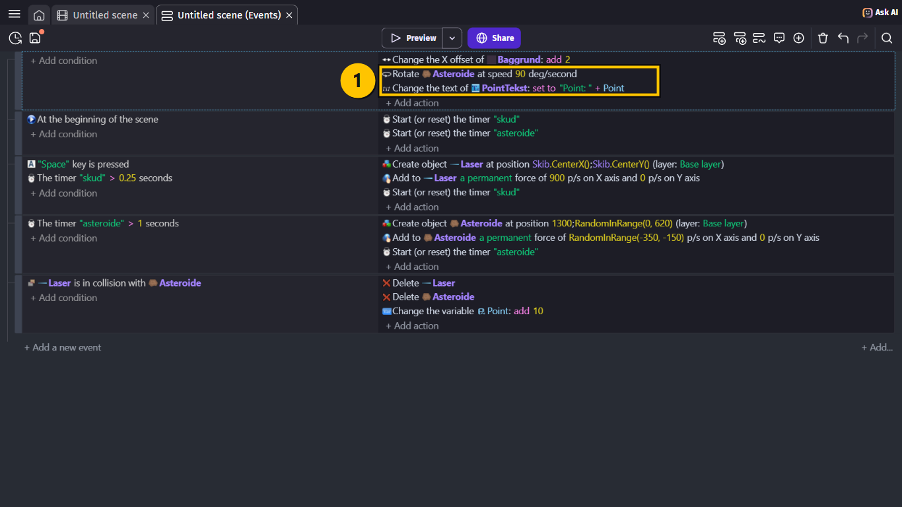

## Prøv spillet! 🎮

> **GØR DETTE**
>
> 1. Tryk **Ctrl + S** for at gemme.
> 2. Vælg **Preview**.
> 3. Flyv op og ned, og skyd asteroiderne.
{: .lesson-action}

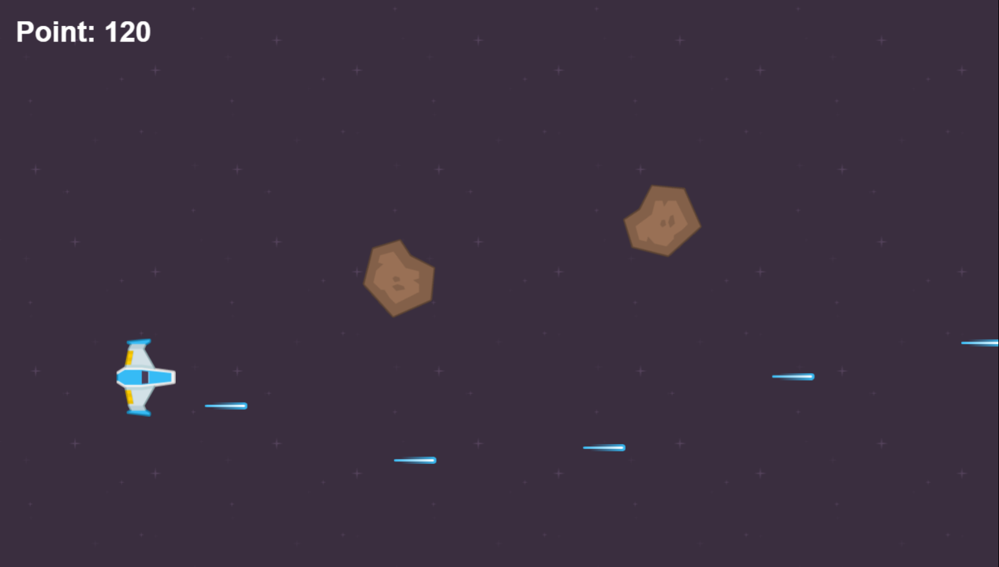

> **VIDEN**
>
> Sådan skal det virke:
>
> - Der kommer en asteroide hvert sekund, et nyt sted hver gang.
> - Nogle asteroider er hurtige, andre er langsomme, og de drejer rundt.
> - Når et skud rammer en asteroide, forsvinder begge, og du får 10 point.
>
> Asteroiderne kan ikke skade skibet endnu. Det kommer i lektionen om liv.
{: .lesson-info}

## Ekstra: Gør det sværere

> **GØR DETTE**
>
> Prøv at ændre tallene, og se, hvad der sker:
>
> 1. Skift `1` ud med `0.5` i timeren `"asteroide"`. Nu kommer der to asteroider i sekundet.
> 2. Skift kraften til `RandomInRange(-600, -250)`. Nu er de meget hurtigere.
> 3. Skift `10` ud med `25`. Nu er hver asteroide mere værd.
{: .lesson-action}

> **VIDEN**
>
> Spildesignere bruger meget tid på at finde de rigtige tal. For svært er ikke sjovt — for
> nemt er heller ikke. I lektionen om bølger lærer du at gøre spillet sværere og sværere,
> mens man spiller.
{: .lesson-info}

## Du er færdig med ASTEROIDER ✅

> **VIDEN**
>
> Du er klar til næste lektion, når alt dette passer:
>
> - Der kommer asteroider ind fra højre, et nyt sted hver gang.
> - Asteroiderne drejer rundt og bliver slettet, når de er ude af skærmen.
> - Mine skud kan ramme asteroiderne, og så forsvinder begge.
> - Der står **Point:** øverst til venstre, og tallet stiger med 10 for hver asteroide.
> - Jeg har gemt projektet.
{: .lesson-info}

> **VIDEN**
>
> Næste gang får spillet eksplosioner, lyd og musik.
{: .lesson-info}

## Hvis noget går galt

| Problem | Prøv dette |
|---|---|
| Der kommer ingen asteroider. | **GØR DETTE:** Tjek, at event 2 starter timeren `"asteroide"`, og at den er stavet ens alle steder. |
| Asteroiderne står stille ude til højre. | **GØR DETTE:** Tjek kraften i event 4. X skal være negativ, og **Permanent** skal være valgt. |
| Asteroiderne kommer alle det samme sted. | **GØR DETTE:** Tjek, at der står `RandomInRange(0, 620)` i **Y position**. |
| Asteroiderne flyver mod højre. | **GØR DETTE:** Tallene skal have minus foran: `RandomInRange(-350, -150)`. |
| Pointene står altid på 0. | **GØR DETTE:** Tjek, at event 1 ændrer teksten, og at event 5 lægger 10 til `Point`. |
| Der står bare `Point` uden tal. | **GØR DETTE:** Kun `"Point: "` skal have gåseøjne. `Point` til sidst skal stå uden. |
| Teksten er sort og svær at se. | **GØR DETTE:** Åbn `PointTekst` med **Edit object**, og vælg hvid i **Color**. |
| Jeg kan ikke se **Scene Variables**. | **GØR DETTE:** Klik på et tomt sted uden for scenen, så der står **Untitled scene** øverst i panelet til venstre. |
{: .lesson-help}
