# OPGAVER TIL GDevelop – RUMSPIL – BOOM OG LYD

> **VIDEN**
>
> I bokse med en hel kant står der, hvad du skal gøre. I bokse med en stiplet kant står der
> viden, som hjælper dig med at forstå det, du laver.
>
> På billederne viser gule kasser, hvor du skal klikke. Tallene i gule cirkler passer til
> tallene i trinene, fx **(1)** og **(2)**.
{: .lesson-info}

Et spil bliver meget sjovere, når der sker noget, man kan se og høre. I denne lektion
sprænger asteroiderne i en sky af gnister, laseren siger *piu*, og der kommer musik på.

## To ord du skal kende

> **VIDEN**
>
> - **Partikler** — mange små prikker, der flyver ud fra et punkt og forsvinder igen.
>   Man bruger dem til eksplosioner, ild, røg og regn.
> - **Lydeffekt** — en kort lyd, der spiller én gang, fx et skud eller et brag. **Musik**
>   er et langt nummer, der spiller igen og igen.
{: .lesson-info}

## Opgave 1 – BOOM OG LYD: Lav en eksplosion

> **GØR DETTE**
>
> 1. Vælg **+ Add object**, og vælg fanen **New object from scratch**.
> 2. Skriv `particle` i søgefeltet.
> 3. Vælg **2D particles emitter** **(1)**.
{: .lesson-action}

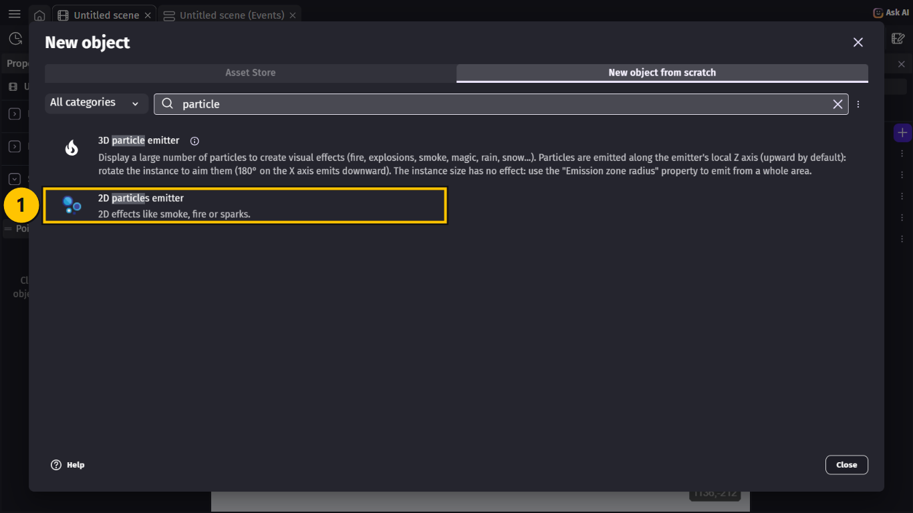

> **VIDEN**
>
> GDevelop viser en masse færdige effekter, som du kan starte fra. Vi bruger én og retter
> lidt i den.
{: .lesson-info}

> **GØR DETTE**
>
> Vælg **Red Explosion** **(1)**.
{: .lesson-action}

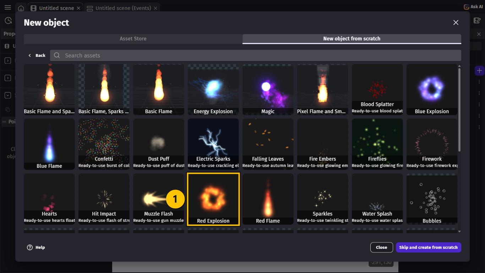

> **GØR DETTE**
>
> Nu står `RedExplosion` i listen **(1)**. Dobbeltklik på den for at åbne den.
{: .lesson-action}

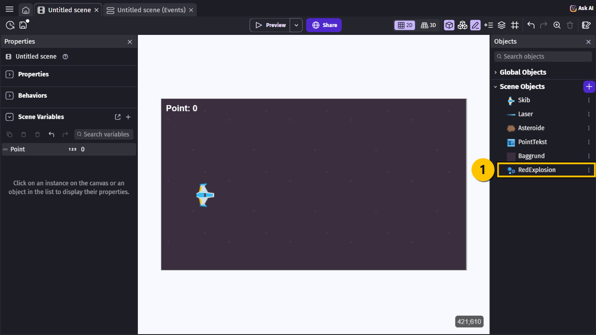

> **GØR DETTE**
>
> 1. Skriv `Eksplosion` i **Object name** **(1)**.
> 2. Vælg **Circle** i **Particle type** **(2)**.
> 3. Skriv `6` i **Size** **(3)**.
> 4. Tjek, at der er flueben i **Delete when out of particles** **(4)**.
> 5. Vælg **Apply**.
{: .lesson-action}

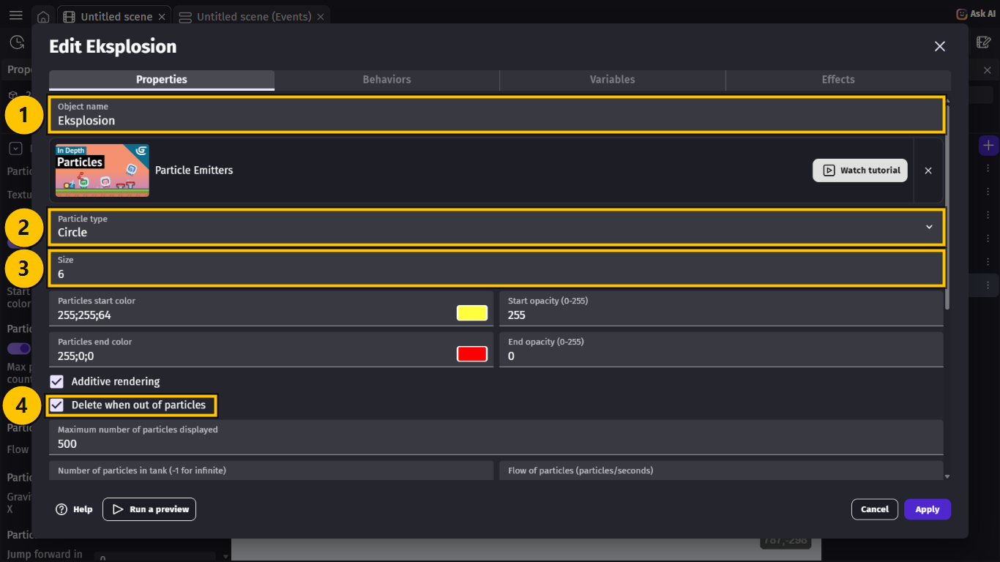

> **VIDEN**
>
> - **Circle** betyder, at hver partikel er en lille rund prik. GDevelop tegner selv
>   prikkerne, så vi behøver intet billede.
> - Farven går fra **gul** til **rød**, og prikkerne bliver gennemsigtige til sidst.
> - Eksplosionen skyder 100 partikler ud på et øjeblik. **Delete when out of
>   particles** sletter den, når den er færdig, så der ikke ligger tomme eksplosioner og
>   fylder i spillet.
{: .lesson-info}

## Opgave 2 – BOOM OG LYD: Et brag, når asteroiden rammes

> **GØR DETTE**
>
> 1. Gå til fanen **Untitled scene (Events)**.
> 2. Find event 5 (**Laser is in collision with Asteroide**), og vælg **+ Add action**.
> 3. Skriv `play a sound`, og vælg **Play a sound** **(1)**.
> 4. Klik i feltet **Choose the audio file to use**, og vælg **Choose from asset store**
>    **(2)**.
{: .lesson-action}

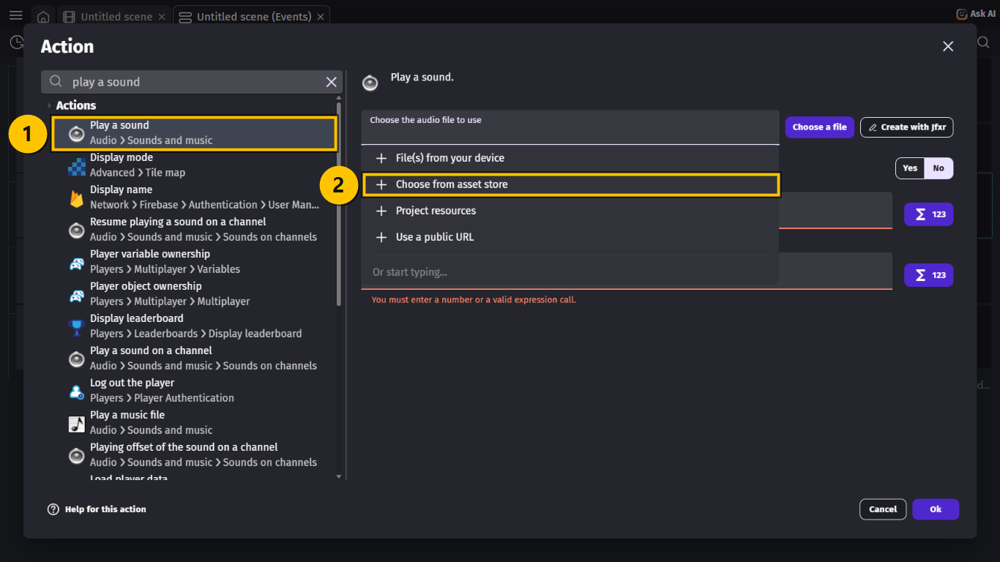

> **GØR DETTE**
>
> 1. Skriv `explosion` i søgefeltet **(1)**.
> 2. Vælg **Explosion 1.aac** **(2)**. Tryk på ▷ for at høre den først.
> 3. Vælg **Add to project** **(3)**.
{: .lesson-action}

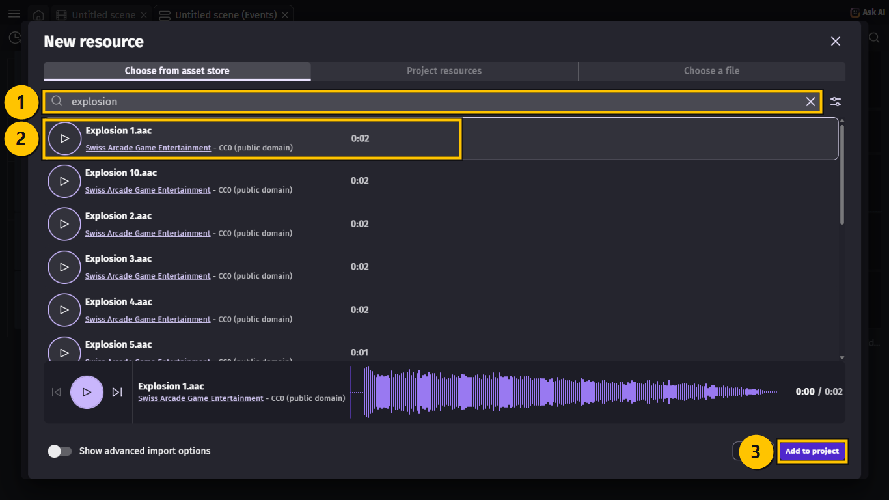

> **GØR DETTE**
>
> 1. Tjek, at der står `Explosion 1.aac` i feltet **(1)**.
> 2. Skriv `60` i **Volume** **(2)** og `1` i **Pitch (speed)** **(3)**.
> 3. Vælg **Ok**.
{: .lesson-action}

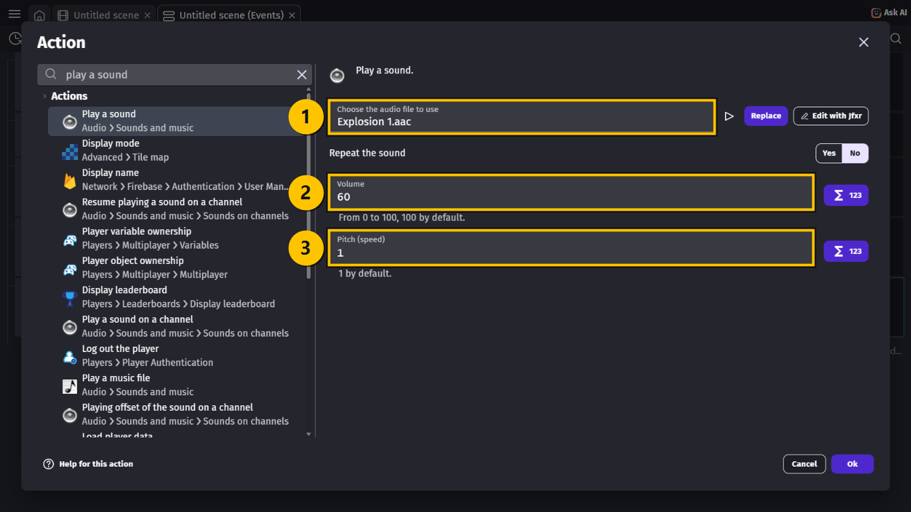

> **VIDEN**
>
> - **Volume** er, hvor højt lyden spiller, fra `0` til `100`.
> - **Pitch** er, hvor hurtigt den spiller. `1` er normalt. `2` er dobbelt så hurtigt og
>   lyser op, `0.5` er langsomt og dybt.
> - Alle lydene i denne lektion er gratis (CC0), så du må bruge dem i dit spil.
{: .lesson-info}

## Opgave 3 – BOOM OG LYD: Eksplosionen, hvor asteroiden var

> **GØR DETTE**
>
> 1. I event 5 igen: Vælg **+ Add action**.
> 2. Vælg `Eksplosion` **(1)** og **Create an object** **(2)**.
> 3. Skriv `Asteroide.CenterX()` i **X position** og `Asteroide.CenterY()` i **Y position**
>    **(3)**.
> 4. Vælg **Ok**.
{: .lesson-action}

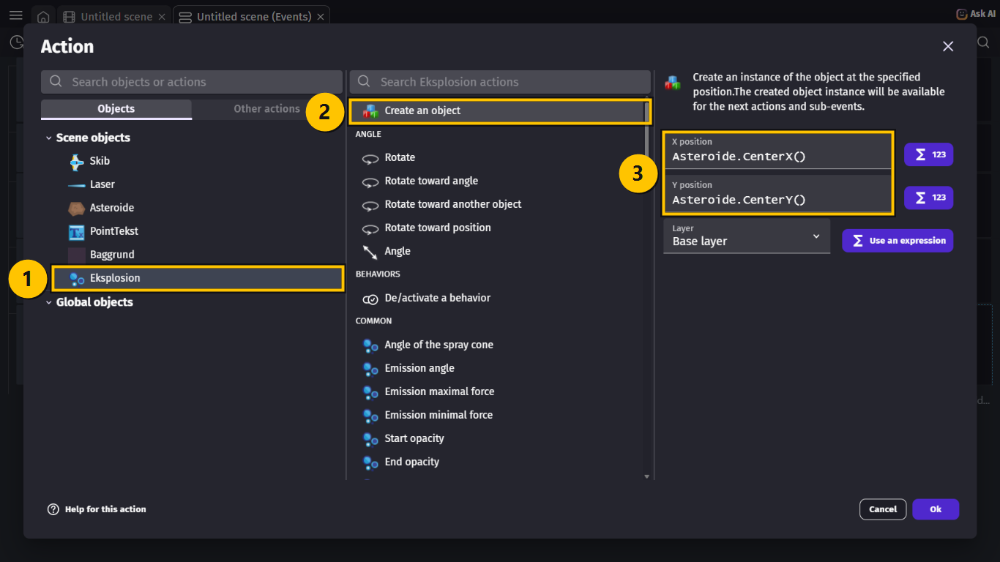

> **VIDEN**
>
> Eksplosionen bliver lavet midt i den asteroide, der blev ramt. Det virker, selv om
> handlingen står under **Delete Asteroide** — GDevelop husker, hvor asteroiden var,
> indtil eventet er færdigt.
{: .lesson-info}

## Opgave 4 – BOOM OG LYD: Piu piu!

> **GØR DETTE**
>
> 1. Find event 3 (skud-eventet), og vælg **+ Add action**.
> 2. Vælg **Play a sound** og **Choose from asset store**.
> 3. Skriv `laser` **(1)**, og vælg **Laser-weapon 1.aac** **(2)**. Vælg **Add to project**.
> 4. Skriv `30` i **Volume** og `1` i **Pitch (speed)**. Vælg **Ok**.
{: .lesson-action}

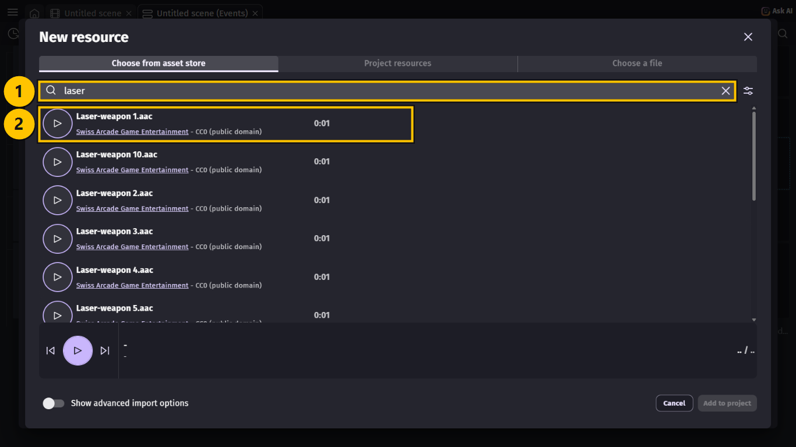

> **VIDEN**
>
> Skuddet kommer fire gange i sekundet. Derfor er lyden sat lavere end braget — ellers
> bliver den hurtigt irriterende.
{: .lesson-info}

## Opgave 5 – BOOM OG LYD: Musik

> **GØR DETTE**
>
> 1. Find event 2 (**At the beginning of the scene**), og vælg **+ Add action**.
> 2. Skriv `play a music`, og vælg **Play a music file**.
> 3. Vælg **Choose from asset store**, skriv `space`, og vælg **Space X Chiptune
>    Remix.ogg**. Vælg **Add to project**.
> 4. Vælg **Yes** ved **Repeat the sound** **(2)**, så musikken starter forfra, når den er
>    færdig.
> 5. Skriv `40` i **Volume** **(3)** og `1` i **Pitch (speed)**. Vælg **Ok**.
{: .lesson-action}

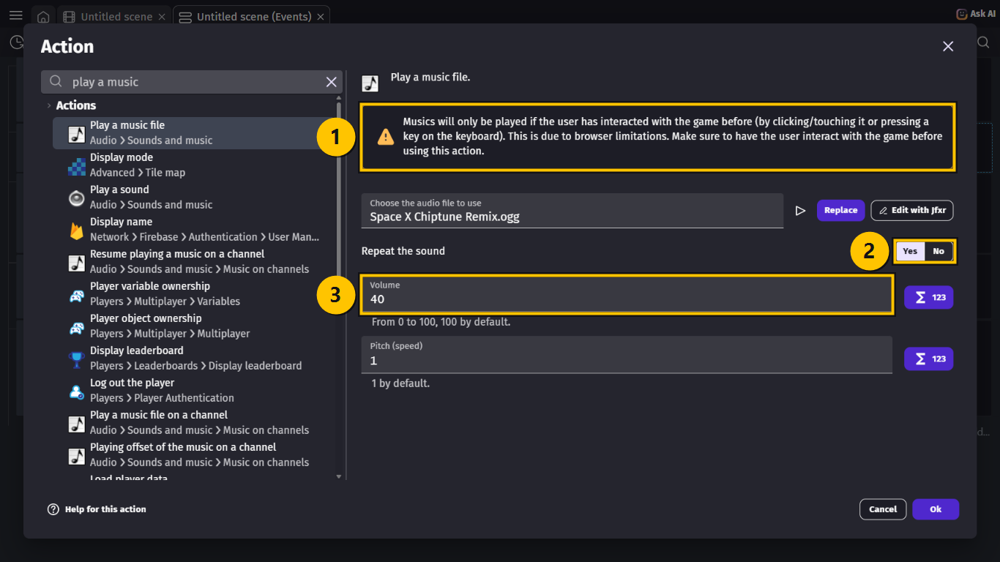

> **VIDEN**
>
> Den gule boks **(1)** siger, at musik først kan spille, når spilleren har trykket på en
> tast eller klikket. Sådan virker browsere. Hører du ikke musikken med det samme, så
> starter den, når du begynder at spille. I lektionen om menuen får spillet en
> startknap, og så spiller musikken fra start.
{: .lesson-info}

## Opgave 6 – BOOM OG LYD: Plads til pointene

> **VIDEN**
>
> Når du får mange point, kan **Point: 120** blive delt i to linjer, fordi tekstfeltet er
> for smalt. Og skibet kan flyve hen over pointene. Begge dele retter vi her.
{: .lesson-info}

> **GØR DETTE**
>
> 1. Gå til fanen **Untitled scene**, og klik på teksten **Point: 0** på scenen.
> 2. Skriv `100` i **Z** **(1)**.
> 3. Skriv `400` i **W** **(2)**, og tryk **Enter**.
{: .lesson-action}

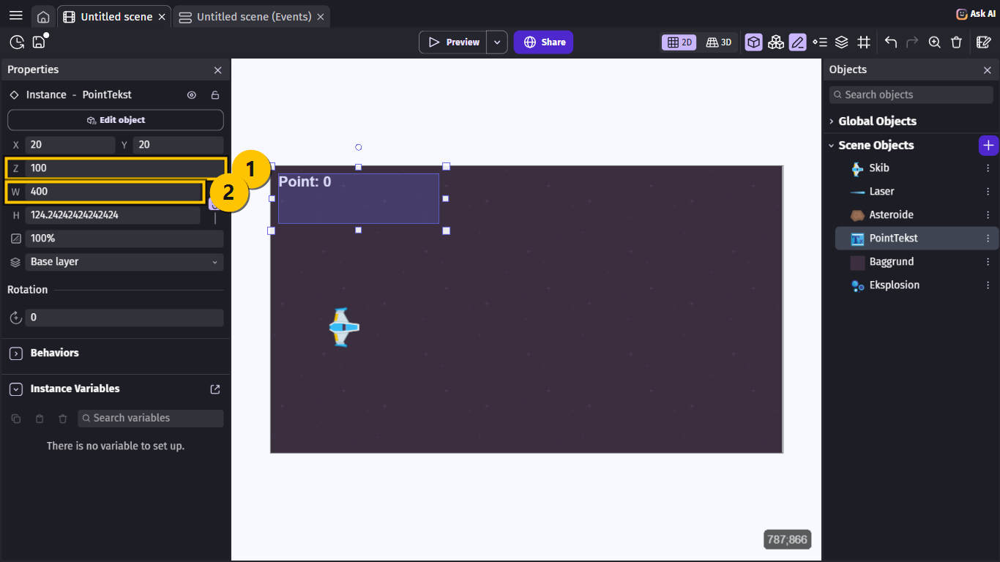

> **VIDEN**
>
> - **Z** bestemmer, hvad der ligger øverst. Et objekt med et stort Z ligger oven på
>   objekter med et mindre Z. Med `100` ligger pointene over skibet og baggrunden.
> - **W** giver teksten plads nok, så den står på én linje.
>
> Asteroiderne kan stadig flyve hen over pointene. Det skyldes, at objekter, som events
> laver, får et endnu større Z. I lektionen om bølger lærer du at løse det rigtigt med et
> **lag**.
{: .lesson-info}

## Hele koden samlet

> **VIDEN**
>
> Sådan ser din Events-side ud nu. De nye handlinger er markeret: musikken **(1)**,
> laserlyden **(2)** og braget med eksplosionen **(3)**:
>
> | # | Conditions (HVIS) | Actions (SÅ) |
> |---|---|---|
> | 1 | *(ingen — sker hele tiden)* | Change the X offset of `Baggrund`: **add 2** Rotate `Asteroide` at speed `90` Change the text of `PointTekst`: **set to** `"Point: " + Point` |
> | 2 | **At the beginning of the scene** | Start (or reset) the timer `"skud"` Start (or reset) the timer `"asteroide"` Play the music `Space X Chiptune Remix.ogg`, vol. `40`, loop **yes** |
> | 3 | `"Space"` key is pressed The timer `"skud"` **>** `0.25` seconds | Create object `Laser` at `Skib.CenterX()`; `Skib.CenterY()` Add to `Laser` a **permanent** force of `900` on X and `0` on Y Start (or reset) the timer `"skud"` Play the sound `Laser-weapon 1.aac`, vol. `30` |
> | 4 | The timer `"asteroide"` **>** `1` seconds | Create object `Asteroide` at `1300`; `RandomInRange(0, 620)` Add to `Asteroide` a **permanent** force of `RandomInRange(-350, -150)` on X and `0` on Y Start (or reset) the timer `"asteroide"` |
> | 5 | `Laser` is in collision with `Asteroide` | Delete `Laser` Delete `Asteroide` Change the variable `Point`: **add 10** Play the sound `Explosion 1.aac`, vol. `60` Create object `Eksplosion` at `Asteroide.CenterX()`; `Asteroide.CenterY()` |
{: .lesson-info}

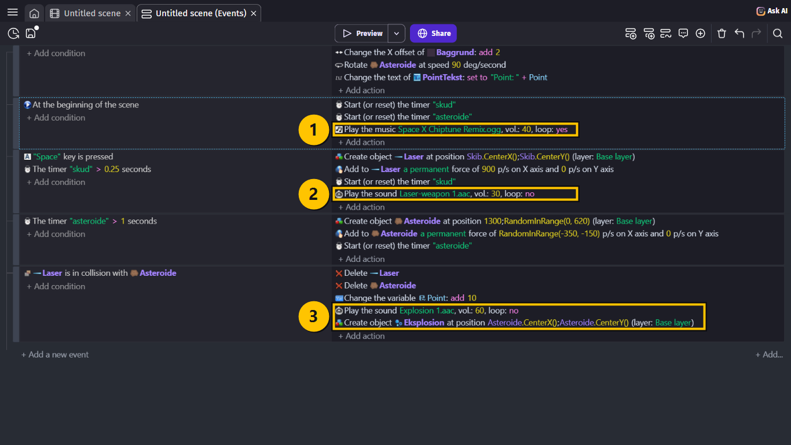

## Prøv spillet! 🎮

> **GØR DETTE**
>
> 1. Tryk **Ctrl + S** for at gemme.
> 2. Vælg **Preview**, og tænd for lyden på computeren.
> 3. Skyd nogle asteroider.
{: .lesson-action}

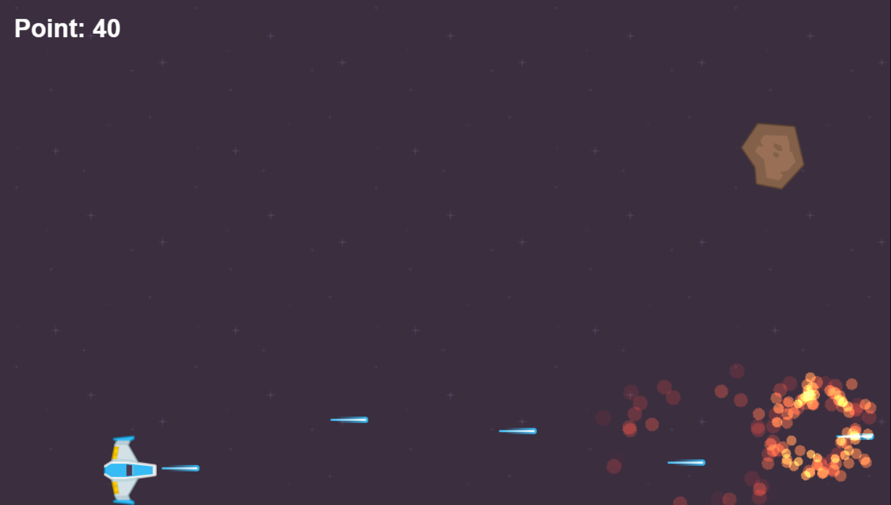

> **VIDEN**
>
> Sådan skal det virke:
>
> - Hvert skud siger *piu*.
> - Når en asteroide bliver ramt, lyder der et brag, og den sprænger i gule og røde
>   gnister.
> - Musikken spiller hele tiden og starter forfra, når nummeret er slut.
> - Pointene står på én linje, også når du har mange point.
{: .lesson-info}

## Ekstra: Lav din egen lyd

> **GØR DETTE**
>
> 1. Åbn handlingen **Play the sound Laser-weapon 1.aac** i event 3 med et dobbeltklik.
> 2. Vælg **Edit with Jfxr**. Jfxr åbner i et nyt vindue.
> 3. Find **Create new sound** i venstre side, og tryk på **Laser/shoot** nogle gange, til
>    du finder en lyd, du kan lide.
> 4. Vælg **Save** øverst til højre, og prøv spillet igen.
{: .lesson-action}

> **VIDEN**
>
> **Jfxr** er et lille program inde i GDevelop, der laver lydeffekter som i gamle
> computerspil. Hver gang du trykker på en knap under **Create new sound**, laver det en
> ny, tilfældig lyd af den slags — prøv også **Explosion** til braget. Fortryder du, så
> vælg **Cancel** i stedet for **Save**.
{: .lesson-info}

## Du er færdig med BOOM OG LYD ✅

> **VIDEN**
>
> Du er klar til næste lektion, når alt dette passer:
>
> - Jeg har et objekt, der hedder `Eksplosion`, og som bruger **Circle**-partikler.
> - Asteroider sprænger i gnister, når de bliver ramt.
> - Der er lyd på skud og eksplosioner.
> - Der spiller musik.
> - Pointene har Z `100` og står på én linje.
> - Jeg har gemt projektet.
{: .lesson-info}

> **VIDEN**
>
> Næste gang kan asteroiderne gøre skade. Skibet får en health bar, og spillet kan slutte
> med **Game Over**.
{: .lesson-info}

## Hvis noget går galt

| Problem | Prøv dette |
|---|---|
| Der kommer ingen eksplosion. | **GØR DETTE:** Tjek, at event 5 har **Create object Eksplosion**. |
| Eksplosionen kommer i øverste venstre hjørne. | **GØR DETTE:** Tjek, at der står `Asteroide.CenterX()` og `Asteroide.CenterY()` — ikke `0`. |
| Eksplosionerne bliver liggende og brænder hele tiden. | **GØR DETTE:** Åbn `Eksplosion`, og sæt flueben i **Delete when out of particles**. |
| Jeg kan ikke høre noget. | **GØR DETTE:** Tjek, at lyden er tændt på computeren, og at **Volume** ikke er `0`. |
| Musikken starter ikke. | **GØR DETTE:** Tryk på en tast eller klik i spillet. Musik må først spille, når du har rørt spillet. |
| Musikken stopper efter et minut. | **GØR DETTE:** Vælg **Yes** ved **Repeat the sound** i **Play a music file**. |
| Pointene står på to linjer. | **GØR DETTE:** Klik på teksten på scenen, og skriv `400` i **W**. |
| Skibet flyver hen over pointene. | **GØR DETTE:** Skriv `100` i **Z** for `PointTekst`. |
| Asteroiderne flyver hen over pointene. | **VIDEN:** Det er rigtigt nok endnu. Det løser vi med et lag i lektionen om bølger. |
{: .lesson-help}
