# OPGAVER TIL GDevelop – RUMSPIL – LIV OG HEALTH BAR

> **VIDEN**
>
> I bokse med en hel kant står der, hvad du skal gøre. I bokse med en stiplet kant står der
> viden, som hjælper dig med at forstå det, du laver.
>
> På billederne viser gule kasser, hvor du skal klikke. Tallene i gule cirkler passer til
> tallene i trinene, fx **(1)** og **(2)**.
{: .lesson-info}

Indtil nu har asteroiderne bare fløjet igennem skibet. Nu bliver det farligt! Skibet kan
tåle tre slag. En **health bar** øverst viser, hvor meget der er tilbage — og er den tom,
er det **GAME OVER**.

## To ord du skal kende

> **VIDEN**
>
> - **Health bar** — en bjælke, der viser, hvor meget liv man har tilbage. Den bliver
>   kortere, hver gang man bliver ramt.
> - **Trigger once** — en condition, der sørger for, at et event kun sker **én gang**, selv
>   om de andre conditions bliver ved med at være sande.
{: .lesson-info}

## Opgave 1 – LIV: Hent en health bar

> **GØR DETTE**
>
> 1. Vælg **+ Add object** og fanen **Asset Store**.
> 2. Skriv `health bar` i søgefeltet **(1)**.
> 3. Vælg **Health Bar Fill** **(2)** — den røde bjælke, der er en **tiled sprite**.
{: .lesson-action}

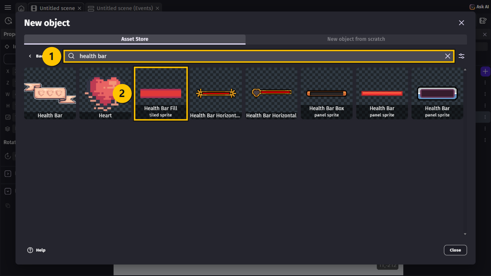

> **GØR DETTE**
>
> 1. Tjek, at licensen er **CC0** **(1)**. Så må du bruge den gratis.
> 2. Vælg **Add to the scene** **(2)**, og vælg **Close**.
> 3. Giv `Health_Bar_Fill` det nye navn `HealthBar` (**F2**).
{: .lesson-action}

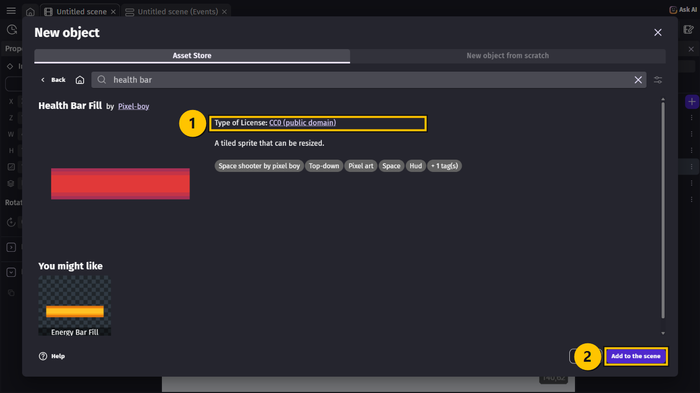

> **GØR DETTE**
>
> 1. Træk `HealthBar` op i øverste højre hjørne af scenen, og klik på den.
> 2. Skriv `940` i **X** og `25` i **Y** **(1)**.
> 3. Klik på kæden ved **W** og **H**, så de ikke hænger sammen. Skriv `300` i **W** og `18`
>    i **H** **(2)**.
{: .lesson-action}

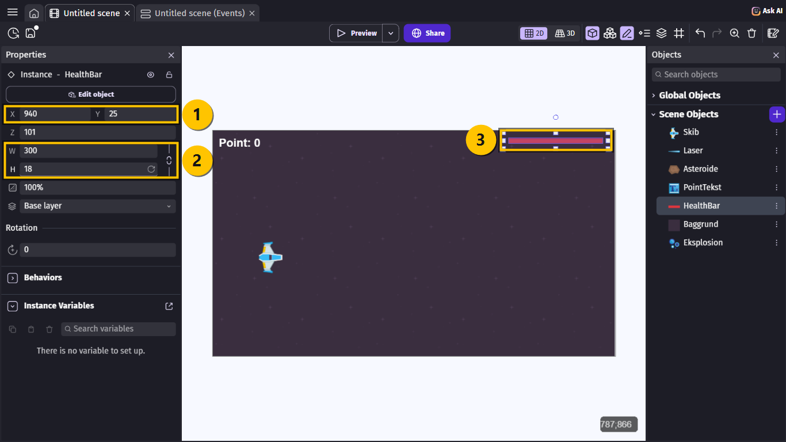

> **VIDEN**
>
> Health baren er en **tiled sprite**, ligesom baggrunden. Den kan gøres kortere og længere
> uden at blive mast.
{: .lesson-info}

## Opgave 2 – LIV: En variabel til livene

> **GØR DETTE**
>
> 1. Klik på et tomt sted uden for scenen, så **Scene Variables** kommer frem til venstre.
> 2. Vælg **+** ved **Scene Variables**.
> 3. Kald den nye variabel `Liv`, og skriv `3` i værdien **(1)**.
{: .lesson-action}

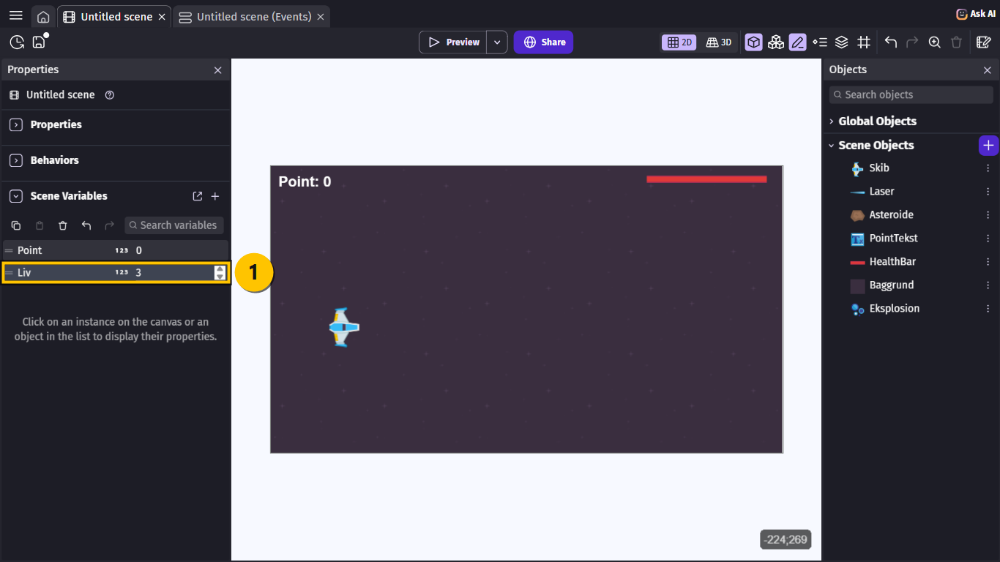

## Opgave 3 – LIV: Baren følger livene

> **VIDEN**
>
> Hvert liv er **100** pixels af baren. Med 3 liv er den 300 lang, med 2 liv er den 200,
> med 1 liv er den 100, og med 0 liv er den væk.
{: .lesson-info}

> **GØR DETTE**
>
> 1. Gå til fanen **Untitled scene (Events)**.
> 2. I event 1: Vælg **+ Add action**, vælg `HealthBar` **(1)**, skriv `width`, og vælg
>    **Width** **(2)**.
> 3. Lad **Modification's sign** stå på **= (set to)**.
> 4. Skriv `Liv * 100` i **Width** **(3)**, og vælg **Ok**.
{: .lesson-action}

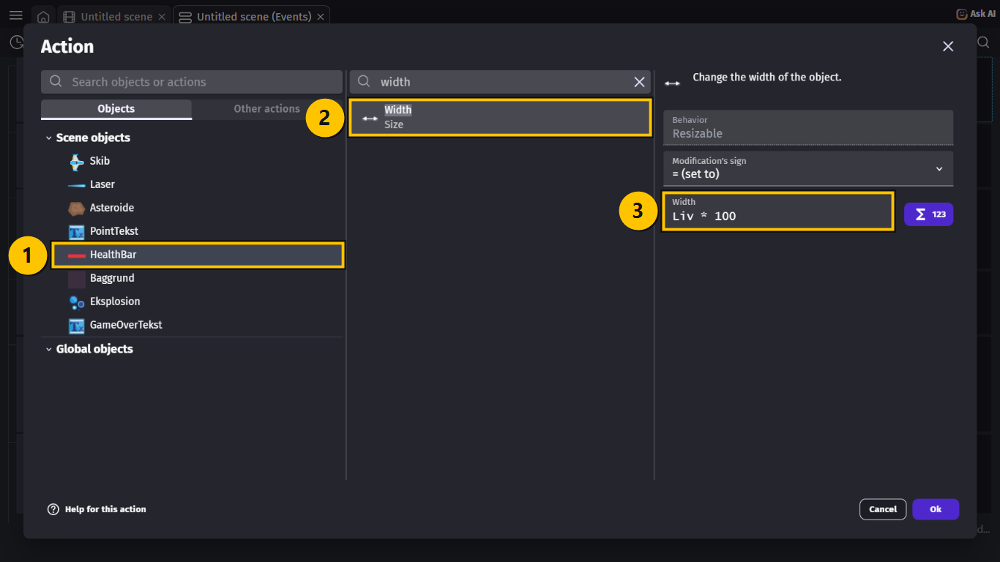

> **VIDEN**
>
> `*` betyder **gange**. `Liv * 100` er "livene gange 100". Fordi event 1 sker hele tiden,
> passer baren altid til, hvor mange liv du har.
{: .lesson-info}

## Opgave 4 – LIV: Skibet bliver ramt

> **GØR DETTE**
>
> 1. Vælg **+ Add a new event**, og vælg **+ Add condition**.
> 2. Vælg `Skib` **(1)**, skriv `collision`, og vælg **Collision** **(2)**.
> 3. Vælg `Asteroide` i **Object** **(3)**, og vælg **Ok**.
{: .lesson-action}

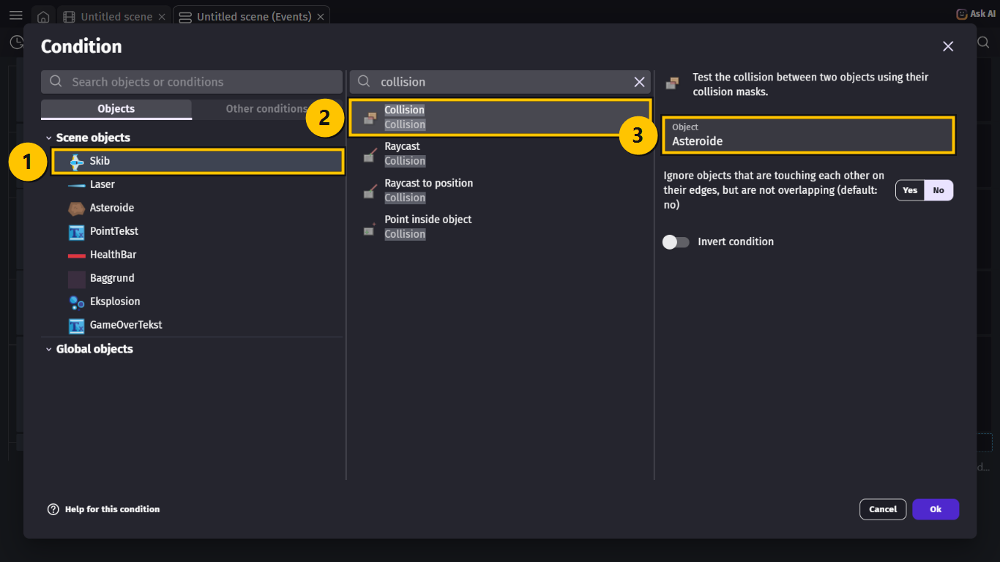

> **GØR DETTE**
>
> Tilføj disse fire actions til det nye event:
>
> 1. `Asteroide` → **Delete the object**.
> 2. **Change variable value**: vælg `Liv` **(1)**, vælg **- (subtract)** **(2)**, og skriv
>    `1` **(3)**.
> 3. **Play a sound**: skriv `Explo` i feltet, og vælg **Explosion 1.aac**, som du allerede
>    har. Skriv `80` i **Volume** og `0.7` i **Pitch (speed)**.
> 4. `Eksplosion` → **Create an object** ved `Asteroide.CenterX()` og `Asteroide.CenterY()`.
{: .lesson-action}

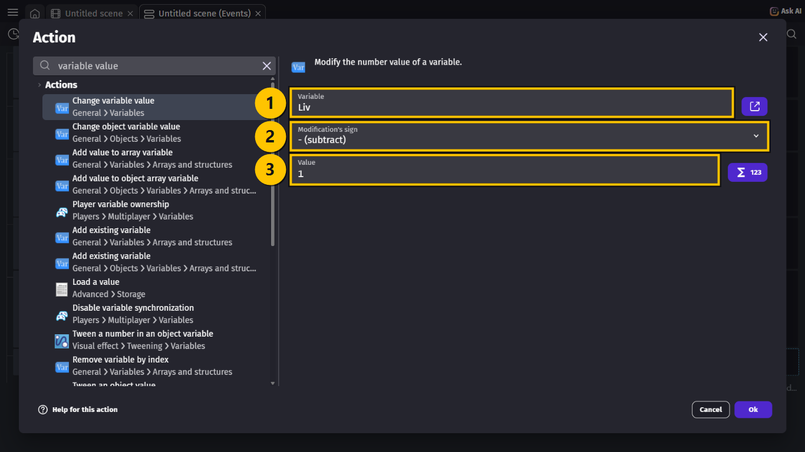

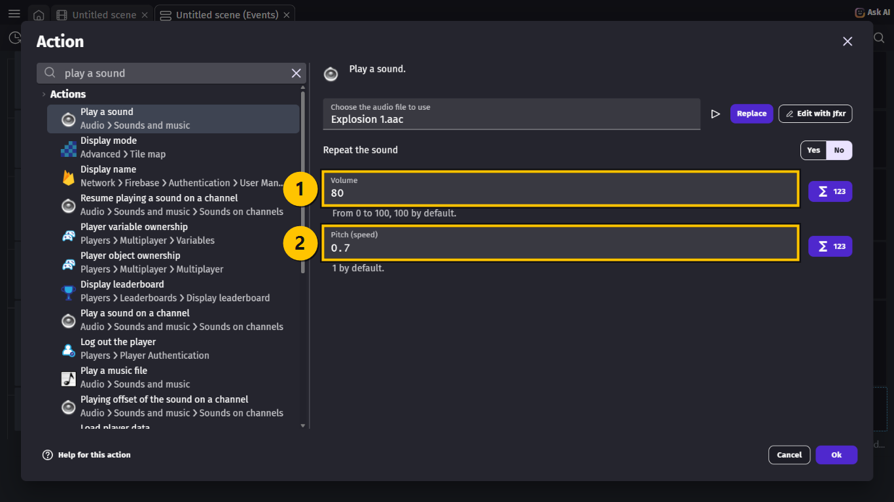

> **VIDEN**
>
> - Asteroiden bliver slettet, så den kun kan ramme **én** gang.
> - En **Pitch** på `0.7` gør braget dybere. Så kan man høre forskel på, om man rammer en
>   asteroide, eller om man selv bliver ramt.
> - Lyden ligger allerede i projektet, så du behøver ikke hente den igen. Du skriver bare
>   navnet.
{: .lesson-info}

## Opgave 5 – LIV: GAME OVER

> **GØR DETTE**
>
> 1. Vælg **+ Add object**, fanen **New object from scratch**, og vælg **Text**.
> 2. Skriv `GameOverTekst` i **Object name** **(1)**.
> 3. Skriv `96` i **Size**, sæt flueben i **Bold**, og vælg den røde farve **(2)**.
> 4. Skriv `GAME OVER` i **Initial text to display** **(3)**.
> 5. Vælg **Apply**. Træk den **ikke** ind på scenen.
{: .lesson-action}

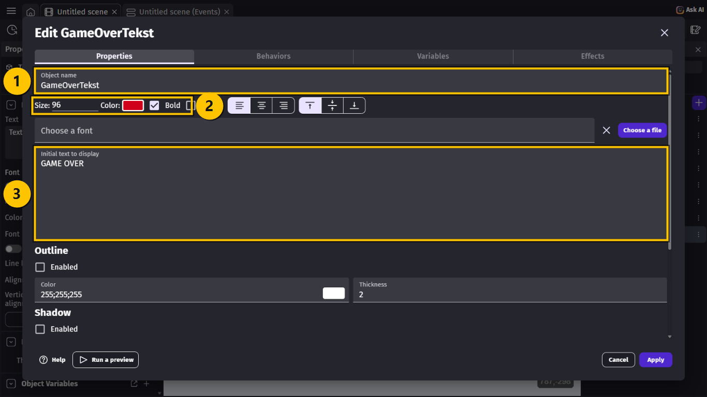

> **GØR DETTE**
>
> 1. Gå til Events-siden, vælg **+ Add a new event**, og vælg **+ Add condition**.
> 2. Skriv `variable value`, og vælg **Variable value** **(1)**.
> 3. Vælg `Liv` **(2)**, vælg **≤ (less or equal to)** **(3)**, og skriv `0` **(4)**.
> 4. Vælg **Ok**.
{: .lesson-action}

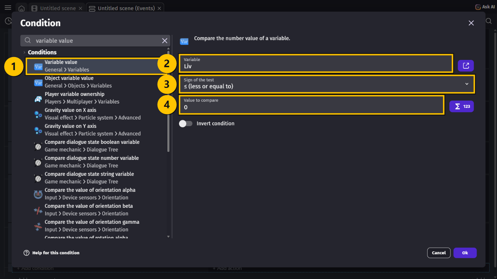

> **GØR DETTE**
>
> 1. Vælg **+ Add condition** i samme event.
> 2. Skriv `trigger once`, og vælg **Trigger once while true** **(1)**.
> 3. Vælg **Ok**.
{: .lesson-action}

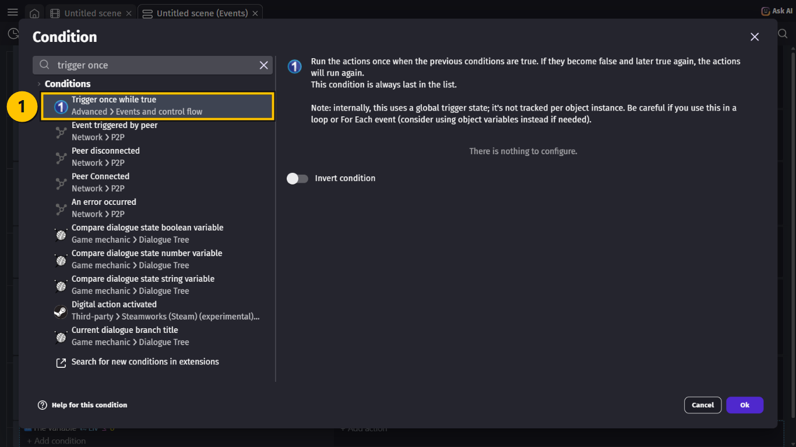

> **VIDEN**
>
> Når `Liv` først er 0, bliver den ved med at være 0. Uden **Trigger once** ville GDevelop
> lave en ny GAME OVER-tekst og en ny eksplosion 60 gange i sekundet!
{: .lesson-info}

> **GØR DETTE**
>
> Tilføj disse fire actions til det nye event:
>
> 1. `Eksplosion` → **Create an object** ved `Skib.CenterX()` og `Skib.CenterY()`.
> 2. `Skib` → **Delete the object**.
> 3. `GameOverTekst` → **Create an object** ved X `360` og Y `300`.
> 4. `GameOverTekst` **(1)**: skriv `z order`, vælg **Z order** **(2)**, og skriv `1000`
>    **(3)**.
{: .lesson-action}

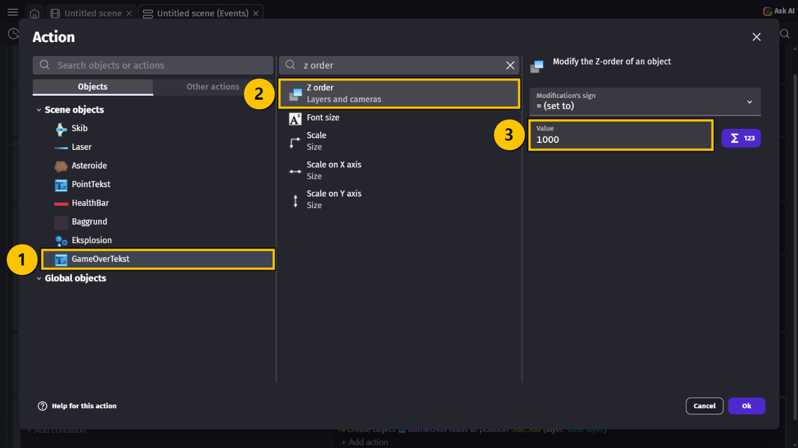

> **VIDEN**
>
> - Eksplosionen skal laves **før** skibet slettes, ellers ved GDevelop ikke, hvor skibet
>   var.
> - **Z order** `1000` lægger teksten over alt andet, så asteroiderne flyver **bag** den.
>   Det er det samme som **Z** på scenen, bare som en handling, fordi teksten først bliver
>   lavet, når spillet slutter.
{: .lesson-info}

## Opgave 6 – LIV: Ingen skud uden skib

> **VIDEN**
>
> Når skibet er væk, må mellemrumstasten ikke længere lave skud.
{: .lesson-info}

> **GØR DETTE**
>
> 1. Find event 3 (skud-eventet), og vælg **+ Add condition**.
> 2. Vælg **Variable value**: `Liv` **> (greater than)** `0` **(1)** **(2)**.
> 3. Vælg **Ok**.
{: .lesson-action}

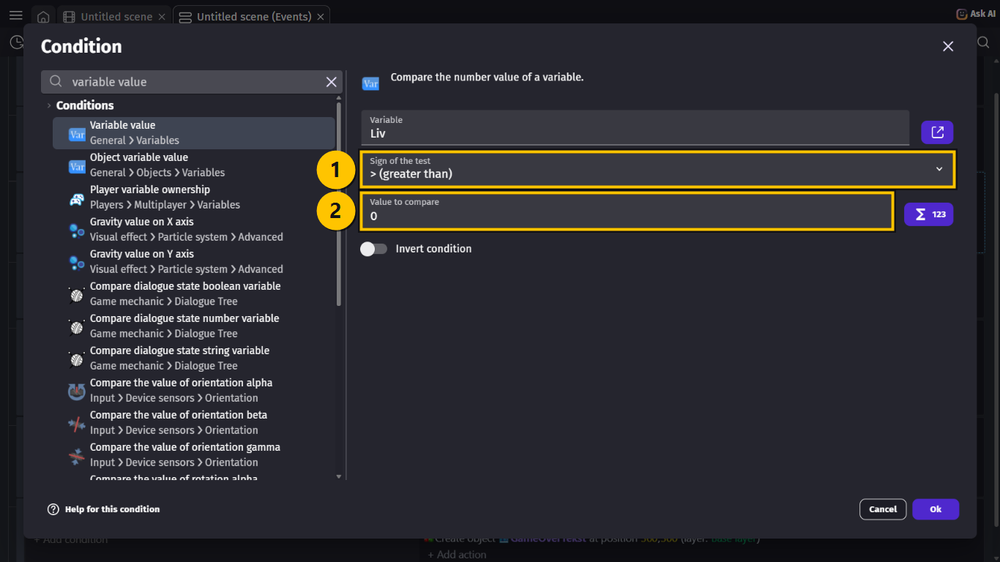

## Hele koden samlet

> **VIDEN**
>
> Sådan ser de nye dele ud. Event 3 har fået en ny condition **(1)**, og der er to nye
> events: skibet bliver ramt **(2)** og GAME OVER **(3)**.
>
> | # | Conditions (HVIS) | Actions (SÅ) |
> |---|---|---|
> | 1 | *(ingen — sker hele tiden)* | Change the X offset of `Baggrund`: **add 2** Rotate `Asteroide` at speed `90` Change the text of `PointTekst`: **set to** `"Point: " + Point` Change the width of `HealthBar`: **set to** `Liv * 100` |
> | 2 | **At the beginning of the scene** | Start (or reset) the timer `"skud"` Start (or reset) the timer `"asteroide"` Play the music `Space X Chiptune Remix.ogg`, vol. `40`, loop **yes** |
> | 3 | `"Space"` key is pressed The timer `"skud"` **>** `0.25` seconds The variable `Liv` **>** `0` | Create object `Laser` at `Skib.CenterX()`; `Skib.CenterY()` Add to `Laser` a **permanent** force of `900` on X and `0` on Y Start (or reset) the timer `"skud"` Play the sound `Laser-weapon 1.aac`, vol. `30` |
> | 4 | The timer `"asteroide"` **>** `1` seconds | Create object `Asteroide` at `1300`; `RandomInRange(0, 620)` Add to `Asteroide` a **permanent** force of `RandomInRange(-350, -150)` on X and `0` on Y Start (or reset) the timer `"asteroide"` |
> | 5 | `Laser` is in collision with `Asteroide` | Delete `Laser` Delete `Asteroide` Change the variable `Point`: **add 10** Play the sound `Explosion 1.aac`, vol. `60` Create object `Eksplosion` at `Asteroide.CenterX()`; `Asteroide.CenterY()` |
> | 6 | `Skib` is in collision with `Asteroide` | Delete `Asteroide` Change the variable `Liv`: **subtract 1** Play the sound `Explosion 1.aac`, vol. `80`, pitch `0.7` Create object `Eksplosion` at `Asteroide.CenterX()`; `Asteroide.CenterY()` |
> | 7 | The variable `Liv` **≤** `0` **Trigger once** | Create object `Eksplosion` at `Skib.CenterX()`; `Skib.CenterY()` Delete `Skib` Create object `GameOverTekst` at `360`; `300` Change the z-order of `GameOverTekst`: **set to** `1000` |
{: .lesson-info}

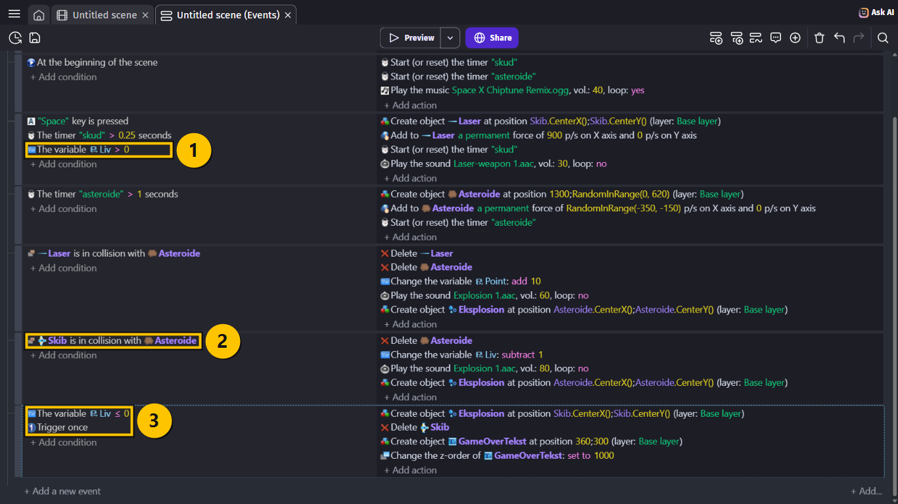

## Prøv spillet! 🎮

> **GØR DETTE**
>
> 1. Tryk **Ctrl + S** for at gemme.
> 2. Vælg **Preview**.
> 3. Lad en asteroide ramme skibet. Så en til. Og en til.
{: .lesson-action}

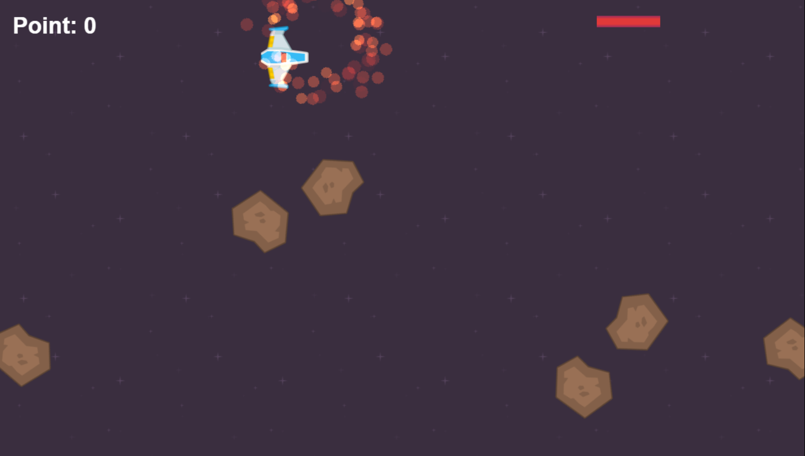

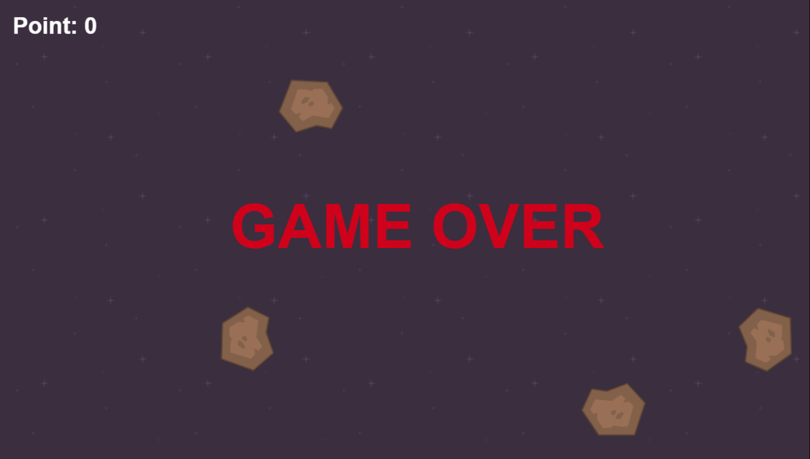

> **VIDEN**
>
> Sådan skal det virke:
>
> - Når en asteroide rammer skibet, lyder der et dybt brag, og health baren bliver 100
>   kortere.
> - Efter tre slag sprænger skibet, og der står **GAME OVER**.
> - Når skibet er væk, kommer der ikke flere skud.
> - Asteroiderne bliver ved med at flyve — **bag** teksten.
>
> Du starter forfra ved at lukke vinduet og vælge **Preview** igen. I lektionen om menuen
> får spillet en rigtig **Game Over**-skærm med en knap til at prøve igen.
{: .lesson-info}

## Ekstra: Flere liv, eller færre

> **GØR DETTE**
>
> 1. Skift værdien af `Liv` til `5` under **Scene Variables**.
> 2. Skift `Liv * 100` til `Liv * 60` i event 1, så baren stadig er 300 lang fra starten.
{: .lesson-action}

> **VIDEN**
>
> Health baren skal altid starte lige lang. Prøv at regne det ud: Hvilket tal skal du gange
> med, hvis du har 10 liv? (Svaret er `30`, for 10 gange 30 er 300.)
{: .lesson-info}

## Du er færdig med LIV OG HEALTH BAR ✅

> **VIDEN**
>
> Du er klar til næste lektion, når alt dette passer:
>
> - Der er en rød health bar øverst til højre.
> - Baren bliver kortere, når en asteroide rammer skibet.
> - Efter tre slag sprænger skibet, og der står **GAME OVER**.
> - Man kan ikke skyde, når skibet er væk.
> - Jeg har gemt projektet.
{: .lesson-info}

> **VIDEN**
>
> Næste gang kommer der fjendeskibe, som skyder tilbage.
{: .lesson-info}

## Hvis noget går galt

| Problem | Prøv dette |
|---|---|
| Health baren bliver ikke kortere. | **GØR DETTE:** Tjek, at event 1 har **Change the width of HealthBar: set to Liv * 100**. |
| Baren er for høj eller for tyk. | **GØR DETTE:** Klik på kæden ved **W** og **H**, og skriv `18` i **H** igen. |
| Skibet mister alle liv på én gang. | **GØR DETTE:** Tjek, at event 6 sletter `Asteroide`. Ellers rammer den samme asteroide mange gange. |
| Der står GAME OVER mange gange oven i hinanden. | **GØR DETTE:** Tilføj **Trigger once while true** til event 7. |
| Der står GAME OVER, med det samme spillet starter. | **GØR DETTE:** Tjek, at `Liv` starter på `3` under **Scene Variables**. |
| Der er ingen eksplosion, når skibet sprænger. | **GØR DETTE:** Flyt **Create object Eksplosion** op over **Delete Skib** i event 7. |
| Asteroiderne flyver hen over GAME OVER. | **GØR DETTE:** Tjek, at event 7 har **Z order** `1000` for `GameOverTekst`. |
| Skuddene kommer stadig efter GAME OVER. | **GØR DETTE:** Tilføj `Liv` **>** `0` til event 3. |
{: .lesson-help}
