# OPGAVER TIL GDevelop – RUMSPIL – FJENDER

> **VIDEN**
>
> I bokse med en hel kant står der, hvad du skal gøre. I bokse med en stiplet kant står der
> viden, som hjælper dig med at forstå det, du laver.
>
> På billederne viser gule kasser, hvor du skal klikke. Tallene i gule cirkler passer til
> tallene i trinene, fx **(1)** og **(2)**.
{: .lesson-info}

Asteroider er ikke så kloge. Nu kommer der **fjendeskibe**! De flyver i bølger op og ned,
og de skyder røde laserskud mod dig.

## Tre ord du skal kende

> **VIDEN**
>
> - **Objektgruppe** — flere objekter, der er samlet under ét navn. Et event, der bruger
>   gruppen, virker for alle objekterne i den.
> - **Objekt-timer** — et stopur, som hvert objekt har for sig selv. Så kan hver fjende
>   skyde i sit eget tempo.
> - **sin** — en regnefunktion, der svinger frem og tilbage mellem -1 og 1. Den får
>   fjenderne til at flyve i bølger.
{: .lesson-info}

## Opgave 1 – FJENDER: Hent en fjende og en rød laser

> **GØR DETTE**
>
> 1. Vælg **+ Add object**, og åbn **Space Shooter Redux** i Asset Store.
> 2. Vælg mappen **Enemies**.
> 3. Vælg **Black spaceship 1** **(1)**, og vælg **Add to the scene**.
{: .lesson-action}

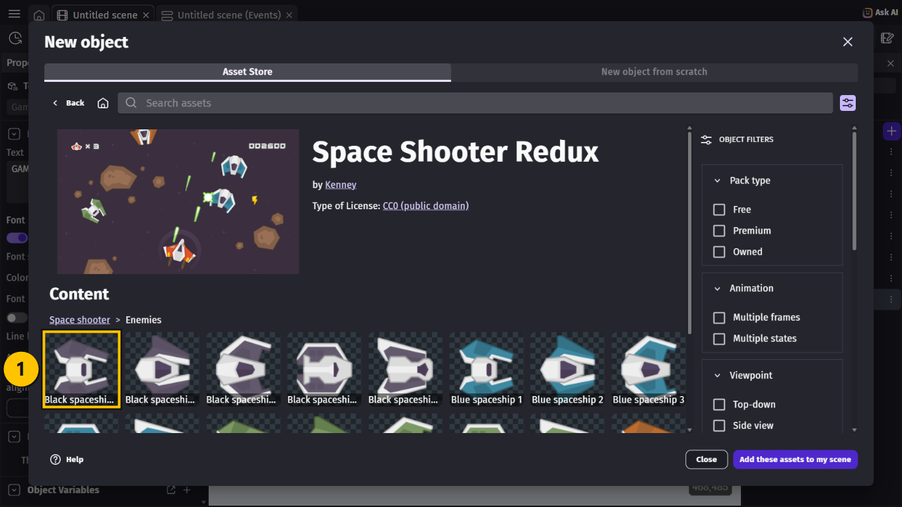

> **GØR DETTE**
>
> 1. Giv `Black_spaceship_1` det nye navn `Fjende` **(1)** (**F2**).
> 2. Giv `Fjende` behavioren **Destroy when outside of the screen**.
{: .lesson-action}

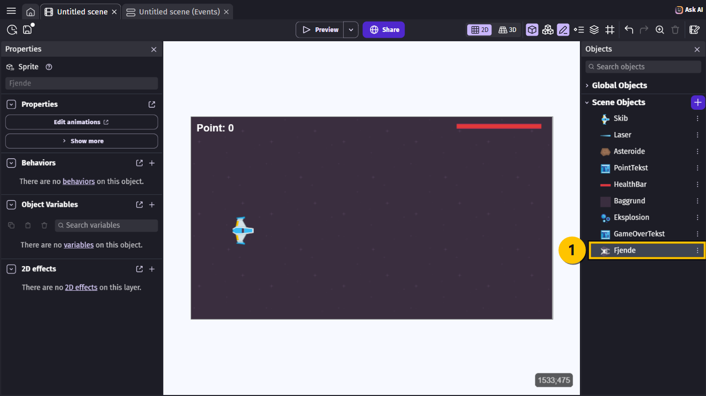

> **GØR DETTE**
>
> 1. Åbn **Space Shooter Redux** igen, og vælg mappen **Lasers**.
> 2. Rul ned til de røde lasere, og vælg **Red laser 02** **(1)**. Vælg **Add to the scene**.
> 3. Giv den det nye navn `FjendeLaser` **(1)**.
> 4. Giv `FjendeLaser` behavioren **Destroy when outside of the screen** **(2)**.
{: .lesson-action}

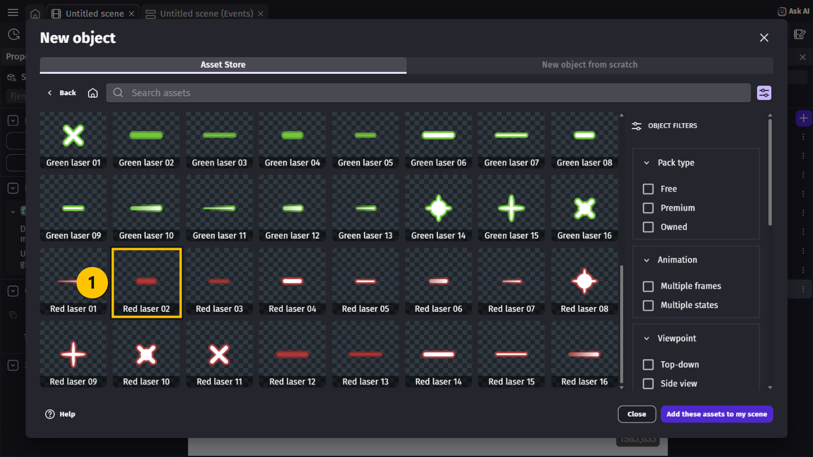

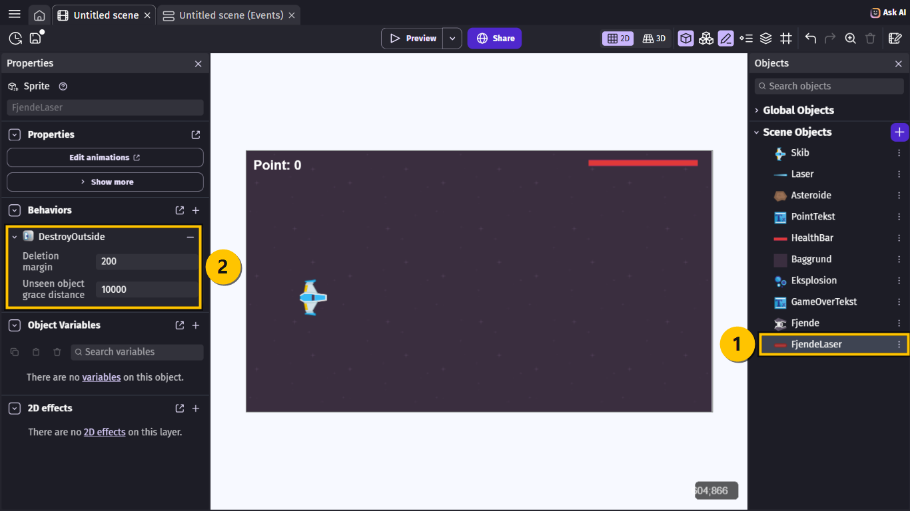

> **VIDEN**
>
> Ingen af dem skal trækkes ind på scenen. Events laver dem, mens spillet kører.
{: .lesson-info}

## Opgave 2 – FJENDER: En gruppe til alt, der kan skydes ned

> **VIDEN**
>
> Du har allerede to events om asteroider: skud rammer asteroide (event 5), og skib rammer
> asteroide (event 6). Fjenderne skal virke på præcis samme måde. I stedet for at skrive
> de to events en gang til, samler vi `Asteroide` og `Fjende` i en **gruppe**.
{: .lesson-info}

> **GØR DETTE**
>
> 1. Gå til fanen **Untitled scene**.
> 2. Vælg knappen **Open Object Groups Panel** **(1)** øverst til højre.
> 3. Vælg **+** ved **Scene Groups** **(2)**.
{: .lesson-action}

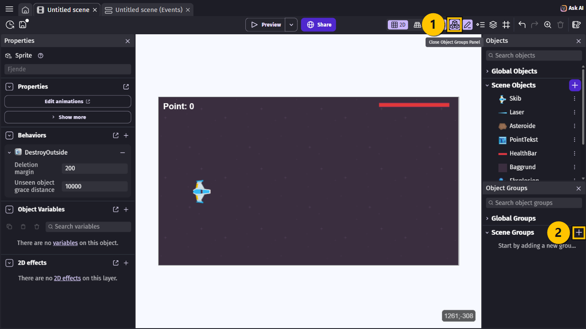

> **GØR DETTE**
>
> 1. Skriv `Fjender` i **Group name** **(1)**.
> 2. Klik i **Choose an object to add to the group** **(2)**, og vælg `Asteroide`.
> 3. Klik der igen, og vælg `Fjende`. Nu står begge i gruppen **(3)**.
> 4. Vælg **Create** **(4)**, og vælg **Apply** i den næste boks.
{: .lesson-action}

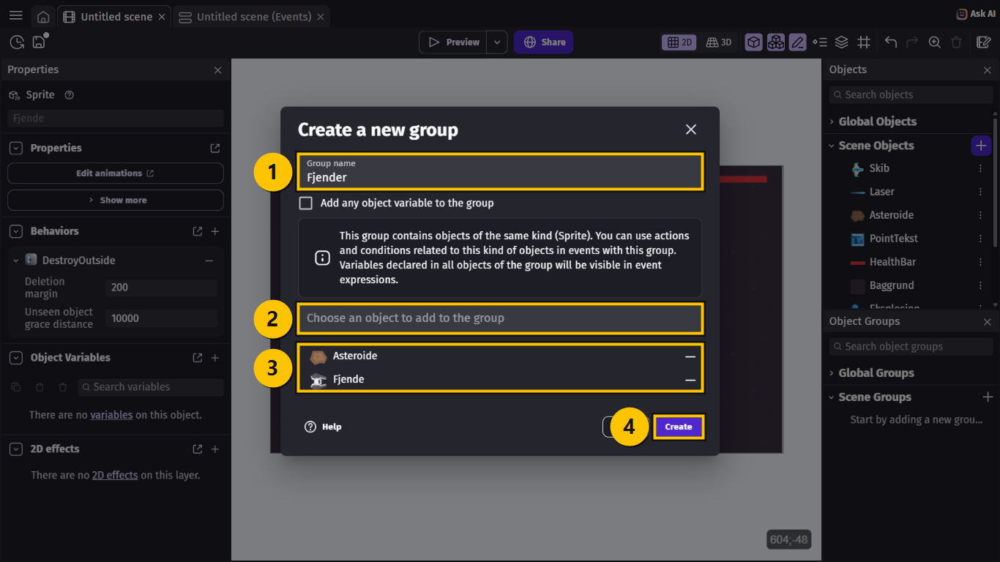

## Opgave 3 – FJENDER: Brug gruppen i event 5 og 6

> **GØR DETTE**
>
> 1. Gå til Events-siden.
> 2. Dobbeltklik på conditionen **Laser is in collision with Asteroide** i event 5.
> 3. Skriv `Fjender` i **Object** **(1)**. Gruppen står nederst i listen til venstre **(2)**.
> 4. Vælg **Ok**.
{: .lesson-action}

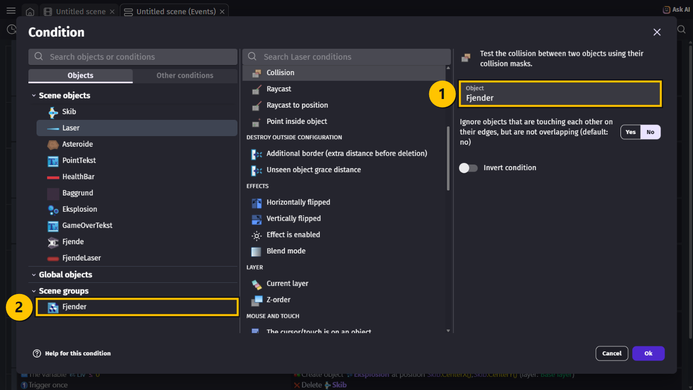

> **GØR DETTE**
>
> Skift `Asteroide` ud med `Fjender` alle disse steder:
>
> 1. Event 5: conditionen **(1)**, **Delete Asteroide** **(2)** og positionen i **Create
>    object Eksplosion** **(3)** — skriv `Fjender.CenterX()` og `Fjender.CenterY()`.
> 2. Event 6: de samme tre steder (de gule kasser uden tal).
>
> Dobbeltklik på hver linje for at åbne den. Ved **Delete** vælger du `Fjender` i listen
> til venstre og derefter **Delete the object** igen.
{: .lesson-action}

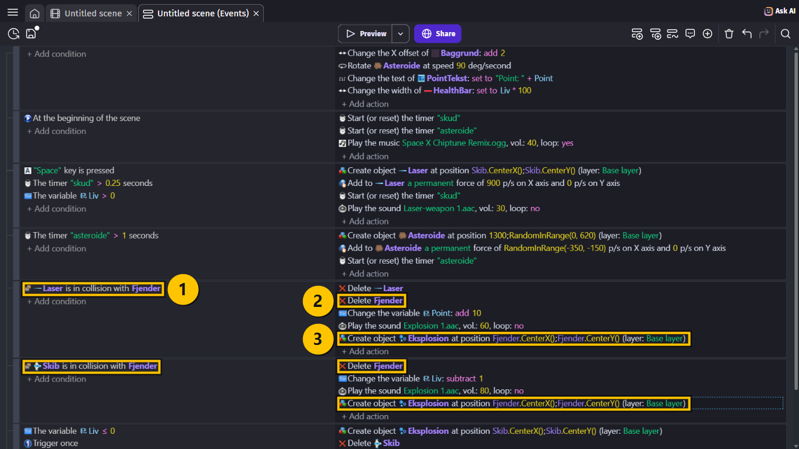

> **VIDEN**
>
> **Lad `Asteroide` stå** i event 1 (**Rotate**) og event 4 (**Create object**). Fjenderne
> skal ikke dreje rundt, og event 4 skal stadig kun lave asteroider.
{: .lesson-info}

## Opgave 4 – FJENDER: En fjende hvert 3. sekund

> **GØR DETTE**
>
> 1. I event 2: tilføj **Start (or reset) a scene timer** med `"fjende"`.
> 2. Vælg **+ Add a new event**, og tilføj conditionen **Value of a scene timer**:
>    `"fjende"` **> (greater than)** `3`.
{: .lesson-action}

> **GØR DETTE**
>
> Tilføj disse actions til det nye event:
>
> 1. `Fjende` **(1)** → **Create an object** **(2)** ved X `1300` og Y
>    `RandomInRange(100, 620)` **(3)**.
{: .lesson-action}

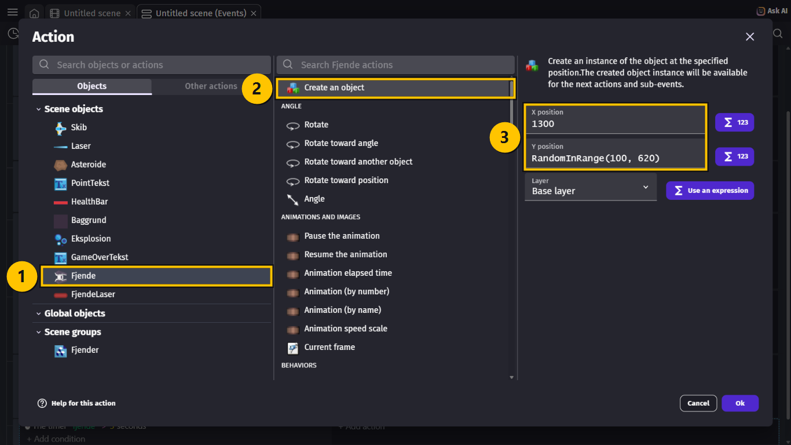

> **GØR DETTE**
>
> 2. `Fjende` → **Add a force**: `-150` på X, `0` på Y, **Permanent**.
> 3. `Fjende` → skriv `timer`, og vælg **Start (or reset) an object timer** **(1)**. Skriv
>    `"skyd"` **(2)**.
{: .lesson-action}

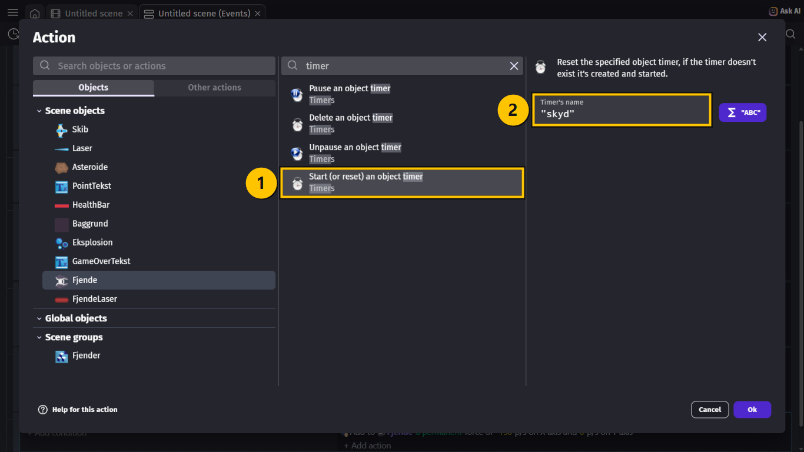

> **GØR DETTE**
>
> 4. **Start (or reset) a scene timer** med `"fjende"`.
> 5. `Fjende` → skriv `flip`, og vælg **Flip the object horizontally** **(1)**. Vælg **Yes**
>    **(2)**.
{: .lesson-action}

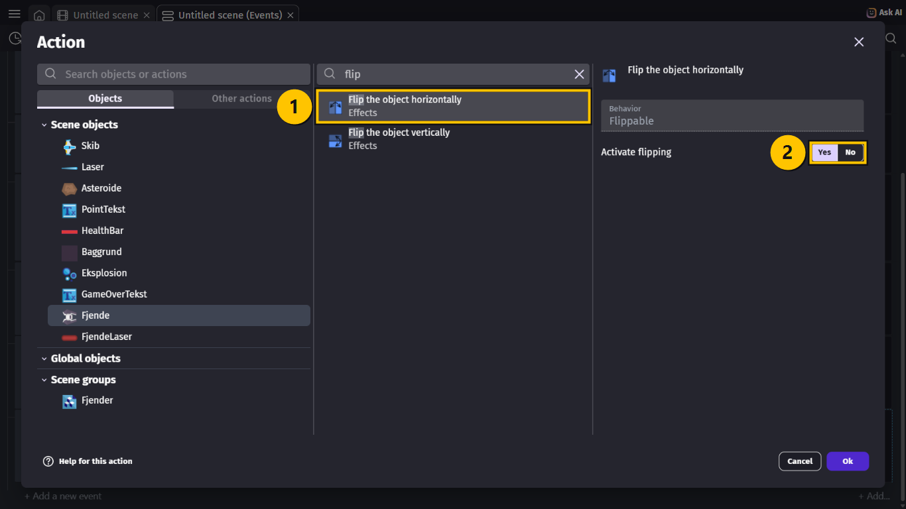

> **VIDEN**
>
> - Den nye timer `"skyd"` hører til **hver enkelt fjende**. Den starter i det øjeblik,
>   fjenden bliver lavet. I opgave 6 bruger vi den til at få fjenden til at skyde.
> - Fjendeskibene i pakken vender den forkerte vej. **Flip** vender dem om, så de kigger på
>   dig. Den handling kender du måske fra platformspillet, hvor helten skulle vende sig.
{: .lesson-info}

## Opgave 5 – FJENDER: Flyv i bølger

> **GØR DETTE**
>
> 1. I event 1: Vælg **+ Add action**, vælg `Fjende` og **Add a force**.
> 2. Skriv `0` i **Speed on X axis** og `200 * sin(TimeFromStart() * 3)` i **Speed on Y
>    axis** **(1)**.
> 3. Vælg **Instant** **(2)**, og vælg **Ok**.
{: .lesson-action}

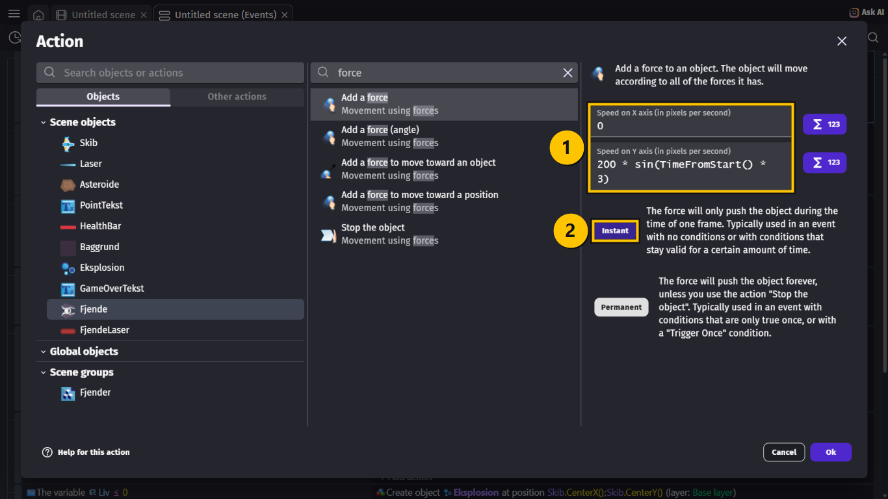

> **VIDEN**
>
> - `TimeFromStart()` er, hvor mange sekunder spillet har kørt.
> - `sin( )` laver tallet om til noget, der svinger fra `-1` op til `1` og ned igen.
> - Gange `200` betyder, at fjenden flyver op til 200 pixels i sekundet op eller ned.
>
> **Instant** betyder, at kraften kun virker i ét billede. Fordi event 1 sker hele tiden,
> får fjenden en ny kraft 60 gange i sekundet — og den ændrer sig med `sin`.
{: .lesson-info}

## Opgave 6 – FJENDER: Fjenderne skyder

> **GØR DETTE**
>
> 1. Vælg **+ Add a new event**, og vælg **+ Add condition**.
> 2. Vælg `Fjende`, skriv `timer`, og vælg **Value of an object timer** **(1)**.
> 3. Skriv `"skyd"` **(2)**, vælg **> (greater than)** **(3)**, og skriv `1.5` **(4)**.
{: .lesson-action}

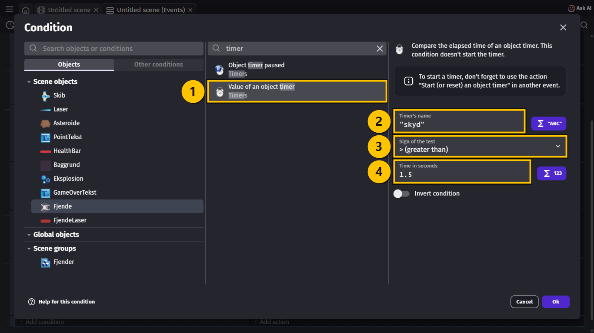

> **GØR DETTE**
>
> Tilføj disse actions:
>
> 1. `FjendeLaser` **(1)** → **Create an object** **(2)** ved `Fjende.CenterX()` og
>    `Fjende.CenterY()` **(3)**.
> 2. `FjendeLaser` → **Add a force**: `-500` på X, `0` på Y, **Permanent**.
> 3. `Fjende` → **Start (or reset) an object timer** med `"skyd"`.
> 4. **Play a sound**: `Laser-weapon 1.aac`, **Volume** `25`, **Pitch** `0.6`.
{: .lesson-action}

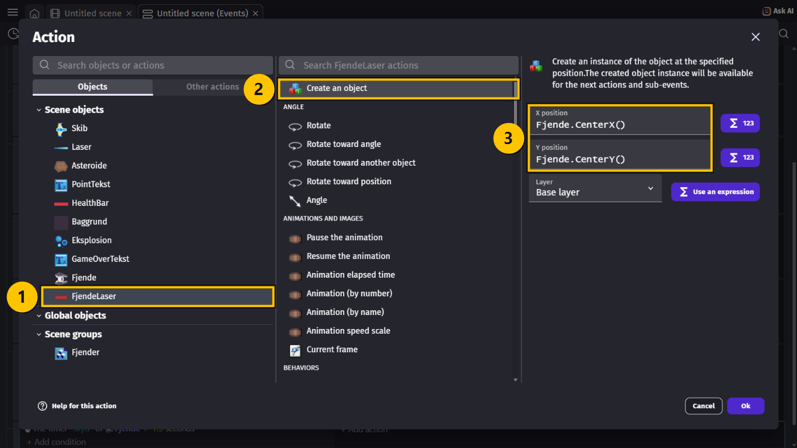

> **VIDEN**
>
> Det er den samme laserlyd som din egen, bare med en lavere **Pitch**. Så lyder fjendens
> skud dybere, og du kan høre forskel.
{: .lesson-info}

> **GØR DETTE**
>
> 1. Vælg **+ Add a new event**, og tilføj conditionen: `FjendeLaser` **(1)** →
>    **Collision** **(2)** med `Skib` **(3)**.
> 2. Tilføj disse actions: **Delete** `FjendeLaser`, `Liv` **- (subtract)** `1`, og **Play a
>    sound** `Explosion 1.aac` med **Volume** `80` og **Pitch** `0.7`.
{: .lesson-action}

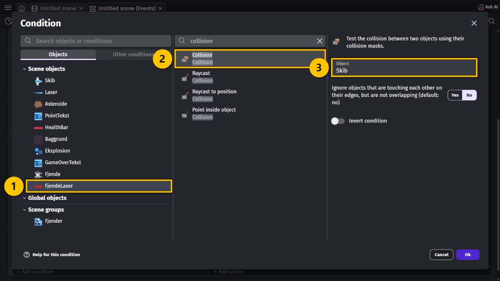

## Hele koden samlet

> **VIDEN**
>
> De nye dele: bølgen i event 1 **(1)**, timeren `"fjende"` i event 2 **(2)** og tre nye
> events nederst: nye fjender **(3)**, fjender skyder **(4)** og fjendeskud rammer **(5)**.
>
> | # | Conditions (HVIS) | Actions (SÅ) |
> |---|---|---|
> | 1 | *(ingen — sker hele tiden)* | … som før … Add to `Fjende` an **instant** force of `0` on X and `200 * sin(TimeFromStart() * 3)` on Y |
> | 2 | **At the beginning of the scene** | … som før … Start (or reset) the timer `"fjende"` |
> | 5 | `Laser` is in collision with `Fjender` | Delete `Laser` Delete `Fjender` Change the variable `Point`: **add 10** Play the sound `Explosion 1.aac`, vol. `60` Create object `Eksplosion` at `Fjender.CenterX()`; `Fjender.CenterY()` |
> | 6 | `Skib` is in collision with `Fjender` | Delete `Fjender` Change the variable `Liv`: **subtract 1** Play the sound `Explosion 1.aac`, vol. `80`, pitch `0.7` Create object `Eksplosion` at `Fjender.CenterX()`; `Fjender.CenterY()` |
> | 8 | The timer `"fjende"` **>** `3` seconds | Create object `Fjende` at `1300`; `RandomInRange(100, 620)` Add to `Fjende` a **permanent** force of `-150` on X and `0` on Y Start (or reset) the timer `"skyd"` of `Fjende` Start (or reset) the timer `"fjende"` Flip horizontally `Fjende`: **yes** |
> | 9 | The timer `"skyd"` of `Fjende` **>** `1.5` seconds | Create object `FjendeLaser` at `Fjende.CenterX()`; `Fjende.CenterY()` Add to `FjendeLaser` a **permanent** force of `-500` on X and `0` on Y Start (or reset) the timer `"skyd"` of `Fjende` Play the sound `Laser-weapon 1.aac`, vol. `25`, pitch `0.6` |
> | 10 | `FjendeLaser` is in collision with `Skib` | Delete `FjendeLaser` Change the variable `Liv`: **subtract 1** Play the sound `Explosion 1.aac`, vol. `80`, pitch `0.7` |
>
> Event 3, 4 og 7 er ikke ændret.
{: .lesson-info}

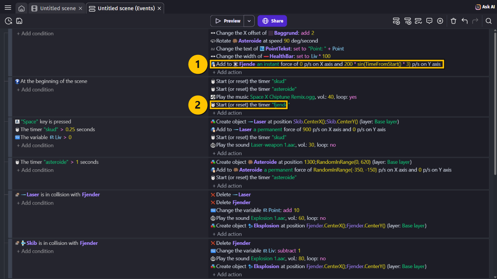

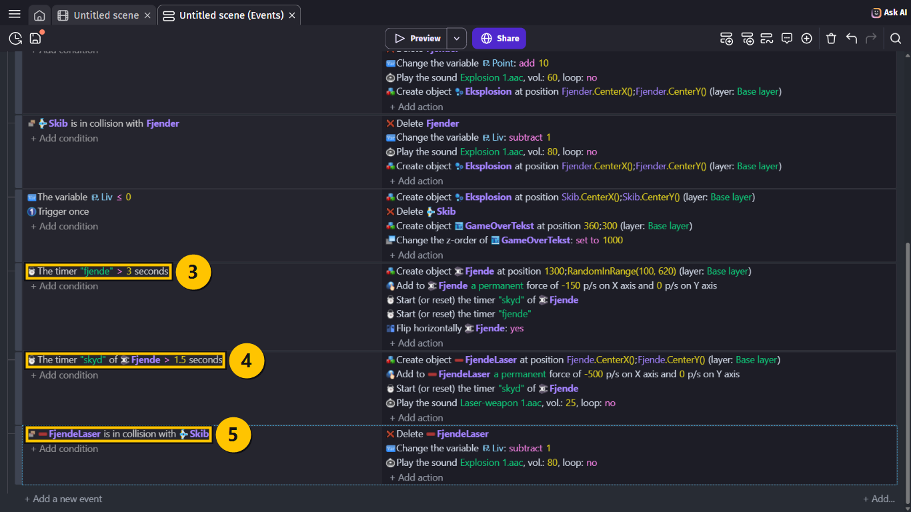

## Prøv spillet! 🎮

> **GØR DETTE**
>
> 1. Tryk **Ctrl + S** for at gemme.
> 2. Vælg **Preview**.
> 3. Skyd fjenderne, og undgå deres røde skud.
{: .lesson-action}

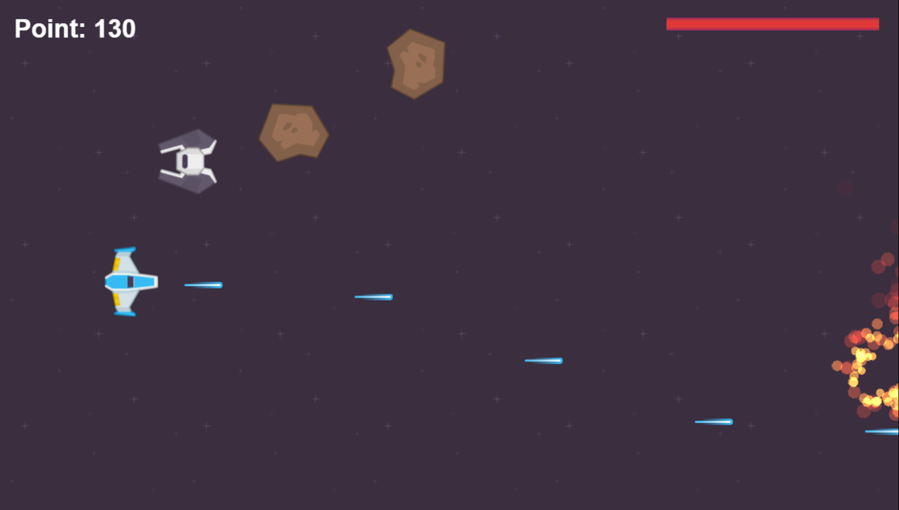

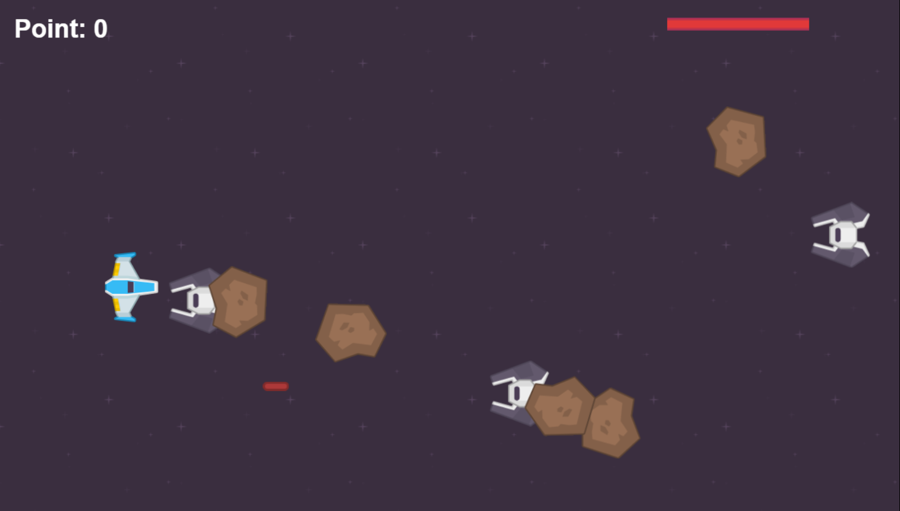

> **VIDEN**
>
> Sådan skal det virke:
>
> - Hvert 3. sekund kommer der en fjende ind fra højre. Den vender mod dig.
> - Fjenderne flyver langsomt mod venstre, og op og ned i bølger.
> - Hver fjende skyder et rødt skud hvert halvandet sekund.
> - Et rødt skud koster ét liv, ligesom en asteroide.
> - Dine skud kan ramme både asteroider og fjender — takket være gruppen `Fjender`.
{: .lesson-info}

## Ekstra: Flere slags fjender

> **GØR DETTE**
>
> 1. Hent et fjendeskib mere fra **Enemies**, fx **Red spaceship 1**, og kald det `Fjende2`.
> 2. Læg `Fjende2` ind i gruppen `Fjender`: Dobbeltklik på `Fjender` i **Object Groups**, og
>    tilføj den.
> 3. Kopier event 8 og 9 (**Ctrl + C** og **Ctrl + V**), og skift `Fjende` ud med `Fjende2` i
>    kopierne. Prøv andre tal — fx en fjende, der er hurtigere, men skyder sjældnere.
{: .lesson-action}

> **VIDEN**
>
> Du behøver **ikke** kopiere event 5 og 6. Så snart `Fjende2` er med i gruppen, virker
> de automatisk. Det er det smarte ved grupper.
{: .lesson-info}

## Du er færdig med FJENDER ✅

> **VIDEN**
>
> Du er klar til næste lektion, når alt dette passer:
>
> - Der er en gruppe, der hedder `Fjender`, med `Asteroide` og `Fjende`.
> - Event 5 og 6 bruger gruppen.
> - Der kommer en fjende hvert 3. sekund, og den flyver i bølger.
> - Fjenderne skyder røde skud, som koster liv.
> - Jeg kan skyde både asteroider og fjender.
> - Jeg har gemt projektet.
{: .lesson-info}

> **VIDEN**
>
> Næste gang bliver spillet sværere og sværere, jo længere du kommer — i bølger.
{: .lesson-info}

## Hvis noget går galt

| Problem | Prøv dette |
|---|---|
| Der kommer ingen fjender. | **GØR DETTE:** Tjek, at event 2 starter timeren `"fjende"`, og at event 8 nulstiller den. |
| Fjenderne flyver baglæns. | **GØR DETTE:** Tjek, at event 8 har **Flip horizontally Fjende: yes**. |
| Fjenderne flyver kun lige ud. | **GØR DETTE:** Tjek, at event 1 har kraften med `sin`, og at **Instant** er valgt. |
| Fjenderne forsvinder op eller ned af skærmen. | **GØR DETTE:** Du har valgt **Permanent** til bølgen i event 1. Skift til **Instant**. |
| Fjenderne skyder aldrig. | **GØR DETTE:** Tjek, at event 8 starter **object timer** `"skyd"` — ikke en scene timer. |
| Fjenderne skyder kun én gang. | **GØR DETTE:** Tjek, at event 9 nulstiller object timeren `"skyd"`. |
| Mine skud går igennem fjenderne. | **GØR DETTE:** Tjek, at event 5 bruger `Fjender` — gruppen — og ikke `Asteroide`. |
| Eksplosionen kommer det forkerte sted. | **GØR DETTE:** Tjek, at der står `Fjender.CenterX()` og `Fjender.CenterY()` i event 5 og 6. |
{: .lesson-help}
