# OPGAVER TIL GDevelop – RUMSPIL – BØLGER

> **VIDEN**
>
> I bokse med en hel kant står der, hvad du skal gøre. I bokse med en stiplet kant står der
> viden, som hjælper dig med at forstå det, du laver.
>
> På billederne viser gule kasser, hvor du skal klikke. Tallene i gule cirkler passer til
> tallene i trinene, fx **(1)** og **(2)**.
{: .lesson-info}

Et godt spil bliver sværere, jo længere man kommer. Hvert 20. sekund starter en ny
**bølge**. Så står der **BØLGE 2!** på skærmen, og der kommer flere asteroider og fjender
end før.

## Tre ord du skal kende

> **VIDEN**
>
> - **Niveau** — hvor langt spilleren er nået. Vi gemmer det i en variabel, og alle
>   tidspunkter i spillet regnes ud fra den.
> - **Tween** — en glidende ændring. En tween kan fx få en tekst til langsomt at blive
>   gennemsigtig og forsvinde.
> - **Lag** — et ekstra lag oven på scenen, ligesom et stykke plastik over en tegning. Alt
>   på et øverste lag ligger altid over alt nedenunder.
{: .lesson-info}

## Opgave 1 – BØLGER: En variabel og en tekst

> **GØR DETTE**
>
> 1. Klik på et tomt sted uden for scenen, og vælg **+** ved **Scene Variables**.
> 2. Kald den nye variabel `Niveau`, og skriv `1` i værdien **(1)**.
{: .lesson-action}

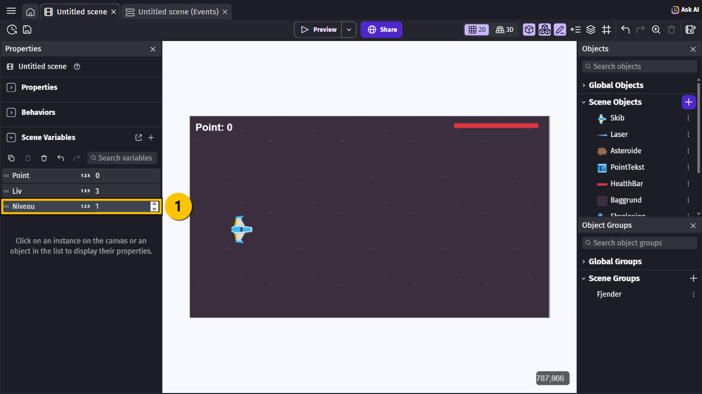

> **GØR DETTE**
>
> 1. Vælg **+ Add object**, fanen **New object from scratch**, og vælg **Text**.
> 2. Skriv `NiveauTekst` i **Object name** **(1)**.
> 3. Skriv `72` i **Size**, sæt flueben i **Bold**, og vælg den gule farve **(2)**.
> 4. Skriv `BØLGE 2!` i **Initial text to display** **(3)**.
> 5. Vælg fanen **Behaviors** **(4)**.
{: .lesson-action}

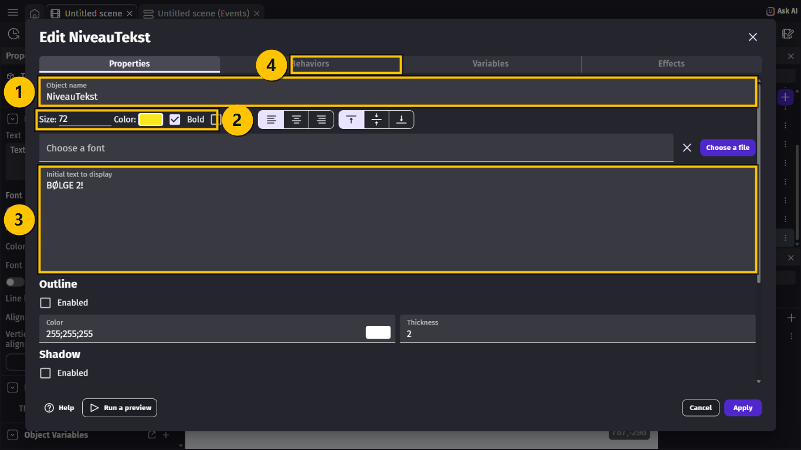

> **GØR DETTE**
>
> 1. Vælg **Add a behavior**.
> 2. Skriv `tween`, og vælg **Tween** **(1)**.
> 3. Nu står **Tween** under behaviors **(1)**. Vælg **Apply** **(2)**.
{: .lesson-action}

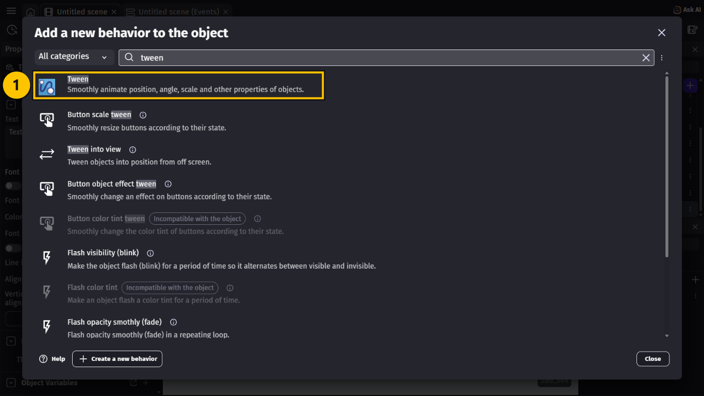

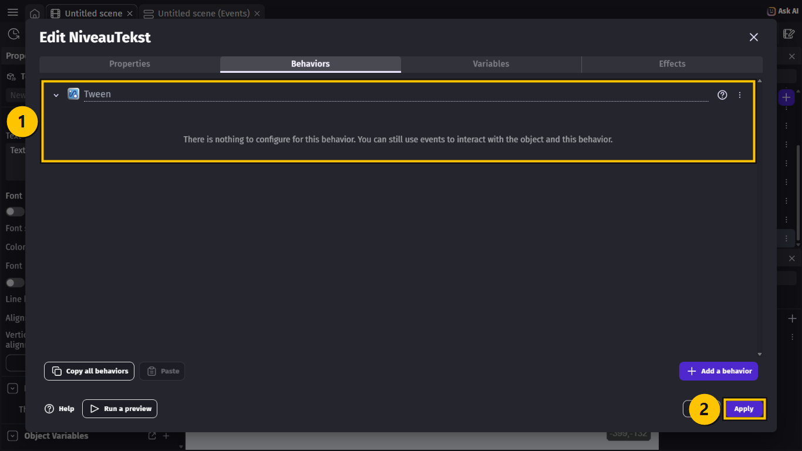

> **VIDEN**
>
> Træk **ikke** `NiveauTekst` ind på scenen. Den bliver lavet, hver gang en ny bølge starter.
{: .lesson-info}

## Opgave 2 – BØLGER: En ny bølge hvert 20. sekund

> **GØR DETTE**
>
> 1. Gå til Events-siden.
> 2. I event 2: tilføj **Start (or reset) a scene timer** med `"niveau"`.
> 3. Vælg **+ Add a new event**, og tilføj conditionen **Value of a scene timer**:
>    `"niveau"` **(1)** **> (greater than)** **(2)** `20` **(3)**.
> 4. Tilføj conditionen **Variable value**: `Liv` **> (greater than)** `0`.
{: .lesson-action}

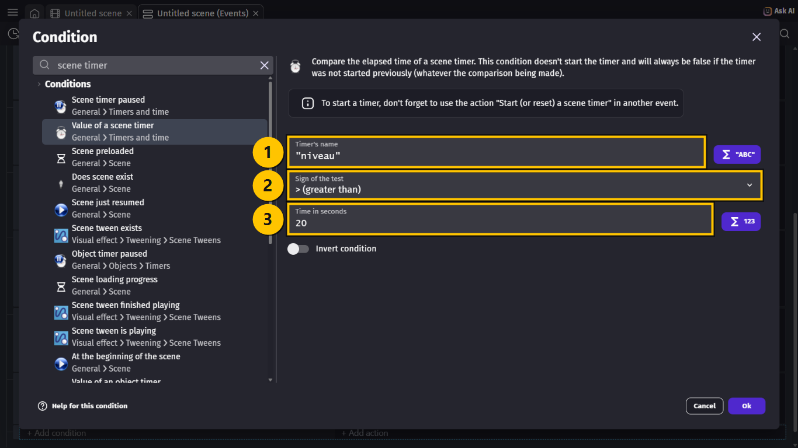

> **VIDEN**
>
> `Liv > 0` sørger for, at der ikke kommer nye bølger, når det er GAME OVER.
{: .lesson-info}

> **GØR DETTE**
>
> Tilføj disse actions til det nye event:
>
> 1. **Change variable value**: `Niveau` **(1)** **+ (add)** **(2)** `1` **(3)**.
> 2. **Start (or reset) a scene timer** med `"niveau"`.
{: .lesson-action}

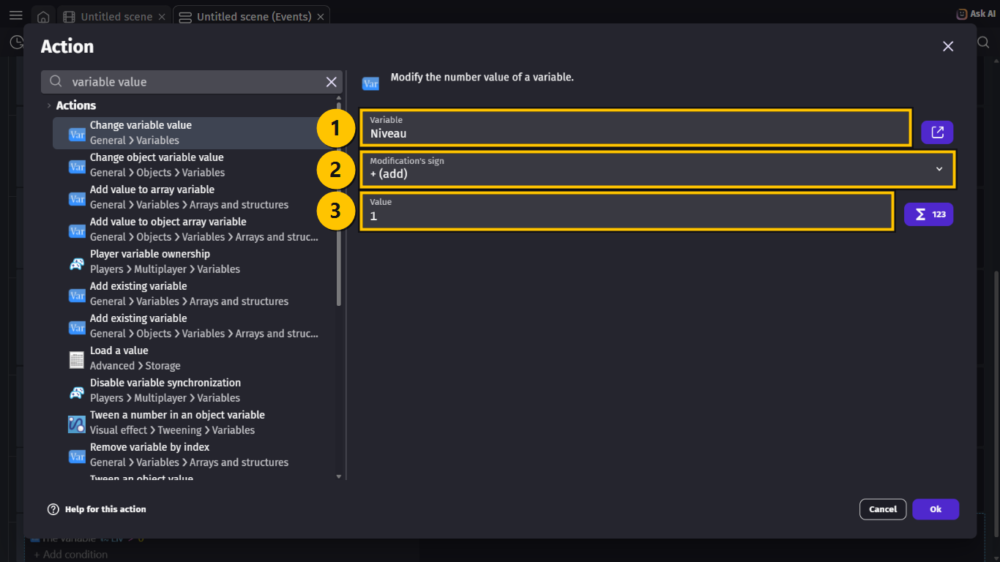

## Opgave 3 – BØLGER: BØLGE 2! på skærmen

> **GØR DETTE**
>
> Tilføj flere actions til samme event:
>
> 1. `NiveauTekst` → **Create an object** ved X `440` og Y `300`.
> 2. `NiveauTekst` → **Text**: **= (set to)** `"BØLGE " + Niveau + "!"` **(1)**.
> 3. `NiveauTekst` → **Z order**: `1000`.
{: .lesson-action}

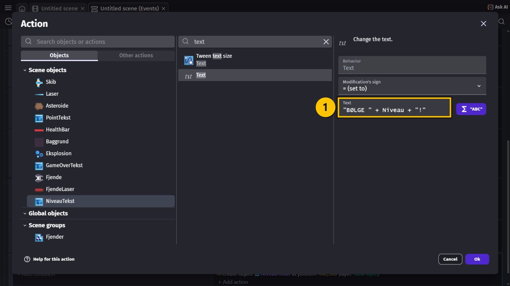

> **VIDEN**
>
> Teksten bliver sat sammen af tre dele: `"BØLGE "`, tallet i `Niveau`, og `"!"`. Så står
> der **BØLGE 2!**, **BØLGE 3!** og så videre.
{: .lesson-info}

> **GØR DETTE**
>
> 1. Tilføj en sidste action: `NiveauTekst` → skriv `opacity`, og vælg **Tween object
>    opacity** **(1)**.
> 2. Skriv `"fade"` i **Tween Identifier** **(2)**.
> 3. Skriv `0` i **To opacity** **(3)** og `2` i **Duration (in seconds)** **(4)**.
> 4. Vælg **Yes** ved **Destroy this object when tween finishes** **(5)**.
> 5. Vælg **Ok**.
{: .lesson-action}

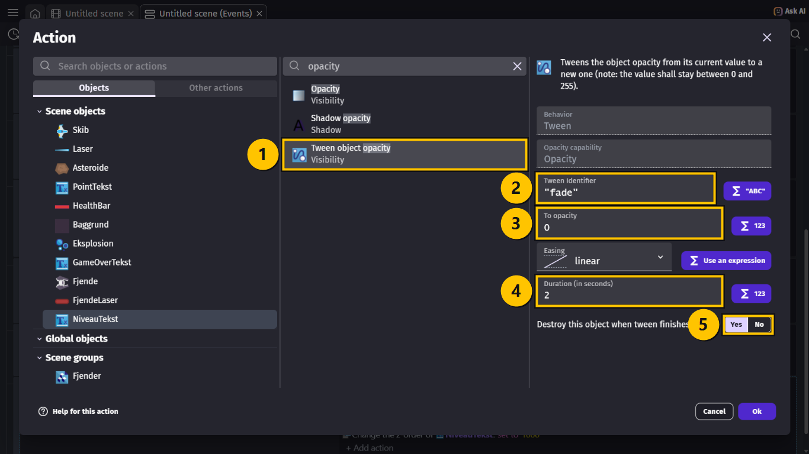

> **VIDEN**
>
> - **Opacity** er, hvor meget man kan se et objekt. `255` er helt synligt, `0` er helt
>   usynligt.
> - Tweenen gør teksten gennemsigtig over 2 sekunder — den **fader** ud.
> - **Destroy** sletter teksten bagefter, så den ikke ligger usynligt tilbage.
{: .lesson-info}

## Opgave 4 – BØLGER: Sværere og sværere

> **VIDEN**
>
> Nu skal der komme flere asteroider og fjender, jo højere `Niveau` er. Vi skifter de faste
> tider ud med et regnestykke.
>
> | Niveau | Asteroide: `2 / (Niveau + 1)` | Fjende: `6 / (Niveau + 1)` |
> |---|---|---|
> | 1 | 1 sekund | 3 sekunder |
> | 2 | 0,67 sekund | 2 sekunder |
> | 3 | 0,5 sekund | 1,5 sekund |
> | 5 | 0,33 sekund | 1 sekund |
>
> Bølge 1 er altså nøjagtig som før. Men tiderne bliver kortere for hver bølge.
{: .lesson-info}

> **GØR DETTE**
>
> 1. Dobbeltklik på conditionen **The timer "asteroide" > 1 seconds** i event 4.
> 2. Skift `1` ud med `2 / (Niveau + 1)` i **Time in seconds** **(1)**, og vælg **Ok**.
> 3. Dobbeltklik på **The timer "fjende" > 3 seconds** i event 8.
> 4. Skift `3` ud med `6 / (Niveau + 1)`, og vælg **Ok**.
{: .lesson-action}

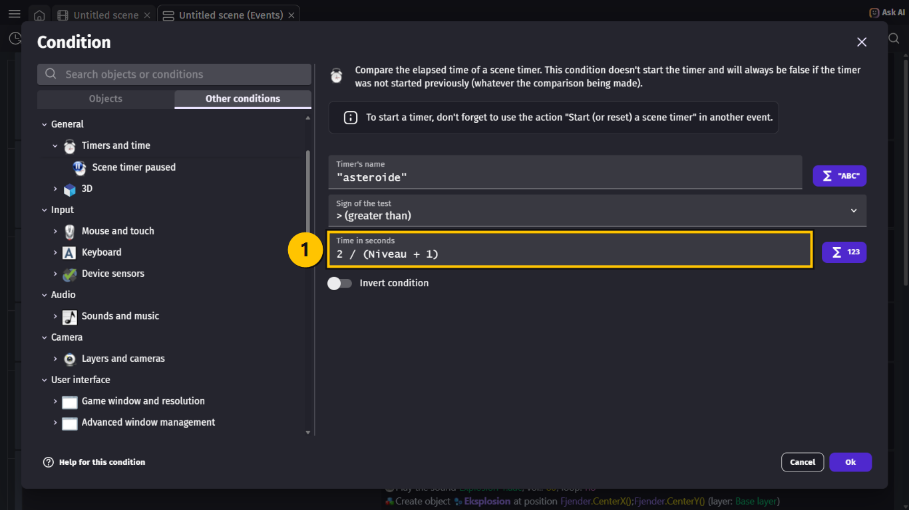

> **VIDEN**
>
> `/` betyder **divideret med**. Parentesen gør, at GDevelop regner `Niveau + 1` ud først.
{: .lesson-info}

## Opgave 5 – BØLGER: Vis bølgen ved pointene

> **GØR DETTE**
>
> 1. Dobbeltklik på **Change the text of PointTekst** i event 1.
> 2. Skift teksten ud med `"Point: " + Point + "   Bølge: " + Niveau` **(1)**.
> 3. Vælg **Ok**.
{: .lesson-action}

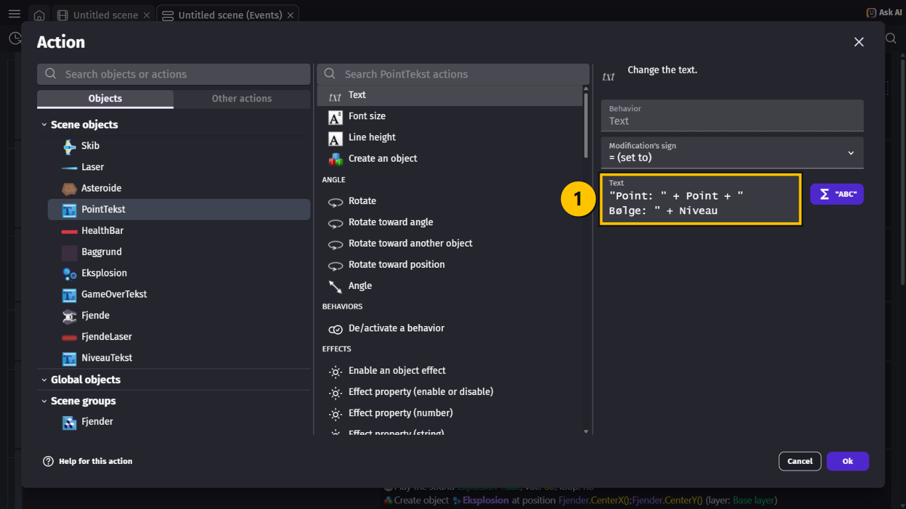

## Opgave 6 – BØLGER: Et lag til pointene

> **VIDEN**
>
> Med mange asteroider og fjender på skærmen ser du måske, at de flyver **hen over**
> pointene og health baren. Men `PointTekst` har jo **Z** `100`!
>
> Det er fordi GDevelop giver objekter, der bliver lavet af events, et Z, der er lidt
> **større** end det største på scenen. Health baren har Z `101`, så asteroiderne får
> `102` — og ligger øverst.
>
> Løsningen er et **lag**. Alt på et lag ligger over alt på lagene under det, lige meget
> hvilket Z det har. Du kender det måske fra platformspillet, hvor vi lavede et `GUI`-lag.
{: .lesson-info}

> **GØR DETTE**
>
> 1. Gå til fanen **Untitled scene**.
> 2. Vælg knappen **Open Layers Panel** **(1)** øverst til højre.
> 3. Vælg **+** i **Layers** **(2)**.
{: .lesson-action}

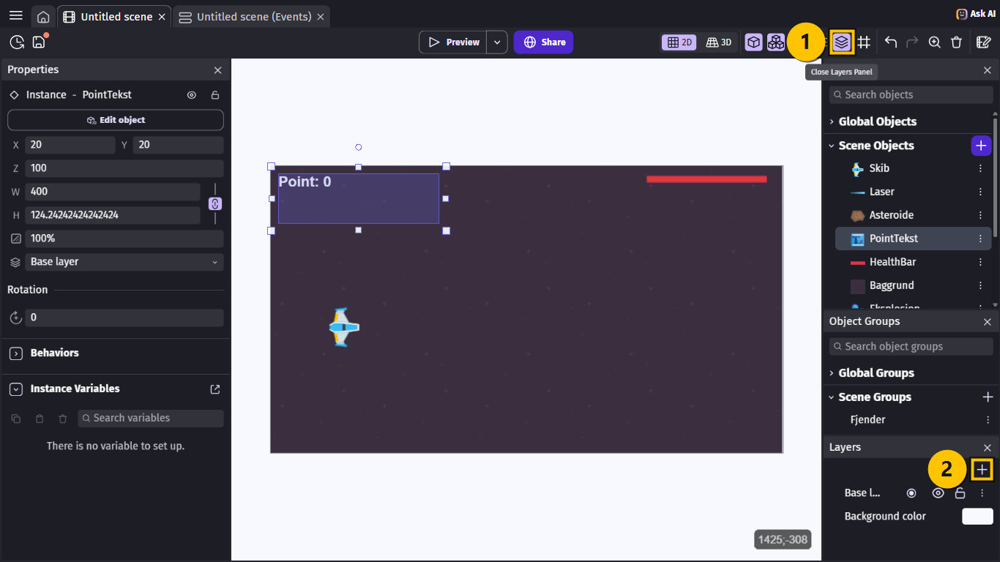

> **GØR DETTE**
>
> Det nye lag står **over** **Base layer** og hedder `Layer`. Skriv `GUI`, og tryk **Enter**
> **(1)**.
{: .lesson-action}

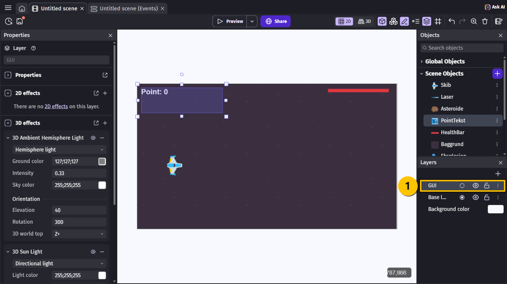

> **GØR DETTE**
>
> 1. Klik på **Point: 0** på scenen.
> 2. Vælg `GUI` i feltet med lagene til venstre **(1)**.
> 3. Klik på health baren, og vælg også `GUI` for den.
{: .lesson-action}

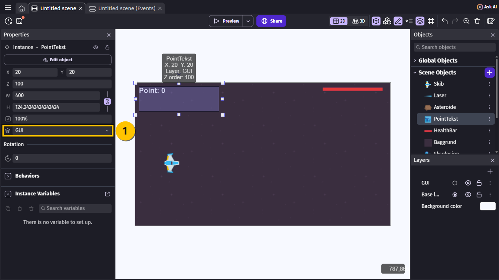

> **VIDEN**
>
> **GUI** betyder den del af et spil, der viser information — point, liv og knapper. Det
> er et godt navn til et lag, der altid skal ligge øverst.
{: .lesson-info}

## Hele koden samlet

> **VIDEN**
>
> De nye dele: pointteksten viser bølgen **(1)**, timeren `"niveau"` starter **(2)**, de to
> timere bruger `Niveau` **(3)** **(4)**, og det nye event for bølger **(5)**.
>
> | # | Conditions (HVIS) | Actions (SÅ) |
> |---|---|---|
> | 1 | *(ingen — sker hele tiden)* | … som før, men teksten er nu `"Point: " + Point + "   Bølge: " + Niveau` |
> | 2 | **At the beginning of the scene** | … som før … Start (or reset) the timer `"niveau"` |
> | 4 | The timer `"asteroide"` **>** `2 / (Niveau + 1)` seconds | … som før … |
> | 8 | The timer `"fjende"` **>** `6 / (Niveau + 1)` seconds | … som før … |
> | 11 | The timer `"niveau"` **>** `20` seconds The variable `Liv` **>** `0` | Change the variable `Niveau`: **add 1** Start (or reset) the timer `"niveau"` Create object `NiveauTekst` at `440`; `300` Change the text of `NiveauTekst`: **set to** `"BØLGE " + Niveau + "!"` Change the z-order of `NiveauTekst`: **set to** `1000` Tween the opacity of `NiveauTekst` to `0` over `2` seconds as `"fade"` and destroy: **yes** |
{: .lesson-info}

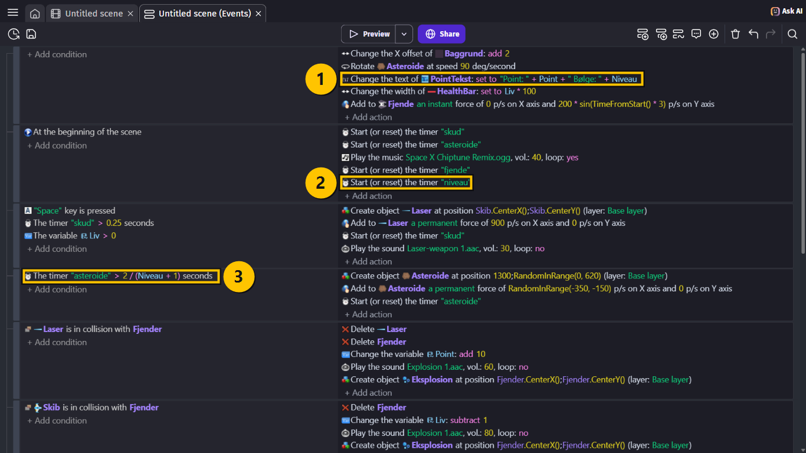

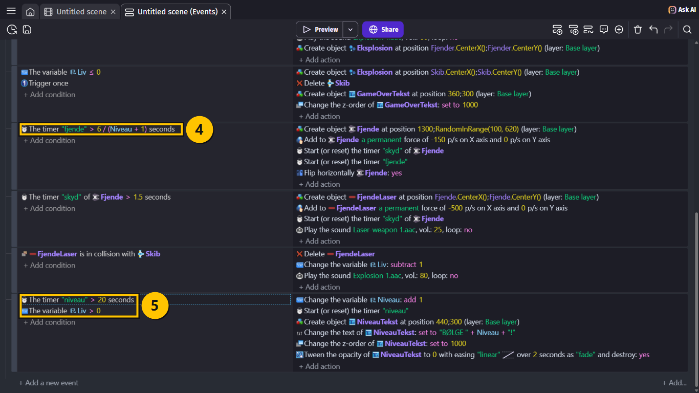

## Prøv spillet! 🎮

> **GØR DETTE**
>
> 1. Tryk **Ctrl + S** for at gemme.
> 2. Vælg **Preview**, og overlev i 20 sekunder.
{: .lesson-action}

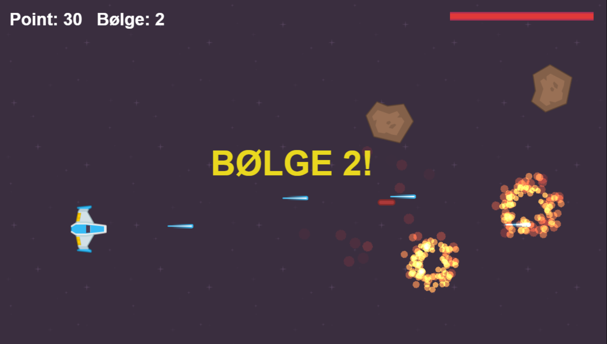

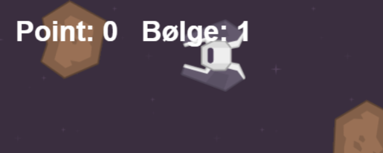

> **VIDEN**
>
> Sådan skal det virke:
>
> - Efter 20 sekunder står der **BØLGE 2!** i gult. Teksten forsvinder langsomt.
> - Der står **Bølge: 2** ved pointene.
> - Der kommer tydeligt flere asteroider og fjender for hver bølge.
> - Asteroider og fjender flyver **under** pointene og health baren.
{: .lesson-info}

> **VIDEN**
>
> **Tip til at teste:** Det tager lang tid at nå bølge 3 og 4. Skift `20` ud med `5` i event
> 11, mens du tester. Husk at skifte tilbage bagefter!
{: .lesson-info}

## Ekstra: Point for at overleve

> **GØR DETTE**
>
> Tilføj en action til event 11: **Change variable value**: `Point` **+ (add)**
> `Niveau * 50`.
{: .lesson-action}

> **VIDEN**
>
> Så får spilleren en bonus for at nå en ny bølge. Bølge 2 giver 100 point, bølge 3 giver
> 150 — det bliver mere og mere værd at overleve.
{: .lesson-info}

## Du er færdig med BØLGER ✅

> **VIDEN**
>
> Du er klar til næste lektion, når alt dette passer:
>
> - Der kommer en ny bølge hvert 20. sekund, med en gul tekst, der fader ud.
> - Der står **Bølge:** ved pointene.
> - Der kommer flere asteroider og fjender for hver bølge.
> - Pointene og health baren ligger på laget `GUI` og bliver ikke dækket.
> - Jeg har gemt projektet.
{: .lesson-info}

> **VIDEN**
>
> Næste gang får spillet en startmenu, en Game Over-skærm med **Prøv igen** — og en
> highscore, der bliver gemt.
{: .lesson-info}

## Hvis noget går galt

| Problem | Prøv dette |
|---|---|
| Der kommer aldrig en ny bølge. | **GØR DETTE:** Tjek, at event 2 starter timeren `"niveau"`, og at event 11 nulstiller den. |
| Bølgerne kommer meget hurtigt efter hinanden. | **GØR DETTE:** Tjek, at event 11 har **Start (or reset) the timer "niveau"**. |
| Der står **BØLGE 1!** i stedet for 2. | **GØR DETTE:** **Change the variable Niveau: add 1** skal stå **før** teksten bliver sat. |
| Teksten forsvinder ikke. | **GØR DETTE:** Tjek, at `NiveauTekst` har behavioren **Tween**, og at **To opacity** er `0`. |
| GDevelop siger, at der er en fejl i tiden. | **GØR DETTE:** Tjek parenteserne: `2 / (Niveau + 1)`. |
| Spillet bliver ikke sværere. | **GØR DETTE:** Tjek, at event 4 og 8 bruger `Niveau` i tiden. |
| Asteroiderne flyver stadig hen over pointene. | **GØR DETTE:** Klik på pointteksten på scenen, og tjek, at laget er `GUI`. Gør det samme med health baren. |
| Jeg kan ikke se objekterne på `GUI`. | **GØR DETTE:** Tjek, at øjet ved `GUI` i **Layers** ikke er slået fra. |
{: .lesson-help}
