# OPGAVER TIL GDevelop – RUMSPIL – MENU OG HIGHSCORE

> **VIDEN**
>
> I bokse med en hel kant står der, hvad du skal gøre. I bokse med en stiplet kant står der
> viden, som hjælper dig med at forstå det, du laver.
>
> På billederne viser gule kasser, hvor du skal klikke. Tallene i gule cirkler passer til
> tallene i trinene, fx **(1)** og **(2)**.
{: .lesson-info}

Nu bliver det et rigtigt spil! Det starter med en **menu**, hvor du trykker **ENTER** for
at spille. Når det er GAME OVER, kan du trykke ENTER igen og prøve en gang til. Og din
bedste score — din **highscore** — bliver gemt, så den er der endnu, næste gang du spiller.

## Tre ord du skal kende

> **VIDEN**
>
> - **Scene** — en skærm i spillet. Du kender scener fra platformspillet. Nu får rumspillet
>   to: en `Menu` og selve `Spil`.
> - **Global variabel** — en variabel, som **alle** scener kan se. En scenevariabel hører
>   kun til én scene og starter forfra, hver gang scenen starter.
> - **Storage** — et sted på computeren, hvor spillet kan gemme tal. Det bliver der, selv
>   om spillet lukkes.
{: .lesson-info}

## Opgave 1 – MENU: To scener

> **GØR DETTE**
>
> 1. Vælg **☰** øverst til venstre for at åbne projektet.
> 2. Vælg **⋮** **(1)** ved **Untitled scene**, og vælg **Rename** **(2)**. Kald den `Spil`.
{: .lesson-action}

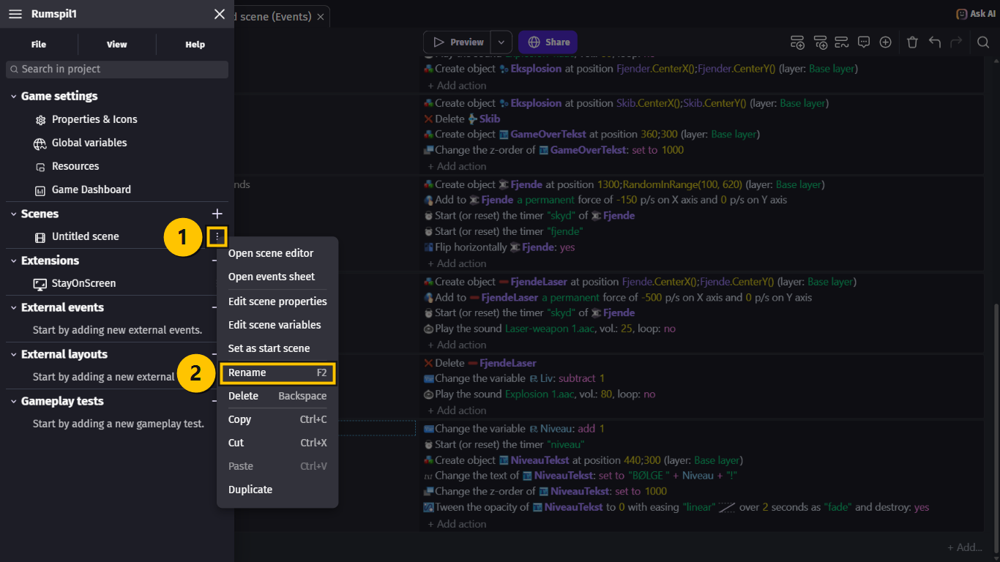

> **GØR DETTE**
>
> 1. Vælg **+** ved **Scenes** **(1)**. Kald den nye scene `Menu`.
> 2. Vælg **⋮** ved `Menu`, og vælg **Set as start scene**. Nu står der et lille flag ved
>    `Menu` **(2)**.
{: .lesson-action}

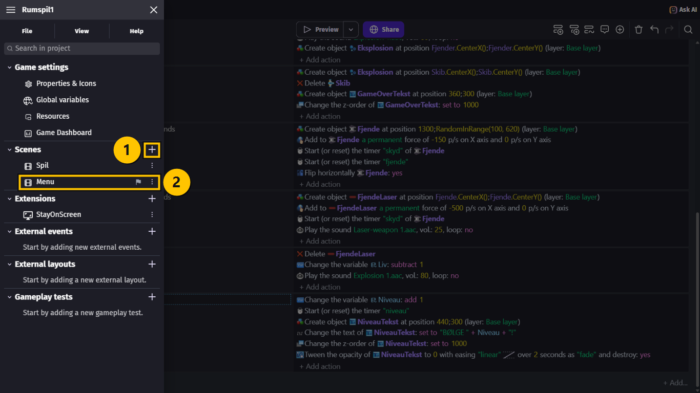

> **VIDEN**
>
> **Start scene** er den scene, spillet begynder med. Flaget viser, hvilken scene det er.
{: .lesson-info}

## Opgave 2 – MENU: En highscore, som alle scener kan se

> **GØR DETTE**
>
> 1. Vælg **Global variables** i projektets menu.
> 2. Vælg **Add a variable**. Kald den `Highscore`, og lad den være `0` **(1)**.
> 3. Vælg **Apply**.
{: .lesson-action}

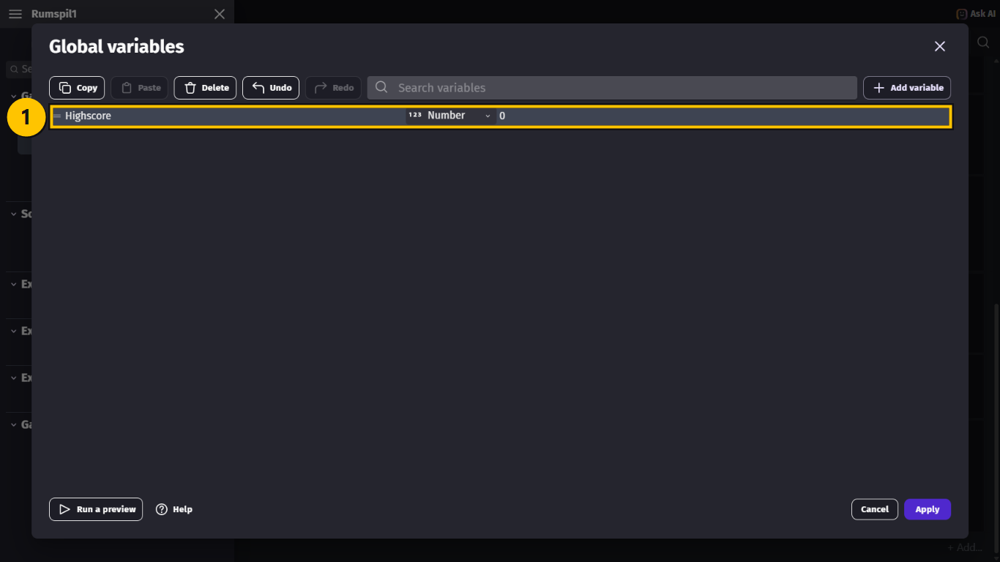

> **VIDEN**
>
> `Point` og `Liv` er scenevariabler. De starter forfra, hver gang `Spil` starter — det er
> godt, for et nyt spil skal starte med 0 point og 3 liv. Men `Highscore` skal huskes, også
> når du skifter scene. Derfor er den **global**.
{: .lesson-info}

## Opgave 3 – MENU: Byg menuen

> **GØR DETTE**
>
> 1. Vælg `Menu` i projektets menu, så scenen åbner.
> 2. Find **Layers** til højre, og klik på firkanten ved **Background color**.
> 3. Skriv `3B2D47` i **Hex** **(1)**, og tryk **Enter**. Nu er baggrunden mørk lilla.
{: .lesson-action}

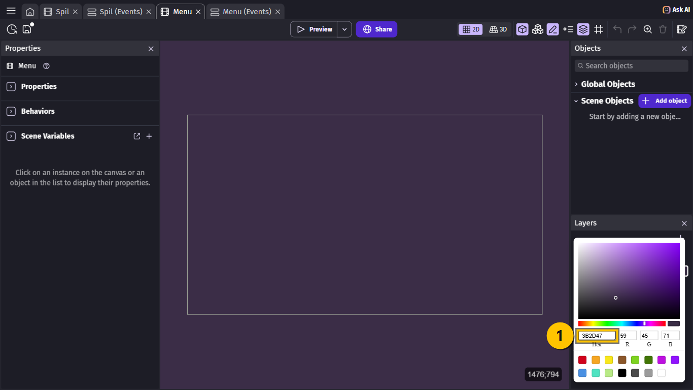

> **GØR DETTE**
>
> Lav tre **Text**-objekter i `Menu`, ligesom `PointTekst`:
>
> | Object name | Size | Farve | Tekst |
> |---|---|---|---|
> | `TitelTekst` | `120` | gul | `RUMSPIL` |
> | `StartTekst` | `40` | hvid | `Tryk ENTER for at starte` |
> | `HighscoreTekst` | `40` | hvid | `Highscore: 0` |
>
> Sæt flueben i **Bold** ved dem alle **(2)**. Billedet viser `TitelTekst` **(1)** **(3)**.
{: .lesson-action}

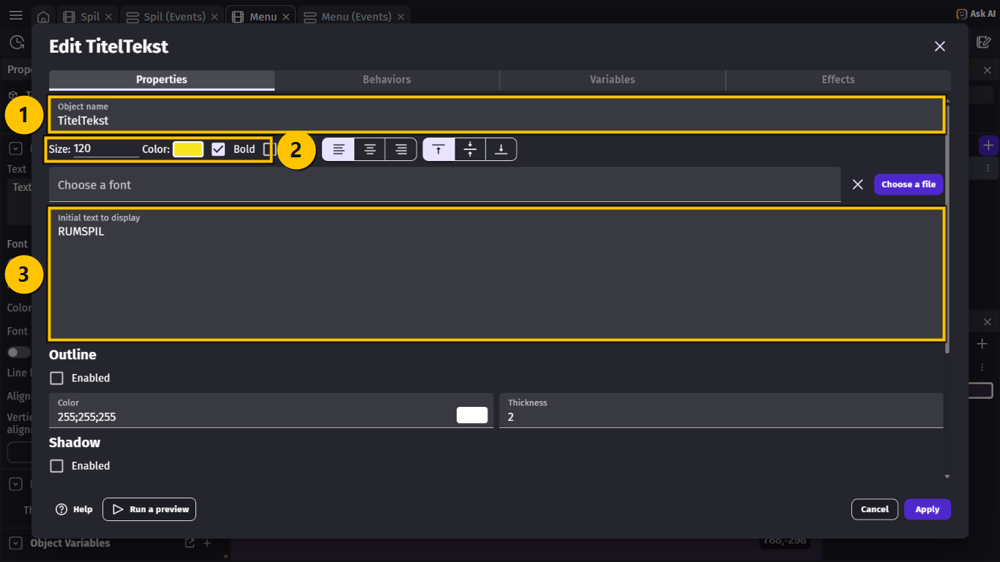

> **GØR DETTE**
>
> Træk de tre tekster ind på scenen **(1)**, og placér dem:
>
> | Objekt | X | Y |
> |---|---|---|
> | `TitelTekst` | `370` | `140` |
> | `StartTekst` | `390` | `420` |
> | `HighscoreTekst` | `510` | `520` |
{: .lesson-action}

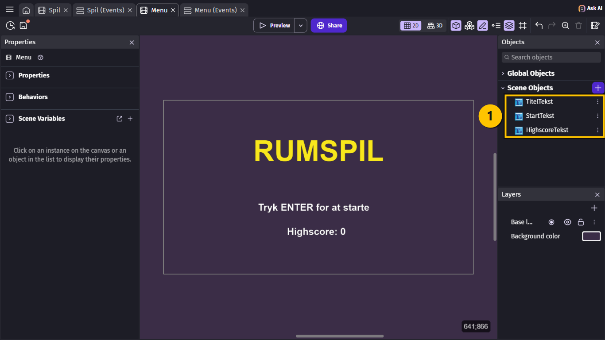

## Opgave 4 – MENU: Menuens events

> **VIDEN**
>
> Menuen skal gøre tre ting:
>
> 1. Hente den gemte highscore, når den starter.
> 2. Vise highscoren.
> 3. Starte spillet, når man trykker ENTER.
{: .lesson-info}

> **GØR DETTE**
>
> 1. Gå til fanen **Menu (Events)**, og vælg **Add a new event**.
> 2. Tilføj conditionen **At the beginning of the scene**.
> 3. Tilføj en condition mere: skriv `storage`, og vælg **Existence of a group** **(1)**.
> 4. Skriv `"rumspil"` i **Storage name** **(2)** og `"highscore"` i **Group** **(3)**.
{: .lesson-action}

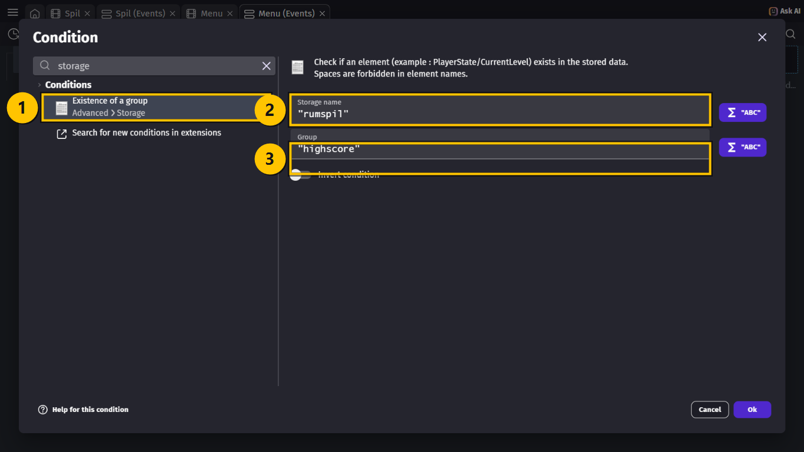

> **GØR DETTE**
>
> 1. Tilføj en action: skriv `load a value`, og vælg **Load a value** **(1)**.
> 2. Skriv `"rumspil"` og `"highscore"` igen **(2)**.
> 3. Vælg `Highscore` i **Variable** **(3)**.
{: .lesson-action}

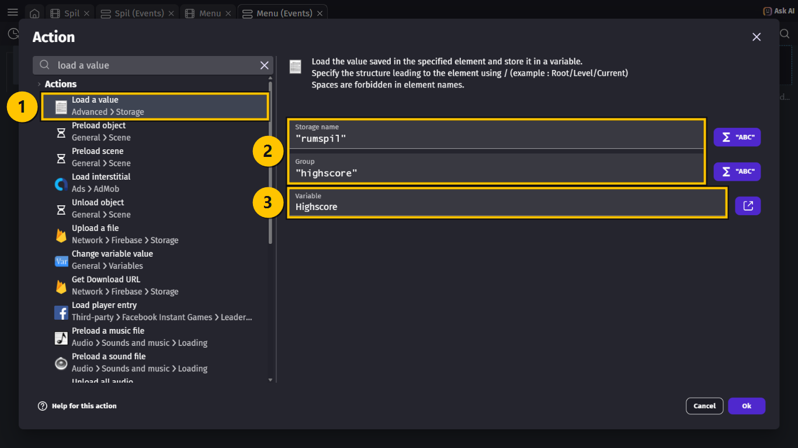

> **VIDEN**
>
> - **Storage name** er navnet på dit spils gemme-sted. **Group** er navnet på det tal, du
>   gemmer. Du bestemmer selv navnene — men de skal være **helt ens** alle steder.
> - Første gang du spiller, er der intet gemt endnu. Derfor tjekker vi først, om det
>   findes. Ellers bliver `Highscore` bare ved med at være `0`.
{: .lesson-info}

> **GØR DETTE**
>
> 1. Vælg **Add a new event**. Lad det være uden condition.
> 2. Tilføj en action: `HighscoreTekst` → **Text** → `"Highscore: " + Highscore`.
{: .lesson-action}

> **GØR DETTE**
>
> 1. Vælg **Add a new event**, og tilføj en condition: skriv `key just pressed`, og vælg
>    **Key just pressed** **(1)**.
> 2. Skriv `Return` i **Key to check** **(2)**, og vælg det på listen.
{: .lesson-action}

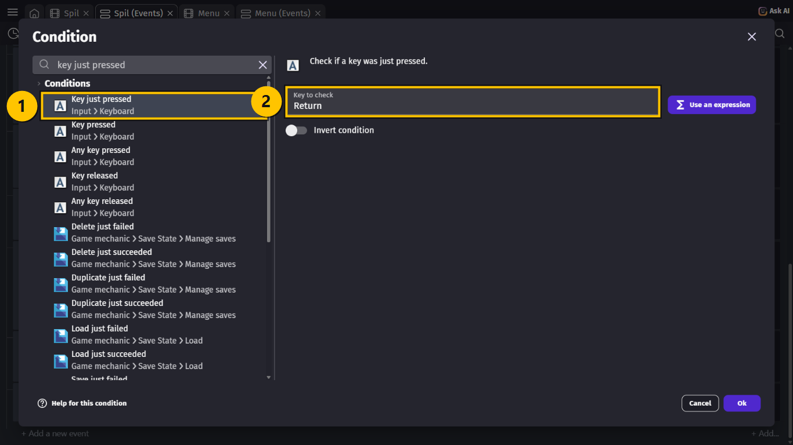

> **VIDEN**
>
> **Return** er GDevelops navn for **ENTER**-tasten.
>
> Vi bruger **Key just pressed** og ikke **Key pressed**. **Key pressed** er sand, **så
> længe** tasten holdes nede. Så kunne spillet nå at hoppe fra menuen til spillet og
> videre, mens du stadig holder ENTER. **Key just pressed** er kun sand i det øjeblik,
> tasten bliver trykket ned.
{: .lesson-info}

> **GØR DETTE**
>
> 1. Tilføj en action: skriv `change the scene`, og vælg **Change the scene**.
> 2. Vælg `Spil` i **Name of the new scene** **(1)**.
{: .lesson-action}

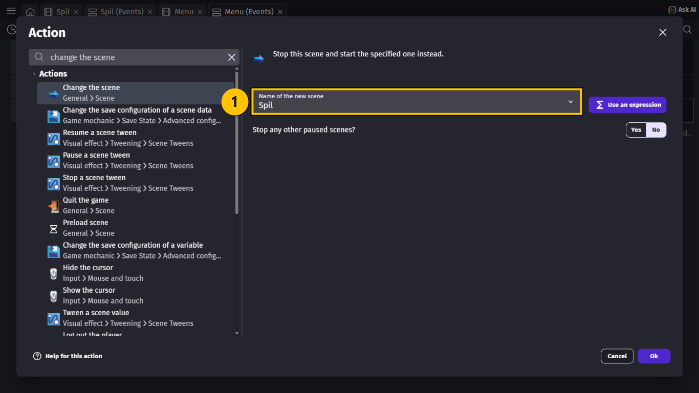

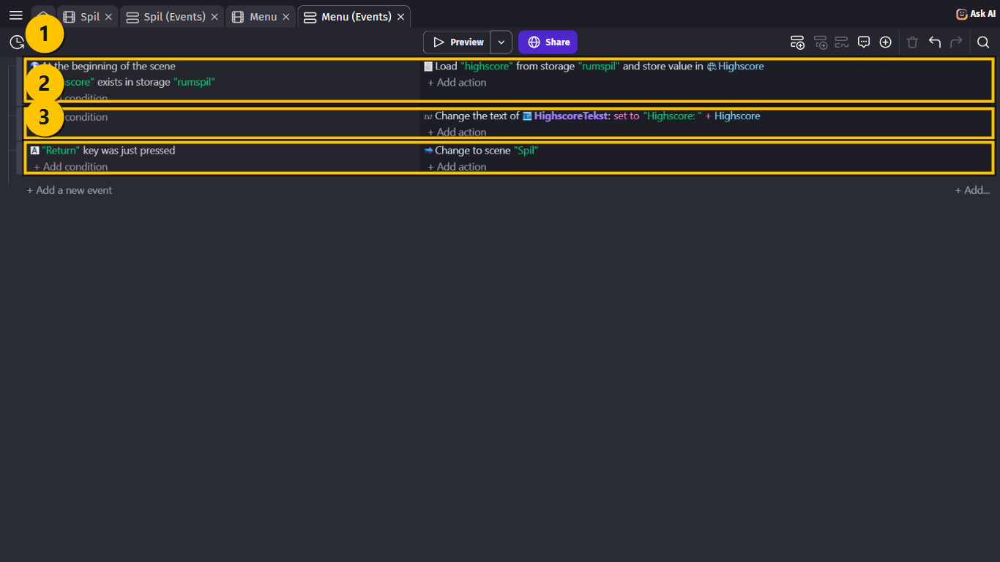

## Opgave 5 – MENU: Prøv igen

> **GØR DETTE**
>
> 1. Gå til scenen `Spil`, og lav et **Text**-objekt: `IgenTekst`, størrelse `36`, hvid,
>    **Bold**, med teksten `Tryk ENTER for at prøve igen`.
> 2. Lav også `RekordTekst`: størrelse `56`, gul, **Bold**, med teksten `NY REKORD!`.
> 3. Træk **ingen** af dem ind på scenen.
{: .lesson-action}

> **GØR DETTE**
>
> 1. Gå til **Spil (Events)**, og find event 7 (GAME OVER).
> 2. Tilføj en action: `IgenTekst` **(1)** → **Create an object** ved X `410` og Y `440`
>    **(2)**.
> 3. Vælg `GUI` i **Layer** **(3)**.
{: .lesson-action}

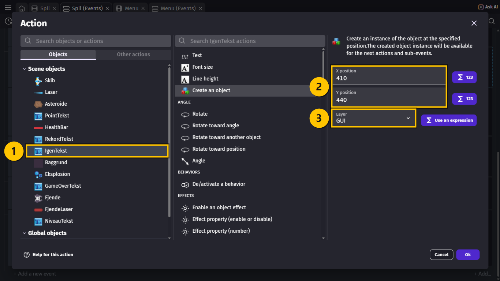

> **VIDEN**
>
> Når du laver et objekt med en action, kan du selv vælge laget. Lægger du det på `GUI`,
> ligger det altid øverst — så behøver du ingen **Z order**.
{: .lesson-info}

> **GØR DETTE**
>
> 1. Vælg **Add a new event** nederst.
> 2. Tilføj to conditions: **Variable value** `Liv` **≤** `0`, og **Key just pressed**
>    `Return`.
> 3. Tilføj en action: **Change the scene** → `Menu`.
{: .lesson-action}

## Opgave 6 – MENU: Gem en ny rekord

> **GØR DETTE**
>
> 1. Vælg **Add a new event**.
> 2. Tilføj conditionen **Variable value** `Liv` **≤** `0`.
> 3. Tilføj conditionen **Variable value**: `Point` **(1)** **> (greater than)** **(2)**
>    `Highscore` **(3)**.
> 4. Tilføj conditionen **Trigger once while true**.
{: .lesson-action}

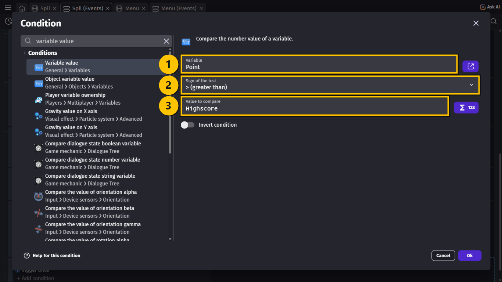

> **VIDEN**
>
> Eventet sker kun, når spillet er slut, **og** du har fået flere point end din gamle
> highscore. **Trigger once** gør, at det kun sker én gang.
{: .lesson-info}

> **GØR DETTE**
>
> Tilføj disse actions:
>
> 1. **Change variable value**: `Highscore` **(1)** **= (set to)** `Point` **(2)**.
{: .lesson-action}

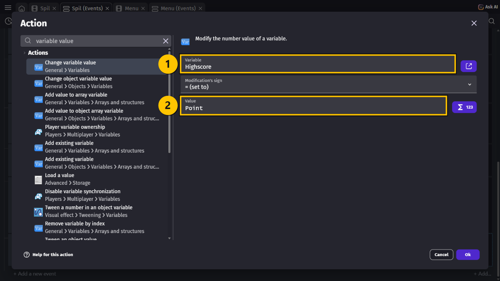

> **GØR DETTE**
>
> 2. Skriv `save a value`, og vælg **Save a value** **(1)**.
> 3. Skriv `"rumspil"` og `"highscore"` **(2)** — præcis som i menuen.
> 4. Skriv `Highscore` i **Expression** **(3)**.
> 5. `RekordTekst` → **Create an object** ved X `480` og Y `200` på laget `GUI`.
{: .lesson-action}

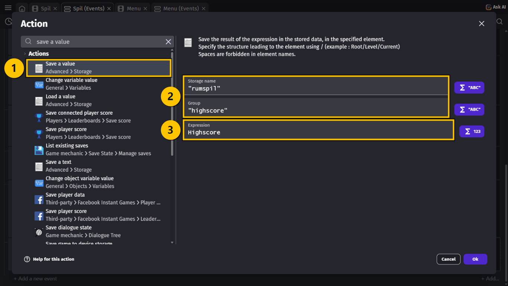

> **VIDEN**
>
> **Save a value** skriver tallet ned på computeren. Næste gang spillet starter, finder
> **Load a value** i menuen det igen.
{: .lesson-info}

## Hele koden samlet

> **VIDEN**
>
> **Menu (Events):**
>
> | # | Conditions (HVIS) | Actions (SÅ) |
> |---|---|---|
> | 1 | **At the beginning of the scene** `"highscore"` exists in storage `"rumspil"` | Load `"highscore"` from storage `"rumspil"` and store value in `Highscore` |
> | 2 | *(ingen — sker hele tiden)* | Change the text of `HighscoreTekst`: **set to** `"Highscore: " + Highscore` |
> | 3 | `"Return"` key was just pressed | Change to scene `"Spil"` |
>
> **Spil (Events)** — det nye:
>
> | # | Conditions (HVIS) | Actions (SÅ) |
> |---|---|---|
> | 7 | The variable `Liv` **≤** `0` **Trigger once** | … som før … Create object `IgenTekst` at `410`; `440` (layer: `"GUI"`) |
> | 12 | The variable `Liv` **≤** `0` The variable `Point` **>** `Highscore` **Trigger once** | Change the variable `Highscore`: **set to** `Point` Save value `Highscore` in `"highscore"` of storage `"rumspil"` Create object `RekordTekst` at `480`; `200` (layer: `"GUI"`) |
> | 13 | The variable `Liv` **≤** `0` `"Return"` key was just pressed | Change to scene `"Menu"` |
{: .lesson-info}

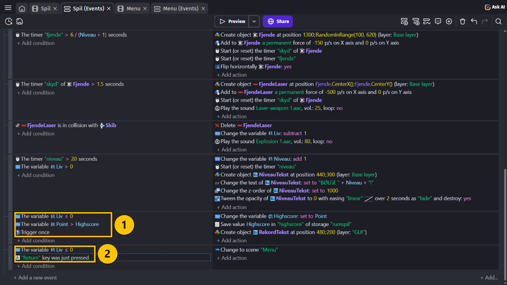

## Prøv spillet! 🎮

> **GØR DETTE**
>
> 1. Tryk **Ctrl + S** for at gemme.
> 2. Gå til fanen **Menu**, og vælg **Preview**. Preview starter altid i den scene, du har
>    åben.
> 3. Tryk **ENTER**, og spil, til det er GAME OVER.
> 4. Tryk **ENTER** igen for at komme tilbage til menuen.
> 5. Luk vinduet, og vælg **Preview** igen. Står din highscore der stadig?
{: .lesson-action}

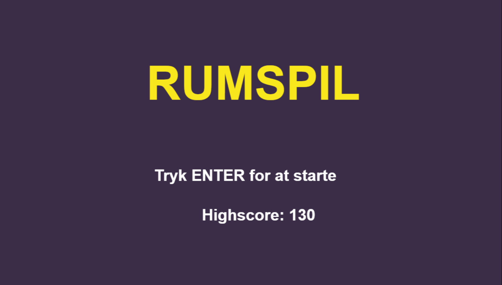

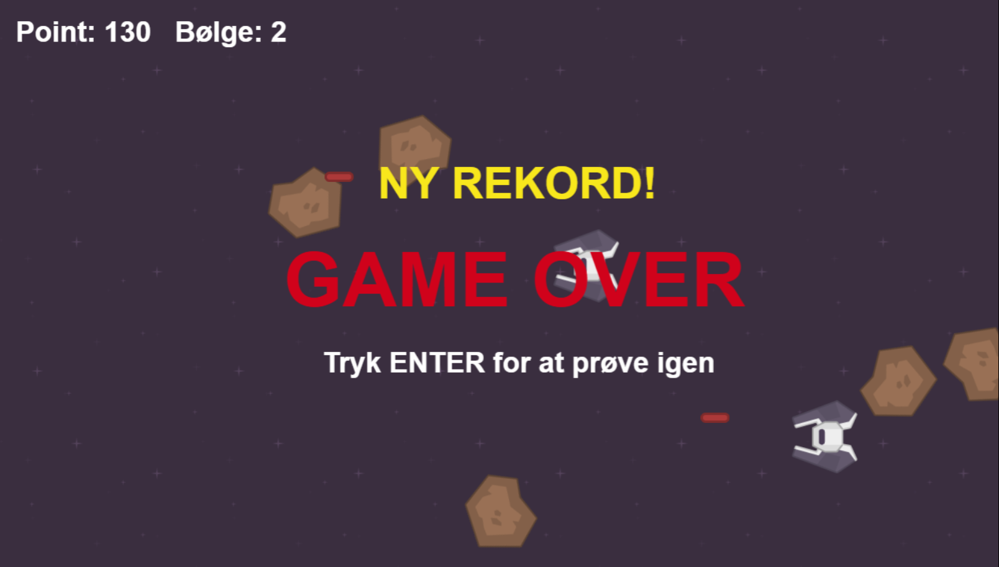

> **VIDEN**
>
> Sådan skal det virke:
>
> - Spillet starter i menuen.
> - Musikken starter, så snart du trykker ENTER.
> - Når det er GAME OVER, står der **Tryk ENTER for at prøve igen**.
> - Slår du din highscore, står der **NY REKORD!**
> - Highscoren står i menuen — også når du har lukket spillet og startet det igen.
{: .lesson-info}

## Ekstra: Nulstil highscoren

> **GØR DETTE**
>
> 1. I **Menu (Events)**: Lav et nyt event med **Key just pressed** `Delete`.
> 2. Tilføj actions: skriv `storage`, og vælg **Delete an element** med `"rumspil"` og
>    `"highscore"`. Tilføj også **Change variable value** `Highscore` **=** `0`.
{: .lesson-action}

> **VIDEN**
>
> Så kan du trykke **Delete** i menuen for at starte forfra med highscoren — fx hvis dine
> venner skal have en chance!
{: .lesson-info}

## Du er færdig med MENU OG HIGHSCORE ✅

> **VIDEN**
>
> Du er klar til den sidste lektion, når alt dette passer:
>
> - Spillet starter i scenen `Menu`, og ENTER starter spillet.
> - Efter GAME OVER kommer jeg tilbage til menuen med ENTER.
> - Der står **NY REKORD!**, når jeg slår min highscore.
> - Highscoren er gemt, også når jeg lukker spillet og åbner det igen.
> - Jeg har gemt projektet.
{: .lesson-info}

> **VIDEN**
>
> I den sidste lektion får spillet power-ups og en stor boss.
{: .lesson-info}

## Hvis noget går galt

| Problem | Prøv dette |
|---|---|
| Spillet starter stadig i `Spil`. | **GØR DETTE:** Vælg **⋮** ved `Menu`, og vælg **Set as start scene**. Gå til fanen **Menu**, før du vælger **Preview**. |
| Menuen er hvid. | **GØR DETTE:** Skift **Background color** under **Layers** i scenen `Menu`. |
| Der sker ingenting, når jeg trykker ENTER. | **GØR DETTE:** Tjek, at der står `Return`, og at scenenavnet er stavet præcis som scenen. |
| Spillet hopper tilbage til menuen med det samme. | **GØR DETTE:** Brug **Key just pressed** i stedet for **Key pressed** begge steder. |
| Highscoren er altid 0. | **GØR DETTE:** Tjek, at `"rumspil"` og `"highscore"` er stavet ens i **Save a value** og **Load a value**. |
| Highscoren forsvinder, når jeg skifter scene. | **GØR DETTE:** `Highscore` skal være en **global** variabel, ikke en scenevariabel. |
| Der står NY REKORD!, selv om jeg ikke slog den. | **GØR DETTE:** Tjek, at conditionen er `Point` **>** `Highscore` — ikke **<**. |
| Teksterne ligger under asteroiderne. | **GØR DETTE:** Vælg `GUI` i **Layer**, når `IgenTekst` og `RekordTekst` bliver lavet. |
{: .lesson-help}
