# OPGAVER TIL GDevelop – RUMSPIL – EKSTRA: POWER-UPS OG BOSS

> **VIDEN**
>
> I bokse med en hel kant står der, hvad du skal gøre. I bokse med en stiplet kant står der
> viden, som hjælper dig med at forstå det, du laver.
>
> På billederne viser gule kasser, hvor du skal klikke. Tallene i gule cirkler passer til
> tallene i trinene, fx **(1)** og **(2)**.
{: .lesson-info}

Den sidste lektion er ekstra — til dig, der vil have mere! Spillet får to **power-ups**,
som du kan samle op, og i bølge 3 kommer der en stor **boss** med sin egen health bar.

Lektionen bruger ikke noget helt nyt. Du sætter de ting, du allerede kan, sammen på nye
måder.

## To ord du skal kende

> **VIDEN**
>
> - **Power-up** — en ting, man kan samle op, som gør en stærkere i et stykke tid.
> - **Boss** — en særlig stærk fjende, der skal rammes mange gange. Den kommer ofte til
>   sidst i en bane.
{: .lesson-info}

## Opgave 1 – BOSS: To power-ups

> **GØR DETTE**
>
> 1. Åbn **Space Shooter Redux**, og vælg mappen **Power-ups**.
> 2. Vælg **Bolt Yellow Powerup** **(1)**, og vælg **Add to the scene**.
> 3. Rul ned, og hent også **Shield Blue Powerup**.
> 4. Kald dem `Lynskud` og `Reparation` **(1)**.
> 5. Giv dem begge behavioren **Destroy when outside of the screen** **(2)**.
{: .lesson-action}

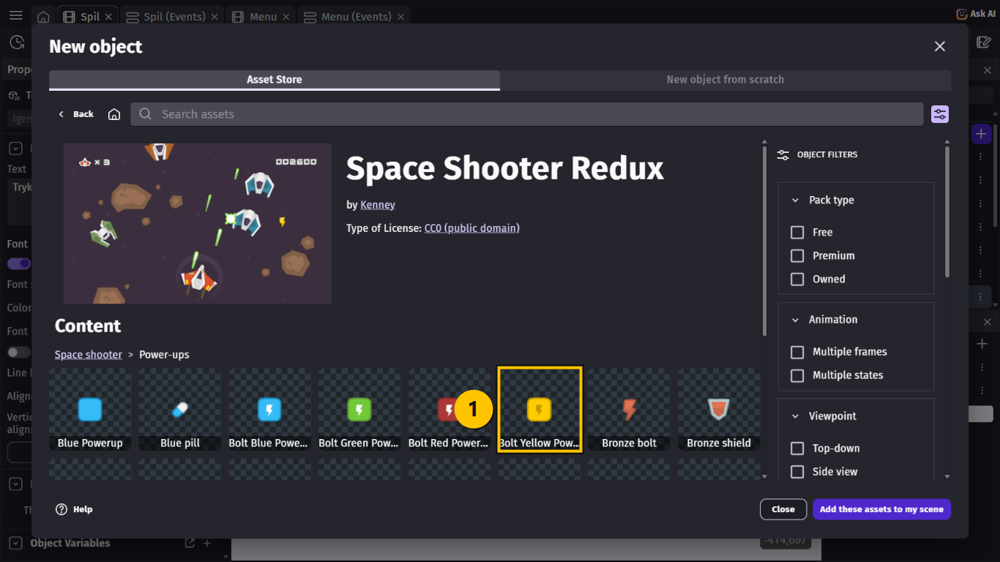

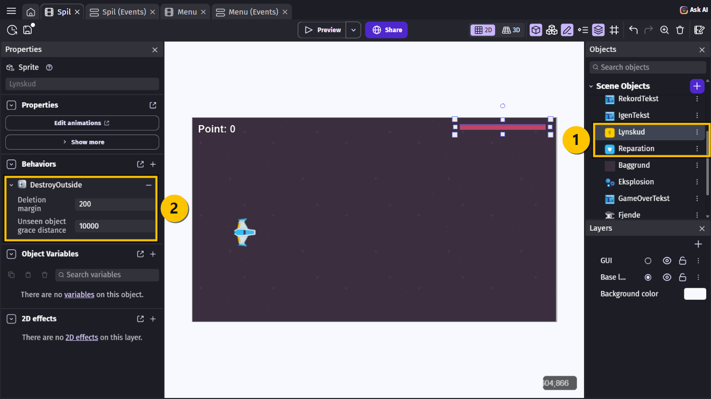

> **VIDEN**
>
> - **Reparation** (det blå skjold) giver ét liv tilbage.
> - **Lynskud** (det gule lyn) får skibet til at skyde meget hurtigt i 5 sekunder.
{: .lesson-info}

## Opgave 2 – BOSS: To nye variabler

> **GØR DETTE**
>
> Tilføj to **Scene Variables** **(1)**:
>
> | Navn | Værdi |
> |---|---|
> | `Skudtid` | `0.25` |
> | `BossLiv` | `20` |
{: .lesson-action}

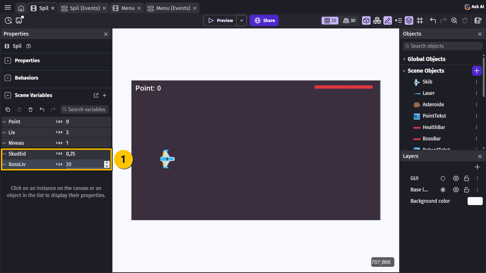

> **VIDEN**
>
> GDevelop viser måske `0,25` med komma, fordi din computer er dansk. Det er det samme tal.
{: .lesson-info}

## Opgave 3 – BOSS: Skudtiden i en variabel

> **VIDEN**
>
> Hvor hurtigt skibet skyder, står i event 3: `"skud" > 0.25`. For at en power-up kan ændre
> det, skal tallet ligge i en variabel.
{: .lesson-info}

> **GØR DETTE**
>
> 1. Dobbeltklik på **The timer "skud" > 0.25 seconds** i event 3.
> 2. Skift `0.25` ud med `Skudtid` **(1)**, og vælg **Ok**.
> 3. I event 2: tilføj **Start (or reset) a scene timer** med `"reparation"`, og en til med
>    `"lynskud"`.
{: .lesson-action}

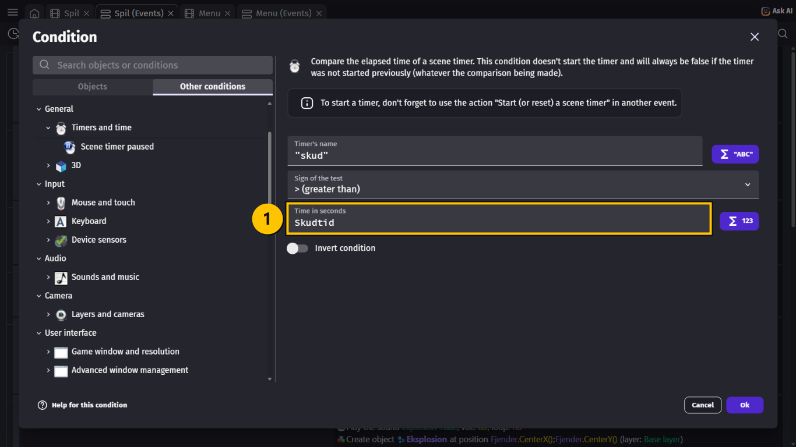

## Opgave 4 – BOSS: Power-ups, der kommer og kan samles op

> **GØR DETTE**
>
> Lav disse fem nye events. De første to ligner event 4, hvor asteroiderne bliver lavet.
>
> | # | Conditions (HVIS) | Actions (SÅ) |
> |---|---|---|
> | A | Timeren `"reparation"` **>** `15` **(1)** | Create object `Reparation` at `1300`; `RandomInRange(60, 660)` Add to `Reparation` a **permanent** force of `-150` on X, `0` on Y Start (or reset) the timer `"reparation"` |
> | B | Timeren `"lynskud"` **>** `10` **(2)** | Det samme, bare med `Lynskud` og timeren `"lynskud"` |
> | C | `Skib` is in collision with `Reparation` | Delete `Reparation` Change the variable `Liv`: **set to** `min(Liv + 1, 3)` **(3)** Play the sound `Laser-weapon 1.aac`, vol. `50`, pitch `2` |
> | D | `Skib` is in collision with `Lynskud` | Delete `Lynskud` Change the variable `Skudtid`: **set to** `0.08` Start (or reset) the timer `"hurtig"` **(4)** Play the sound `Laser-weapon 1.aac`, vol. `50`, pitch `2` |
> | E | Timeren `"hurtig"` **>** `5` | Change the variable `Skudtid`: **set to** `0.25` |
{: .lesson-action}

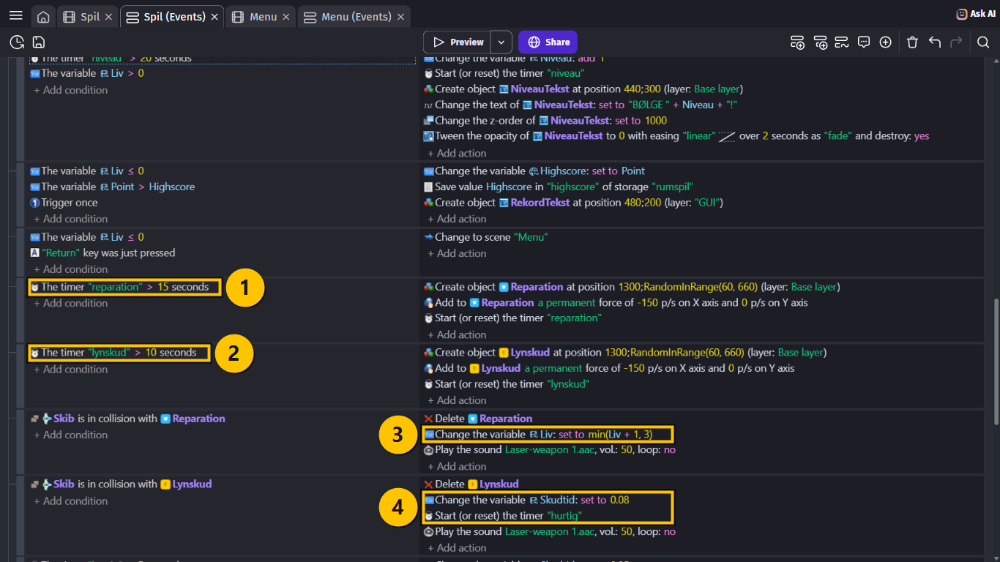

> **VIDEN**
>
> - `min(Liv + 1, 3)` betyder "det **mindste** af `Liv + 1` og `3`". Så får du ét liv mere,
>   men aldrig mere end 3. Ellers kunne health baren blive længere end skærmen!
> - Timeren `"hurtig"` bliver først startet, når du samler lynet op. Indtil da er event E
>   aldrig sandt. Efter 5 sekunder sætter det `Skudtid` tilbage til `0.25`.
{: .lesson-info}

## Opgave 5 – BOSS: Hent bossen

> **GØR DETTE**
>
> 1. Åbn **Space Shooter Redux**, og vælg mappen **Enemies**.
> 2. Vælg **Red spaceship 2** **(1)**, og vælg **Add to the scene**. Kald den `Boss`.
> 3. Højreklik på `HealthBar` i listen, og vælg **Duplicate**. Kald kopien `BossBar`.
{: .lesson-action}

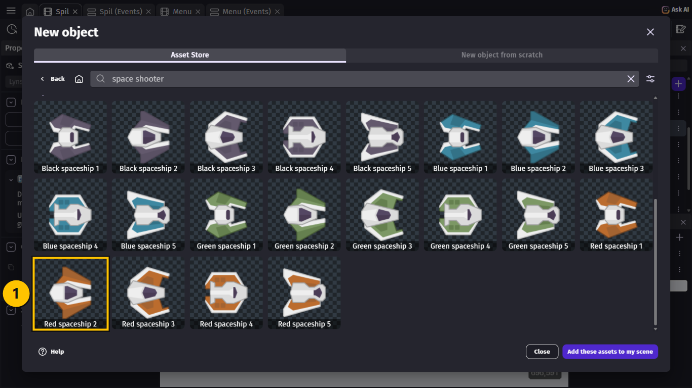

> **VIDEN**
>
> `BossBar` er en kopi af din egen health bar. Den bliver bossens health bar nederst på
> skærmen.
{: .lesson-info}

## Opgave 6 – BOSS: Bossen kommer i bølge 3

> **GØR DETTE**
>
> 1. Lav et nyt event med to conditions: **Variable value** `Niveau` **=** `3` og **Trigger
>    once while true**.
> 2. Tilføj disse actions:
>    - `Boss` → **Create an object** ved `1400`; `300`.
>    - `Boss` → **Flip the object horizontally**: **Yes**.
>    - `Boss` → **Scale** **(1)**: `2` **(2)**.
>    - `Boss` → **Start (or reset) an object timer**: `"skyd"`.
>    - `BossBar` → **Create an object** ved `340`; `690` på laget `GUI`.
{: .lesson-action}

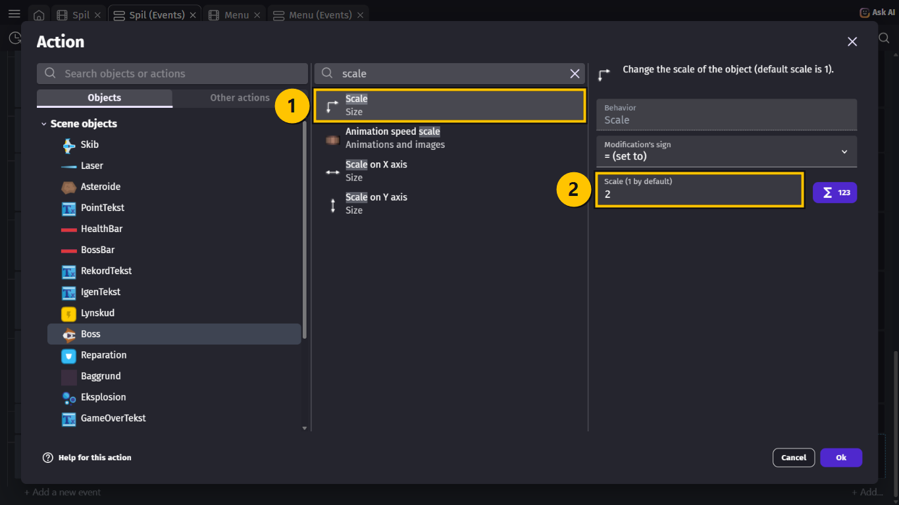

> **VIDEN**
>
> **Scale** `2` gør bossen dobbelt så stor som et almindeligt fjendeskib.
{: .lesson-info}

## Opgave 7 – BOSS: Bossen flyver, skyder og bliver ramt

> **GØR DETTE**
>
> 1. Lav et nyt event: `Boss` **(1)** → **X position** **> (greater than)** **(2)** `900`
>    **(3)**.
> 2. Tilføj action: `Boss` → **Add a force**: `-200` på X, `0` på Y, **Instant**.
{: .lesson-action}

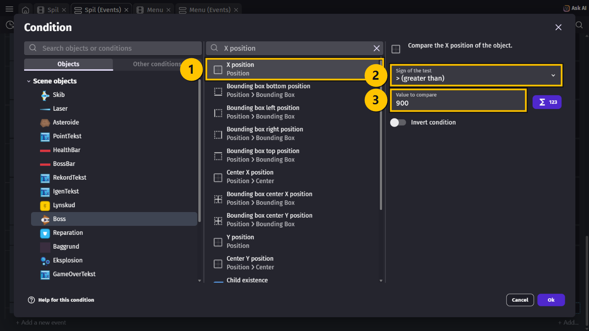

> **VIDEN**
>
> Bossen flyver ind fra højre, **så længe** den er længere til højre end 900. Så stopper
> den og bliver i højre side af skærmen.
{: .lesson-info}

> **GØR DETTE**
>
> I event 1: tilføj to actions:
>
> 1. `Boss` → **Add a force**: `0` på X, `120 * sin(TimeFromStart() * 2)` på Y, **Instant**.
> 2. `BossBar` → **Width**: **= (set to)** `BossLiv * 30`.
{: .lesson-action}

> **GØR DETTE**
>
> Lav to nye events:
>
> | Conditions (HVIS) | Actions (SÅ) |
> |---|---|
> | Timeren `"skyd"` of `Boss` **>** `0.6` | Create object `FjendeLaser` at `Boss.CenterX()`; `Boss.CenterY() + RandomInRange(-60, 60)` Add to `FjendeLaser` a **permanent** force of `-500` on X, `0` on Y Start (or reset) the timer `"skyd"` of `Boss` Play the sound `Laser-weapon 1.aac`, vol. `25`, pitch `0.5` |
> | `Laser` is in collision with `Boss` | Delete `Laser` Change the variable `BossLiv`: **subtract** `1` Create object `Eksplosion` at `Laser.CenterX()`; `Laser.CenterY()` Play the sound `Explosion 1.aac`, vol. `30`, pitch `1.5` |
{: .lesson-action}

> **VIDEN**
>
> - `RandomInRange(-60, 60)` gør, at bossens skud kommer fra forskellige steder på den
>   store krop — ikke kun fra midten.
> - Bossens røde skud er `FjendeLaser`, så **event 10** fra lektionen om fjender sørger
>   allerede for, at de koster liv. Du behøver ikke lave det igen.
{: .lesson-info}

## Opgave 8 – BOSS: BOSS BESEJRET!

> **GØR DETTE**
>
> Lav det sidste event:
>
> | Conditions (HVIS) | Actions (SÅ) |
> |---|---|
> | The variable `BossLiv` **≤** `0` **Trigger once** | Create object `Eksplosion` at `Boss.CenterX()`; `Boss.CenterY()` Delete `Boss` Delete `BossBar` Change the variable `Point`: **add** `500` Play the sound `Explosion 1.aac`, vol. `100`, pitch `0.5` Create object `NiveauTekst` at `280`; `160` Change the text of `NiveauTekst`: **set to** `"BOSS BESEJRET! +500"` Change the z-order of `NiveauTekst`: **set to** `1000` Tween the opacity of `NiveauTekst` to `0` over `3` seconds as `"fade"` and destroy: **yes** |
{: .lesson-action}

> **VIDEN**
>
> Vi genbruger `NiveauTekst` fra lektionen om bølger — den har jo allerede **Tween**. Vi
> skifter bare teksten og lægger den højere oppe, så den ikke dækker **BØLGE**-teksten.
{: .lesson-info}

## Hele koden samlet

> **VIDEN**
>
> Toppen: bossens bølge og bossens health bar i event 1 **(1)**, de nye timere i event 2
> **(2)**, og `Skudtid` i event 3 **(3)**.
>
> Bunden: bossen kommer i bølge 3 **(4)**, flyver ind **(5)**, skyder **(6)**, bliver ramt
> **(7)** og bliver besejret **(8)**.
{: .lesson-info}

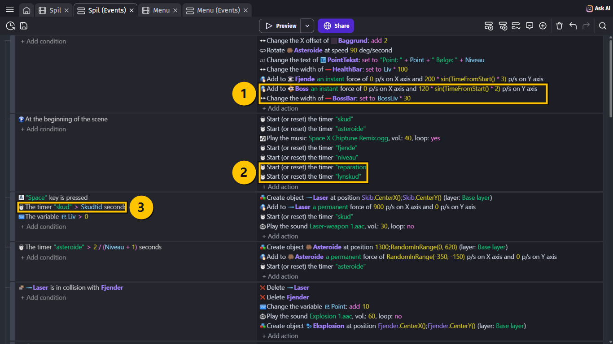

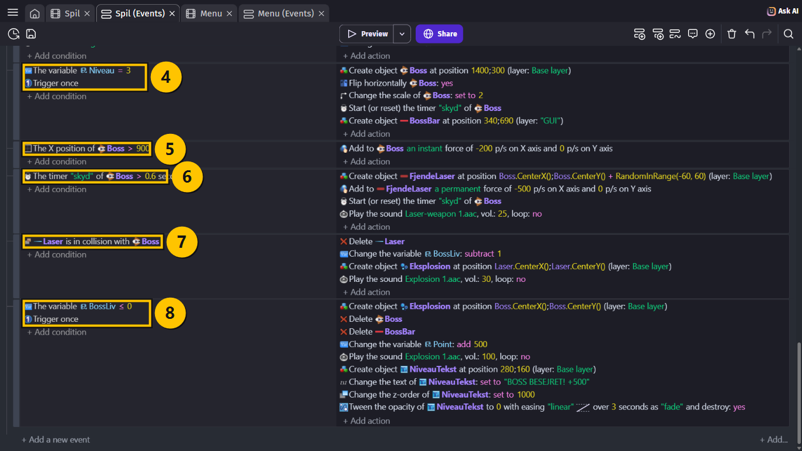

## Prøv spillet! 🎮

> **GØR DETTE**
>
> 1. Tryk **Ctrl + S** for at gemme.
> 2. Gå til fanen **Menu**, og vælg **Preview**.
> 3. Saml et gult lyn op, og hold mellemrumstasten nede.
> 4. Overlev til bølge 3, og besejr bossen!
{: .lesson-action}

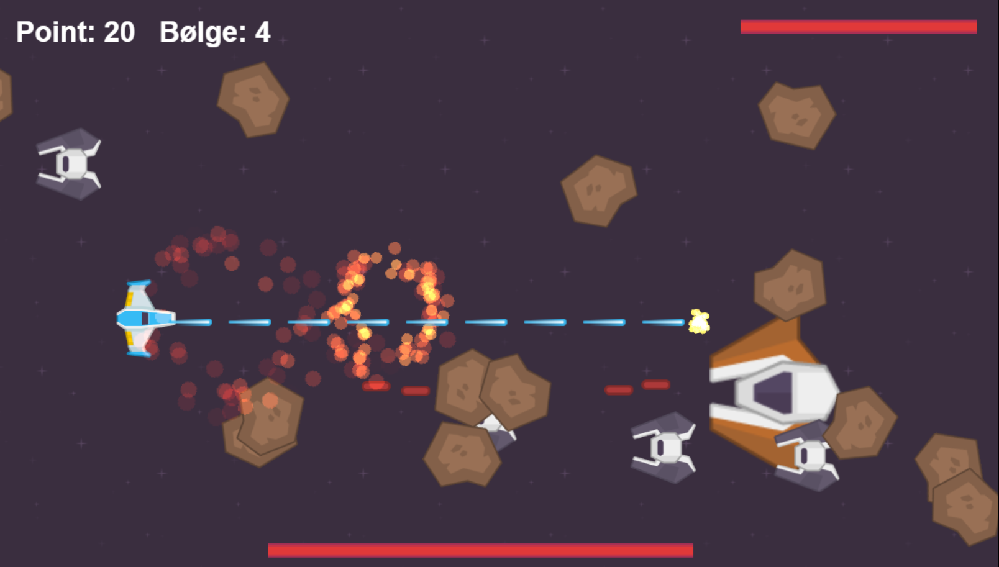

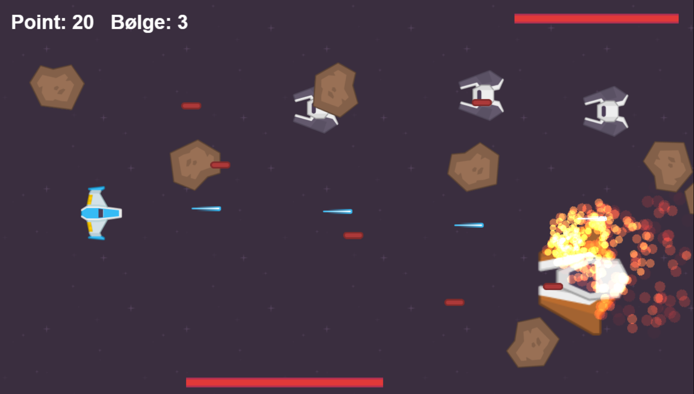

> **VIDEN**
>
> Sådan skal det virke:
>
> - Hvert 10. sekund kommer et gult lyn, og hvert 15. sekund et blåt skjold.
> - Lynet giver hurtige skud i 5 sekunder. Skjoldet giver ét liv tilbage.
> - I bølge 3 kommer bossen ind fra højre. Den er dobbelt så stor og har en health bar
>   nederst.
> - Bossen skal rammes 20 gange. Så sprænger den, og du får 500 point.
>
> **Tip til at teste:** Skift `20` ud med `5` i timeren `"niveau"`, så bossen kommer
> hurtigere. Husk at skifte tilbage!
{: .lesson-info}

## Ekstra: Gør bossen farligere

> **GØR DETTE**
>
> Prøv en af disse:
>
> 1. Skift `0.6` ud med `0.3` i bossens skud-event. Nu skyder den dobbelt så tit.
> 2. Skift `BossLiv` til `40`, og skift `BossLiv * 30` ud med `BossLiv * 15`.
> 3. Lav et event mere: når `BossLiv` **<** `10`, skal bossen skyde hurtigere.
{: .lesson-action}

> **VIDEN**
>
> Nummer 3 er svær. Tip: Lav en ny timer-condition på `Boss`, og tilføj `BossLiv < 10`
> som ekstra condition.
{: .lesson-info}

## Du er færdig med RUMSPIL 🏆

> **VIDEN**
>
> Tillykke! Du har bygget et helt rumspil med:
>
> - et skib, der flyver og skyder,
> - asteroider, fjender i bølger og en stor boss,
> - eksplosioner, lyd og musik,
> - liv, health bar, power-ups og GAME OVER,
> - en menu og en highscore, der bliver gemt.
>
> Spillet er dit. Lav flere slags fjender, nye våben, en boss nummer to — eller din helt
> egen grafik. Del det med dine venner, og se, om de kan slå din highscore!
{: .lesson-info}

## Hvis noget går galt

| Problem | Prøv dette |
|---|---|
| Der kommer ingen power-ups. | **GØR DETTE:** Tjek, at event 2 starter timerne `"reparation"` og `"lynskud"`. |
| Lynet virker ikke. | **GØR DETTE:** Tjek, at event 3 bruger `Skudtid` i stedet for `0.25`. |
| Skibet skyder hurtigt for altid. | **GØR DETTE:** Tjek, at event D starter timeren `"hurtig"`, og at event E sætter `Skudtid` tilbage. |
| Health baren bliver for lang. | **GØR DETTE:** Brug `min(Liv + 1, 3)`, ikke bare `Liv + 1`. |
| Bossen kommer aldrig. | **GØR DETTE:** Bossen kommer først i bølge 3, efter 40 sekunder. Skift `20` til `5` i timeren `"niveau"` for at teste. |
| Bossen flyver ud til venstre. | **GØR DETTE:** Kraften `-200` skal være **Instant** og kun ske, når `X position` er **>** `900`. |
| Bossen vender forkert. | **GØR DETTE:** Tilføj **Flip the object horizontally: Yes** til bossens event. |
| Bossens health bar ændrer sig ikke. | **GØR DETTE:** Tjek, at event 1 har **Change the width of BossBar: set to BossLiv * 30**. |
| Der står BOSS BESEJRET! mange gange. | **GØR DETTE:** Tilføj **Trigger once while true** til det sidste event. |
{: .lesson-help}
